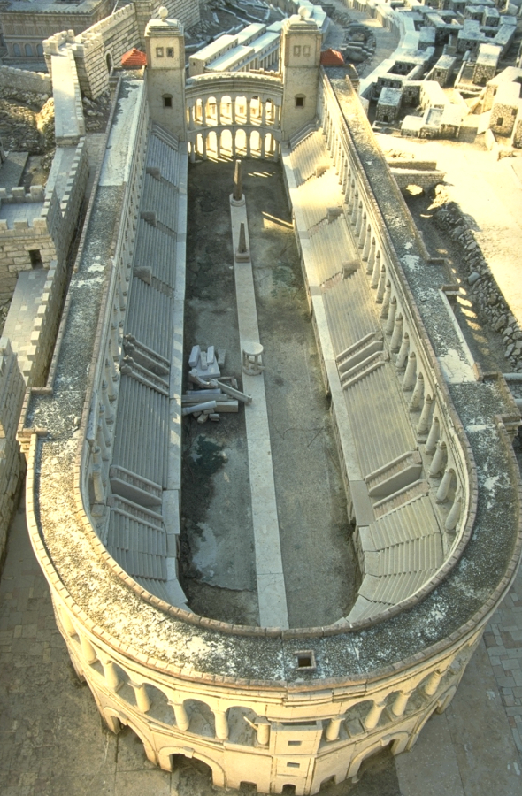

# Human-made Things in the Bible

## License Information

Human-made Things in the Bible © United Bible Societies, 2025. Adapted from: <cite>The Works of Their Hands: Man-made Things in the Bible</cite>, by Ray Pritz © 2009 United Bible Societies. This work is licensed under Creative Commons Attribution-ShareAlike 4.0 International (<a href="https://creativecommons.org/licenses/by-sa/4.0/">https://creativecommons.org/licenses/by-sa/4.0/</a>).

--------------------------------

## Stadium (id: REALIA:3.13.6)

3\.13\.6 Stadium
================

References:
-----------

Greek ἱππόδρομος (hippodromos)

[3MA 4:11](https://ref.ly/3Macc4:11), [3MA 5:46](https://ref.ly/3Macc5:46), [3MA 6:16](https://ref.ly/3Macc6:16)

Greek παλαίστρα (palaistra)

[2MA 4:14](https://ref.ly/2Macc4:14)

Greek στάδιον (stadion)

[1CO 9:24](https://ref.ly/1Cor9:24)

Description and usage:
----------------------

*Model of a Roman stadium (© Ray Pritz by United Bible Societies)*

The stadium was an open, oval area (frequently including a racetrack) around which was built an enclosed series of tiers of seats for those who came to watch the spectacles.

---

Translation:
------------

In [1CO 9:24](https://ref.ly/1Cor9:24) the important feature is not the stadium as a construction, but as a place where races were conducted. Accordingly, the literal phrase “all the runners in the stadium” may very well be rendered as “all the runners who are racing.” The focus here is upon the competition rather than upon the type of place in which the competition took place.

* **Associated Passages:** 3 Maccabees 4:11; 3 Maccabees 5:46; 3 Maccabees 6:16; 2 Maccabees 4:14; 1 Corinthians 9:24

