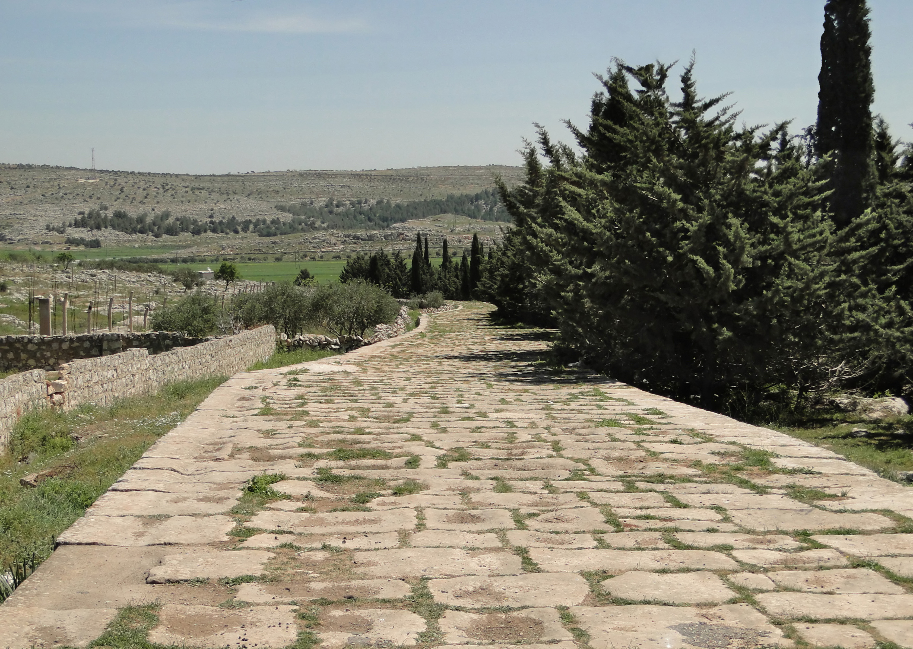
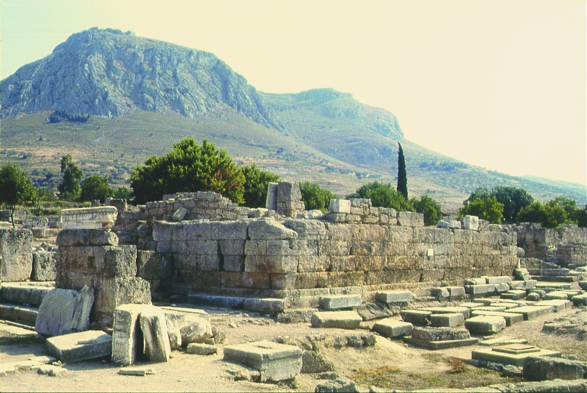

# Human-made Things in the Bible

## License Information

Human-made Things in the Bible © United Bible Societies, 2025. Adapted from: <cite>The Works of Their Hands: Man-made Things in the Bible</cite>, by Ray Pritz © 2009 United Bible Societies. This work is licensed under Creative Commons Attribution-ShareAlike 4.0 International (<a href="https://creativecommons.org/licenses/by-sa/4.0/">https://creativecommons.org/licenses/by-sa/4.0/</a>).

--------------------------------

## Municipal structures (id: REALIA:3.13)

3\.13 Municipal structures
==========================

## Street, road, path, way, track (id: REALIA:3.13.1)

3\.13\.1 Street, road, path, way, track
=======================================

References:
-----------

Hebrew אֹרַח (’orach)

[GEN 49:17](https://ref.ly/Gen49:17), [JDG 5:6](https://ref.ly/Judg5:6), [JOB 8:13](https://ref.ly/Job8:13), [JOB 13:27](https://ref.ly/Job13:27), [JOB 16:22](https://ref.ly/Job16:22), [JOB 19:8](https://ref.ly/Job19:8), [JOB 22:15](https://ref.ly/Job22:15), [JOB 30:12](https://ref.ly/Job30:12), [JOB 33:11](https://ref.ly/Job33:11), [JOB 34:11](https://ref.ly/Job34:11), [PSA 8:9](https://ref.ly/Ps8:9), [PSA 16:11](https://ref.ly/Ps16:11), [PSA 17:4](https://ref.ly/Ps17:4), [PSA 19:6](https://ref.ly/Ps19:6), [PSA 25:4](https://ref.ly/Ps25:4), [PSA 25:10](https://ref.ly/Ps25:10), [PSA 27:11](https://ref.ly/Ps27:11), [PSA 44:19](https://ref.ly/Ps44:19), [PSA 119:9](https://ref.ly/Ps119:9), [PSA 119:15](https://ref.ly/Ps119:15), [PSA 119:101](https://ref.ly/Ps119:101), [PSA 119:104](https://ref.ly/Ps119:104), [PSA 119:128](https://ref.ly/Ps119:128), [PSA 142:4](https://ref.ly/Ps142:4), [PRO 1:19](https://ref.ly/Prov1:19), [PRO 2:8](https://ref.ly/Prov2:8), [PRO 2:13](https://ref.ly/Prov2:13), [PRO 2:15](https://ref.ly/Prov2:15), [PRO 2:19](https://ref.ly/Prov2:19), [PRO 2:20](https://ref.ly/Prov2:20), [PRO 3:6](https://ref.ly/Prov3:6), [PRO 4:14](https://ref.ly/Prov4:14), [PRO 4:18](https://ref.ly/Prov4:18), [PRO 5:6](https://ref.ly/Prov5:6), [PRO 8:20](https://ref.ly/Prov8:20), [PRO 9:15](https://ref.ly/Prov9:15), [PRO 10:17](https://ref.ly/Prov10:17), [PRO 12:28](https://ref.ly/Prov12:28), [PRO 15:10](https://ref.ly/Prov15:10), [PRO 15:19](https://ref.ly/Prov15:19), [PRO 15:24](https://ref.ly/Prov15:24), [PRO 17:23](https://ref.ly/Prov17:23), [PRO 22:25](https://ref.ly/Prov22:25), [PRO 22:25](https://ref.ly/Prov22:25), [ISA 2:3](https://ref.ly/Isa2:3), [ISA 3:12](https://ref.ly/Isa3:12), [ISA 26:7](https://ref.ly/Isa26:7), [ISA 26:8](https://ref.ly/Isa26:8), [ISA 30:11](https://ref.ly/Isa30:11), [ISA 33:8](https://ref.ly/Isa33:8), [ISA 40:14](https://ref.ly/Isa40:14), [ISA 41:3](https://ref.ly/Isa41:3), [JOL 2:7](https://ref.ly/Joel2:7), [MIC 4:2](https://ref.ly/Mic4:2)

Hebrew דֶּרֶךְ (derek)

[GEN 3:24](https://ref.ly/Gen3:24), [GEN 6:12](https://ref.ly/Gen6:12), [GEN 16:7](https://ref.ly/Gen16:7), [GEN 18:19](https://ref.ly/Gen18:19), [GEN 19:2](https://ref.ly/Gen19:2), [GEN 19:31](https://ref.ly/Gen19:31), [GEN 24:21](https://ref.ly/Gen24:21), [GEN 24:27](https://ref.ly/Gen24:27), [GEN 24:40](https://ref.ly/Gen24:40), [GEN 24:42](https://ref.ly/Gen24:42), [GEN 24:48](https://ref.ly/Gen24:48), [GEN 24:56](https://ref.ly/Gen24:56), [GEN 28:20](https://ref.ly/Gen28:20), [GEN 30:36](https://ref.ly/Gen30:36), [GEN 31:23](https://ref.ly/Gen31:23), [GEN 32:2](https://ref.ly/Gen32:2), [GEN 33:16](https://ref.ly/Gen33:16), [GEN 35:3](https://ref.ly/Gen35:3), [GEN 35:19](https://ref.ly/Gen35:19), [GEN 38:14](https://ref.ly/Gen38:14), [GEN 38:16](https://ref.ly/Gen38:16), [GEN 38:21](https://ref.ly/Gen38:21), [GEN 42:25](https://ref.ly/Gen42:25), [GEN 42:38](https://ref.ly/Gen42:38), [GEN 45:21](https://ref.ly/Gen45:21), [GEN 45:23](https://ref.ly/Gen45:23), [GEN 45:24](https://ref.ly/Gen45:24), [GEN 48:7](https://ref.ly/Gen48:7), [GEN 48:7](https://ref.ly/Gen48:7), [GEN 49:17](https://ref.ly/Gen49:17), [EXO 3:18](https://ref.ly/Exod3:18), [EXO 4:24](https://ref.ly/Exod4:24), [EXO 5:3](https://ref.ly/Exod5:3), [EXO 8:23](https://ref.ly/Exod8:23), [EXO 13:17](https://ref.ly/Exod13:17), [EXO 13:18](https://ref.ly/Exod13:18), [EXO 13:21](https://ref.ly/Exod13:21), [EXO 18:8](https://ref.ly/Exod18:8), [EXO 18:20](https://ref.ly/Exod18:20), [EXO 23:20](https://ref.ly/Exod23:20), [EXO 32:8](https://ref.ly/Exod32:8), [EXO 33:3](https://ref.ly/Exod33:3), [EXO 33:13](https://ref.ly/Exod33:13), [LEV 26:22](https://ref.ly/Lev26:22), [NUM 9:10](https://ref.ly/Num9:10), [NUM 9:13](https://ref.ly/Num9:13), [NUM 10:33](https://ref.ly/Num10:33), [NUM 10:33](https://ref.ly/Num10:33), [NUM 11:31](https://ref.ly/Num11:31), [NUM 11:31](https://ref.ly/Num11:31), [NUM 14:25](https://ref.ly/Num14:25), [NUM 20:17](https://ref.ly/Num20:17), [NUM 21:1](https://ref.ly/Num21:1), [NUM 21:4](https://ref.ly/Num21:4), [NUM 21:4](https://ref.ly/Num21:4), [NUM 21:22](https://ref.ly/Num21:22), [NUM 21:33](https://ref.ly/Num21:33), [NUM 22:22](https://ref.ly/Num22:22), [NUM 22:23](https://ref.ly/Num22:23), [NUM 22:23](https://ref.ly/Num22:23), [NUM 22:23](https://ref.ly/Num22:23), [NUM 22:26](https://ref.ly/Num22:26), [NUM 22:31](https://ref.ly/Num22:31), [NUM 22:32](https://ref.ly/Num22:32), [NUM 22:34](https://ref.ly/Num22:34), [NUM 24:25](https://ref.ly/Num24:25), [NUM 33:8](https://ref.ly/Num33:8), [DEU 1:2](https://ref.ly/Deut1:2), [DEU 1:19](https://ref.ly/Deut1:19), [DEU 1:22](https://ref.ly/Deut1:22), [DEU 1:31](https://ref.ly/Deut1:31), [DEU 1:33](https://ref.ly/Deut1:33), [DEU 1:33](https://ref.ly/Deut1:33), [DEU 1:40](https://ref.ly/Deut1:40), [DEU 2:1](https://ref.ly/Deut2:1), [DEU 2:8](https://ref.ly/Deut2:8), [DEU 2:8](https://ref.ly/Deut2:8), [DEU 2:27](https://ref.ly/Deut2:27), [DEU 2:27](https://ref.ly/Deut2:27), [DEU 3:1](https://ref.ly/Deut3:1), [DEU 5:33](https://ref.ly/Deut5:33), [DEU 6:7](https://ref.ly/Deut6:7), [DEU 8:2](https://ref.ly/Deut8:2), [DEU 8:6](https://ref.ly/Deut8:6), [DEU 9:12](https://ref.ly/Deut9:12), [DEU 9:16](https://ref.ly/Deut9:16), [DEU 10:12](https://ref.ly/Deut10:12), [DEU 11:19](https://ref.ly/Deut11:19), [DEU 11:22](https://ref.ly/Deut11:22), [DEU 11:28](https://ref.ly/Deut11:28), [DEU 11:30](https://ref.ly/Deut11:30), [DEU 13:6](https://ref.ly/Deut13:6), [DEU 14:24](https://ref.ly/Deut14:24), [DEU 17:16](https://ref.ly/Deut17:16), [DEU 19:3](https://ref.ly/Deut19:3), [DEU 19:6](https://ref.ly/Deut19:6), [DEU 19:9](https://ref.ly/Deut19:9), [DEU 22:4](https://ref.ly/Deut22:4), [DEU 22:6](https://ref.ly/Deut22:6), [DEU 23:5](https://ref.ly/Deut23:5), [DEU 24:9](https://ref.ly/Deut24:9), [DEU 25:17](https://ref.ly/Deut25:17), [DEU 25:18](https://ref.ly/Deut25:18), [DEU 26:17](https://ref.ly/Deut26:17), [DEU 27:18](https://ref.ly/Deut27:18), [DEU 28:7](https://ref.ly/Deut28:7), [DEU 28:7](https://ref.ly/Deut28:7), [DEU 28:9](https://ref.ly/Deut28:9), [DEU 28:25](https://ref.ly/Deut28:25), [DEU 28:25](https://ref.ly/Deut28:25), [DEU 28:29](https://ref.ly/Deut28:29), [DEU 28:68](https://ref.ly/Deut28:68), [DEU 30:16](https://ref.ly/Deut30:16), [DEU 31:29](https://ref.ly/Deut31:29), [DEU 32:4](https://ref.ly/Deut32:4), [JOS 1:8](https://ref.ly/Josh1:8), [JOS 2:7](https://ref.ly/Josh2:7), [JOS 2:16](https://ref.ly/Josh2:16), [JOS 2:22](https://ref.ly/Josh2:22), [JOS 3:4](https://ref.ly/Josh3:4), [JOS 3:4](https://ref.ly/Josh3:4), [JOS 5:4](https://ref.ly/Josh5:4), [JOS 5:5](https://ref.ly/Josh5:5), [JOS 5:7](https://ref.ly/Josh5:7), [JOS 8:15](https://ref.ly/Josh8:15), [JOS 9:11](https://ref.ly/Josh9:11), [JOS 9:13](https://ref.ly/Josh9:13), [JOS 10:10](https://ref.ly/Josh10:10), [JOS 12:3](https://ref.ly/Josh12:3), [JOS 22:5](https://ref.ly/Josh22:5), [JOS 23:14](https://ref.ly/Josh23:14), [JOS 24:17](https://ref.ly/Josh24:17), [JDG 2:17](https://ref.ly/Judg2:17), [JDG 2:19](https://ref.ly/Judg2:19), [JDG 2:22](https://ref.ly/Judg2:22), [JDG 4:9](https://ref.ly/Judg4:9), [JDG 5:10](https://ref.ly/Judg5:10), [JDG 8:11](https://ref.ly/Judg8:11), [JDG 9:25](https://ref.ly/Judg9:25), [JDG 9:37](https://ref.ly/Judg9:37), [JDG 17:8](https://ref.ly/Judg17:8), [JDG 18:5](https://ref.ly/Judg18:5), [JDG 18:6](https://ref.ly/Judg18:6), [JDG 18:26](https://ref.ly/Judg18:26), [JDG 19:9](https://ref.ly/Judg19:9), [JDG 19:27](https://ref.ly/Judg19:27), [JDG 20:42](https://ref.ly/Judg20:42), [RUT 1:7](https://ref.ly/Ruth1:7), [1SA 1:18](https://ref.ly/1Sam1:18), [1SA 4:13](https://ref.ly/1Sam4:13), [1SA 6:9](https://ref.ly/1Sam6:9), [1SA 6:12](https://ref.ly/1Sam6:12), [1SA 6:12](https://ref.ly/1Sam6:12), [1SA 8:3](https://ref.ly/1Sam8:3), [1SA 8:3](https://ref.ly/1Sam8:3), [1SA 8:5](https://ref.ly/1Sam8:5), [1SA 9:6](https://ref.ly/1Sam9:6), [1SA 9:8](https://ref.ly/1Sam9:8), [1SA 12:23](https://ref.ly/1Sam12:23), [1SA 13:17](https://ref.ly/1Sam13:17), [1SA 13:18](https://ref.ly/1Sam13:18), [1SA 13:18](https://ref.ly/1Sam13:18), [1SA 15:2](https://ref.ly/1Sam15:2), [1SA 15:18](https://ref.ly/1Sam15:18), [1SA 15:20](https://ref.ly/1Sam15:20), [1SA 17:52](https://ref.ly/1Sam17:52), [1SA 18:14](https://ref.ly/1Sam18:14), [1SA 21:6](https://ref.ly/1Sam21:6), [1SA 24:4](https://ref.ly/1Sam24:4), [1SA 24:8](https://ref.ly/1Sam24:8), [1SA 24:20](https://ref.ly/1Sam24:20), [1SA 25:12](https://ref.ly/1Sam25:12), [1SA 26:3](https://ref.ly/1Sam26:3), [1SA 26:25](https://ref.ly/1Sam26:25), [1SA 28:22](https://ref.ly/1Sam28:22), [1SA 30:2](https://ref.ly/1Sam30:2), [2SA 2:24](https://ref.ly/2Sam2:24), [2SA 4:7](https://ref.ly/2Sam4:7), [2SA 11:10](https://ref.ly/2Sam11:10), [2SA 13:30](https://ref.ly/2Sam13:30), [2SA 13:34](https://ref.ly/2Sam13:34), [2SA 15:2](https://ref.ly/2Sam15:2), [2SA 15:23](https://ref.ly/2Sam15:23), [2SA 16:13](https://ref.ly/2Sam16:13), [2SA 18:23](https://ref.ly/2Sam18:23), [2SA 22:22](https://ref.ly/2Sam22:22), [2SA 22:31](https://ref.ly/2Sam22:31), [2SA 22:33](https://ref.ly/2Sam22:33), [2SA 22:33](https://ref.ly/2Sam22:33), [1KI 1:49](https://ref.ly/1Kgs1:49), [1KI 2:2](https://ref.ly/1Kgs2:2), [1KI 2:3](https://ref.ly/1Kgs2:3), [1KI 2:4](https://ref.ly/1Kgs2:4), [1KI 3:14](https://ref.ly/1Kgs3:14), [1KI 8:25](https://ref.ly/1Kgs8:25), [1KI 8:32](https://ref.ly/1Kgs8:32), [1KI 8:36](https://ref.ly/1Kgs8:36), [1KI 8:39](https://ref.ly/1Kgs8:39), [1KI 8:44](https://ref.ly/1Kgs8:44), [1KI 8:44](https://ref.ly/1Kgs8:44), [1KI 8:48](https://ref.ly/1Kgs8:48), [1KI 8:58](https://ref.ly/1Kgs8:58), [1KI 11:29](https://ref.ly/1Kgs11:29), [1KI 11:33](https://ref.ly/1Kgs11:33), [1KI 11:38](https://ref.ly/1Kgs11:38), [1KI 13:9](https://ref.ly/1Kgs13:9), [1KI 13:10](https://ref.ly/1Kgs13:10), [1KI 13:10](https://ref.ly/1Kgs13:10), [1KI 13:12](https://ref.ly/1Kgs13:12), [1KI 13:12](https://ref.ly/1Kgs13:12), [1KI 13:17](https://ref.ly/1Kgs13:17), [1KI 13:24](https://ref.ly/1Kgs13:24), [1KI 13:24](https://ref.ly/1Kgs13:24), [1KI 13:25](https://ref.ly/1Kgs13:25), [1KI 13:26](https://ref.ly/1Kgs13:26), [1KI 13:28](https://ref.ly/1Kgs13:28), [1KI 13:33](https://ref.ly/1Kgs13:33), [1KI 15:26](https://ref.ly/1Kgs15:26), [1KI 15:34](https://ref.ly/1Kgs15:34), [1KI 16:2](https://ref.ly/1Kgs16:2), [1KI 16:19](https://ref.ly/1Kgs16:19), [1KI 16:26](https://ref.ly/1Kgs16:26), [1KI 18:6](https://ref.ly/1Kgs18:6), [1KI 18:6](https://ref.ly/1Kgs18:6), [1KI 18:7](https://ref.ly/1Kgs18:7), [1KI 18:27](https://ref.ly/1Kgs18:27), [1KI 18:43](https://ref.ly/1Kgs18:43), [1KI 19:4](https://ref.ly/1Kgs19:4), [1KI 19:7](https://ref.ly/1Kgs19:7), [1KI 19:15](https://ref.ly/1Kgs19:15), [1KI 20:38](https://ref.ly/1Kgs20:38), [1KI 22:43](https://ref.ly/1Kgs22:43), [1KI 22:53](https://ref.ly/1Kgs22:53), [1KI 22:53](https://ref.ly/1Kgs22:53), [1KI 22:53](https://ref.ly/1Kgs22:53), [2KI 2:23](https://ref.ly/2Kgs2:23), [2KI 3:8](https://ref.ly/2Kgs3:8), [2KI 3:8](https://ref.ly/2Kgs3:8), [2KI 3:9](https://ref.ly/2Kgs3:9), [2KI 3:20](https://ref.ly/2Kgs3:20), [2KI 6:19](https://ref.ly/2Kgs6:19), [2KI 7:15](https://ref.ly/2Kgs7:15), [2KI 8:18](https://ref.ly/2Kgs8:18), [2KI 8:27](https://ref.ly/2Kgs8:27), [2KI 9:27](https://ref.ly/2Kgs9:27), [2KI 10:12](https://ref.ly/2Kgs10:12), [2KI 11:16](https://ref.ly/2Kgs11:16), [2KI 11:19](https://ref.ly/2Kgs11:19), [2KI 16:3](https://ref.ly/2Kgs16:3), [2KI 17:13](https://ref.ly/2Kgs17:13), [2KI 19:28](https://ref.ly/2Kgs19:28), [2KI 19:33](https://ref.ly/2Kgs19:33), [2KI 21:21](https://ref.ly/2Kgs21:21), [2KI 21:22](https://ref.ly/2Kgs21:22), [2KI 22:2](https://ref.ly/2Kgs22:2), [2KI 25:4](https://ref.ly/2Kgs25:4), [2KI 25:4](https://ref.ly/2Kgs25:4), [2CH 6:16](https://ref.ly/2Chr6:16), [2CH 6:23](https://ref.ly/2Chr6:23), [2CH 6:27](https://ref.ly/2Chr6:27), [2CH 6:30](https://ref.ly/2Chr6:30), [2CH 6:31](https://ref.ly/2Chr6:31), [2CH 6:34](https://ref.ly/2Chr6:34), [2CH 6:34](https://ref.ly/2Chr6:34), [2CH 7:14](https://ref.ly/2Chr7:14), [2CH 11:17](https://ref.ly/2Chr11:17), [2CH 13:22](https://ref.ly/2Chr13:22), [2CH 17:3](https://ref.ly/2Chr17:3), [2CH 17:6](https://ref.ly/2Chr17:6), [2CH 18:23](https://ref.ly/2Chr18:23), [2CH 20:32](https://ref.ly/2Chr20:32), [2CH 21:6](https://ref.ly/2Chr21:6), [2CH 21:12](https://ref.ly/2Chr21:12), [2CH 21:12](https://ref.ly/2Chr21:12), [2CH 21:13](https://ref.ly/2Chr21:13), [2CH 22:3](https://ref.ly/2Chr22:3), [2CH 27:6](https://ref.ly/2Chr27:6), [2CH 27:7](https://ref.ly/2Chr27:7), [2CH 28:2](https://ref.ly/2Chr28:2), [2CH 28:26](https://ref.ly/2Chr28:26), [2CH 34:2](https://ref.ly/2Chr34:2), [EZR 8:21](https://ref.ly/Ezra8:21), [EZR 8:22](https://ref.ly/Ezra8:22), [EZR 8:31](https://ref.ly/Ezra8:31), [NEH 9:12](https://ref.ly/Neh9:12), [NEH 9:19](https://ref.ly/Neh9:19), [NEH 9:19](https://ref.ly/Neh9:19), [JOB 3:23](https://ref.ly/Job3:23), [JOB 4:6](https://ref.ly/Job4:6), [JOB 6:18](https://ref.ly/Job6:18), [JOB 8:19](https://ref.ly/Job8:19), [JOB 12:24](https://ref.ly/Job12:24), [JOB 13:15](https://ref.ly/Job13:15), [JOB 17:9](https://ref.ly/Job17:9), [JOB 19:12](https://ref.ly/Job19:12), [JOB 21:14](https://ref.ly/Job21:14), [JOB 21:29](https://ref.ly/Job21:29), [JOB 21:31](https://ref.ly/Job21:31), [JOB 22:3](https://ref.ly/Job22:3), [JOB 22:28](https://ref.ly/Job22:28), [JOB 23:10](https://ref.ly/Job23:10), [JOB 23:11](https://ref.ly/Job23:11), [JOB 24:4](https://ref.ly/Job24:4), [JOB 24:13](https://ref.ly/Job24:13), [JOB 24:18](https://ref.ly/Job24:18), [JOB 24:23](https://ref.ly/Job24:23), [JOB 26:14](https://ref.ly/Job26:14), [JOB 26:14](https://ref.ly/Job26:14), [JOB 28:23](https://ref.ly/Job28:23), [JOB 28:26](https://ref.ly/Job28:26), [JOB 29:25](https://ref.ly/Job29:25), [JOB 31:4](https://ref.ly/Job31:4), [JOB 31:7](https://ref.ly/Job31:7), [JOB 34:21](https://ref.ly/Job34:21), [JOB 34:27](https://ref.ly/Job34:27), [JOB 36:23](https://ref.ly/Job36:23), [JOB 38:19](https://ref.ly/Job38:19), [JOB 38:24](https://ref.ly/Job38:24), [JOB 38:25](https://ref.ly/Job38:25), [JOB 40:19](https://ref.ly/Job40:19), [PSA 1:1](https://ref.ly/Ps1:1), [PSA 1:6](https://ref.ly/Ps1:6), [PSA 1:6](https://ref.ly/Ps1:6), [PSA 2:12](https://ref.ly/Ps2:12), [PSA 5:9](https://ref.ly/Ps5:9), [PSA 10:5](https://ref.ly/Ps10:5), [PSA 10:5](https://ref.ly/Ps10:5), [PSA 18:22](https://ref.ly/Ps18:22), [PSA 18:31](https://ref.ly/Ps18:31), [PSA 18:33](https://ref.ly/Ps18:33), [PSA 25:4](https://ref.ly/Ps25:4), [PSA 25:8](https://ref.ly/Ps25:8), [PSA 25:9](https://ref.ly/Ps25:9), [PSA 25:12](https://ref.ly/Ps25:12), [PSA 27:11](https://ref.ly/Ps27:11), [PSA 32:8](https://ref.ly/Ps32:8), [PSA 35:6](https://ref.ly/Ps35:6), [PSA 36:5](https://ref.ly/Ps36:5), [PSA 37:5](https://ref.ly/Ps37:5), [PSA 37:7](https://ref.ly/Ps37:7), [PSA 37:14](https://ref.ly/Ps37:14), [PSA 37:23](https://ref.ly/Ps37:23), [PSA 37:34](https://ref.ly/Ps37:34), [PSA 39:2](https://ref.ly/Ps39:2), [PSA 49:14](https://ref.ly/Ps49:14), [PSA 50:23](https://ref.ly/Ps50:23), [PSA 51:15](https://ref.ly/Ps51:15), [PSA 67:3](https://ref.ly/Ps67:3), [PSA 77:14](https://ref.ly/Ps77:14), [PSA 77:20](https://ref.ly/Ps77:20), [PSA 80:13](https://ref.ly/Ps80:13), [PSA 81:14](https://ref.ly/Ps81:14), [PSA 85:14](https://ref.ly/Ps85:14), [PSA 86:11](https://ref.ly/Ps86:11), [PSA 89:42](https://ref.ly/Ps89:42), [PSA 91:11](https://ref.ly/Ps91:11), [PSA 95:10](https://ref.ly/Ps95:10), [PSA 101:2](https://ref.ly/Ps101:2), [PSA 101:6](https://ref.ly/Ps101:6), [PSA 102:24](https://ref.ly/Ps102:24), [PSA 103:7](https://ref.ly/Ps103:7), [PSA 107:4](https://ref.ly/Ps107:4), [PSA 107:7](https://ref.ly/Ps107:7), [PSA 107:17](https://ref.ly/Ps107:17), [PSA 107:40](https://ref.ly/Ps107:40), [PSA 110:7](https://ref.ly/Ps110:7), [PSA 119:1](https://ref.ly/Ps119:1), [PSA 119:3](https://ref.ly/Ps119:3), [PSA 119:5](https://ref.ly/Ps119:5), [PSA 119:14](https://ref.ly/Ps119:14), [PSA 119:26](https://ref.ly/Ps119:26), [PSA 119:27](https://ref.ly/Ps119:27), [PSA 119:29](https://ref.ly/Ps119:29), [PSA 119:30](https://ref.ly/Ps119:30), [PSA 119:32](https://ref.ly/Ps119:32), [PSA 119:33](https://ref.ly/Ps119:33), [PSA 119:37](https://ref.ly/Ps119:37), [PSA 119:59](https://ref.ly/Ps119:59), [PSA 119:168](https://ref.ly/Ps119:168), [PSA 128:1](https://ref.ly/Ps128:1), [PSA 138:5](https://ref.ly/Ps138:5), [PSA 139:3](https://ref.ly/Ps139:3), [PSA 139:24](https://ref.ly/Ps139:24), [PSA 139:24](https://ref.ly/Ps139:24), [PSA 143:8](https://ref.ly/Ps143:8), [PSA 145:17](https://ref.ly/Ps145:17), [PSA 146:9](https://ref.ly/Ps146:9), [PRO 1:15](https://ref.ly/Prov1:15), [PRO 1:31](https://ref.ly/Prov1:31), [PRO 2:8](https://ref.ly/Prov2:8), [PRO 2:12](https://ref.ly/Prov2:12), [PRO 2:13](https://ref.ly/Prov2:13), [PRO 2:20](https://ref.ly/Prov2:20), [PRO 3:6](https://ref.ly/Prov3:6), [PRO 3:17](https://ref.ly/Prov3:17), [PRO 3:17](https://ref.ly/Prov3:17), [PRO 3:23](https://ref.ly/Prov3:23), [PRO 3:31](https://ref.ly/Prov3:31), [PRO 4:11](https://ref.ly/Prov4:11), [PRO 4:14](https://ref.ly/Prov4:14), [PRO 4:19](https://ref.ly/Prov4:19), [PRO 4:26](https://ref.ly/Prov4:26), [PRO 5:8](https://ref.ly/Prov5:8), [PRO 5:21](https://ref.ly/Prov5:21), [PRO 6:6](https://ref.ly/Prov6:6), [PRO 6:23](https://ref.ly/Prov6:23), [PRO 7:8](https://ref.ly/Prov7:8), [PRO 7:19](https://ref.ly/Prov7:19), [PRO 7:25](https://ref.ly/Prov7:25), [PRO 7:27](https://ref.ly/Prov7:27), [PRO 8:2](https://ref.ly/Prov8:2), [PRO 8:13](https://ref.ly/Prov8:13), [PRO 8:22](https://ref.ly/Prov8:22), [PRO 8:32](https://ref.ly/Prov8:32), [PRO 9:6](https://ref.ly/Prov9:6), [PRO 9:15](https://ref.ly/Prov9:15), [PRO 10:9](https://ref.ly/Prov10:9), [PRO 10:29](https://ref.ly/Prov10:29), [PRO 11:5](https://ref.ly/Prov11:5), [PRO 11:20](https://ref.ly/Prov11:20), [PRO 12:15](https://ref.ly/Prov12:15), [PRO 12:26](https://ref.ly/Prov12:26), [PRO 12:28](https://ref.ly/Prov12:28), [PRO 13:6](https://ref.ly/Prov13:6), [PRO 13:15](https://ref.ly/Prov13:15), [PRO 14:2](https://ref.ly/Prov14:2), [PRO 14:8](https://ref.ly/Prov14:8), [PRO 14:12](https://ref.ly/Prov14:12), [PRO 14:12](https://ref.ly/Prov14:12), [PRO 14:14](https://ref.ly/Prov14:14), [PRO 15:9](https://ref.ly/Prov15:9), [PRO 15:19](https://ref.ly/Prov15:19), [PRO 16:2](https://ref.ly/Prov16:2), [PRO 16:7](https://ref.ly/Prov16:7), [PRO 16:9](https://ref.ly/Prov16:9), [PRO 16:17](https://ref.ly/Prov16:17), [PRO 16:25](https://ref.ly/Prov16:25), [PRO 16:25](https://ref.ly/Prov16:25), [PRO 16:29](https://ref.ly/Prov16:29), [PRO 16:31](https://ref.ly/Prov16:31), [PRO 19:3](https://ref.ly/Prov19:3), [PRO 19:16](https://ref.ly/Prov19:16), [PRO 20:24](https://ref.ly/Prov20:24), [PRO 21:2](https://ref.ly/Prov21:2), [PRO 21:8](https://ref.ly/Prov21:8), [PRO 21:16](https://ref.ly/Prov21:16), [PRO 21:29](https://ref.ly/Prov21:29), [PRO 21:29](https://ref.ly/Prov21:29), [PRO 22:5](https://ref.ly/Prov22:5), [PRO 22:6](https://ref.ly/Prov22:6), [PRO 23:19](https://ref.ly/Prov23:19), [PRO 23:26](https://ref.ly/Prov23:26), [PRO 26:13](https://ref.ly/Prov26:13), [PRO 28:6](https://ref.ly/Prov28:6), [PRO 28:10](https://ref.ly/Prov28:10), [PRO 28:18](https://ref.ly/Prov28:18), [PRO 29:27](https://ref.ly/Prov29:27), [PRO 30:19](https://ref.ly/Prov30:19), [PRO 30:19](https://ref.ly/Prov30:19), [PRO 30:19](https://ref.ly/Prov30:19), [PRO 30:19](https://ref.ly/Prov30:19), [PRO 30:20](https://ref.ly/Prov30:20), [PRO 31:3](https://ref.ly/Prov31:3), [ECC 10:3](https://ref.ly/Eccl10:3), [ECC 11:5](https://ref.ly/Eccl11:5), [ECC 11:9](https://ref.ly/Eccl11:9), [ECC 12:5](https://ref.ly/Eccl12:5), [ISA 2:3](https://ref.ly/Isa2:3), [ISA 3:12](https://ref.ly/Isa3:12), [ISA 8:11](https://ref.ly/Isa8:11), [ISA 8:23](https://ref.ly/Isa8:23), [ISA 10:24](https://ref.ly/Isa10:24), [ISA 10:26](https://ref.ly/Isa10:26), [ISA 15:5](https://ref.ly/Isa15:5), [ISA 30:11](https://ref.ly/Isa30:11), [ISA 30:21](https://ref.ly/Isa30:21), [ISA 35:8](https://ref.ly/Isa35:8), [ISA 35:8](https://ref.ly/Isa35:8), [ISA 35:8](https://ref.ly/Isa35:8), [ISA 37:29](https://ref.ly/Isa37:29), [ISA 37:34](https://ref.ly/Isa37:34), [ISA 40:3](https://ref.ly/Isa40:3), [ISA 40:14](https://ref.ly/Isa40:14), [ISA 40:27](https://ref.ly/Isa40:27), [ISA 42:16](https://ref.ly/Isa42:16), [ISA 42:24](https://ref.ly/Isa42:24), [ISA 43:16](https://ref.ly/Isa43:16), [ISA 43:19](https://ref.ly/Isa43:19), [ISA 45:13](https://ref.ly/Isa45:13), [ISA 48:15](https://ref.ly/Isa48:15), [ISA 48:17](https://ref.ly/Isa48:17), [ISA 49:9](https://ref.ly/Isa49:9), [ISA 49:11](https://ref.ly/Isa49:11), [ISA 51:10](https://ref.ly/Isa51:10), [ISA 53:6](https://ref.ly/Isa53:6), [ISA 55:7](https://ref.ly/Isa55:7), [ISA 55:8](https://ref.ly/Isa55:8), [ISA 55:8](https://ref.ly/Isa55:8), [ISA 55:9](https://ref.ly/Isa55:9), [ISA 55:9](https://ref.ly/Isa55:9), [ISA 56:11](https://ref.ly/Isa56:11), [ISA 57:10](https://ref.ly/Isa57:10), [ISA 57:14](https://ref.ly/Isa57:14), [ISA 57:14](https://ref.ly/Isa57:14), [ISA 57:17](https://ref.ly/Isa57:17), [ISA 57:18](https://ref.ly/Isa57:18), [ISA 58:2](https://ref.ly/Isa58:2), [ISA 58:13](https://ref.ly/Isa58:13), [ISA 59:8](https://ref.ly/Isa59:8), [ISA 62:10](https://ref.ly/Isa62:10), [ISA 63:17](https://ref.ly/Isa63:17), [ISA 64:4](https://ref.ly/Isa64:4), [ISA 65:2](https://ref.ly/Isa65:2), [ISA 66:3](https://ref.ly/Isa66:3), [JER 2:17](https://ref.ly/Jer2:17), [JER 2:18](https://ref.ly/Jer2:18), [JER 2:18](https://ref.ly/Jer2:18), [JER 2:23](https://ref.ly/Jer2:23), [JER 2:23](https://ref.ly/Jer2:23), [JER 2:33](https://ref.ly/Jer2:33), [JER 2:33](https://ref.ly/Jer2:33), [JER 2:36](https://ref.ly/Jer2:36), [JER 3:2](https://ref.ly/Jer3:2), [JER 3:13](https://ref.ly/Jer3:13), [JER 3:21](https://ref.ly/Jer3:21), [JER 4:11](https://ref.ly/Jer4:11), [JER 4:18](https://ref.ly/Jer4:18), [JER 5:4](https://ref.ly/Jer5:4), [JER 5:5](https://ref.ly/Jer5:5), [JER 6:16](https://ref.ly/Jer6:16), [JER 6:16](https://ref.ly/Jer6:16), [JER 6:25](https://ref.ly/Jer6:25), [JER 6:27](https://ref.ly/Jer6:27), [JER 7:3](https://ref.ly/Jer7:3), [JER 7:5](https://ref.ly/Jer7:5), [JER 7:23](https://ref.ly/Jer7:23), [JER 10:2](https://ref.ly/Jer10:2), [JER 10:23](https://ref.ly/Jer10:23), [JER 12:1](https://ref.ly/Jer12:1), [JER 12:16](https://ref.ly/Jer12:16), [JER 15:7](https://ref.ly/Jer15:7), [JER 16:17](https://ref.ly/Jer16:17), [JER 17:10](https://ref.ly/Jer17:10), [JER 17:10](https://ref.ly/Jer17:10), [JER 18:11](https://ref.ly/Jer18:11), [JER 18:11](https://ref.ly/Jer18:11), [JER 18:15](https://ref.ly/Jer18:15), [JER 18:15](https://ref.ly/Jer18:15), [JER 21:8](https://ref.ly/Jer21:8), [JER 21:8](https://ref.ly/Jer21:8), [JER 22:21](https://ref.ly/Jer22:21), [JER 23:12](https://ref.ly/Jer23:12), [JER 23:22](https://ref.ly/Jer23:22), [JER 25:5](https://ref.ly/Jer25:5), [JER 26:3](https://ref.ly/Jer26:3), [JER 26:13](https://ref.ly/Jer26:13), [JER 28:11](https://ref.ly/Jer28:11), [JER 31:9](https://ref.ly/Jer31:9), [JER 31:21](https://ref.ly/Jer31:21), [JER 32:19](https://ref.ly/Jer32:19), [JER 32:19](https://ref.ly/Jer32:19), [JER 32:39](https://ref.ly/Jer32:39), [JER 35:15](https://ref.ly/Jer35:15), [JER 36:3](https://ref.ly/Jer36:3), [JER 36:7](https://ref.ly/Jer36:7), [JER 39:4](https://ref.ly/Jer39:4), [JER 39:4](https://ref.ly/Jer39:4), [JER 42:3](https://ref.ly/Jer42:3), [JER 48:19](https://ref.ly/Jer48:19), [JER 50:5](https://ref.ly/Jer50:5), [JER 52:7](https://ref.ly/Jer52:7), [JER 52:7](https://ref.ly/Jer52:7), [LAM 1:4](https://ref.ly/Lam1:4), [LAM 1:12](https://ref.ly/Lam1:12), [LAM 2:15](https://ref.ly/Lam2:15), [LAM 3:9](https://ref.ly/Lam3:9), [LAM 3:11](https://ref.ly/Lam3:11), [LAM 3:40](https://ref.ly/Lam3:40), [EZK 3:18](https://ref.ly/Ezek3:18), [EZK 3:19](https://ref.ly/Ezek3:19), [EZK 7:3](https://ref.ly/Ezek7:3), [EZK 7:4](https://ref.ly/Ezek7:4), [EZK 7:8](https://ref.ly/Ezek7:8), [EZK 7:9](https://ref.ly/Ezek7:9), [EZK 7:27](https://ref.ly/Ezek7:27), [EZK 8:5](https://ref.ly/Ezek8:5), [EZK 8:5](https://ref.ly/Ezek8:5), [EZK 9:2](https://ref.ly/Ezek9:2), [EZK 9:10](https://ref.ly/Ezek9:10), [EZK 11:21](https://ref.ly/Ezek11:21), [EZK 13:22](https://ref.ly/Ezek13:22), [EZK 14:22](https://ref.ly/Ezek14:22), [EZK 14:23](https://ref.ly/Ezek14:23), [EZK 16:25](https://ref.ly/Ezek16:25), [EZK 16:27](https://ref.ly/Ezek16:27), [EZK 16:31](https://ref.ly/Ezek16:31), [EZK 16:43](https://ref.ly/Ezek16:43), [EZK 16:47](https://ref.ly/Ezek16:47), [EZK 16:47](https://ref.ly/Ezek16:47), [EZK 16:61](https://ref.ly/Ezek16:61), [EZK 18:23](https://ref.ly/Ezek18:23), [EZK 18:25](https://ref.ly/Ezek18:25), [EZK 18:25](https://ref.ly/Ezek18:25), [EZK 18:25](https://ref.ly/Ezek18:25), [EZK 18:29](https://ref.ly/Ezek18:29), [EZK 18:29](https://ref.ly/Ezek18:29), [EZK 18:29](https://ref.ly/Ezek18:29), [EZK 18:30](https://ref.ly/Ezek18:30), [EZK 20:30](https://ref.ly/Ezek20:30), [EZK 20:43](https://ref.ly/Ezek20:43), [EZK 20:44](https://ref.ly/Ezek20:44), [EZK 21:2](https://ref.ly/Ezek21:2), [EZK 21:24](https://ref.ly/Ezek21:24), [EZK 21:24](https://ref.ly/Ezek21:24), [EZK 21:25](https://ref.ly/Ezek21:25), [EZK 21:26](https://ref.ly/Ezek21:26), [EZK 21:26](https://ref.ly/Ezek21:26), [EZK 22:31](https://ref.ly/Ezek22:31), [EZK 23:13](https://ref.ly/Ezek23:13), [EZK 23:31](https://ref.ly/Ezek23:31), [EZK 24:14](https://ref.ly/Ezek24:14), [EZK 28:15](https://ref.ly/Ezek28:15), [EZK 33:8](https://ref.ly/Ezek33:8), [EZK 33:9](https://ref.ly/Ezek33:9), [EZK 33:9](https://ref.ly/Ezek33:9), [EZK 33:11](https://ref.ly/Ezek33:11), [EZK 33:11](https://ref.ly/Ezek33:11), [EZK 33:17](https://ref.ly/Ezek33:17), [EZK 33:17](https://ref.ly/Ezek33:17), [EZK 33:20](https://ref.ly/Ezek33:20), [EZK 33:20](https://ref.ly/Ezek33:20), [EZK 36:17](https://ref.ly/Ezek36:17), [EZK 36:17](https://ref.ly/Ezek36:17), [EZK 36:19](https://ref.ly/Ezek36:19), [EZK 36:31](https://ref.ly/Ezek36:31), [EZK 36:32](https://ref.ly/Ezek36:32), [EZK 40:6](https://ref.ly/Ezek40:6), [EZK 40:10](https://ref.ly/Ezek40:10), [EZK 40:20](https://ref.ly/Ezek40:20), [EZK 40:22](https://ref.ly/Ezek40:22), [EZK 40:24](https://ref.ly/Ezek40:24), [EZK 40:24](https://ref.ly/Ezek40:24), [EZK 40:27](https://ref.ly/Ezek40:27), [EZK 40:27](https://ref.ly/Ezek40:27), [EZK 40:32](https://ref.ly/Ezek40:32), [EZK 40:44](https://ref.ly/Ezek40:44), [EZK 40:44](https://ref.ly/Ezek40:44), [EZK 40:45](https://ref.ly/Ezek40:45), [EZK 40:46](https://ref.ly/Ezek40:46), [EZK 41:11](https://ref.ly/Ezek41:11), [EZK 41:12](https://ref.ly/Ezek41:12), [EZK 42:1](https://ref.ly/Ezek42:1), [EZK 42:1](https://ref.ly/Ezek42:1), [EZK 42:4](https://ref.ly/Ezek42:4), [EZK 42:7](https://ref.ly/Ezek42:7), [EZK 42:10](https://ref.ly/Ezek42:10), [EZK 42:11](https://ref.ly/Ezek42:11), [EZK 42:11](https://ref.ly/Ezek42:11), [EZK 42:12](https://ref.ly/Ezek42:12), [EZK 42:12](https://ref.ly/Ezek42:12), [EZK 42:12](https://ref.ly/Ezek42:12), [EZK 42:12](https://ref.ly/Ezek42:12), [EZK 42:15](https://ref.ly/Ezek42:15), [EZK 42:15](https://ref.ly/Ezek42:15), [EZK 43:1](https://ref.ly/Ezek43:1), [EZK 43:2](https://ref.ly/Ezek43:2), [EZK 43:4](https://ref.ly/Ezek43:4), [EZK 43:4](https://ref.ly/Ezek43:4), [EZK 44:1](https://ref.ly/Ezek44:1), [EZK 44:3](https://ref.ly/Ezek44:3), [EZK 44:3](https://ref.ly/Ezek44:3), [EZK 44:4](https://ref.ly/Ezek44:4), [EZK 46:2](https://ref.ly/Ezek46:2), [EZK 46:8](https://ref.ly/Ezek46:8), [EZK 46:8](https://ref.ly/Ezek46:8), [EZK 46:9](https://ref.ly/Ezek46:9), [EZK 46:9](https://ref.ly/Ezek46:9), [EZK 46:9](https://ref.ly/Ezek46:9), [EZK 46:9](https://ref.ly/Ezek46:9), [EZK 46:9](https://ref.ly/Ezek46:9), [EZK 47:2](https://ref.ly/Ezek47:2), [EZK 47:2](https://ref.ly/Ezek47:2), [EZK 47:2](https://ref.ly/Ezek47:2), [EZK 47:15](https://ref.ly/Ezek47:15), [EZK 48:1](https://ref.ly/Ezek48:1), [HOS 2:8](https://ref.ly/Hos2:8), [HOS 4:9](https://ref.ly/Hos4:9), [HOS 6:9](https://ref.ly/Hos6:9), [HOS 9:8](https://ref.ly/Hos9:8), [HOS 10:13](https://ref.ly/Hos10:13), [HOS 12:3](https://ref.ly/Hos12:3), [HOS 13:7](https://ref.ly/Hos13:7), [HOS 14:10](https://ref.ly/Hos14:10), [JOL 2:7](https://ref.ly/Joel2:7), [AMO 2:7](https://ref.ly/Amos2:7), [AMO 4:10](https://ref.ly/Amos4:10), [AMO 8:14](https://ref.ly/Amos8:14), [JON 3:8](https://ref.ly/Jonah3:8), [JON 3:10](https://ref.ly/Jonah3:10), [MIC 4:2](https://ref.ly/Mic4:2), [NAM 1:3](https://ref.ly/Nah1:3), [NAM 2:2](https://ref.ly/Nah2:2), [HAG 1:5](https://ref.ly/Hag1:5), [HAG 1:7](https://ref.ly/Hag1:7), [ZEC 1:4](https://ref.ly/Zech1:4), [ZEC 1:6](https://ref.ly/Zech1:6), [ZEC 3:7](https://ref.ly/Zech3:7), [MAL 2:8](https://ref.ly/Mal2:8), [MAL 2:9](https://ref.ly/Mal2:9), [MAL 3:1](https://ref.ly/Mal3:1)

Hebrew חוּץ (chuts)

[2SA 1:20](https://ref.ly/2Sam1:20), [2SA 22:43](https://ref.ly/2Sam22:43), [1KI 20:34](https://ref.ly/1Kgs20:34), [PSA 18:43](https://ref.ly/Ps18:43), [ISA 5:25](https://ref.ly/Isa5:25), [ISA 10:6](https://ref.ly/Isa10:6), [ISA 15:3](https://ref.ly/Isa15:3), [ISA 24:11](https://ref.ly/Isa24:11), [ISA 51:20](https://ref.ly/Isa51:20), [JER 5:1](https://ref.ly/Jer5:1), [JER 7:17](https://ref.ly/Jer7:17), [JER 7:34](https://ref.ly/Jer7:34), [JER 11:6](https://ref.ly/Jer11:6), [JER 11:13](https://ref.ly/Jer11:13), [JER 14:16](https://ref.ly/Jer14:16), [JER 33:10](https://ref.ly/Jer33:10), [JER 44:6](https://ref.ly/Jer44:6), [JER 44:9](https://ref.ly/Jer44:9), [JER 44:17](https://ref.ly/Jer44:17), [JER 44:21](https://ref.ly/Jer44:21), [JER 51:4](https://ref.ly/Jer51:4), [LAM 2:19](https://ref.ly/Lam2:19), [LAM 2:21](https://ref.ly/Lam2:21), [LAM 4:1](https://ref.ly/Lam4:1), [LAM 4:5](https://ref.ly/Lam4:5), [LAM 4:8](https://ref.ly/Lam4:8), [LAM 4:14](https://ref.ly/Lam4:14), [EZK 7:19](https://ref.ly/Ezek7:19), [EZK 11:6](https://ref.ly/Ezek11:6), [EZK 26:11](https://ref.ly/Ezek26:11), [EZK 28:23](https://ref.ly/Ezek28:23), [AMO 5:16](https://ref.ly/Amos5:16), [MIC 7:10](https://ref.ly/Mic7:10), [NAM 2:5](https://ref.ly/Nah2:5), [NAM 3:10](https://ref.ly/Nah3:10), [ZEP 3:6](https://ref.ly/Zeph3:6), [ZEC 9:3](https://ref.ly/Zech9:3), [ZEC 10:5](https://ref.ly/Zech10:5)

Hebrew מְסִלָּה (msilah)

[NUM 20:19](https://ref.ly/Num20:19), [JDG 5:20](https://ref.ly/Judg5:20), [JDG 20:32](https://ref.ly/Judg20:32), [JDG 20:45](https://ref.ly/Judg20:45), [JDG 21:19](https://ref.ly/Judg21:19), [1SA 6:12](https://ref.ly/1Sam6:12), [2SA 20:12](https://ref.ly/2Sam20:12), [2SA 20:12](https://ref.ly/2Sam20:12), [2SA 20:13](https://ref.ly/2Sam20:13), [2KI 18:17](https://ref.ly/2Kgs18:17), [1CH 26:16](https://ref.ly/1Chr26:16), [1CH 26:18](https://ref.ly/1Chr26:18), [2CH 9:11](https://ref.ly/2Chr9:11), [PSA 84:6](https://ref.ly/Ps84:6), [PRO 16:17](https://ref.ly/Prov16:17), [ISA 7:3](https://ref.ly/Isa7:3), [ISA 11:16](https://ref.ly/Isa11:16), [ISA 19:23](https://ref.ly/Isa19:23), [ISA 33:8](https://ref.ly/Isa33:8), [ISA 36:2](https://ref.ly/Isa36:2), [ISA 40:3](https://ref.ly/Isa40:3), [ISA 49:11](https://ref.ly/Isa49:11), [ISA 59:7](https://ref.ly/Isa59:7), [ISA 62:10](https://ref.ly/Isa62:10), [JER 31:21](https://ref.ly/Jer31:21), [JOL 2:8](https://ref.ly/Joel2:8)

Hebrew מַסְלוּל (maslul)

[ISA 35:8](https://ref.ly/Isa35:8)

Hebrew מַעְגָּל (ma‘gal, ma‘galah)

[PSA 17:5](https://ref.ly/Ps17:5), [PSA 23:3](https://ref.ly/Ps23:3), [PSA 65:12](https://ref.ly/Ps65:12), [PSA 140:6](https://ref.ly/Ps140:6), [PRO 2:9](https://ref.ly/Prov2:9), [PRO 2:15](https://ref.ly/Prov2:15), [PRO 2:18](https://ref.ly/Prov2:18), [PRO 4:11](https://ref.ly/Prov4:11), [PRO 4:26](https://ref.ly/Prov4:26), [PRO 5:6](https://ref.ly/Prov5:6), [PRO 5:21](https://ref.ly/Prov5:21), [ISA 26:7](https://ref.ly/Isa26:7), [ISA 59:8](https://ref.ly/Isa59:8)

Hebrew מִשְׁעוֹל (mish‘ol)

[NUM 22:24](https://ref.ly/Num22:24)

Hebrew נָתִיב, נְתִיבָה (nathiv, nthivah)

[JDG 5:6](https://ref.ly/Judg5:6), [JOB 18:10](https://ref.ly/Job18:10), [JOB 19:8](https://ref.ly/Job19:8), [JOB 24:13](https://ref.ly/Job24:13), [JOB 28:7](https://ref.ly/Job28:7), [JOB 30:13](https://ref.ly/Job30:13), [JOB 38:20](https://ref.ly/Job38:20), [JOB 41:24](https://ref.ly/Job41:24), [PSA 78:50](https://ref.ly/Ps78:50), [PSA 119:35](https://ref.ly/Ps119:35), [PSA 119:105](https://ref.ly/Ps119:105), [PSA 142:4](https://ref.ly/Ps142:4), [PRO 1:15](https://ref.ly/Prov1:15), [PRO 3:17](https://ref.ly/Prov3:17), [PRO 7:25](https://ref.ly/Prov7:25), [PRO 8:2](https://ref.ly/Prov8:2), [PRO 8:20](https://ref.ly/Prov8:20), [PRO 12:28](https://ref.ly/Prov12:28), [ISA 42:16](https://ref.ly/Isa42:16), [ISA 43:16](https://ref.ly/Isa43:16), [ISA 58:12](https://ref.ly/Isa58:12), [ISA 59:8](https://ref.ly/Isa59:8), [JER 6:16](https://ref.ly/Jer6:16), [JER 18:15](https://ref.ly/Jer18:15), [LAM 3:9](https://ref.ly/Lam3:9), [HOS 2:8](https://ref.ly/Hos2:8)

Hebrew שְׁבִיל (shvil)

[JER 18:15](https://ref.ly/Jer18:15)

Hebrew שׁוּק (shuq)

[PRO 7:8](https://ref.ly/Prov7:8), [ECC 12:4](https://ref.ly/Eccl12:4), [ECC 12:5](https://ref.ly/Eccl12:5), [SNG 3:2](https://ref.ly/Song3:2)

Greek ἀγυιά (aguia)

[3MA 1:20](https://ref.ly/3Macc1:20), [3MA 4:3](https://ref.ly/3Macc4:3)

Greek ἀτραπός (atrapos)

[SIR 5:9](https://ref.ly/Sir5:9)

Greek δίοδος (diodos)

[1MA 11:46](https://ref.ly/1Macc11:46)

Greek ὁδός (hodos)

[MAT 2:12](https://ref.ly/Matt2:12), [MAT 3:3](https://ref.ly/Matt3:3), [MAT 4:15](https://ref.ly/Matt4:15), [MAT 5:25](https://ref.ly/Matt5:25), [MAT 7:13](https://ref.ly/Matt7:13), [MAT 7:14](https://ref.ly/Matt7:14), [MAT 8:28](https://ref.ly/Matt8:28), [MAT 10:5](https://ref.ly/Matt10:5), [MAT 10:10](https://ref.ly/Matt10:10), [MAT 11:10](https://ref.ly/Matt11:10), [MAT 13:4](https://ref.ly/Matt13:4), [MAT 13:19](https://ref.ly/Matt13:19), [MAT 15:32](https://ref.ly/Matt15:32), [MAT 20:17](https://ref.ly/Matt20:17), [MAT 20:30](https://ref.ly/Matt20:30), [MAT 21:8](https://ref.ly/Matt21:8), [MAT 21:8](https://ref.ly/Matt21:8), [MAT 21:19](https://ref.ly/Matt21:19), [MAT 21:32](https://ref.ly/Matt21:32), [MAT 22:9](https://ref.ly/Matt22:9), [MAT 22:10](https://ref.ly/Matt22:10), [MAT 22:16](https://ref.ly/Matt22:16), [MRK 1:2](https://ref.ly/Mark1:2), [MRK 1:3](https://ref.ly/Mark1:3), [MRK 4:4](https://ref.ly/Mark4:4), [MRK 4:15](https://ref.ly/Mark4:15), [MRK 6:8](https://ref.ly/Mark6:8), [MRK 8:3](https://ref.ly/Mark8:3), [MRK 8:27](https://ref.ly/Mark8:27), [MRK 9:33](https://ref.ly/Mark9:33), [MRK 9:34](https://ref.ly/Mark9:34), [MRK 10:17](https://ref.ly/Mark10:17), [MRK 10:32](https://ref.ly/Mark10:32), [MRK 10:46](https://ref.ly/Mark10:46), [MRK 10:52](https://ref.ly/Mark10:52), [MRK 11:8](https://ref.ly/Mark11:8), [MRK 12:14](https://ref.ly/Mark12:14), [LUK 1:76](https://ref.ly/Luke1:76), [LUK 1:79](https://ref.ly/Luke1:79), [LUK 2:44](https://ref.ly/Luke2:44), [LUK 3:4](https://ref.ly/Luke3:4), [LUK 3:5](https://ref.ly/Luke3:5), [LUK 7:27](https://ref.ly/Luke7:27), [LUK 8:5](https://ref.ly/Luke8:5), [LUK 8:12](https://ref.ly/Luke8:12), [LUK 9:3](https://ref.ly/Luke9:3), [LUK 9:57](https://ref.ly/Luke9:57), [LUK 10:4](https://ref.ly/Luke10:4), [LUK 10:31](https://ref.ly/Luke10:31), [LUK 11:6](https://ref.ly/Luke11:6), [LUK 12:58](https://ref.ly/Luke12:58), [LUK 14:23](https://ref.ly/Luke14:23), [LUK 18:35](https://ref.ly/Luke18:35), [LUK 19:36](https://ref.ly/Luke19:36), [LUK 20:21](https://ref.ly/Luke20:21), [LUK 24:32](https://ref.ly/Luke24:32), [LUK 24:35](https://ref.ly/Luke24:35), [JHN 1:23](https://ref.ly/John1:23), [JHN 14:4](https://ref.ly/John14:4), [JHN 14:5](https://ref.ly/John14:5), [JHN 14:6](https://ref.ly/John14:6), [ACT 1:12](https://ref.ly/Acts1:12), [ACT 2:28](https://ref.ly/Acts2:28), [ACT 8:26](https://ref.ly/Acts8:26), [ACT 8:36](https://ref.ly/Acts8:36), [ACT 8:39](https://ref.ly/Acts8:39), [ACT 9:17](https://ref.ly/Acts9:17), [ACT 9:27](https://ref.ly/Acts9:27), [ACT 13:10](https://ref.ly/Acts13:10), [ACT 14:16](https://ref.ly/Acts14:16), [ACT 16:17](https://ref.ly/Acts16:17), [ACT 18:25](https://ref.ly/Acts18:25), [ACT 18:26](https://ref.ly/Acts18:26), [ACT 25:3](https://ref.ly/Acts25:3), [ACT 26:13](https://ref.ly/Acts26:13), [ROM 3:16](https://ref.ly/Rom3:16), [ROM 3:17](https://ref.ly/Rom3:17), [ROM 11:33](https://ref.ly/Rom11:33), [1CO 4:17](https://ref.ly/1Cor4:17), [1CO 12:31](https://ref.ly/1Cor12:31), [1TH 3:11](https://ref.ly/1Thess3:11), [HEB 3:10](https://ref.ly/Heb3:10), [HEB 9:8](https://ref.ly/Heb9:8), [HEB 10:20](https://ref.ly/Heb10:20), [JAS 2:25](https://ref.ly/Jas2:25), [JAS 5:20](https://ref.ly/Jas5:20), [2PE 2:2](https://ref.ly/2Pet2:2), [2PE 2:15](https://ref.ly/2Pet2:15), [2PE 2:15](https://ref.ly/2Pet2:15), [2PE 2:21](https://ref.ly/2Pet2:21), [JUD 1:11](https://ref.ly/Jude1:11), [REV 15:3](https://ref.ly/Rev15:3), [REV 16:12](https://ref.ly/Rev16:12), [TOB 1:2](https://ref.ly/Tob1:2), [TOB 1:3](https://ref.ly/Tob1:3), [TOB 1:15](https://ref.ly/Tob1:15), [TOB 3:2](https://ref.ly/Tob3:2), [TOB 4:5](https://ref.ly/Tob4:5), [TOB 5:2](https://ref.ly/Tob5:2), [TOB 5:4](https://ref.ly/Tob5:4), [TOB 5:5](https://ref.ly/Tob5:5), [TOB 5:6](https://ref.ly/Tob5:6), [TOB 5:6](https://ref.ly/Tob5:6), [TOB 5:17](https://ref.ly/Tob5:17), [TOB 5:17](https://ref.ly/Tob5:17), [TOB 5:17](https://ref.ly/Tob5:17), [TOB 5:22](https://ref.ly/Tob5:22), [TOB 10:7](https://ref.ly/Tob10:7), [TOB 10:14](https://ref.ly/Tob10:14), [TOB 11:5](https://ref.ly/Tob11:5), [TOB 11:15](https://ref.ly/Tob11:15), [JDT 2:21](https://ref.ly/Jdt2:21), [JDT 5:8](https://ref.ly/Jdt5:8), [JDT 5:14](https://ref.ly/Jdt5:14), [JDT 5:18](https://ref.ly/Jdt5:18), [JDT 9:6](https://ref.ly/Jdt9:6), [JDT 10:13](https://ref.ly/Jdt10:13), [JDT 12:8](https://ref.ly/Jdt12:8), [JDT 13:16](https://ref.ly/Jdt13:16), [JDT 14:4](https://ref.ly/Jdt14:4), [JDT 15:2](https://ref.ly/Jdt15:2), [WIS 2:16](https://ref.ly/Wis2:16), [WIS 5:6](https://ref.ly/Wis5:6), [WIS 5:7](https://ref.ly/Wis5:7), [WIS 10:17](https://ref.ly/Wis10:17), [WIS 12:24](https://ref.ly/Wis12:24), [WIS 14:3](https://ref.ly/Wis14:3), [WIS 18:23](https://ref.ly/Wis18:23), [WIS 19:7](https://ref.ly/Wis19:7), [SIR 2:6](https://ref.ly/Sir2:6), [SIR 2:15](https://ref.ly/Sir2:15), [SIR 6:26](https://ref.ly/Sir6:26), [SIR 8:15](https://ref.ly/Sir8:15), [SIR 11:26](https://ref.ly/Sir11:26), [SIR 14:21](https://ref.ly/Sir14:21), [SIR 14:22](https://ref.ly/Sir14:22), [SIR 16:20](https://ref.ly/Sir16:20), [SIR 17:15](https://ref.ly/Sir17:15), [SIR 17:19](https://ref.ly/Sir17:19), [SIR 21:10](https://ref.ly/Sir21:10), [SIR 21:16](https://ref.ly/Sir21:16), [SIR 23:19](https://ref.ly/Sir23:19), [SIR 32:20](https://ref.ly/Sir32:20), [SIR 32:21](https://ref.ly/Sir32:21), [SIR 33:11](https://ref.ly/Sir33:11), [SIR 33:13](https://ref.ly/Sir33:13), [SIR 33:33](https://ref.ly/Sir33:33), [SIR 37:9](https://ref.ly/Sir37:9), [SIR 37:15](https://ref.ly/Sir37:15), [SIR 39:24](https://ref.ly/Sir39:24), [SIR 47:24](https://ref.ly/Sir47:24), [SIR 48:22](https://ref.ly/Sir48:22), [SIR 49:6](https://ref.ly/Sir49:6), [SIR 49:9](https://ref.ly/Sir49:9), [BAR 2:33](https://ref.ly/Bar2:33), [BAR 3:13](https://ref.ly/Bar3:13), [BAR 3:20](https://ref.ly/Bar3:20), [BAR 3:21](https://ref.ly/Bar3:21), [BAR 3:23](https://ref.ly/Bar3:23), [BAR 3:27](https://ref.ly/Bar3:27), [BAR 3:31](https://ref.ly/Bar3:31), [BAR 3:37](https://ref.ly/Bar3:37), [BAR 4:13](https://ref.ly/Bar4:13), [BAR 4:26](https://ref.ly/Bar4:26), [LJE 1:42](https://ref.ly/EpJer1:42), [1MA 5:4](https://ref.ly/1Macc5:4), [1MA 5:24](https://ref.ly/1Macc5:24), [1MA 5:28](https://ref.ly/1Macc5:28), [1MA 5:46](https://ref.ly/1Macc5:46), [1MA 5:53](https://ref.ly/1Macc5:53), [1MA 6:33](https://ref.ly/1Macc6:33), [1MA 7:45](https://ref.ly/1Macc7:45), [1MA 8:19](https://ref.ly/1Macc8:19), [1MA 9:2](https://ref.ly/1Macc9:2), [1MA 11:4](https://ref.ly/1Macc11:4), [1MA 13:20](https://ref.ly/1Macc13:20), [1MA 15:41](https://ref.ly/1Macc15:41), [2MA 2:6](https://ref.ly/2Macc2:6), [2MA 3:19](https://ref.ly/2Macc3:19), [3MA 7:14](https://ref.ly/3Macc7:14), [4MA 14:5](https://ref.ly/4Macc14:5)

Greek πλατεῖα, πλατύς (plateia, platus)

[MAT 6:5](https://ref.ly/Matt6:5), [MAT 12:19](https://ref.ly/Matt12:19), [LUK 10:10](https://ref.ly/Luke10:10), [LUK 13:26](https://ref.ly/Luke13:26), [LUK 14:21](https://ref.ly/Luke14:21), [ACT 5:15](https://ref.ly/Acts5:15), [REV 11:8](https://ref.ly/Rev11:8), [REV 21:21](https://ref.ly/Rev21:21), [REV 22:2](https://ref.ly/Rev22:2), [TOB 2:4](https://ref.ly/Tob2:4), [TOB 13:17](https://ref.ly/Tob13:17), [JDT 1:14](https://ref.ly/Jdt1:14), [JDT 7:14](https://ref.ly/Jdt7:14), [JDT 7:22](https://ref.ly/Jdt7:22), [SIR 23:21](https://ref.ly/Sir23:21), [1MA 1:55](https://ref.ly/1Macc1:55), [1MA 2:9](https://ref.ly/1Macc2:9), [1MA 14:9](https://ref.ly/1Macc14:9), [3MA 1:18](https://ref.ly/3Macc1:18)

Greek ῥύμη (rhumē)

[MAT 6:2](https://ref.ly/Matt6:2), [LUK 14:21](https://ref.ly/Luke14:21), [ACT 9:11](https://ref.ly/Acts9:11), [ACT 12:10](https://ref.ly/Acts12:10), [SIR 9:7](https://ref.ly/Sir9:7)

Greek τρίβος (tribos)

[SIR 2:12](https://ref.ly/Sir2:12)

Greek τροχιά (trochia)

[HEB 12:13](https://ref.ly/Heb12:13)

Latin platea

[2ES 1:13](https://ref.ly/2Esd1:13)

Latin semita

[2ES 7:8](https://ref.ly/2Esd7:8)

Latin via

[2ES 16:33](https://ref.ly/2Esd16:33)

Description and usage:
----------------------

*Roman road of Tell Aquibrin (© Bernard Gagnon, CC BY\-SA 3\.0, via Wikimedia Commons)*

This entry includes a variety of roads, either shorter ones within a town or village or longer ones between cities and even countries. Most roads were not paved but were simply paths worn by the passage of many feet and vehicles. Some roads between cites (especially in the Roman period) and more streets within cities and towns were paved, usually with stones.

---

Translation:
------------

Some languages contain a wide variety of words for roads within settled areas like towns or cities and also between such urban units. Hebrew and Greek are no exception, with at least a dozen such words. While some of the words are general terms, others indicate roads differing in width, length, or purpose. Translators will, of course, want to choose words in their language that take the context into consideration.

Most of the roads mentioned in the Bible would have been local ways that were little more than wide walking paths. These were usually unpaved, followed the topography, and for the most part would not have been used by vehicles. Some of the roads mentioned in the New Testament were Roman roads and were specially prepared and paved with stone. This kind of road is mentioned, for example, in [MRK 10:46](https://ref.ly/Mark10:46). Strictly speaking, the roads within towns were not “man\-made” in the sense that they were not specially constructed according to some plan. They were simply the product of the space between buildings.

Some languages make a distinction between a road inside a town or city and one that passes through the countryside. Where the context is not clear and the language does not have a generic word for “road,” it will usually be best to select a word for a road that connects towns.

As with many languages, words for thoroughfares in Hebrew and Greek often serve figuratively to indicate the “way” a person lives or does something; for example, [PSA 1:1](https://ref.ly/Ps1:1) praises the person who does not “follow the example of sinners” (GNT (Good News Translation (1992))). The Hebrew text says literally “does not stand in the way of sinners.” Here a literal translation into English is a mistranslation, because the English idiom “to stand in someone’s way” means to prevent them from acting. NIV (New International Version (1984)) renders this verse literally by saying “Blessed is the man who does not … stand in the way of sinners … ,” which praises the person who allows sinners to do wrong. This, of course, is not the message of the text.

It is not clear just what Solomon built with algum wood in [2CH 9:11](https://ref.ly/2Chr9:11). The hilly topography of Jerusalem and the fact that Solomon used wood indicate that he could have made a kind of path “paved” with wood or even a kind of “boardwalk.” For the Hebrew word *msilah*NJPSV (New Jewish Publication Society Version) has “ramps,” and NKJV (New King James Version (1982)) says “walkways.” Many translations say “steps” (RSV (Revised Standard Version (1952)), NASB (New American Standard Bible)) here but inconsistently translate this word everywhere else as “highway,” “road,” or “path.”

The Hebrew words *ma’gal* and *ma’galah* are related to the word for “wagon” or “ox\-cart” (see [8\.2 Cart, wagon\<REALIA:8\.2\>](#)) and indicate the track in which the wheels of a wagon would go.

[MAT 6:2](https://ref.ly/Matt6:2): The word “streets” in this verse follows the Greek text and is the rendering of most translations (for example, RSV (Revised Standard Version (1952)), GNT (Good News Translation (1992))); Anchor Bible has “market places.” In some languages it may sound odd to have the people standing out in the middle of busy streets praying; any place where large crowds of people normally gather for daily activities, such as “marketplaces” or “street corners” (CEV (Contemporary English Version)), would seem a more satisfactory rendering. So instead of “in the streets,” translators may say “out in the middle of towns” or “in the busy parts of towns.” Also in [JDT 1:14](https://ref.ly/Jdt1:14) the rendering “marketplaces” (so NJB (New Jerusalem Bible (1985)), NAB (New American Bible (1970))) is better than “streets.”

* **Associated Passages:** Genesis 49:17; Judges 5:6; Job 8:13; Job 13:27; Job 16:22; Job 19:8; Job 22:15; Job 30:12; Job 33:11; Job 34:11; Psalms 8:9; Psalms 16:11; Psalms 17:4; Psalms 19:6; Psalms 25:4; Psalms 25:10; Psalms 27:11; Psalms 44:19; Psalms 119:9; Psalms 119:15; Psalms 119:101; Psalms 119:104; Psalms 119:128; Psalms 142:4; Proverbs 1:19; Proverbs 2:8; Proverbs 2:13; Proverbs 2:15; Proverbs 2:19; Proverbs 2:20; Proverbs 3:6; Proverbs 4:14; Proverbs 4:18; Proverbs 5:6; Proverbs 8:20; Proverbs 9:15; Proverbs 10:17; Proverbs 12:28; Proverbs 15:10; Proverbs 15:19; Proverbs 15:24; Proverbs 17:23; Proverbs 22:25; Isaiah 2:3; Isaiah 3:12; Isaiah 26:7; Isaiah 26:8; Isaiah 30:11; Isaiah 33:8; Isaiah 40:14; Isaiah 41:3; Joel 2:7; Micah 4:2; Genesis 3:24; Genesis 6:12; Genesis 16:7; Genesis 18:19; Genesis 19:2; Genesis 19:31; Genesis 24:21; Genesis 24:27; Genesis 24:40; Genesis 24:42; Genesis 24:48; Genesis 24:56; Genesis 28:20; Genesis 30:36; Genesis 31:23; Genesis 32:2; Genesis 33:16; Genesis 35:3; Genesis 35:19; Genesis 38:14; Genesis 38:16; Genesis 38:21; Genesis 42:25; Genesis 42:38; Genesis 45:21; Genesis 45:23; Genesis 45:24; Genesis 48:7; Exodus 3:18; Exodus 4:24; Exodus 5:3; Exodus 8:23; Exodus 13:17; Exodus 13:18; Exodus 13:21; Exodus 18:8; Exodus 18:20; Exodus 23:20; Exodus 32:8; Exodus 33:3; Exodus 33:13; Leviticus 26:22; Numbers 9:10; Numbers 9:13; Numbers 10:33; Numbers 11:31; Numbers 14:25; Numbers 20:17; Numbers 21:1; Numbers 21:4; Numbers 21:22; Numbers 21:33; Numbers 22:22; Numbers 22:23; Numbers 22:26; Numbers 22:31; Numbers 22:32; Numbers 22:34; Numbers 24:25; Numbers 33:8; Deuteronomy 1:2; Deuteronomy 1:19; Deuteronomy 1:22; Deuteronomy 1:31; Deuteronomy 1:33; Deuteronomy 1:40; Deuteronomy 2:1; Deuteronomy 2:8; Deuteronomy 2:27; Deuteronomy 3:1; Deuteronomy 5:33; Deuteronomy 6:7; Deuteronomy 8:2; Deuteronomy 8:6; Deuteronomy 9:12; Deuteronomy 9:16; Deuteronomy 10:12; Deuteronomy 11:19; Deuteronomy 11:22; Deuteronomy 11:28; Deuteronomy 11:30; Deuteronomy 13:6; Deuteronomy 14:24; Deuteronomy 17:16; Deuteronomy 19:3; Deuteronomy 19:6; Deuteronomy 19:9; Deuteronomy 22:4; Deuteronomy 22:6; Deuteronomy 23:5; Deuteronomy 24:9; Deuteronomy 25:17; Deuteronomy 25:18; Deuteronomy 26:17; Deuteronomy 27:18; Deuteronomy 28:7; Deuteronomy 28:9; Deuteronomy 28:25; Deuteronomy 28:29; Deuteronomy 28:68; Deuteronomy 30:16; Deuteronomy 31:29; Deuteronomy 32:4; Joshua 1:8; Joshua 2:7; Joshua 2:16; Joshua 2:22; Joshua 3:4; Joshua 5:4; Joshua 5:5; Joshua 5:7; Joshua 8:15; Joshua 9:11; Joshua 9:13; Joshua 10:10; Joshua 12:3; Joshua 22:5; Joshua 23:14; Joshua 24:17; Judges 2:17; Judges 2:19; Judges 2:22; Judges 4:9; Judges 5:10; Judges 8:11; Judges 9:25; Judges 9:37; Judges 17:8; Judges 18:5; Judges 18:6; Judges 18:26; Judges 19:9; Judges 19:27; Judges 20:42; Ruth 1:7; 1 Samuel 1:18; 1 Samuel 4:13; 1 Samuel 6:9; 1 Samuel 6:12; 1 Samuel 8:3; 1 Samuel 8:5; 1 Samuel 9:6; 1 Samuel 9:8; 1 Samuel 12:23; 1 Samuel 13:17; 1 Samuel 13:18; 1 Samuel 15:2; 1 Samuel 15:18; 1 Samuel 15:20; 1 Samuel 17:52; 1 Samuel 18:14; 1 Samuel 21:6; 1 Samuel 24:4; 1 Samuel 24:8; 1 Samuel 24:20; 1 Samuel 25:12; 1 Samuel 26:3; 1 Samuel 26:25; 1 Samuel 28:22; 1 Samuel 30:2; 2 Samuel 2:24; 2 Samuel 4:7; 2 Samuel 11:10; 2 Samuel 13:30; 2 Samuel 13:34; 2 Samuel 15:2; 2 Samuel 15:23; 2 Samuel 16:13; 2 Samuel 18:23; 2 Samuel 22:22; 2 Samuel 22:31; 2 Samuel 22:33; 1 Kings 1:49; 1 Kings 2:2; 1 Kings 2:3; 1 Kings 2:4; 1 Kings 3:14; 1 Kings 8:25; 1 Kings 8:32; 1 Kings 8:36; 1 Kings 8:39; 1 Kings 8:44; 1 Kings 8:48; 1 Kings 8:58; 1 Kings 11:29; 1 Kings 11:33; 1 Kings 11:38; 1 Kings 13:9; 1 Kings 13:10; 1 Kings 13:12; 1 Kings 13:17; 1 Kings 13:24; 1 Kings 13:25; 1 Kings 13:26; 1 Kings 13:28; 1 Kings 13:33; 1 Kings 15:26; 1 Kings 15:34; 1 Kings 16:2; 1 Kings 16:19; 1 Kings 16:26; 1 Kings 18:6; 1 Kings 18:7; 1 Kings 18:27; 1 Kings 18:43; 1 Kings 19:4; 1 Kings 19:7; 1 Kings 19:15; 1 Kings 20:38; 1 Kings 22:43; 1 Kings 22:53; 2 Kings 2:23; 2 Kings 3:8; 2 Kings 3:9; 2 Kings 3:20; 2 Kings 6:19; 2 Kings 7:15; 2 Kings 8:18; 2 Kings 8:27; 2 Kings 9:27; 2 Kings 10:12; 2 Kings 11:16; 2 Kings 11:19; 2 Kings 16:3; 2 Kings 17:13; 2 Kings 19:28; 2 Kings 19:33; 2 Kings 21:21; 2 Kings 21:22; 2 Kings 22:2; 2 Kings 25:4; 2 Chronicles 6:16; 2 Chronicles 6:23; 2 Chronicles 6:27; 2 Chronicles 6:30; 2 Chronicles 6:31; 2 Chronicles 6:34; 2 Chronicles 7:14; 2 Chronicles 11:17; 2 Chronicles 13:22; 2 Chronicles 17:3; 2 Chronicles 17:6; 2 Chronicles 18:23; 2 Chronicles 20:32; 2 Chronicles 21:6; 2 Chronicles 21:12; 2 Chronicles 21:13; 2 Chronicles 22:3; 2 Chronicles 27:6; 2 Chronicles 27:7; 2 Chronicles 28:2; 2 Chronicles 28:26; 2 Chronicles 34:2; Ezra 8:21; Ezra 8:22; Ezra 8:31; Nehemiah 9:12; Nehemiah 9:19; Job 3:23; Job 4:6; Job 6:18; Job 8:19; Job 12:24; Job 13:15; Job 17:9; Job 19:12; Job 21:14; Job 21:29; Job 21:31; Job 22:3; Job 22:28; Job 23:10; Job 23:11; Job 24:4; Job 24:13; Job 24:18; Job 24:23; Job 26:14; Job 28:23; Job 28:26; Job 29:25; Job 31:4; Job 31:7; Job 34:21; Job 34:27; Job 36:23; Job 38:19; Job 38:24; Job 38:25; Job 40:19; Psalms 1:1; Psalms 1:6; Psalms 2:12; Psalms 5:9; Psalms 10:5; Psalms 18:22; Psalms 18:31; Psalms 18:33; Psalms 25:8; Psalms 25:9; Psalms 25:12; Psalms 32:8; Psalms 35:6; Psalms 36:5; Psalms 37:5; Psalms 37:7; Psalms 37:14; Psalms 37:23; Psalms 37:34; Psalms 39:2; Psalms 49:14; Psalms 50:23; Psalms 51:15; Psalms 67:3; Psalms 77:14; Psalms 77:20; Psalms 80:13; Psalms 81:14; Psalms 85:14; Psalms 86:11; Psalms 89:42; Psalms 91:11; Psalms 95:10; Psalms 101:2; Psalms 101:6; Psalms 102:24; Psalms 103:7; Psalms 107:4; Psalms 107:7; Psalms 107:17; Psalms 107:40; Psalms 110:7; Psalms 119:1; Psalms 119:3; Psalms 119:5; Psalms 119:14; Psalms 119:26; Psalms 119:27; Psalms 119:29; Psalms 119:30; Psalms 119:32; Psalms 119:33; Psalms 119:37; Psalms 119:59; Psalms 119:168; Psalms 128:1; Psalms 138:5; Psalms 139:3; Psalms 139:24; Psalms 143:8; Psalms 145:17; Psalms 146:9; Proverbs 1:15; Proverbs 1:31; Proverbs 2:12; Proverbs 3:17; Proverbs 3:23; Proverbs 3:31; Proverbs 4:11; Proverbs 4:19; Proverbs 4:26; Proverbs 5:8; Proverbs 5:21; Proverbs 6:6; Proverbs 6:23; Proverbs 7:8; Proverbs 7:19; Proverbs 7:25; Proverbs 7:27; Proverbs 8:2; Proverbs 8:13; Proverbs 8:22; Proverbs 8:32; Proverbs 9:6; Proverbs 10:9; Proverbs 10:29; Proverbs 11:5; Proverbs 11:20; Proverbs 12:15; Proverbs 12:26; Proverbs 13:6; Proverbs 13:15; Proverbs 14:2; Proverbs 14:8; Proverbs 14:12; Proverbs 14:14; Proverbs 15:9; Proverbs 16:2; Proverbs 16:7; Proverbs 16:9; Proverbs 16:17; Proverbs 16:25; Proverbs 16:29; Proverbs 16:31; Proverbs 19:3; Proverbs 19:16; Proverbs 20:24; Proverbs 21:2; Proverbs 21:8; Proverbs 21:16; Proverbs 21:29; Proverbs 22:5; Proverbs 22:6; Proverbs 23:19; Proverbs 23:26; Proverbs 26:13; Proverbs 28:6; Proverbs 28:10; Proverbs 28:18; Proverbs 29:27; Proverbs 30:19; Proverbs 30:20; Proverbs 31:3; Ecclesiastes 10:3; Ecclesiastes 11:5; Ecclesiastes 11:9; Ecclesiastes 12:5; Isaiah 8:11; Isaiah 8:23; Isaiah 10:24; Isaiah 10:26; Isaiah 15:5; Isaiah 30:21; Isaiah 35:8; Isaiah 37:29; Isaiah 37:34; Isaiah 40:3; Isaiah 40:27; Isaiah 42:16; Isaiah 42:24; Isaiah 43:16; Isaiah 43:19; Isaiah 45:13; Isaiah 48:15; Isaiah 48:17; Isaiah 49:9; Isaiah 49:11; Isaiah 51:10; Isaiah 53:6; Isaiah 55:7; Isaiah 55:8; Isaiah 55:9; Isaiah 56:11; Isaiah 57:10; Isaiah 57:14; Isaiah 57:17; Isaiah 57:18; Isaiah 58:2; Isaiah 58:13; Isaiah 59:8; Isaiah 62:10; Isaiah 63:17; Isaiah 64:4; Isaiah 65:2; Isaiah 66:3; Jeremiah 2:17; Jeremiah 2:18; Jeremiah 2:23; Jeremiah 2:33; Jeremiah 2:36; Jeremiah 3:2; Jeremiah 3:13; Jeremiah 3:21; Jeremiah 4:11; Jeremiah 4:18; Jeremiah 5:4; Jeremiah 5:5; Jeremiah 6:16; Jeremiah 6:25; Jeremiah 6:27; Jeremiah 7:3; Jeremiah 7:5; Jeremiah 7:23; Jeremiah 10:2; Jeremiah 10:23; Jeremiah 12:1; Jeremiah 12:16; Jeremiah 15:7; Jeremiah 16:17; Jeremiah 17:10; Jeremiah 18:11; Jeremiah 18:15; Jeremiah 21:8; Jeremiah 22:21; Jeremiah 23:12; Jeremiah 23:22; Jeremiah 25:5; Jeremiah 26:3; Jeremiah 26:13; Jeremiah 28:11; Jeremiah 31:9; Jeremiah 31:21; Jeremiah 32:19; Jeremiah 32:39; Jeremiah 35:15; Jeremiah 36:3; Jeremiah 36:7; Jeremiah 39:4; Jeremiah 42:3; Jeremiah 48:19; Jeremiah 50:5; Jeremiah 52:7; Lamentations 1:4; Lamentations 1:12; Lamentations 2:15; Lamentations 3:9; Lamentations 3:11; Lamentations 3:40; Ezekiel 3:18; Ezekiel 3:19; Ezekiel 7:3; Ezekiel 7:4; Ezekiel 7:8; Ezekiel 7:9; Ezekiel 7:27; Ezekiel 8:5; Ezekiel 9:2; Ezekiel 9:10; Ezekiel 11:21; Ezekiel 13:22; Ezekiel 14:22; Ezekiel 14:23; Ezekiel 16:25; Ezekiel 16:27; Ezekiel 16:31; Ezekiel 16:43; Ezekiel 16:47; Ezekiel 16:61; Ezekiel 18:23; Ezekiel 18:25; Ezekiel 18:29; Ezekiel 18:30; Ezekiel 20:30; Ezekiel 20:43; Ezekiel 20:44; Ezekiel 21:2; Ezekiel 21:24; Ezekiel 21:25; Ezekiel 21:26; Ezekiel 22:31; Ezekiel 23:13; Ezekiel 23:31; Ezekiel 24:14; Ezekiel 28:15; Ezekiel 33:8; Ezekiel 33:9; Ezekiel 33:11; Ezekiel 33:17; Ezekiel 33:20; Ezekiel 36:17; Ezekiel 36:19; Ezekiel 36:31; Ezekiel 36:32; Ezekiel 40:6; Ezekiel 40:10; Ezekiel 40:20; Ezekiel 40:22; Ezekiel 40:24; Ezekiel 40:27; Ezekiel 40:32; Ezekiel 40:44; Ezekiel 40:45; Ezekiel 40:46; Ezekiel 41:11; Ezekiel 41:12; Ezekiel 42:1; Ezekiel 42:4; Ezekiel 42:7; Ezekiel 42:10; Ezekiel 42:11; Ezekiel 42:12; Ezekiel 42:15; Ezekiel 43:1; Ezekiel 43:2; Ezekiel 43:4; Ezekiel 44:1; Ezekiel 44:3; Ezekiel 44:4; Ezekiel 46:2; Ezekiel 46:8; Ezekiel 46:9; Ezekiel 47:2; Ezekiel 47:15; Ezekiel 48:1; Hosea 2:8; Hosea 4:9; Hosea 6:9; Hosea 9:8; Hosea 10:13; Hosea 12:3; Hosea 13:7; Hosea 14:10; Amos 2:7; Amos 4:10; Amos 8:14; Jonah 3:8; Jonah 3:10; Nahum 1:3; Nahum 2:2; Haggai 1:5; Haggai 1:7; Zechariah 1:4; Zechariah 1:6; Zechariah 3:7; Malachi 2:8; Malachi 2:9; Malachi 3:1; 2 Samuel 1:20; 2 Samuel 22:43; 1 Kings 20:34; Psalms 18:43; Isaiah 5:25; Isaiah 10:6; Isaiah 15:3; Isaiah 24:11; Isaiah 51:20; Jeremiah 5:1; Jeremiah 7:17; Jeremiah 7:34; Jeremiah 11:6; Jeremiah 11:13; Jeremiah 14:16; Jeremiah 33:10; Jeremiah 44:6; Jeremiah 44:9; Jeremiah 44:17; Jeremiah 44:21; Jeremiah 51:4; Lamentations 2:19; Lamentations 2:21; Lamentations 4:1; Lamentations 4:5; Lamentations 4:8; Lamentations 4:14; Ezekiel 7:19; Ezekiel 11:6; Ezekiel 26:11; Ezekiel 28:23; Amos 5:16; Micah 7:10; Nahum 2:5; Nahum 3:10; Zephaniah 3:6; Zechariah 9:3; Zechariah 10:5; Numbers 20:19; Judges 5:20; Judges 20:32; Judges 20:45; Judges 21:19; 2 Samuel 20:12; 2 Samuel 20:13; 2 Kings 18:17; 1 Chronicles 26:16; 1 Chronicles 26:18; 2 Chronicles 9:11; Psalms 84:6; Isaiah 7:3; Isaiah 11:16; Isaiah 19:23; Isaiah 36:2; Isaiah 59:7; Joel 2:8; Psalms 17:5; Psalms 23:3; Psalms 65:12; Psalms 140:6; Proverbs 2:9; Proverbs 2:18; Numbers 22:24; Job 18:10; Job 28:7; Job 30:13; Job 38:20; Job 41:24; Psalms 78:50; Psalms 119:35; Psalms 119:105; Isaiah 58:12; Ecclesiastes 12:4; Song of Songs 3:2; 3 Maccabees 1:20; 3 Maccabees 4:3; Sirach 5:9; 1 Maccabees 11:46; Matthew 2:12; Matthew 3:3; Matthew 4:15; Matthew 5:25; Matthew 7:13; Matthew 7:14; Matthew 8:28; Matthew 10:5; Matthew 10:10; Matthew 11:10; Matthew 13:4; Matthew 13:19; Matthew 15:32; Matthew 20:17; Matthew 20:30; Matthew 21:8; Matthew 21:19; Matthew 21:32; Matthew 22:9; Matthew 22:10; Matthew 22:16; Mark 1:2; Mark 1:3; Mark 4:4; Mark 4:15; Mark 6:8; Mark 8:3; Mark 8:27; Mark 9:33; Mark 9:34; Mark 10:17; Mark 10:32; Mark 10:46; Mark 10:52; Mark 11:8; Mark 12:14; Luke 1:76; Luke 1:79; Luke 2:44; Luke 3:4; Luke 3:5; Luke 7:27; Luke 8:5; Luke 8:12; Luke 9:3; Luke 9:57; Luke 10:4; Luke 10:31; Luke 11:6; Luke 12:58; Luke 14:23; Luke 18:35; Luke 19:36; Luke 20:21; Luke 24:32; Luke 24:35; John 1:23; John 14:4; John 14:5; John 14:6; Acts 1:12; Acts 2:28; Acts 8:26; Acts 8:36; Acts 8:39; Acts 9:17; Acts 9:27; Acts 13:10; Acts 14:16; Acts 16:17; Acts 18:25; Acts 18:26; Acts 25:3; Acts 26:13; Romans 3:16; Romans 3:17; Romans 11:33; 1 Corinthians 4:17; 1 Corinthians 12:31; 1 Thessalonians 3:11; Hebrews 3:10; Hebrews 9:8; Hebrews 10:20; James 2:25; James 5:20; 2 Peter 2:2; 2 Peter 2:15; 2 Peter 2:21; Jude 1:11; Revelation 15:3; Revelation 16:12; Tobit 1:2; Tobit 1:3; Tobit 1:15; Tobit 3:2; Tobit 4:5; Tobit 5:2; Tobit 5:4; Tobit 5:5; Tobit 5:6; Tobit 5:17; Tobit 5:22; Tobit 10:7; Tobit 10:14; Tobit 11:5; Tobit 11:15; Judith 2:21; Judith 5:8; Judith 5:14; Judith 5:18; Judith 9:6; Judith 10:13; Judith 12:8; Judith 13:16; Judith 14:4; Judith 15:2; Wisdom of Solomon 2:16; Wisdom of Solomon 5:6; Wisdom of Solomon 5:7; Wisdom of Solomon 10:17; Wisdom of Solomon 12:24; Wisdom of Solomon 14:3; Wisdom of Solomon 18:23; Wisdom of Solomon 19:7; Sirach 2:6; Sirach 2:15; Sirach 6:26; Sirach 8:15; Sirach 11:26; Sirach 14:21; Sirach 14:22; Sirach 16:20; Sirach 17:15; Sirach 17:19; Sirach 21:10; Sirach 21:16; Sirach 23:19; Sirach 32:20; Sirach 32:21; Sirach 33:11; Sirach 33:13; Sirach 33:33; Sirach 37:9; Sirach 37:15; Sirach 39:24; Sirach 47:24; Sirach 48:22; Sirach 49:6; Sirach 49:9; Baruch 2:33; Baruch 3:13; Baruch 3:20; Baruch 3:21; Baruch 3:23; Baruch 3:27; Baruch 3:31; Baruch 3:37; Baruch 4:13; Baruch 4:26; Letter of Jeremiah 1:42; 1 Maccabees 5:4; 1 Maccabees 5:24; 1 Maccabees 5:28; 1 Maccabees 5:46; 1 Maccabees 5:53; 1 Maccabees 6:33; 1 Maccabees 7:45; 1 Maccabees 8:19; 1 Maccabees 9:2; 1 Maccabees 11:4; 1 Maccabees 13:20; 1 Maccabees 15:41; 2 Maccabees 2:6; 2 Maccabees 3:19; 3 Maccabees 7:14; 4 Maccabees 14:5; Matthew 6:5; Matthew 12:19; Luke 10:10; Luke 13:26; Luke 14:21; Acts 5:15; Revelation 11:8; Revelation 21:21; Revelation 22:2; Tobit 2:4; Tobit 13:17; Judith 1:14; Judith 7:14; Judith 7:22; Sirach 23:21; 1 Maccabees 1:55; 1 Maccabees 2:9; 1 Maccabees 14:9; 3 Maccabees 1:18; Matthew 6:2; Acts 9:11; Acts 12:10; Sirach 9:7; Sirach 2:12; Hebrews 12:13; 2 Esdras (Latin) 1:13; 2 Esdras (Latin) 7:8; 2 Esdras (Latin) 16:33

## Square, marketplace (id: REALIA:3.13.2)

3\.13\.2 Square, marketplace
============================

References:
-----------

Hebrew רְחֹב (rchov)

[GEN 19:2](https://ref.ly/Gen19:2), [DEU 13:17](https://ref.ly/Deut13:17), [JDG 19:15](https://ref.ly/Judg19:15), [JDG 19:17](https://ref.ly/Judg19:17), [JDG 19:20](https://ref.ly/Judg19:20), [2SA 21:12](https://ref.ly/2Sam21:12), [2CH 29:4](https://ref.ly/2Chr29:4), [2CH 32:6](https://ref.ly/2Chr32:6), [EZR 10:9](https://ref.ly/Ezra10:9), [NEH 8:1](https://ref.ly/Neh8:1), [NEH 8:3](https://ref.ly/Neh8:3), [NEH 8:16](https://ref.ly/Neh8:16), [NEH 8:16](https://ref.ly/Neh8:16), [EST 4:6](https://ref.ly/Esth4:6), [EST 6:9](https://ref.ly/Esth6:9), [EST 6:11](https://ref.ly/Esth6:11), [JOB 29:7](https://ref.ly/Job29:7), [PSA 55:12](https://ref.ly/Ps55:12), [PSA 144:14](https://ref.ly/Ps144:14), [PRO 1:20](https://ref.ly/Prov1:20), [PRO 5:16](https://ref.ly/Prov5:16), [PRO 7:12](https://ref.ly/Prov7:12), [PRO 22:13](https://ref.ly/Prov22:13), [PRO 26:13](https://ref.ly/Prov26:13), [SNG 3:2](https://ref.ly/Song3:2), [ISA 15:3](https://ref.ly/Isa15:3), [ISA 59:14](https://ref.ly/Isa59:14), [JER 5:1](https://ref.ly/Jer5:1), [JER 9:20](https://ref.ly/Jer9:20), [JER 48:38](https://ref.ly/Jer48:38), [JER 49:26](https://ref.ly/Jer49:26), [JER 50:30](https://ref.ly/Jer50:30), [LAM 2:11](https://ref.ly/Lam2:11), [LAM 2:12](https://ref.ly/Lam2:12), [LAM 4:18](https://ref.ly/Lam4:18), [EZK 16:24](https://ref.ly/Ezek16:24), [EZK 16:31](https://ref.ly/Ezek16:31), [DAN 9:25](https://ref.ly/Dan9:25), [AMO 5:16](https://ref.ly/Amos5:16), [NAM 2:5](https://ref.ly/Nah2:5), [ZEC 8:4](https://ref.ly/Zech8:4), [ZEC 8:5](https://ref.ly/Zech8:5), [ZEC 8:5](https://ref.ly/Zech8:5)

Greek ἀγορά (agora)

[MAT 11:16](https://ref.ly/Matt11:16), [MAT 20:3](https://ref.ly/Matt20:3), [MAT 23:7](https://ref.ly/Matt23:7), [MRK 6:56](https://ref.ly/Mark6:56), [MRK 7:4](https://ref.ly/Mark7:4), [MRK 12:38](https://ref.ly/Mark12:38), [LUK 7:32](https://ref.ly/Luke7:32), [LUK 11:43](https://ref.ly/Luke11:43), [LUK 20:46](https://ref.ly/Luke20:46), [ACT 16:19](https://ref.ly/Acts16:19), [ACT 17:17](https://ref.ly/Acts17:17), [TOB 2:3](https://ref.ly/Tob2:3), [2MA 10:2](https://ref.ly/2Macc10:2), [1ES 2:14](https://ref.ly/1Esd2:14)

Greek ἀγορανομία (agoranomia)

[2MA 3:4](https://ref.ly/2Macc3:4)

Greek εὐρύχωρος (euruchōros)

[1ES 5:46](https://ref.ly/1Esd5:46), [1ES 9:6](https://ref.ly/1Esd9:6), [1ES 9:38](https://ref.ly/1Esd9:38), [1ES 9:41](https://ref.ly/1Esd9:41)

Description:
------------

*Marketplace inside Tantah (© Leopold Carl Müller \- Wikimedia Commons)*

The square was an open place in a town or city, often formed by the intersection of two or more streets (see [3\.13\.1 Street, road, path, way, track\<REALIA:3\.13\.1\>](#)). Like the streets, the square was usually unpaved, only sometimes paved with stones. The square was open to the sky and often served as a gathering place for the inhabitants of the city. One of the squares of a town usually served as a marketplace, a central location for bartering, buying, and selling.

---

Translation:
------------

Many cultures, where people live in permanent settlements, will know an open place in the middle of a settlement used for public gatherings.

In biblical times one such open area, which was often the most important one in the city, stood inside the city wall, near the gates. In this place, town administration meetings ([DEU 21:19](https://ref.ly/Deut21:19)), legal transactions ([RUT 4:1](https://ref.ly/Ruth4:1), [RUT 4:11](https://ref.ly/Ruth4:11)), and markets ([2KI 7:1](https://ref.ly/2Kgs7:1), [2KI 7:18](https://ref.ly/2Kgs7:18)) were held (see [3\.13\.3\.5 City gate\<REALIA:3\.13\.3\.5\>](#)). It will sometimes be possible in translation to indicate the place by the activity that is taking place there rather than by a word that corresponds to “square.” A good example of this is the way GNT (Good News Translation (1992)) renders [JOB 29:7](https://ref.ly/Job29:7). The Hebrew reads literally “When I went out to the gate of the city, when I prepared my seat in the square” (RSV (Revised Standard Version (1952))); GNT (Good News Translation (1992)) says “Whenever the city elders met and I took my place among them.” Compare also GNT (Good News Translation (1992)) at [PRO 7:12](https://ref.ly/Prov7:12): “or stood waiting at a corner, sometimes in the streets, sometimes in the marketplace.”

While most translations and commentaries understand the Hebrew word *rchov* to mean “city square,” some understand it in the more general sense of “street” in some passages (and this indeed has become its only meaning in modern Hebrew); for example, KJV (King James Version (1611)) renders it “street\[s]” in all but three instances, and NIV (New International Version (1984)), while usually rendering *rchov* as “square\[s],” has “streets” in about one\-third of its appearances. By way of example, most translations render *rchovoth* in [DAN 9:25](https://ref.ly/Dan9:25) as “streets”; some common\-language translations (GECL (German Common Language Version (Gute Nachricht Bibel)), FRCL (French Common Language Version (Bible en français courant)), ITCL (Italian Common Language Version)) avoid a direct translation of *rchovoth* by speaking of “Jerusalem” being reconstructed.

* **Associated Passages:** Genesis 19:2; Deuteronomy 13:17; Judges 19:15; Judges 19:17; Judges 19:20; 2 Samuel 21:12; 2 Chronicles 29:4; 2 Chronicles 32:6; Ezra 10:9; Nehemiah 8:1; Nehemiah 8:3; Nehemiah 8:16; Esther 4:6; Esther 6:9; Esther 6:11; Job 29:7; Psalms 55:12; Psalms 144:14; Proverbs 1:20; Proverbs 5:16; Proverbs 7:12; Proverbs 22:13; Proverbs 26:13; Song of Songs 3:2; Isaiah 15:3; Isaiah 59:14; Jeremiah 5:1; Jeremiah 9:20; Jeremiah 48:38; Jeremiah 49:26; Jeremiah 50:30; Lamentations 2:11; Lamentations 2:12; Lamentations 4:18; Ezekiel 16:24; Ezekiel 16:31; Daniel 9:25; Amos 5:16; Nahum 2:5; Zechariah 8:4; Zechariah 8:5; Matthew 11:16; Matthew 20:3; Matthew 23:7; Mark 6:56; Mark 7:4; Mark 12:38; Luke 7:32; Luke 11:43; Luke 20:46; Acts 16:19; Acts 17:17; Tobit 2:3; 2 Maccabees 10:2; 1 Esdras (Greek) 2:14; 2 Maccabees 3:4; 1 Esdras (Greek) 5:46; 1 Esdras (Greek) 9:6; 1 Esdras (Greek) 9:38; 1 Esdras (Greek) 9:41; Deuteronomy 21:19; Ruth 4:1; Ruth 4:11; 2 Kings 7:1; 2 Kings 7:18

## City fortifications (id: REALIA:3.13.3)

3\.13\.3 City fortifications
============================

Ancient cities were often built with special fortifications to protect the inhabitants from attacks from the outside. Sometimes the fortifications were natural, for example, on the top of a steep hill or next to a river. Man\-made fortifications included at least a high, thick wall, usually made of bricks or stones. A city wall had one or more entrances, which were closed with gates. The gates were usually made of wood. The entranceway itself was often quite complex, involving one or more turns and several guardrooms. The gate, as well as the rest of the wall, could be supplemented with towers that stood up higher than the wall. These towers served both as vantage points from which to see someone approaching from a distance and also as high points from which missiles could be dropped or thrown on an attacking enemy.
-----------------------------------------------------------------------------------------------------------------------------------------------------------------------------------------------------------------------------------------------------------------------------------------------------------------------------------------------------------------------------------------------------------------------------------------------------------------------------------------------------------------------------------------------------------------------------------------------------------------------------------------------------------------------------------------------------------------------------------------------------------------------------------------------------------------------------------------------------------

## City wall, rampart, battlement (id: REALIA:3.13.3.1)

3\.13\.3\.1 City wall, rampart, battlement
==========================================

References:
-----------

Hebrew גְּבוּל (gvul)

[ISA 54:12](https://ref.ly/Isa54:12)

Hebrew גָּדֵר (gader)

[MIC 7:11](https://ref.ly/Mic7:11)

Hebrew חֵיל, חַיִל (chel, chayil, cheylah)

[2SA 20:15](https://ref.ly/2Sam20:15), [1KI 21:23](https://ref.ly/1Kgs21:23), [PSA 48:14](https://ref.ly/Ps48:14), [PSA 122:7](https://ref.ly/Ps122:7), [ISA 26:1](https://ref.ly/Isa26:1), [LAM 2:8](https://ref.ly/Lam2:8), [NAM 3:8](https://ref.ly/Nah3:8)

Hebrew חוֹמָה (chomah)

[EXO 14:22](https://ref.ly/Exod14:22), [EXO 14:29](https://ref.ly/Exod14:29), [LEV 25:29](https://ref.ly/Lev25:29), [LEV 25:30](https://ref.ly/Lev25:30), [LEV 25:31](https://ref.ly/Lev25:31), [DEU 3:5](https://ref.ly/Deut3:5), [DEU 28:52](https://ref.ly/Deut28:52), [JOS 6:5](https://ref.ly/Josh6:5), [JOS 6:20](https://ref.ly/Josh6:20), [1SA 31:10](https://ref.ly/1Sam31:10), [1SA 31:12](https://ref.ly/1Sam31:12), [2SA 11:20](https://ref.ly/2Sam11:20), [2SA 11:21](https://ref.ly/2Sam11:21), [2SA 11:21](https://ref.ly/2Sam11:21), [2SA 11:24](https://ref.ly/2Sam11:24), [2SA 18:24](https://ref.ly/2Sam18:24), [2SA 20:15](https://ref.ly/2Sam20:15), [2SA 20:21](https://ref.ly/2Sam20:21), [2KI 3:27](https://ref.ly/2Kgs3:27), [2KI 6:26](https://ref.ly/2Kgs6:26), [2KI 6:30](https://ref.ly/2Kgs6:30), [2KI 14:13](https://ref.ly/2Kgs14:13), [2KI 18:26](https://ref.ly/2Kgs18:26), [2KI 18:27](https://ref.ly/2Kgs18:27), [2KI 25:4](https://ref.ly/2Kgs25:4), [2CH 8:5](https://ref.ly/2Chr8:5), [2CH 14:6](https://ref.ly/2Chr14:6), [2CH 25:23](https://ref.ly/2Chr25:23), [2CH 26:6](https://ref.ly/2Chr26:6), [2CH 26:6](https://ref.ly/2Chr26:6), [2CH 26:6](https://ref.ly/2Chr26:6), [2CH 27:3](https://ref.ly/2Chr27:3), [2CH 32:5](https://ref.ly/2Chr32:5), [2CH 32:18](https://ref.ly/2Chr32:18), [2CH 33:14](https://ref.ly/2Chr33:14), [2CH 36:19](https://ref.ly/2Chr36:19), [PSA 51:20](https://ref.ly/Ps51:20), [PSA 55:11](https://ref.ly/Ps55:11), [PRO 25:28](https://ref.ly/Prov25:28), [SNG 5:7](https://ref.ly/Song5:7), [SNG 8:9](https://ref.ly/Song8:9), [SNG 8:10](https://ref.ly/Song8:10), [ISA 2:15](https://ref.ly/Isa2:15), [ISA 22:10](https://ref.ly/Isa22:10), [ISA 22:11](https://ref.ly/Isa22:11), [ISA 26:1](https://ref.ly/Isa26:1), [ISA 30:13](https://ref.ly/Isa30:13), [ISA 36:11](https://ref.ly/Isa36:11), [ISA 36:12](https://ref.ly/Isa36:12), [ISA 49:16](https://ref.ly/Isa49:16), [ISA 56:5](https://ref.ly/Isa56:5), [ISA 60:10](https://ref.ly/Isa60:10), [ISA 60:18](https://ref.ly/Isa60:18), [ISA 62:6](https://ref.ly/Isa62:6), [JER 1:15](https://ref.ly/Jer1:15), [JER 1:18](https://ref.ly/Jer1:18), [JER 15:20](https://ref.ly/Jer15:20), [JER 21:4](https://ref.ly/Jer21:4), [JER 52:7](https://ref.ly/Jer52:7), [JER 52:14](https://ref.ly/Jer52:14), [LAM 2:8](https://ref.ly/Lam2:8), [LAM 2:8](https://ref.ly/Lam2:8), [LAM 2:18](https://ref.ly/Lam2:18), [EZK 26:4](https://ref.ly/Ezek26:4), [EZK 26:9](https://ref.ly/Ezek26:9), [EZK 26:10](https://ref.ly/Ezek26:10), [EZK 26:12](https://ref.ly/Ezek26:12), [EZK 27:11](https://ref.ly/Ezek27:11), [EZK 27:11](https://ref.ly/Ezek27:11), [EZK 38:11](https://ref.ly/Ezek38:11), [EZK 38:20](https://ref.ly/Ezek38:20), [JOL 2:7](https://ref.ly/Joel2:7), [JOL 2:9](https://ref.ly/Joel2:9), [AMO 1:7](https://ref.ly/Amos1:7), [AMO 1:10](https://ref.ly/Amos1:10), [AMO 1:14](https://ref.ly/Amos1:14), [AMO 7:7](https://ref.ly/Amos7:7), [NAM 2:6](https://ref.ly/Nah2:6), [NAM 3:8](https://ref.ly/Nah3:8), [ZEC 2:9](https://ref.ly/Zech2:9)

Hebrew מְצוּרָה (mtsurah)

[NAM 2:2](https://ref.ly/Nah2:2)

Hebrew קִיר (qir)

[NUM 22:25](https://ref.ly/Num22:25), [NUM 22:25](https://ref.ly/Num22:25), [NUM 35:4](https://ref.ly/Num35:4), [JOS 2:15](https://ref.ly/Josh2:15), [ISA 25:4](https://ref.ly/Isa25:4)

Hebrew שׁוּר (shur)

[2SA 22:30](https://ref.ly/2Sam22:30), [EZR 4:12](https://ref.ly/Ezra4:12), [EZR 4:12](https://ref.ly/Ezra4:12), [EZR 4:13](https://ref.ly/Ezra4:13), [EZR 4:16](https://ref.ly/Ezra4:16), [PSA 18:30](https://ref.ly/Ps18:30)

Greek ἔπαλξις (epalxis)

[JDT 14:1](https://ref.ly/Jdt14:1), [SIR 9:13](https://ref.ly/Sir9:13)

Greek προμαχών (promachōn)

[TOB 13:17](https://ref.ly/Tob13:17)

Greek τεῖχος (teichos)

[ACT 9:25](https://ref.ly/Acts9:25), [2CO 11:33](https://ref.ly/2Cor11:33), [HEB 11:30](https://ref.ly/Heb11:30), [REV 21:12](https://ref.ly/Rev21:12), [REV 21:14](https://ref.ly/Rev21:14), [REV 21:15](https://ref.ly/Rev21:15), [REV 21:17](https://ref.ly/Rev21:17), [REV 21:18](https://ref.ly/Rev21:18), [REV 21:19](https://ref.ly/Rev21:19), [TOB 1:17](https://ref.ly/Tob1:17), [TOB 13:17](https://ref.ly/Tob13:17), [JDT 1:2](https://ref.ly/Jdt1:2), [JDT 1:2](https://ref.ly/Jdt1:2), [JDT 7:32](https://ref.ly/Jdt7:32)

Greek χάραξ (charax)

[4MA 3:12](https://ref.ly/4Macc3:12)

Latin murus

[2ES 2:22](https://ref.ly/2Esd2:22), [2ES 11:42](https://ref.ly/2Esd11:42), [2ES 15:42](https://ref.ly/2Esd15:42)

Description:
------------

*Model of the Herodian city wall of Jerusalem (Israel Museum) (© Ray Pritz by United Bible Societies)*

A strong, permanent wall was built around a city or fortress for its protection. Some cities were even surrounded by two walls. The outer wall had to be breached before the inner one could be attacked. This outer wall is sometimes called the rampart. A single wall or the inner one of two walls was most often built of stone, sometimes of mud brick. The outer wall could also be made of one of these materials or simply of piled earth.

The battlement or parapet was the uppermost part of a defensive wall. It was built with openings through which soldiers could look and use their weapons.

---

Translation:
------------

City walls are not part of municipal structures in most parts of the world today, and it is often necessary to employ a descriptive phrase to render “city walls,” for example, “walls that protect the city from its enemies” or “walls that keep the enemy outside the city.” In many areas a fence of bushes, branches, earth, or stones is placed around a house or garden to protect it, and the term used for such a protection may be appropriate. However, such a fence may not be wide enough for people to walk on. Where the text speaks of people walking or doing other things on the city wall, translators should avoid creating a picture that will look impossible or ridiculous to the readers. In such cases, it may be necessary to expand with something like “thick fence made of stones around a city” or “fortified fence around a city.”

The Hebrew words *chel* and *chomah* appear several times parallel to each other. There may be some distinction between them, where *chel* speaks of extra fortification or strengthening of a *chomah*. However, where only one term for a city wall exists, it will usually be possible to treat them as one term. Where *chel* and its related terms stand alone, translators may add a modifier, saying “strong wall” or “fortified wall.”

In a few places ([1SA 25:16](https://ref.ly/1Sam25:16); [PRO 18:11](https://ref.ly/Prov18:11); [SNG 8:9](https://ref.ly/Song8:9); [SNG 8:10](https://ref.ly/Song8:10); [ISA 26:1](https://ref.ly/Isa26:1); [JER 15:20](https://ref.ly/Jer15:20); [ZEC 2:9](https://ref.ly/Zech2:9)) the word *chomah* is used figuratively, signifying strength or protection. In [1SA 25:16](https://ref.ly/1Sam25:16)GNT (Good News Translation (1992)) has dropped the wall figure and begins simply with “They protected us.”

[JOS 2:15](https://ref.ly/Josh2:15) refers to Rahab’s “house built into the city wall” (GNT (Good News Translation (1992))). Archaeological excavations reveal that at one time Jericho had two city walls, an inner one and an outer one, separated by a space of about 3\.5 to 4\.5 meters (11\.5–14\.5 feet). Houses were built on heavy timbers laid from one wall to the other. The window through which Rahab let the men down looked out from the outer wall. The phrase “a house built into the city wall” could possibly be unclear; it may be more satisfactory to translate “a section of the city wall formed the outside wall of Rahab’s house.” Moreover, it may even be necessary to include a footnote, indicating more precisely the relation between the house and the city wall.

[JDT 14:1](https://ref.ly/Jdt14:1): Where a technical term for “parapet” does not exist or is obscure, it is possible to render the literal phrase “the parapet of your wall” in this verse as “the town wall” (GNT (Good News Translation (1992))) or “the top of the town wall” (CEV (Contemporary English Version)).

* **Associated Passages:** Isaiah 54:12; Micah 7:11; 2 Samuel 20:15; 1 Kings 21:23; Psalms 48:14; Psalms 122:7; Isaiah 26:1; Lamentations 2:8; Nahum 3:8; Exodus 14:22; Exodus 14:29; Leviticus 25:29; Leviticus 25:30; Leviticus 25:31; Deuteronomy 3:5; Deuteronomy 28:52; Joshua 6:5; Joshua 6:20; 1 Samuel 31:10; 1 Samuel 31:12; 2 Samuel 11:20; 2 Samuel 11:21; 2 Samuel 11:24; 2 Samuel 18:24; 2 Samuel 20:21; 2 Kings 3:27; 2 Kings 6:26; 2 Kings 6:30; 2 Kings 14:13; 2 Kings 18:26; 2 Kings 18:27; 2 Kings 25:4; 2 Chronicles 8:5; 2 Chronicles 14:6; 2 Chronicles 25:23; 2 Chronicles 26:6; 2 Chronicles 27:3; 2 Chronicles 32:5; 2 Chronicles 32:18; 2 Chronicles 33:14; 2 Chronicles 36:19; Psalms 51:20; Psalms 55:11; Proverbs 25:28; Song of Songs 5:7; Song of Songs 8:9; Song of Songs 8:10; Isaiah 2:15; Isaiah 22:10; Isaiah 22:11; Isaiah 30:13; Isaiah 36:11; Isaiah 36:12; Isaiah 49:16; Isaiah 56:5; Isaiah 60:10; Isaiah 60:18; Isaiah 62:6; Jeremiah 1:15; Jeremiah 1:18; Jeremiah 15:20; Jeremiah 21:4; Jeremiah 52:7; Jeremiah 52:14; Lamentations 2:18; Ezekiel 26:4; Ezekiel 26:9; Ezekiel 26:10; Ezekiel 26:12; Ezekiel 27:11; Ezekiel 38:11; Ezekiel 38:20; Joel 2:7; Joel 2:9; Amos 1:7; Amos 1:10; Amos 1:14; Amos 7:7; Nahum 2:6; Zechariah 2:9; Nahum 2:2; Numbers 22:25; Numbers 35:4; Joshua 2:15; Isaiah 25:4; 2 Samuel 22:30; Ezra 4:12; Ezra 4:13; Ezra 4:16; Psalms 18:30; Judith 14:1; Sirach 9:13; Tobit 13:17; Acts 9:25; 2 Corinthians 11:33; Hebrews 11:30; Revelation 21:12; Revelation 21:14; Revelation 21:15; Revelation 21:17; Revelation 21:18; Revelation 21:19; Tobit 1:17; Judith 1:2; Judith 7:32; 4 Maccabees 3:12; 2 Esdras (Latin) 2:22; 2 Esdras (Latin) 11:42; 2 Esdras (Latin) 15:42; 1 Samuel 25:16; Proverbs 18:11

## Fortress, stronghold, castle, citadel, fort (id: REALIA:3.13.3.2)

3\.13\.3\.2 Fortress, stronghold, castle, citadel, fort
=======================================================

References:
-----------

Hebrew בִּירָה (birah)

[2CH 17:12](https://ref.ly/2Chr17:12), [2CH 27:4](https://ref.ly/2Chr27:4), [NEH 2:8](https://ref.ly/Neh2:8), [NEH 7:2](https://ref.ly/Neh7:2)

Hebrew מִבְצָר (mivtsar)

[2SA 24:7](https://ref.ly/2Sam24:7), [2KI 8:12](https://ref.ly/2Kgs8:12), [PSA 89:41](https://ref.ly/Ps89:41), [ISA 17:3](https://ref.ly/Isa17:3), [ISA 34:13](https://ref.ly/Isa34:13), [JER 48:18](https://ref.ly/Jer48:18), [LAM 2:2](https://ref.ly/Lam2:2), [LAM 2:5](https://ref.ly/Lam2:5), [DAN 11:39](https://ref.ly/Dan11:39), [HOS 10:14](https://ref.ly/Hos10:14), [AMO 5:9](https://ref.ly/Amos5:9), [MIC 5:10](https://ref.ly/Mic5:10), [NAM 3:12](https://ref.ly/Nah3:12), [NAM 3:14](https://ref.ly/Nah3:14), [HAB 1:10](https://ref.ly/Hab1:10)

Hebrew מִגְדַּל־שְׁכֶם (migdal shkem)

[JDG 9:46](https://ref.ly/Judg9:46), [JDG 9:47](https://ref.ly/Judg9:47), [JDG 9:49](https://ref.ly/Judg9:49)

Hebrew מִסְגֶּרֶת (misgereth)

[2SA 22:46](https://ref.ly/2Sam22:46), [PSA 18:46](https://ref.ly/Ps18:46), [MIC 7:17](https://ref.ly/Mic7:17)

Hebrew מָעוֹז (ma‘oz)

[ISA 23:11](https://ref.ly/Isa23:11), [DAN 11:7](https://ref.ly/Dan11:7), [DAN 11:10](https://ref.ly/Dan11:10), [DAN 11:10](https://ref.ly/Dan11:10), [DAN 11:19](https://ref.ly/Dan11:19), [DAN 11:31](https://ref.ly/Dan11:31), [DAN 11:38](https://ref.ly/Dan11:38), [DAN 11:39](https://ref.ly/Dan11:39)

Hebrew מְצָד, מְצוּדָה (mtsad, mtsudah)

[2SA 5:7](https://ref.ly/2Sam5:7), [2SA 5:9](https://ref.ly/2Sam5:9), [1CH 11:5](https://ref.ly/1Chr11:5), [1CH 11:7](https://ref.ly/1Chr11:7), [JER 48:41](https://ref.ly/Jer48:41), [JER 51:30](https://ref.ly/Jer51:30)

Hebrew מָצוֹר (matsor)

[ZEC 9:3](https://ref.ly/Zech9:3)

Hebrew מְצוּרָה (mtsurah)

[2CH 11:11](https://ref.ly/2Chr11:11), [2CH 11:23](https://ref.ly/2Chr11:23), [2CH 12:4](https://ref.ly/2Chr12:4), [2CH 14:5](https://ref.ly/2Chr14:5), [2CH 21:3](https://ref.ly/2Chr21:3)

Hebrew מִשְׂגָּב (misgav)

[2SA 22:3](https://ref.ly/2Sam22:3), [PSA 9:10](https://ref.ly/Ps9:10), [PSA 9:10](https://ref.ly/Ps9:10), [PSA 18:3](https://ref.ly/Ps18:3), [PSA 46:8](https://ref.ly/Ps46:8), [PSA 46:12](https://ref.ly/Ps46:12), [PSA 48:4](https://ref.ly/Ps48:4), [PSA 59:10](https://ref.ly/Ps59:10), [PSA 59:17](https://ref.ly/Ps59:17), [PSA 59:18](https://ref.ly/Ps59:18), [PSA 62:3](https://ref.ly/Ps62:3), [PSA 62:7](https://ref.ly/Ps62:7), [PSA 94:22](https://ref.ly/Ps94:22), [PSA 144:2](https://ref.ly/Ps144:2), [ISA 25:12](https://ref.ly/Isa25:12), [ISA 33:16](https://ref.ly/Isa33:16), [JER 48:1](https://ref.ly/Jer48:1)

Hebrew צְרִיחַ (tsariach)

[JDG 9:46](https://ref.ly/Judg9:46), [JDG 9:49](https://ref.ly/Judg9:49), [JDG 9:49](https://ref.ly/Judg9:49)

Greek ἀκρόπολις (akropolis)

[2MA 4:12](https://ref.ly/2Macc4:12), [2MA 4:28](https://ref.ly/2Macc4:28), [2MA 5:5](https://ref.ly/2Macc5:5)

Greek ἄκρα (akra)

[1MA 1:33](https://ref.ly/1Macc1:33), [1MA 3:45](https://ref.ly/1Macc3:45), [1MA 4:2](https://ref.ly/1Macc4:2), [1MA 4:41](https://ref.ly/1Macc4:41), [1MA 6:18](https://ref.ly/1Macc6:18), [1MA 6:26](https://ref.ly/1Macc6:26), [1MA 6:32](https://ref.ly/1Macc6:32), [1MA 9:52](https://ref.ly/1Macc9:52), [1MA 9:53](https://ref.ly/1Macc9:53), [1MA 10:7](https://ref.ly/1Macc10:7), [1MA 10:7](https://ref.ly/1Macc10:7), [1MA 10:9](https://ref.ly/1Macc10:9), [1MA 10:32](https://ref.ly/1Macc10:32), [1MA 11:21](https://ref.ly/1Macc11:21), [1MA 11:21](https://ref.ly/1Macc11:21), [1MA 11:41](https://ref.ly/1Macc11:41), [1MA 12:36](https://ref.ly/1Macc12:36), [1MA 13:21](https://ref.ly/1Macc13:21), [1MA 13:50](https://ref.ly/1Macc13:50), [1MA 13:50](https://ref.ly/1Macc13:50), [1MA 13:52](https://ref.ly/1Macc13:52), [1MA 14:7](https://ref.ly/1Macc14:7), [1MA 14:36](https://ref.ly/1Macc14:36), [1MA 15:28](https://ref.ly/1Macc15:28), [2MA 15:31](https://ref.ly/2Macc15:31), [2MA 15:35](https://ref.ly/2Macc15:35), [4MA 4:20](https://ref.ly/4Macc4:20)

Greek βάρις (baris)

[1ES 6:22](https://ref.ly/1Esd6:22)

Greek ὀχύρωμα, ὀχυρωμάτιον (ochurōma, ochurōmation)

[2CO 10:4](https://ref.ly/2Cor10:4), [1MA 1:2](https://ref.ly/1Macc1:2), [1MA 4:61](https://ref.ly/1Macc4:61), [1MA 5:9](https://ref.ly/1Macc5:9), [1MA 5:11](https://ref.ly/1Macc5:11), [1MA 5:27](https://ref.ly/1Macc5:27), [1MA 5:29](https://ref.ly/1Macc5:29), [1MA 5:30](https://ref.ly/1Macc5:30), [1MA 5:65](https://ref.ly/1Macc5:65), [1MA 6:61](https://ref.ly/1Macc6:61), [1MA 6:62](https://ref.ly/1Macc6:62), [1MA 8:10](https://ref.ly/1Macc8:10), [1MA 9:50](https://ref.ly/1Macc9:50), [1MA 10:12](https://ref.ly/1Macc10:12), [1MA 10:37](https://ref.ly/1Macc10:37), [1MA 11:18](https://ref.ly/1Macc11:18), [1MA 11:18](https://ref.ly/1Macc11:18), [1MA 11:41](https://ref.ly/1Macc11:41), [1MA 12:33](https://ref.ly/1Macc12:33), [1MA 12:34](https://ref.ly/1Macc12:34), [1MA 12:35](https://ref.ly/1Macc12:35), [1MA 12:45](https://ref.ly/1Macc12:45), [1MA 13:33](https://ref.ly/1Macc13:33), [1MA 13:33](https://ref.ly/1Macc13:33), [1MA 13:38](https://ref.ly/1Macc13:38), [1MA 14:42](https://ref.ly/1Macc14:42), [1MA 15:7](https://ref.ly/1Macc15:7), [1MA 16:8](https://ref.ly/1Macc16:8), [1MA 16:15](https://ref.ly/1Macc16:15), [2MA 8:30](https://ref.ly/2Macc8:30), [2MA 10:15](https://ref.ly/2Macc10:15), [2MA 10:16](https://ref.ly/2Macc10:16), [2MA 10:23](https://ref.ly/2Macc10:23), [2MA 10:32](https://ref.ly/2Macc10:32), [2MA 11:6](https://ref.ly/2Macc11:6), [2MA 12:19](https://ref.ly/2Macc12:19), [3MA 6:25](https://ref.ly/3Macc6:25)

Greek φρούριον (frourion)

[2MA 10:32](https://ref.ly/2Macc10:32), [2MA 10:33](https://ref.ly/2Macc10:33), [2MA 13:19](https://ref.ly/2Macc13:19)

Description:
------------

*Model of the Antonia fortress in Jerusalem (© Ray Pritz by United Bible Societies)*

The fortress was a large fortification, often part of the defense of a town. In the Middle East such fortifications were built of stone. A fortress could consist of one extra strong building or of a complex of buildings surrounded by its own strong wall.

---

Translation:
------------

In some languages the word “fortress” may be rendered in terms of its function, for example, “place for protection” or “place to defend oneself.” Often, however, a fortress is described in terms of its construction, for example, “strong\-walled place.”

The Hebrew word *birah* in [NEH 2:8](https://ref.ly/Neh2:8); [NEH 7:2](https://ref.ly/Neh7:2) refers to a fortified enclosure that stood on the northwest corner of the Temple complex in Jerusalem to guard the Temple on the northern side, from which attacks were most likely to come. It was later expanded and strengthened by Herod the Great and named the Antonia (see [3\.20\.1 Pavement, The Pavement\<REALIA:3\.20\.1\>](#)). In [NEH 2:8](https://ref.ly/Neh2:8)CEV (Contemporary English Version) renders the literal phrase “the fortress of the Temple” as “the fortress near the temple”; GNT (Good News Translation (1992)) has “the fort that guards the Temple”; REB (Revised English Bible (1989)) says “the citadel, which adjoins the temple.”

The Hebrew phrase *migdal shkem* in [JDG 9:47](https://ref.ly/Judg9:47); [JDG 9:47](https://ref.ly/Judg9:47); [JDG 9:49](https://ref.ly/Judg9:49) is understood in various ways. Most English translations consulted have “tower of Shechem” or “fortress of Shechem”; some capitalize “Tower” (RSV (Revised Standard Version (1952))), suggesting that it could be a place name. Many non\-English translations (for example, SPCL (Spanish Common Language Version (Dios Habla Hoy)), FRCL (French Common Language Version (Bible en français courant)), DUCL (Dutch Common Language Version), TOB (Traduction Oecuménique de la Bible (French, 1975))) take it to be a place name and simply transliterate it (DUCL (Dutch Common Language Version) “Migdal\-Sichem”).

In the New Testament the Greek term *ochurōma* occurs only in [2CO 10:4](https://ref.ly/2Cor10:4), where it is used figuratively of the strength of false arguments. In a number of languages it may be more satisfactory to render the word in a simile in order to mark this figurative usage; for example, the verse may be rendered “The weapons we use in our fight are not the world’s weapons but God’s powerful weapons with which to destroy false arguments in the same way that people would destroy fortresses.”

* **Associated Passages:** 2 Chronicles 17:12; 2 Chronicles 27:4; Nehemiah 2:8; Nehemiah 7:2; 2 Samuel 24:7; 2 Kings 8:12; Psalms 89:41; Isaiah 17:3; Isaiah 34:13; Jeremiah 48:18; Lamentations 2:2; Lamentations 2:5; Daniel 11:39; Hosea 10:14; Amos 5:9; Micah 5:10; Nahum 3:12; Nahum 3:14; Habakkuk 1:10; Judges 9:46; Judges 9:47; Judges 9:49; 2 Samuel 22:46; Psalms 18:46; Micah 7:17; Isaiah 23:11; Daniel 11:7; Daniel 11:10; Daniel 11:19; Daniel 11:31; Daniel 11:38; 2 Samuel 5:7; 2 Samuel 5:9; 1 Chronicles 11:5; 1 Chronicles 11:7; Jeremiah 48:41; Jeremiah 51:30; Zechariah 9:3; 2 Chronicles 11:11; 2 Chronicles 11:23; 2 Chronicles 12:4; 2 Chronicles 14:5; 2 Chronicles 21:3; 2 Samuel 22:3; Psalms 9:10; Psalms 18:3; Psalms 46:8; Psalms 46:12; Psalms 48:4; Psalms 59:10; Psalms 59:17; Psalms 59:18; Psalms 62:3; Psalms 62:7; Psalms 94:22; Psalms 144:2; Isaiah 25:12; Isaiah 33:16; Jeremiah 48:1; 2 Maccabees 4:12; 2 Maccabees 4:28; 2 Maccabees 5:5; 1 Maccabees 1:33; 1 Maccabees 3:45; 1 Maccabees 4:2; 1 Maccabees 4:41; 1 Maccabees 6:18; 1 Maccabees 6:26; 1 Maccabees 6:32; 1 Maccabees 9:52; 1 Maccabees 9:53; 1 Maccabees 10:7; 1 Maccabees 10:9; 1 Maccabees 10:32; 1 Maccabees 11:21; 1 Maccabees 11:41; 1 Maccabees 12:36; 1 Maccabees 13:21; 1 Maccabees 13:50; 1 Maccabees 13:52; 1 Maccabees 14:7; 1 Maccabees 14:36; 1 Maccabees 15:28; 2 Maccabees 15:31; 2 Maccabees 15:35; 4 Maccabees 4:20; 1 Esdras (Greek) 6:22; 2 Corinthians 10:4; 1 Maccabees 1:2; 1 Maccabees 4:61; 1 Maccabees 5:9; 1 Maccabees 5:11; 1 Maccabees 5:27; 1 Maccabees 5:29; 1 Maccabees 5:30; 1 Maccabees 5:65; 1 Maccabees 6:61; 1 Maccabees 6:62; 1 Maccabees 8:10; 1 Maccabees 9:50; 1 Maccabees 10:12; 1 Maccabees 10:37; 1 Maccabees 11:18; 1 Maccabees 12:33; 1 Maccabees 12:34; 1 Maccabees 12:35; 1 Maccabees 12:45; 1 Maccabees 13:33; 1 Maccabees 13:38; 1 Maccabees 14:42; 1 Maccabees 15:7; 1 Maccabees 16:8; 1 Maccabees 16:15; 2 Maccabees 8:30; 2 Maccabees 10:15; 2 Maccabees 10:16; 2 Maccabees 10:23; 2 Maccabees 10:32; 2 Maccabees 11:6; 2 Maccabees 12:19; 3 Maccabees 6:25; 2 Maccabees 10:33; 2 Maccabees 13:19

## Watchtower, tower (id: REALIA:3.13.3.3)

3\.13\.3\.3 Watchtower, tower
=============================

References:
-----------

Hebrew אַלְמָן (’alman)

[ISA 13:22](https://ref.ly/Isa13:22)

Hebrew בַּחַן (bachan)

[ISA 32:14](https://ref.ly/Isa32:14)

Hebrew מִגְדָּל, מִגְדֹּל (migdal, migdol)

[JDG 8:9](https://ref.ly/Judg8:9), [JDG 8:17](https://ref.ly/Judg8:17), [JDG 9:51](https://ref.ly/Judg9:51), [JDG 9:51](https://ref.ly/Judg9:51), [JDG 9:52](https://ref.ly/Judg9:52), [JDG 9:52](https://ref.ly/Judg9:52), [2KI 9:17](https://ref.ly/2Kgs9:17), [2KI 17:9](https://ref.ly/2Kgs17:9), [2KI 18:8](https://ref.ly/2Kgs18:8), [1CH 27:25](https://ref.ly/1Chr27:25), [2CH 14:6](https://ref.ly/2Chr14:6), [2CH 26:9](https://ref.ly/2Chr26:9), [2CH 26:15](https://ref.ly/2Chr26:15), [2CH 27:4](https://ref.ly/2Chr27:4), [2CH 32:5](https://ref.ly/2Chr32:5), [NEH 3:1](https://ref.ly/Neh3:1), [NEH 3:1](https://ref.ly/Neh3:1), [NEH 3:11](https://ref.ly/Neh3:11), [NEH 3:25](https://ref.ly/Neh3:25), [NEH 3:26](https://ref.ly/Neh3:26), [NEH 3:27](https://ref.ly/Neh3:27), [NEH 12:38](https://ref.ly/Neh12:38), [NEH 12:39](https://ref.ly/Neh12:39), [NEH 12:39](https://ref.ly/Neh12:39), [PSA 48:13](https://ref.ly/Ps48:13), [PSA 61:4](https://ref.ly/Ps61:4), [PRO 18:10](https://ref.ly/Prov18:10), [SNG 4:4](https://ref.ly/Song4:4), [SNG 5:13](https://ref.ly/Song5:13), [SNG 7:5](https://ref.ly/Song7:5), [SNG 7:5](https://ref.ly/Song7:5), [SNG 8:10](https://ref.ly/Song8:10), [ISA 2:15](https://ref.ly/Isa2:15), [ISA 30:25](https://ref.ly/Isa30:25), [ISA 33:18](https://ref.ly/Isa33:18), [JER 31:38](https://ref.ly/Jer31:38), [EZK 26:4](https://ref.ly/Ezek26:4), [EZK 26:9](https://ref.ly/Ezek26:9), [EZK 27:11](https://ref.ly/Ezek27:11), [ZEC 14:10](https://ref.ly/Zech14:10)

Hebrew מָצוֹר (matsor)

[HAB 2:1](https://ref.ly/Hab2:1)

Hebrew מִצְפֶּה (mitspeh)

[ISA 21:8](https://ref.ly/Isa21:8), [2CH 20:24](https://ref.ly/2Chr20:24)

Hebrew פִּנָּה (pinah)

[2CH 26:15](https://ref.ly/2Chr26:15), [ZEP 1:16](https://ref.ly/Zeph1:16), [ZEP 3:6](https://ref.ly/Zeph3:6)

Hebrew שֶׁמֶשׁ (shemesh)

[ISA 54:12](https://ref.ly/Isa54:12)

Greek πύργος (purgos)

[MAT 21:33](https://ref.ly/Matt21:33), [MRK 12:1](https://ref.ly/Mark12:1), [LUK 13:4](https://ref.ly/Luke13:4), [LUK 14:28](https://ref.ly/Luke14:28), [TOB 13:14](https://ref.ly/Tob13:14), [TOB 13:17](https://ref.ly/Tob13:17), [JDT 1:3](https://ref.ly/Jdt1:3), [JDT 1:14](https://ref.ly/Jdt1:14), [JDT 7:5](https://ref.ly/Jdt7:5), [JDT 7:32](https://ref.ly/Jdt7:32), [1MA 1:33](https://ref.ly/1Macc1:33), [1MA 4:60](https://ref.ly/1Macc4:60), [1MA 5:5](https://ref.ly/1Macc5:5), [1MA 5:5](https://ref.ly/1Macc5:5), [1MA 5:65](https://ref.ly/1Macc5:65), [1MA 13:33](https://ref.ly/1Macc13:33), [1MA 13:43](https://ref.ly/1Macc13:43), [1MA 16:10](https://ref.ly/1Macc16:10), [2MA 10:18](https://ref.ly/2Macc10:18), [2MA 10:20](https://ref.ly/2Macc10:20), [2MA 10:22](https://ref.ly/2Macc10:22), [2MA 10:36](https://ref.ly/2Macc10:36), [2MA 13:5](https://ref.ly/2Macc13:5), [2MA 14:41](https://ref.ly/2Macc14:41), [3MA 2:27](https://ref.ly/3Macc2:27), [4MA 13:6](https://ref.ly/4Macc13:6), [1ES 1:52](https://ref.ly/1Esd1:52), [1ES 4:4](https://ref.ly/1Esd4:4)

Greek σκοπή (skopē)

[SIR 37:14](https://ref.ly/Sir37:14)

Description:
------------

*Model of a watchtower in a city wall (© Ray Pritz by United Bible Societies)*

The watchtower was a tall structure with a lookout at the top.

---

Usage:
------

Watchtowers were placed at intervals along city walls to watch for an approaching enemy. They also allowed the defenders of the city to shoot at an attacker from his flank. Sometimes towers were built on private property to protect it. See also [2\.19\.3 Firing platform, siege tower\<REALIA:2\.19\.3\>](#).

---

Translation:
------------

In a number of languages the expression for “tower” is simply “high building” (though of course not a skyscraper). In other instances it may be more appropriately rendered “high platform” or “high lookout place.”

The Hebrew word *’alman* in [ISA 13:22](https://ref.ly/Isa13:22) means literally “his widows.” It is very similar to a word meaning “palace” (see *’armon* under [3\.4 Palace\<REALIA:3\.4\>](#)). It is not clear if there is a textual corruption here or if the author has deliberately interchanged the letters in order to suggest “desolation” (see de Waard, *A Handbook on Isaiah*, page 61\).

[2CH 20:24](https://ref.ly/2Chr20:24): While some translations (for example, NRSV (New Revised Standard Version (1989)), GNT (Good News Translation (1992)), CEV (Contemporary English Version)) translate the Hebrew word *mitspeh* as “tower” or “watchtower,” it is just as likely that the *mitspeh* was simply a high natural point from which a person had a good view. So where RSV (Revised Standard Version (1952)) has “the watchtower of the wilderness,” NIV (New International Version (1984)) says “the place that overlooks the desert,” NCV (New Century Version) renders “a place where they could see the desert,” and ITCL (Italian Common Language Version) has “a hill from which it was possible to see the desert.”

The Hebrew word *pinah* is literally “corner.” In the references given the word may not necessarily mean a distinct structure but rather just a corner of the city wall. In [ZEP 1:16](https://ref.ly/Zeph1:16) some translations have “corner towers” (NIV (New International Version (1984)), NJPSV (New Jewish Publication Society Version)), while others are more general with “lofty battlements” (RSV (Revised Standard Version (1952)); similarly NLT (New Living Translation)).

Some older translations (for example, KJV (King James Version (1611))) rendered the Hebrew word *tsafith* as “watchtower” in [ISA 21:5](https://ref.ly/Isa21:5). It is now commonly accepted that it means “carpet” (see [5\.17 Carpet, rug\<REALIA:5\.17\>](#)).

In the New Testament the Greek word *purgos* may designate any type of tower, whether employed for military purposes or used by watchmen protecting a harvest (see [1\.1\.11 Watchtower\<REALIA:1\.1\.11\>](#)). In [LUK 13:4](https://ref.ly/Luke13:4) the tower was probably part of the ancient walls of Jerusalem.

* **Associated Passages:** Isaiah 13:22; Isaiah 32:14; Judges 8:9; Judges 8:17; Judges 9:51; Judges 9:52; 2 Kings 9:17; 2 Kings 17:9; 2 Kings 18:8; 1 Chronicles 27:25; 2 Chronicles 14:6; 2 Chronicles 26:9; 2 Chronicles 26:15; 2 Chronicles 27:4; 2 Chronicles 32:5; Nehemiah 3:1; Nehemiah 3:11; Nehemiah 3:25; Nehemiah 3:26; Nehemiah 3:27; Nehemiah 12:38; Nehemiah 12:39; Psalms 48:13; Psalms 61:4; Proverbs 18:10; Song of Songs 4:4; Song of Songs 5:13; Song of Songs 7:5; Song of Songs 8:10; Isaiah 2:15; Isaiah 30:25; Isaiah 33:18; Jeremiah 31:38; Ezekiel 26:4; Ezekiel 26:9; Ezekiel 27:11; Zechariah 14:10; Habakkuk 2:1; Isaiah 21:8; 2 Chronicles 20:24; Zephaniah 1:16; Zephaniah 3:6; Isaiah 54:12; Matthew 21:33; Mark 12:1; Luke 13:4; Luke 14:28; Tobit 13:14; Tobit 13:17; Judith 1:3; Judith 1:14; Judith 7:5; Judith 7:32; 1 Maccabees 1:33; 1 Maccabees 4:60; 1 Maccabees 5:5; 1 Maccabees 5:65; 1 Maccabees 13:33; 1 Maccabees 13:43; 1 Maccabees 16:10; 2 Maccabees 10:18; 2 Maccabees 10:20; 2 Maccabees 10:22; 2 Maccabees 10:36; 2 Maccabees 13:5; 2 Maccabees 14:41; 3 Maccabees 2:27; 4 Maccabees 13:6; 1 Esdras (Greek) 1:52; 1 Esdras (Greek) 4:4; Sirach 37:14; Isaiah 21:5

* **Associated ACAI Concepts:** Tower (ID: `realia:Tower`)

## Moat (id: REALIA:3.13.3.4)

3\.13\.3\.4 Moat
================

Reference:
----------

Hebrew חָרוּץ (charuts)

[DAN 9:25](https://ref.ly/Dan9:25)

Description and usage:
----------------------

*Ruins of a fortress surrounded by a moat (Kokhav Hayarden, Crusader fortress overlooking the Beit Shean valley) (© Ya'acov Sa'ar, Israel Government Press Office)*

The moat was a wide ditch or trench dug outside the walls of a city in order to make the wall a more difficult obstacle for those who would attempt to attack from the outside. A moat could be dry or filled with water, but in the conditions of the land of Israel a dry moat was more likely.

---

Translation:
------------

The Hebrew word *charuts* with the meaning of part of a city’s defenses occurs only in [DAN 9:25](https://ref.ly/Dan9:25). Interpretations have varied widely, but it is most likely that it refers to a moat as defined above. RSV (Revised Standard Version (1952)) and NASB (New American Standard Bible) have “moat”; NIV (New International Version (1984)) says “trench”; CEV (Contemporary English Version) expands to “a trench will be dug around the city for protection.” GNT (Good News Translation (1992)) “strong defenses” may also serve as a model.

See also the note on [ISA 22:11](https://ref.ly/Isa22:11) at [3\.10 Pool\<REALIA:3\.10\>](#).

* **Associated Passages:** Daniel 9:25; Isaiah 22:11

## City gate (id: REALIA:3.13.3.5)

3\.13\.3\.5 City gate
=====================

References:
-----------

Hebrew דֶּלֶת (deleth)

[DEU 3:5](https://ref.ly/Deut3:5), [JOS 6:26](https://ref.ly/Josh6:26), [JDG 16:3](https://ref.ly/Judg16:3), [1SA 21:14](https://ref.ly/1Sam21:14), [1SA 23:7](https://ref.ly/1Sam23:7), [1KI 16:34](https://ref.ly/1Kgs16:34), [2CH 8:5](https://ref.ly/2Chr8:5), [2CH 14:6](https://ref.ly/2Chr14:6), [NEH 3:1](https://ref.ly/Neh3:1), [NEH 3:3](https://ref.ly/Neh3:3), [NEH 3:6](https://ref.ly/Neh3:6), [NEH 3:13](https://ref.ly/Neh3:13), [NEH 3:14](https://ref.ly/Neh3:14), [NEH 3:15](https://ref.ly/Neh3:15), [NEH 6:1](https://ref.ly/Neh6:1), [NEH 7:1](https://ref.ly/Neh7:1), [NEH 7:3](https://ref.ly/Neh7:3), [NEH 13:19](https://ref.ly/Neh13:19), [PSA 107:16](https://ref.ly/Ps107:16), [ISA 45:1](https://ref.ly/Isa45:1), [ISA 45:2](https://ref.ly/Isa45:2), [JER 49:31](https://ref.ly/Jer49:31), [EZK 26:2](https://ref.ly/Ezek26:2), [EZK 38:11](https://ref.ly/Ezek38:11)

Hebrew פֶּתַח, שַׁעַר (pethach, pethach sha‘ar)

[GEN 38:14](https://ref.ly/Gen38:14), [JOS 8:29](https://ref.ly/Josh8:29), [JOS 20:4](https://ref.ly/Josh20:4), [JDG 9:35](https://ref.ly/Judg9:35), [JDG 9:40](https://ref.ly/Judg9:40), [JDG 9:44](https://ref.ly/Judg9:44), [JDG 18:16](https://ref.ly/Judg18:16), [JDG 18:17](https://ref.ly/Judg18:17), [JDG 19:27](https://ref.ly/Judg19:27), [2SA 11:23](https://ref.ly/2Sam11:23), [1KI 17:10](https://ref.ly/1Kgs17:10), [1KI 22:10](https://ref.ly/1Kgs22:10), [2KI 7:3](https://ref.ly/2Kgs7:3), [2KI 10:8](https://ref.ly/2Kgs10:8), [1CH 19:9](https://ref.ly/1Chr19:9), [2CH 18:9](https://ref.ly/2Chr18:9), [PRO 1:21](https://ref.ly/Prov1:21), [PRO 8:3](https://ref.ly/Prov8:3), [JER 1:15](https://ref.ly/Jer1:15), [JER 19:2](https://ref.ly/Jer19:2)

Hebrew שַׁעַר (sha‘ar)

[GEN 19:1](https://ref.ly/Gen19:1), [GEN 22:17](https://ref.ly/Gen22:17), [GEN 23:10](https://ref.ly/Gen23:10), [GEN 23:18](https://ref.ly/Gen23:18), [GEN 24:60](https://ref.ly/Gen24:60), [GEN 34:20](https://ref.ly/Gen34:20), [GEN 34:24](https://ref.ly/Gen34:24), [GEN 34:24](https://ref.ly/Gen34:24), [EXO 20:10](https://ref.ly/Exod20:10), [DEU 12:12](https://ref.ly/Deut12:12), [DEU 12:15](https://ref.ly/Deut12:15), [DEU 12:17](https://ref.ly/Deut12:17), [DEU 12:18](https://ref.ly/Deut12:18), [DEU 12:21](https://ref.ly/Deut12:21), [DEU 14:21](https://ref.ly/Deut14:21), [DEU 14:27](https://ref.ly/Deut14:27), [DEU 14:28](https://ref.ly/Deut14:28), [DEU 14:29](https://ref.ly/Deut14:29), [DEU 15:7](https://ref.ly/Deut15:7), [DEU 15:22](https://ref.ly/Deut15:22), [DEU 16:5](https://ref.ly/Deut16:5), [DEU 16:11](https://ref.ly/Deut16:11), [DEU 16:14](https://ref.ly/Deut16:14), [DEU 16:18](https://ref.ly/Deut16:18), [DEU 17:2](https://ref.ly/Deut17:2), [DEU 17:5](https://ref.ly/Deut17:5), [DEU 17:8](https://ref.ly/Deut17:8), [DEU 18:6](https://ref.ly/Deut18:6), [DEU 22:15](https://ref.ly/Deut22:15), [DEU 22:24](https://ref.ly/Deut22:24), [DEU 23:17](https://ref.ly/Deut23:17), [DEU 24:14](https://ref.ly/Deut24:14), [DEU 25:7](https://ref.ly/Deut25:7), [DEU 26:12](https://ref.ly/Deut26:12), [DEU 28:52](https://ref.ly/Deut28:52), [DEU 28:52](https://ref.ly/Deut28:52), [DEU 28:55](https://ref.ly/Deut28:55), [DEU 28:57](https://ref.ly/Deut28:57), [DEU 31:12](https://ref.ly/Deut31:12), [JOS 2:5](https://ref.ly/Josh2:5), [JOS 2:7](https://ref.ly/Josh2:7), [JOS 7:5](https://ref.ly/Josh7:5), [JDG 5:8](https://ref.ly/Judg5:8), [JDG 5:11](https://ref.ly/Judg5:11), [JDG 9:40](https://ref.ly/Judg9:40), [JDG 16:2](https://ref.ly/Judg16:2), [JDG 16:3](https://ref.ly/Judg16:3), [JDG 18:16](https://ref.ly/Judg18:16), [JDG 18:17](https://ref.ly/Judg18:17), [RUT 4:1](https://ref.ly/Ruth4:1), [RUT 4:10](https://ref.ly/Ruth4:10), [RUT 4:11](https://ref.ly/Ruth4:11), [1SA 4:18](https://ref.ly/1Sam4:18), [1SA 9:18](https://ref.ly/1Sam9:18), [1SA 17:52](https://ref.ly/1Sam17:52), [1SA 21:14](https://ref.ly/1Sam21:14), [2SA 3:27](https://ref.ly/2Sam3:27), [2SA 10:8](https://ref.ly/2Sam10:8), [2SA 11:23](https://ref.ly/2Sam11:23), [2SA 15:2](https://ref.ly/2Sam15:2), [2SA 18:4](https://ref.ly/2Sam18:4), [2SA 18:24](https://ref.ly/2Sam18:24), [2SA 18:24](https://ref.ly/2Sam18:24), [2SA 19:1](https://ref.ly/2Sam19:1), [2SA 19:9](https://ref.ly/2Sam19:9), [2SA 19:9](https://ref.ly/2Sam19:9), [2SA 23:15](https://ref.ly/2Sam23:15), [2SA 23:16](https://ref.ly/2Sam23:16), [1KI 8:37](https://ref.ly/1Kgs8:37), [2KI 7:1](https://ref.ly/2Kgs7:1), [2KI 7:3](https://ref.ly/2Kgs7:3), [2KI 7:17](https://ref.ly/2Kgs7:17), [2KI 7:17](https://ref.ly/2Kgs7:17), [2KI 7:18](https://ref.ly/2Kgs7:18), [2KI 7:20](https://ref.ly/2Kgs7:20), [2KI 9:31](https://ref.ly/2Kgs9:31), [2KI 10:8](https://ref.ly/2Kgs10:8), [2KI 14:13](https://ref.ly/2Kgs14:13), [2KI 14:13](https://ref.ly/2Kgs14:13), [2KI 23:8](https://ref.ly/2Kgs23:8), [1CH 11:17](https://ref.ly/1Chr11:17), [1CH 11:18](https://ref.ly/1Chr11:18), [2CH 6:28](https://ref.ly/2Chr6:28), [2CH 25:23](https://ref.ly/2Chr25:23), [2CH 25:23](https://ref.ly/2Chr25:23), [2CH 26:9](https://ref.ly/2Chr26:9), [2CH 26:9](https://ref.ly/2Chr26:9), [2CH 32:6](https://ref.ly/2Chr32:6), [2CH 33:14](https://ref.ly/2Chr33:14), [NEH 1:3](https://ref.ly/Neh1:3), [NEH 2:3](https://ref.ly/Neh2:3), [NEH 2:13](https://ref.ly/Neh2:13), [NEH 2:13](https://ref.ly/Neh2:13), [NEH 2:13](https://ref.ly/Neh2:13), [NEH 2:14](https://ref.ly/Neh2:14), [NEH 2:15](https://ref.ly/Neh2:15), [NEH 2:17](https://ref.ly/Neh2:17), [NEH 3:1](https://ref.ly/Neh3:1), [NEH 3:3](https://ref.ly/Neh3:3), [NEH 3:13](https://ref.ly/Neh3:13), [NEH 3:13](https://ref.ly/Neh3:13), [NEH 3:14](https://ref.ly/Neh3:14), [NEH 3:15](https://ref.ly/Neh3:15), [NEH 3:26](https://ref.ly/Neh3:26), [NEH 3:28](https://ref.ly/Neh3:28), [NEH 3:29](https://ref.ly/Neh3:29), [NEH 3:31](https://ref.ly/Neh3:31), [NEH 3:32](https://ref.ly/Neh3:32), [NEH 6:1](https://ref.ly/Neh6:1), [NEH 7:3](https://ref.ly/Neh7:3), [NEH 8:1](https://ref.ly/Neh8:1), [NEH 8:3](https://ref.ly/Neh8:3), [NEH 8:16](https://ref.ly/Neh8:16), [NEH 8:16](https://ref.ly/Neh8:16), [NEH 11:19](https://ref.ly/Neh11:19), [NEH 12:25](https://ref.ly/Neh12:25), [NEH 12:30](https://ref.ly/Neh12:30), [NEH 12:31](https://ref.ly/Neh12:31), [NEH 12:37](https://ref.ly/Neh12:37), [NEH 12:37](https://ref.ly/Neh12:37), [NEH 12:39](https://ref.ly/Neh12:39), [NEH 12:39](https://ref.ly/Neh12:39), [NEH 12:39](https://ref.ly/Neh12:39), [NEH 12:39](https://ref.ly/Neh12:39), [NEH 12:39](https://ref.ly/Neh12:39), [NEH 13:19](https://ref.ly/Neh13:19), [NEH 13:19](https://ref.ly/Neh13:19), [NEH 13:22](https://ref.ly/Neh13:22), [JOB 5:4](https://ref.ly/Job5:4), [JOB 29:7](https://ref.ly/Job29:7), [JOB 31:21](https://ref.ly/Job31:21), [PSA 69:13](https://ref.ly/Ps69:13), [PSA 122:2](https://ref.ly/Ps122:2), [PSA 127:5](https://ref.ly/Ps127:5), [PRO 8:3](https://ref.ly/Prov8:3), [PRO 22:22](https://ref.ly/Prov22:22), [PRO 24:7](https://ref.ly/Prov24:7), [PRO 31:23](https://ref.ly/Prov31:23), [PRO 31:31](https://ref.ly/Prov31:31), [SNG 7:5](https://ref.ly/Song7:5), [ISA 14:31](https://ref.ly/Isa14:31), [ISA 22:7](https://ref.ly/Isa22:7), [ISA 24:12](https://ref.ly/Isa24:12), [ISA 26:2](https://ref.ly/Isa26:2), [ISA 28:6](https://ref.ly/Isa28:6), [ISA 29:21](https://ref.ly/Isa29:21), [ISA 45:1](https://ref.ly/Isa45:1), [ISA 54:12](https://ref.ly/Isa54:12), [ISA 60:11](https://ref.ly/Isa60:11), [ISA 60:18](https://ref.ly/Isa60:18), [ISA 62:10](https://ref.ly/Isa62:10), [JER 17:19](https://ref.ly/Jer17:19), [JER 17:19](https://ref.ly/Jer17:19), [JER 17:20](https://ref.ly/Jer17:20), [JER 17:21](https://ref.ly/Jer17:21), [JER 17:24](https://ref.ly/Jer17:24), [JER 17:25](https://ref.ly/Jer17:25), [JER 17:27](https://ref.ly/Jer17:27), [JER 17:27](https://ref.ly/Jer17:27), [JER 22:19](https://ref.ly/Jer22:19), [JER 31:38](https://ref.ly/Jer31:38), [JER 31:40](https://ref.ly/Jer31:40), [JER 39:3](https://ref.ly/Jer39:3), [JER 39:4](https://ref.ly/Jer39:4), [JER 51:58](https://ref.ly/Jer51:58), [JER 52:7](https://ref.ly/Jer52:7), [LAM 1:4](https://ref.ly/Lam1:4), [LAM 2:9](https://ref.ly/Lam2:9), [LAM 4:12](https://ref.ly/Lam4:12), [LAM 5:14](https://ref.ly/Lam5:14), [EZK 21:20](https://ref.ly/Ezek21:20), [EZK 21:27](https://ref.ly/Ezek21:27), [EZK 26:10](https://ref.ly/Ezek26:10), [EZK 48:31](https://ref.ly/Ezek48:31), [EZK 48:31](https://ref.ly/Ezek48:31), [EZK 48:31](https://ref.ly/Ezek48:31), [EZK 48:31](https://ref.ly/Ezek48:31), [EZK 48:31](https://ref.ly/Ezek48:31), [EZK 48:32](https://ref.ly/Ezek48:32), [EZK 48:32](https://ref.ly/Ezek48:32), [EZK 48:32](https://ref.ly/Ezek48:32), [EZK 48:32](https://ref.ly/Ezek48:32), [EZK 48:33](https://ref.ly/Ezek48:33), [EZK 48:33](https://ref.ly/Ezek48:33), [EZK 48:33](https://ref.ly/Ezek48:33), [EZK 48:33](https://ref.ly/Ezek48:33), [EZK 48:34](https://ref.ly/Ezek48:34), [EZK 48:34](https://ref.ly/Ezek48:34), [EZK 48:34](https://ref.ly/Ezek48:34), [EZK 48:34](https://ref.ly/Ezek48:34), [AMO 5:10](https://ref.ly/Amos5:10), [AMO 5:12](https://ref.ly/Amos5:12), [AMO 5:15](https://ref.ly/Amos5:15), [OBA 1:11](https://ref.ly/Obad1:11), [OBA 1:11](https://ref.ly/Obad1:11), [OBA 1:13](https://ref.ly/Obad1:13), [MIC 1:9](https://ref.ly/Mic1:9), [MIC 1:12](https://ref.ly/Mic1:12), [MIC 2:13](https://ref.ly/Mic2:13), [NAM 3:13](https://ref.ly/Nah3:13), [ZEP 1:10](https://ref.ly/Zeph1:10), [ZEC 8:16](https://ref.ly/Zech8:16), [ZEC 14:10](https://ref.ly/Zech14:10), [ZEC 14:10](https://ref.ly/Zech14:10), [ZEC 14:10](https://ref.ly/Zech14:10)

Greek θύρα (thura)

[ACT 3:2](https://ref.ly/Acts3:2), [1MA 4:38](https://ref.ly/1Macc4:38), [1MA 12:38](https://ref.ly/1Macc12:38)

Greek πύλη (pulē)

[MAT 7:13](https://ref.ly/Matt7:13), [MAT 7:13](https://ref.ly/Matt7:13), [MAT 7:14](https://ref.ly/Matt7:14), [MAT 16:18](https://ref.ly/Matt16:18), [LUK 7:12](https://ref.ly/Luke7:12), [ACT 3:10](https://ref.ly/Acts3:10), [ACT 9:24](https://ref.ly/Acts9:24), [ACT 12:10](https://ref.ly/Acts12:10), [ACT 16:13](https://ref.ly/Acts16:13), [HEB 13:12](https://ref.ly/Heb13:12), [TOB 11:15](https://ref.ly/Tob11:15), [TOB 11:16](https://ref.ly/Tob11:16), [JDT 1:3](https://ref.ly/Jdt1:3), [JDT 1:4](https://ref.ly/Jdt1:4), [JDT 1:4](https://ref.ly/Jdt1:4), [JDT 7:22](https://ref.ly/Jdt7:22), [JDT 8:33](https://ref.ly/Jdt8:33), [JDT 10:6](https://ref.ly/Jdt10:6), [JDT 10:9](https://ref.ly/Jdt10:9), [JDT 13:10](https://ref.ly/Jdt13:10), [JDT 13:11](https://ref.ly/Jdt13:11), [JDT 13:11](https://ref.ly/Jdt13:11), [JDT 13:12](https://ref.ly/Jdt13:12), [JDT 13:13](https://ref.ly/Jdt13:13), [SIR 49:13](https://ref.ly/Sir49:13), [1MA 5:22](https://ref.ly/1Macc5:22), [1MA 5:47](https://ref.ly/1Macc5:47), [1MA 9:50](https://ref.ly/1Macc9:50), [1MA 12:48](https://ref.ly/1Macc12:48), [1MA 13:33](https://ref.ly/1Macc13:33), [1MA 15:39](https://ref.ly/1Macc15:39), [2MA 10:36](https://ref.ly/2Macc10:36), [3MA 5:48](https://ref.ly/3Macc5:48)

Greek πυλών (pulōn)

[ACT 14:13](https://ref.ly/Acts14:13), [REV 21:12](https://ref.ly/Rev21:12), [REV 21:12](https://ref.ly/Rev21:12), [REV 21:13](https://ref.ly/Rev21:13), [REV 21:13](https://ref.ly/Rev21:13), [REV 21:13](https://ref.ly/Rev21:13), [REV 21:13](https://ref.ly/Rev21:13), [REV 21:15](https://ref.ly/Rev21:15), [REV 21:21](https://ref.ly/Rev21:21), [REV 21:21](https://ref.ly/Rev21:21), [REV 21:25](https://ref.ly/Rev21:25), [REV 22:14](https://ref.ly/Rev22:14), [2MA 1:8](https://ref.ly/2Macc1:8), [2MA 3:19](https://ref.ly/2Macc3:19), [2MA 8:33](https://ref.ly/2Macc8:33), [1ES 1:15](https://ref.ly/1Esd1:15), [1ES 5:46](https://ref.ly/1Esd5:46), [1ES 7:9](https://ref.ly/1Esd7:9), [1ES 9:38](https://ref.ly/1Esd9:38), [1ES 9:41](https://ref.ly/1Esd9:41)

References:
-----------

### **Gatekeeper**:

Hebrew שׁוֹעֵר (sho‘er)

[2KI 7:10](https://ref.ly/2Kgs7:10), [2KI 7:11](https://ref.ly/2Kgs7:11), [1CH 9:18](https://ref.ly/1Chr9:18), [1CH 9:22](https://ref.ly/1Chr9:22), [1CH 9:24](https://ref.ly/1Chr9:24), [1CH 9:26](https://ref.ly/1Chr9:26), [1CH 15:18](https://ref.ly/1Chr15:18), [1CH 15:23](https://ref.ly/1Chr15:23), [1CH 15:24](https://ref.ly/1Chr15:24), [1CH 16:38](https://ref.ly/1Chr16:38), [1CH 23:5](https://ref.ly/1Chr23:5), [1CH 26:1](https://ref.ly/1Chr26:1), [1CH 26:12](https://ref.ly/1Chr26:12), [1CH 26:19](https://ref.ly/1Chr26:19), [2CH 8:14](https://ref.ly/2Chr8:14), [2CH 23:4](https://ref.ly/2Chr23:4), [2CH 23:19](https://ref.ly/2Chr23:19), [2CH 31:14](https://ref.ly/2Chr31:14), [2CH 34:13](https://ref.ly/2Chr34:13), [2CH 35:15](https://ref.ly/2Chr35:15), [EZR 2:42](https://ref.ly/Ezra2:42), [EZR 2:70](https://ref.ly/Ezra2:70), [EZR 7:7](https://ref.ly/Ezra7:7), [EZR 10:24](https://ref.ly/Ezra10:24), [NEH 7:1](https://ref.ly/Neh7:1), [NEH 7:45](https://ref.ly/Neh7:45), [NEH 7:72](https://ref.ly/Neh7:72), [NEH 10:29](https://ref.ly/Neh10:29), [NEH 10:40](https://ref.ly/Neh10:40), [NEH 11:19](https://ref.ly/Neh11:19), [NEH 12:25](https://ref.ly/Neh12:25), [NEH 12:45](https://ref.ly/Neh12:45), [NEH 12:47](https://ref.ly/Neh12:47), [NEH 13:5](https://ref.ly/Neh13:5)

Aramaic תְּרַע (tara‘)

[DAN 3:26](https://ref.ly/Dan3:26)

Greek θυρωρός (thurōros)

[JHN 10:3](https://ref.ly/John10:3), [1ES 1:15](https://ref.ly/1Esd1:15), [1ES 5:28](https://ref.ly/1Esd5:28), [1ES 5:45](https://ref.ly/1Esd5:45), [1ES 7:9](https://ref.ly/1Esd7:9), [1ES 8:5](https://ref.ly/1Esd8:5), [1ES 8:22](https://ref.ly/1Esd8:22), [1ES 9:25](https://ref.ly/1Esd9:25)

Description and usage:
----------------------

*Reconstructed eastern gate towers of Arad (© Gilabrand, CC BY\-SA 3\.0, via Wikimedia Commons)*

The gate was an entranceway into a city through its defensive wall. Large gates could also be found at the entrances to large complexes such as the Temple or the residences of the rich. Gateway construction varied at different periods, having two, four, or six parallel guardrooms on either side of the gateway. At other times gateways were built having one or more ninety degree turns, usually to the left (in order to expose the side of the attacking soldier which was not covered by his shield). The entrance of the gateway was closed by a thick door, normally made of wood. The door was usually made of two parts, each part hanging on hinges from each side of the gateway. These two parts of the gate were pushed together and then secured in place by one or more heavy wooden bars from the inside (see [3\.13\.3\.5\.1 Gate bar, bolt\<REALIA:3\.13\.3\.5\.1\>](#)).

---

Translation:
------------

*Drawing demonstrating the entrance through an ancient city gate complex (© United Bible Societies, 2001\)*

In most of the passages listed above (for example, [ACT 14:13](https://ref.ly/Acts14:13)), the reference is to the entranceway and not specifically to the gates as objects. In some passages, however (for example, [JDG 16:3](https://ref.ly/Judg16:3)), it is the doors of the entranceway that are in focus. In many cultures walled towns with gates are unknown, and in [JDG 16:3](https://ref.ly/Judg16:3) it may be necessary to expand the literal clause “he took hold of the doors of the gate of the city” as follows: “he took hold of the large doors in the wall that surrounded the city.”

In ancient cities, business and discussion were often conducted in the gateway (see [GEN 23:10](https://ref.ly/Gen23:10); [GEN 23:18](https://ref.ly/Gen23:18); [RUT 4:1](https://ref.ly/Ruth4:1); [RUT 4:11](https://ref.ly/Ruth4:11); see also [3\.13\.2 Square, marketplace\<REALIA:3\.13\.2\>](#)). It was the place where the elders or important men of the city gathered ([JOB 29:7](https://ref.ly/Job29:7)). The city gate could also serve as a place of judgment ([DEU 21:19](https://ref.ly/Deut21:19); [JOS 20:4](https://ref.ly/Josh20:4)) or punishment ([DEU 17:5](https://ref.ly/Deut17:5); [DEU 22:24](https://ref.ly/Deut22:24)). [JOB 31:21](https://ref.ly/Job31:21) probably refers to the city gate as a place of judgment also. The second line of this verse is literally “because I saw my help in the gate.” This refers to having the support and backing of the other officials in the town. If Job had wanted to mistreat anyone, he could have counted on those men who sat on the town council to defend him. GNT (Good News Translation (1992)) “knowing I could win in court” means that Job has the support of the local court system (that met at the city gate) to defend his case. We may also render the whole verse as “I have never threatened to harm an orphan, even though I knew the officials would be on my side if I did.” [PSA 127:5](https://ref.ly/Ps127:5) also refers to the city gate as a court. The second half of this verse is literally “He shall not be put to shame when he speaks with his enemies in the gate” (RSV (Revised Standard Version (1952))). The “enemies in the gate” are a man’s adversaries in a legal dispute; the open space near the inner gate of the city was the place where legal disputes were settled. If he had a number of grown sons with him, a man would be more likely to win in a legal dispute with his adversaries. In some languages there is a term for a designated place in the village where village elders meet for hearings. In cases where there is no such customary place, “in the gate” is sometimes rendered “in the place where men meet to decide matters.” Compare also [PRO 22:22](https://ref.ly/Prov22:22); [PRO 24:7](https://ref.ly/Prov24:7); [PRO 31:23](https://ref.ly/Prov31:23); [ISA 29:21](https://ref.ly/Isa29:21); [LAM 5:14](https://ref.ly/Lam5:14); [AMO 5:10](https://ref.ly/Amos5:10); [AMO 5:12](https://ref.ly/Amos5:12); [AMO 5:15](https://ref.ly/Amos5:15); [ZEC 8:16](https://ref.ly/Zech8:16).

[GEN 22:17](https://ref.ly/Gen22:17); [GEN 24:60](https://ref.ly/Gen24:60): The literal expression “shall possess the gates of their enemies” (RSV (Revised Standard Version (1952))) in [GEN 22:17](https://ref.ly/Gen22:17) is an idiomatic way of saying “will conquer their enemies” (GNT (Good News Translation (1992))) or “will defeat their enemies” (CEV (Contemporary English Version)).

[EXO 20:10](https://ref.ly/Exod20:10): Here a Hebrew idiom speaks of people who are “within your gates” (RSV (Revised Standard Version (1952))). This refers to the territory controlled by someone. So GNT (Good News Translation (1992)) has “in your country,” CEV (Contemporary English Version) uses “in your towns,” and NCV (New Century Version) says “in your cities.” Compare [DEU 5:14](https://ref.ly/Deut5:14); [DEU 12:12](https://ref.ly/Deut12:12); [DEU 12:15](https://ref.ly/Deut12:15); [DEU 12:18](https://ref.ly/Deut12:18); [DEU 12:18](https://ref.ly/Deut12:18); [DEU 12:21](https://ref.ly/Deut12:21); [DEU 14:21](https://ref.ly/Deut14:21); [DEU 14:27](https://ref.ly/Deut14:27); [DEU 14:28](https://ref.ly/Deut14:28); [DEU 14:29](https://ref.ly/Deut14:29); [DEU 15:7](https://ref.ly/Deut15:7). Generally this idiom may be rendered “in your land,” “in your towns,” or “in your cities.” The expression should not be misunderstood as referring to people who, by a different metaphor, “sit in the gate,” that is, are members of the local leadership.

[RUT 3:11](https://ref.ly/Ruth3:11): In the literal expression “the whole gate of my people,” “gate” refers to the city, and “the whole gate” is a reference to the whole city in the sense of “all the people of the city” or “all of the citizens.” It is rare that a translator can use a term for “gate” in reference to a city. [RUT 4:10](https://ref.ly/Ruth4:10) speaks literally of Mahlon’s name not being “cut off … from the gate of his place.” Here again “gate” is a metonym for the whole town. GNT (Good News Translation (1992)) expresses this positively, saying “his family line will continue … in his hometown.” CEV (Contemporary English Version) is also good: “he will be remembered in this town.”

[2SA 18:24](https://ref.ly/2Sam18:24): The literal phrase “between the two gates” (RSV (Revised Standard Version (1952))) reflects the construction of city gates. The stronger walled cities had an outer and an inner gate, with a covered passage or narrow entrance hall between them. Along the sides of the passage were usually rooms occupied by guards (see [3\.13\.3\.5\.2 Guardroom\<REALIA:3\.13\.3\.5\.2\>](#)). The translator can make the picture reasonably clear with an expanded translation, for example, “between the inner and outer gates” (NIV (New International Version (1984))) or “between the inner and outer gates of the city” (GNT (Good News Translation (1992))). CEV (Contemporary English Version) is similar to NIV (New International Version (1984)) and adds the following note: “The city gate was often like a tower in the city wall, with one gate on the outside of the wall and another gate on the inside of the wall.”

[PRO 31:31](https://ref.ly/Prov31:31): “and let her works praise her in the gates” (RSV (Revised Standard Version (1952))). Here “gates” stands for the place where people gather, a public place. CEV (Contemporary English Version) says “praise her in public for what she has done” (similarly NCV (New Century Version)), and GNT (Good News Translation (1992)) has “She deserves the respect of everyone.”

[MAT 16:18](https://ref.ly/Matt16:18): The literal phrase “the gates of Hades” is an idiom for death or the power that death holds over humanity. RSV (Revised Standard Version (1952)) and NEB (New English Bible (1970)) have “the powers of death.” For the last clause of this verse, CEV (Contemporary English Version) says “death itself will not have any power over it.” There is a parallel expression in [ISA 38:10](https://ref.ly/Isa38:10), where Hezekiah complains that the little time he has to live will be dominated by the fact of his impending death: “I had thought: I must depart in the middle of my days; I have been consigned to the gates of Sheol \[meaning ‘world of the dead’] For the rest of my years” (NJPSV (New Jewish Publication Society Version)). Compare GNT (Good News Translation (1992)): “I thought that in the prime of life I was going to the world of the dead, Never to live out my life.” In both passages the translator should not try to retain the reference to gates unless it will be natural in the receptor language; for example, in [ISA 38:10](https://ref.ly/Isa38:10) in English, Hezekiah might speak of being “at death’s door.”

[ACT 3:2](https://ref.ly/Acts3:2): There are two opinions concerning the identification of the gate mentioned only in this passage. Some authorities believe it was the Nicanor Gate, made of polished Corinthian bronze, which according to Josephus exceeded all the other gates in value and which gave access from the Women’s Court to the Court of Israel. But from the context, which says that Peter and John were “going in,” it seems more probable the gate here called “Beautiful” was the Golden Gate, also called Shushan. Jewish tradition knows nothing about a gate called the Beautiful Gate. However, translators do not need to concern themselves with the identification of the gate; it is sufficient to say “the Beautiful Gate” or “the gate called Beautiful.” Translators normally capitalize the name of the gate.

About 40 verses make reference to “gatekeeper\[s].” A gatekeeper was a man who was responsible to sit by a closed gate and identify those desiring to enter. He would open the gate (of the city, the Temple, a palace, or perhaps to the courtyard of a rich man) only for those who were allowed to enter.

* **Associated Passages:** Deuteronomy 3:5; Joshua 6:26; Judges 16:3; 1 Samuel 21:14; 1 Samuel 23:7; 1 Kings 16:34; 2 Chronicles 8:5; 2 Chronicles 14:6; Nehemiah 3:1; Nehemiah 3:3; Nehemiah 3:6; Nehemiah 3:13; Nehemiah 3:14; Nehemiah 3:15; Nehemiah 6:1; Nehemiah 7:1; Nehemiah 7:3; Nehemiah 13:19; Psalms 107:16; Isaiah 45:1; Isaiah 45:2; Jeremiah 49:31; Ezekiel 26:2; Ezekiel 38:11; Genesis 38:14; Joshua 8:29; Joshua 20:4; Judges 9:35; Judges 9:40; Judges 9:44; Judges 18:16; Judges 18:17; Judges 19:27; 2 Samuel 11:23; 1 Kings 17:10; 1 Kings 22:10; 2 Kings 7:3; 2 Kings 10:8; 1 Chronicles 19:9; 2 Chronicles 18:9; Proverbs 1:21; Proverbs 8:3; Jeremiah 1:15; Jeremiah 19:2; Genesis 19:1; Genesis 22:17; Genesis 23:10; Genesis 23:18; Genesis 24:60; Genesis 34:20; Genesis 34:24; Exodus 20:10; Deuteronomy 12:12; Deuteronomy 12:15; Deuteronomy 12:17; Deuteronomy 12:18; Deuteronomy 12:21; Deuteronomy 14:21; Deuteronomy 14:27; Deuteronomy 14:28; Deuteronomy 14:29; Deuteronomy 15:7; Deuteronomy 15:22; Deuteronomy 16:5; Deuteronomy 16:11; Deuteronomy 16:14; Deuteronomy 16:18; Deuteronomy 17:2; Deuteronomy 17:5; Deuteronomy 17:8; Deuteronomy 18:6; Deuteronomy 22:15; Deuteronomy 22:24; Deuteronomy 23:17; Deuteronomy 24:14; Deuteronomy 25:7; Deuteronomy 26:12; Deuteronomy 28:52; Deuteronomy 28:55; Deuteronomy 28:57; Deuteronomy 31:12; Joshua 2:5; Joshua 2:7; Joshua 7:5; Judges 5:8; Judges 5:11; Judges 16:2; Ruth 4:1; Ruth 4:10; Ruth 4:11; 1 Samuel 4:18; 1 Samuel 9:18; 1 Samuel 17:52; 2 Samuel 3:27; 2 Samuel 10:8; 2 Samuel 15:2; 2 Samuel 18:4; 2 Samuel 18:24; 2 Samuel 19:1; 2 Samuel 19:9; 2 Samuel 23:15; 2 Samuel 23:16; 1 Kings 8:37; 2 Kings 7:1; 2 Kings 7:17; 2 Kings 7:18; 2 Kings 7:20; 2 Kings 9:31; 2 Kings 14:13; 2 Kings 23:8; 1 Chronicles 11:17; 1 Chronicles 11:18; 2 Chronicles 6:28; 2 Chronicles 25:23; 2 Chronicles 26:9; 2 Chronicles 32:6; 2 Chronicles 33:14; Nehemiah 1:3; Nehemiah 2:3; Nehemiah 2:13; Nehemiah 2:14; Nehemiah 2:15; Nehemiah 2:17; Nehemiah 3:26; Nehemiah 3:28; Nehemiah 3:29; Nehemiah 3:31; Nehemiah 3:32; Nehemiah 8:1; Nehemiah 8:3; Nehemiah 8:16; Nehemiah 11:19; Nehemiah 12:25; Nehemiah 12:30; Nehemiah 12:31; Nehemiah 12:37; Nehemiah 12:39; Nehemiah 13:22; Job 5:4; Job 29:7; Job 31:21; Psalms 69:13; Psalms 122:2; Psalms 127:5; Proverbs 22:22; Proverbs 24:7; Proverbs 31:23; Proverbs 31:31; Song of Songs 7:5; Isaiah 14:31; Isaiah 22:7; Isaiah 24:12; Isaiah 26:2; Isaiah 28:6; Isaiah 29:21; Isaiah 54:12; Isaiah 60:11; Isaiah 60:18; Isaiah 62:10; Jeremiah 17:19; Jeremiah 17:20; Jeremiah 17:21; Jeremiah 17:24; Jeremiah 17:25; Jeremiah 17:27; Jeremiah 22:19; Jeremiah 31:38; Jeremiah 31:40; Jeremiah 39:3; Jeremiah 39:4; Jeremiah 51:58; Jeremiah 52:7; Lamentations 1:4; Lamentations 2:9; Lamentations 4:12; Lamentations 5:14; Ezekiel 21:20; Ezekiel 21:27; Ezekiel 26:10; Ezekiel 48:31; Ezekiel 48:32; Ezekiel 48:33; Ezekiel 48:34; Amos 5:10; Amos 5:12; Amos 5:15; Obadiah 1:11; Obadiah 1:13; Micah 1:9; Micah 1:12; Micah 2:13; Nahum 3:13; Zephaniah 1:10; Zechariah 8:16; Zechariah 14:10; Acts 3:2; 1 Maccabees 4:38; 1 Maccabees 12:38; Matthew 7:13; Matthew 7:14; Matthew 16:18; Luke 7:12; Acts 3:10; Acts 9:24; Acts 12:10; Acts 16:13; Hebrews 13:12; Tobit 11:15; Tobit 11:16; Judith 1:3; Judith 1:4; Judith 7:22; Judith 8:33; Judith 10:6; Judith 10:9; Judith 13:10; Judith 13:11; Judith 13:12; Judith 13:13; Sirach 49:13; 1 Maccabees 5:22; 1 Maccabees 5:47; 1 Maccabees 9:50; 1 Maccabees 12:48; 1 Maccabees 13:33; 1 Maccabees 15:39; 2 Maccabees 10:36; 3 Maccabees 5:48; Acts 14:13; Revelation 21:12; Revelation 21:13; Revelation 21:15; Revelation 21:21; Revelation 21:25; Revelation 22:14; 2 Maccabees 1:8; 2 Maccabees 3:19; 2 Maccabees 8:33; 1 Esdras (Greek) 1:15; 1 Esdras (Greek) 5:46; 1 Esdras (Greek) 7:9; 1 Esdras (Greek) 9:38; 1 Esdras (Greek) 9:41; 2 Kings 7:10; 2 Kings 7:11; 1 Chronicles 9:18; 1 Chronicles 9:22; 1 Chronicles 9:24; 1 Chronicles 9:26; 1 Chronicles 15:18; 1 Chronicles 15:23; 1 Chronicles 15:24; 1 Chronicles 16:38; 1 Chronicles 23:5; 1 Chronicles 26:1; 1 Chronicles 26:12; 1 Chronicles 26:19; 2 Chronicles 8:14; 2 Chronicles 23:4; 2 Chronicles 23:19; 2 Chronicles 31:14; 2 Chronicles 34:13; 2 Chronicles 35:15; Ezra 2:42; Ezra 2:70; Ezra 7:7; Ezra 10:24; Nehemiah 7:45; Nehemiah 7:72; Nehemiah 10:29; Nehemiah 10:40; Nehemiah 12:45; Nehemiah 12:47; Nehemiah 13:5; Daniel 3:26; John 10:3; 1 Esdras (Greek) 5:28; 1 Esdras (Greek) 5:45; 1 Esdras (Greek) 8:5; 1 Esdras (Greek) 8:22; 1 Esdras (Greek) 9:25; Deuteronomy 21:19; Deuteronomy 5:14; Ruth 3:11; Isaiah 38:10

## Gate bar, bolt (id: REALIA:3.13.3.5.1)

3\.13\.3\.5\.1 Gate bar, bolt
=============================

References:
-----------

Hebrew בַּד (bad)

[HOS 11:6](https://ref.ly/Hos11:6)

Hebrew בְּרִיחַ (briach)

[DEU 3:5](https://ref.ly/Deut3:5), [JDG 16:3](https://ref.ly/Judg16:3), [1SA 23:7](https://ref.ly/1Sam23:7), [1KI 4:13](https://ref.ly/1Kgs4:13), [2CH 8:5](https://ref.ly/2Chr8:5), [2CH 14:6](https://ref.ly/2Chr14:6), [NEH 3:3](https://ref.ly/Neh3:3), [NEH 3:6](https://ref.ly/Neh3:6), [NEH 3:13](https://ref.ly/Neh3:13), [NEH 3:14](https://ref.ly/Neh3:14), [NEH 3:15](https://ref.ly/Neh3:15), [JOB 38:10](https://ref.ly/Job38:10), [PSA 107:16](https://ref.ly/Ps107:16), [PSA 147:13](https://ref.ly/Ps147:13), [PRO 18:19](https://ref.ly/Prov18:19), [ISA 45:2](https://ref.ly/Isa45:2), [JER 49:31](https://ref.ly/Jer49:31), [JER 51:30](https://ref.ly/Jer51:30), [LAM 2:9](https://ref.ly/Lam2:9), [EZK 38:11](https://ref.ly/Ezek38:11), [AMO 1:5](https://ref.ly/Amos1:5), [JON 2:7](https://ref.ly/Jonah2:7), [NAM 3:13](https://ref.ly/Nah3:13)

Hebrew מִנְעָל (min‘al)

[DEU 33:25](https://ref.ly/Deut33:25)

Hebrew מַנְעוּל (man‘ul)

[NEH 3:3](https://ref.ly/Neh3:3), [NEH 3:6](https://ref.ly/Neh3:6), [NEH 3:13](https://ref.ly/Neh3:13), [NEH 3:14](https://ref.ly/Neh3:14), [NEH 3:15](https://ref.ly/Neh3:15)

Greek μοχλός (mochlos)

[SIR 28:25](https://ref.ly/Sir28:25), [SIR 49:13](https://ref.ly/Sir49:13), [LJE 1:17](https://ref.ly/EpJer1:17), [1MA 9:50](https://ref.ly/1Macc9:50), [1MA 12:38](https://ref.ly/1Macc12:38), [1MA 13:33](https://ref.ly/1Macc13:33)

Description:
------------

*Drawing of a gate locked with a bar (© Deutsche Bibelgesellschaft, Stuttgart by United Bible Societies)*

The bars of gates were usually made of wood (see the description of the gate at [3\.13\.3\.5 City gate\<REALIA:3\.13\.3\.5\>](#)). However, there are several specific references to bars made of metal ([1KI 4:13](https://ref.ly/1Kgs4:13); [PSA 107:16](https://ref.ly/Ps107:16); [ISA 45:2](https://ref.ly/Isa45:2)), but even these bars may have been made of wood that was reinforced with metal.

---

Translation:
------------

In some languages it may be necessary to use a descriptive phrase for “bar,” such as “big stick that held the doors closed.” Another model is “bar that bolts the doors of the mouth/opening/entrance in the walls/fences around the city.” Since the bar functioned to secure the gate in much the same way a modern lock would, translators may wish to speak of a “lock” rather than a bar; for example, in [JER 49:31](https://ref.ly/Jer49:31)GNT (Good News Translation (1992)) refers to “locks.” In [DEU 3:5](https://ref.ly/Deut3:5)GNT (Good News Translation (1992)) presents another model: “bars to lock the gates.”

[JOB 38:10](https://ref.ly/Job38:10): See the discussion under [3\.1\.3 Gate or gateway to house or building complex\<REALIA:3\.1\.3\>](#).

In [AMO 1:5](https://ref.ly/Amos1:5)RSV (Revised Standard Version (1952)) renders the Hebrew word *briach* literally in the first line, saying “I will break the bar of Damascus.” Like RSV (Revised Standard Version (1952)), most translations treat the first line as a literal threat to destroy the city of Damascus. NIV (New International Version (1984)) has “I will break down the gate of Damascus,” CEV (Contemporary English Version) says “I will break through the gates of Damascus,” and GNT (Good News Translation (1992)) translates “I will smash the city gates of Damascus.” This is also the only option presented by *A Handbook on The Book of Amos*. It is possible, however, to see a parallelism between the first two lines of the verse and the last two lines, where “gate bar” in the first line is parallel to “scepter” (*shevet* in Hebrew) in the third line. This would mean that the gate bar is a metaphor for the ruler. Of the translations consulted, only REB (Revised English Bible (1989)) comes close to this approach with “I shall crush the nobles of Damascus ... and the sceptred ruler of Beth\-eden.”

[NAM 3:13](https://ref.ly/Nah3:13): It is not clear whether the bars and gates mentioned here are to be taken literally or figuratively. If they are understood figuratively, then the “bars” probably stand for the fortresses that guarded the mountain passes, which are called “gates” earlier in the verse. If they are understood literally, then the “bars” would be the wooden beams that prevented the gates of Nineveh from being opened. GNT (Good News Translation (1992)) follows this interpretation and renders the last half of this verse as “Fire will destroy the bars across your gates.” Probably it is better either to take both the gates and bars as figurative, or both as literal. If translators take both the gates and bars as figurative, a possible translation model is “The borders of your land are wide open to your enemies, and fire will destroy your fortresses.”

[NEH 3:3](https://ref.ly/Neh3:3); [NEH 3:6](https://ref.ly/Neh3:6); [NEH 3:13](https://ref.ly/Neh3:13); [NEH 3:14](https://ref.ly/Neh3:14); [NEH 3:15](https://ref.ly/Neh3:15) lists both *briach* and *man‘ul* as part of the gate. They were in fact parts of the system for securing the gate from the inside so that it could not be opened. The Hebrew word *briach* refers to a pole or bar, while the word *man‘ul* comes from a root meaning “to close.” Most translations render the two objects as “bolts and bars.” CEV (Contemporary English Version) “metal bolts and wooden beams as locks” suggests the materials from which these objects were made and the function they served. The exact structure and function of the *man‘ul* is not clear. The rendering of GECL (German Common Language Version (Gute Nachricht Bibel)) (expanded a bit) may come close: “the bars and the mechanisms that secured them in place.”

* **Associated Passages:** Hosea 11:6; Deuteronomy 3:5; Judges 16:3; 1 Samuel 23:7; 1 Kings 4:13; 2 Chronicles 8:5; 2 Chronicles 14:6; Nehemiah 3:3; Nehemiah 3:6; Nehemiah 3:13; Nehemiah 3:14; Nehemiah 3:15; Job 38:10; Psalms 107:16; Psalms 147:13; Proverbs 18:19; Isaiah 45:2; Jeremiah 49:31; Jeremiah 51:30; Lamentations 2:9; Ezekiel 38:11; Amos 1:5; Jonah 2:7; Nahum 3:13; Deuteronomy 33:25; Sirach 28:25; Sirach 49:13; Letter of Jeremiah 1:17; 1 Maccabees 9:50; 1 Maccabees 12:38; 1 Maccabees 13:33

## Guardroom (id: REALIA:3.13.3.5.2)

3\.13\.3\.5\.2 Guardroom
========================

References:
-----------

Hebrew תָּא (t’a)

[1KI 14:28](https://ref.ly/1Kgs14:28), [2CH 12:11](https://ref.ly/2Chr12:11), [EZK 40:7](https://ref.ly/Ezek40:7), [EZK 40:7](https://ref.ly/Ezek40:7), [EZK 40:10](https://ref.ly/Ezek40:10), [EZK 40:12](https://ref.ly/Ezek40:12), [EZK 40:12](https://ref.ly/Ezek40:12), [EZK 40:13](https://ref.ly/Ezek40:13), [EZK 40:16](https://ref.ly/Ezek40:16), [EZK 40:21](https://ref.ly/Ezek40:21), [EZK 40:21](https://ref.ly/Ezek40:21), [EZK 40:29](https://ref.ly/Ezek40:29), [EZK 40:29](https://ref.ly/Ezek40:29), [EZK 40:33](https://ref.ly/Ezek40:33), [EZK 40:33](https://ref.ly/Ezek40:33), [EZK 40:36](https://ref.ly/Ezek40:36), [EZK 40:36](https://ref.ly/Ezek40:36)

Description:
------------

Ancient city gates were sometimes constructed with guardrooms on either side of the entrance. These usually came in sets of two, four, or six rooms (see [3\.13\.3\.5 City gate\<REALIA:3\.13\.3\.5\>](#)).

---

Translation:
------------

The Hebrew word *t’a* means simply “chamber,” “room,” “cell,” or “compartment.” The purpose of the room in [1KI 14:28](https://ref.ly/1Kgs14:28) and [2CH 12:11](https://ref.ly/2Chr12:11) is different from that in [EZK 40:0](https://ref.ly/Ezek40:0). Many languages will need to use two different words or expressions.

[1KI 14:28](https://ref.ly/1Kgs14:28); [2CH 12:11](https://ref.ly/2Chr12:11): In these verses *t’a* refers to a room where valuable objects were kept under guard, although it is possible that the room in question was not actually designed as a treasury. In this context most translations render it “guardroom” (RSV (Revised Standard Version (1952)), GNT (Good News Translation (1992))). NJPSV (New Jewish Publication Society Version) has “armory of the guards.” GECL (German Common Language Version (Gute Nachricht Bibel)) avoids a technical term and has “their \[bronze shields] place.” This might be expanded to “the place where they were kept” or “the place where they were guarded.”

[EZK 40:0](https://ref.ly/Ezek40:0): In this chapter the prophet Ezekiel describes the gates of an ideal Temple he saw in a vision. Each gate was constructed as a kind of corridor or covered passageway. On each side of this corridor were three small three\-sided rooms (*t’a* in Hebrew) facing each other. In these rooms sat soldiers who guarded the access to the outer and inner courts of the Temple. Here again, most translations have “guardrooms” (GNT (Good News Translation (1992)), CEV (Contemporary English Version)). Luther (followed by GECL (German Common Language Version (Gute Nachricht Bibel))) provides an alternative, translating *t’a* as “niche.” This may actually be more accurate than “room,” since the area had walls on three sides with the side facing the passageway remaining open, making it more of a “recess” or “alcove.”

* **Associated Passages:** 1 Kings 14:28; 2 Chronicles 12:11; Ezekiel 40:7; Ezekiel 40:10; Ezekiel 40:12; Ezekiel 40:13; Ezekiel 40:16; Ezekiel 40:21; Ezekiel 40:29; Ezekiel 40:33; Ezekiel 40:36; Ezekiel 40:0

## Armory, arsenal (id: REALIA:3.13.4)

3\.13\.4 Armory, arsenal
========================

References:
-----------

Hebrew אוֹצָר (’otsar)

[JER 50:25](https://ref.ly/Jer50:25)

Hebrew בַּיִת, כְּלִי (beyth kli)

[2KI 20:13](https://ref.ly/2Kgs20:13), [ISA 39:2](https://ref.ly/Isa39:2)

Hebrew נֶשֶׁק (nesheq)

[NEH 3:19](https://ref.ly/Neh3:19)

Description:
------------

*Reconstructed amphitheater at Caesarea Maritima (© Doron Horovitz, Israel Government Press Office)*

No specific description can be given for the armory. It is to be assumed that it was possible to close the place so that there was limited access.

---

Translation:
------------

Many languages may lack a specific word for a room or a building where many weapons are stored. It should normally be possible to use an expanded phrase, for example, “where he kept his weapons,” (CEV (Contemporary English Version); [2KI 20:13](https://ref.ly/2Kgs20:13)) or “the place where my weapons are stored” (GNT (Good News Translation (1992)); [JER 50:25](https://ref.ly/Jer50:25)). The NCV (New Century Version) rendering of [JER 50:25](https://ref.ly/Jer50:25) shows that a general word for a storage place will work well: “The LORD has opened up his storeroom and brought out the weapons ….”

* **Associated Passages:** Jeremiah 50:25; 2 Kings 20:13; Isaiah 39:2; Nehemiah 3:19

## Theater (id: REALIA:3.13.5)

3\.13\.5 Theater
================

References:
-----------

Greek θέατρον (theatron)

[ACT 19:29](https://ref.ly/Acts19:29), [ACT 19:31](https://ref.ly/Acts19:31)

Description and usage:
----------------------

The theater was normally a semicircular open structure capable of seating several thousand people and used for public assemblies.

---

Translation:
------------

In some languages the most appropriate equivalent for “theater” is actually “meeting place.” In other languages translators may use a term that designates an “enclosure.” Translators should avoid a word that has the narrow meaning of “cinema.” The ancient theater was used for a variety of public events, including drama presentations. Perhaps for this reason, CEV (Contemporary English Version) has rendered the Greek word *theatron* in [ACT 19:29](https://ref.ly/Acts19:29) as “place where the town meetings were held” and has left the word untranslated in [ACT 19:31](https://ref.ly/Acts19:31).

* **Associated Passages:** Acts 19:29; Acts 19:31

* **Associated ACAI Concepts:** Theater (ID: `realia:Theater`)

## Stadium (id: REALIA:3.13.6)

3\.13\.6 Stadium
================

References:
-----------

Greek ἱππόδρομος (hippodromos)

[3MA 4:11](https://ref.ly/3Macc4:11), [3MA 5:46](https://ref.ly/3Macc5:46), [3MA 6:16](https://ref.ly/3Macc6:16)

Greek παλαίστρα (palaistra)

[2MA 4:14](https://ref.ly/2Macc4:14)

Greek στάδιον (stadion)

[1CO 9:24](https://ref.ly/1Cor9:24)

Description and usage:
----------------------

*Model of a Roman stadium (© Ray Pritz by United Bible Societies)*

The stadium was an open, oval area (frequently including a racetrack) around which was built an enclosed series of tiers of seats for those who came to watch the spectacles.

---

Translation:
------------

In [1CO 9:24](https://ref.ly/1Cor9:24) the important feature is not the stadium as a construction, but as a place where races were conducted. Accordingly, the literal phrase “all the runners in the stadium” may very well be rendered as “all the runners who are racing.” The focus here is upon the competition rather than upon the type of place in which the competition took place.

* **Associated Passages:** 3 Maccabees 4:11; 3 Maccabees 5:46; 3 Maccabees 6:16; 2 Maccabees 4:14; 1 Corinthians 9:24

* **Associated ACAI Concepts:** Arena (ID: `realia:Arena`)

## Discus (id: REALIA:3.13.6.1)

3\.13\.6\.1 Discus
==================

Reference:
----------

Greek δίσκος (diskos)

[2MA 4:14](https://ref.ly/2Macc4:14)

Description and usage:
----------------------

The discus was a round, flat disk about the size of a small dinner plate. Throwing such a disk to the greatest possible distance was part of the athletic contests of the ancient Greeks.

---

Translation:
------------

Athletic contests in ancient Greece were inseparably connected with the religious cult. This is an important aspect of the discus throwing in [2MA 4:14](https://ref.ly/2Macc4:14), and this aspect should be preserved in translation, even if it means not mentioning the specific sport of throwing the discus; for example, GNT (Good News Translation (1992)) renders the last part of this verse as “they would rush off to take part in the games that were forbidden by our Law.”

* **Associated Passages:** 2 Maccabees 4:14

## Gymnasium, school (id: REALIA:3.13.7)

3\.13\.7 Gymnasium, school
==========================

References:
-----------

Greek γυμνασία, γυμνάσιον (gumnasia, gumnasion)

[1MA 1:14](https://ref.ly/1Macc1:14), [2MA 4:9](https://ref.ly/2Macc4:9), [2MA 4:12](https://ref.ly/2Macc4:12), [4MA 11:20](https://ref.ly/4Macc11:20)

Greek σχολή (scholē)

[ACT 19:9](https://ref.ly/Acts19:9)

Description and usage:
----------------------

The gymnasium was an open area where Greek men did both physical and intellectual training together.

---

Translation:
------------

Transliterating the Greek word *gumnasion* as “gymnasium” is misleading in English and may be also in other languages. In several modern European languages the word for “gymnasium” means “school,” which reflects the aspect of intellectual training but misses the physical training that also took place there.

[2MA 4:9](https://ref.ly/2Macc4:9) mentions two institutions together, which are called *gumnasion* and *efebeion* in Greek. The second word indicates a special place for youth gatherings. RSV (Revised Standard Version (1952)) somewhat misses the point by saying “a gymnasium and a body of youth for it.” GNT (Good News Translation (1992)) combines the two words with “a stadium where young men could train.” Other possible models are “a gymnasium and youth centre” (NJB (New Jerusalem Bible (1985))) and “a gymnasium and a youth club for it” (NAB (New American Bible (1970))). NAB (New American Bible (1970)) adds this note: “*Youth club*: an educational institution in which young men were trained both in Greek intellectual culture and in physical fitness.”

* **Associated Passages:** 1 Maccabees 1:14; 2 Maccabees 4:9; 2 Maccabees 4:12; 4 Maccabees 11:20; Acts 19:9

## Archives, library (id: REALIA:3.13.8)

3\.13\.8 Archives, library
==========================

References:
-----------

Aramaic בֵ֨ית גְּנַז (beyth gnaz)

[EZR 5:17](https://ref.ly/Ezra5:17), [EZR 6:1](https://ref.ly/Ezra6:1)

Greek βιβλιοθήκη (bibliothēkē)

[2MA 2:13](https://ref.ly/2Macc2:13)

Greek βιβλιοφυλάκιον (bibliofulakion)

[1ES 6:20](https://ref.ly/1Esd6:20), [1ES 6:22](https://ref.ly/1Esd6:22)

Description and usage:
----------------------

*(Image generated by ChatGPT using OpenAI technology)*

The library was a place for the storage of official or public documents. There was no distinctive structure for such a building.

---

Translation:
------------

In [2MA 4:9](https://ref.ly/2Macc4:9) several translations render the Greek word *biblion* as “archives” (RSV (Revised Standard Version (1952)), GNT (Good News Translation (1992))). However, here this word refers more to “books” or “records” rather than to the place were those records were kept.

* **Associated Passages:** Ezra 5:17; Ezra 6:1; 2 Maccabees 2:13; 1 Esdras (Greek) 6:20; 1 Esdras (Greek) 6:22; 2 Maccabees 4:9

## Tell, mound (id: REALIA:3.13.9)

3\.13\.9 Tell, mound
====================

References:
-----------

Hebrew גַּל, נצה (gal (nitsim))

[2KI 19:25](https://ref.ly/2Kgs19:25), [JOB 15:28](https://ref.ly/Job15:28), [ISA 25:2](https://ref.ly/Isa25:2), [ISA 37:26](https://ref.ly/Isa37:26), [JER 9:10](https://ref.ly/Jer9:10), [JER 51:37](https://ref.ly/Jer51:37)

Hebrew מְעִי, מַפָּלָה (m‘i mapalah)

[ISA 17:1](https://ref.ly/Isa17:1)

Hebrew עִי (‘i)

[PSA 79:1](https://ref.ly/Ps79:1), [JER 26:18](https://ref.ly/Jer26:18), [MIC 1:6](https://ref.ly/Mic1:6), [MIC 3:12](https://ref.ly/Mic3:12)

Hebrew תֵּל (tel)

[DEU 13:17](https://ref.ly/Deut13:17), [JOS 8:28](https://ref.ly/Josh8:28), [JOS 11:13](https://ref.ly/Josh11:13), [JER 30:18](https://ref.ly/Jer30:18), [JER 49:2](https://ref.ly/Jer49:2)

Description:
------------

*Tell (Bet She'an) (© Grauesel, CC BY\-SA 3\.0, via Wikimedia Commons)*

The tell was a hill formed by the accumulation of ruins of a succession of ancient towns. There are numerous tells in the Bible lands, and many have been excavated and identified as ancient biblical cities.

---

Translation:
------------

Ancient cities and towns were often destroyed in war or abandoned after plague or famine, and the buildings collapsed over time. Frequently new cities were built on the ruins of the old cities without clearing away all of the foundations and buildup of the former cities. This process of building on top of the old gradually created an artificial hill or mound. In biblical descriptions these mounds represent destruction and decay. However, cities built on top of these mounds had a higher elevation and were thus easier to fortify and defend.

With [JOS 11:13](https://ref.ly/Josh11:13) and [JER 30:18](https://ref.ly/Jer30:18) as possible exceptions, the words listed above all connote something negative, not just a mound on which a city sits but a pile of ruins resulting from destructive activity.

[JER 49:2](https://ref.ly/Jer49:2): The literal clause “it will become a desolate tell” is rendered by NCV (New Century Version) as “It will become a hill covered with ruins.” Some versions do not try to preserve the element of elevation; for example, GNT (Good News Translation (1992)) and CEV (Contemporary English Version) have “it will be left in ruins.” GECL (German Common Language Version (Gute Nachricht Bibel)) provides a useful model with “Rabbah will become a heap of rubble.”

* **Associated Passages:** 2 Kings 19:25; Job 15:28; Isaiah 25:2; Isaiah 37:26; Jeremiah 9:10; Jeremiah 51:37; Isaiah 17:1; Psalms 79:1; Jeremiah 26:18; Micah 1:6; Micah 3:12; Deuteronomy 13:17; Joshua 8:28; Joshua 11:13; Jeremiah 30:18; Jeremiah 49:2

## Platform (id: REALIA:3.13.10)

3\.13\.10 Platform
==================

References:
-----------

Hebrew כִּיּוֹר (kiyor)

[2CH 6:13](https://ref.ly/2Chr6:13)

Hebrew מִגְדָּל (migdal)

[NEH 8:4](https://ref.ly/Neh8:4)

Greek βῆμα (bēma)

[2MA 13:26](https://ref.ly/2Macc13:26), [1ES 9:42](https://ref.ly/1Esd9:42)

Description and usage:
----------------------

*Ruins of a platform (© Ray Pritz by United Bible Societies)*

The platform was a large raised surface on which someone stood to address a crowd of people. The one described in [2CH 6:13](https://ref.ly/2Chr6:13) was made of bronze, and was 2\.5 meters (8 feet) square and 1\.5 meters (5 feet) high. These dimensions may serve as an approximate model for all of the references above, although the others may have been made of stone (as in the illustration) or wood.

---

Translation:
------------

Many cultures are familiar with a special place or structure from which a person addresses an assembled crowd.

The Hebrew word *migdal* in [NEH 8:4](https://ref.ly/Neh8:4) literally means “tower.” RSV (Revised Standard Version (1952)) “pulpit” sounds anachronistic, even though the structure upon which Ezra stood fulfilled a purpose similar to that of a modern pulpit in some Christian traditions. NJB (New Jerusalem Bible (1985)) “dais” is accurate but obscure for most English speakers. “Platform” (GNT (Good News Translation (1992))) or “high platform” (CEV (Contemporary English Version), NCV (New Century Version)) is good. The same rendering should be used at [1ES 9:42](https://ref.ly/1Esd9:42).

* **Associated Passages:** 2 Chronicles 6:13; Nehemiah 8:4; 2 Maccabees 13:26; 1 Esdras (Greek) 9:42

