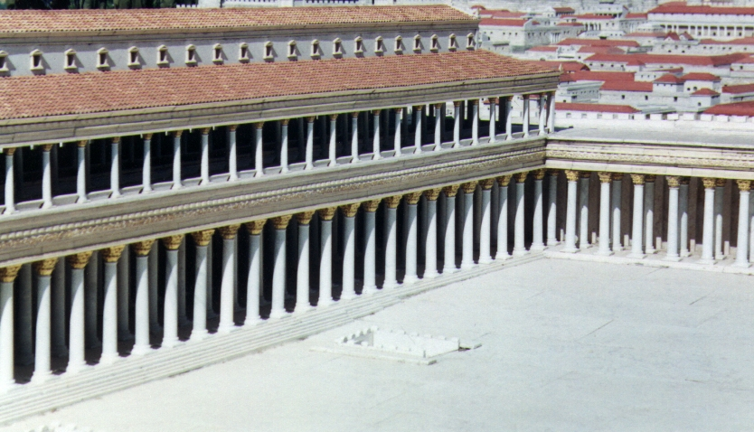

# Human-made Things in the Bible

## License Information

Human-made Things in the Bible © United Bible Societies, 2025. Adapted from: <cite>The Works of Their Hands: Man-made Things in the Bible</cite>, by Ray Pritz © 2009 United Bible Societies. This work is licensed under Creative Commons Attribution-ShareAlike 4.0 International (<a href="https://creativecommons.org/licenses/by-sa/4.0/">https://creativecommons.org/licenses/by-sa/4.0/</a>).

--------------------------------

## Colonnade, porch, covered walkway, stoa, portico (id: REALIA:3.14.1.2)

3\.14\.1\.2 Colonnade, porch, covered walkway, stoa, portico
============================================================

References:
-----------

Greek στοά (stoa)

[JHN 5:2](https://ref.ly/John5:2), [JHN 10:23](https://ref.ly/John10:23), [ACT 3:11](https://ref.ly/Acts3:11), [ACT 5:12](https://ref.ly/Acts5:12)

Description and usage:
----------------------

*Model of covered walkway surrounding Herod's temple (© Ray Pritz by United Bible Societies)*

The porch was a covered colonnade, open normally on one side, where people could stand, sit, or walk, protected from the weather and the heat of the sun. It consisted of two parallel rows of columns that supported a roof.

---

Translation:
------------

In many parts of the world the closest equivalent for the Greek word *stoa* would be a verandah, an extensive type of porch. Such a porch may be rendered “long outside room” or “room made with pillars and open.” All of the above references except [JHN 5:2](https://ref.ly/John5:2) are to “Solomon’s Porch,” which was probably located along the eastern edge of the Court of the Gentiles in the Temple complex.

* **Associated Passages:** John 5:2; John 10:23; Acts 3:11; Acts 5:12

