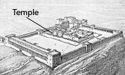
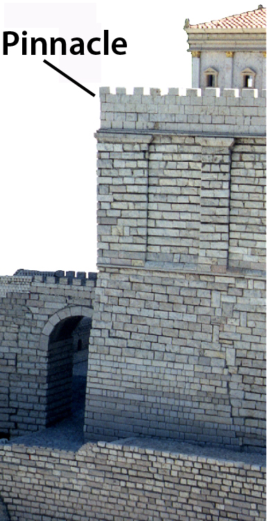
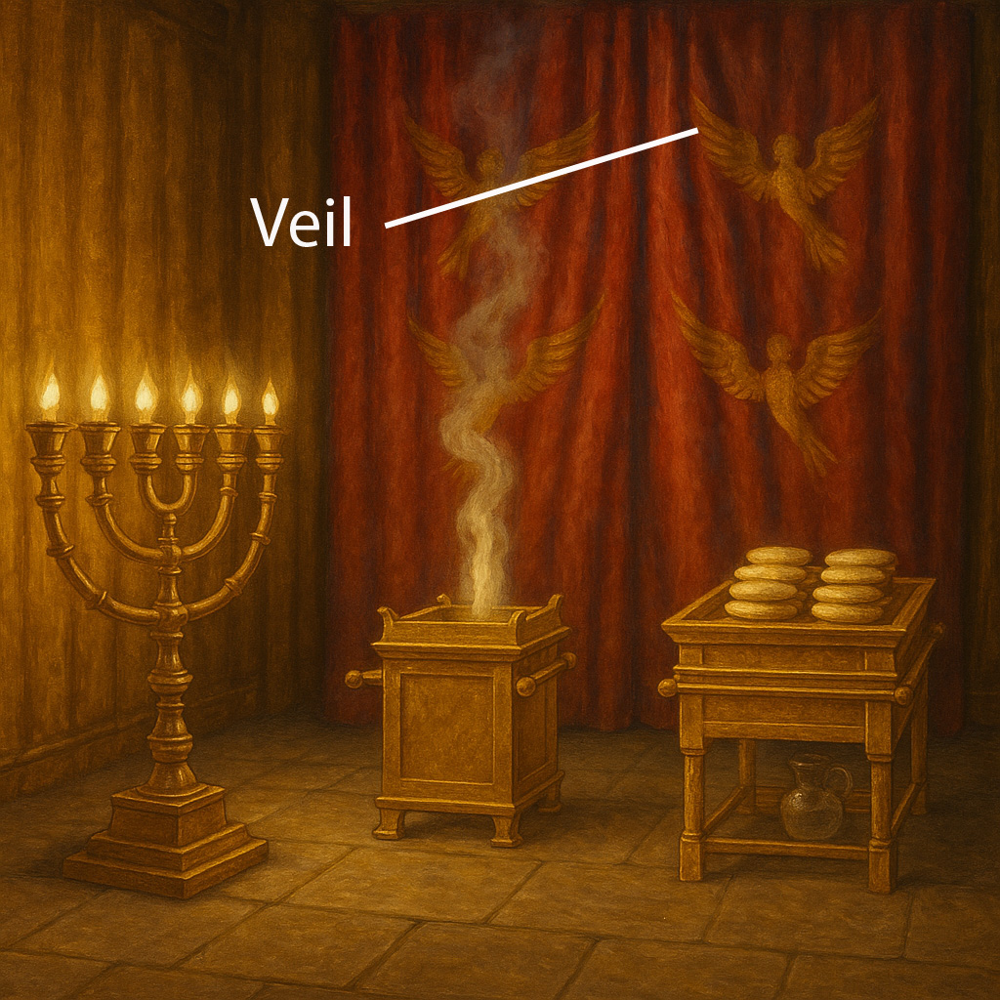

# Human-made Things in the Bible

## License Information

Human-made Things in the Bible © United Bible Societies, 2025. Adapted from: <cite>The Works of Their Hands: Man-made Things in the Bible</cite>, by Ray Pritz © 2009 United Bible Societies. This work is licensed under Creative Commons Attribution-ShareAlike 4.0 International (<a href="https://creativecommons.org/licenses/by-sa/4.0/">https://creativecommons.org/licenses/by-sa/4.0/</a>).

--------------------------------

## Jewish Temple (id: REALIA:3.14.1)

3\.14\.1 Jewish Temple
======================

References:
-----------

Hebrew בַּיִת (bayith)

[2SA 7:5](https://ref.ly/2Sam7:5), [2SA 7:6](https://ref.ly/2Sam7:6), [2SA 7:7](https://ref.ly/2Sam7:7), [1KI 3:1](https://ref.ly/1Kgs3:1), [1KI 3:2](https://ref.ly/1Kgs3:2), [1KI 5:17](https://ref.ly/1Kgs5:17), [1KI 5:19](https://ref.ly/1Kgs5:19), [1KI 5:19](https://ref.ly/1Kgs5:19), [1KI 5:31](https://ref.ly/1Kgs5:31), [1KI 5:32](https://ref.ly/1Kgs5:32)

Hebrew הֵיכָל (heykal)

[2SA 22:7](https://ref.ly/2Sam22:7), [1KI 6:3](https://ref.ly/1Kgs6:3), [1KI 6:5](https://ref.ly/1Kgs6:5), [1KI 7:21](https://ref.ly/1Kgs7:21), [2KI 18:16](https://ref.ly/2Kgs18:16), [2KI 23:4](https://ref.ly/2Kgs23:4), [2KI 24:13](https://ref.ly/2Kgs24:13), [2CH 3:17](https://ref.ly/2Chr3:17), [2CH 4:7](https://ref.ly/2Chr4:7), [2CH 4:8](https://ref.ly/2Chr4:8), [2CH 26:16](https://ref.ly/2Chr26:16), [2CH 27:2](https://ref.ly/2Chr27:2), [EZR 3:6](https://ref.ly/Ezra3:6), [EZR 3:10](https://ref.ly/Ezra3:10), [EZR 4:1](https://ref.ly/Ezra4:1), [PSA 27:4](https://ref.ly/Ps27:4), [PSA 29:9](https://ref.ly/Ps29:9), [PSA 48:10](https://ref.ly/Ps48:10), [PSA 65:5](https://ref.ly/Ps65:5), [PSA 68:30](https://ref.ly/Ps68:30), [PSA 79:1](https://ref.ly/Ps79:1), [ISA 44:28](https://ref.ly/Isa44:28), [ISA 66:6](https://ref.ly/Isa66:6), [JER 7:4](https://ref.ly/Jer7:4), [JER 7:4](https://ref.ly/Jer7:4), [JER 7:4](https://ref.ly/Jer7:4), [JER 24:1](https://ref.ly/Jer24:1), [JER 50:28](https://ref.ly/Jer50:28), [JER 51:11](https://ref.ly/Jer51:11), [AMO 8:3](https://ref.ly/Amos8:3), [HAG 2:15](https://ref.ly/Hag2:15), [HAG 2:18](https://ref.ly/Hag2:18), [ZEC 6:12](https://ref.ly/Zech6:12), [ZEC 6:13](https://ref.ly/Zech6:13), [ZEC 6:14](https://ref.ly/Zech6:14), [ZEC 6:15](https://ref.ly/Zech6:15), [ZEC 8:9](https://ref.ly/Zech8:9)

Aramaic הֵיכַל (heykal)

[EZR 5:14](https://ref.ly/Ezra5:14), [EZR 5:14](https://ref.ly/Ezra5:14), [EZR 5:14](https://ref.ly/Ezra5:14), [EZR 5:15](https://ref.ly/Ezra5:15), [EZR 6:5](https://ref.ly/Ezra6:5), [EZR 6:5](https://ref.ly/Ezra6:5), [DAN 5:2](https://ref.ly/Dan5:2), [DAN 5:3](https://ref.ly/Dan5:3)

Hebrew מוֹעֵד (mo‘ed)

[PSA 74:4](https://ref.ly/Ps74:4), [LAM 2:6](https://ref.ly/Lam2:6)

Hebrew מִקְדָּשׁ (miqdash)

[1CH 22:19](https://ref.ly/1Chr22:19), [1CH 28:10](https://ref.ly/1Chr28:10), [2CH 20:8](https://ref.ly/2Chr20:8), [2CH 26:18](https://ref.ly/2Chr26:18), [2CH 29:21](https://ref.ly/2Chr29:21), [2CH 30:8](https://ref.ly/2Chr30:8), [2CH 36:17](https://ref.ly/2Chr36:17), [NEH 10:40](https://ref.ly/Neh10:40), [PSA 68:36](https://ref.ly/Ps68:36), [PSA 73:17](https://ref.ly/Ps73:17), [PSA 74:7](https://ref.ly/Ps74:7), [PSA 78:69](https://ref.ly/Ps78:69), [PSA 96:6](https://ref.ly/Ps96:6), [ISA 60:13](https://ref.ly/Isa60:13), [ISA 63:18](https://ref.ly/Isa63:18), [JER 17:12](https://ref.ly/Jer17:12), [JER 51:51](https://ref.ly/Jer51:51), [LAM 1:10](https://ref.ly/Lam1:10), [LAM 2:7](https://ref.ly/Lam2:7), [LAM 2:20](https://ref.ly/Lam2:20), [EZK 5:11](https://ref.ly/Ezek5:11), [EZK 8:6](https://ref.ly/Ezek8:6), [EZK 9:6](https://ref.ly/Ezek9:6), [EZK 23:38](https://ref.ly/Ezek23:38), [EZK 23:39](https://ref.ly/Ezek23:39), [EZK 24:21](https://ref.ly/Ezek24:21), [EZK 25:3](https://ref.ly/Ezek25:3), [EZK 37:26](https://ref.ly/Ezek37:26), [EZK 37:28](https://ref.ly/Ezek37:28), [EZK 43:21](https://ref.ly/Ezek43:21), [EZK 44:1](https://ref.ly/Ezek44:1), [EZK 44:5](https://ref.ly/Ezek44:5), [EZK 44:7](https://ref.ly/Ezek44:7), [EZK 44:8](https://ref.ly/Ezek44:8), [EZK 44:9](https://ref.ly/Ezek44:9), [EZK 44:11](https://ref.ly/Ezek44:11), [EZK 44:15](https://ref.ly/Ezek44:15), [EZK 44:16](https://ref.ly/Ezek44:16), [EZK 45:4](https://ref.ly/Ezek45:4), [EZK 45:4](https://ref.ly/Ezek45:4), [EZK 45:18](https://ref.ly/Ezek45:18), [EZK 47:12](https://ref.ly/Ezek47:12), [EZK 48:8](https://ref.ly/Ezek48:8), [EZK 48:10](https://ref.ly/Ezek48:10), [EZK 48:21](https://ref.ly/Ezek48:21), [DAN 8:11](https://ref.ly/Dan8:11), [DAN 9:17](https://ref.ly/Dan9:17), [DAN 11:31](https://ref.ly/Dan11:31)

Hebrew קָדוֹשׁ (qadosh)

[ECC 8:10](https://ref.ly/Eccl8:10)

Hebrew קֹדֶשׁ (qodesh)

[1CH 23:32](https://ref.ly/1Chr23:32), [1CH 24:5](https://ref.ly/1Chr24:5), [2CH 29:5](https://ref.ly/2Chr29:5), [2CH 29:7](https://ref.ly/2Chr29:7), [2CH 30:19](https://ref.ly/2Chr30:19), [PSA 20:3](https://ref.ly/Ps20:3), [PSA 24:3](https://ref.ly/Ps24:3), [PSA 63:3](https://ref.ly/Ps63:3), [PSA 68:18](https://ref.ly/Ps68:18), [PSA 68:25](https://ref.ly/Ps68:25), [PSA 74:3](https://ref.ly/Ps74:3), [PSA 134:2](https://ref.ly/Ps134:2), [PSA 150:1](https://ref.ly/Ps150:1), [ISA 43:28](https://ref.ly/Isa43:28), [EZK 44:27](https://ref.ly/Ezek44:27), [EZK 44:27](https://ref.ly/Ezek44:27), [EZK 45:3](https://ref.ly/Ezek45:3), [EZK 45:3](https://ref.ly/Ezek45:3), [EZK 45:3](https://ref.ly/Ezek45:3), [DAN 8:13](https://ref.ly/Dan8:13), [DAN 8:14](https://ref.ly/Dan8:14), [DAN 9:24](https://ref.ly/Dan9:24), [DAN 9:26](https://ref.ly/Dan9:26)

Hebrew שֹׂךְ (sok)

[LAM 2:6](https://ref.ly/Lam2:6)

Greek ἅγιος (hagios)

[JDT 4:12](https://ref.ly/Jdt4:12), [JDT 4:13](https://ref.ly/Jdt4:13), [JDT 8:21](https://ref.ly/Jdt8:21), [JDT 8:24](https://ref.ly/Jdt8:24), [JDT 9:8](https://ref.ly/Jdt9:8), [JDT 16:20](https://ref.ly/Jdt16:20), [1MA 2:12](https://ref.ly/1Macc2:12), [1MA 3:43](https://ref.ly/1Macc3:43), [1MA 3:51](https://ref.ly/1Macc3:51), [1MA 3:58](https://ref.ly/1Macc3:58), [1MA 3:59](https://ref.ly/1Macc3:59), [1MA 4:36](https://ref.ly/1Macc4:36), [1MA 4:41](https://ref.ly/1Macc4:41), [1MA 4:43](https://ref.ly/1Macc4:43), [1MA 4:48](https://ref.ly/1Macc4:48), [1MA 6:18](https://ref.ly/1Macc6:18), [1MA 6:54](https://ref.ly/1Macc6:54), [1MA 7:33](https://ref.ly/1Macc7:33), [1MA 7:42](https://ref.ly/1Macc7:42), [1MA 9:54](https://ref.ly/1Macc9:54), [1MA 10:42](https://ref.ly/1Macc10:42), [1MA 10:39](https://ref.ly/1Macc10:39), [1MA 10:39](https://ref.ly/1Macc10:39), [1MA 10:44](https://ref.ly/1Macc10:44), [1MA 13:3](https://ref.ly/1Macc13:3), [1MA 13:6](https://ref.ly/1Macc13:6), [1MA 14:15](https://ref.ly/1Macc14:15), [1MA 14:15](https://ref.ly/1Macc14:15), [1MA 14:29](https://ref.ly/1Macc14:29), [1MA 14:31](https://ref.ly/1Macc14:31), [1MA 14:36](https://ref.ly/1Macc14:36), [1MA 14:42](https://ref.ly/1Macc14:42), [1MA 14:48](https://ref.ly/1Macc14:48), [1MA 15:7](https://ref.ly/1Macc15:7), [2MA 15:17](https://ref.ly/2Macc15:17)

Greek ἁγίασμα (hagiasma)

[JDT 5:19](https://ref.ly/Jdt5:19), [SIR 47:10](https://ref.ly/Sir47:10), [SIR 47:13](https://ref.ly/Sir47:13), [SIR 50:11](https://ref.ly/Sir50:11), [1MA 1:21](https://ref.ly/1Macc1:21), [1MA 1:36](https://ref.ly/1Macc1:36), [1MA 1:37](https://ref.ly/1Macc1:37), [1MA 1:37](https://ref.ly/1Macc1:37), [1MA 1:39](https://ref.ly/1Macc1:39), [1MA 1:45](https://ref.ly/1Macc1:45), [1MA 1:46](https://ref.ly/1Macc1:46), [1MA 2:7](https://ref.ly/1Macc2:7), [1MA 3:45](https://ref.ly/1Macc3:45), [1MA 4:38](https://ref.ly/1Macc4:38), [1MA 5:1](https://ref.ly/1Macc5:1), [1MA 6:7](https://ref.ly/1Macc6:7), [1MA 6:26](https://ref.ly/1Macc6:26), [1MA 6:51](https://ref.ly/1Macc6:51)

Greek ἁγιασμός (hagiasmos)

[3MA 2:18](https://ref.ly/3Macc2:18)

Greek ἱερός (hieros)

[MAT 4:5](https://ref.ly/Matt4:5), [MAT 12:5](https://ref.ly/Matt12:5), [MAT 12:6](https://ref.ly/Matt12:6), [MAT 21:12](https://ref.ly/Matt21:12), [MAT 21:12](https://ref.ly/Matt21:12), [MAT 21:14](https://ref.ly/Matt21:14), [MAT 21:15](https://ref.ly/Matt21:15), [MAT 21:23](https://ref.ly/Matt21:23), [MAT 24:1](https://ref.ly/Matt24:1), [MAT 24:1](https://ref.ly/Matt24:1), [MAT 26:55](https://ref.ly/Matt26:55), [MRK 11:11](https://ref.ly/Mark11:11), [MRK 11:15](https://ref.ly/Mark11:15), [MRK 11:15](https://ref.ly/Mark11:15), [MRK 11:16](https://ref.ly/Mark11:16), [MRK 11:27](https://ref.ly/Mark11:27), [MRK 12:35](https://ref.ly/Mark12:35), [MRK 13:1](https://ref.ly/Mark13:1), [MRK 13:3](https://ref.ly/Mark13:3), [MRK 14:49](https://ref.ly/Mark14:49), [LUK 2:27](https://ref.ly/Luke2:27), [LUK 2:37](https://ref.ly/Luke2:37), [LUK 2:46](https://ref.ly/Luke2:46), [LUK 4:9](https://ref.ly/Luke4:9), [LUK 18:10](https://ref.ly/Luke18:10), [LUK 19:45](https://ref.ly/Luke19:45), [LUK 19:47](https://ref.ly/Luke19:47), [LUK 20:1](https://ref.ly/Luke20:1), [LUK 21:5](https://ref.ly/Luke21:5), [LUK 21:37](https://ref.ly/Luke21:37), [LUK 21:38](https://ref.ly/Luke21:38), [LUK 22:52](https://ref.ly/Luke22:52), [LUK 22:53](https://ref.ly/Luke22:53), [LUK 24:53](https://ref.ly/Luke24:53), [JHN 2:14](https://ref.ly/John2:14), [JHN 2:15](https://ref.ly/John2:15), [JHN 5:14](https://ref.ly/John5:14), [JHN 7:14](https://ref.ly/John7:14), [JHN 7:28](https://ref.ly/John7:28), [JHN 8:2](https://ref.ly/John8:2), [JHN 8:20](https://ref.ly/John8:20), [JHN 8:59](https://ref.ly/John8:59), [JHN 10:23](https://ref.ly/John10:23), [JHN 11:56](https://ref.ly/John11:56), [JHN 18:20](https://ref.ly/John18:20), [ACT 2:46](https://ref.ly/Acts2:46), [ACT 3:1](https://ref.ly/Acts3:1), [ACT 3:2](https://ref.ly/Acts3:2), [ACT 3:2](https://ref.ly/Acts3:2), [ACT 3:3](https://ref.ly/Acts3:3), [ACT 3:8](https://ref.ly/Acts3:8), [ACT 3:10](https://ref.ly/Acts3:10), [ACT 4:1](https://ref.ly/Acts4:1), [ACT 5:20](https://ref.ly/Acts5:20), [ACT 5:21](https://ref.ly/Acts5:21), [ACT 5:24](https://ref.ly/Acts5:24), [ACT 5:25](https://ref.ly/Acts5:25), [ACT 5:42](https://ref.ly/Acts5:42), [ACT 19:27](https://ref.ly/Acts19:27), [ACT 21:26](https://ref.ly/Acts21:26), [ACT 21:27](https://ref.ly/Acts21:27), [ACT 21:28](https://ref.ly/Acts21:28), [ACT 21:29](https://ref.ly/Acts21:29), [ACT 21:30](https://ref.ly/Acts21:30), [ACT 22:17](https://ref.ly/Acts22:17), [ACT 24:6](https://ref.ly/Acts24:6), [ACT 24:12](https://ref.ly/Acts24:12), [ACT 24:18](https://ref.ly/Acts24:18), [ACT 25:8](https://ref.ly/Acts25:8), [ACT 26:21](https://ref.ly/Acts26:21), [1CO 9:13](https://ref.ly/1Cor9:13), [1CO 9:13](https://ref.ly/1Cor9:13)

Greek ναός (naos)

[MAT 23:16](https://ref.ly/Matt23:16), [MAT 23:16](https://ref.ly/Matt23:16), [MAT 23:17](https://ref.ly/Matt23:17), [MAT 23:21](https://ref.ly/Matt23:21), [MAT 23:35](https://ref.ly/Matt23:35), [MAT 26:61](https://ref.ly/Matt26:61), [MAT 27:5](https://ref.ly/Matt27:5), [MAT 27:40](https://ref.ly/Matt27:40), [MAT 27:51](https://ref.ly/Matt27:51), [MRK 14:58](https://ref.ly/Mark14:58), [MRK 15:29](https://ref.ly/Mark15:29), [MRK 15:38](https://ref.ly/Mark15:38), [LUK 1:9](https://ref.ly/Luke1:9), [LUK 1:21](https://ref.ly/Luke1:21), [LUK 1:22](https://ref.ly/Luke1:22), [LUK 23:45](https://ref.ly/Luke23:45), [JHN 2:19](https://ref.ly/John2:19), [JHN 2:20](https://ref.ly/John2:20), [1CO 3:17](https://ref.ly/1Cor3:17), [1CO 3:17](https://ref.ly/1Cor3:17), [2CO 6:16](https://ref.ly/2Cor6:16), [EPH 2:21](https://ref.ly/Eph2:21), [2TH 2:4](https://ref.ly/2Thess2:4), [REV 3:12](https://ref.ly/Rev3:12), [REV 7:15](https://ref.ly/Rev7:15), [REV 11:1](https://ref.ly/Rev11:1), [REV 11:2](https://ref.ly/Rev11:2), [REV 11:19](https://ref.ly/Rev11:19), [REV 11:19](https://ref.ly/Rev11:19), [REV 14:15](https://ref.ly/Rev14:15), [REV 14:17](https://ref.ly/Rev14:17), [REV 15:5](https://ref.ly/Rev15:5), [REV 15:6](https://ref.ly/Rev15:6), [REV 15:8](https://ref.ly/Rev15:8), [REV 15:8](https://ref.ly/Rev15:8), [REV 16:1](https://ref.ly/Rev16:1), [REV 16:17](https://ref.ly/Rev16:17)

Greek νεώς (neōs)

[2MA 4:14](https://ref.ly/2Macc4:14), [2MA 6:2](https://ref.ly/2Macc6:2), [2MA 9:16](https://ref.ly/2Macc9:16), [2MA 10:3](https://ref.ly/2Macc10:3), [2MA 10:5](https://ref.ly/2Macc10:5), [2MA 13:23](https://ref.ly/2Macc13:23), [2MA 14:33](https://ref.ly/2Macc14:33)

Greek οἰκία, οἶκος (oikia, oikos)

[MAT 12:4](https://ref.ly/Matt12:4), [MAT 21:13](https://ref.ly/Matt21:13), [MAT 21:13](https://ref.ly/Matt21:13), [MRK 2:26](https://ref.ly/Mark2:26), [MRK 11:17](https://ref.ly/Mark11:17), [MRK 11:17](https://ref.ly/Mark11:17), [LUK 6:4](https://ref.ly/Luke6:4), [LUK 11:51](https://ref.ly/Luke11:51), [LUK 19:46](https://ref.ly/Luke19:46), [LUK 19:46](https://ref.ly/Luke19:46), [JHN 2:16](https://ref.ly/John2:16), [JHN 2:17](https://ref.ly/John2:17), [JHN 14:2](https://ref.ly/John14:2), [ACT 7:47](https://ref.ly/Acts7:47), [ACT 7:49](https://ref.ly/Acts7:49), [HEB 3:2](https://ref.ly/Heb3:2), [HEB 3:5](https://ref.ly/Heb3:5), [HEB 10:21](https://ref.ly/Heb10:21)

Greek σκήνωμα (skēnōma)

[JDT 9:8](https://ref.ly/Jdt9:8)

Greek τόπος, ἅγιος, ἁγίασμα (topos, hagios topos, topos hagios, topos tou hagiasmatos)

[MAT 24:15](https://ref.ly/Matt24:15), [JHN 11:48](https://ref.ly/John11:48), [ACT 6:13](https://ref.ly/Acts6:13), [ACT 21:28](https://ref.ly/Acts21:28), [2MA 2:18](https://ref.ly/2Macc2:18), [2MA 3:18](https://ref.ly/2Macc3:18), [2MA 5:17](https://ref.ly/2Macc5:17), [2MA 5:19](https://ref.ly/2Macc5:19), [2MA 5:19](https://ref.ly/2Macc5:19), [2MA 8:17](https://ref.ly/2Macc8:17), [2MA 10:7](https://ref.ly/2Macc10:7), [2MA 13:23](https://ref.ly/2Macc13:23), [3MA 1:9](https://ref.ly/3Macc1:9), [3MA 1:9](https://ref.ly/3Macc1:9), [3MA 1:23](https://ref.ly/3Macc1:23), [3MA 2:14](https://ref.ly/3Macc2:14), [4MA 4:9](https://ref.ly/4Macc4:9), [4MA 4:12](https://ref.ly/4Macc4:12), [1ES 8:75](https://ref.ly/1Esd8:75)

Latin sanctificatio

[2ES 7:108](https://ref.ly/2Esd7:108), [2ES 10:21](https://ref.ly/2Esd10:21), [2ES 12:48](https://ref.ly/2Esd12:48), [2ES 15:25](https://ref.ly/2Esd15:25)

Latin templum

[2ES 10:21](https://ref.ly/2Esd10:21)

Description and usage:
----------------------

*Herod's temple at time of Christ, showing the bridge supported by Wilson's arch at the center left (© Public Domain \- Wikimedia Commons)*

The Temple was the building in Jerusalem in which God was regarded as dwelling and where he was worshiped. From the time it was first built by Solomon, it was the center of worship for the Jewish people. In Jewish history three temples were constructed, all of them quite different from the others. The first Temple, built by Solomon, was destroyed in 587/586 B.C. A new, more modest Temple was built about seventy years later by Zerubbabel and lasted until almost the time of the New Testament, when it was rebuilt by Herod the Great. This third structure was only completed about 63 A.D. and was destroyed by the Roman army seven years later.

---

Translation:
------------

*A model of the temple mount in Herod's time (© Ray Pritz by United Bible Societies)*

There are, in fact, four different Jewish temples in the Bible: those built by Solomon, Zerubbabel, and Herod the Great, and the vision of an ideal Temple in the last chapters of Ezekiel. While the same word should be used for all of them, it will be helpful for the reader to have a note or glossary entry explaining the differences between them. It will not normally be necessary—or even advisable—to reflect those differences in translation.

“Temple” may be rendered “house of God,” “place where God dwells,” or “God’s building.” Some languages often say “holy house” or “holy place.” Other renderings are “God’s great singing house” and “God’s big prayer house.”

*An artist's conception of Ezekiel's Temple (© Deutsche Bibelgesellschaft, Stuttgart by United Bible Societies)*

The Hebrew word *mo‘ed* means literally an appointed time or place of meeting. In the references given above it refers to the Temple as the place where people came for the sacred festivals.

*(Image generated by ChatGPT using OpenAI technology)*

In some languages there is a technical term for “temple,” and this is often carefully distinguished from an expression designating a central sanctuary in which the deity is thought to dwell. In the New Testament the Greek word *naos* refers to a single building, while the word *hieron* points to the entire Temple precinct with its buildings, courts, and storerooms. Even though in a number of contexts it is not necessary to distinguish between *hieron* and *naos*, in [MAT 21:12](https://ref.ly/Matt21:12) (and the parallel passages [MRK 11:15](https://ref.ly/Mark11:15); [LUK 19:45](https://ref.ly/Luke19:45); [JHN 2:14](https://ref.ly/John2:14)), it is important to indicate this distinction in order not to leave the impression that sacrificial animals were actually being sold inside the central sanctuary. When translating “temple,” translators should avoid using the same term used to translate “synagogue” in the New Testament.

* **Associated Passages:** 2 Samuel 7:5; 2 Samuel 7:6; 2 Samuel 7:7; 1 Kings 3:1; 1 Kings 3:2; 1 Kings 5:17; 1 Kings 5:19; 1 Kings 5:31; 1 Kings 5:32; 2 Samuel 22:7; 1 Kings 6:3; 1 Kings 6:5; 1 Kings 7:21; 2 Kings 18:16; 2 Kings 23:4; 2 Kings 24:13; 2 Chronicles 3:17; 2 Chronicles 4:7; 2 Chronicles 4:8; 2 Chronicles 26:16; 2 Chronicles 27:2; Ezra 3:6; Ezra 3:10; Ezra 4:1; Psalms 27:4; Psalms 29:9; Psalms 48:10; Psalms 65:5; Psalms 68:30; Psalms 79:1; Isaiah 44:28; Isaiah 66:6; Jeremiah 7:4; Jeremiah 24:1; Jeremiah 50:28; Jeremiah 51:11; Amos 8:3; Haggai 2:15; Haggai 2:18; Zechariah 6:12; Zechariah 6:13; Zechariah 6:14; Zechariah 6:15; Zechariah 8:9; Ezra 5:14; Ezra 5:15; Ezra 6:5; Daniel 5:2; Daniel 5:3; Psalms 74:4; Lamentations 2:6; 1 Chronicles 22:19; 1 Chronicles 28:10; 2 Chronicles 20:8; 2 Chronicles 26:18; 2 Chronicles 29:21; 2 Chronicles 30:8; 2 Chronicles 36:17; Nehemiah 10:40; Psalms 68:36; Psalms 73:17; Psalms 74:7; Psalms 78:69; Psalms 96:6; Isaiah 60:13; Isaiah 63:18; Jeremiah 17:12; Jeremiah 51:51; Lamentations 1:10; Lamentations 2:7; Lamentations 2:20; Ezekiel 5:11; Ezekiel 8:6; Ezekiel 9:6; Ezekiel 23:38; Ezekiel 23:39; Ezekiel 24:21; Ezekiel 25:3; Ezekiel 37:26; Ezekiel 37:28; Ezekiel 43:21; Ezekiel 44:1; Ezekiel 44:5; Ezekiel 44:7; Ezekiel 44:8; Ezekiel 44:9; Ezekiel 44:11; Ezekiel 44:15; Ezekiel 44:16; Ezekiel 45:4; Ezekiel 45:18; Ezekiel 47:12; Ezekiel 48:8; Ezekiel 48:10; Ezekiel 48:21; Daniel 8:11; Daniel 9:17; Daniel 11:31; Ecclesiastes 8:10; 1 Chronicles 23:32; 1 Chronicles 24:5; 2 Chronicles 29:5; 2 Chronicles 29:7; 2 Chronicles 30:19; Psalms 20:3; Psalms 24:3; Psalms 63:3; Psalms 68:18; Psalms 68:25; Psalms 74:3; Psalms 134:2; Psalms 150:1; Isaiah 43:28; Ezekiel 44:27; Ezekiel 45:3; Daniel 8:13; Daniel 8:14; Daniel 9:24; Daniel 9:26; Judith 4:12; Judith 4:13; Judith 8:21; Judith 8:24; Judith 9:8; Judith 16:20; 1 Maccabees 2:12; 1 Maccabees 3:43; 1 Maccabees 3:51; 1 Maccabees 3:58; 1 Maccabees 3:59; 1 Maccabees 4:36; 1 Maccabees 4:41; 1 Maccabees 4:43; 1 Maccabees 4:48; 1 Maccabees 6:18; 1 Maccabees 6:54; 1 Maccabees 7:33; 1 Maccabees 7:42; 1 Maccabees 9:54; 1 Maccabees 10:42; 1 Maccabees 10:39; 1 Maccabees 10:44; 1 Maccabees 13:3; 1 Maccabees 13:6; 1 Maccabees 14:15; 1 Maccabees 14:29; 1 Maccabees 14:31; 1 Maccabees 14:36; 1 Maccabees 14:42; 1 Maccabees 14:48; 1 Maccabees 15:7; 2 Maccabees 15:17; Judith 5:19; Sirach 47:10; Sirach 47:13; Sirach 50:11; 1 Maccabees 1:21; 1 Maccabees 1:36; 1 Maccabees 1:37; 1 Maccabees 1:39; 1 Maccabees 1:45; 1 Maccabees 1:46; 1 Maccabees 2:7; 1 Maccabees 3:45; 1 Maccabees 4:38; 1 Maccabees 5:1; 1 Maccabees 6:7; 1 Maccabees 6:26; 1 Maccabees 6:51; 3 Maccabees 2:18; Matthew 4:5; Matthew 12:5; Matthew 12:6; Matthew 21:12; Matthew 21:14; Matthew 21:15; Matthew 21:23; Matthew 24:1; Matthew 26:55; Mark 11:11; Mark 11:15; Mark 11:16; Mark 11:27; Mark 12:35; Mark 13:1; Mark 13:3; Mark 14:49; Luke 2:27; Luke 2:37; Luke 2:46; Luke 4:9; Luke 18:10; Luke 19:45; Luke 19:47; Luke 20:1; Luke 21:5; Luke 21:37; Luke 21:38; Luke 22:52; Luke 22:53; Luke 24:53; John 2:14; John 2:15; John 5:14; John 7:14; John 7:28; John 8:2; John 8:20; John 8:59; John 10:23; John 11:56; John 18:20; Acts 2:46; Acts 3:1; Acts 3:2; Acts 3:3; Acts 3:8; Acts 3:10; Acts 4:1; Acts 5:20; Acts 5:21; Acts 5:24; Acts 5:25; Acts 5:42; Acts 19:27; Acts 21:26; Acts 21:27; Acts 21:28; Acts 21:29; Acts 21:30; Acts 22:17; Acts 24:6; Acts 24:12; Acts 24:18; Acts 25:8; Acts 26:21; 1 Corinthians 9:13; Matthew 23:16; Matthew 23:17; Matthew 23:21; Matthew 23:35; Matthew 26:61; Matthew 27:5; Matthew 27:40; Matthew 27:51; Mark 14:58; Mark 15:29; Mark 15:38; Luke 1:9; Luke 1:21; Luke 1:22; Luke 23:45; John 2:19; John 2:20; 1 Corinthians 3:17; 2 Corinthians 6:16; Ephesians 2:21; 2 Thessalonians 2:4; Revelation 3:12; Revelation 7:15; Revelation 11:1; Revelation 11:2; Revelation 11:19; Revelation 14:15; Revelation 14:17; Revelation 15:5; Revelation 15:6; Revelation 15:8; Revelation 16:1; Revelation 16:17; 2 Maccabees 4:14; 2 Maccabees 6:2; 2 Maccabees 9:16; 2 Maccabees 10:3; 2 Maccabees 10:5; 2 Maccabees 13:23; 2 Maccabees 14:33; Matthew 12:4; Matthew 21:13; Mark 2:26; Mark 11:17; Luke 6:4; Luke 11:51; Luke 19:46; John 2:16; John 2:17; John 14:2; Acts 7:47; Acts 7:49; Hebrews 3:2; Hebrews 3:5; Hebrews 10:21; Matthew 24:15; John 11:48; Acts 6:13; 2 Maccabees 2:18; 2 Maccabees 3:18; 2 Maccabees 5:17; 2 Maccabees 5:19; 2 Maccabees 8:17; 2 Maccabees 10:7; 3 Maccabees 1:9; 3 Maccabees 1:23; 3 Maccabees 2:14; 4 Maccabees 4:9; 4 Maccabees 4:12; 1 Esdras (Greek) 8:75; 2 Esdras (Latin) 7:108; 2 Esdras (Latin) 10:21; 2 Esdras (Latin) 12:48; 2 Esdras (Latin) 15:25

* **Associated ACAI Concepts:** Temple (ID: `realia:Temple`)

## Entrance room, entrance hall (id: REALIA:3.14.1.1)

3\.14\.1\.1 Entrance room, entrance hall
========================================

References:
-----------

Hebrew אֵילָם, אוּלָם (’eylam, ’elam, ’ulam)

[1KI 6:3](https://ref.ly/1Kgs6:3), [1KI 7:6](https://ref.ly/1Kgs7:6), [1KI 7:6](https://ref.ly/1Kgs7:6), [1KI 7:7](https://ref.ly/1Kgs7:7), [1KI 7:7](https://ref.ly/1Kgs7:7), [1KI 7:8](https://ref.ly/1Kgs7:8), [1KI 7:8](https://ref.ly/1Kgs7:8), [1KI 7:12](https://ref.ly/1Kgs7:12), [1KI 7:19](https://ref.ly/1Kgs7:19), [1KI 7:21](https://ref.ly/1Kgs7:21), [1CH 28:11](https://ref.ly/1Chr28:11), [2CH 3:4](https://ref.ly/2Chr3:4), [2CH 8:12](https://ref.ly/2Chr8:12), [2CH 15:8](https://ref.ly/2Chr15:8), [2CH 29:7](https://ref.ly/2Chr29:7), [2CH 29:17](https://ref.ly/2Chr29:17), [EZK 8:16](https://ref.ly/Ezek8:16), [EZK 40:7](https://ref.ly/Ezek40:7), [EZK 40:8](https://ref.ly/Ezek40:8), [EZK 40:9](https://ref.ly/Ezek40:9), [EZK 40:9](https://ref.ly/Ezek40:9), [EZK 40:15](https://ref.ly/Ezek40:15), [EZK 40:16](https://ref.ly/Ezek40:16), [EZK 40:21](https://ref.ly/Ezek40:21), [EZK 40:21](https://ref.ly/Ezek40:21), [EZK 40:22](https://ref.ly/Ezek40:22), [EZK 40:22](https://ref.ly/Ezek40:22), [EZK 40:22](https://ref.ly/Ezek40:22), [EZK 40:22](https://ref.ly/Ezek40:22), [EZK 40:24](https://ref.ly/Ezek40:24), [EZK 40:24](https://ref.ly/Ezek40:24), [EZK 40:25](https://ref.ly/Ezek40:25), [EZK 40:25](https://ref.ly/Ezek40:25), [EZK 40:26](https://ref.ly/Ezek40:26), [EZK 40:26](https://ref.ly/Ezek40:26), [EZK 40:29](https://ref.ly/Ezek40:29), [EZK 40:29](https://ref.ly/Ezek40:29), [EZK 40:29](https://ref.ly/Ezek40:29), [EZK 40:29](https://ref.ly/Ezek40:29), [EZK 40:30](https://ref.ly/Ezek40:30), [EZK 40:31](https://ref.ly/Ezek40:31), [EZK 40:33](https://ref.ly/Ezek40:33), [EZK 40:33](https://ref.ly/Ezek40:33), [EZK 40:33](https://ref.ly/Ezek40:33), [EZK 40:33](https://ref.ly/Ezek40:33), [EZK 40:34](https://ref.ly/Ezek40:34), [EZK 40:34](https://ref.ly/Ezek40:34), [EZK 40:36](https://ref.ly/Ezek40:36), [EZK 40:36](https://ref.ly/Ezek40:36), [EZK 40:39](https://ref.ly/Ezek40:39), [EZK 40:40](https://ref.ly/Ezek40:40), [EZK 40:48](https://ref.ly/Ezek40:48), [EZK 40:48](https://ref.ly/Ezek40:48), [EZK 40:49](https://ref.ly/Ezek40:49), [EZK 41:15](https://ref.ly/Ezek41:15), [EZK 41:25](https://ref.ly/Ezek41:25), [EZK 41:26](https://ref.ly/Ezek41:26), [EZK 44:3](https://ref.ly/Ezek44:3), [EZK 46:2](https://ref.ly/Ezek46:2), [EZK 46:8](https://ref.ly/Ezek46:8), [JOL 2:17](https://ref.ly/Joel2:17)

Hebrew מִסְדְּרוֹן (misdron)

[JDG 3:23](https://ref.ly/Judg3:23)

Description and usage:
----------------------

The entrance hall was a kind of foyer or anteroom that extended across the entrance of a large building. The entrance hall of the Temple stood higher than the rest of the Temple, and it may not have had a roof. While the biblical text considers it part of the internal space of the sanctuary, it may have served as a kind of forecourt, a transition from the outside courtyard to the inside of the building. Several of the passages above do not refer to the entrance hall of the Temple. [JDG 3:23](https://ref.ly/Judg3:23) and [1KI 7:6](https://ref.ly/1Kgs7:6); [1KI 7:7](https://ref.ly/1Kgs7:7); [1KI 7:8](https://ref.ly/1Kgs7:8) refer to the entrance halls of palaces, while some of the passages in Ezekiel ([EZK 40:7](https://ref.ly/Ezek40:7); [EZK 40:8](https://ref.ly/Ezek40:8); [EZK 40:9](https://ref.ly/Ezek40:9), [EZK 40:15](https://ref.ly/Ezek40:15); [EZK 40:16](https://ref.ly/Ezek40:16); [EZK 40:17](https://ref.ly/Ezek40:17); [EZK 40:18](https://ref.ly/Ezek40:18); [EZK 40:19](https://ref.ly/Ezek40:19); [EZK 40:20](https://ref.ly/Ezek40:20); [EZK 40:21](https://ref.ly/Ezek40:21); [EZK 40:22](https://ref.ly/Ezek40:22); [EZK 40:23](https://ref.ly/Ezek40:23); [EZK 40:24](https://ref.ly/Ezek40:24); [EZK 40:25](https://ref.ly/Ezek40:25); [EZK 40:26](https://ref.ly/Ezek40:26); [EZK 40:27](https://ref.ly/Ezek40:27); [EZK 40:28](https://ref.ly/Ezek40:28); [EZK 40:29](https://ref.ly/Ezek40:29); [EZK 40:30](https://ref.ly/Ezek40:30); [EZK 40:31](https://ref.ly/Ezek40:31); [EZK 40:32](https://ref.ly/Ezek40:32); [EZK 40:33](https://ref.ly/Ezek40:33); [EZK 40:34](https://ref.ly/Ezek40:34); [EZK 40:35](https://ref.ly/Ezek40:35); [EZK 40:36](https://ref.ly/Ezek40:36), [EZK 40:39](https://ref.ly/Ezek40:39); [EZK 40:40](https://ref.ly/Ezek40:40); [EZK 46:2](https://ref.ly/Ezek46:2), [EZK 46:8](https://ref.ly/Ezek46:8)) refer to the entrance halls of the Temple gates.

---

Translation:
------------

In many languages the only approximate equivalent for the Hebrew word *’ulam* may be a small hall inside the entrance to a house. This could be misleading since this word refers to a very large hall, which was even wider than the main building. It may be necessary to add a modifier of size, saying “large entry hall.”

* **Associated Passages:** 1 Kings 6:3; 1 Kings 7:6; 1 Kings 7:7; 1 Kings 7:8; 1 Kings 7:12; 1 Kings 7:19; 1 Kings 7:21; 1 Chronicles 28:11; 2 Chronicles 3:4; 2 Chronicles 8:12; 2 Chronicles 15:8; 2 Chronicles 29:7; 2 Chronicles 29:17; Ezekiel 8:16; Ezekiel 40:7; Ezekiel 40:8; Ezekiel 40:9; Ezekiel 40:15; Ezekiel 40:16; Ezekiel 40:21; Ezekiel 40:22; Ezekiel 40:24; Ezekiel 40:25; Ezekiel 40:26; Ezekiel 40:29; Ezekiel 40:30; Ezekiel 40:31; Ezekiel 40:33; Ezekiel 40:34; Ezekiel 40:36; Ezekiel 40:39; Ezekiel 40:40; Ezekiel 40:48; Ezekiel 40:49; Ezekiel 41:15; Ezekiel 41:25; Ezekiel 41:26; Ezekiel 44:3; Ezekiel 46:2; Ezekiel 46:8; Joel 2:17; Judges 3:23; Ezekiel 40:17; Ezekiel 40:18; Ezekiel 40:19; Ezekiel 40:20; Ezekiel 40:23; Ezekiel 40:27; Ezekiel 40:28; Ezekiel 40:32; Ezekiel 40:35

## Colonnade, porch, covered walkway, stoa, portico (id: REALIA:3.14.1.2)

3\.14\.1\.2 Colonnade, porch, covered walkway, stoa, portico
============================================================

References:
-----------

Greek στοά (stoa)

[JHN 5:2](https://ref.ly/John5:2), [JHN 10:23](https://ref.ly/John10:23), [ACT 3:11](https://ref.ly/Acts3:11), [ACT 5:12](https://ref.ly/Acts5:12)

Description and usage:
----------------------

*Model of covered walkway surrounding Herod's temple (© Ray Pritz by United Bible Societies)*

The porch was a covered colonnade, open normally on one side, where people could stand, sit, or walk, protected from the weather and the heat of the sun. It consisted of two parallel rows of columns that supported a roof.

---

Translation:
------------

In many parts of the world the closest equivalent for the Greek word *stoa* would be a verandah, an extensive type of porch. Such a porch may be rendered “long outside room” or “room made with pillars and open.” All of the above references except [JHN 5:2](https://ref.ly/John5:2) are to “Solomon’s Porch,” which was probably located along the eastern edge of the Court of the Gentiles in the Temple complex.

* **Associated Passages:** John 5:2; John 10:23; Acts 3:11; Acts 5:12

## Rooms for boiling meat from sacrifices, kitchens (id: REALIA:3.14.1.3)

3\.14\.1\.3 Rooms for boiling meat from sacrifices, kitchens
============================================================

Reference:
----------

Hebrew בַּיִת, בשׁל (beyth mvashlim)

[EZK 46:24](https://ref.ly/Ezek46:24)

Description and usage:
----------------------

In Ezekiel’s description of the Temple, special rooms were designated at the four corners of the outer court for boiling the meat from the sacrifices. The people who brought certain sacrifices were to eat a sacred meal, which was prepared in these rooms by servants (perhaps Levites) designated for the task.

---

Translation:
------------

Most translations render *beyth mvashlim* in [EZK 46:24](https://ref.ly/Ezek46:24) as “kitchen” (RSV (Revised Standard Version (1952)), CEV (Contemporary English Version), NIV (New International Version (1984))). NASB (New American Standard Bible) has “boiling places.” GECL (German Common Language Version (Gute Nachricht Bibel)) avoids translating the name of the rooms by saying “Here the Temple servants will cook the meat for the sacred meal of the people.”

* **Associated Passages:** Ezekiel 46:24

## Treasury, strongroom (id: REALIA:3.14.1.4)

3\.14\.1\.4 Treasury, strongroom
================================

References:
-----------

Hebrew אֲרוֹן (’aron)

[2KI 12:10](https://ref.ly/2Kgs12:10), [2KI 12:11](https://ref.ly/2Kgs12:11), [2CH 24:8](https://ref.ly/2Chr24:8), [2CH 24:10](https://ref.ly/2Chr24:10), [2CH 24:11](https://ref.ly/2Chr24:11), [2CH 24:11](https://ref.ly/2Chr24:11)

Hebrew בַּיִת, אָסֹף ((beyth) ’asupim)

[1CH 26:15](https://ref.ly/1Chr26:15), [1CH 26:17](https://ref.ly/1Chr26:17)

Hebrew בַּיִת, אוֹצָר ((beyth) ’otsar)

[DEU 28:12](https://ref.ly/Deut28:12), [DEU 32:34](https://ref.ly/Deut32:34), [JOS 6:19](https://ref.ly/Josh6:19), [JOS 6:24](https://ref.ly/Josh6:24), [1KI 7:51](https://ref.ly/1Kgs7:51), [1KI 15:18](https://ref.ly/1Kgs15:18), [1KI 15:18](https://ref.ly/1Kgs15:18), [2KI 12:19](https://ref.ly/2Kgs12:19), [2KI 14:14](https://ref.ly/2Kgs14:14), [2KI 16:8](https://ref.ly/2Kgs16:8), [2KI 18:15](https://ref.ly/2Kgs18:15), [2KI 20:13](https://ref.ly/2Kgs20:13), [2KI 20:15](https://ref.ly/2Kgs20:15), [2KI 24:13](https://ref.ly/2Kgs24:13), [2KI 24:13](https://ref.ly/2Kgs24:13), [1CH 9:26](https://ref.ly/1Chr9:26), [1CH 26:20](https://ref.ly/1Chr26:20), [1CH 26:20](https://ref.ly/1Chr26:20), [1CH 26:22](https://ref.ly/1Chr26:22), [1CH 26:24](https://ref.ly/1Chr26:24), [1CH 26:26](https://ref.ly/1Chr26:26), [1CH 27:25](https://ref.ly/1Chr27:25), [1CH 27:25](https://ref.ly/1Chr27:25), [1CH 28:12](https://ref.ly/1Chr28:12), [1CH 28:12](https://ref.ly/1Chr28:12), [1CH 29:8](https://ref.ly/1Chr29:8), [2CH 5:1](https://ref.ly/2Chr5:1), [2CH 8:15](https://ref.ly/2Chr8:15), [2CH 12:9](https://ref.ly/2Chr12:9), [2CH 12:9](https://ref.ly/2Chr12:9), [2CH 16:2](https://ref.ly/2Chr16:2), [2CH 25:24](https://ref.ly/2Chr25:24), [2CH 32:27](https://ref.ly/2Chr32:27), [EZR 2:69](https://ref.ly/Ezra2:69), [NEH 7:69](https://ref.ly/Neh7:69), [NEH 7:70](https://ref.ly/Neh7:70), [NEH 10:39](https://ref.ly/Neh10:39), [PRO 8:21](https://ref.ly/Prov8:21), [EZK 28:4](https://ref.ly/Ezek28:4), [DAN 1:2](https://ref.ly/Dan1:2), [HOS 13:15](https://ref.ly/Hos13:15), [MAL 3:10](https://ref.ly/Mal3:10)

Hebrew בַּיִת, נְכֹאת (beth nkoth)

[2KI 20:13](https://ref.ly/2Kgs20:13), [ISA 39:2](https://ref.ly/Isa39:2)

Aramaic גְּנַז (gnaz)

[EZR 7:20](https://ref.ly/Ezra7:20)

Hebrew גֶּנֶז (genez)

[EST 3:9](https://ref.ly/Esth3:9), [EST 4:7](https://ref.ly/Esth4:7)

Hebrew גַּנְזַךְ (ganzak)

[1CH 28:11](https://ref.ly/1Chr28:11)

Greek γαζοφυλάκιον (gazofulakion)

[MRK 12:41](https://ref.ly/Mark12:41), [MRK 12:41](https://ref.ly/Mark12:41), [MRK 12:43](https://ref.ly/Mark12:43), [LUK 21:1](https://ref.ly/Luke21:1), [JHN 8:20](https://ref.ly/John8:20), [1MA 3:28](https://ref.ly/1Macc3:28), [1MA 14:49](https://ref.ly/1Macc14:49), [2MA 3:6](https://ref.ly/2Macc3:6), [2MA 3:24](https://ref.ly/2Macc3:24), [2MA 3:28](https://ref.ly/2Macc3:28), [2MA 3:40](https://ref.ly/2Macc3:40), [2MA 4:42](https://ref.ly/2Macc4:42), [2MA 5:18](https://ref.ly/2Macc5:18), [4MA 4:3](https://ref.ly/4Macc4:3), [4MA 4:6](https://ref.ly/4Macc4:6), [1ES 5:44](https://ref.ly/1Esd5:44), [1ES 8:18](https://ref.ly/1Esd8:18), [1ES 8:44](https://ref.ly/1Esd8:44)

Greek θησαυρός (thēsauros)

[SIR 1:25](https://ref.ly/Sir1:25), [1MA 3:29](https://ref.ly/1Macc3:29)

Greek κορβανᾶς (korbanas)

[MAT 27:6](https://ref.ly/Matt27:6)

Greek ταμιεῖον (tamieion)

[SIR 29:12](https://ref.ly/Sir29:12)

Greek θησαυρός (thesaurus)

[4MA 4:7](https://ref.ly/4Macc4:7)

Latin thesaurus

[2ES 6:40](https://ref.ly/2Esd6:40)

Description and usage:
----------------------

*Southwest corner of the temple mount (model) (© Ray Pritz by United Bible Societies)*

The treasury was a place for storing valuables belonging to a king or other national authorities. The Temple in Jerusalem had its own treasury. There was no standard size or structure of a treasury.

---

Translation:
------------

The Hebrew word *’aron* in [2KI 12:9](https://ref.ly/2Kgs12:9); [2KI 12:10](https://ref.ly/2Kgs12:10) and [2CH 24:8](https://ref.ly/2Chr24:8); [2CH 24:10](https://ref.ly/2Chr24:10); [2CH 24:11](https://ref.ly/2Chr24:11) refers to a large collection box. According to [2KI 12:9](https://ref.ly/2Kgs12:9), a hole was cut in its “door.” This would refer to one surface of the box, presumably its top. People could bring their donations (not coins, which were not yet invented) and insert them into the box through the hole. The donations could then be removed by opening or removing the top.

In some passages the Hebrew word *’otsar* refers to treasure (for example, [2KI 24:13](https://ref.ly/2Kgs24:13); [2CH 12:9](https://ref.ly/2Chr12:9)), while in other places it indicates the place where treasure was stored, that is, a treasury (for example, [2KI 20:13](https://ref.ly/2Kgs20:13); [2CH 32:27](https://ref.ly/2Chr32:27)). The first half of [1KI 15:18](https://ref.ly/1Kgs15:18) says literally “And Asa took all the remaining silver and gold in the treasuries of the house of the LORD and \[he took] the treasures of the king’s house.” No translation consulted makes the distinction, although some render both words “treasures” (RSV (Revised Standard Version (1952))), while others render both words “treasuries” (NJPSV (New Jewish Publication Society Version)). In fact, in many of the references under *’otsar* it is not easy to determine if the meaning is “treasure” or “treasure storehouse.” In only three places is there specific reference in Hebrew to a “treasure house” ([NEH 10:39](https://ref.ly/Neh10:39); [DAN 1:2](https://ref.ly/Dan1:2); [MAL 3:10](https://ref.ly/Mal3:10)).

Where a word for “treasury” is not available, it may be rendered with a descriptive phrase, such as “safe place where the king’s \[or, Temple’s] valuables were kept/were guarded.” An alternative model for the last half of [MAT 27:6](https://ref.ly/Matt27:6) is “It is against our Law to put it with the money that belongs to the Temple since it is blood money.”

In the New Testament the Greek word *gazofulakion* also refers to a box in which donations were collected. According to Jewish tradition, there were thirteen such offering boxes in the Temple, and the receptacles that channeled the money down to the boxes were in the form of trumpets or rams’ horns. As a result, the sound of coins falling into the boxes was rather conspicuous. In some cultures such a collection box may be unknown, or at best people know the container that is passed around to collect money in church. If possible, the translation should indicate that the offering box was in a fixed place and not something passed around. In [LUK 21:1](https://ref.ly/Luke21:1)NCV (New Century Version) has “Temple money box” and adds this note: “A special box in the Jewish place of worship where people put their gifts to God.” PV uses a longer expression, saying “place reserved for them \[gifts].”

* **Associated Passages:** 2 Kings 12:10; 2 Kings 12:11; 2 Chronicles 24:8; 2 Chronicles 24:10; 2 Chronicles 24:11; 1 Chronicles 26:15; 1 Chronicles 26:17; Deuteronomy 28:12; Deuteronomy 32:34; Joshua 6:19; Joshua 6:24; 1 Kings 7:51; 1 Kings 15:18; 2 Kings 12:19; 2 Kings 14:14; 2 Kings 16:8; 2 Kings 18:15; 2 Kings 20:13; 2 Kings 20:15; 2 Kings 24:13; 1 Chronicles 9:26; 1 Chronicles 26:20; 1 Chronicles 26:22; 1 Chronicles 26:24; 1 Chronicles 26:26; 1 Chronicles 27:25; 1 Chronicles 28:12; 1 Chronicles 29:8; 2 Chronicles 5:1; 2 Chronicles 8:15; 2 Chronicles 12:9; 2 Chronicles 16:2; 2 Chronicles 25:24; 2 Chronicles 32:27; Ezra 2:69; Nehemiah 7:69; Nehemiah 7:70; Nehemiah 10:39; Proverbs 8:21; Ezekiel 28:4; Daniel 1:2; Hosea 13:15; Malachi 3:10; Isaiah 39:2; Ezra 7:20; Esther 3:9; Esther 4:7; 1 Chronicles 28:11; Mark 12:41; Mark 12:43; Luke 21:1; John 8:20; 1 Maccabees 3:28; 1 Maccabees 14:49; 2 Maccabees 3:6; 2 Maccabees 3:24; 2 Maccabees 3:28; 2 Maccabees 3:40; 2 Maccabees 4:42; 2 Maccabees 5:18; 4 Maccabees 4:3; 4 Maccabees 4:6; 1 Esdras (Greek) 5:44; 1 Esdras (Greek) 8:18; 1 Esdras (Greek) 8:44; Sirach 1:25; 1 Maccabees 3:29; Matthew 27:6; Sirach 29:12; 4 Maccabees 4:7; 2 Esdras (Latin) 6:40; 2 Kings 12:9

## Pinnacle (id: REALIA:3.14.1.5)

3\.14\.1\.5 Pinnacle
====================

References:
-----------

Greek πτερύγιον (pterugion)

[MAT 4:5](https://ref.ly/Matt4:5), [LUK 4:9](https://ref.ly/Luke4:9)

Description:
------------

The pinnacle was the tip or high point of a structure. The passages listed above refer to the pinnacle of the Temple.

---

Translation:
------------

The precise meaning of the Greek word *pterugion* is uncertain. Some scholars have proposed “lintel” or “superstructure of the gate \[of the Temple].” The Greek word translated “temple” (*hieron*) in [MAT 4:5](https://ref.ly/Matt4:5) and [LUK 4:9](https://ref.ly/Luke4:9) refers to the whole area occupied by the sanctuary (see [3\.14\.1 Jewish Temple\<REALIA:3\.14\.1\>](#)), and the pinnacle (literally “small wing”) could designate a corner or extreme point. So some scholars have suggested that it refers to the southwest corner of the Herodian wall surrounding the Temple complex. It is less likely that the word refers to some top corner of the Temple building itself. Common\-language translations often render it “very high point” or “highest part.”

* **Associated Passages:** Matthew 4:5; Luke 4:9

* **Associated ACAI Concepts:** Pinnacle (ID: `realia:Pinnacle`)

## Curtain, veil, drape (id: REALIA:3.14.1.6)

3\.14\.1\.6 Curtain, veil, drape
================================

References:
-----------

Hebrew פָּרֹכֶת (paroketh)

[EXO 26:31](https://ref.ly/Exod26:31), [EXO 26:33](https://ref.ly/Exod26:33), [EXO 26:33](https://ref.ly/Exod26:33), [EXO 26:33](https://ref.ly/Exod26:33), [EXO 26:35](https://ref.ly/Exod26:35), [EXO 27:21](https://ref.ly/Exod27:21), [EXO 30:6](https://ref.ly/Exod30:6), [EXO 35:12](https://ref.ly/Exod35:12), [EXO 36:35](https://ref.ly/Exod36:35), [EXO 38:27](https://ref.ly/Exod38:27), [EXO 39:34](https://ref.ly/Exod39:34), [EXO 40:3](https://ref.ly/Exod40:3), [EXO 40:22](https://ref.ly/Exod40:22), [EXO 40:22](https://ref.ly/Exod40:22), [EXO 40:26](https://ref.ly/Exod40:26), [LEV 4:6](https://ref.ly/Lev4:6), [LEV 4:17](https://ref.ly/Lev4:17), [LEV 16:2](https://ref.ly/Lev16:2), [LEV 16:12](https://ref.ly/Lev16:12), [LEV 16:15](https://ref.ly/Lev16:15), [LEV 21:23](https://ref.ly/Lev21:23), [LEV 24:3](https://ref.ly/Lev24:3), [NUM 4:5](https://ref.ly/Num4:5), [NUM 18:7](https://ref.ly/Num18:7), [2CH 3:14](https://ref.ly/2Chr3:14)

Greek καταπέτασμα (katapetasma)

[MAT 27:51](https://ref.ly/Matt27:51), [MRK 15:38](https://ref.ly/Mark15:38), [LUK 23:45](https://ref.ly/Luke23:45), [HEB 6:19](https://ref.ly/Heb6:19), [HEB 9:3](https://ref.ly/Heb9:3), [HEB 10:20](https://ref.ly/Heb10:20), [SIR 50:5](https://ref.ly/Sir50:5), [1MA 1:22](https://ref.ly/1Macc1:22), [1MA 4:51](https://ref.ly/1Macc4:51)

Description:
------------

*The tabernacle curtain or veil (Image generated by ChatGPT using OpenAI technology)*

The veil was a hanging cloth that covered the entrance to a room or served as a divider between two parts of a room. In the Tabernacle and in the Temple, it hung in front of the Most Holy Place and divided the Most Holy Place from the Holy Place, standing directly in front of the Covenant Box. Some scholars say the veil did not hang but was draped over the top of the enclosure in which the Covenant Box stood, forming a kind of pavilion. The veil was woven of three colors of wool and one of linen and was decorated with figures of winged creatures. It was a heavy cloth (post\-biblical Jewish tradition saying it was as thick as the width of a man’s hand).

---

Usage:
------

In addition to shielding the Most Holy Place from view, the veil served the same purpose for the Covenant Box when it was being moved. When the Tabernacle was dismantled, the veil was lowered from the front (or above) directly onto the Box, thus preventing anyone from seeing the Box even during the transitions.

---

Translation:
------------

The Hebrew word *paroketh* literally means “partition.” In Jewish tradition it was identified with a special partition that separated a king from the people. Some languages may have a special word for such a partition.

The Hebrew word *paroketh* and the Greek word *katapetasma* in connection with the Temple have been traditionally rendered “veil” in English, but a literal corresponding word for “veil” in another language could be misleading since it might suggest something that merely covers the face. Even a corresponding word for “curtain” could be misleading since it might suggest something that covers a window. Frequently it is necessary to use some kind of descriptive equivalent, for example, “large piece of cloth hanging down from the ceiling” or “large piece of cloth covering the entrance.”

[EXO 26:31](https://ref.ly/Exod26:31) provides a description of this object. The “veil” (RSV (Revised Standard Version (1952)); Hebrew *paroketh*) was a “curtain” (GNT (Good News Translation (1992))), of course, but it is good to distinguish this from the “screen” (RSV (Revised Standard Version (1952)); Hebrew *masak*) at the entrance to the Tabernacle, which was also a curtain (see [EXO 26:36](https://ref.ly/Exod26:36) and [3\.15\.2\.3\.8 Screen, entrance curtain\<REALIA:3\.15\.2\.3\.8\>](#)). The word *masak* has the primary meaning of covering something, or even hiding something, while *paroketh* primarily means making a division and setting something apart. Some translations make no distinction between the two words (GNT (Good News Translation (1992)), NIV (New International Version (1984))), but others have “curtain/screen” (NRSV (New Revised Standard Version (1989)), NJPSV (New Jewish Publication Society Version), NJB (New Jerusalem Bible (1985)), REB (Revised English Bible (1989))), “veil/curtain” (NAB (New American Bible (1970))), “Veil/Screen” (Durham), “screen/covering” (TOT), and even “curtain/veil” (Mft (Moffatt Translation (1926))). The *paroketh*, however, was there to separate the Holy Place from the Most Holy Place (see [EXO 26:33](https://ref.ly/Exod26:33)). So this information may be brought forward to this verse. This will indicate that it was a “screen” or “veil” to hide the contents of the Most Holy Place. In cultures where a “curtain” such as this is unknown, translators may say “holy \[or, taboo] cloth.”

[EXO 26:33](https://ref.ly/Exod26:33): “And you shall hang the veil from the clasps” (RSV (Revised Standard Version (1952))) is literally “And you \[singular] shall place the veil under the clasps.” “The clasps” refers to the gold clasps mentioned in 26\.6, which held together the two large pieces of the inner linen layer of the Tabernacle. When this layer was placed over the framework according to the instructions, the row of clasps would be exactly ten cubits (4\.5 meters, or 15 feet) from the west end. NAB (New American Bible (1970)) and NIV (New International Version (1984)) suggest with RSV (Revised Standard Version (1952)) that the veil was suspended from these clasps, but NRSV (New Revised Standard Version (1989)) has corrected this to “under the clasps.” This means “under the row of hooks in the roof of the Tent” (GNT (Good News Translation (1992))).

* **Associated Passages:** Exodus 26:31; Exodus 26:33; Exodus 26:35; Exodus 27:21; Exodus 30:6; Exodus 35:12; Exodus 36:35; Exodus 38:27; Exodus 39:34; Exodus 40:3; Exodus 40:22; Exodus 40:26; Leviticus 4:6; Leviticus 4:17; Leviticus 16:2; Leviticus 16:12; Leviticus 16:15; Leviticus 21:23; Leviticus 24:3; Numbers 4:5; Numbers 18:7; 2 Chronicles 3:14; Matthew 27:51; Mark 15:38; Luke 23:45; Hebrews 6:19; Hebrews 9:3; Hebrews 10:20; Sirach 50:5; 1 Maccabees 1:22; 1 Maccabees 4:51; Exodus 26:36

* **Associated ACAI Concepts:** Curtain (ID: `realia:Curtain`)

## Additional Temple features (id: REALIA:3.14.1.7)

3\.14\.1\.7 Additional Temple features
======================================

References:
-----------

Hebrew אַתּוּק, אַתִּיק (’atuq, ’atiq)

[EZK 41:15](https://ref.ly/Ezek41:15), [EZK 41:15](https://ref.ly/Ezek41:15), [EZK 41:16](https://ref.ly/Ezek41:16), [EZK 42:3](https://ref.ly/Ezek42:3), [EZK 42:3](https://ref.ly/Ezek42:3), [EZK 42:5](https://ref.ly/Ezek42:5)

Hebrew עָב (‘av)

[EZK 41:25](https://ref.ly/Ezek41:25), [EZK 41:26](https://ref.ly/Ezek41:26)

Hebrew שְׂחִיף, עֵץ (schif ‘ets)

[EZK 41:16](https://ref.ly/Ezek41:16)

Hebrew מִגְרַעַת (migra‘ah)

[1KI 6:6](https://ref.ly/1Kgs6:6)

Description and translation:
----------------------------

The meaning of the Hebrew word *’atuq* /*’atiq* in [EZK 41:15](https://ref.ly/Ezek41:15); [EZK 41:16](https://ref.ly/Ezek41:16); [EZK 42:3](https://ref.ly/Ezek42:3); [EZK 42:5](https://ref.ly/Ezek42:5) is unknown. Translations of this term vary widely as follows: “walls” (RSV (Revised Standard Version (1952))), “side rooms” (CEV (Contemporary English Version)), “galleries” (GNT (Good News Translation (1992)), NIV (New International Version (1984))), “ledges” (NJPSV (New Jewish Publication Society Version)), and “corridors” (REB (Revised English Bible (1989))).

The meaning of the Hebrew word *‘av* in [EZK 41:25](https://ref.ly/Ezek41:25); [EZK 41:26](https://ref.ly/Ezek41:26) is also unknown. The same word appears as some sort of architectural feature in [1KI 7:6](https://ref.ly/1Kgs7:6), where its meaning is equally obscure. Among a variety of renderings we find “covering” (GNT (Good News Translation (1992)), CEV (Contemporary English Version)), “canopy” (RSV (Revised Standard Version (1952))), “overhang” (NIV (New International Version (1984))), and “lattice” (NJPSV (New Jewish Publication Society Version)).

The Hebrew adjective *schif* appears only in [EZK 41:16](https://ref.ly/Ezek41:16) and its meaning is unknown. From the description of Solomon’s Temple in H01100600600058 we learn that many things were made of wood and then overlaid with gold. Since it was difficult to overlay stone with gold, it was sometimes the practice to cover the stone first with a thin layer of wood paneling or veneer and then overlay the wood with gold. Even though there is no mention of gold overlay in Ezekiel’s description of the future Temple, it has been suggested that such a wood veneer covered the inner stone walls and was itself overlaid with gold. A translator should not, of course, introduce gold where none is mentioned. The phrase *schif**‘ets* has been rendered “paneled with wood” (RSV (Revised Standard Version (1952)), GNT (Good News Translation (1992))), “trimmed in wood” (CEV (Contemporary English Version)), “covered with wood” (NIV (New International Version (1984))), “framed with wood” (REB (Revised English Bible (1989))), and “overlaid with wood” (NJPSV (New Jewish Publication Society Version)).

The Hebrew word *migra‘ah* in [1KI 6:6](https://ref.ly/1Kgs6:6) describes a structural device in Solomon’s Temple. Against the outer wall of the Temple building were built smaller rooms (see *tsela‘* under [3\.1\.6 Room\<REALIA:3\.1\.6\>](#)). This meant that the outer wall of the Temple building formed one wall of these smaller rooms. One end of the crossbeams (mentioned in the Aramaic Targum but not in the text of 1 Kings; see [3\.1\.5\.3 Crossbeam, rafter\<REALIA:3\.1\.5\.3\>](#)) was set into the outer wall of the small room, while the other end had to take its support from the outer wall of the Temple. Rather than make a hole right through the Temple wall, they made a recess or niche (or narrow ledge) in which the end of the beam sat. This supporting feature is called a *migra‘ah*. It has been rendered “offsets” (RSV (Revised Standard Version (1952))), “recesses” (NJPSV (New Jewish Publication Society Version)), “ledges” (CEV (Contemporary English Version)), or “offset ledges” (NIV (New International Version (1984))).

* **Associated Passages:** Ezekiel 41:15; Ezekiel 41:16; Ezekiel 42:3; Ezekiel 42:5; Ezekiel 41:25; Ezekiel 41:26; 1 Kings 6:6; 1 Kings 7:6

## Other features of the Temple treated elsewhere in this chapter (id: REALIA:3.14.1.8)

3\.14\.1\.8 Other features of the Temple treated elsewhere in this chapter
==========================================================================

Beams \- [3\.1\.5\.3 Crossbeam, rafter\<REALIA:3\.1\.5\.3\>](#)
---------------------------------------------------------------

Chains \- [3\.21\.4 Chain\<REALIA:3\.21\.4\>](#)

Courtyards \- [3\.20 Courtyard, court\<REALIA:3\.20\>](#)

Doors \- [3\.1\.2 Door, doorway\<REALIA:3\.1\.2\>](#)

Doorposts \- [3\.1\.2\.4 Doorpost\<REALIA:3\.1\.2\.4\>](#)

Fortress \- [3\.13\.3\.2 Fortress, stronghold, castle, citadel, fort\<REALIA:3\.13\.3\.2\>](#)

Foundation \- [3\.1\.1 Foundation\<REALIA:3\.1\.1\>](#)

Gates \- [3\.13\.3\.5 City gate\<REALIA:3\.13\.3\.5\>](#)

Gateways \- [3\.1\.3 Gate or gateway to house or building complex\<REALIA:3\.1\.3\>](#)

Guardrooms \- [3\.13\.3\.5\.2 Guardroom\<REALIA:3\.13\.3\.5\.2\>](#)

Hinges \- [3\.1\.2\.3 Hinge\<REALIA:3\.1\.2\.3\>](#)

Holy Place \- [3\.15\.2\.1 Holy Place\<REALIA:3\.15\.2\.1\>](#)

Lintels \- [3\.1\.2\.5 Lintel\<REALIA:3\.1\.2\.5\>](#)

Most Holy Place \- [3\.15\.2\.2 Holy of Holies, Most Holy Place\<REALIA:3\.15\.2\.2\>](#)

Networks on capitals \- [3\.5 Column, pillar, capital\<REALIA:3\.5\>](#)

Pillars \- [3\.5 Column, pillar, capital\<REALIA:3\.5\>](#)

Roof \- [3\.1\.5 Roof, housetop\<REALIA:3\.1\.5\>](#)

Stairs, steps \- [3\.1\.7 Stairs, steps\<REALIA:3\.1\.7\>](#)

Stories \- [3\.1\.6\.3 Wall\<REALIA:3\.1\.6\.3\>](#) and [3\.1\.6\.4 Upper room, roof chamber\<REALIA:3\.1\.6\.4\>](#)

Thresholds \- [3\.1\.2\.6 Threshold, doorsill\<REALIA:3\.1\.2\.6\>](#)

Windows \- [3\.1\.4 Window\<REALIA:3\.1\.4\>](#)

Walls \- [3\.6 Boundary wall, fence\<REALIA:3\.6\>](#)

