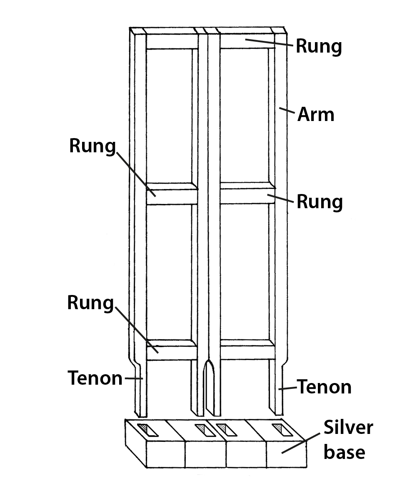
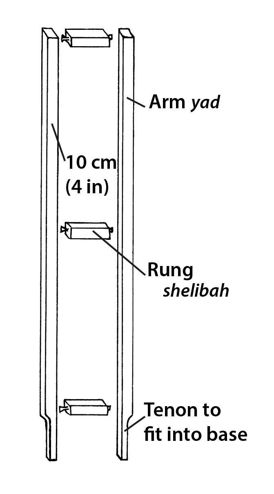
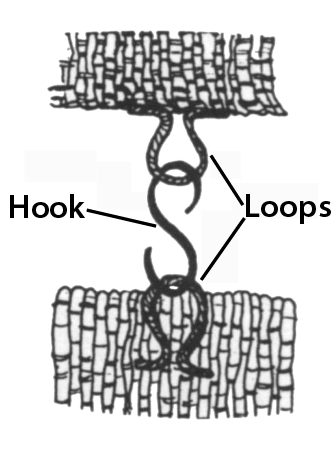
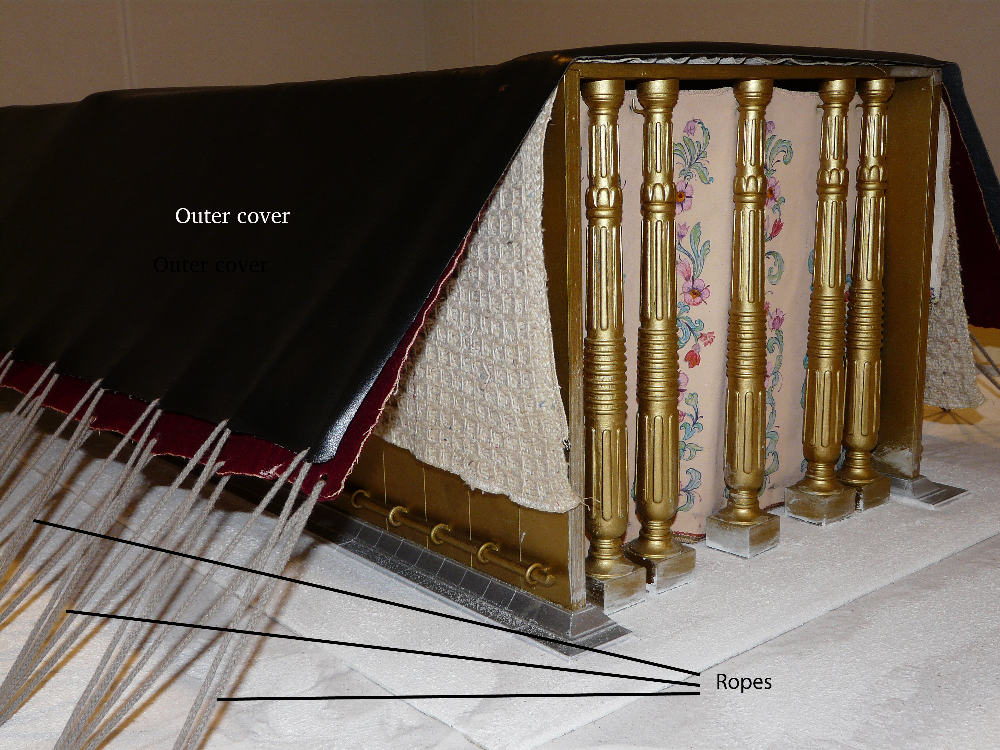
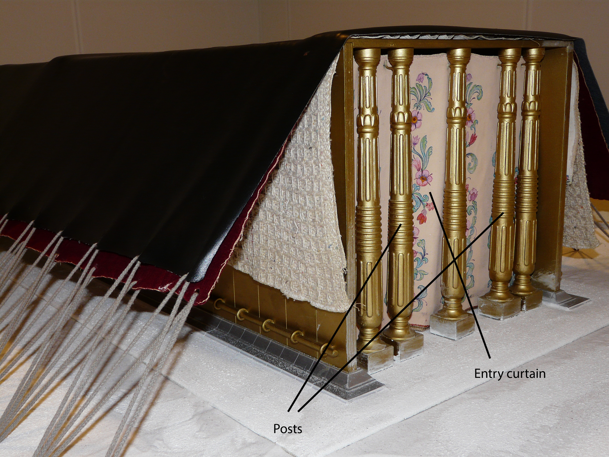
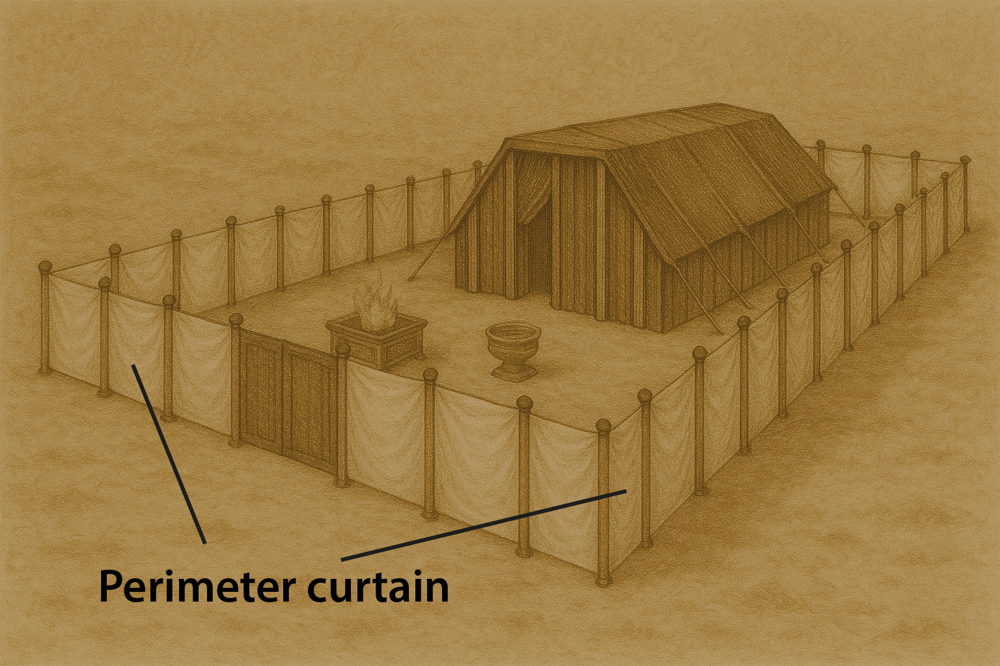

# Human-made Things in the Bible

## License Information

Human-made Things in the Bible © United Bible Societies, 2025. Adapted from: <cite>The Works of Their Hands: Man-made Things in the Bible</cite>, by Ray Pritz © 2009 United Bible Societies. This work is licensed under Creative Commons Attribution-ShareAlike 4.0 International (<a href="https://creativecommons.org/licenses/by-sa/4.0/">https://creativecommons.org/licenses/by-sa/4.0/</a>).

--------------------------------

## Tabernacle (id: REALIA:3.15.2)

3\.15\.2 Tabernacle
===================

References:
-----------

Hebrew אֹהֶל, מוֹעֵד (’ohel, ’ohel mo‘ed)

[EXO 26:7](https://ref.ly/Exod26:7), [EXO 26:9](https://ref.ly/Exod26:9), [EXO 26:11](https://ref.ly/Exod26:11), [EXO 26:12](https://ref.ly/Exod26:12), [EXO 26:13](https://ref.ly/Exod26:13), [EXO 26:14](https://ref.ly/Exod26:14), [EXO 26:36](https://ref.ly/Exod26:36), [EXO 27:21](https://ref.ly/Exod27:21), [EXO 28:43](https://ref.ly/Exod28:43), [EXO 29:4](https://ref.ly/Exod29:4), [EXO 29:10](https://ref.ly/Exod29:10), [EXO 29:11](https://ref.ly/Exod29:11), [EXO 29:30](https://ref.ly/Exod29:30), [EXO 29:32](https://ref.ly/Exod29:32), [EXO 29:42](https://ref.ly/Exod29:42), [EXO 29:44](https://ref.ly/Exod29:44), [EXO 30:16](https://ref.ly/Exod30:16), [EXO 30:18](https://ref.ly/Exod30:18), [EXO 30:20](https://ref.ly/Exod30:20), [EXO 30:26](https://ref.ly/Exod30:26), [EXO 30:36](https://ref.ly/Exod30:36), [EXO 31:7](https://ref.ly/Exod31:7), [EXO 31:7](https://ref.ly/Exod31:7), [EXO 33:7](https://ref.ly/Exod33:7), [EXO 33:7](https://ref.ly/Exod33:7), [EXO 33:7](https://ref.ly/Exod33:7), [EXO 33:8](https://ref.ly/Exod33:8), [EXO 33:8](https://ref.ly/Exod33:8), [EXO 33:9](https://ref.ly/Exod33:9), [EXO 33:9](https://ref.ly/Exod33:9), [EXO 33:10](https://ref.ly/Exod33:10), [EXO 33:11](https://ref.ly/Exod33:11), [EXO 35:11](https://ref.ly/Exod35:11), [EXO 35:21](https://ref.ly/Exod35:21), [EXO 36:14](https://ref.ly/Exod36:14), [EXO 36:18](https://ref.ly/Exod36:18), [EXO 36:19](https://ref.ly/Exod36:19), [EXO 36:37](https://ref.ly/Exod36:37), [EXO 38:8](https://ref.ly/Exod38:8), [EXO 38:30](https://ref.ly/Exod38:30), [EXO 39:32](https://ref.ly/Exod39:32), [EXO 39:33](https://ref.ly/Exod39:33), [EXO 39:38](https://ref.ly/Exod39:38), [EXO 39:40](https://ref.ly/Exod39:40), [EXO 40:2](https://ref.ly/Exod40:2), [EXO 40:6](https://ref.ly/Exod40:6), [EXO 40:7](https://ref.ly/Exod40:7), [EXO 40:12](https://ref.ly/Exod40:12), [EXO 40:19](https://ref.ly/Exod40:19), [EXO 40:19](https://ref.ly/Exod40:19), [EXO 40:22](https://ref.ly/Exod40:22), [EXO 40:24](https://ref.ly/Exod40:24), [EXO 40:26](https://ref.ly/Exod40:26), [EXO 40:29](https://ref.ly/Exod40:29), [EXO 40:30](https://ref.ly/Exod40:30), [EXO 40:32](https://ref.ly/Exod40:32), [EXO 40:34](https://ref.ly/Exod40:34), [EXO 40:35](https://ref.ly/Exod40:35), [LEV 1:1](https://ref.ly/Lev1:1), [LEV 1:3](https://ref.ly/Lev1:3), [LEV 1:5](https://ref.ly/Lev1:5), [LEV 3:2](https://ref.ly/Lev3:2), [LEV 3:8](https://ref.ly/Lev3:8), [LEV 3:13](https://ref.ly/Lev3:13), [LEV 4:4](https://ref.ly/Lev4:4), [LEV 4:5](https://ref.ly/Lev4:5), [LEV 4:7](https://ref.ly/Lev4:7), [LEV 4:7](https://ref.ly/Lev4:7), [LEV 4:14](https://ref.ly/Lev4:14), [LEV 4:16](https://ref.ly/Lev4:16), [LEV 4:18](https://ref.ly/Lev4:18), [LEV 4:18](https://ref.ly/Lev4:18), [LEV 6:9](https://ref.ly/Lev6:9), [LEV 6:19](https://ref.ly/Lev6:19), [LEV 6:23](https://ref.ly/Lev6:23), [LEV 8:3](https://ref.ly/Lev8:3), [LEV 8:4](https://ref.ly/Lev8:4), [LEV 8:31](https://ref.ly/Lev8:31), [LEV 8:33](https://ref.ly/Lev8:33), [LEV 8:35](https://ref.ly/Lev8:35), [LEV 9:5](https://ref.ly/Lev9:5), [LEV 9:23](https://ref.ly/Lev9:23), [LEV 10:7](https://ref.ly/Lev10:7), [LEV 10:9](https://ref.ly/Lev10:9), [LEV 12:6](https://ref.ly/Lev12:6), [LEV 14:11](https://ref.ly/Lev14:11), [LEV 14:23](https://ref.ly/Lev14:23), [LEV 15:14](https://ref.ly/Lev15:14), [LEV 15:29](https://ref.ly/Lev15:29), [LEV 16:7](https://ref.ly/Lev16:7), [LEV 16:16](https://ref.ly/Lev16:16), [LEV 16:17](https://ref.ly/Lev16:17), [LEV 16:20](https://ref.ly/Lev16:20), [LEV 16:23](https://ref.ly/Lev16:23), [LEV 16:33](https://ref.ly/Lev16:33), [LEV 17:4](https://ref.ly/Lev17:4), [LEV 17:5](https://ref.ly/Lev17:5), [LEV 17:6](https://ref.ly/Lev17:6), [LEV 17:9](https://ref.ly/Lev17:9), [LEV 19:21](https://ref.ly/Lev19:21), [LEV 24:3](https://ref.ly/Lev24:3), [NUM 1:1](https://ref.ly/Num1:1), [NUM 2:2](https://ref.ly/Num2:2), [NUM 2:17](https://ref.ly/Num2:17), [NUM 3:7](https://ref.ly/Num3:7), [NUM 3:8](https://ref.ly/Num3:8), [NUM 3:25](https://ref.ly/Num3:25), [NUM 3:25](https://ref.ly/Num3:25), [NUM 3:25](https://ref.ly/Num3:25), [NUM 3:38](https://ref.ly/Num3:38), [NUM 4:3](https://ref.ly/Num4:3), [NUM 4:4](https://ref.ly/Num4:4), [NUM 4:15](https://ref.ly/Num4:15), [NUM 4:23](https://ref.ly/Num4:23), [NUM 4:25](https://ref.ly/Num4:25), [NUM 4:25](https://ref.ly/Num4:25), [NUM 4:28](https://ref.ly/Num4:28), [NUM 4:30](https://ref.ly/Num4:30), [NUM 4:31](https://ref.ly/Num4:31), [NUM 4:33](https://ref.ly/Num4:33), [NUM 4:35](https://ref.ly/Num4:35), [NUM 4:37](https://ref.ly/Num4:37), [NUM 4:39](https://ref.ly/Num4:39), [NUM 4:41](https://ref.ly/Num4:41), [NUM 4:43](https://ref.ly/Num4:43), [NUM 4:47](https://ref.ly/Num4:47), [NUM 6:10](https://ref.ly/Num6:10), [NUM 6:13](https://ref.ly/Num6:13), [NUM 6:18](https://ref.ly/Num6:18), [NUM 7:5](https://ref.ly/Num7:5), [NUM 7:89](https://ref.ly/Num7:89), [NUM 8:9](https://ref.ly/Num8:9), [NUM 8:15](https://ref.ly/Num8:15), [NUM 8:19](https://ref.ly/Num8:19), [NUM 8:22](https://ref.ly/Num8:22), [NUM 8:24](https://ref.ly/Num8:24), [NUM 8:26](https://ref.ly/Num8:26), [NUM 9:15](https://ref.ly/Num9:15), [NUM 9:17](https://ref.ly/Num9:17), [NUM 10:3](https://ref.ly/Num10:3), [NUM 11:16](https://ref.ly/Num11:16), [NUM 11:24](https://ref.ly/Num11:24), [NUM 11:26](https://ref.ly/Num11:26), [NUM 12:4](https://ref.ly/Num12:4), [NUM 12:5](https://ref.ly/Num12:5), [NUM 12:10](https://ref.ly/Num12:10), [NUM 14:10](https://ref.ly/Num14:10), [NUM 16:18](https://ref.ly/Num16:18), [NUM 16:19](https://ref.ly/Num16:19), [NUM 17:7](https://ref.ly/Num17:7), [NUM 17:8](https://ref.ly/Num17:8), [NUM 17:15](https://ref.ly/Num17:15), [NUM 17:19](https://ref.ly/Num17:19), [NUM 17:22](https://ref.ly/Num17:22), [NUM 17:23](https://ref.ly/Num17:23), [NUM 18:2](https://ref.ly/Num18:2), [NUM 18:3](https://ref.ly/Num18:3), [NUM 18:4](https://ref.ly/Num18:4), [NUM 18:4](https://ref.ly/Num18:4), [NUM 18:6](https://ref.ly/Num18:6), [NUM 18:21](https://ref.ly/Num18:21), [NUM 18:22](https://ref.ly/Num18:22), [NUM 18:23](https://ref.ly/Num18:23), [NUM 18:31](https://ref.ly/Num18:31), [NUM 19:4](https://ref.ly/Num19:4), [NUM 20:6](https://ref.ly/Num20:6), [NUM 25:6](https://ref.ly/Num25:6), [NUM 27:2](https://ref.ly/Num27:2), [NUM 31:54](https://ref.ly/Num31:54), [DEU 31:14](https://ref.ly/Deut31:14), [DEU 31:14](https://ref.ly/Deut31:14), [DEU 31:15](https://ref.ly/Deut31:15), [DEU 31:15](https://ref.ly/Deut31:15), [JOS 18:1](https://ref.ly/Josh18:1), [JOS 19:51](https://ref.ly/Josh19:51), [1SA 2:22](https://ref.ly/1Sam2:22), [2SA 6:17](https://ref.ly/2Sam6:17), [2SA 7:6](https://ref.ly/2Sam7:6), [1KI 1:39](https://ref.ly/1Kgs1:39), [1KI 2:28](https://ref.ly/1Kgs2:28), [1KI 2:29](https://ref.ly/1Kgs2:29), [1KI 2:30](https://ref.ly/1Kgs2:30), [1KI 8:4](https://ref.ly/1Kgs8:4), [1KI 8:4](https://ref.ly/1Kgs8:4), [1CH 6:17](https://ref.ly/1Chr6:17), [1CH 9:19](https://ref.ly/1Chr9:19), [1CH 9:21](https://ref.ly/1Chr9:21), [1CH 9:23](https://ref.ly/1Chr9:23), [1CH 17:5](https://ref.ly/1Chr17:5), [1CH 17:5](https://ref.ly/1Chr17:5), [1CH 23:32](https://ref.ly/1Chr23:32), [2CH 1:3](https://ref.ly/2Chr1:3), [2CH 1:6](https://ref.ly/2Chr1:6), [2CH 1:13](https://ref.ly/2Chr1:13), [2CH 5:5](https://ref.ly/2Chr5:5), [2CH 5:5](https://ref.ly/2Chr5:5), [2CH 24:6](https://ref.ly/2Chr24:6), [PSA 27:6](https://ref.ly/Ps27:6), [PSA 78:60](https://ref.ly/Ps78:60)

Hebrew הֵיכָל (heykal)

[1SA 1:9](https://ref.ly/1Sam1:9), [1SA 3:3](https://ref.ly/1Sam3:3)

Hebrew מִשְׁכָּן (mishkan)

[EXO 25:9](https://ref.ly/Exod25:9), [EXO 26:1](https://ref.ly/Exod26:1), [EXO 26:6](https://ref.ly/Exod26:6), [EXO 26:7](https://ref.ly/Exod26:7), [EXO 26:12](https://ref.ly/Exod26:12), [EXO 26:13](https://ref.ly/Exod26:13), [EXO 26:15](https://ref.ly/Exod26:15), [EXO 26:17](https://ref.ly/Exod26:17), [EXO 26:18](https://ref.ly/Exod26:18), [EXO 26:20](https://ref.ly/Exod26:20), [EXO 26:22](https://ref.ly/Exod26:22), [EXO 26:23](https://ref.ly/Exod26:23), [EXO 26:26](https://ref.ly/Exod26:26), [EXO 26:27](https://ref.ly/Exod26:27), [EXO 26:27](https://ref.ly/Exod26:27), [EXO 26:30](https://ref.ly/Exod26:30), [EXO 26:35](https://ref.ly/Exod26:35), [EXO 27:9](https://ref.ly/Exod27:9), [EXO 27:19](https://ref.ly/Exod27:19), [EXO 35:11](https://ref.ly/Exod35:11), [EXO 35:15](https://ref.ly/Exod35:15), [EXO 35:18](https://ref.ly/Exod35:18), [EXO 36:8](https://ref.ly/Exod36:8), [EXO 36:13](https://ref.ly/Exod36:13), [EXO 36:14](https://ref.ly/Exod36:14), [EXO 36:20](https://ref.ly/Exod36:20), [EXO 36:22](https://ref.ly/Exod36:22), [EXO 36:23](https://ref.ly/Exod36:23), [EXO 36:25](https://ref.ly/Exod36:25), [EXO 36:27](https://ref.ly/Exod36:27), [EXO 36:28](https://ref.ly/Exod36:28), [EXO 36:31](https://ref.ly/Exod36:31), [EXO 36:32](https://ref.ly/Exod36:32), [EXO 36:32](https://ref.ly/Exod36:32), [EXO 38:20](https://ref.ly/Exod38:20), [EXO 38:21](https://ref.ly/Exod38:21), [EXO 38:21](https://ref.ly/Exod38:21), [EXO 38:31](https://ref.ly/Exod38:31), [EXO 39:32](https://ref.ly/Exod39:32), [EXO 39:33](https://ref.ly/Exod39:33), [EXO 39:40](https://ref.ly/Exod39:40), [EXO 40:2](https://ref.ly/Exod40:2), [EXO 40:5](https://ref.ly/Exod40:5), [EXO 40:6](https://ref.ly/Exod40:6), [EXO 40:9](https://ref.ly/Exod40:9), [EXO 40:17](https://ref.ly/Exod40:17), [EXO 40:18](https://ref.ly/Exod40:18), [EXO 40:19](https://ref.ly/Exod40:19), [EXO 40:21](https://ref.ly/Exod40:21), [EXO 40:22](https://ref.ly/Exod40:22), [EXO 40:24](https://ref.ly/Exod40:24), [EXO 40:28](https://ref.ly/Exod40:28), [EXO 40:29](https://ref.ly/Exod40:29), [EXO 40:33](https://ref.ly/Exod40:33), [EXO 40:34](https://ref.ly/Exod40:34), [EXO 40:35](https://ref.ly/Exod40:35), [EXO 40:36](https://ref.ly/Exod40:36), [EXO 40:38](https://ref.ly/Exod40:38), [LEV 8:10](https://ref.ly/Lev8:10), [LEV 15:31](https://ref.ly/Lev15:31), [LEV 17:4](https://ref.ly/Lev17:4), [NUM 1:50](https://ref.ly/Num1:50), [NUM 1:50](https://ref.ly/Num1:50), [NUM 1:50](https://ref.ly/Num1:50), [NUM 1:51](https://ref.ly/Num1:51), [NUM 1:51](https://ref.ly/Num1:51), [NUM 1:53](https://ref.ly/Num1:53), [NUM 1:53](https://ref.ly/Num1:53), [NUM 3:7](https://ref.ly/Num3:7), [NUM 3:8](https://ref.ly/Num3:8), [NUM 3:23](https://ref.ly/Num3:23), [NUM 3:25](https://ref.ly/Num3:25), [NUM 3:26](https://ref.ly/Num3:26), [NUM 3:29](https://ref.ly/Num3:29), [NUM 3:35](https://ref.ly/Num3:35), [NUM 3:36](https://ref.ly/Num3:36), [NUM 3:38](https://ref.ly/Num3:38), [NUM 4:16](https://ref.ly/Num4:16), [NUM 4:25](https://ref.ly/Num4:25), [NUM 4:26](https://ref.ly/Num4:26), [NUM 4:31](https://ref.ly/Num4:31), [NUM 5:17](https://ref.ly/Num5:17), [NUM 7:1](https://ref.ly/Num7:1), [NUM 7:3](https://ref.ly/Num7:3), [NUM 9:15](https://ref.ly/Num9:15), [NUM 9:15](https://ref.ly/Num9:15), [NUM 9:15](https://ref.ly/Num9:15), [NUM 9:18](https://ref.ly/Num9:18), [NUM 9:19](https://ref.ly/Num9:19), [NUM 9:20](https://ref.ly/Num9:20), [NUM 9:22](https://ref.ly/Num9:22), [NUM 10:11](https://ref.ly/Num10:11), [NUM 10:17](https://ref.ly/Num10:17), [NUM 10:17](https://ref.ly/Num10:17), [NUM 10:21](https://ref.ly/Num10:21), [NUM 16:9](https://ref.ly/Num16:9), [NUM 17:28](https://ref.ly/Num17:28), [NUM 19:13](https://ref.ly/Num19:13), [NUM 31:30](https://ref.ly/Num31:30), [NUM 31:47](https://ref.ly/Num31:47), [JOS 22:19](https://ref.ly/Josh22:19), [JOS 22:29](https://ref.ly/Josh22:29), [1CH 6:17](https://ref.ly/1Chr6:17), [1CH 6:33](https://ref.ly/1Chr6:33), [1CH 16:39](https://ref.ly/1Chr16:39), [1CH 21:29](https://ref.ly/1Chr21:29), [1CH 23:26](https://ref.ly/1Chr23:26), [2CH 1:5](https://ref.ly/2Chr1:5), [PSA 26:8](https://ref.ly/Ps26:8), [PSA 74:7](https://ref.ly/Ps74:7), [PSA 78:60](https://ref.ly/Ps78:60), [EZK 37:27](https://ref.ly/Ezek37:27)

Hebrew מִקְדָּשׁ (miqdash)

[EXO 15:17](https://ref.ly/Exod15:17), [EXO 25:8](https://ref.ly/Exod25:8), [LEV 12:4](https://ref.ly/Lev12:4), [LEV 19:30](https://ref.ly/Lev19:30), [LEV 20:3](https://ref.ly/Lev20:3), [LEV 26:2](https://ref.ly/Lev26:2), [LEV 21:12](https://ref.ly/Lev21:12), [LEV 21:12](https://ref.ly/Lev21:12), [LEV 21:23](https://ref.ly/Lev21:23), [NUM 3:38](https://ref.ly/Num3:38), [NUM 10:21](https://ref.ly/Num10:21), [NUM 18:1](https://ref.ly/Num18:1), [NUM 19:20](https://ref.ly/Num19:20), [JOS 24:26](https://ref.ly/Josh24:26)

Hebrew קֹדֶשׁ (qodesh)

[EXO 36:1](https://ref.ly/Exod36:1), [EXO 36:4](https://ref.ly/Exod36:4), [EXO 36:6](https://ref.ly/Exod36:6), [EXO 38:24](https://ref.ly/Exod38:24), [EXO 38:24](https://ref.ly/Exod38:24), [EXO 38:27](https://ref.ly/Exod38:27), [LEV 10:4](https://ref.ly/Lev10:4), [NUM 3:28](https://ref.ly/Num3:28), [NUM 3:31](https://ref.ly/Num3:31), [NUM 3:32](https://ref.ly/Num3:32), [NUM 4:12](https://ref.ly/Num4:12), [NUM 4:15](https://ref.ly/Num4:15), [NUM 4:15](https://ref.ly/Num4:15), [NUM 4:16](https://ref.ly/Num4:16), [NUM 8:19](https://ref.ly/Num8:19), [NUM 18:3](https://ref.ly/Num18:3), [NUM 18:5](https://ref.ly/Num18:5)

Greek ἅγιος (hagia, hagion)

[HEB 8:2](https://ref.ly/Heb8:2), [HEB 9:1](https://ref.ly/Heb9:1), [HEB 9:8](https://ref.ly/Heb9:8)

Greek σκηνή (skēnē)

[ACT 7:44](https://ref.ly/Acts7:44), [HEB 8:2](https://ref.ly/Heb8:2), [HEB 8:5](https://ref.ly/Heb8:5), [HEB 9:8](https://ref.ly/Heb9:8), [HEB 9:11](https://ref.ly/Heb9:11), [HEB 9:21](https://ref.ly/Heb9:21), [HEB 13:10](https://ref.ly/Heb13:10), [REV 15:5](https://ref.ly/Rev15:5), [WIS 9:8](https://ref.ly/Wis9:8), [SIR 24:10](https://ref.ly/Sir24:10), [SIR 24:15](https://ref.ly/Sir24:15), [2MA 2:4](https://ref.ly/2Macc2:4), [2MA 2:5](https://ref.ly/2Macc2:5)

Description and usage:
----------------------

*The movable desert tabernacle with outer court (Timnah Park model) (© Ruk7, CC BY\-SA 3\.0, via Wikimedia Commons)*

The Tabernacle was a relatively large tent with a surrounding enclosed courtyard, used as a central place of worship by the Israelites prior to the building of the Temple.

---

Translation:
------------

*A model of the movable tabernacle (Timnah Park) (© Mboesch, CC BY\-SA 4\.0, via Wikimedia Commons)*

The Hebrew and Greek terms listed above can change in meaning depending on the context. The translator should pay careful attention to the context, which will generally indicate what meaning is in view. For example, the Hebrew word *mishkan* may be used to indicate the entire Tabernacle complex ([EXO 25:8](https://ref.ly/Exod25:8)) or the Tabernacle proper, that is, the tent in the courtyard which contained the Holy Place and the Most Holy Place ([EXO 26:1](https://ref.ly/Exod26:1)). Similarly, the Hebrew word *miqdash* sometimes means the Holy Place ([LEV 20:3](https://ref.ly/Lev20:3)), sometimes the Most Holy Place ([LEV 16:33](https://ref.ly/Lev16:33)), and sometimes the whole Tabernacle complex ([EXO 25:8](https://ref.ly/Exod25:8)).

The Hebrew word *’ohel*, which means “tent” (see [3\.2 Tent\<REALIA:3\.2\>](#)), can indicate the Tabernacle proper ([EXO 26:36](https://ref.ly/Exod26:36)) or, as explained above (see [3\.15 Tent of Meeting and Tabernacle\<REALIA:3\.15\>](#)), the Tent of Meeting.

In some languages “Tabernacle” may be rendered “largest tent in which God lived,” “large tent for worshiping God,” or “holy tent.” In selecting a proper designation, it is important to indicate that the function of the Tabernacle was essentially the same as that of the Temple; there was only a difference of construction and not a difference of use or of religious relevance. Refer to the discussion at 3\.14\.1 “Jewish Temple.”

Osborn makes the following comments concerning the translation of “Tabernacle”: “A few recent translations have broken from the traditional rendering of ‘tabernacle’ and simply translate it as ‘Dwelling.’ *The Translator’s Old Testament* (TOT) uses the word ‘Shrine,’ which is perhaps a bit more appropriate for what was to become the wilderness dwelling of Yahweh. Either term, of course, could still refer to the tent within the enclosure or to the entire structure including the tent. Both terms suggest, however, something different from the more permanent Temple of Solomon, which seems to have influenced the priestly description of the tabernacle.”

[EXO 39:32](https://ref.ly/Exod39:32); [EXO 40:2](https://ref.ly/Exod40:2); [EXO 40:6](https://ref.ly/Exod40:6); [EXO 40:29](https://ref.ly/Exod40:29); [1CH 6:17](https://ref.ly/1Chr6:17): The Hebrew in these verses combines the terms *mishkan* and *’ohel mo‘ed*, which RSV (Revised Standard Version (1952)) renders “the tabernacle of the tent of meeting.” In the three references in [EXO 40:0](https://ref.ly/Exod40:0), it is probable that *mishkan* refers to the inner tent, made of the frames and four coverings, while *’ohel mo‘ed* refers to the entire Tabernacle complex. In [EXO 39:32](https://ref.ly/Exod39:32) the two terms are used for the same thing, the second term explaining the first one. GNT (Good News Translation (1992)) uses only one expression for both terms in this verse: “the Tent of the LORD’s presence.” NIV (New International Version (1984)) is better with “the tabernacle, the Tent of Meeting.” Another way to express this is “the sacred tent, where the people met with the LORD.”

[HEB 8:2](https://ref.ly/Heb8:2); [HEB 9:11](https://ref.ly/Heb9:11); [REV 15:5](https://ref.ly/Rev15:5): These verses speak about a sacred tent, using the same Greek word *skēnē* that refers to the tent in the wilderness (for example, [HEB 8:5](https://ref.ly/Heb8:5)). However, in these passages the text is speaking of a heavenly or spiritual counterpart (actually, original) of the physical tent. Where possible, the translation should keep the same word to render *skēnē*, whether it refers to the physical tent or its heavenly counterpart.

The following is adapted from the comments in *A Handbook on The Revelation to John* (pages 226–227\) at [REV 15:5](https://ref.ly/Rev15:5): There is some uncertainty concerning what is meant by the compound genitive “the temple of the tent of witness” (RSV (Revised Standard Version (1952)) /NRSV (New Revised Standard Version (1989))). This literal rendering is quite ambiguous, but the average reader probably understands it to mean that in the tent of witness there is a temple. There are three possible meanings for this expression: (1\) “the tent of witness” and “the temple” refer to the same thing, so it may be rendered “the temple, that is, the Witness Tent” (so AT (American Translation (Goodspeed, 1935)), NJB (New Jerusalem Bible (1985)), SPCL (Spanish Common Language Version (Dios Habla Hoy)), NIV (New International Version (1984))); (2\) “the Witness Tent in the Temple” (so GNT (Good News Translation (1992)), FRCL (French Common Language Version (Bible en français courant)), Brazilian common language version); (3\) “the sanctuary in the Witness Tent” (so *The Translator’s New Testament* \[TNT], REB (Revised English Bible (1989)), Brc, Phillips \[Phps (J.B. Phillips: The New Testament in Modern English (1958))]). In favor of the last interpretation—which is the one that is recommended—is the fact that the word translated “temple” (*naos* in Greek) is the special term for the inner sanctuary of the Temple, as contrasted with the Temple’s large worship area (*hieron* in Greek). The inner sanctuary (in which the Covenant Box was kept) was separated by a heavy curtain from the worship area, in which were located the altar of incense and the table on which were placed daily the loaves of bread offered to God. This was also the design of the Tabernacle (see [EXO 40:1–EXO 40:33](https://ref.ly/Exod40:1-Exod40:33)). It seems best, then, to translate here “the sanctuary \[or, most holy place] that was in the Witness Tent” or “… that was in the Tabernacle.” A translation should use here and in [ACT 7:44](https://ref.ly/Acts7:44) the name for Tabernacle most often used in the Old Testament.

* **Associated Passages:** Exodus 26:7; Exodus 26:9; Exodus 26:11; Exodus 26:12; Exodus 26:13; Exodus 26:14; Exodus 26:36; Exodus 27:21; Exodus 28:43; Exodus 29:4; Exodus 29:10; Exodus 29:11; Exodus 29:30; Exodus 29:32; Exodus 29:42; Exodus 29:44; Exodus 30:16; Exodus 30:18; Exodus 30:20; Exodus 30:26; Exodus 30:36; Exodus 31:7; Exodus 33:7; Exodus 33:8; Exodus 33:9; Exodus 33:10; Exodus 33:11; Exodus 35:11; Exodus 35:21; Exodus 36:14; Exodus 36:18; Exodus 36:19; Exodus 36:37; Exodus 38:8; Exodus 38:30; Exodus 39:32; Exodus 39:33; Exodus 39:38; Exodus 39:40; Exodus 40:2; Exodus 40:6; Exodus 40:7; Exodus 40:12; Exodus 40:19; Exodus 40:22; Exodus 40:24; Exodus 40:26; Exodus 40:29; Exodus 40:30; Exodus 40:32; Exodus 40:34; Exodus 40:35; Leviticus 1:1; Leviticus 1:3; Leviticus 1:5; Leviticus 3:2; Leviticus 3:8; Leviticus 3:13; Leviticus 4:4; Leviticus 4:5; Leviticus 4:7; Leviticus 4:14; Leviticus 4:16; Leviticus 4:18; Leviticus 6:9; Leviticus 6:19; Leviticus 6:23; Leviticus 8:3; Leviticus 8:4; Leviticus 8:31; Leviticus 8:33; Leviticus 8:35; Leviticus 9:5; Leviticus 9:23; Leviticus 10:7; Leviticus 10:9; Leviticus 12:6; Leviticus 14:11; Leviticus 14:23; Leviticus 15:14; Leviticus 15:29; Leviticus 16:7; Leviticus 16:16; Leviticus 16:17; Leviticus 16:20; Leviticus 16:23; Leviticus 16:33; Leviticus 17:4; Leviticus 17:5; Leviticus 17:6; Leviticus 17:9; Leviticus 19:21; Leviticus 24:3; Numbers 1:1; Numbers 2:2; Numbers 2:17; Numbers 3:7; Numbers 3:8; Numbers 3:25; Numbers 3:38; Numbers 4:3; Numbers 4:4; Numbers 4:15; Numbers 4:23; Numbers 4:25; Numbers 4:28; Numbers 4:30; Numbers 4:31; Numbers 4:33; Numbers 4:35; Numbers 4:37; Numbers 4:39; Numbers 4:41; Numbers 4:43; Numbers 4:47; Numbers 6:10; Numbers 6:13; Numbers 6:18; Numbers 7:5; Numbers 7:89; Numbers 8:9; Numbers 8:15; Numbers 8:19; Numbers 8:22; Numbers 8:24; Numbers 8:26; Numbers 9:15; Numbers 9:17; Numbers 10:3; Numbers 11:16; Numbers 11:24; Numbers 11:26; Numbers 12:4; Numbers 12:5; Numbers 12:10; Numbers 14:10; Numbers 16:18; Numbers 16:19; Numbers 17:7; Numbers 17:8; Numbers 17:15; Numbers 17:19; Numbers 17:22; Numbers 17:23; Numbers 18:2; Numbers 18:3; Numbers 18:4; Numbers 18:6; Numbers 18:21; Numbers 18:22; Numbers 18:23; Numbers 18:31; Numbers 19:4; Numbers 20:6; Numbers 25:6; Numbers 27:2; Numbers 31:54; Deuteronomy 31:14; Deuteronomy 31:15; Joshua 18:1; Joshua 19:51; 1 Samuel 2:22; 2 Samuel 6:17; 2 Samuel 7:6; 1 Kings 1:39; 1 Kings 2:28; 1 Kings 2:29; 1 Kings 2:30; 1 Kings 8:4; 1 Chronicles 6:17; 1 Chronicles 9:19; 1 Chronicles 9:21; 1 Chronicles 9:23; 1 Chronicles 17:5; 1 Chronicles 23:32; 2 Chronicles 1:3; 2 Chronicles 1:6; 2 Chronicles 1:13; 2 Chronicles 5:5; 2 Chronicles 24:6; Psalms 27:6; Psalms 78:60; 1 Samuel 1:9; 1 Samuel 3:3; Exodus 25:9; Exodus 26:1; Exodus 26:6; Exodus 26:15; Exodus 26:17; Exodus 26:18; Exodus 26:20; Exodus 26:22; Exodus 26:23; Exodus 26:26; Exodus 26:27; Exodus 26:30; Exodus 26:35; Exodus 27:9; Exodus 27:19; Exodus 35:15; Exodus 35:18; Exodus 36:8; Exodus 36:13; Exodus 36:20; Exodus 36:22; Exodus 36:23; Exodus 36:25; Exodus 36:27; Exodus 36:28; Exodus 36:31; Exodus 36:32; Exodus 38:20; Exodus 38:21; Exodus 38:31; Exodus 40:5; Exodus 40:9; Exodus 40:17; Exodus 40:18; Exodus 40:21; Exodus 40:28; Exodus 40:33; Exodus 40:36; Exodus 40:38; Leviticus 8:10; Leviticus 15:31; Numbers 1:50; Numbers 1:51; Numbers 1:53; Numbers 3:23; Numbers 3:26; Numbers 3:29; Numbers 3:35; Numbers 3:36; Numbers 4:16; Numbers 4:26; Numbers 5:17; Numbers 7:1; Numbers 7:3; Numbers 9:18; Numbers 9:19; Numbers 9:20; Numbers 9:22; Numbers 10:11; Numbers 10:17; Numbers 10:21; Numbers 16:9; Numbers 17:28; Numbers 19:13; Numbers 31:30; Numbers 31:47; Joshua 22:19; Joshua 22:29; 1 Chronicles 6:33; 1 Chronicles 16:39; 1 Chronicles 21:29; 1 Chronicles 23:26; 2 Chronicles 1:5; Psalms 26:8; Psalms 74:7; Ezekiel 37:27; Exodus 15:17; Exodus 25:8; Leviticus 12:4; Leviticus 19:30; Leviticus 20:3; Leviticus 26:2; Leviticus 21:12; Leviticus 21:23; Numbers 18:1; Numbers 19:20; Joshua 24:26; Exodus 36:1; Exodus 36:4; Exodus 36:6; Exodus 38:24; Exodus 38:27; Leviticus 10:4; Numbers 3:28; Numbers 3:31; Numbers 3:32; Numbers 4:12; Numbers 18:5; Hebrews 8:2; Hebrews 9:1; Hebrews 9:8; Acts 7:44; Hebrews 8:5; Hebrews 9:11; Hebrews 9:21; Hebrews 13:10; Revelation 15:5; Wisdom of Solomon 9:8; Sirach 24:10; Sirach 24:15; 2 Maccabees 2:4; 2 Maccabees 2:5; Exodus 40:0; Exodus 40:1

* **Associated ACAI Concepts:** Tabernacle (ID: `realia:Tabernacle`)

## Holy Place (id: REALIA:3.15.2.1)

3\.15\.2\.1 Holy Place
======================

References:
-----------

Hebrew הֵיכָל (heykal)

[1KI 6:17](https://ref.ly/1Kgs6:17), [1KI 6:33](https://ref.ly/1Kgs6:33), [1KI 7:50](https://ref.ly/1Kgs7:50), [2CH 4:22](https://ref.ly/2Chr4:22), [2CH 29:16](https://ref.ly/2Chr29:16), [NEH 6:10](https://ref.ly/Neh6:10), [NEH 6:10](https://ref.ly/Neh6:10), [NEH 6:11](https://ref.ly/Neh6:11), [PSA 5:8](https://ref.ly/Ps5:8), [PSA 11:4](https://ref.ly/Ps11:4), [PSA 18:7](https://ref.ly/Ps18:7), [PSA 138:2](https://ref.ly/Ps138:2), [ISA 6:1](https://ref.ly/Isa6:1), [EZK 8:16](https://ref.ly/Ezek8:16), [EZK 8:16](https://ref.ly/Ezek8:16), [EZK 41:1](https://ref.ly/Ezek41:1), [EZK 41:4](https://ref.ly/Ezek41:4), [EZK 41:15](https://ref.ly/Ezek41:15), [EZK 41:20](https://ref.ly/Ezek41:20), [EZK 41:21](https://ref.ly/Ezek41:21), [EZK 41:23](https://ref.ly/Ezek41:23), [EZK 41:25](https://ref.ly/Ezek41:25), [EZK 42:8](https://ref.ly/Ezek42:8), [JON 2:5](https://ref.ly/Jonah2:5), [JON 2:8](https://ref.ly/Jonah2:8), [MIC 1:2](https://ref.ly/Mic1:2), [HAB 2:20](https://ref.ly/Hab2:20), [MAL 3:1](https://ref.ly/Mal3:1)

Hebrew קֹדֶשׁ (qodesh)

[EXO 29:30](https://ref.ly/Exod29:30), [EXO 30:13](https://ref.ly/Exod30:13), [EXO 30:24](https://ref.ly/Exod30:24), [EXO 31:11](https://ref.ly/Exod31:11), [EXO 35:19](https://ref.ly/Exod35:19), [EXO 36:3](https://ref.ly/Exod36:3), [EXO 36:4](https://ref.ly/Exod36:4), [EXO 36:6](https://ref.ly/Exod36:6), [EXO 38:24](https://ref.ly/Exod38:24), [EXO 38:24](https://ref.ly/Exod38:24), [EXO 38:25](https://ref.ly/Exod38:25), [EXO 38:26](https://ref.ly/Exod38:26), [EXO 38:27](https://ref.ly/Exod38:27), [EXO 39:1](https://ref.ly/Exod39:1), [EXO 39:41](https://ref.ly/Exod39:41), [LEV 4:6](https://ref.ly/Lev4:6), [LEV 5:15](https://ref.ly/Lev5:15), [LEV 6:23](https://ref.ly/Lev6:23), [LEV 10:4](https://ref.ly/Lev10:4), [LEV 10:17](https://ref.ly/Lev10:17), [LEV 10:18](https://ref.ly/Lev10:18), [LEV 10:18](https://ref.ly/Lev10:18), [LEV 12:4](https://ref.ly/Lev12:4), [LEV 14:13](https://ref.ly/Lev14:13), [LEV 16:2](https://ref.ly/Lev16:2), [LEV 16:3](https://ref.ly/Lev16:3), [LEV 16:16](https://ref.ly/Lev16:16), [LEV 16:17](https://ref.ly/Lev16:17), [LEV 16:20](https://ref.ly/Lev16:20), [LEV 16:23](https://ref.ly/Lev16:23), [LEV 16:27](https://ref.ly/Lev16:27), [LEV 16:33](https://ref.ly/Lev16:33), [LEV 27:3](https://ref.ly/Lev27:3), [LEV 27:25](https://ref.ly/Lev27:25), [NUM 3:28](https://ref.ly/Num3:28), [NUM 3:31](https://ref.ly/Num3:31), [NUM 3:32](https://ref.ly/Num3:32), [NUM 3:47](https://ref.ly/Num3:47), [NUM 3:50](https://ref.ly/Num3:50), [NUM 4:12](https://ref.ly/Num4:12), [NUM 4:15](https://ref.ly/Num4:15), [NUM 4:15](https://ref.ly/Num4:15), [NUM 4:16](https://ref.ly/Num4:16), [NUM 7:13](https://ref.ly/Num7:13), [NUM 7:19](https://ref.ly/Num7:19), [NUM 7:25](https://ref.ly/Num7:25), [NUM 7:31](https://ref.ly/Num7:31), [NUM 7:37](https://ref.ly/Num7:37), [NUM 7:43](https://ref.ly/Num7:43), [NUM 7:49](https://ref.ly/Num7:49), [NUM 7:55](https://ref.ly/Num7:55), [NUM 7:61](https://ref.ly/Num7:61), [NUM 7:67](https://ref.ly/Num7:67), [NUM 7:73](https://ref.ly/Num7:73), [NUM 7:79](https://ref.ly/Num7:79), [NUM 7:85](https://ref.ly/Num7:85), [NUM 7:86](https://ref.ly/Num7:86), [NUM 8:19](https://ref.ly/Num8:19), [NUM 18:5](https://ref.ly/Num18:5), [NUM 18:16](https://ref.ly/Num18:16), [NUM 28:7](https://ref.ly/Num28:7), [1KI 8:8](https://ref.ly/1Kgs8:8), [1KI 8:10](https://ref.ly/1Kgs8:10), [1CH 23:32](https://ref.ly/1Chr23:32), [1CH 24:5](https://ref.ly/1Chr24:5), [2CH 5:11](https://ref.ly/2Chr5:11), [2CH 29:5](https://ref.ly/2Chr29:5), [2CH 29:7](https://ref.ly/2Chr29:7), [2CH 30:19](https://ref.ly/2Chr30:19), [2CH 35:5](https://ref.ly/2Chr35:5), [EZR 9:8](https://ref.ly/Ezra9:8), [PSA 60:8](https://ref.ly/Ps60:8), [PSA 63:3](https://ref.ly/Ps63:3), [PSA 68:18](https://ref.ly/Ps68:18), [PSA 68:25](https://ref.ly/Ps68:25), [PSA 74:3](https://ref.ly/Ps74:3), [PSA 108:8](https://ref.ly/Ps108:8), [PSA 134:2](https://ref.ly/Ps134:2), [PSA 150:1](https://ref.ly/Ps150:1), [ISA 43:28](https://ref.ly/Isa43:28), [ISA 62:9](https://ref.ly/Isa62:9), [EZK 41:21](https://ref.ly/Ezek41:21), [EZK 41:23](https://ref.ly/Ezek41:23), [EZK 42:14](https://ref.ly/Ezek42:14), [EZK 44:27](https://ref.ly/Ezek44:27), [EZK 44:27](https://ref.ly/Ezek44:27), [EZK 45:2](https://ref.ly/Ezek45:2), [DAN 8:13](https://ref.ly/Dan8:13), [DAN 8:14](https://ref.ly/Dan8:14), [DAN 9:26](https://ref.ly/Dan9:26), [MAL 2:11](https://ref.ly/Mal2:11)

Greek ἅγιος (hagia)

[HEB 9:2](https://ref.ly/Heb9:2), [HEB 9:24](https://ref.ly/Heb9:24), [SIR 45:24](https://ref.ly/Sir45:24)

Greek σκηνή (skēnē)

[HEB 9:2](https://ref.ly/Heb9:2), [HEB 9:6](https://ref.ly/Heb9:6)

Description:
------------

The Holy Place was the interior of the Jerusalem Temple or of the earlier Tabernacle. This interior contained two rooms, an outer one and an inner one. “Holy Place” may refer to either one of these rooms. Most often “Holy Place” refers to the larger room outside the veil, while the smaller room on its west end is called the “Most Holy Place” or “Holy of Holies” (see [3\.15\.2\.2 Holy of Holies, Most Holy Place\<REALIA:3\.15\.2\.2\>](#)). In the Tabernacle the Holy Place measured 10 by 20 cubits (5 by 10 meters; 16\.5 by 33 feet), while in the Temple it was 20 cubits by 40 cubits (10 by 20 meters; 33 by 66 feet).

---

Translation:
------------

In some languages the outer room of the sanctuary may be referred to simply as “the first room of the Tabernacle/Temple” or “the first holy room of the Tabernacle/Temple.” “Holy Place” may also be rendered “taboo place \[or, room]” or possibly “restricted place,” meaning that only the priests could enter it.

There may be complications in speaking of the first part of the sanctuary as being the Holy Place, since in some languages the word “place” only indicates a location and not an enclosure. Therefore “the Holy Place” must be rendered in these languages as “the Holy Room.” Other possible renderings are “the Place/Room where God is \[present]” and “the Place/Room of God.” In [LEV 20:3](https://ref.ly/Lev20:3)CEV (Contemporary English Version) has “the place where I \[the LORD] am worshiped.”

[LEV 21:23](https://ref.ly/Lev21:23): The use of the plural “my sanctuaries” (RSV (Revised Standard Version (1952))) here is surprising and troubling to scholars. Some have suggested that it is evidence of a time when there were several shrines where the Israelites worshiped, but others see it as a reference to “my sanctuary and all its contents” (so TOB (Traduction Oecuménique de la Bible (French, 1975))). This interpretation is essentially the one followed by NJB (New Jerusalem Bible (1985)) and NAB (New American Bible (1970)) as well as GNT (Good News Translation (1992)), and should be adopted in the receptor language. A literal rendering of “my sanctuaries” would be misleading, and the singular “my sanctuary” (NIV (New International Version (1984)), LB (Living Bible (1971))) does not accurately reflect the text.

[HEB 9:1–HEB 9:2](https://ref.ly/Heb9:1-Heb9:2): “Sanctuary” (RSV (Revised Standard Version (1952))) in verse 1 is literally “holy place” (*hagion* in Greek). Here it refers to the entire place of worship. It is also called a “tent” (RSV (Revised Standard Version (1952)); *skēnē* in Greek) in [HEB 8:2](https://ref.ly/Heb8:2). A different Greek word (*hagia*) is used for the Holy Place in 9\.2 (literally “holy places”), which is the outer part of the sanctuary. The text is, however, complicated by the fact that the same Greek word for “tent” is used to describe the whole building (8\.2\), the Holy Place (9\.2\), and the Most Holy Place (9\.3\). GECL (German Common Language Version (Gute Nachricht Bibel)) solves the problem by beginning 9\.2 with “There was a tent set up with two rooms.” NJB (New Jerusalem Bible (1985)) is similar: “There was a tent which comprised two compartments.” The writer was not interested in the details of any particular sanctuary, but the details that he does give are consistent with a general picture of a large room divided into two parts by a curtain.

* **Associated Passages:** 1 Kings 6:17; 1 Kings 6:33; 1 Kings 7:50; 2 Chronicles 4:22; 2 Chronicles 29:16; Nehemiah 6:10; Nehemiah 6:11; Psalms 5:8; Psalms 11:4; Psalms 18:7; Psalms 138:2; Isaiah 6:1; Ezekiel 8:16; Ezekiel 41:1; Ezekiel 41:4; Ezekiel 41:15; Ezekiel 41:20; Ezekiel 41:21; Ezekiel 41:23; Ezekiel 41:25; Ezekiel 42:8; Jonah 2:5; Jonah 2:8; Micah 1:2; Habakkuk 2:20; Malachi 3:1; Exodus 29:30; Exodus 30:13; Exodus 30:24; Exodus 31:11; Exodus 35:19; Exodus 36:3; Exodus 36:4; Exodus 36:6; Exodus 38:24; Exodus 38:25; Exodus 38:26; Exodus 38:27; Exodus 39:1; Exodus 39:41; Leviticus 4:6; Leviticus 5:15; Leviticus 6:23; Leviticus 10:4; Leviticus 10:17; Leviticus 10:18; Leviticus 12:4; Leviticus 14:13; Leviticus 16:2; Leviticus 16:3; Leviticus 16:16; Leviticus 16:17; Leviticus 16:20; Leviticus 16:23; Leviticus 16:27; Leviticus 16:33; Leviticus 27:3; Leviticus 27:25; Numbers 3:28; Numbers 3:31; Numbers 3:32; Numbers 3:47; Numbers 3:50; Numbers 4:12; Numbers 4:15; Numbers 4:16; Numbers 7:13; Numbers 7:19; Numbers 7:25; Numbers 7:31; Numbers 7:37; Numbers 7:43; Numbers 7:49; Numbers 7:55; Numbers 7:61; Numbers 7:67; Numbers 7:73; Numbers 7:79; Numbers 7:85; Numbers 7:86; Numbers 8:19; Numbers 18:5; Numbers 18:16; Numbers 28:7; 1 Kings 8:8; 1 Kings 8:10; 1 Chronicles 23:32; 1 Chronicles 24:5; 2 Chronicles 5:11; 2 Chronicles 29:5; 2 Chronicles 29:7; 2 Chronicles 30:19; 2 Chronicles 35:5; Ezra 9:8; Psalms 60:8; Psalms 63:3; Psalms 68:18; Psalms 68:25; Psalms 74:3; Psalms 108:8; Psalms 134:2; Psalms 150:1; Isaiah 43:28; Isaiah 62:9; Ezekiel 42:14; Ezekiel 44:27; Ezekiel 45:2; Daniel 8:13; Daniel 8:14; Daniel 9:26; Malachi 2:11; Hebrews 9:2; Hebrews 9:24; Sirach 45:24; Hebrews 9:6; Leviticus 20:3; Leviticus 21:23; Hebrews 9:1; Hebrews 8:2

* **Associated ACAI Concepts:** The Holy Place (ID: `realia:TheHolyPlace`); Holy Place (ID: `place:HolyPlace.2`); Holy (ID: `keyterm:Holy`)

## Holy of Holies, Most Holy Place (id: REALIA:3.15.2.2)

3\.15\.2\.2 Holy of Holies, Most Holy Place
===========================================

References:
-----------

Hebrew בַּיִת, כַּפֹּרֶת (beyth hakaporeth)

[1CH 28:11](https://ref.ly/1Chr28:11)

Hebrew דְּבִיר (dvir)

[JOS 10:3](https://ref.ly/Josh10:3), [JOS 10:38](https://ref.ly/Josh10:38), [JOS 10:39](https://ref.ly/Josh10:39), [JOS 11:21](https://ref.ly/Josh11:21), [JOS 12:13](https://ref.ly/Josh12:13), [JOS 15:7](https://ref.ly/Josh15:7), [JOS 15:15](https://ref.ly/Josh15:15), [JOS 15:15](https://ref.ly/Josh15:15), [JOS 15:49](https://ref.ly/Josh15:49), [JOS 21:15](https://ref.ly/Josh21:15), [JDG 1:11](https://ref.ly/Judg1:11), [JDG 1:11](https://ref.ly/Judg1:11), [1KI 6:5](https://ref.ly/1Kgs6:5), [1KI 6:16](https://ref.ly/1Kgs6:16), [1KI 6:19](https://ref.ly/1Kgs6:19), [1KI 6:20](https://ref.ly/1Kgs6:20), [1KI 6:21](https://ref.ly/1Kgs6:21), [1KI 6:22](https://ref.ly/1Kgs6:22), [1KI 6:23](https://ref.ly/1Kgs6:23), [1KI 6:31](https://ref.ly/1Kgs6:31), [1KI 7:49](https://ref.ly/1Kgs7:49), [1KI 8:6](https://ref.ly/1Kgs8:6), [1KI 8:8](https://ref.ly/1Kgs8:8), [1CH 6:43](https://ref.ly/1Chr6:43), [2CH 3:16](https://ref.ly/2Chr3:16), [2CH 4:20](https://ref.ly/2Chr4:20), [2CH 5:7](https://ref.ly/2Chr5:7), [2CH 5:9](https://ref.ly/2Chr5:9), [PSA 28:2](https://ref.ly/Ps28:2)

Hebrew מִקְדָּשׁ (miqdash)

[LEV 16:33](https://ref.ly/Lev16:33), [EZK 45:3](https://ref.ly/Ezek45:3)

Hebrew פְּנִימָה, פְּנִימִי (pnimah, pnimi)

[EZK 41:3](https://ref.ly/Ezek41:3), [EZK 41:17](https://ref.ly/Ezek41:17), [EZK 41:17](https://ref.ly/Ezek41:17)

Hebrew קֹדֶשׁ (qodesh)

[LEV 16:3](https://ref.ly/Lev16:3), [LEV 16:17](https://ref.ly/Lev16:17), [LEV 16:20](https://ref.ly/Lev16:20), [LEV 16:23](https://ref.ly/Lev16:23), [LEV 16:27](https://ref.ly/Lev16:27), [LEV 16:33](https://ref.ly/Lev16:33), [EZK 41:21](https://ref.ly/Ezek41:21), [EZK 41:23](https://ref.ly/Ezek41:23)

Hebrew קֹדֶשׁ (qodesh haqodashim)

[EXO 26:33](https://ref.ly/Exod26:33), [EXO 26:34](https://ref.ly/Exod26:34), [1KI 6:16](https://ref.ly/1Kgs6:16), [1KI 7:50](https://ref.ly/1Kgs7:50), [1KI 8:6](https://ref.ly/1Kgs8:6), [1CH 6:34](https://ref.ly/1Chr6:34), [2CH 3:8](https://ref.ly/2Chr3:8), [2CH 3:10](https://ref.ly/2Chr3:10), [2CH 4:22](https://ref.ly/2Chr4:22), [2CH 5:7](https://ref.ly/2Chr5:7), [EZK 41:4](https://ref.ly/Ezek41:4)

Greek ἅγιος (hagia)

[HEB 9:8](https://ref.ly/Heb9:8), [HEB 9:12](https://ref.ly/Heb9:12), [HEB 9:25](https://ref.ly/Heb9:25), [HEB 10:19](https://ref.ly/Heb10:19), [HEB 13:11](https://ref.ly/Heb13:11)

Greek ἅγιος (hagia hagiōn)

[HEB 9:3](https://ref.ly/Heb9:3)

Greek ναός (naos)

[REV 15:5](https://ref.ly/Rev15:5), [3MA 1:10](https://ref.ly/3Macc1:10)

Greek οἶκος, καταπέτασμα (oikos katapetasmatos)

[SIR 50:5](https://ref.ly/Sir50:5)

Greek σκηνή (skēnē)

[HEB 9:3](https://ref.ly/Heb9:3)

Description:
------------

The Holy of Holies was a cubical room at the west end of the Tabernacle proper and the Temple. In the Tabernacle it measured 10 cubits (5 meters; 16\.5 feet) in each direction; in the Temple the dimensions were doubled.

---

Translation:
------------

“Holy of Holies” is a literal translation of the Hebrew expression meaning “most holy of all holy things.” The literal phrase will not be meaningful to most readers. It may be rendered “Most Holy Place” (GNT (Good News Translation (1992))), “second holy room of the Tabernacle/Temple,” or “interior holy room of the Tabernacle/Temple.” What is important here is the degree of holiness, not so much the actual location within the Tabernacle/Temple. It is for this reason that many translators say “most sacred place,” “very, very sacred room,” or “Place/Room that is surpassingly sacred.” In this type of context the term “sacred” may be rendered “dedicated especially to God” or “consecrated to God,” so other possible models for “Holy of Holies” are “room that belongs to God more than any other place” or “room that has been dedicated to God more than any other room.” Another possibility is “Place/Room inside/within the Place where God is.” See also the comments at [3\.15\.2\.1 Holy Place\<REALIA:3\.15\.2\.1\>](#).

The inner room of the sanctuary could also be referred to as “within (or, behind) the curtain” ([LEV 16:2](https://ref.ly/Lev16:2); [LEV 16:12](https://ref.ly/Lev16:12); [LEV 16:15](https://ref.ly/Lev16:15); [NUM 18:7](https://ref.ly/Num18:7); [HEB 6:19](https://ref.ly/Heb6:19); see [3\.14\.1\.6 Curtain, veil, drape\<REALIA:3\.14\.1\.6\>](#)).

* **Associated Passages:** 1 Chronicles 28:11; Joshua 10:3; Joshua 10:38; Joshua 10:39; Joshua 11:21; Joshua 12:13; Joshua 15:7; Joshua 15:15; Joshua 15:49; Joshua 21:15; Judges 1:11; 1 Kings 6:5; 1 Kings 6:16; 1 Kings 6:19; 1 Kings 6:20; 1 Kings 6:21; 1 Kings 6:22; 1 Kings 6:23; 1 Kings 6:31; 1 Kings 7:49; 1 Kings 8:6; 1 Kings 8:8; 1 Chronicles 6:43; 2 Chronicles 3:16; 2 Chronicles 4:20; 2 Chronicles 5:7; 2 Chronicles 5:9; Psalms 28:2; Leviticus 16:33; Ezekiel 45:3; Ezekiel 41:3; Ezekiel 41:17; Leviticus 16:3; Leviticus 16:17; Leviticus 16:20; Leviticus 16:23; Leviticus 16:27; Ezekiel 41:21; Ezekiel 41:23; Exodus 26:33; Exodus 26:34; 1 Kings 7:50; 1 Chronicles 6:34; 2 Chronicles 3:8; 2 Chronicles 3:10; 2 Chronicles 4:22; Ezekiel 41:4; Hebrews 9:8; Hebrews 9:12; Hebrews 9:25; Hebrews 10:19; Hebrews 13:11; Hebrews 9:3; Revelation 15:5; 3 Maccabees 1:10; Sirach 50:5; Leviticus 16:2; Leviticus 16:12; Leviticus 16:15; Numbers 18:7; Hebrews 6:19

## Tabernacle construction (id: REALIA:3.15.2.3)

3\.15\.2\.3 Tabernacle construction
===================================

Attempted depictions of the structure of the Tabernacle vary rather widely. Like the dwellings of desert nomads, it was a temporary structure, easy to assemble and disassemble, easy to transport. There is a lot of difficulty in determining the precise meaning of much of the terminology used to describe the construction. The general description that follows reflects the opinion of most scholars, and it should be sufficient to assist the translator in his task. The individual parts will be described separately.
----------------------------------------------------------------------------------------------------------------------------------------------------------------------------------------------------------------------------------------------------------------------------------------------------------------------------------------------------------------------------------------------------------------------------------------------------------------------------------------------------------------------------------

The Tabernacle complex consisted of two main structures. There was an outer wall made of poles and curtains. This defined the borders of the courtyard. Entry into the courtyard was through an opening in the eastern side of the outer wall. The Hebrew word *mishkan* is sometimes used to indicate the entire complex. More often, however, it means the second structure, the large tent that stood inside the enclosed complex. It is for this latter structure that we use the word Tabernacle here.

The Tabernacle was basically a tent spread over a framework. The framework was made of a series of individual frames that were joined together. A frame was made of five pieces of acacia wood. Two long uprights were joined at the top, the middle, and near the bottom by crosspieces or rungs. The ends of the uprights extended below the bottom rung. These two extensions, technically called tenons, fit into corresponding holes in a heavy silver base, which was the same width as the frame. The frames on their bases were set side\-by\-side, forming a wall. This frame wall was then made stable by inserting bars through three lines of rings that were attached to the frames. There were three such frame walls; the east side had no wall but only an entrance of curtains hung from poles.

The top and sides of the Tabernacle were covered by four layers of different materials. The inner layer, which would have been visible on the inside above and through the openings in the frames, was made of embroidered linen (see [1\.5\.3\.7 Linen\<REALIA:1\.5\.3\.7\>](#) and [1\.5\.3\.11 Embroidered cloth, needlework\<REALIA:1\.5\.3\.11\>](#)). This layer stretched out over the top of the frame from one side to the other. In this way it formed the ceiling and hung down on both sides to within about 50 centimeters (20 inches) of the ground. Over top of the entire structure were spread three layers intended to protect the frames, the linen curtains, and the implements inside the Tabernacle. While the outer layers were not decorated (except that one was dyed red) and would not have been particularly attractive, they were chosen for their ability to protect against rain, even the relatively small amounts that fall in the Sinai region. Spreading the four layers over the top had the effect of giving the Tabernacle a flat roof, not sloped, and thus it would have resembled a box. The outer layers were longer than the linen layer and hung down to the ground. One end was left open as an entrance.

A number of the objects for the Tabernacle were constructed according to the same basic pattern. For example, the top coverings of the sanctuary were made of two pieces and joined together with a system of hooks and rings. Similarly, the curtain in front of the Most Holy Place was hung on hooks by means of rings sewn into the fabric, and the same method was used to hang the curtains that formed the outer boundary of the courtyard as well as the curtain that closed the entrance to the Holy Place. All of these curtains were held up in the same basic way, by wooden posts that stood in heavy metal bases. Once a translator has determined the proper words to use for ring, hook, post, base, and curtain, the same words should be employed throughout.

Several of the items in the Tabernacle were made of acacia wood (*shitah* in Hebrew).

Even in languages where there is no particular difficulty in translating the individual parts of the Tabernacle, it will be good to include some kind of illustration or diagram.

## Frames, boards (id: REALIA:3.15.2.3.1)

3\.15\.2\.3\.1 Frames, boards
=============================

References:
-----------

Hebrew קֶרֶשׁ (qeresh)

[EXO 26:15](https://ref.ly/Exod26:15), [EXO 26:16](https://ref.ly/Exod26:16), [EXO 26:16](https://ref.ly/Exod26:16), [EXO 26:17](https://ref.ly/Exod26:17), [EXO 26:17](https://ref.ly/Exod26:17), [EXO 26:18](https://ref.ly/Exod26:18), [EXO 26:18](https://ref.ly/Exod26:18), [EXO 26:19](https://ref.ly/Exod26:19), [EXO 26:19](https://ref.ly/Exod26:19), [EXO 26:19](https://ref.ly/Exod26:19), [EXO 26:20](https://ref.ly/Exod26:20), [EXO 26:21](https://ref.ly/Exod26:21), [EXO 26:21](https://ref.ly/Exod26:21), [EXO 26:22](https://ref.ly/Exod26:22), [EXO 26:23](https://ref.ly/Exod26:23), [EXO 26:25](https://ref.ly/Exod26:25), [EXO 26:25](https://ref.ly/Exod26:25), [EXO 26:25](https://ref.ly/Exod26:25), [EXO 26:26](https://ref.ly/Exod26:26), [EXO 26:27](https://ref.ly/Exod26:27), [EXO 26:27](https://ref.ly/Exod26:27), [EXO 26:28](https://ref.ly/Exod26:28), [EXO 26:29](https://ref.ly/Exod26:29), [EXO 35:11](https://ref.ly/Exod35:11), [EXO 36:20](https://ref.ly/Exod36:20), [EXO 36:21](https://ref.ly/Exod36:21), [EXO 36:21](https://ref.ly/Exod36:21), [EXO 36:22](https://ref.ly/Exod36:22), [EXO 36:22](https://ref.ly/Exod36:22), [EXO 36:23](https://ref.ly/Exod36:23), [EXO 36:23](https://ref.ly/Exod36:23), [EXO 36:24](https://ref.ly/Exod36:24), [EXO 36:24](https://ref.ly/Exod36:24), [EXO 36:24](https://ref.ly/Exod36:24), [EXO 36:25](https://ref.ly/Exod36:25), [EXO 36:26](https://ref.ly/Exod36:26), [EXO 36:26](https://ref.ly/Exod36:26), [EXO 36:27](https://ref.ly/Exod36:27), [EXO 36:28](https://ref.ly/Exod36:28), [EXO 36:30](https://ref.ly/Exod36:30), [EXO 36:30](https://ref.ly/Exod36:30), [EXO 36:31](https://ref.ly/Exod36:31), [EXO 36:32](https://ref.ly/Exod36:32), [EXO 36:32](https://ref.ly/Exod36:32), [EXO 36:33](https://ref.ly/Exod36:33), [EXO 36:34](https://ref.ly/Exod36:34), [EXO 39:33](https://ref.ly/Exod39:33), [EXO 40:18](https://ref.ly/Exod40:18), [NUM 3:36](https://ref.ly/Num3:36), [NUM 4:31](https://ref.ly/Num4:31), [EZK 27:6](https://ref.ly/Ezek27:6)

Description:
------------

*Tabernacle frame and base (Howard Hatton in The Bible Translator © United Bible Societies 1991; Ray Pritz)*

These parts of the Tabernacle have traditionally been understood as solid pieces of wood. It is more likely—and commonly accepted now—that they were wooden frames as described above. Each frame was 5 meters (16\.5 feet) high and 75 centimeters (30 inches) wide. There were twenty such frames along the north and south sides of the Tabernacle and six along the back (west) side plus two corner frames, bringing the total on the back to eight ([EXO 26:25](https://ref.ly/Exod26:25)).

---

Translation:
------------

*Tabernacle frame (Howard Hatton in The Bible Translator © United Bible Societies 1991\)*

Most reconstructions of the Tabernacle show walls made of solid pieces of wood. Some scholars have even thought these walls were as much as 50 centimeters (20 inches) thick. This seems unlikely, however, in light of the difficulties of (1\) finding such large pieces of wood and (2\) transporting their weight. A suggestion that is now generally accepted is that the Hebrew word *qeresh* indicates a kind of “frame” made of wood. The outer dimensions would be the same, but such frames would be lighter, they would make the structure cooler, and they would allow the embroidered inner curtain to be seen on the inside. This suggestion is now included in most modern translations and is recommended here. See Hatton’s article, entitled “The Projections on the Frames of the Tabernacle.” Hatton (page 209\) translates [EXO 26:16](https://ref.ly/Exod26:16); [EXO 26:17](https://ref.ly/Exod26:17); [EXO 26:18](https://ref.ly/Exod26:18); [EXO 26:19](https://ref.ly/Exod26:19) as follows: “16 Each frame is to be 15 feet high and 27 inches wide, 17 with two matching arms that are joined together by rungs. All the frames have these arms. 18 Make 20 frames for the south side, 19 and 40 silver bases to go under them, two bases under each frame to hold its two arms.”

* **Associated Passages:** Exodus 26:15; Exodus 26:16; Exodus 26:17; Exodus 26:18; Exodus 26:19; Exodus 26:20; Exodus 26:21; Exodus 26:22; Exodus 26:23; Exodus 26:25; Exodus 26:26; Exodus 26:27; Exodus 26:28; Exodus 26:29; Exodus 35:11; Exodus 36:20; Exodus 36:21; Exodus 36:22; Exodus 36:23; Exodus 36:24; Exodus 36:25; Exodus 36:26; Exodus 36:27; Exodus 36:28; Exodus 36:30; Exodus 36:31; Exodus 36:32; Exodus 36:33; Exodus 36:34; Exodus 39:33; Exodus 40:18; Numbers 3:36; Numbers 4:31; Ezekiel 27:6

* **Associated ACAI Concepts:** Frame (ID: `realia:Frame`)

## Base, stand, socket, mortise (id: REALIA:3.15.2.3.2)

3\.15\.2\.3\.2 Base, stand, socket, mortise
===========================================

References:
-----------

Hebrew אֶדֶן (’eden)

[EXO 26:19](https://ref.ly/Exod26:19), [EXO 26:19](https://ref.ly/Exod26:19), [EXO 26:19](https://ref.ly/Exod26:19), [EXO 26:21](https://ref.ly/Exod26:21), [EXO 26:21](https://ref.ly/Exod26:21), [EXO 26:21](https://ref.ly/Exod26:21), [EXO 26:25](https://ref.ly/Exod26:25), [EXO 26:25](https://ref.ly/Exod26:25), [EXO 26:25](https://ref.ly/Exod26:25), [EXO 26:25](https://ref.ly/Exod26:25), [EXO 26:32](https://ref.ly/Exod26:32), [EXO 26:37](https://ref.ly/Exod26:37), [EXO 27:10](https://ref.ly/Exod27:10), [EXO 27:11](https://ref.ly/Exod27:11), [EXO 27:12](https://ref.ly/Exod27:12), [EXO 27:14](https://ref.ly/Exod27:14), [EXO 27:15](https://ref.ly/Exod27:15), [EXO 27:16](https://ref.ly/Exod27:16), [EXO 27:17](https://ref.ly/Exod27:17), [EXO 27:18](https://ref.ly/Exod27:18), [EXO 35:11](https://ref.ly/Exod35:11), [EXO 35:17](https://ref.ly/Exod35:17), [EXO 36:24](https://ref.ly/Exod36:24), [EXO 36:24](https://ref.ly/Exod36:24), [EXO 36:24](https://ref.ly/Exod36:24), [EXO 36:26](https://ref.ly/Exod36:26), [EXO 36:26](https://ref.ly/Exod36:26), [EXO 36:26](https://ref.ly/Exod36:26), [EXO 36:30](https://ref.ly/Exod36:30), [EXO 36:30](https://ref.ly/Exod36:30), [EXO 36:30](https://ref.ly/Exod36:30), [EXO 36:30](https://ref.ly/Exod36:30), [EXO 36:36](https://ref.ly/Exod36:36), [EXO 36:38](https://ref.ly/Exod36:38), [EXO 38:10](https://ref.ly/Exod38:10), [EXO 38:11](https://ref.ly/Exod38:11), [EXO 38:12](https://ref.ly/Exod38:12), [EXO 38:14](https://ref.ly/Exod38:14), [EXO 38:15](https://ref.ly/Exod38:15), [EXO 38:17](https://ref.ly/Exod38:17), [EXO 38:19](https://ref.ly/Exod38:19), [EXO 38:27](https://ref.ly/Exod38:27), [EXO 38:27](https://ref.ly/Exod38:27), [EXO 38:27](https://ref.ly/Exod38:27), [EXO 38:27](https://ref.ly/Exod38:27), [EXO 38:30](https://ref.ly/Exod38:30), [EXO 38:31](https://ref.ly/Exod38:31), [EXO 38:31](https://ref.ly/Exod38:31), [EXO 39:33](https://ref.ly/Exod39:33), [EXO 39:40](https://ref.ly/Exod39:40), [EXO 40:18](https://ref.ly/Exod40:18), [NUM 3:36](https://ref.ly/Num3:36), [NUM 3:37](https://ref.ly/Num3:37), [NUM 4:31](https://ref.ly/Num4:31), [NUM 4:32](https://ref.ly/Num4:32), [JOB 38:6](https://ref.ly/Job38:6), [SNG 5:15](https://ref.ly/Song5:15)

Description and usage:
----------------------

The frames that made up the wall of the Tabernacle, as well as the posts that surrounded its court, stood in recessed metal bases, or mortises, which provided them with stability. The bases for the Tabernacle frames were made of silver, while those for the outer court were made of bronze.

---

Translation:
------------

The fact that there were forty bases for each side wall of the Tabernacle ([EXO 26:19](https://ref.ly/Exod26:19); [EXO 26:20](https://ref.ly/Exod26:20); [EXO 26:21](https://ref.ly/Exod26:21)) means that there was one base for each tenon, or “two bases under one frame for its two tenons” (RSV (Revised Standard Version (1952))). The repeated phrase, “two bases under another frame for its two tenons” (RSV (Revised Standard Version (1952))), simply means that there were to be “two bases under each frame to hold its two projections” (GNT (Good News Translation (1992))).

* **Associated Passages:** Exodus 26:19; Exodus 26:21; Exodus 26:25; Exodus 26:32; Exodus 26:37; Exodus 27:10; Exodus 27:11; Exodus 27:12; Exodus 27:14; Exodus 27:15; Exodus 27:16; Exodus 27:17; Exodus 27:18; Exodus 35:11; Exodus 35:17; Exodus 36:24; Exodus 36:26; Exodus 36:30; Exodus 36:36; Exodus 36:38; Exodus 38:10; Exodus 38:11; Exodus 38:12; Exodus 38:14; Exodus 38:15; Exodus 38:17; Exodus 38:19; Exodus 38:27; Exodus 38:30; Exodus 38:31; Exodus 39:33; Exodus 39:40; Exodus 40:18; Numbers 3:36; Numbers 3:37; Numbers 4:31; Numbers 4:32; Job 38:6; Song of Songs 5:15; Exodus 26:20

## Upright beam, tenon, crosspiece, rung (id: REALIA:3.15.2.3.3)

3\.15\.2\.3\.3 Upright beam, tenon, crosspiece, rung
====================================================

References:
-----------

### **Upright beam/arm**:

Hebrew יָד (yadoth)

[EXO 26:17](https://ref.ly/Exod26:17), [EXO 26:19](https://ref.ly/Exod26:19), [EXO 26:19](https://ref.ly/Exod26:19), [EXO 36:22](https://ref.ly/Exod36:22), [EXO 36:24](https://ref.ly/Exod36:24), [EXO 36:24](https://ref.ly/Exod36:24)

References:
-----------

### **Crosspiece/rung**:

Hebrew שׁלב (mshulavoth)

[EXO 26:17](https://ref.ly/Exod26:17), [EXO 36:22](https://ref.ly/Exod36:22)

Description:
------------

The individual frames were set into heavy metal bases (see [3\.15\.2\.3\.2 Base, stand, socket, mortise\<REALIA:3\.15\.2\.3\.2\>](#)). Each frame was made of two wooden uprights that were each 5 meters (16\.5 feet) long. These uprights were joined at the top, middle, and near the bottom by wooden rungs. Part of each upright extended below the last rung, forming a kind of leg. The two legs (technically known as tenons) were placed into corresponding holes in the metal bases.

---

Translation:
------------

Traditionally the Hebrew word *yadoth*, which is literally “hands,” has been understood in the passages listed above to refer to small projections on the side of the frame that fit into holes in the neighboring frame to hold the wall together and stabilize it. However, there are a number of difficulties with this interpretation. It is more consistent to see the *yadoth* as referring to the long, vertical side boards from which the frame was constructed. These were connected by crosspieces, or “rungs,” as described above. These crosspieces are referred to by the Hebrew word *mshulavoth*. *A Handbook on Exodus* suggests the following rendering for [EXO 26:15](https://ref.ly/Exod26:15); [EXO 26:16](https://ref.ly/Exod26:16); [EXO 26:17](https://ref.ly/Exod26:17): “15 Build upright frames for the sacred tent out of acacia wood. 16 Each frame is to be fifteen feet high and twenty\-seven inches wide, 17 with two matching arms that are joined together by cross\-pieces. All the frames have these cross\-pieces” (page 620\).

* **Associated Passages:** Exodus 26:17; Exodus 26:19; Exodus 36:22; Exodus 36:24; Exodus 26:15; Exodus 26:16

## Ring (id: REALIA:3.15.2.3.4)

3\.15\.2\.3\.4 Ring
===================

References:
-----------

Hebrew טַבַּעַת (taba‘ath)

[EXO 26:24](https://ref.ly/Exod26:24), [EXO 26:29](https://ref.ly/Exod26:29), [EXO 36:29](https://ref.ly/Exod36:29), [EXO 36:34](https://ref.ly/Exod36:34)

Description and usage:
----------------------

*Poles held in place by rings on the walls of the tabernacle (© Mboesch, CC BY\-SA 4\.0, via Wikimedia Commons)*

The frame walls of the Tabernacle were held together by a system of horizontal poles that were placed through rings attached to the individual frames. These rings were made of gold.

---

Translation:
------------

[EXO 26:24](https://ref.ly/Exod26:24): “At the first ring” (RSV (Revised Standard Version (1952))) is literally “unto the one \[or, first] ring.” It may also be rendered “into a single ring” (NIV (New International Version (1984)), REB (Revised English Bible (1989)); similarly Durham). NJPSV (New Jewish Publication Society Version) has “inside one ring.” Nothing has been mentioned earlier in the text about rings for the framework, but [EXO 26:29](https://ref.ly/Exod26:29) mentions gold rings that are evidently to be placed along the individual frames for holding the crossbars. “The first ring” may therefore be the one at “the top.” In verse 24 GNT (Good News Translation (1992)) and CEV (Contemporary English Version), for some reason, omit any reference to the “ring.” This may be because referring to the ring here doesn’t appear to make sense. However, if this is a ring for a crossbar (see verse 29\), we may translate 26\.24b as “and \[or, but] joined at the top near the first gold ring for holding a crossbar.”

* **Associated Passages:** Exodus 26:24; Exodus 26:29; Exodus 36:29; Exodus 36:34

## Bar, pole (id: REALIA:3.15.2.3.5)

3\.15\.2\.3\.5 Bar, pole
========================

References:
-----------

Hebrew בְּרִיחַ (briach)

[EXO 26:26](https://ref.ly/Exod26:26), [EXO 26:27](https://ref.ly/Exod26:27), [EXO 26:27](https://ref.ly/Exod26:27), [EXO 26:28](https://ref.ly/Exod26:28), [EXO 26:29](https://ref.ly/Exod26:29), [EXO 26:29](https://ref.ly/Exod26:29), [EXO 35:11](https://ref.ly/Exod35:11), [EXO 36:31](https://ref.ly/Exod36:31), [EXO 36:32](https://ref.ly/Exod36:32), [EXO 36:32](https://ref.ly/Exod36:32), [EXO 36:33](https://ref.ly/Exod36:33), [EXO 36:34](https://ref.ly/Exod36:34), [EXO 36:34](https://ref.ly/Exod36:34), [EXO 39:33](https://ref.ly/Exod39:33), [EXO 39:33](https://ref.ly/Exod39:33), [EXO 40:18](https://ref.ly/Exod40:18), [NUM 3:36](https://ref.ly/Num3:36), [NUM 4:31](https://ref.ly/Num4:31)

Description:
------------

Bars or poles made of acacia wood were passed through rings attached to the frames. The dimensions of these poles are not given, although [EXO 26:28](https://ref.ly/Exod26:28) says that the center pole ran the entire length of the Tabernacle wall, that is, 30 cubits (15 meters; 50 feet) for the side walls and 10 cubits (5 meters; 16\.5 feet) for the back wall. There were five such crossbars along each of the three walls (see the discussion below), and they were overlaid with gold. See the illustration at [3\.15\.2\.3\.4 Ring\<REALIA:3\.15\.2\.3\.4\>](#).

---

Translation:
------------

[EXO 26:28](https://ref.ly/Exod26:28) states that the middle or “center crossbar” (CEV (Contemporary English Version)) passed through the rings “from end to end” (RSV (Revised Standard Version (1952))). As noted above, this means that it extended the length of the wall. The length of the other four crossbars is not stated. It is commonly thought that there were only three lines of rings. If this were so, it would mean that the other four crossbars were each half the length of the middle crossbar and ran half the length of the wall. This information will probably not be reflected in translation, but it may be useful to include it in a footnote or illustration.

* **Associated Passages:** Exodus 26:26; Exodus 26:27; Exodus 26:28; Exodus 26:29; Exodus 35:11; Exodus 36:31; Exodus 36:32; Exodus 36:33; Exodus 36:34; Exodus 39:33; Exodus 40:18; Numbers 3:36; Numbers 4:31

## Coverings (id: REALIA:3.15.2.3.6)

3\.15\.2\.3\.6 Coverings
========================

*Layers of coverings on the movable tabernacle (© Deutsche Bibelgesellschaft, Stuttgart by United Bible Societies)*

## Linen cloth strips (id: REALIA:3.15.2.3.6.1)

3\.15\.2\.3\.6\.1 Linen cloth strips
====================================

References:
-----------

Hebrew יְרִיעָה, שֵׁשׁ, שׁזר (yri‘ah (shesh mashzar))

[EXO 26:1](https://ref.ly/Exod26:1), [EXO 26:2](https://ref.ly/Exod26:2), [EXO 26:2](https://ref.ly/Exod26:2), [EXO 26:2](https://ref.ly/Exod26:2), [EXO 26:3](https://ref.ly/Exod26:3), [EXO 26:3](https://ref.ly/Exod26:3), [EXO 26:4](https://ref.ly/Exod26:4), [EXO 26:4](https://ref.ly/Exod26:4), [EXO 26:5](https://ref.ly/Exod26:5), [EXO 26:5](https://ref.ly/Exod26:5), [EXO 26:6](https://ref.ly/Exod26:6), [EXO 36:8](https://ref.ly/Exod36:8), [EXO 36:9](https://ref.ly/Exod36:9), [EXO 36:9](https://ref.ly/Exod36:9), [EXO 36:9](https://ref.ly/Exod36:9), [EXO 36:10](https://ref.ly/Exod36:10), [EXO 36:10](https://ref.ly/Exod36:10), [EXO 36:11](https://ref.ly/Exod36:11), [EXO 36:11](https://ref.ly/Exod36:11), [EXO 36:12](https://ref.ly/Exod36:12), [EXO 36:12](https://ref.ly/Exod36:12), [EXO 36:13](https://ref.ly/Exod36:13), [NUM 4:25](https://ref.ly/Num4:25), [2SA 7:2](https://ref.ly/2Sam7:2), [1CH 17:1](https://ref.ly/1Chr17:1)

Description and usage:
----------------------

*Detail of the movable tabernacle's posts and covering of linen strips (Timnah Park) (© Ori229, CC BY\-SA 3\.0, via Wikimedia Commons)*

Ten broad cloth strips were joined together to form a large kind of tent\-cloth or tarp that was draped over the top, sides, and back of the Tabernacle. The size of the individual cloth strips is given in the Exodus references above. They were made of linen (see [1\.5\.3\.7 Linen\<REALIA:1\.5\.3\.7\>](#)) and were decorated with figures of cherubim (see [4\.1\.2 Winged creatures, cherubim\<REALIA:4\.1\.2\>](#)). Five such pieces were sewn together, forming one large cloth. The two cloths formed in this way were then joined to each other in the middle by a system of hooks and eyes (or, clasps and loops), making the whole into one large cloth.

The reason for dividing the total cloth into two parts was probably to make it easier to transport.

---

Translation:
------------

The Hebrew word *yri‘ah* always refers to tent fabric or material used in making tents. Tents were usually made from goats’ hair (see [3\.2 Tent\<REALIA:3\.2\>](#)), but according to [EXO 26:1](https://ref.ly/Exod26:1), this first layer of the Tabernacle was made of “fine twined linen” (RSV (Revised Standard Version (1952))). NRSV (New Revised Standard Version (1989)) has “fine twisted linen,” since the Hebrew word for “twined” refers to twisting the thread in spinning.

The description of how the strips of cloth were decorated in [EXO 26:1](https://ref.ly/Exod26:1) leaves open the question of whether the figures of cherubim were woven into the cloth or embroidered on it. The older Jewish commentators understood the figures to have been an integral part of the weaving of the strips (compare NJPSV (New Jewish Publication Society Version) “with a design of cherubim worked into them” and *God’s Word* \[GW (God's Word Translation)] “and creatively work an angel design into the fabric”). Most translations, however, prefer using the word “embroider” here (GNT (Good News Translation (1992)), CEV (Contemporary English Version), GECL (German Common Language Version (Gute Nachricht Bibel)); see [1\.5\.3\.11 Embroidered cloth, needlework\<REALIA:1\.5\.3\.11\>](#)). Some translations find ways to describe the decoration without determining the method by which it was put on the cloth; for example, ITCL (Italian Common Language Version) has “you will decorate them with figures of cherubim.”

* **Associated Passages:** Exodus 26:1; Exodus 26:2; Exodus 26:3; Exodus 26:4; Exodus 26:5; Exodus 26:6; Exodus 36:8; Exodus 36:9; Exodus 36:10; Exodus 36:11; Exodus 36:12; Exodus 36:13; Numbers 4:25; 2 Samuel 7:2; 1 Chronicles 17:1

* **Associated ACAI Concepts:** Linen Strips (ID: `realia:LinenStrips`); Goat Hair Strips (ID: `realia:GoatHairStrips`)

## Loops and hooks (id: REALIA:3.15.2.3.6.2)

3\.15\.2\.3\.6\.2 Loops and hooks
=================================

References:
-----------

### **Loops**:

Hebrew לוּלָאָה (lula’ot)

[EXO 26:4](https://ref.ly/Exod26:4), [EXO 26:5](https://ref.ly/Exod26:5), [EXO 26:5](https://ref.ly/Exod26:5), [EXO 26:5](https://ref.ly/Exod26:5), [EXO 26:10](https://ref.ly/Exod26:10), [EXO 26:10](https://ref.ly/Exod26:10), [EXO 26:11](https://ref.ly/Exod26:11), [EXO 36:11](https://ref.ly/Exod36:11), [EXO 36:12](https://ref.ly/Exod36:12), [EXO 36:12](https://ref.ly/Exod36:12), [EXO 36:12](https://ref.ly/Exod36:12), [EXO 36:17](https://ref.ly/Exod36:17), [EXO 36:17](https://ref.ly/Exod36:17)

References:
-----------

### **Hooks**:

Hebrew קֶרֶס (qrasim)

[EXO 26:6](https://ref.ly/Exod26:6), [EXO 26:6](https://ref.ly/Exod26:6), [EXO 26:11](https://ref.ly/Exod26:11), [EXO 26:11](https://ref.ly/Exod26:11), [EXO 26:33](https://ref.ly/Exod26:33), [EXO 35:11](https://ref.ly/Exod35:11), [EXO 36:13](https://ref.ly/Exod36:13), [EXO 36:13](https://ref.ly/Exod36:13), [EXO 36:18](https://ref.ly/Exod36:18), [EXO 39:33](https://ref.ly/Exod39:33)

Description and usage:
----------------------

*Loop and hook (Source unknown)*

The two larger pieces of cloth (see [3\.15\.2\.3\.6\.1 Linen cloth strips\<REALIA:3\.15\.2\.3\.6\.1\>](#) and [3\.15\.2\.3\.6\.3 Goat hair cloth strips\<REALIA:3\.15\.2\.3\.6\.3\>](#)) were joined in the middle with a system of loops and hooks. Loops made of cord were sewn at intervals along one edge of one of the large pieces of cloth. Along the edge of the second large piece of cloth, metal hooks were attached so that they were exactly opposite the loops on the first piece of cloth. When the hooks were inserted into the loops, the two pieces became one large cloth. This system was used for both the linen curtain and the goat hair curtain.

---

Translation:
------------

The Hebrew word for “loops” suggests a “U\-shaped” doubling of the blue yarn with both ends of the “U” sewn to the edge of the linen strip, leaving an opening just large enough for a gold clasp to pass through it. In some languages it will be necessary to make the action of “sewing” explicit in [EXO 26:4](https://ref.ly/Exod26:4) by saying “Make loops out of blue cloth and sew them to the outside piece in each set” or “Use blue cloth and make loops ….” In some languages “loops” will be rendered “ears” or some similar object.

The Hebrew word for “hooks” (GNT (Good News Translation (1992)), CEV (Contemporary English Version)) can also mean “clasps” (RSV (Revised Standard Version (1952))) or “fasteners” (REB (Revised English Bible (1989))). It is derived from the verb meaning “to bend over.” They were possibly S\-shaped.

* **Associated Passages:** Exodus 26:4; Exodus 26:5; Exodus 26:10; Exodus 26:11; Exodus 36:11; Exodus 36:12; Exodus 36:17; Exodus 26:6; Exodus 26:33; Exodus 35:11; Exodus 36:13; Exodus 36:18; Exodus 39:33

* **Associated ACAI Concepts:** Loop (ID: `realia:Loop`)

## Goat hair cloth strips (id: REALIA:3.15.2.3.6.3)

3\.15\.2\.3\.6\.3 Goat hair cloth strips
========================================

References:
-----------

Hebrew יְרִיעָה, עֵז (yri‘ah (‘ez))

[EXO 26:7](https://ref.ly/Exod26:7), [EXO 26:7](https://ref.ly/Exod26:7), [EXO 26:8](https://ref.ly/Exod26:8), [EXO 26:8](https://ref.ly/Exod26:8), [EXO 26:8](https://ref.ly/Exod26:8), [EXO 26:9](https://ref.ly/Exod26:9), [EXO 26:9](https://ref.ly/Exod26:9), [EXO 26:9](https://ref.ly/Exod26:9), [EXO 26:10](https://ref.ly/Exod26:10), [EXO 26:10](https://ref.ly/Exod26:10), [EXO 26:12](https://ref.ly/Exod26:12), [EXO 26:12](https://ref.ly/Exod26:12), [EXO 26:13](https://ref.ly/Exod26:13), [EXO 36:14](https://ref.ly/Exod36:14), [EXO 36:14](https://ref.ly/Exod36:14), [EXO 36:15](https://ref.ly/Exod36:15), [EXO 36:15](https://ref.ly/Exod36:15), [EXO 36:15](https://ref.ly/Exod36:15), [EXO 36:16](https://ref.ly/Exod36:16), [EXO 36:16](https://ref.ly/Exod36:16), [EXO 36:17](https://ref.ly/Exod36:17), [EXO 36:17](https://ref.ly/Exod36:17)

Description:
------------

See the description of the linen cloth strips in [3\.15\.2\.3\.6\.1 Linen cloth strips\<REALIA:3\.15\.2\.3\.6\.1\>](#). On top of the linen cover was laid another cover, constructed in the same manner, made of goat hair. Like the linen cloth, the goat hair cloth was also made of individual strips sewn together. It was formed of a total of eleven such strips, as compared to the ten in the linen cloth.

---

Translation:
------------

[EXO 26:7](https://ref.ly/Exod26:7) calls the whole second layer a “tent.” Some translations have the literal phrase “tent over the tabernacle” (RSV (Revised Standard Version (1952)), NIV (New International Version (1984)), REB (Revised English Bible (1989))). This might give the impression that there was a tent standing on the roof of the Tabernacle. It is better to follow GNT (Good News Translation (1992)) for the whole verse: “Make a cover for the Tent out of eleven pieces of cloth made of goats’ hair.” Also good is NCV (New Century Version) “Then make another tent that will cover the Holy Tent, using eleven curtains made from goat hair.”

Cloth made of goat hair is commonly used by nomadic groups in the Middle East for making tents (see [3\.2 Tent\<REALIA:3\.2\>](#)). As soon as it gets wet, the hairs swell and seal the cloth tight so that no water drips through. Where goats are unknown, it may be necessary to say “cloth made of hair from an animal called goat” or “cloth made from domestic animal hair.”

The word “curtain,” which appears in many translations in the passages listed above, is somewhat misleading, since these goat hair cloth strips covered both the top and the sides of the Tabernacle.

* **Associated Passages:** Exodus 26:7; Exodus 26:8; Exodus 26:9; Exodus 26:10; Exodus 26:12; Exodus 26:13; Exodus 36:14; Exodus 36:15; Exodus 36:16; Exodus 36:17

* **Associated ACAI Concepts:** Goat Hair Strips (ID: `realia:GoatHairStrips`); Linen Strips (ID: `realia:LinenStrips`)

## Outer coverings for the Tabernacle (id: REALIA:3.15.2.3.6.4)

3\.15\.2\.3\.6\.4 Outer coverings for the Tabernacle
====================================================

References:
-----------

Hebrew מִכְסֶה (mikseh)

[EXO 26:14](https://ref.ly/Exod26:14), [EXO 26:14](https://ref.ly/Exod26:14), [EXO 35:11](https://ref.ly/Exod35:11), [EXO 36:19](https://ref.ly/Exod36:19), [EXO 36:19](https://ref.ly/Exod36:19), [EXO 39:34](https://ref.ly/Exod39:34), [EXO 39:34](https://ref.ly/Exod39:34), [EXO 40:19](https://ref.ly/Exod40:19), [NUM 3:25](https://ref.ly/Num3:25), [NUM 4:25](https://ref.ly/Num4:25), [NUM 4:25](https://ref.ly/Num4:25)

Description:
------------

*The exterior of the movable tabernacle, showing the outer cover and ropes (Elbert Boot © United Bible Societies)*

Above the two inner layers that covered the Tabernacle there were two more layers. They are mentioned only briefly and not really described. We are not sure if they only covered the top of the Tabernacle or hung down to the ground on the sides like the goat hair cloth. These two covers were made of two different animal skins. The first layer was made of rams’ skins dyed red (or, tanned rams’ skins; see [1\.13 Leather\<REALIA:1\.13\>](#)). The second layer was made of the skin of a sea mammal.

---

Translation:
------------

*A dugong (Dugong dugon), in the same order as the manatee (© Julien Willem, CC BY\-SA 3\.0, via Wikimedia Commons)*

[EXO 26:14](https://ref.ly/Exod26:14): The name of the mammal from which the outermost cover was made presents a difficulty for the translator. Translations include the skins of the “badger” (KJV (King James Version (1611))), “seal,” and “dugong” (REB (Revised English Bible (1989))), or the somewhat more inclusive “sea cow” (NIV (New International Version (1984))), “dolphin” (NJPSV (New Jewish Publication Society Version)), “porpoise” (NEB (New English Bible (1970))), and “goat” (RSV (Revised Standard Version (1952))). Most of these possibilities indicate a skin that was rare and thus very special. Perhaps for this reason, the trend among more recent common\-language translations is to render the Hebrew word *tachash* as “fine leather” (GNT (Good News Translation (1992)), CEV (Contemporary English Version), NCV (New Century Version), NJB (New Jerusalem Bible (1985))) without specifying which animal it came from. If a language must specify what animal the skin came from, then “sea cow” or “porpoise” would be best.

* **Associated Passages:** Exodus 26:14; Exodus 35:11; Exodus 36:19; Exodus 39:34; Exodus 40:19; Numbers 3:25; Numbers 4:25

## Posts from which curtains were hung in and around the Tabernacle (id: REALIA:3.15.2.3.7)

3\.15\.2\.3\.7 Posts from which curtains were hung in and around the Tabernacle
===============================================================================

References:
-----------

Hebrew עַמּוּד (‘amud)

[EXO 13:21](https://ref.ly/Exod13:21), [EXO 13:21](https://ref.ly/Exod13:21), [EXO 13:22](https://ref.ly/Exod13:22), [EXO 13:22](https://ref.ly/Exod13:22), [EXO 14:19](https://ref.ly/Exod14:19), [EXO 14:24](https://ref.ly/Exod14:24), [EXO 26:32](https://ref.ly/Exod26:32), [EXO 26:37](https://ref.ly/Exod26:37), [EXO 27:10](https://ref.ly/Exod27:10), [EXO 27:10](https://ref.ly/Exod27:10), [EXO 27:11](https://ref.ly/Exod27:11), [EXO 27:11](https://ref.ly/Exod27:11), [EXO 27:11](https://ref.ly/Exod27:11), [EXO 27:12](https://ref.ly/Exod27:12), [EXO 27:14](https://ref.ly/Exod27:14), [EXO 27:15](https://ref.ly/Exod27:15), [EXO 27:16](https://ref.ly/Exod27:16), [EXO 27:17](https://ref.ly/Exod27:17), [EXO 33:9](https://ref.ly/Exod33:9), [EXO 33:10](https://ref.ly/Exod33:10), [EXO 35:11](https://ref.ly/Exod35:11), [EXO 35:17](https://ref.ly/Exod35:17), [EXO 36:36](https://ref.ly/Exod36:36), [EXO 36:38](https://ref.ly/Exod36:38), [EXO 38:10](https://ref.ly/Exod38:10), [EXO 38:10](https://ref.ly/Exod38:10), [EXO 38:11](https://ref.ly/Exod38:11), [EXO 38:11](https://ref.ly/Exod38:11), [EXO 38:12](https://ref.ly/Exod38:12), [EXO 38:12](https://ref.ly/Exod38:12), [EXO 38:14](https://ref.ly/Exod38:14), [EXO 38:15](https://ref.ly/Exod38:15), [EXO 38:17](https://ref.ly/Exod38:17), [EXO 38:17](https://ref.ly/Exod38:17), [EXO 38:17](https://ref.ly/Exod38:17), [EXO 38:19](https://ref.ly/Exod38:19), [EXO 38:28](https://ref.ly/Exod38:28), [EXO 39:33](https://ref.ly/Exod39:33), [EXO 39:40](https://ref.ly/Exod39:40), [EXO 40:18](https://ref.ly/Exod40:18), [NUM 3:36](https://ref.ly/Num3:36), [NUM 3:37](https://ref.ly/Num3:37), [NUM 4:31](https://ref.ly/Num4:31), [NUM 4:32](https://ref.ly/Num4:32), [NUM 12:5](https://ref.ly/Num12:5), [NUM 14:14](https://ref.ly/Num14:14), [NUM 14:14](https://ref.ly/Num14:14), [DEU 31:15](https://ref.ly/Deut31:15), [DEU 31:15](https://ref.ly/Deut31:15), [JDG 16:25](https://ref.ly/Judg16:25), [JDG 16:26](https://ref.ly/Judg16:26), [JDG 16:29](https://ref.ly/Judg16:29), [JDG 20:40](https://ref.ly/Judg20:40), [1KI 7:2](https://ref.ly/1Kgs7:2), [1KI 7:2](https://ref.ly/1Kgs7:2), [1KI 7:3](https://ref.ly/1Kgs7:3), [1KI 7:6](https://ref.ly/1Kgs7:6), [1KI 7:2](https://ref.ly/1Kgs7:2), [1KI 7:15](https://ref.ly/1Kgs7:15), [1KI 7:15](https://ref.ly/1Kgs7:15), [1KI 7:15](https://ref.ly/1Kgs7:15), [1KI 7:16](https://ref.ly/1Kgs7:16), [1KI 7:17](https://ref.ly/1Kgs7:17), [1KI 7:18](https://ref.ly/1Kgs7:18), [1KI 7:19](https://ref.ly/1Kgs7:19), [1KI 7:20](https://ref.ly/1Kgs7:20), [1KI 7:21](https://ref.ly/1Kgs7:21), [1KI 7:21](https://ref.ly/1Kgs7:21), [1KI 7:21](https://ref.ly/1Kgs7:21), [1KI 7:22](https://ref.ly/1Kgs7:22), [1KI 7:22](https://ref.ly/1Kgs7:22), [1KI 7:41](https://ref.ly/1Kgs7:41), [1KI 7:41](https://ref.ly/1Kgs7:41), [1KI 7:41](https://ref.ly/1Kgs7:41), [1KI 7:42](https://ref.ly/1Kgs7:42), [2KI 11:14](https://ref.ly/2Kgs11:14), [2KI 23:3](https://ref.ly/2Kgs23:3), [2KI 25:13](https://ref.ly/2Kgs25:13), [2KI 25:16](https://ref.ly/2Kgs25:16), [2KI 25:17](https://ref.ly/2Kgs25:17), [2KI 25:17](https://ref.ly/2Kgs25:17), [1CH 18:8](https://ref.ly/1Chr18:8), [2CH 3:15](https://ref.ly/2Chr3:15), [2CH 3:16](https://ref.ly/2Chr3:16), [2CH 3:17](https://ref.ly/2Chr3:17), [2CH 4:12](https://ref.ly/2Chr4:12), [2CH 4:12](https://ref.ly/2Chr4:12), [2CH 4:12](https://ref.ly/2Chr4:12), [2CH 4:13](https://ref.ly/2Chr4:13), [2CH 23:13](https://ref.ly/2Chr23:13), [NEH 9:12](https://ref.ly/Neh9:12), [NEH 9:12](https://ref.ly/Neh9:12), [NEH 9:19](https://ref.ly/Neh9:19), [NEH 9:19](https://ref.ly/Neh9:19), [EST 1:6](https://ref.ly/Esth1:6), [JOB 9:6](https://ref.ly/Job9:6), [JOB 26:11](https://ref.ly/Job26:11), [PSA 75:4](https://ref.ly/Ps75:4), [PSA 99:7](https://ref.ly/Ps99:7), [PRO 9:1](https://ref.ly/Prov9:1), [SNG 3:10](https://ref.ly/Song3:10), [SNG 5:15](https://ref.ly/Song5:15), [JER 1:18](https://ref.ly/Jer1:18), [JER 27:19](https://ref.ly/Jer27:19), [JER 52:17](https://ref.ly/Jer52:17), [JER 52:20](https://ref.ly/Jer52:20), [JER 52:21](https://ref.ly/Jer52:21), [JER 52:21](https://ref.ly/Jer52:21), [JER 52:22](https://ref.ly/Jer52:22), [EZK 40:49](https://ref.ly/Ezek40:49), [EZK 42:6](https://ref.ly/Ezek42:6), [EZK 42:6](https://ref.ly/Ezek42:6)

Description and usage:
----------------------

*Posts at the tabernacle entrance (Timnah Park) (© Mboesch, CC BY\-SA 4\.0, via Wikimedia Commons)*

The Holy Place was divided from the Most Holy Place by means of a hanging curtain (see [3\.14\.1\.6 Curtain, veil, drape\<REALIA:3\.14\.1\.6\>](#)). The curtain was hung from four vertical posts or poles that stood in silver stands. At the top of the curtain there were four rings or clasps. Each of these rings was fitted over a hook at the top of each of the poles in order to hang the curtain. The poles were overlaid with gold, and the hooks were made of gold.

The same construction was used for the hanging of the curtain that covered the entrance of the Tabernacle and for the curtains that made the outer wall of the courtyard.

---

Translation:
------------

The posts from which the veil and the entrance curtain were hung were made of acacia wood ([EXO 26:32](https://ref.ly/Exod26:32); [EXO 26:37](https://ref.ly/Exod26:37)). The text does not state the material from which the posts of the courtyard perimeter were made, but they were presumably also of wood. Where a language requires that the material be named, this information may be added.

CEV (Contemporary English Version) ’s restructuring of [EXO 26:32](https://ref.ly/Exod26:32); [EXO 26:33](https://ref.ly/Exod26:33) a gives a clear picture: “Cover four acacia wood posts with gold and set them each on a silver stand. Then fasten gold hooks to the posts and hang the curtain there.”

The words that are used to translate the different objects in [EXO 26:32](https://ref.ly/Exod26:32) should be used also for the same objects in [EXO 26:37](https://ref.ly/Exod26:37).

* **Associated Passages:** Exodus 13:21; Exodus 13:22; Exodus 14:19; Exodus 14:24; Exodus 26:32; Exodus 26:37; Exodus 27:10; Exodus 27:11; Exodus 27:12; Exodus 27:14; Exodus 27:15; Exodus 27:16; Exodus 27:17; Exodus 33:9; Exodus 33:10; Exodus 35:11; Exodus 35:17; Exodus 36:36; Exodus 36:38; Exodus 38:10; Exodus 38:11; Exodus 38:12; Exodus 38:14; Exodus 38:15; Exodus 38:17; Exodus 38:19; Exodus 38:28; Exodus 39:33; Exodus 39:40; Exodus 40:18; Numbers 3:36; Numbers 3:37; Numbers 4:31; Numbers 4:32; Numbers 12:5; Numbers 14:14; Deuteronomy 31:15; Judges 16:25; Judges 16:26; Judges 16:29; Judges 20:40; 1 Kings 7:2; 1 Kings 7:3; 1 Kings 7:6; 1 Kings 7:15; 1 Kings 7:16; 1 Kings 7:17; 1 Kings 7:18; 1 Kings 7:19; 1 Kings 7:20; 1 Kings 7:21; 1 Kings 7:22; 1 Kings 7:41; 1 Kings 7:42; 2 Kings 11:14; 2 Kings 23:3; 2 Kings 25:13; 2 Kings 25:16; 2 Kings 25:17; 1 Chronicles 18:8; 2 Chronicles 3:15; 2 Chronicles 3:16; 2 Chronicles 3:17; 2 Chronicles 4:12; 2 Chronicles 4:13; 2 Chronicles 23:13; Nehemiah 9:12; Nehemiah 9:19; Esther 1:6; Job 9:6; Job 26:11; Psalms 75:4; Psalms 99:7; Proverbs 9:1; Song of Songs 3:10; Song of Songs 5:15; Jeremiah 1:18; Jeremiah 27:19; Jeremiah 52:17; Jeremiah 52:20; Jeremiah 52:21; Jeremiah 52:22; Ezekiel 40:49; Ezekiel 42:6; Exodus 26:33

## Screen, entrance curtain (id: REALIA:3.15.2.3.8)

3\.15\.2\.3\.8 Screen, entrance curtain
=======================================

References:
-----------

Hebrew מָסָךְ (masak)

[EXO 26:36](https://ref.ly/Exod26:36), [EXO 26:37](https://ref.ly/Exod26:37), [EXO 27:16](https://ref.ly/Exod27:16), [EXO 35:15](https://ref.ly/Exod35:15), [EXO 35:17](https://ref.ly/Exod35:17), [EXO 36:37](https://ref.ly/Exod36:37), [EXO 38:18](https://ref.ly/Exod38:18), [EXO 39:38](https://ref.ly/Exod39:38), [EXO 39:40](https://ref.ly/Exod39:40), [EXO 40:5](https://ref.ly/Exod40:5), [EXO 40:8](https://ref.ly/Exod40:8), [EXO 40:28](https://ref.ly/Exod40:28), [EXO 40:33](https://ref.ly/Exod40:33), [NUM 3:25](https://ref.ly/Num3:25), [NUM 3:26](https://ref.ly/Num3:26), [NUM 4:25](https://ref.ly/Num4:25), [NUM 4:26](https://ref.ly/Num4:26)

Description and usage:
----------------------

*Posts and entry curtain (Elbert Boot © United Bible Societies)*

The screen was a large hanging curtain that was suspended from five posts. It served as a kind of door to the Tabernacle, almost like a tent flap. Its purpose was to block from public view the activities that went on inside the Tabernacle. See the description at [3\.15\.2\.3\.7 Posts from which curtains were hung in and around the Tabernacle\<REALIA:3\.15\.2\.3\.7\>](#).

---

Translation:
------------

The Hebrew word *masak* is used for the hanging at the entrance to the Holy Place and also for the curtain that hung at the entrance to the outer courtyard of the Tabernacle complex.

* **Associated Passages:** Exodus 26:36; Exodus 26:37; Exodus 27:16; Exodus 35:15; Exodus 35:17; Exodus 36:37; Exodus 38:18; Exodus 39:38; Exodus 39:40; Exodus 40:5; Exodus 40:8; Exodus 40:28; Exodus 40:33; Numbers 3:25; Numbers 3:26; Numbers 4:25; Numbers 4:26

* **Associated ACAI Concepts:** Screen (ID: `realia:Screen`)

## Hangings, perimeter curtain (id: REALIA:3.15.2.3.9)

3\.15\.2\.3\.9 Hangings, perimeter curtain
==========================================

References:
-----------

Hebrew קֶלַע (qela‘)

[EXO 27:9](https://ref.ly/Exod27:9), [EXO 27:11](https://ref.ly/Exod27:11), [EXO 27:12](https://ref.ly/Exod27:12), [EXO 27:14](https://ref.ly/Exod27:14), [EXO 27:15](https://ref.ly/Exod27:15), [EXO 35:17](https://ref.ly/Exod35:17), [EXO 38:9](https://ref.ly/Exod38:9), [EXO 38:12](https://ref.ly/Exod38:12), [EXO 38:14](https://ref.ly/Exod38:14), [EXO 38:15](https://ref.ly/Exod38:15), [EXO 38:16](https://ref.ly/Exod38:16), [EXO 38:18](https://ref.ly/Exod38:18), [EXO 39:40](https://ref.ly/Exod39:40), [NUM 3:26](https://ref.ly/Num3:26), [NUM 4:26](https://ref.ly/Num4:26), [1SA 17:40](https://ref.ly/1Sam17:40), [1SA 17:50](https://ref.ly/1Sam17:50), [1SA 25:29](https://ref.ly/1Sam25:29), [1KI 6:34](https://ref.ly/1Kgs6:34), [2CH 26:14](https://ref.ly/2Chr26:14), [JOB 41:20](https://ref.ly/Job41:20), [ZEC 9:15](https://ref.ly/Zech9:15)

Description:
------------

*The exterior of the movable tabernacle, showing the perimeter curtain (Image generated by ChatGPT using OpenAI technology)*

The system of posts with rings at the top (as described in 3\.15\.2\.3\.7 above) was also used to suspend curtains or hangings that formed the perimeter of the Tabernacle courtyard. The hangings were made of linen (see [1\.5\.3\.7 Linen\<REALIA:1\.5\.3\.7\>](#)). Their dimensions are given in [EXO 27:9–EXO 27:19](https://ref.ly/Exod27:9-Exod27:19) and [EXO 38:9–EXO 38:20](https://ref.ly/Exod38:9-Exod38:20).

---

Translation:
------------

The Hebrew word for “hangings” in [EXO 27:9](https://ref.ly/Exod27:9) is different from the word for “curtains” in [EXO 26:1](https://ref.ly/Exod26:1) (see [3\.15\.2\.3\.6\.1 Linen cloth strips\<REALIA:3\.15\.2\.3\.6\.1\>](#)) and may suggest a different kind of weaving. Many English translations have “hangings” (RSV (Revised Standard Version (1952)), REB (Revised English Bible (1989))), one has “draperies,” and both GNT (Good News Translation (1992)) and CEV (Contemporary English Version) say “curtains.” In many languages this will be rendered “large pieces of \[linen] cloth.”

* **Associated Passages:** Exodus 27:9; Exodus 27:11; Exodus 27:12; Exodus 27:14; Exodus 27:15; Exodus 35:17; Exodus 38:9; Exodus 38:12; Exodus 38:14; Exodus 38:15; Exodus 38:16; Exodus 38:18; Exodus 39:40; Numbers 3:26; Numbers 4:26; 1 Samuel 17:40; 1 Samuel 17:50; 1 Samuel 25:29; 1 Kings 6:34; 2 Chronicles 26:14; Job 41:20; Zechariah 9:15; Exodus 27:19; Exodus 38:20; Exodus 26:1

* **Associated ACAI Concepts:** Perimiter Curtain (ID: `realia:PerimiterCurtain`)

## Band, ring, rod (id: REALIA:3.15.2.3.9.1)

3\.15\.2\.3\.9\.1 Band, ring, rod
=================================

References:
-----------

Hebrew חשׁק, חָשׁוּק (chashaq (verb), chashuq)

[GEN 34:8](https://ref.ly/Gen34:8), [EXO 27:10](https://ref.ly/Exod27:10), [EXO 27:11](https://ref.ly/Exod27:11), [EXO 27:17](https://ref.ly/Exod27:17), [EXO 36:38](https://ref.ly/Exod36:38), [EXO 38:10](https://ref.ly/Exod38:10), [EXO 38:11](https://ref.ly/Exod38:11), [EXO 38:12](https://ref.ly/Exod38:12), [EXO 38:17](https://ref.ly/Exod38:17), [EXO 38:17](https://ref.ly/Exod38:17), [EXO 38:19](https://ref.ly/Exod38:19), [EXO 38:28](https://ref.ly/Exod38:28), [DEU 7:7](https://ref.ly/Deut7:7), [DEU 10:15](https://ref.ly/Deut10:15), [DEU 21:11](https://ref.ly/Deut21:11), [1KI 9:19](https://ref.ly/1Kgs9:19), [2CH 8:6](https://ref.ly/2Chr8:6), [PSA 91:14](https://ref.ly/Ps91:14), [ISA 38:17](https://ref.ly/Isa38:17)

Description and usage:
----------------------

The exact function of these bands overlaid with silver is not clear. In fact, the text does not even state how many there were on each perimeter post nor where exactly they were placed. They may have been simply decorative, or they may also have served to strengthen the wooden posts and keep them from splitting. It has also been suggested that the cloth covers could be attached to them so that they would not billow out in the wind. One commentator suggests that the Hebrew word *chashuq* refers to a kind of cable wound around a post from top to bottom.

---

Translation:
------------

Where possible, it is advisable to select a general word for “band.”

[EXO 27:17](https://ref.ly/Exod27:17): Here the text uses the verb form of the Hebrew noun *chashuq* in verse 10, and it can mean either “banded” (NRSV (New Revised Standard Version (1989)), NJPSV (New Jewish Publication Society Version)) or “connected” (GNT (Good News Translation (1992)), NJB (New Jerusalem Bible (1985))). The idea of “banded” suggests that each of the posts had its own band that encircled the top of the post. The idea of “connected” suggests that the posts were joined to one another “with silver rods” (GNT (Good News Translation (1992))). Another way to express this in the first part of this verse is “They are to connect all the posts around the courtyard with silver rods” or “They must use silver rods to connect all the posts around the courtyard.”

If the interpretation of GNT (Good News Translation (1992)) and NJB (New Jerusalem Bible (1985)) is followed, this means there were connecting “rods” that gave support to the posts, and the curtains could have been hung from these rods. The veil and the screen of the Tabernacle, however, were evidently hung from the posts, which had their own hooks (see [EXO 26:32](https://ref.ly/Exod26:32), [EXO 26:37](https://ref.ly/Exod26:37)). Most translations therefore follow the other interpretation and consider these to be “bands” (NIV (New International Version (1984)), TOT) at the top of each of the posts.

Tent peg, stake: See [3\.2\.2 Tent peg, stake\<REALIA:3\.2\.2\>](#).

* **Associated Passages:** Genesis 34:8; Exodus 27:10; Exodus 27:11; Exodus 27:17; Exodus 36:38; Exodus 38:10; Exodus 38:11; Exodus 38:12; Exodus 38:17; Exodus 38:19; Exodus 38:28; Deuteronomy 7:7; Deuteronomy 10:15; Deuteronomy 21:11; 1 Kings 9:19; 2 Chronicles 8:6; Psalms 91:14; Isaiah 38:17; Exodus 26:32; Exodus 26:37

