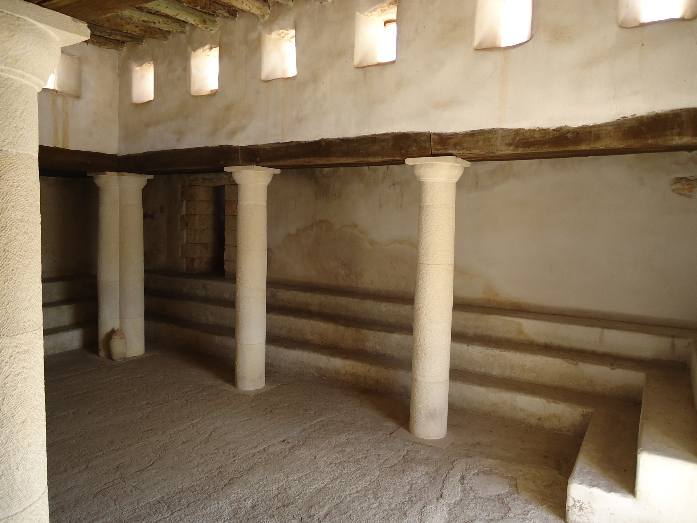

# Human-made Things in the Bible

## License Information

Human-made Things in the Bible © United Bible Societies, 2025. Adapted from: <cite>The Works of Their Hands: Man-made Things in the Bible</cite>, by Ray Pritz © 2009 United Bible Societies. This work is licensed under Creative Commons Attribution-ShareAlike 4.0 International (<a href="https://creativecommons.org/licenses/by-sa/4.0/">https://creativecommons.org/licenses/by-sa/4.0/</a>).

--------------------------------

## Synagogue (id: REALIA:3.17)

3\.17 Synagogue
===============

References:
-----------

Greek ἀποσυνάγωγος (aposunagōgos)

[JHN 9:22](https://ref.ly/John9:22), [JHN 12:42](https://ref.ly/John12:42), [JHN 16:2](https://ref.ly/John16:2)

Greek ἀρχισυνάγωγος (archisunagōgos)

[MRK 5:22](https://ref.ly/Mark5:22), [MRK 5:36](https://ref.ly/Mark5:36), [MRK 5:38](https://ref.ly/Mark5:38), [LUK 8:49](https://ref.ly/Luke8:49), [LUK 13:14](https://ref.ly/Luke13:14), [ACT 13:15](https://ref.ly/Acts13:15), [ACT 18:8](https://ref.ly/Acts18:8), [ACT 18:17](https://ref.ly/Acts18:17)

Greek συναγωγή (sunagōgē)

[MAT 4:23](https://ref.ly/Matt4:23), [MAT 6:2](https://ref.ly/Matt6:2), [MAT 6:5](https://ref.ly/Matt6:5), [MAT 9:35](https://ref.ly/Matt9:35), [MAT 10:17](https://ref.ly/Matt10:17), [MAT 12:9](https://ref.ly/Matt12:9), [MAT 13:54](https://ref.ly/Matt13:54), [MAT 23:6](https://ref.ly/Matt23:6), [MAT 23:34](https://ref.ly/Matt23:34), [MRK 1:21](https://ref.ly/Mark1:21), [MRK 1:23](https://ref.ly/Mark1:23), [MRK 1:29](https://ref.ly/Mark1:29), [MRK 1:39](https://ref.ly/Mark1:39), [MRK 3:1](https://ref.ly/Mark3:1), [MRK 6:2](https://ref.ly/Mark6:2), [MRK 12:39](https://ref.ly/Mark12:39), [MRK 13:9](https://ref.ly/Mark13:9), [LUK 4:15](https://ref.ly/Luke4:15), [LUK 4:16](https://ref.ly/Luke4:16), [LUK 4:20](https://ref.ly/Luke4:20), [LUK 4:28](https://ref.ly/Luke4:28), [LUK 4:33](https://ref.ly/Luke4:33), [LUK 4:38](https://ref.ly/Luke4:38), [LUK 4:44](https://ref.ly/Luke4:44), [LUK 6:6](https://ref.ly/Luke6:6), [LUK 7:5](https://ref.ly/Luke7:5), [LUK 8:41](https://ref.ly/Luke8:41), [LUK 11:43](https://ref.ly/Luke11:43), [LUK 12:11](https://ref.ly/Luke12:11), [LUK 13:10](https://ref.ly/Luke13:10), [LUK 20:46](https://ref.ly/Luke20:46), [LUK 21:12](https://ref.ly/Luke21:12), [JHN 6:59](https://ref.ly/John6:59), [JHN 18:20](https://ref.ly/John18:20), [ACT 6:9](https://ref.ly/Acts6:9), [ACT 9:2](https://ref.ly/Acts9:2), [ACT 9:20](https://ref.ly/Acts9:20), [ACT 13:5](https://ref.ly/Acts13:5), [ACT 13:14](https://ref.ly/Acts13:14), [ACT 13:43](https://ref.ly/Acts13:43), [ACT 14:1](https://ref.ly/Acts14:1), [ACT 15:21](https://ref.ly/Acts15:21), [ACT 17:1](https://ref.ly/Acts17:1), [ACT 17:10](https://ref.ly/Acts17:10), [ACT 17:17](https://ref.ly/Acts17:17), [ACT 18:4](https://ref.ly/Acts18:4), [ACT 18:7](https://ref.ly/Acts18:7), [ACT 18:19](https://ref.ly/Acts18:19), [ACT 18:26](https://ref.ly/Acts18:26), [ACT 19:8](https://ref.ly/Acts19:8), [ACT 22:19](https://ref.ly/Acts22:19), [ACT 24:12](https://ref.ly/Acts24:12), [ACT 26:11](https://ref.ly/Acts26:11), [JAS 2:2](https://ref.ly/Jas2:2), [REV 2:9](https://ref.ly/Rev2:9), [REV 3:9](https://ref.ly/Rev3:9)

Description and usage:
----------------------

*A reconstruction of the synagogue at Nazareth (© Ray Pritz by United Bible Societies)*

*A reconstruction of the interior of the synagogue at Nazareth (© Ray Pritz by United Bible Societies)*

 The synagogue was a building for assemblies, associated with religious activity (normally a building in which Jewish worship took place and in which the Law was taught). Synagogues were not normally large structures in New Testament times, and often they were not much larger than a home.

---

Translation:
------------

Synagogues are mentioned frequently in the New Testament, but surprisingly little is known about their physical structure at that time, since almost none have been excavated which can be dated definitely to the time of Jesus. While they probably had a literal “orientation” (that is, facing east), they had little of a distinctive architecture until after the period of the New Testament. Fortunately, it is not essential for the task of the translator to know details of the structure of the synagogue.

It is important to distinguish clearly between “synagogue” and “temple,” and it is not enough to speak of synagogues merely as “small temples.” There were many synagogues, but only one Temple in Jerusalem, the only place for Jewish sacrifices. It is better either to borrow a term for synagogue or to employ a descriptive equivalent such as “place where Jewish people worshiped God” or “building for worshiping God.”

It is also important to distinguish in translation between “synagogue” and “church,” whether these terms refer to the congregation or to the building.

The Greek word *sunagōgē* appears about a dozen times in the Deuterocanon, always with the meaning of a congregation or assembly of people. It should never be rendered in these books as some kind of building.

* **Associated Passages:** John 9:22; John 12:42; John 16:2; Mark 5:22; Mark 5:36; Mark 5:38; Luke 8:49; Luke 13:14; Acts 13:15; Acts 18:8; Acts 18:17; Matthew 4:23; Matthew 6:2; Matthew 6:5; Matthew 9:35; Matthew 10:17; Matthew 12:9; Matthew 13:54; Matthew 23:6; Matthew 23:34; Mark 1:21; Mark 1:23; Mark 1:29; Mark 1:39; Mark 3:1; Mark 6:2; Mark 12:39; Mark 13:9; Luke 4:15; Luke 4:16; Luke 4:20; Luke 4:28; Luke 4:33; Luke 4:38; Luke 4:44; Luke 6:6; Luke 7:5; Luke 8:41; Luke 11:43; Luke 12:11; Luke 13:10; Luke 20:46; Luke 21:12; John 6:59; John 18:20; Acts 6:9; Acts 9:2; Acts 9:20; Acts 13:5; Acts 13:14; Acts 13:43; Acts 14:1; Acts 15:21; Acts 17:1; Acts 17:10; Acts 17:17; Acts 18:4; Acts 18:7; Acts 18:19; Acts 18:26; Acts 19:8; Acts 22:19; Acts 24:12; Acts 26:11; James 2:2; Revelation 2:9; Revelation 3:9

