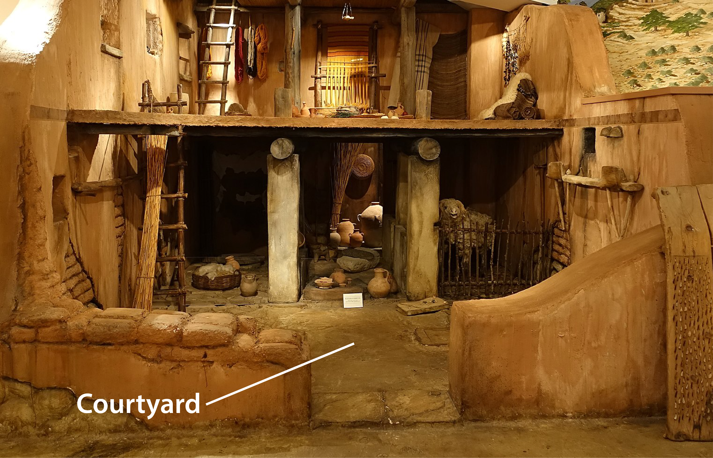
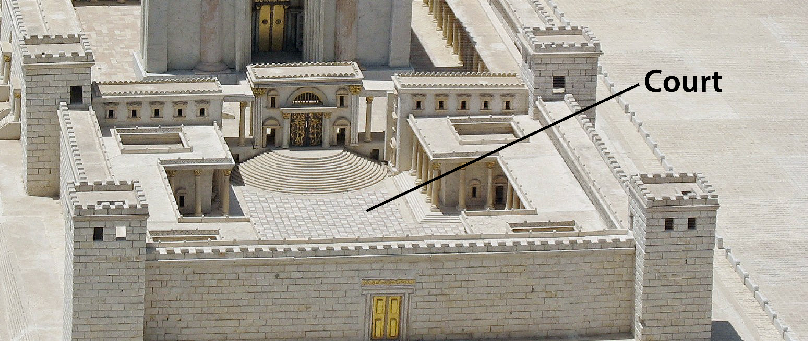
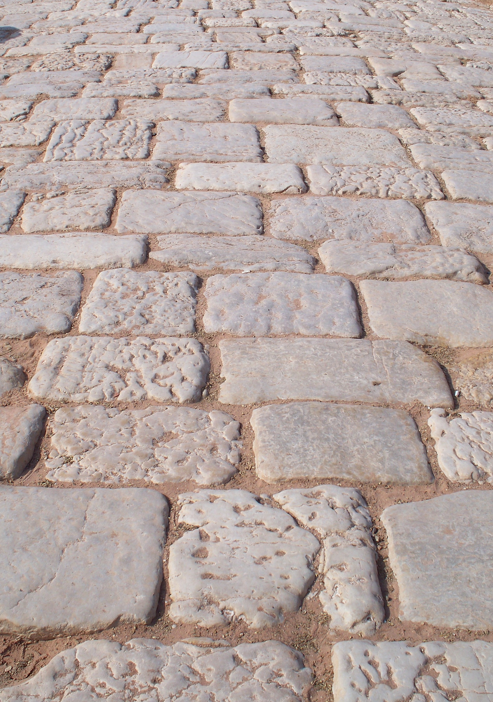

# Human-made Things in the Bible

## License Information

Human-made Things in the Bible © United Bible Societies, 2025. Adapted from: <cite>The Works of Their Hands: Man-made Things in the Bible</cite>, by Ray Pritz © 2009 United Bible Societies. This work is licensed under Creative Commons Attribution-ShareAlike 4.0 International (<a href="https://creativecommons.org/licenses/by-sa/4.0/">https://creativecommons.org/licenses/by-sa/4.0/</a>).

--------------------------------

## Courtyard, court (id: REALIA:3.20)

3\.20 Courtyard, court
======================

References:
-----------

Hebrew חָצֵר (chatser)

EXO 8:9, EXO 27:9, EXO 27:9, EXO 27:12, EXO 27:13, EXO 27:16, EXO 27:17, EXO 27:18, EXO 27:19, EXO 35:17, EXO 35:17, EXO 35:18, EXO 38:9, EXO 38:9, EXO 38:15, EXO 38:16, EXO 38:17, EXO 38:18, EXO 38:18, EXO 38:20, EXO 38:31, EXO 38:31, EXO 38:31, EXO 39:40, EXO 39:40, EXO 40:8, EXO 40:8, EXO 40:33, EXO 40:33, LEV 6:9, LEV 6:19, NUM 3:26, NUM 3:26, NUM 3:37, NUM 4:26, NUM 4:26, NUM 4:32, 2SA 17:18, 1KI 6:36, 1KI 7:8, 1KI 7:9, 1KI 7:12, 1KI 7:12, 1KI 8:64, 2KI 20:4, 2KI 21:5, 2KI 23:12, 1CH 23:28, 1CH 28:6, 1CH 28:12, 2CH 4:9, 2CH 7:7, 2CH 20:5, 2CH 23:5, 2CH 24:21, 2CH 29:16, 2CH 33:5, NEH 3:25, NEH 8:16, NEH 8:16, NEH 13:7, EST 1:5, EST 2:11, EST 4:11, EST 5:1, EST 5:2, EST 6:4, EST 6:4, EST 6:5, PSA 65:5, PSA 84:3, PSA 84:11, PSA 92:14, PSA 96:8, PSA 100:4, PSA 116:19, PSA 135:2, ISA 1:12, ISA 62:9, JER 19:14, JER 26:2, JER 32:2, JER 32:8, JER 32:12, JER 33:1, JER 36:10, JER 36:20, JER 37:21, JER 37:21, JER 38:6, JER 38:13, JER 38:28, JER 39:14, JER 39:15, EZK 8:7, EZK 8:16, EZK 9:7, EZK 10:3, EZK 10:4, EZK 10:5, EZK 40:14, EZK 40:17, EZK 40:17, EZK 40:19, EZK 40:20, EZK 40:23, EZK 40:27, EZK 40:28, EZK 40:31, EZK 40:32, EZK 40:34, EZK 40:37, EZK 40:44, EZK 40:47, EZK 41:15, EZK 42:1, EZK 42:3, EZK 42:3, EZK 42:6, EZK 42:7, EZK 42:8, EZK 42:9, EZK 42:10, EZK 42:14, EZK 43:5, EZK 44:17, EZK 44:17, EZK 44:19, EZK 44:19, EZK 44:21, EZK 44:27, EZK 45:19, EZK 46:1, EZK 46:20, EZK 46:21, EZK 46:21, EZK 46:21, EZK 46:21, EZK 46:21, EZK 46:21, EZK 46:22, EZK 46:22, ZEC 3:7

Hebrew עֲזָרָה (‘azarah)

2CH 4:9, 2CH 4:9, 2CH 6:13

Greek αὐλαῖος (aulaios)

2MA 14:41

Greek αὐλή (aulē)

MAT 26:3, MAT 26:58, MAT 26:69, MRK 14:54, MRK 14:66, MRK 15:16, LUK 11:21, LUK 22:55, JHN 18:15, REV 11:2, TOB 2:9, TOB 2:9, ESG 1:1, ESG 2:11, ESG 4:2, LJE 1:17, 1MA 4:38, 1MA 4:48, 1MA 9:54, 1MA 11:46, 3MA 2:27, 3MA 5:10, 3MA 5:46, 1ES 9:1

Greek περιβολή (peribolē)

SIR 50:11

Aramaic תְּרַע (tera‘)

DAN 2:49

Description:
------------

*Courtyard of a house (Daderot, CC0, via Wikimedia Commons)*

The courtyard was an open area enclosed by structures within a building complex, such as the Temple, a palace, or even a house.

---

Translation:
------------

As in English, so also in the biblical languages the words for “court” indicate both the physical courtyard and also the place of residence or activity of a king.

*Temple courtyard (© Ariely, CC BY 3\.0, via Wikimedia Commons)*

A number of times in the Old Testament, particularly in the Psalms, we encounter a phrase like “the courts of the LORD,” “your courts,” or “my courts.” In these places the word “courts” is a metonym for the Tabernacle or the Temple, and where necessary it may be translated as such. For example, in PSA 65:5GNT (Good News Translation (1992)) has “your sanctuary” and CEV (Contemporary English Version) says “your temple.” The translator should avoid using a word that indicates a court of law.

In some places the Greek word *aulē* refers to the courtyard of a private house. It has this meaning in MAT 26:3 and LUK 11:21, so CEV (Contemporary English Version) renders it “home” in these passages.

REV 11:2: “The court outside the temple” (RSV (Revised Standard Version (1952))) was known as the Court of the Gentiles, for that is where they could assemble. They could not get closer to the inner sanctuary, however. In this passage this court and its people stand for the unbelievers, who will not be spared the disasters to come. Another way of expressing the initial clause in this verse is “But do not measure the open spaces with walls around them outside the Temple.”

* **Associated Passages:** Exodus 8:9; Exodus 27:9; Exodus 27:12; Exodus 27:13; Exodus 27:16; Exodus 27:17; Exodus 27:18; Exodus 27:19; Exodus 35:17; Exodus 35:18; Exodus 38:9; Exodus 38:15; Exodus 38:16; Exodus 38:17; Exodus 38:18; Exodus 38:20; Exodus 38:31; Exodus 39:40; Exodus 40:8; Exodus 40:33; Leviticus 6:9; Leviticus 6:19; Numbers 3:26; Numbers 3:37; Numbers 4:26; Numbers 4:32; 2 Samuel 17:18; 1 Kings 6:36; 1 Kings 7:8; 1 Kings 7:9; 1 Kings 7:12; 1 Kings 8:64; 2 Kings 20:4; 2 Kings 21:5; 2 Kings 23:12; 1 Chronicles 23:28; 1 Chronicles 28:6; 1 Chronicles 28:12; 2 Chronicles 4:9; 2 Chronicles 7:7; 2 Chronicles 20:5; 2 Chronicles 23:5; 2 Chronicles 24:21; 2 Chronicles 29:16; 2 Chronicles 33:5; Nehemiah 3:25; Nehemiah 8:16; Nehemiah 13:7; Esther 1:5; Esther 2:11; Esther 4:11; Esther 5:1; Esther 5:2; Esther 6:4; Esther 6:5; Psalms 65:5; Psalms 84:3; Psalms 84:11; Psalms 92:14; Psalms 96:8; Psalms 100:4; Psalms 116:19; Psalms 135:2; Isaiah 1:12; Isaiah 62:9; Jeremiah 19:14; Jeremiah 26:2; Jeremiah 32:2; Jeremiah 32:8; Jeremiah 32:12; Jeremiah 33:1; Jeremiah 36:10; Jeremiah 36:20; Jeremiah 37:21; Jeremiah 38:6; Jeremiah 38:13; Jeremiah 38:28; Jeremiah 39:14; Jeremiah 39:15; Ezekiel 8:7; Ezekiel 8:16; Ezekiel 9:7; Ezekiel 10:3; Ezekiel 10:4; Ezekiel 10:5; Ezekiel 40:14; Ezekiel 40:17; Ezekiel 40:19; Ezekiel 40:20; Ezekiel 40:23; Ezekiel 40:27; Ezekiel 40:28; Ezekiel 40:31; Ezekiel 40:32; Ezekiel 40:34; Ezekiel 40:37; Ezekiel 40:44; Ezekiel 40:47; Ezekiel 41:15; Ezekiel 42:1; Ezekiel 42:3; Ezekiel 42:6; Ezekiel 42:7; Ezekiel 42:8; Ezekiel 42:9; Ezekiel 42:10; Ezekiel 42:14; Ezekiel 43:5; Ezekiel 44:17; Ezekiel 44:19; Ezekiel 44:21; Ezekiel 44:27; Ezekiel 45:19; Ezekiel 46:1; Ezekiel 46:20; Ezekiel 46:21; Ezekiel 46:22; Zechariah 3:7; 2 Chronicles 6:13; 2 Maccabees 14:41; Matthew 26:3; Matthew 26:58; Matthew 26:69; Mark 14:54; Mark 14:66; Mark 15:16; Luke 11:21; Luke 22:55; John 18:15; Revelation 11:2; Tobit 2:9; Esther Greek 1:1; Esther Greek 2:11; Esther Greek 4:2; Letter of Jeremiah 1:17; 1 Maccabees 4:38; 1 Maccabees 4:48; 1 Maccabees 9:54; 1 Maccabees 11:46; 3 Maccabees 2:27; 3 Maccabees 5:10; 3 Maccabees 5:46; 1 Esdras (Greek) 9:1; Sirach 50:11; Daniel 2:49

## Pavement, The Pavement (id: REALIA:3.20.1)

3\.20\.1 Pavement, The Pavement
===============================

References:
-----------

Hebrew לְבֵנָה (lvenah)

EXO 24:10

Hebrew מַלְבֵּן (malben)

JER 43:9

Hebrew רִצְפָה (ritsfah)

2CH 7:3, EST 1:6, EZK 40:17, EZK 40:17, EZK 40:18, EZK 40:18, EZK 42:3

Greek λιθόστρωτον (lithostrōton)

JHN 19:13

Greek ἔδαφος (edafos)

SIR 11:5, SIR 20:18, BEL 1:19, 3MA 2:22, 4MA 6:7

Description and usage:
----------------------

*Roman pavement, Petra (© High Contrast, CC BY 3\.0 DE, via Wikimedia Commons)*

Pavement was an area paved with flat blocks of stone to form a courtyard (not a road). “The Pavement” was the name given to the inner courtyard of the Roman fortress of Antonia, which bordered the northwest corner of the Temple complex in Jerusalem.

---

Translation:
------------

JER 43:9: The Hebrew word *malben* occurs elsewhere with the meaning of “brick mold” or “brickkiln” (see the discussion and references at [1\.8\.1 Brick mold, brickkiln\<REALIA:1\.8\.1\>](#)). Here it seems to indicate the material from which the pavement is made; NIV (New International Version (1984)), NCV (New Century Version), and CEV (Contemporary English Version) all render it “brick pavement.” Jeremiah is told to hide the stones “in the *melet* of the *malben*.” The Hebrew word *melet* occurs only here, and its meaning is uncertain. Translations usually render it as some material in which the bricks would be set, for example, “clay” (NRSV (New Revised Standard Version (1989)), NIV (New International Version (1984)), NCV (New Century Version)), “mortar” (RSV (Revised Standard Version (1952)), GNT (Good News Translation (1992))), or “cement” (REB (Revised English Bible (1989))). CEV (Contemporary English Version) avoids finding a specific material and focuses instead on the location, saying “underneath the brick pavement.”

JHN 19:13: In some languages translators may render “The Pavement” as “the court covered with large blocks of flat stone” or “the stone\-paved courtyard.”

The Greek word *edafos* does not refer to a specific place or even to a particular kind of construction. Thus it may be translated with a generic term such as “floor” or even “ground.”

* **Associated Passages:** Exodus 24:10; Jeremiah 43:9; 2 Chronicles 7:3; Esther 1:6; Ezekiel 40:17; Ezekiel 40:18; Ezekiel 42:3; John 19:13; Sirach 11:5; Sirach 20:18; Bel and the Dragon 1:19; 3 Maccabees 2:22; 4 Maccabees 6:7

