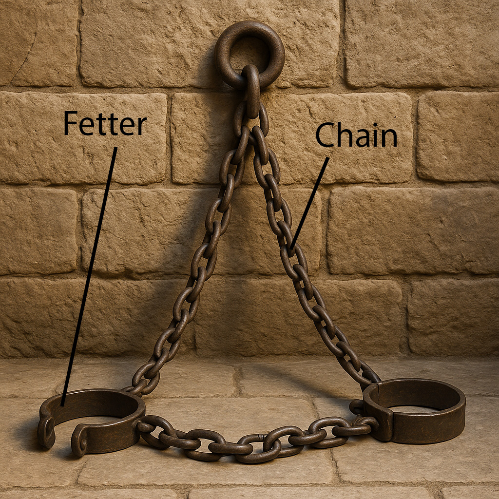

# Human-made Things in the Bible

## License Information

Human-made Things in the Bible © United Bible Societies, 2025. Adapted from: <cite>The Works of Their Hands: Man-made Things in the Bible</cite>, by Ray Pritz © 2009 United Bible Societies. This work is licensed under Creative Commons Attribution-ShareAlike 4.0 International (<a href="https://creativecommons.org/licenses/by-sa/4.0/">https://creativecommons.org/licenses/by-sa/4.0/</a>).

--------------------------------

## Chain (id: REALIA:3.21.4)

3\.21\.4 Chain
==============

References:
-----------

Hebrew אֲזִקִּים (’aziqim (plural of ’azeq))

[JER 40:1](https://ref.ly/Jer40:1), [JER 40:4](https://ref.ly/Jer40:4)

Hebrew זֵק (ziqim (plural of zeq))

[JOB 36:8](https://ref.ly/Job36:8), [PSA 149:8](https://ref.ly/Ps149:8), [ISA 45:14](https://ref.ly/Isa45:14), [NAM 3:10](https://ref.ly/Nah3:10)

Hebrew מַעֲדַנּוֹת (ma‘adanoth)

[JOB 38:31](https://ref.ly/Job38:31)

Hebrew מֹשְׁכוֹת (moshkoth)

[JOB 38:31](https://ref.ly/Job38:31)

Hebrew רַתּוּקָה (ratuqah)

[1KI 6:21](https://ref.ly/1Kgs6:21)

Greek ἅλυσις (halusis)

[MRK 5:3](https://ref.ly/Mark5:3), [MRK 5:4](https://ref.ly/Mark5:4), [MRK 5:4](https://ref.ly/Mark5:4), [LUK 8:29](https://ref.ly/Luke8:29), [ACT 12:6](https://ref.ly/Acts12:6), [ACT 12:7](https://ref.ly/Acts12:7), [ACT 21:33](https://ref.ly/Acts21:33), [ACT 28:20](https://ref.ly/Acts28:20), [EPH 6:20](https://ref.ly/Eph6:20), [2TI 1:16](https://ref.ly/2Tim1:16), [REV 20:1](https://ref.ly/Rev20:1), [WIS 17:16](https://ref.ly/Wis17:16)

Greek δέσμιος, δεσμός (desmios, desmos)

[LUK 8:29](https://ref.ly/Luke8:29), [LUK 13:16](https://ref.ly/Luke13:16), [ACT 16:26](https://ref.ly/Acts16:26), [ACT 20:23](https://ref.ly/Acts20:23), [ACT 23:29](https://ref.ly/Acts23:29), [ACT 26:29](https://ref.ly/Acts26:29), [ACT 26:31](https://ref.ly/Acts26:31), [PHP 1:7](https://ref.ly/Phil1:7), [PHP 1:14](https://ref.ly/Phil1:14), [PHP 1:17](https://ref.ly/Phil1:17), [COL 4:18](https://ref.ly/Col4:18), [2TI 2:9](https://ref.ly/2Tim2:9), [PHM 1:10](https://ref.ly/Phlm1:10), [PHM 1:13](https://ref.ly/Phlm1:13), [HEB 11:36](https://ref.ly/Heb11:36), [JUD 1:6](https://ref.ly/Jude1:6), [WIS 10:14](https://ref.ly/Wis10:14), [SIR 6:25](https://ref.ly/Sir6:25), [SIR 6:30](https://ref.ly/Sir6:30), [SIR 13:12](https://ref.ly/Sir13:12), [SIR 28:20](https://ref.ly/Sir28:20), [SIR 28:20](https://ref.ly/Sir28:20), [SIR 28:20](https://ref.ly/Sir28:20), [3MA 3:25](https://ref.ly/3Macc3:25), [3MA 4:7](https://ref.ly/3Macc4:7), [3MA 5:6](https://ref.ly/3Macc5:6), [3MA 6:27](https://ref.ly/3Macc6:27), [4MA 12:2](https://ref.ly/4Macc12:2), [1ES 1:38](https://ref.ly/1Esd1:38)

Greek σειρά (seira)

[2PE 2:4](https://ref.ly/2Pet2:4)

Description:
------------

*Drawing of fetters (to go around the ankles) attached to chains (Image generated by ChatGPT using OpenAI technology)*

The chain was a series of links, usually made of metal.

---

Usage:
------

A chain was normally used for restraining or for holding objects together. It is especially associated with the restriction of the movement of prisoners. See also [10\.5\.4 Necklace, chain, cord\<REALIA:10\.5\.4\>](#).

---

Translation:
------------

In a number of languages the expression for “chain” is simply “metal rope.” In other languages it may be rendered “linked rope” in contrast with “twisted rope,” that is, a rope made out of some kind of fiber. In some languages a distinction is made between terms for a chain used in tying up a person and one employed in agricultural or industrial work.

In some of the passages listed above “chains” is symbolic language for imprisonment. Many translations will want to follow the model of GNT (Good News Translation (1992)) in a passage like [PHP 1:7](https://ref.ly/Phil1:7). In the middle of this verse the Greek text says literally “in that I am chained,” but GNT (Good News Translation (1992)) has “now that I am in prison.”

The chains placed by Solomon in front of the Holy of Holies ([1KI 6:21](https://ref.ly/1Kgs6:21)) were made of gold and served primarily as decoration, although they would also have reminded those serving in the sanctuary not to come any closer to the Holy of Holies.

In [JOB 38:31](https://ref.ly/Job38:31) two Hebrew words demand special attention. The word *ma‘adanoth* (which appears also in [1SA 15:32](https://ref.ly/1Sam15:32) with an unrelated meaning) comes together with a verb meaning “to tie, bind.” The word *ma‘adanoth* is of uncertain meaning, but it seems likely that there has occurred a reversal of two Hebrew letters from a word meaning “ring,” so that *ma‘adanoth* means a series of connected rings, that is, a “chain” (RSV (Revised Standard Version (1952))). Some translations prefer to combine the verb with the noun and render them simply “tie together” (so GNT (Good News Translation (1992)), GECL (German Common Language Version (Gute Nachricht Bibel))) with no reference to the object used to bind. The second Hebrew word, *moshkoth*, appears only here in Scripture. It comes from a verb meaning “to pull, draw.” In modern Hebrew *moshkoth* means “reins” (leather straps for controlling a horse), and this is reflected in NJPSV (New Jewish Publication Society Version), which renders the second line of this verse as “Or undo the reins of Orion.” Other translations (NEB (New English Bible (1970)), REB (Revised English Bible (1989)), GECL (German Common Language Version (Gute Nachricht Bibel))) understand *moshkoth* to refer to the three aligned stars that make up the “belt” of the Orion constellation.

[PSA 149:8](https://ref.ly/Ps149:8): For this verse RSV (Revised Standard Version (1952)) has “to bind their kings with chains and their nobles with fetters of iron.” “Their nobles” is parallel to “their kings” and indicates the military leaders. In some languages the use of “chains” and “fetters of iron” will tend to give the impression that the kings were bound with chains that were not made of iron. The poetic parallel, however, indicates that they are equivalent. In some languages this verse may be rendered “to capture their kings and leaders and tie them up.”

[REV 20:1](https://ref.ly/Rev20:1): “A great chain” (RSV (Revised Standard Version (1952))) may be rendered “a heavy chain” (GNT (Good News Translation (1992))) or “a thick chain.” We assume the chain was made of metal. The expressed purpose of this chain is to restrain Satan. In cultures where metal chains are unknown, translators may say “a big \[or, thick] rope,” or they may employ some other material that is used for tying up people.

* **Associated Passages:** Jeremiah 40:1; Jeremiah 40:4; Job 36:8; Psalms 149:8; Isaiah 45:14; Nahum 3:10; Job 38:31; 1 Kings 6:21; Mark 5:3; Mark 5:4; Luke 8:29; Acts 12:6; Acts 12:7; Acts 21:33; Acts 28:20; Ephesians 6:20; 2 Timothy 1:16; Revelation 20:1; Wisdom of Solomon 17:16; Luke 13:16; Acts 16:26; Acts 20:23; Acts 23:29; Acts 26:29; Acts 26:31; Philippians 1:7; Philippians 1:14; Philippians 1:17; Colossians 4:18; 2 Timothy 2:9; Philemon 1:10; Philemon 1:13; Hebrews 11:36; Jude 1:6; Wisdom of Solomon 10:14; Sirach 6:25; Sirach 6:30; Sirach 13:12; Sirach 28:20; 3 Maccabees 3:25; 3 Maccabees 4:7; 3 Maccabees 5:6; 3 Maccabees 6:27; 4 Maccabees 12:2; 1 Esdras (Greek) 1:38; 2 Peter 2:4; 1 Samuel 15:32

