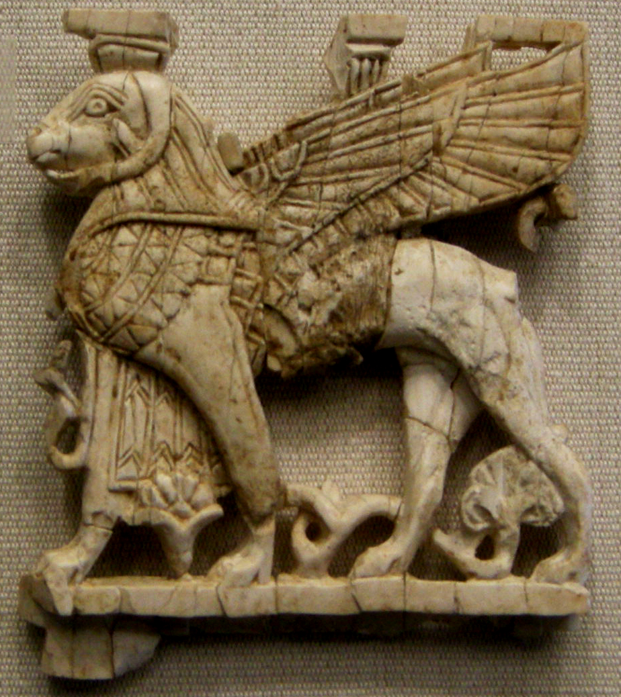

# Human-made Things in the Bible

## License Information

Human-made Things in the Bible © United Bible Societies, 2025. Adapted from: <cite>The Works of Their Hands: Man-made Things in the Bible</cite>, by Ray Pritz © 2009 United Bible Societies. This work is licensed under Creative Commons Attribution-ShareAlike 4.0 International (<a href="https://creativecommons.org/licenses/by-sa/4.0/">https://creativecommons.org/licenses/by-sa/4.0/</a>).

--------------------------------

## Winged creatures, cherubim (id: REALIA:4.1.2)

4\.1\.2 Winged creatures, cherubim
==================================

References:
-----------

Hebrew כְּרוּב (kruv)

[GEN 3:24](https://ref.ly/Gen3:24), [EXO 25:18](https://ref.ly/Exod25:18), [EXO 25:19](https://ref.ly/Exod25:19), [EXO 25:19](https://ref.ly/Exod25:19), [EXO 25:19](https://ref.ly/Exod25:19), [EXO 25:20](https://ref.ly/Exod25:20), [EXO 25:20](https://ref.ly/Exod25:20), [EXO 25:22](https://ref.ly/Exod25:22), [EXO 26:1](https://ref.ly/Exod26:1), [EXO 26:31](https://ref.ly/Exod26:31), [EXO 36:8](https://ref.ly/Exod36:8), [EXO 36:35](https://ref.ly/Exod36:35), [EXO 37:7](https://ref.ly/Exod37:7), [EXO 37:8](https://ref.ly/Exod37:8), [EXO 37:8](https://ref.ly/Exod37:8), [EXO 37:8](https://ref.ly/Exod37:8), [EXO 37:9](https://ref.ly/Exod37:9), [EXO 37:9](https://ref.ly/Exod37:9), [NUM 7:89](https://ref.ly/Num7:89), [1SA 4:4](https://ref.ly/1Sam4:4), [2SA 6:2](https://ref.ly/2Sam6:2), [2SA 22:11](https://ref.ly/2Sam22:11), [1KI 6:23](https://ref.ly/1Kgs6:23), [1KI 6:24](https://ref.ly/1Kgs6:24), [1KI 6:24](https://ref.ly/1Kgs6:24), [1KI 6:25](https://ref.ly/1Kgs6:25), [1KI 6:25](https://ref.ly/1Kgs6:25), [1KI 6:26](https://ref.ly/1Kgs6:26), [1KI 6:26](https://ref.ly/1Kgs6:26), [1KI 6:27](https://ref.ly/1Kgs6:27), [1KI 6:27](https://ref.ly/1Kgs6:27), [1KI 6:27](https://ref.ly/1Kgs6:27), [1KI 6:28](https://ref.ly/1Kgs6:28), [1KI 6:29](https://ref.ly/1Kgs6:29), [1KI 6:32](https://ref.ly/1Kgs6:32), [1KI 6:32](https://ref.ly/1Kgs6:32), [1KI 6:35](https://ref.ly/1Kgs6:35), [1KI 7:29](https://ref.ly/1Kgs7:29), [1KI 7:36](https://ref.ly/1Kgs7:36), [1KI 8:6](https://ref.ly/1Kgs8:6), [1KI 8:7](https://ref.ly/1Kgs8:7), [1KI 8:7](https://ref.ly/1Kgs8:7), [2KI 19:15](https://ref.ly/2Kgs19:15), [1CH 13:6](https://ref.ly/1Chr13:6), [1CH 28:18](https://ref.ly/1Chr28:18), [2CH 3:7](https://ref.ly/2Chr3:7), [2CH 3:10](https://ref.ly/2Chr3:10), [2CH 3:11](https://ref.ly/2Chr3:11), [2CH 3:11](https://ref.ly/2Chr3:11), [2CH 3:12](https://ref.ly/2Chr3:12), [2CH 3:12](https://ref.ly/2Chr3:12), [2CH 3:13](https://ref.ly/2Chr3:13), [2CH 3:14](https://ref.ly/2Chr3:14), [2CH 5:7](https://ref.ly/2Chr5:7), [2CH 5:8](https://ref.ly/2Chr5:8), [2CH 5:8](https://ref.ly/2Chr5:8), [PSA 18:11](https://ref.ly/Ps18:11), [PSA 80:2](https://ref.ly/Ps80:2), [PSA 99:1](https://ref.ly/Ps99:1), [ISA 37:16](https://ref.ly/Isa37:16), [EZK 9:3](https://ref.ly/Ezek9:3), [EZK 10:1](https://ref.ly/Ezek10:1), [EZK 10:2](https://ref.ly/Ezek10:2), [EZK 10:2](https://ref.ly/Ezek10:2), [EZK 10:3](https://ref.ly/Ezek10:3), [EZK 10:4](https://ref.ly/Ezek10:4), [EZK 10:5](https://ref.ly/Ezek10:5), [EZK 10:6](https://ref.ly/Ezek10:6), [EZK 10:7](https://ref.ly/Ezek10:7), [EZK 10:7](https://ref.ly/Ezek10:7), [EZK 10:7](https://ref.ly/Ezek10:7), [EZK 10:8](https://ref.ly/Ezek10:8), [EZK 10:9](https://ref.ly/Ezek10:9), [EZK 10:9](https://ref.ly/Ezek10:9), [EZK 10:9](https://ref.ly/Ezek10:9), [EZK 10:14](https://ref.ly/Ezek10:14), [EZK 10:15](https://ref.ly/Ezek10:15), [EZK 10:16](https://ref.ly/Ezek10:16), [EZK 10:16](https://ref.ly/Ezek10:16), [EZK 10:18](https://ref.ly/Ezek10:18), [EZK 10:19](https://ref.ly/Ezek10:19), [EZK 10:20](https://ref.ly/Ezek10:20), [EZK 11:22](https://ref.ly/Ezek11:22), [EZK 28:14](https://ref.ly/Ezek28:14), [EZK 28:16](https://ref.ly/Ezek28:16), [EZK 41:18](https://ref.ly/Ezek41:18), [EZK 41:18](https://ref.ly/Ezek41:18), [EZK 41:18](https://ref.ly/Ezek41:18), [EZK 41:18](https://ref.ly/Ezek41:18), [EZK 41:20](https://ref.ly/Ezek41:20), [EZK 41:25](https://ref.ly/Ezek41:25)

Greek Χερούβ (cheroub)

[HEB 9:5](https://ref.ly/Heb9:5), [SIR 49:8](https://ref.ly/Sir49:8), [ODA 8:54](https://ref.ly/Odes8:54), [DAG 3:55](https://ref.ly/INVALID)

Description:
------------

*Nimrud ivory plaque with ram\-headed sphinx (Assyrian, Syro\-Phoenician, 8th\-7th c. BCE) (© I, Sailko, CC BY\-SA 3\.0, via Wikimedia Commons)*

The cherub is mentioned over ninety times in Scripture and seems to be a composite being. (Some of the references are to the creatures themselves, but the places listed above refer to physical representations of those creatures.) The only consistent information given to describe cherubim (the Hebrew plural of *kruv*) is that they had wings. In some places they have one face, in others four faces. Sometimes they are said to have two legs, at other times four legs. Three\-dimensional statues of them were part of the atonement lid that covered the Covenant Box (see [4\.1\.1 Mercy seat, atonement cover, atonement lid\<REALIA:4\.1\.1\>](#) and the illustration at [4\.1 Covenant Box, Ark of the Covenant\<REALIA:4\.1\>](#)). These figures faced each other from either end of the lid, and their wings arched up to meet over the middle of the lid, providing a kind of protecting cover over the Box.

Much larger three\-dimensional cherubim were placed by Solomon in the Most Holy Place of the Temple. These were carved of olivewood and were overlaid with gold. Unlike the cherubim on the atonement lid, these stood side by side facing the same direction. Their wings were extended, with one wing of each meeting a wing of the other in the center of the room.

Representations of cherubim were also embroidered on different cloth items in the Tabernacle. In the Temple, where walls replaced the curtains, similar figures were carved in relief on the walls.

The cherubim serve in Scripture as symbols of God’s majesty and presence. They have also been understood as guardians of the approach to the presence of God (compare [GEN 3:24](https://ref.ly/Gen3:24)).

---

Translation:
------------

Since the term “cherub” is largely unknown or misunderstood, translators should normally avoid transliterating this word unless it is accompanied by a descriptive phrase, and even then the transliterated form may not be helpful. In most translations a descriptive note will be helpful. Some attempts at rendering this word by means of a descriptive phrase may result in confusing the reader, due to the very large number of winged creatures he already knows. If the descriptive phrase is confusing for the reader, it may be better to borrow the term from a major language in the area. Translators must not give the impression that the cherub is a variant of some locally known large bird. Even though the cherub’s distinguishing characteristic was the fact of having wings, “winged animal” does not do justice to the composite nature of this ancient symbol. A phrase like “flying being” may be meaningless, and “flying thing” may be equated with anything from an insect to an airplane. It may be appropriate to say “winged image” or “winged figure.” In general, it may be best to employ a phrase such as “image of a winged heavenly creature” or “statue of a winged heavenly animal.”

* **Associated Passages:** Genesis 3:24; Exodus 25:18; Exodus 25:19; Exodus 25:20; Exodus 25:22; Exodus 26:1; Exodus 26:31; Exodus 36:8; Exodus 36:35; Exodus 37:7; Exodus 37:8; Exodus 37:9; Numbers 7:89; 1 Samuel 4:4; 2 Samuel 6:2; 2 Samuel 22:11; 1 Kings 6:23; 1 Kings 6:24; 1 Kings 6:25; 1 Kings 6:26; 1 Kings 6:27; 1 Kings 6:28; 1 Kings 6:29; 1 Kings 6:32; 1 Kings 6:35; 1 Kings 7:29; 1 Kings 7:36; 1 Kings 8:6; 1 Kings 8:7; 2 Kings 19:15; 1 Chronicles 13:6; 1 Chronicles 28:18; 2 Chronicles 3:7; 2 Chronicles 3:10; 2 Chronicles 3:11; 2 Chronicles 3:12; 2 Chronicles 3:13; 2 Chronicles 3:14; 2 Chronicles 5:7; 2 Chronicles 5:8; Psalms 18:11; Psalms 80:2; Psalms 99:1; Isaiah 37:16; Ezekiel 9:3; Ezekiel 10:1; Ezekiel 10:2; Ezekiel 10:3; Ezekiel 10:4; Ezekiel 10:5; Ezekiel 10:6; Ezekiel 10:7; Ezekiel 10:8; Ezekiel 10:9; Ezekiel 10:14; Ezekiel 10:15; Ezekiel 10:16; Ezekiel 10:18; Ezekiel 10:19; Ezekiel 10:20; Ezekiel 11:22; Ezekiel 28:14; Ezekiel 28:16; Ezekiel 41:18; Ezekiel 41:20; Ezekiel 41:25; Hebrews 9:5; Sirach 49:8; Odae/Odes 8:54; Daniel Greek 3:55

