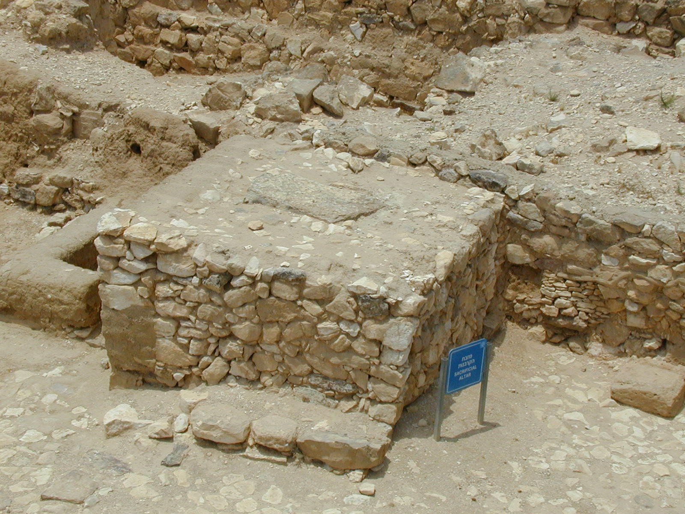
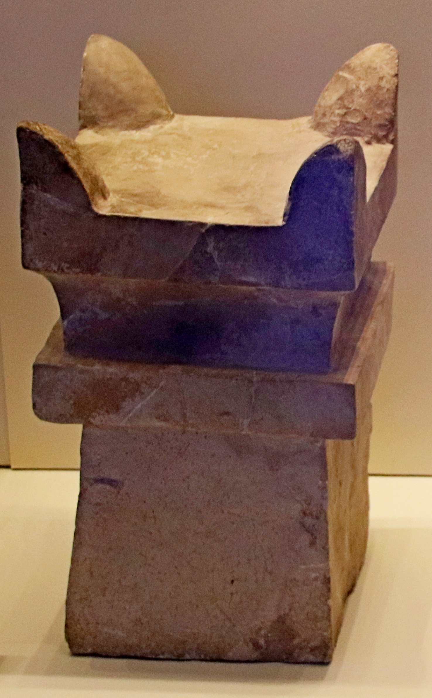

# Human-made Things in the Bible

## License Information

Human-made Things in the Bible © United Bible Societies, 2025. Adapted from: <cite>The Works of Their Hands: Man-made Things in the Bible</cite>, by Ray Pritz © 2009 United Bible Societies. This work is licensed under Creative Commons Attribution-ShareAlike 4.0 International (<a href="https://creativecommons.org/licenses/by-sa/4.0/">https://creativecommons.org/licenses/by-sa/4.0/</a>).

--------------------------------

## Stone altar (id: REALIA:4.2.1)

4\.2\.1 Stone altar
===================

References:
-----------

Hebrew מִזְבֵּחַ (mizbeach)

[GEN 8:20](https://ref.ly/Gen8:20), [GEN 8:20](https://ref.ly/Gen8:20), [GEN 12:7](https://ref.ly/Gen12:7), [GEN 12:8](https://ref.ly/Gen12:8), [GEN 13:4](https://ref.ly/Gen13:4), [GEN 13:18](https://ref.ly/Gen13:18), [GEN 22:9](https://ref.ly/Gen22:9), [GEN 22:9](https://ref.ly/Gen22:9), [GEN 26:25](https://ref.ly/Gen26:25), [GEN 33:20](https://ref.ly/Gen33:20), [GEN 35:1](https://ref.ly/Gen35:1), [GEN 35:3](https://ref.ly/Gen35:3), [GEN 35:7](https://ref.ly/Gen35:7), [EXO 17:15](https://ref.ly/Exod17:15), [EXO 20:24](https://ref.ly/Exod20:24), [EXO 20:25](https://ref.ly/Exod20:25), [EXO 20:26](https://ref.ly/Exod20:26), [EXO 21:14](https://ref.ly/Exod21:14), [EXO 24:4](https://ref.ly/Exod24:4), [EXO 24:6](https://ref.ly/Exod24:6), [EXO 32:5](https://ref.ly/Exod32:5), [EXO 34:13](https://ref.ly/Exod34:13), [NUM 23:1](https://ref.ly/Num23:1), [NUM 23:2](https://ref.ly/Num23:2), [NUM 23:4](https://ref.ly/Num23:4), [NUM 23:4](https://ref.ly/Num23:4), [NUM 23:14](https://ref.ly/Num23:14), [NUM 23:14](https://ref.ly/Num23:14), [NUM 23:29](https://ref.ly/Num23:29), [NUM 23:30](https://ref.ly/Num23:30), [DEU 7:5](https://ref.ly/Deut7:5), [DEU 12:3](https://ref.ly/Deut12:3), [DEU 27:5](https://ref.ly/Deut27:5), [DEU 27:5](https://ref.ly/Deut27:5), [DEU 27:6](https://ref.ly/Deut27:6), [DEU 33:10](https://ref.ly/Deut33:10), [JOS 8:30](https://ref.ly/Josh8:30), [JOS 8:31](https://ref.ly/Josh8:31), [JOS 9:27](https://ref.ly/Josh9:27), [JOS 22:10](https://ref.ly/Josh22:10), [JOS 22:10](https://ref.ly/Josh22:10), [JOS 22:11](https://ref.ly/Josh22:11), [JOS 22:16](https://ref.ly/Josh22:16), [JOS 22:19](https://ref.ly/Josh22:19), [JOS 22:19](https://ref.ly/Josh22:19), [JOS 22:23](https://ref.ly/Josh22:23), [JOS 22:26](https://ref.ly/Josh22:26), [JOS 22:28](https://ref.ly/Josh22:28), [JOS 22:29](https://ref.ly/Josh22:29), [JOS 22:34](https://ref.ly/Josh22:34), [JDG 2:2](https://ref.ly/Judg2:2), [JDG 6:24](https://ref.ly/Judg6:24), [JDG 6:25](https://ref.ly/Judg6:25), [JDG 6:26](https://ref.ly/Judg6:26), [JDG 6:28](https://ref.ly/Judg6:28), [JDG 6:28](https://ref.ly/Judg6:28), [JDG 6:30](https://ref.ly/Judg6:30), [JDG 6:31](https://ref.ly/Judg6:31), [JDG 6:32](https://ref.ly/Judg6:32), [JDG 13:20](https://ref.ly/Judg13:20), [JDG 13:20](https://ref.ly/Judg13:20), [JDG 21:4](https://ref.ly/Judg21:4), [1SA 7:17](https://ref.ly/1Sam7:17), [1SA 14:35](https://ref.ly/1Sam14:35), [1SA 14:35](https://ref.ly/1Sam14:35), [2SA 24:18](https://ref.ly/2Sam24:18), [2SA 24:21](https://ref.ly/2Sam24:21), [2SA 24:25](https://ref.ly/2Sam24:25), [1KI 3:4](https://ref.ly/1Kgs3:4), [1KI 12:32](https://ref.ly/1Kgs12:32), [1KI 12:33](https://ref.ly/1Kgs12:33), [1KI 12:33](https://ref.ly/1Kgs12:33), [1KI 13:1](https://ref.ly/1Kgs13:1), [1KI 13:2](https://ref.ly/1Kgs13:2), [1KI 13:2](https://ref.ly/1Kgs13:2), [1KI 13:2](https://ref.ly/1Kgs13:2), [1KI 13:3](https://ref.ly/1Kgs13:3), [1KI 13:4](https://ref.ly/1Kgs13:4), [1KI 13:4](https://ref.ly/1Kgs13:4), [1KI 13:5](https://ref.ly/1Kgs13:5), [1KI 13:5](https://ref.ly/1Kgs13:5), [1KI 13:32](https://ref.ly/1Kgs13:32), [1KI 16:32](https://ref.ly/1Kgs16:32), [1KI 18:26](https://ref.ly/1Kgs18:26), [1KI 18:30](https://ref.ly/1Kgs18:30), [1KI 18:32](https://ref.ly/1Kgs18:32), [1KI 18:32](https://ref.ly/1Kgs18:32), [1KI 18:35](https://ref.ly/1Kgs18:35), [1KI 19:10](https://ref.ly/1Kgs19:10), [1KI 19:14](https://ref.ly/1Kgs19:14), [2KI 11:18](https://ref.ly/2Kgs11:18), [2KI 11:18](https://ref.ly/2Kgs11:18), [2KI 11:18](https://ref.ly/2Kgs11:18), [2KI 16:10](https://ref.ly/2Kgs16:10), [2KI 16:10](https://ref.ly/2Kgs16:10), [2KI 18:22](https://ref.ly/2Kgs18:22), [2KI 21:3](https://ref.ly/2Kgs21:3), [2KI 23:12](https://ref.ly/2Kgs23:12), [2KI 23:12](https://ref.ly/2Kgs23:12), [2KI 23:15](https://ref.ly/2Kgs23:15), [2KI 23:15](https://ref.ly/2Kgs23:15), [2KI 23:16](https://ref.ly/2Kgs23:16), [2KI 23:17](https://ref.ly/2Kgs23:17), [2KI 23:20](https://ref.ly/2Kgs23:20), [1CH 21:18](https://ref.ly/1Chr21:18), [1CH 21:22](https://ref.ly/1Chr21:22), [1CH 21:26](https://ref.ly/1Chr21:26), [1CH 21:26](https://ref.ly/1Chr21:26), [2CH 14:2](https://ref.ly/2Chr14:2), [2CH 23:17](https://ref.ly/2Chr23:17), [2CH 23:17](https://ref.ly/2Chr23:17), [2CH 28:24](https://ref.ly/2Chr28:24), [2CH 30:14](https://ref.ly/2Chr30:14), [2CH 31:1](https://ref.ly/2Chr31:1), [2CH 32:12](https://ref.ly/2Chr32:12), [2CH 33:3](https://ref.ly/2Chr33:3), [2CH 33:15](https://ref.ly/2Chr33:15), [2CH 34:4](https://ref.ly/2Chr34:4), [2CH 34:5](https://ref.ly/2Chr34:5), [2CH 34:5](https://ref.ly/2Chr34:5), [2CH 34:7](https://ref.ly/2Chr34:7), [ISA 17:8](https://ref.ly/Isa17:8), [ISA 19:19](https://ref.ly/Isa19:19), [ISA 27:9](https://ref.ly/Isa27:9), [ISA 36:7](https://ref.ly/Isa36:7), [JER 11:13](https://ref.ly/Jer11:13), [JER 11:13](https://ref.ly/Jer11:13), [JER 17:1](https://ref.ly/Jer17:1), [JER 17:2](https://ref.ly/Jer17:2), [EZK 6:4](https://ref.ly/Ezek6:4), [EZK 6:5](https://ref.ly/Ezek6:5), [EZK 6:6](https://ref.ly/Ezek6:6), [EZK 6:13](https://ref.ly/Ezek6:13), [HOS 8:11](https://ref.ly/Hos8:11), [HOS 8:11](https://ref.ly/Hos8:11), [HOS 10:1](https://ref.ly/Hos10:1), [HOS 10:2](https://ref.ly/Hos10:2), [HOS 10:8](https://ref.ly/Hos10:8), [HOS 12:12](https://ref.ly/Hos12:12), [AMO 2:8](https://ref.ly/Amos2:8), [AMO 3:14](https://ref.ly/Amos3:14), [AMO 3:14](https://ref.ly/Amos3:14)

Greek βωμός (bomōs)

[ACT 17:23](https://ref.ly/Acts17:23), [1MA 1:47](https://ref.ly/1Macc1:47), [1MA 1:54](https://ref.ly/1Macc1:54), [1MA 2:23](https://ref.ly/1Macc2:23), [1MA 2:24](https://ref.ly/1Macc2:24), [1MA 2:25](https://ref.ly/1Macc2:25), [1MA 2:45](https://ref.ly/1Macc2:45), [1MA 5:68](https://ref.ly/1Macc5:68), [2MA 10:2](https://ref.ly/2Macc10:2)

Greek θυσιαστήριον (thusiastērion)

[ROM 11:3](https://ref.ly/Rom11:3), [JAS 2:21](https://ref.ly/Jas2:21)

Description and usage:
----------------------

*Flat altar made of uncut stones (© Ray Pritz by United Bible Societies)*

In Old Testament times, especially before the Tabernacle or the Temple was made, stone altars were built in the open air for the purpose of making sacrifices. The altars were made from large stones, piled together to form a platform. The sacrifices were of sheep or goats, or of offerings of grain. The stones used to make Israelite altars were not to be cut or shaped with iron tools ([EXO 20:25](https://ref.ly/Exod20:25); [DEU 27:5](https://ref.ly/Deut27:5)).

---

Translation:
------------

*Circular Canaanite altar found at Megiddo (© Ray Pritz by United Bible Societies)*

Some languages may distinguish between natural stone and blocks that are the result of cutting and shaping. Where the stones of the altar are mentioned, translators should choose a word for natural stones.

If sacrificing animals is something that is done in the receptor\-language culture, then consider whether there is some cultural equivalent for an altar. A number of modern cultures have elevated structures for sacrificing animals or for offering gifts to a deity. Sometimes this will be a stone or wood platform or table. Be sure that the translation makes it clear that the sacrifice is being offered to God.

A descriptive equivalent of “altar” occurs in some languages as “place where gifts are given to God.” Several other models are “place/plat­form/hearth where people offer sacrifices,” “bed/platform for \[killing and] offering sacrifices,” and “\[hearth] stones for/of sacrificing things.” In some contexts it may be necessary to add a phrase such as “where sacrifices are burned to God” or “where incense is burned to honor God.” Other possible translations include “thing on which \[sacred] offerings are placed” and “place of sacrifice.” In most passages the actual form of the altar is not in focus; the important fact is that it was a place where sacrifices were made.

Warning: In some South American languages a transliterated form of “altar” (or its Spanish or Portuguese equivalent) may occur. This word is often “borrowed” with a restricted meaning, sometimes referring to the shrine of a particular saint, or to the front section of a church, or to a patriotic shrine. When a borrowed word of this kind occurs, always check carefully what meaning it has for speakers of the receptor language in order to know whether or not it is suitable.

Similarly, translators may be tempted to use a transliteration of the word “altar” because that is what is used locally in the Roman Catholic, Anglican, or other church. As in the case of the term “priest,” it is recommended that this Christian term not be used as the basis for Old Testament translation, because it has a very different theological significance. See also [4\.7 Cult place, high place\<REALIA:4\.7\>](#).

* **Associated Passages:** Genesis 8:20; Genesis 12:7; Genesis 12:8; Genesis 13:4; Genesis 13:18; Genesis 22:9; Genesis 26:25; Genesis 33:20; Genesis 35:1; Genesis 35:3; Genesis 35:7; Exodus 17:15; Exodus 20:24; Exodus 20:25; Exodus 20:26; Exodus 21:14; Exodus 24:4; Exodus 24:6; Exodus 32:5; Exodus 34:13; Numbers 23:1; Numbers 23:2; Numbers 23:4; Numbers 23:14; Numbers 23:29; Numbers 23:30; Deuteronomy 7:5; Deuteronomy 12:3; Deuteronomy 27:5; Deuteronomy 27:6; Deuteronomy 33:10; Joshua 8:30; Joshua 8:31; Joshua 9:27; Joshua 22:10; Joshua 22:11; Joshua 22:16; Joshua 22:19; Joshua 22:23; Joshua 22:26; Joshua 22:28; Joshua 22:29; Joshua 22:34; Judges 2:2; Judges 6:24; Judges 6:25; Judges 6:26; Judges 6:28; Judges 6:30; Judges 6:31; Judges 6:32; Judges 13:20; Judges 21:4; 1 Samuel 7:17; 1 Samuel 14:35; 2 Samuel 24:18; 2 Samuel 24:21; 2 Samuel 24:25; 1 Kings 3:4; 1 Kings 12:32; 1 Kings 12:33; 1 Kings 13:1; 1 Kings 13:2; 1 Kings 13:3; 1 Kings 13:4; 1 Kings 13:5; 1 Kings 13:32; 1 Kings 16:32; 1 Kings 18:26; 1 Kings 18:30; 1 Kings 18:32; 1 Kings 18:35; 1 Kings 19:10; 1 Kings 19:14; 2 Kings 11:18; 2 Kings 16:10; 2 Kings 18:22; 2 Kings 21:3; 2 Kings 23:12; 2 Kings 23:15; 2 Kings 23:16; 2 Kings 23:17; 2 Kings 23:20; 1 Chronicles 21:18; 1 Chronicles 21:22; 1 Chronicles 21:26; 2 Chronicles 14:2; 2 Chronicles 23:17; 2 Chronicles 28:24; 2 Chronicles 30:14; 2 Chronicles 31:1; 2 Chronicles 32:12; 2 Chronicles 33:3; 2 Chronicles 33:15; 2 Chronicles 34:4; 2 Chronicles 34:5; 2 Chronicles 34:7; Isaiah 17:8; Isaiah 19:19; Isaiah 27:9; Isaiah 36:7; Jeremiah 11:13; Jeremiah 17:1; Jeremiah 17:2; Ezekiel 6:4; Ezekiel 6:5; Ezekiel 6:6; Ezekiel 6:13; Hosea 8:11; Hosea 10:1; Hosea 10:2; Hosea 10:8; Hosea 12:12; Amos 2:8; Amos 3:14; Acts 17:23; 1 Maccabees 1:47; 1 Maccabees 1:54; 1 Maccabees 2:23; 1 Maccabees 2:24; 1 Maccabees 2:25; 1 Maccabees 2:45; 1 Maccabees 5:68; 2 Maccabees 10:2; Romans 11:3; James 2:21

## Horns of the altar (id: REALIA:4.2.1.1)

4\.2\.1\.1 Horns of the altar
=============================

References:
-----------

Hebrew קֶרֶן (qarnoth (plural form of qeren))

[EXO 27:2](https://ref.ly/Exod27:2), [EXO 27:2](https://ref.ly/Exod27:2), [EXO 29:12](https://ref.ly/Exod29:12), [EXO 30:2](https://ref.ly/Exod30:2), [EXO 30:3](https://ref.ly/Exod30:3), [EXO 30:10](https://ref.ly/Exod30:10), [EXO 37:25](https://ref.ly/Exod37:25), [EXO 37:26](https://ref.ly/Exod37:26), [EXO 38:2](https://ref.ly/Exod38:2), [EXO 38:2](https://ref.ly/Exod38:2), [LEV 4:7](https://ref.ly/Lev4:7), [LEV 4:18](https://ref.ly/Lev4:18), [LEV 4:25](https://ref.ly/Lev4:25), [LEV 4:30](https://ref.ly/Lev4:30), [LEV 4:34](https://ref.ly/Lev4:34), [LEV 8:15](https://ref.ly/Lev8:15), [LEV 9:9](https://ref.ly/Lev9:9), [LEV 16:18](https://ref.ly/Lev16:18), [1KI 1:50](https://ref.ly/1Kgs1:50), [1KI 1:51](https://ref.ly/1Kgs1:51), [1KI 2:28](https://ref.ly/1Kgs2:28), [PSA 118:27](https://ref.ly/Ps118:27), [JER 17:1](https://ref.ly/Jer17:1), [EZK 43:15](https://ref.ly/Ezek43:15), [EZK 43:20](https://ref.ly/Ezek43:20), [AMO 3:14](https://ref.ly/Amos3:14)

Greek κέρας (keras)

[JDT 9:8](https://ref.ly/Jdt9:8)

Description and usage:
----------------------

*(Image generated by ChatGPT using OpenAI technology)*

Altar horns were projections from the four upper corners of an altar, shaped like the horn of a sacrificial animal. Some scholars maintain that the horns were intended to represent the animals sacrificed, but others feel that they originally functioned as points on which cooking utensils rested. In Israelite law the horns of the altar were also a place of refuge where a person who had accidentally killed someone could be safe from an avenging relative of the one who had been killed.

---

Translation:
------------

*Horned incense altar (limestone, Megiddo, 8th c. BCE) (Gary Todd, Israel Museum, CC0, via Wikimedia Commons)*

Even though the Hebrew word *qeren* and the Greek word *keras* are the same terms used to refer to the horns of animals (cattle or oxen, for example), it is not necessary to retain this image in translation. In some languages this may be the natural thing to do, but in others it will probably be better to use a word like “projections” (GNT (Good News Translation (1992))), “knobs” (Mft (Moffatt Translation (1926))), or “protruding corners.” Some may find it useful to expand the rendering for “horns”; for example, in [EXO 27:2](https://ref.ly/Exod27:2)CEV (Contemporary English Version) says “and make each of the four top corners stick up like the horn of a bull.”

It would be possible to translate the literal phrase “the horns of the altar” as “the projections in the form of horns on the corners of the place of sacrifice \[or, of the thing on which offerings are placed],” but there is no need for something so long and involved; the emphasis is not usually on the shape. For this reason in [AMO 3:14](https://ref.ly/Amos3:14)GNT (Good News Translation (1992)) has “The corners of every altar,” which makes clear the location instead of the shape. This will be a good solution in many languages.

[PSA 118:27](https://ref.ly/Ps118:27): The last two lines of this verse contain directions about the festival procession in the Temple, but there is some uncertainty concerning the exact meaning of the Hebrew, which seems to say “Bind up the festival with branches to \[or, as far as] the horns of the altar.” HOTTP (Hebrew Old Testament Text Project (UBS)) says the Hebrew text can be taken in two different ways: “bind the feast victim(s) with ropes as far as the horns of the altar” or “line up the feast \[pilgrims] with ropes at the horns of the altar,” meaning that the worshipers were enclosed within ropes to set them off as a holy people. HOTTP (Hebrew Old Testament Text Project (UBS)) follows NJPSV (New Jewish Publication Society Version) in translating “ropes” instead of “branches” \[or, boughs].” NJPSV (New Jewish Publication Society Version) translates “bind the festal offering to the horns of the altar with cords.” NJB (New Jerusalem Bible (1985)) has “Link your processions, branches in hand, up to the horns of the altar,” and explains the following in a footnote: “Ritual of the *lulab*, branch of myrtle or palm, waved as the procession circled the altar.” These interpretations, however, seem rather doubtful, and the GNT (Good News Translation (1992)) translation is recommended as a reasonable representation of the meaning of the text: “With branches in your hands, start the festival and march around the altar.” SPCL (Spanish Common Language Version (Dios Habla Hoy)) has “Begin the festival, and take boughs up to the horns of the altar.” AT (American Translation (Goodspeed, 1935)) says “Arrange the festal dance with branches, up to the horns of the altar.”

* **Associated Passages:** Exodus 27:2; Exodus 29:12; Exodus 30:2; Exodus 30:3; Exodus 30:10; Exodus 37:25; Exodus 37:26; Exodus 38:2; Leviticus 4:7; Leviticus 4:18; Leviticus 4:25; Leviticus 4:30; Leviticus 4:34; Leviticus 8:15; Leviticus 9:9; Leviticus 16:18; 1 Kings 1:50; 1 Kings 1:51; 1 Kings 2:28; Psalms 118:27; Jeremiah 17:1; Ezekiel 43:15; Ezekiel 43:20; Amos 3:14; Judith 9:8

