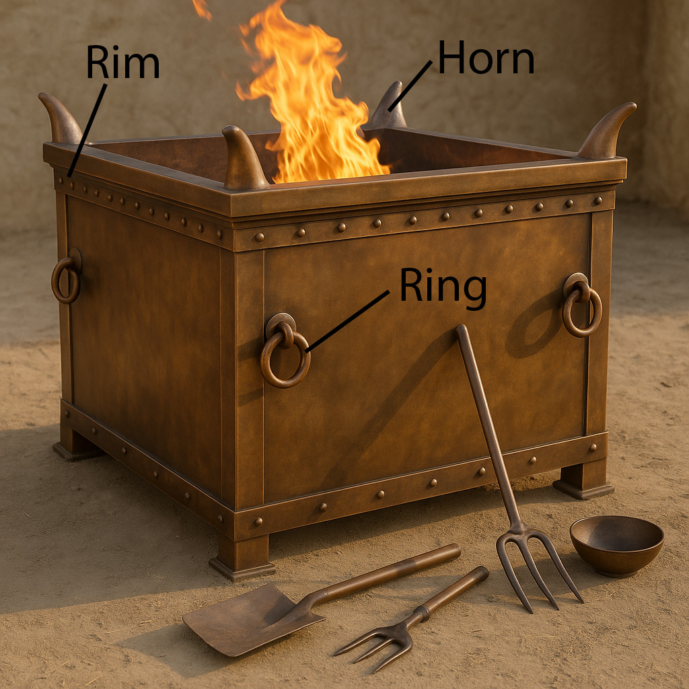

# Human-made Things in the Bible

## License Information

Human-made Things in the Bible © United Bible Societies, 2025. Adapted from: <cite>The Works of Their Hands: Man-made Things in the Bible</cite>, by Ray Pritz © 2009 United Bible Societies. This work is licensed under Creative Commons Attribution-ShareAlike 4.0 International (<a href="https://creativecommons.org/licenses/by-sa/4.0/">https://creativecommons.org/licenses/by-sa/4.0/</a>).

--------------------------------

## Temple altar (id: REALIA:4.2.3)

4\.2\.3 Temple altar
====================

References:
-----------

Aramaic מַדְבַּח (madbach)

[EZR 7:17](https://ref.ly/Ezra7:17)

Hebrew מִזְבֵּחַ (mizbeach)

[1KI 8:22](https://ref.ly/1Kgs8:22), [1KI 8:31](https://ref.ly/1Kgs8:31), [1KI 8:54](https://ref.ly/1Kgs8:54), [1KI 8:64](https://ref.ly/1Kgs8:64), [1KI 9:25](https://ref.ly/1Kgs9:25), [2KI 11:11](https://ref.ly/2Kgs11:11), [2KI 12:10](https://ref.ly/2Kgs12:10), [2KI 16:11](https://ref.ly/2Kgs16:11), [2KI 16:12](https://ref.ly/2Kgs16:12), [2KI 16:12](https://ref.ly/2Kgs16:12), [2KI 16:13](https://ref.ly/2Kgs16:13), [2KI 16:14](https://ref.ly/2Kgs16:14), [2KI 16:14](https://ref.ly/2Kgs16:14), [2KI 16:14](https://ref.ly/2Kgs16:14), [2KI 16:15](https://ref.ly/2Kgs16:15), [2KI 16:15](https://ref.ly/2Kgs16:15), [2KI 18:22](https://ref.ly/2Kgs18:22), [2KI 21:4](https://ref.ly/2Kgs21:4), [2KI 21:5](https://ref.ly/2Kgs21:5), [2KI 23:9](https://ref.ly/2Kgs23:9), [1CH 6:34](https://ref.ly/1Chr6:34), [1CH 16:40](https://ref.ly/1Chr16:40), [1CH 22:1](https://ref.ly/1Chr22:1), [2CH 4:1](https://ref.ly/2Chr4:1), [2CH 5:12](https://ref.ly/2Chr5:12), [2CH 6:12](https://ref.ly/2Chr6:12), [2CH 6:22](https://ref.ly/2Chr6:22), [2CH 7:7](https://ref.ly/2Chr7:7), [2CH 7:9](https://ref.ly/2Chr7:9), [2CH 8:12](https://ref.ly/2Chr8:12), [2CH 15:8](https://ref.ly/2Chr15:8), [2CH 23:10](https://ref.ly/2Chr23:10), [2CH 29:18](https://ref.ly/2Chr29:18), [2CH 29:19](https://ref.ly/2Chr29:19), [2CH 29:21](https://ref.ly/2Chr29:21), [2CH 29:22](https://ref.ly/2Chr29:22), [2CH 29:22](https://ref.ly/2Chr29:22), [2CH 29:22](https://ref.ly/2Chr29:22), [2CH 29:24](https://ref.ly/2Chr29:24), [2CH 29:27](https://ref.ly/2Chr29:27), [2CH 32:12](https://ref.ly/2Chr32:12), [2CH 33:4](https://ref.ly/2Chr33:4), [2CH 33:5](https://ref.ly/2Chr33:5), [2CH 33:16](https://ref.ly/2Chr33:16), [2CH 35:16](https://ref.ly/2Chr35:16), [EZR 3:2](https://ref.ly/Ezra3:2), [EZR 3:3](https://ref.ly/Ezra3:3), [NEH 10:35](https://ref.ly/Neh10:35), [PSA 26:6](https://ref.ly/Ps26:6), [PSA 43:4](https://ref.ly/Ps43:4), [PSA 51:21](https://ref.ly/Ps51:21), [PSA 84:4](https://ref.ly/Ps84:4), [PSA 118:27](https://ref.ly/Ps118:27), [ISA 6:6](https://ref.ly/Isa6:6), [ISA 36:7](https://ref.ly/Isa36:7), [ISA 56:7](https://ref.ly/Isa56:7), [ISA 60:7](https://ref.ly/Isa60:7), [LAM 2:7](https://ref.ly/Lam2:7), [EZK 8:5](https://ref.ly/Ezek8:5), [EZK 8:16](https://ref.ly/Ezek8:16), [EZK 9:2](https://ref.ly/Ezek9:2), [EZK 40:46](https://ref.ly/Ezek40:46), [EZK 40:47](https://ref.ly/Ezek40:47), [EZK 43:13](https://ref.ly/Ezek43:13), [EZK 43:13](https://ref.ly/Ezek43:13), [EZK 43:18](https://ref.ly/Ezek43:18), [EZK 43:22](https://ref.ly/Ezek43:22), [EZK 43:26](https://ref.ly/Ezek43:26), [EZK 43:27](https://ref.ly/Ezek43:27), [EZK 45:19](https://ref.ly/Ezek45:19), [EZK 47:1](https://ref.ly/Ezek47:1), [JOL 1:13](https://ref.ly/Joel1:13), [JOL 2:17](https://ref.ly/Joel2:17), [AMO 9:1](https://ref.ly/Amos9:1), [ZEC 9:15](https://ref.ly/Zech9:15), [ZEC 14:20](https://ref.ly/Zech14:20), [MAL 1:7](https://ref.ly/Mal1:7), [MAL 1:10](https://ref.ly/Mal1:10), [MAL 2:13](https://ref.ly/Mal2:13)

Hebrew שֻׁלְחָן (shulchan)

[MAL 1:7](https://ref.ly/Mal1:7), [MAL 1:12](https://ref.ly/Mal1:12)

Greek βωμός (bōmos)

[SIR 50:12](https://ref.ly/Sir50:12), [SIR 50:14](https://ref.ly/Sir50:14), [1MA 1:59](https://ref.ly/1Macc1:59), [2MA 2:19](https://ref.ly/2Macc2:19), [2MA 13:8](https://ref.ly/2Macc13:8)

Greek θυσιαστήριον (thusiastērion)

[MAT 5:23](https://ref.ly/Matt5:23), [MAT 5:24](https://ref.ly/Matt5:24), [MAT 23:20](https://ref.ly/Matt23:20), [MAT 23:35](https://ref.ly/Matt23:35), [LUK 11:51](https://ref.ly/Luke11:51), [1CO 9:13](https://ref.ly/1Cor9:13), [1CO 9:13](https://ref.ly/1Cor9:13), [1CO 10:18](https://ref.ly/1Cor10:18), [HEB 7:13](https://ref.ly/Heb7:13), [HEB 13:10](https://ref.ly/Heb13:10), [REV 11:1](https://ref.ly/Rev11:1)

Latin altare

[2ES 10:21](https://ref.ly/2Esd10:21)

Description and usage:
----------------------

*Different features of the altar for burnt offerings in the temple (Image generated by ChatGPT using OpenAI technology)*

Inside the Temple courtyard in Jerusalem there was a large, boxlike structure, made of bronze, which had a grate or grid in it. It stood outside the Holy Place. The priests kept a fire there all the time, for burning the animals that people brought to sacrifice to God. According to [2CH 4:1](https://ref.ly/2Chr4:1), this altar was made by Solomon and was 10 meters (33 feet) square and 5 meters (16\.5 feet) high. The priests actually stood on top of this large altar, working at one of several fires maintained there. Access to the altar was by a large ramp (larger than the one in the illustration below).

This altar may have been constructed in steps or platforms or terraces. Such an altar, with three levels, is mentioned and described in [EZK 43:13–EZK 43:17](https://ref.ly/Ezek43:13-Ezek43:17). The base would have had the dimensions given above, while the total height was 5 meters. The height of each level is not known.

---

Translation:
------------

See the discussion at [4\.2 Altars\<REALIA:4\.2\>](#) and [4\.2\.1 Stone altar\<REALIA:4\.2\.1\>](#) above.

* **Associated Passages:** Ezra 7:17; 1 Kings 8:22; 1 Kings 8:31; 1 Kings 8:54; 1 Kings 8:64; 1 Kings 9:25; 2 Kings 11:11; 2 Kings 12:10; 2 Kings 16:11; 2 Kings 16:12; 2 Kings 16:13; 2 Kings 16:14; 2 Kings 16:15; 2 Kings 18:22; 2 Kings 21:4; 2 Kings 21:5; 2 Kings 23:9; 1 Chronicles 6:34; 1 Chronicles 16:40; 1 Chronicles 22:1; 2 Chronicles 4:1; 2 Chronicles 5:12; 2 Chronicles 6:12; 2 Chronicles 6:22; 2 Chronicles 7:7; 2 Chronicles 7:9; 2 Chronicles 8:12; 2 Chronicles 15:8; 2 Chronicles 23:10; 2 Chronicles 29:18; 2 Chronicles 29:19; 2 Chronicles 29:21; 2 Chronicles 29:22; 2 Chronicles 29:24; 2 Chronicles 29:27; 2 Chronicles 32:12; 2 Chronicles 33:4; 2 Chronicles 33:5; 2 Chronicles 33:16; 2 Chronicles 35:16; Ezra 3:2; Ezra 3:3; Nehemiah 10:35; Psalms 26:6; Psalms 43:4; Psalms 51:21; Psalms 84:4; Psalms 118:27; Isaiah 6:6; Isaiah 36:7; Isaiah 56:7; Isaiah 60:7; Lamentations 2:7; Ezekiel 8:5; Ezekiel 8:16; Ezekiel 9:2; Ezekiel 40:46; Ezekiel 40:47; Ezekiel 43:13; Ezekiel 43:18; Ezekiel 43:22; Ezekiel 43:26; Ezekiel 43:27; Ezekiel 45:19; Ezekiel 47:1; Joel 1:13; Joel 2:17; Amos 9:1; Zechariah 9:15; Zechariah 14:20; Malachi 1:7; Malachi 1:10; Malachi 2:13; Malachi 1:12; Sirach 50:12; Sirach 50:14; 1 Maccabees 1:59; 2 Maccabees 2:19; 2 Maccabees 13:8; Matthew 5:23; Matthew 5:24; Matthew 23:20; Matthew 23:35; Luke 11:51; 1 Corinthians 9:13; 1 Corinthians 10:18; Hebrews 7:13; Hebrews 13:10; Revelation 11:1; 2 Esdras (Latin) 10:21; Ezekiel 43:17

