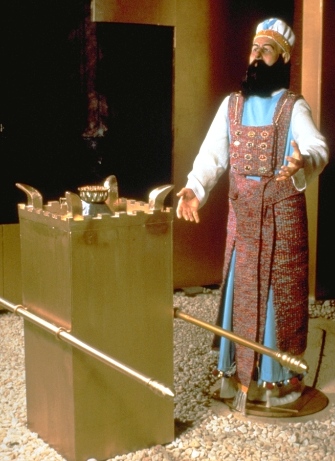

# Human-made Things in the Bible

## License Information

Human-made Things in the Bible © United Bible Societies, 2025. Adapted from: <cite>The Works of Their Hands: Man-made Things in the Bible</cite>, by Ray Pritz © 2009 United Bible Societies. This work is licensed under Creative Commons Attribution-ShareAlike 4.0 International (<a href="https://creativecommons.org/licenses/by-sa/4.0/">https://creativecommons.org/licenses/by-sa/4.0/</a>).

--------------------------------

## Incense altar (id: REALIA:4.2.4)

4\.2\.4 Incense altar
=====================

References:
-----------

Hebrew מִזְבֵּחַ, מִקְטָר, קְטֹרֶת (mizbeach (miqtar qetoreth))

[EXO 30:1](https://ref.ly/Exod30:1), [EXO 30:27](https://ref.ly/Exod30:27), [EXO 31:8](https://ref.ly/Exod31:8), [EXO 35:15](https://ref.ly/Exod35:15), [EXO 37:25](https://ref.ly/Exod37:25), [EXO 39:38](https://ref.ly/Exod39:38), [EXO 40:5](https://ref.ly/Exod40:5), [EXO 40:26](https://ref.ly/Exod40:26), [LEV 4:7](https://ref.ly/Lev4:7), [NUM 4:11](https://ref.ly/Num4:11), [1KI 6:20](https://ref.ly/1Kgs6:20), [1KI 6:22](https://ref.ly/1Kgs6:22), [1KI 7:48](https://ref.ly/1Kgs7:48), [1CH 6:34](https://ref.ly/1Chr6:34), [1CH 28:18](https://ref.ly/1Chr28:18), [2CH 4:19](https://ref.ly/2Chr4:19), [2CH 26:16](https://ref.ly/2Chr26:16), [2CH 26:19](https://ref.ly/2Chr26:19), [EZK 41:22](https://ref.ly/Ezek41:22)

Hebrew מְקַטֶּרֶת (meqatereth)

[2CH 30:14](https://ref.ly/2Chr30:14)

Hebrew לְבֵנָה (lvenah)

[ISA 65:3](https://ref.ly/Isa65:3)

Hebrew שֻׁלְחָן (shulchan)

[EZK 41:22](https://ref.ly/Ezek41:22), [EZK 44:16](https://ref.ly/Ezek44:16)

Greek θυμιατήριον (thumiatērion)

[HEB 9:4](https://ref.ly/Heb9:4)

Greek θυσιαστήριον, θυμίαμα (thusiastērion (tou thumiamatos), thumiama)

[LUK 1:11](https://ref.ly/Luke1:11), [REV 6:9](https://ref.ly/Rev6:9), [REV 8:3](https://ref.ly/Rev8:3), [REV 8:3](https://ref.ly/Rev8:3), [REV 8:3](https://ref.ly/Rev8:3), [REV 8:5](https://ref.ly/Rev8:5), [REV 9:13](https://ref.ly/Rev9:13), [REV 14:18](https://ref.ly/Rev14:18), [REV 16:7](https://ref.ly/Rev16:7), [1MA 1:21](https://ref.ly/1Macc1:21), [1MA 4:49](https://ref.ly/1Macc4:49), [1MA 4:50](https://ref.ly/1Macc4:50), [2MA 2:5](https://ref.ly/2Macc2:5)

Description and usage:
----------------------

*Incense altar (© Ori229, CC BY\-SA 3\.0, via Wikimedia Commons)*

The incense altar was a boxlike table, made of wood. It was completely covered over with beaten gold. This was a relatively small altar, about one meter (40 inches) high and 50 centimeters (20 inches) square. According to [EXO 30:10](https://ref.ly/Exod30:10), this altar also had “horns” (see [4\.2\.1\.1 Horns of the altar\<REALIA:4\.2\.1\.1\>](#)). It stood inside the Holy Place in the Tabernacle and in the Temple in Jerusalem, and a priest burned incense (see [4\.4\.7\.1 Incense, frankincense\<REALIA:4\.4\.7\.1\>](#)) on it daily and prayed.

---

Translation:
------------

*High priest at the incense altar in the temple (© Ray Pritz by United Bible Societies)*

“Incense altar” may be rendered in some languages as “place where incense is burned in worship of God.” Translators must avoid a rendering that would imply that the altar was made of incense. Alternative models are “table/place/brazier/hearth where people burned incense to God” or “… where people burned oil that smelled sweet to God.”

If there is any comparable kind of table or charcoal stove used for ceremonial purposes in the receptor\-language culture, this may be an appropriate word to use.

The relationship between the incense altar and the censers of the priests (see [4\.4\.7 Censer\<REALIA:4\.4\.7\>](#)) may seem confusing. The comments of Noordtzij (page 144\) may be helpful: “The use of censers for the burning of incense here \[[NUM 16:6](https://ref.ly/Num16:6), [NUM 16:17](https://ref.ly/Num16:17) ] has led some to conclude that this author did not know of the golden altar of incense of [EXO 30:1–EXO 30:10](https://ref.ly/Exod30:1-Exod30:10); [EXO 37:25–EXO 37:29](https://ref.ly/Exod37:25-Exod37:29), but this is based on a misunderstanding. The altar was used for the daily burning of incense in order to close off, as it were, the most holy place from the Holy Place by means of a cloud of incense, so that the proximity of the Lord who dwelled above the ark would not be dangerous to the priests. But the censer was used when the priest (in Israel this was only the high priest!) approached the ark itself ([LEV 16:12](https://ref.ly/Lev16:12); [LEV 16:13](https://ref.ly/Lev16:13)).” However, see also the comments below at [4\.4\.5 Small shovel, firepan\<REALIA:4\.4\.5\>](#).

The incense altar of the Tabernacle was carried by poles inserted through rings attached to its sides ([EXO 30:4](https://ref.ly/Exod30:4); [EXO 30:5](https://ref.ly/Exod30:5); [EXO 37:27](https://ref.ly/Exod37:27); [EXO 37:28](https://ref.ly/Exod37:28)). See the discussion at [4\.1 Covenant Box, Ark of the Covenant\<REALIA:4\.1\>](#) above. Unlike the poles used to carry the Covenant Box, the poles for other objects, such as the incense altar, were removed after the piece of furniture was set in its appointed place.

[ISA 65:3](https://ref.ly/Isa65:3): The exact meaning of the literal clause “they burn incense on bricks” is not clear. What is clear is that the prophet is speaking against some pagan practice adopted by the people of Israel. Translators may wish to follow NIV (New International Version (1984)), NCV (New Century Version), and SPCL (Spanish Common Language Version (Dios Habla Hoy)) by rendering “bricks” as “altars of brick” (similarly REB (Revised English Bible (1989))). GNT (Good News Translation (1992)) is even more explicit with “pagan altars.” The main point of the prophecy is that the incense was being burned in a forbidden way, in a location other than the incense altar in the Temple.

[REV 6:9](https://ref.ly/Rev6:9); [REV 8:3](https://ref.ly/Rev8:3); [REV 8:5](https://ref.ly/Rev8:5); [REV 9:13](https://ref.ly/Rev9:13); [REV 11:1](https://ref.ly/Rev11:1); [REV 14:18](https://ref.ly/Rev14:18); [REV 16:7](https://ref.ly/Rev16:7): There are eight references to an altar in Revelation, but commentators are divided as to whether John is speaking of the same altar each time and which altar he intends in any given verse. A comment by Mounce (page 157\) on [REV 6:9](https://ref.ly/Rev6:9) is attractive: “It is probably unimportant to conjecture whether the altar is the altar of burnt offering or the altar of incense. The theme of sacrifice would suggest the former, and the prayers which rise (vs. 10\) seem to indicate the latter. There is no reason why in John’s vision the two should not blend together as one.” The distinction will be important, however, if a translator has no general word for altar that can retain the ambiguity of Revelation and include both types of altar. Where a translator must choose between a word meaning “altar for burning animal sacrifices” and a word meaning “incense altar,” there are two basic options: 1\) choose one of the two words and use it consistently throughout the book, or 2\) choose the word according to the context.

In the book of Revelation an altar is first mentioned at [REV 6:9](https://ref.ly/Rev6:9); however, it is referred to as if both it and its location are already well known, or the author assumes that the readers are aware that they are in a Temple\-like setting. This kind of reference should be retained, even though readers of the translation may not yet be acquainted with it. The word chosen should make it clear that this altar is dedicated to God.

* **Associated Passages:** Exodus 30:1; Exodus 30:27; Exodus 31:8; Exodus 35:15; Exodus 37:25; Exodus 39:38; Exodus 40:5; Exodus 40:26; Leviticus 4:7; Numbers 4:11; 1 Kings 6:20; 1 Kings 6:22; 1 Kings 7:48; 1 Chronicles 6:34; 1 Chronicles 28:18; 2 Chronicles 4:19; 2 Chronicles 26:16; 2 Chronicles 26:19; Ezekiel 41:22; 2 Chronicles 30:14; Isaiah 65:3; Ezekiel 44:16; Hebrews 9:4; Luke 1:11; Revelation 6:9; Revelation 8:3; Revelation 8:5; Revelation 9:13; Revelation 14:18; Revelation 16:7; 1 Maccabees 1:21; 1 Maccabees 4:49; 1 Maccabees 4:50; 2 Maccabees 2:5; Exodus 30:10; Numbers 16:6; Numbers 16:17; Exodus 37:29; Leviticus 16:12; Leviticus 16:13; Exodus 30:4; Exodus 30:5; Exodus 37:27; Exodus 37:28; Revelation 11:1

