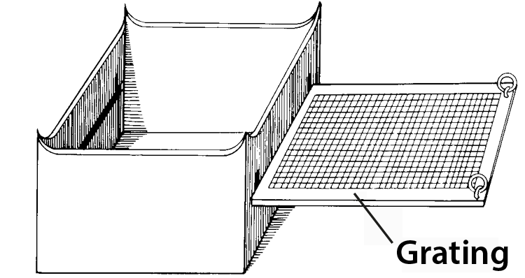

# Human-made Things in the Bible

## License Information

Human-made Things in the Bible © United Bible Societies, 2025. Adapted from: <cite>The Works of Their Hands: Man-made Things in the Bible</cite>, by Ray Pritz © 2009 United Bible Societies. This work is licensed under Creative Commons Attribution-ShareAlike 4.0 International (<a href="https://creativecommons.org/licenses/by-sa/4.0/">https://creativecommons.org/licenses/by-sa/4.0/</a>).

--------------------------------

## Altars (id: REALIA:4.2)

4\.2 Altars
===========

*(Image generated by ChatGPT using OpenAI technology)*

An altar was a kind of table or platform where sacrifices of animals or other offerings were made to God. Several different kinds of altars are mentioned in the Bible:

1\. Israelite altars that were used for making sacrifices

(a) Stone altars built in the open air, such as those mentioned in Genesis and elsewhere in the Old Testament

(b) The altars for making sacrifices in the Tabernacle and in the Jerusalem Temple

2\. Israelite altars that were used for purposes other than making sacrifices

(a) The altar for burning incense in the Tabernacle/Temple, including the altar mentioned in Revelation, where prayers were offered and incense was burnt

3\. Pagan altars

In the entries that follow, different altars are described. However, in many verses it is uncertain exactly which altar is intended. This is especially true of events in the Tabernacle complex or the Temple, where either the altar for sacrifices or the incense altar may be intended. Many languages have a generic term for an altar or a ceremonial platform that can serve many purposes. Where there is no term for a place of sacrificial offerings, translators may need to use a descriptive phrase or borrow a term. See [4\.2\.1 Stone altar\<REALIA:4\.2\.1\>](#) for further discussion.

## Stone altar (id: REALIA:4.2.1)

4\.2\.1 Stone altar
===================

References:
-----------

Hebrew מִזְבֵּחַ (mizbeach)

[GEN 8:20](https://ref.ly/Gen8:20), [GEN 8:20](https://ref.ly/Gen8:20), [GEN 12:7](https://ref.ly/Gen12:7), [GEN 12:8](https://ref.ly/Gen12:8), [GEN 13:4](https://ref.ly/Gen13:4), [GEN 13:18](https://ref.ly/Gen13:18), [GEN 22:9](https://ref.ly/Gen22:9), [GEN 22:9](https://ref.ly/Gen22:9), [GEN 26:25](https://ref.ly/Gen26:25), [GEN 33:20](https://ref.ly/Gen33:20), [GEN 35:1](https://ref.ly/Gen35:1), [GEN 35:3](https://ref.ly/Gen35:3), [GEN 35:7](https://ref.ly/Gen35:7), [EXO 17:15](https://ref.ly/Exod17:15), [EXO 20:24](https://ref.ly/Exod20:24), [EXO 20:25](https://ref.ly/Exod20:25), [EXO 20:26](https://ref.ly/Exod20:26), [EXO 21:14](https://ref.ly/Exod21:14), [EXO 24:4](https://ref.ly/Exod24:4), [EXO 24:6](https://ref.ly/Exod24:6), [EXO 32:5](https://ref.ly/Exod32:5), [EXO 34:13](https://ref.ly/Exod34:13), [NUM 23:1](https://ref.ly/Num23:1), [NUM 23:2](https://ref.ly/Num23:2), [NUM 23:4](https://ref.ly/Num23:4), [NUM 23:4](https://ref.ly/Num23:4), [NUM 23:14](https://ref.ly/Num23:14), [NUM 23:14](https://ref.ly/Num23:14), [NUM 23:29](https://ref.ly/Num23:29), [NUM 23:30](https://ref.ly/Num23:30), [DEU 7:5](https://ref.ly/Deut7:5), [DEU 12:3](https://ref.ly/Deut12:3), [DEU 27:5](https://ref.ly/Deut27:5), [DEU 27:5](https://ref.ly/Deut27:5), [DEU 27:6](https://ref.ly/Deut27:6), [DEU 33:10](https://ref.ly/Deut33:10), [JOS 8:30](https://ref.ly/Josh8:30), [JOS 8:31](https://ref.ly/Josh8:31), [JOS 9:27](https://ref.ly/Josh9:27), [JOS 22:10](https://ref.ly/Josh22:10), [JOS 22:10](https://ref.ly/Josh22:10), [JOS 22:11](https://ref.ly/Josh22:11), [JOS 22:16](https://ref.ly/Josh22:16), [JOS 22:19](https://ref.ly/Josh22:19), [JOS 22:19](https://ref.ly/Josh22:19), [JOS 22:23](https://ref.ly/Josh22:23), [JOS 22:26](https://ref.ly/Josh22:26), [JOS 22:28](https://ref.ly/Josh22:28), [JOS 22:29](https://ref.ly/Josh22:29), [JOS 22:34](https://ref.ly/Josh22:34), [JDG 2:2](https://ref.ly/Judg2:2), [JDG 6:24](https://ref.ly/Judg6:24), [JDG 6:25](https://ref.ly/Judg6:25), [JDG 6:26](https://ref.ly/Judg6:26), [JDG 6:28](https://ref.ly/Judg6:28), [JDG 6:28](https://ref.ly/Judg6:28), [JDG 6:30](https://ref.ly/Judg6:30), [JDG 6:31](https://ref.ly/Judg6:31), [JDG 6:32](https://ref.ly/Judg6:32), [JDG 13:20](https://ref.ly/Judg13:20), [JDG 13:20](https://ref.ly/Judg13:20), [JDG 21:4](https://ref.ly/Judg21:4), [1SA 7:17](https://ref.ly/1Sam7:17), [1SA 14:35](https://ref.ly/1Sam14:35), [1SA 14:35](https://ref.ly/1Sam14:35), [2SA 24:18](https://ref.ly/2Sam24:18), [2SA 24:21](https://ref.ly/2Sam24:21), [2SA 24:25](https://ref.ly/2Sam24:25), [1KI 3:4](https://ref.ly/1Kgs3:4), [1KI 12:32](https://ref.ly/1Kgs12:32), [1KI 12:33](https://ref.ly/1Kgs12:33), [1KI 12:33](https://ref.ly/1Kgs12:33), [1KI 13:1](https://ref.ly/1Kgs13:1), [1KI 13:2](https://ref.ly/1Kgs13:2), [1KI 13:2](https://ref.ly/1Kgs13:2), [1KI 13:2](https://ref.ly/1Kgs13:2), [1KI 13:3](https://ref.ly/1Kgs13:3), [1KI 13:4](https://ref.ly/1Kgs13:4), [1KI 13:4](https://ref.ly/1Kgs13:4), [1KI 13:5](https://ref.ly/1Kgs13:5), [1KI 13:5](https://ref.ly/1Kgs13:5), [1KI 13:32](https://ref.ly/1Kgs13:32), [1KI 16:32](https://ref.ly/1Kgs16:32), [1KI 18:26](https://ref.ly/1Kgs18:26), [1KI 18:30](https://ref.ly/1Kgs18:30), [1KI 18:32](https://ref.ly/1Kgs18:32), [1KI 18:32](https://ref.ly/1Kgs18:32), [1KI 18:35](https://ref.ly/1Kgs18:35), [1KI 19:10](https://ref.ly/1Kgs19:10), [1KI 19:14](https://ref.ly/1Kgs19:14), [2KI 11:18](https://ref.ly/2Kgs11:18), [2KI 11:18](https://ref.ly/2Kgs11:18), [2KI 11:18](https://ref.ly/2Kgs11:18), [2KI 16:10](https://ref.ly/2Kgs16:10), [2KI 16:10](https://ref.ly/2Kgs16:10), [2KI 18:22](https://ref.ly/2Kgs18:22), [2KI 21:3](https://ref.ly/2Kgs21:3), [2KI 23:12](https://ref.ly/2Kgs23:12), [2KI 23:12](https://ref.ly/2Kgs23:12), [2KI 23:15](https://ref.ly/2Kgs23:15), [2KI 23:15](https://ref.ly/2Kgs23:15), [2KI 23:16](https://ref.ly/2Kgs23:16), [2KI 23:17](https://ref.ly/2Kgs23:17), [2KI 23:20](https://ref.ly/2Kgs23:20), [1CH 21:18](https://ref.ly/1Chr21:18), [1CH 21:22](https://ref.ly/1Chr21:22), [1CH 21:26](https://ref.ly/1Chr21:26), [1CH 21:26](https://ref.ly/1Chr21:26), [2CH 14:2](https://ref.ly/2Chr14:2), [2CH 23:17](https://ref.ly/2Chr23:17), [2CH 23:17](https://ref.ly/2Chr23:17), [2CH 28:24](https://ref.ly/2Chr28:24), [2CH 30:14](https://ref.ly/2Chr30:14), [2CH 31:1](https://ref.ly/2Chr31:1), [2CH 32:12](https://ref.ly/2Chr32:12), [2CH 33:3](https://ref.ly/2Chr33:3), [2CH 33:15](https://ref.ly/2Chr33:15), [2CH 34:4](https://ref.ly/2Chr34:4), [2CH 34:5](https://ref.ly/2Chr34:5), [2CH 34:5](https://ref.ly/2Chr34:5), [2CH 34:7](https://ref.ly/2Chr34:7), [ISA 17:8](https://ref.ly/Isa17:8), [ISA 19:19](https://ref.ly/Isa19:19), [ISA 27:9](https://ref.ly/Isa27:9), [ISA 36:7](https://ref.ly/Isa36:7), [JER 11:13](https://ref.ly/Jer11:13), [JER 11:13](https://ref.ly/Jer11:13), [JER 17:1](https://ref.ly/Jer17:1), [JER 17:2](https://ref.ly/Jer17:2), [EZK 6:4](https://ref.ly/Ezek6:4), [EZK 6:5](https://ref.ly/Ezek6:5), [EZK 6:6](https://ref.ly/Ezek6:6), [EZK 6:13](https://ref.ly/Ezek6:13), [HOS 8:11](https://ref.ly/Hos8:11), [HOS 8:11](https://ref.ly/Hos8:11), [HOS 10:1](https://ref.ly/Hos10:1), [HOS 10:2](https://ref.ly/Hos10:2), [HOS 10:8](https://ref.ly/Hos10:8), [HOS 12:12](https://ref.ly/Hos12:12), [AMO 2:8](https://ref.ly/Amos2:8), [AMO 3:14](https://ref.ly/Amos3:14), [AMO 3:14](https://ref.ly/Amos3:14)

Greek βωμός (bomōs)

[ACT 17:23](https://ref.ly/Acts17:23), [1MA 1:47](https://ref.ly/1Macc1:47), [1MA 1:54](https://ref.ly/1Macc1:54), [1MA 2:23](https://ref.ly/1Macc2:23), [1MA 2:24](https://ref.ly/1Macc2:24), [1MA 2:25](https://ref.ly/1Macc2:25), [1MA 2:45](https://ref.ly/1Macc2:45), [1MA 5:68](https://ref.ly/1Macc5:68), [2MA 10:2](https://ref.ly/2Macc10:2)

Greek θυσιαστήριον (thusiastērion)

[ROM 11:3](https://ref.ly/Rom11:3), [JAS 2:21](https://ref.ly/Jas2:21)

Description and usage:
----------------------

*Flat altar made of uncut stones (© Ray Pritz by United Bible Societies)*

In Old Testament times, especially before the Tabernacle or the Temple was made, stone altars were built in the open air for the purpose of making sacrifices. The altars were made from large stones, piled together to form a platform. The sacrifices were of sheep or goats, or of offerings of grain. The stones used to make Israelite altars were not to be cut or shaped with iron tools ([EXO 20:25](https://ref.ly/Exod20:25); [DEU 27:5](https://ref.ly/Deut27:5)).

---

Translation:
------------

*Circular Canaanite altar found at Megiddo (© Ray Pritz by United Bible Societies)*

Some languages may distinguish between natural stone and blocks that are the result of cutting and shaping. Where the stones of the altar are mentioned, translators should choose a word for natural stones.

If sacrificing animals is something that is done in the receptor\-language culture, then consider whether there is some cultural equivalent for an altar. A number of modern cultures have elevated structures for sacrificing animals or for offering gifts to a deity. Sometimes this will be a stone or wood platform or table. Be sure that the translation makes it clear that the sacrifice is being offered to God.

A descriptive equivalent of “altar” occurs in some languages as “place where gifts are given to God.” Several other models are “place/plat­form/hearth where people offer sacrifices,” “bed/platform for \[killing and] offering sacrifices,” and “\[hearth] stones for/of sacrificing things.” In some contexts it may be necessary to add a phrase such as “where sacrifices are burned to God” or “where incense is burned to honor God.” Other possible translations include “thing on which \[sacred] offerings are placed” and “place of sacrifice.” In most passages the actual form of the altar is not in focus; the important fact is that it was a place where sacrifices were made.

Warning: In some South American languages a transliterated form of “altar” (or its Spanish or Portuguese equivalent) may occur. This word is often “borrowed” with a restricted meaning, sometimes referring to the shrine of a particular saint, or to the front section of a church, or to a patriotic shrine. When a borrowed word of this kind occurs, always check carefully what meaning it has for speakers of the receptor language in order to know whether or not it is suitable.

Similarly, translators may be tempted to use a transliteration of the word “altar” because that is what is used locally in the Roman Catholic, Anglican, or other church. As in the case of the term “priest,” it is recommended that this Christian term not be used as the basis for Old Testament translation, because it has a very different theological significance. See also [4\.7 Cult place, high place\<REALIA:4\.7\>](#).

* **Associated Passages:** Genesis 8:20; Genesis 12:7; Genesis 12:8; Genesis 13:4; Genesis 13:18; Genesis 22:9; Genesis 26:25; Genesis 33:20; Genesis 35:1; Genesis 35:3; Genesis 35:7; Exodus 17:15; Exodus 20:24; Exodus 20:25; Exodus 20:26; Exodus 21:14; Exodus 24:4; Exodus 24:6; Exodus 32:5; Exodus 34:13; Numbers 23:1; Numbers 23:2; Numbers 23:4; Numbers 23:14; Numbers 23:29; Numbers 23:30; Deuteronomy 7:5; Deuteronomy 12:3; Deuteronomy 27:5; Deuteronomy 27:6; Deuteronomy 33:10; Joshua 8:30; Joshua 8:31; Joshua 9:27; Joshua 22:10; Joshua 22:11; Joshua 22:16; Joshua 22:19; Joshua 22:23; Joshua 22:26; Joshua 22:28; Joshua 22:29; Joshua 22:34; Judges 2:2; Judges 6:24; Judges 6:25; Judges 6:26; Judges 6:28; Judges 6:30; Judges 6:31; Judges 6:32; Judges 13:20; Judges 21:4; 1 Samuel 7:17; 1 Samuel 14:35; 2 Samuel 24:18; 2 Samuel 24:21; 2 Samuel 24:25; 1 Kings 3:4; 1 Kings 12:32; 1 Kings 12:33; 1 Kings 13:1; 1 Kings 13:2; 1 Kings 13:3; 1 Kings 13:4; 1 Kings 13:5; 1 Kings 13:32; 1 Kings 16:32; 1 Kings 18:26; 1 Kings 18:30; 1 Kings 18:32; 1 Kings 18:35; 1 Kings 19:10; 1 Kings 19:14; 2 Kings 11:18; 2 Kings 16:10; 2 Kings 18:22; 2 Kings 21:3; 2 Kings 23:12; 2 Kings 23:15; 2 Kings 23:16; 2 Kings 23:17; 2 Kings 23:20; 1 Chronicles 21:18; 1 Chronicles 21:22; 1 Chronicles 21:26; 2 Chronicles 14:2; 2 Chronicles 23:17; 2 Chronicles 28:24; 2 Chronicles 30:14; 2 Chronicles 31:1; 2 Chronicles 32:12; 2 Chronicles 33:3; 2 Chronicles 33:15; 2 Chronicles 34:4; 2 Chronicles 34:5; 2 Chronicles 34:7; Isaiah 17:8; Isaiah 19:19; Isaiah 27:9; Isaiah 36:7; Jeremiah 11:13; Jeremiah 17:1; Jeremiah 17:2; Ezekiel 6:4; Ezekiel 6:5; Ezekiel 6:6; Ezekiel 6:13; Hosea 8:11; Hosea 10:1; Hosea 10:2; Hosea 10:8; Hosea 12:12; Amos 2:8; Amos 3:14; Acts 17:23; 1 Maccabees 1:47; 1 Maccabees 1:54; 1 Maccabees 2:23; 1 Maccabees 2:24; 1 Maccabees 2:25; 1 Maccabees 2:45; 1 Maccabees 5:68; 2 Maccabees 10:2; Romans 11:3; James 2:21

* **Associated ACAI Concepts:** Stone Altar (ID: `realia:StoneAltar`); Temple Altar (ID: `realia:TempleAltar`); Altar (ID: `realia:Altar`); Tabernacle Altar (ID: `realia:TabernacleAltar`)

## Horns of the altar (id: REALIA:4.2.1.1)

4\.2\.1\.1 Horns of the altar
=============================

References:
-----------

Hebrew קֶרֶן (qarnoth (plural form of qeren))

[EXO 27:2](https://ref.ly/Exod27:2), [EXO 27:2](https://ref.ly/Exod27:2), [EXO 29:12](https://ref.ly/Exod29:12), [EXO 30:2](https://ref.ly/Exod30:2), [EXO 30:3](https://ref.ly/Exod30:3), [EXO 30:10](https://ref.ly/Exod30:10), [EXO 37:25](https://ref.ly/Exod37:25), [EXO 37:26](https://ref.ly/Exod37:26), [EXO 38:2](https://ref.ly/Exod38:2), [EXO 38:2](https://ref.ly/Exod38:2), [LEV 4:7](https://ref.ly/Lev4:7), [LEV 4:18](https://ref.ly/Lev4:18), [LEV 4:25](https://ref.ly/Lev4:25), [LEV 4:30](https://ref.ly/Lev4:30), [LEV 4:34](https://ref.ly/Lev4:34), [LEV 8:15](https://ref.ly/Lev8:15), [LEV 9:9](https://ref.ly/Lev9:9), [LEV 16:18](https://ref.ly/Lev16:18), [1KI 1:50](https://ref.ly/1Kgs1:50), [1KI 1:51](https://ref.ly/1Kgs1:51), [1KI 2:28](https://ref.ly/1Kgs2:28), [PSA 118:27](https://ref.ly/Ps118:27), [JER 17:1](https://ref.ly/Jer17:1), [EZK 43:15](https://ref.ly/Ezek43:15), [EZK 43:20](https://ref.ly/Ezek43:20), [AMO 3:14](https://ref.ly/Amos3:14)

Greek κέρας (keras)

[JDT 9:8](https://ref.ly/Jdt9:8)

Description and usage:
----------------------

*(Image generated by ChatGPT using OpenAI technology)*

Altar horns were projections from the four upper corners of an altar, shaped like the horn of a sacrificial animal. Some scholars maintain that the horns were intended to represent the animals sacrificed, but others feel that they originally functioned as points on which cooking utensils rested. In Israelite law the horns of the altar were also a place of refuge where a person who had accidentally killed someone could be safe from an avenging relative of the one who had been killed.

---

Translation:
------------

*Horned incense altar (limestone, Megiddo, 8th c. BCE) (Gary Todd, Israel Museum, CC0, via Wikimedia Commons)*

Even though the Hebrew word *qeren* and the Greek word *keras* are the same terms used to refer to the horns of animals (cattle or oxen, for example), it is not necessary to retain this image in translation. In some languages this may be the natural thing to do, but in others it will probably be better to use a word like “projections” (GNT (Good News Translation (1992))), “knobs” (Mft (Moffatt Translation (1926))), or “protruding corners.” Some may find it useful to expand the rendering for “horns”; for example, in [EXO 27:2](https://ref.ly/Exod27:2)CEV (Contemporary English Version) says “and make each of the four top corners stick up like the horn of a bull.”

It would be possible to translate the literal phrase “the horns of the altar” as “the projections in the form of horns on the corners of the place of sacrifice \[or, of the thing on which offerings are placed],” but there is no need for something so long and involved; the emphasis is not usually on the shape. For this reason in [AMO 3:14](https://ref.ly/Amos3:14)GNT (Good News Translation (1992)) has “The corners of every altar,” which makes clear the location instead of the shape. This will be a good solution in many languages.

[PSA 118:27](https://ref.ly/Ps118:27): The last two lines of this verse contain directions about the festival procession in the Temple, but there is some uncertainty concerning the exact meaning of the Hebrew, which seems to say “Bind up the festival with branches to \[or, as far as] the horns of the altar.” HOTTP (Hebrew Old Testament Text Project (UBS)) says the Hebrew text can be taken in two different ways: “bind the feast victim(s) with ropes as far as the horns of the altar” or “line up the feast \[pilgrims] with ropes at the horns of the altar,” meaning that the worshipers were enclosed within ropes to set them off as a holy people. HOTTP (Hebrew Old Testament Text Project (UBS)) follows NJPSV (New Jewish Publication Society Version) in translating “ropes” instead of “branches” \[or, boughs].” NJPSV (New Jewish Publication Society Version) translates “bind the festal offering to the horns of the altar with cords.” NJB (New Jerusalem Bible (1985)) has “Link your processions, branches in hand, up to the horns of the altar,” and explains the following in a footnote: “Ritual of the *lulab*, branch of myrtle or palm, waved as the procession circled the altar.” These interpretations, however, seem rather doubtful, and the GNT (Good News Translation (1992)) translation is recommended as a reasonable representation of the meaning of the text: “With branches in your hands, start the festival and march around the altar.” SPCL (Spanish Common Language Version (Dios Habla Hoy)) has “Begin the festival, and take boughs up to the horns of the altar.” AT (American Translation (Goodspeed, 1935)) says “Arrange the festal dance with branches, up to the horns of the altar.”

* **Associated Passages:** Exodus 27:2; Exodus 29:12; Exodus 30:2; Exodus 30:3; Exodus 30:10; Exodus 37:25; Exodus 37:26; Exodus 38:2; Leviticus 4:7; Leviticus 4:18; Leviticus 4:25; Leviticus 4:30; Leviticus 4:34; Leviticus 8:15; Leviticus 9:9; Leviticus 16:18; 1 Kings 1:50; 1 Kings 1:51; 1 Kings 2:28; Psalms 118:27; Jeremiah 17:1; Ezekiel 43:15; Ezekiel 43:20; Amos 3:14; Judith 9:8

* **Associated ACAI Concepts:** Horns of Altar (ID: `realia:HornsOfAltar`)

## Tabernacle altar (id: REALIA:4.2.2)

4\.2\.2 Tabernacle altar
========================

References:
-----------

Hebrew מִזְבֵּחַ (mizbeach)

[EXO 27:1](https://ref.ly/Exod27:1), [EXO 27:1](https://ref.ly/Exod27:1), [EXO 27:5](https://ref.ly/Exod27:5), [EXO 27:5](https://ref.ly/Exod27:5), [EXO 27:6](https://ref.ly/Exod27:6), [EXO 27:7](https://ref.ly/Exod27:7), [EXO 28:43](https://ref.ly/Exod28:43), [EXO 29:12](https://ref.ly/Exod29:12), [EXO 29:12](https://ref.ly/Exod29:12), [EXO 29:13](https://ref.ly/Exod29:13), [EXO 29:16](https://ref.ly/Exod29:16), [EXO 29:18](https://ref.ly/Exod29:18), [EXO 29:20](https://ref.ly/Exod29:20), [EXO 29:21](https://ref.ly/Exod29:21), [EXO 29:25](https://ref.ly/Exod29:25), [EXO 29:36](https://ref.ly/Exod29:36), [EXO 29:37](https://ref.ly/Exod29:37), [EXO 29:37](https://ref.ly/Exod29:37), [EXO 29:37](https://ref.ly/Exod29:37), [EXO 29:38](https://ref.ly/Exod29:38), [EXO 29:44](https://ref.ly/Exod29:44), [EXO 30:18](https://ref.ly/Exod30:18), [EXO 30:20](https://ref.ly/Exod30:20), [EXO 30:28](https://ref.ly/Exod30:28), [EXO 31:9](https://ref.ly/Exod31:9), [EXO 35:16](https://ref.ly/Exod35:16), [EXO 38:1](https://ref.ly/Exod38:1), [EXO 38:3](https://ref.ly/Exod38:3), [EXO 38:4](https://ref.ly/Exod38:4), [EXO 38:7](https://ref.ly/Exod38:7), [EXO 38:30](https://ref.ly/Exod38:30), [EXO 38:30](https://ref.ly/Exod38:30), [EXO 39:39](https://ref.ly/Exod39:39), [EXO 40:6](https://ref.ly/Exod40:6), [EXO 40:7](https://ref.ly/Exod40:7), [EXO 40:10](https://ref.ly/Exod40:10), [EXO 40:10](https://ref.ly/Exod40:10), [EXO 40:10](https://ref.ly/Exod40:10), [EXO 40:29](https://ref.ly/Exod40:29), [EXO 40:30](https://ref.ly/Exod40:30), [EXO 40:32](https://ref.ly/Exod40:32), [EXO 40:33](https://ref.ly/Exod40:33), [LEV 1:5](https://ref.ly/Lev1:5), [LEV 1:7](https://ref.ly/Lev1:7), [LEV 1:8](https://ref.ly/Lev1:8), [LEV 1:9](https://ref.ly/Lev1:9), [LEV 1:11](https://ref.ly/Lev1:11), [LEV 1:11](https://ref.ly/Lev1:11), [LEV 1:12](https://ref.ly/Lev1:12), [LEV 1:13](https://ref.ly/Lev1:13), [LEV 1:15](https://ref.ly/Lev1:15), [LEV 1:15](https://ref.ly/Lev1:15), [LEV 1:15](https://ref.ly/Lev1:15), [LEV 1:16](https://ref.ly/Lev1:16), [LEV 1:17](https://ref.ly/Lev1:17), [LEV 2:2](https://ref.ly/Lev2:2), [LEV 2:8](https://ref.ly/Lev2:8), [LEV 2:9](https://ref.ly/Lev2:9), [LEV 2:12](https://ref.ly/Lev2:12), [LEV 3:2](https://ref.ly/Lev3:2), [LEV 3:5](https://ref.ly/Lev3:5), [LEV 3:8](https://ref.ly/Lev3:8), [LEV 3:11](https://ref.ly/Lev3:11), [LEV 3:13](https://ref.ly/Lev3:13), [LEV 3:16](https://ref.ly/Lev3:16), [LEV 4:7](https://ref.ly/Lev4:7), [LEV 4:10](https://ref.ly/Lev4:10), [LEV 4:18](https://ref.ly/Lev4:18), [LEV 4:18](https://ref.ly/Lev4:18), [LEV 4:19](https://ref.ly/Lev4:19), [LEV 4:25](https://ref.ly/Lev4:25), [LEV 4:25](https://ref.ly/Lev4:25), [LEV 4:26](https://ref.ly/Lev4:26), [LEV 4:30](https://ref.ly/Lev4:30), [LEV 4:30](https://ref.ly/Lev4:30), [LEV 4:31](https://ref.ly/Lev4:31), [LEV 4:34](https://ref.ly/Lev4:34), [LEV 4:34](https://ref.ly/Lev4:34), [LEV 4:35](https://ref.ly/Lev4:35), [LEV 5:9](https://ref.ly/Lev5:9), [LEV 5:9](https://ref.ly/Lev5:9), [LEV 5:12](https://ref.ly/Lev5:12), [LEV 6:2](https://ref.ly/Lev6:2), [LEV 6:2](https://ref.ly/Lev6:2), [LEV 6:3](https://ref.ly/Lev6:3), [LEV 6:3](https://ref.ly/Lev6:3), [LEV 6:5](https://ref.ly/Lev6:5), [LEV 6:6](https://ref.ly/Lev6:6), [LEV 6:7](https://ref.ly/Lev6:7), [LEV 6:8](https://ref.ly/Lev6:8), [LEV 7:2](https://ref.ly/Lev7:2), [LEV 7:5](https://ref.ly/Lev7:5), [LEV 7:31](https://ref.ly/Lev7:31), [LEV 8:11](https://ref.ly/Lev8:11), [LEV 8:11](https://ref.ly/Lev8:11), [LEV 8:15](https://ref.ly/Lev8:15), [LEV 8:15](https://ref.ly/Lev8:15), [LEV 8:15](https://ref.ly/Lev8:15), [LEV 8:16](https://ref.ly/Lev8:16), [LEV 8:19](https://ref.ly/Lev8:19), [LEV 8:21](https://ref.ly/Lev8:21), [LEV 8:24](https://ref.ly/Lev8:24), [LEV 8:28](https://ref.ly/Lev8:28), [LEV 8:30](https://ref.ly/Lev8:30), [LEV 9:7](https://ref.ly/Lev9:7), [LEV 9:8](https://ref.ly/Lev9:8), [LEV 9:9](https://ref.ly/Lev9:9), [LEV 9:9](https://ref.ly/Lev9:9), [LEV 9:10](https://ref.ly/Lev9:10), [LEV 9:12](https://ref.ly/Lev9:12), [LEV 9:13](https://ref.ly/Lev9:13), [LEV 9:14](https://ref.ly/Lev9:14), [LEV 9:17](https://ref.ly/Lev9:17), [LEV 9:18](https://ref.ly/Lev9:18), [LEV 9:20](https://ref.ly/Lev9:20), [LEV 9:24](https://ref.ly/Lev9:24), [LEV 10:12](https://ref.ly/Lev10:12), [LEV 14:20](https://ref.ly/Lev14:20), [LEV 16:12](https://ref.ly/Lev16:12), [LEV 16:18](https://ref.ly/Lev16:18), [LEV 16:18](https://ref.ly/Lev16:18), [LEV 16:20](https://ref.ly/Lev16:20), [LEV 16:25](https://ref.ly/Lev16:25), [LEV 16:33](https://ref.ly/Lev16:33), [LEV 17:6](https://ref.ly/Lev17:6), [LEV 17:11](https://ref.ly/Lev17:11), [LEV 21:23](https://ref.ly/Lev21:23), [LEV 22:22](https://ref.ly/Lev22:22), [NUM 3:26](https://ref.ly/Num3:26), [NUM 3:31](https://ref.ly/Num3:31), [NUM 4:13](https://ref.ly/Num4:13), [NUM 4:14](https://ref.ly/Num4:14), [NUM 4:26](https://ref.ly/Num4:26), [NUM 5:25](https://ref.ly/Num5:25), [NUM 5:26](https://ref.ly/Num5:26), [NUM 7:1](https://ref.ly/Num7:1), [NUM 7:10](https://ref.ly/Num7:10), [NUM 7:10](https://ref.ly/Num7:10), [NUM 7:11](https://ref.ly/Num7:11), [NUM 7:84](https://ref.ly/Num7:84), [NUM 7:88](https://ref.ly/Num7:88), [NUM 17:3](https://ref.ly/Num17:3), [NUM 17:4](https://ref.ly/Num17:4), [NUM 17:11](https://ref.ly/Num17:11), [NUM 18:3](https://ref.ly/Num18:3), [NUM 18:5](https://ref.ly/Num18:5), [NUM 18:7](https://ref.ly/Num18:7), [NUM 18:17](https://ref.ly/Num18:17), [DEU 12:27](https://ref.ly/Deut12:27), [DEU 12:27](https://ref.ly/Deut12:27), [DEU 16:21](https://ref.ly/Deut16:21), [DEU 26:4](https://ref.ly/Deut26:4), [JOS 22:29](https://ref.ly/Josh22:29), [1SA 2:28](https://ref.ly/1Sam2:28), [1SA 2:33](https://ref.ly/1Sam2:33), [1KI 1:50](https://ref.ly/1Kgs1:50), [1KI 1:51](https://ref.ly/1Kgs1:51), [1KI 1:53](https://ref.ly/1Kgs1:53), [1KI 2:28](https://ref.ly/1Kgs2:28), [1KI 2:29](https://ref.ly/1Kgs2:29), [1CH 21:29](https://ref.ly/1Chr21:29), [2CH 1:5](https://ref.ly/2Chr1:5), [2CH 1:6](https://ref.ly/2Chr1:6)

References:
-----------

### **Rim, ledge**:

Hebrew כַּרְכֹּב (karkov)

[EXO 27:5](https://ref.ly/Exod27:5), [EXO 38:4](https://ref.ly/Exod38:4)

Description:
------------

*The altar of the movable tabernacle (Timnah Park model) (© Ori229, CC BY\-SA 3\.0, via Wikimedia Commons)*

The Tabernacle altar was made of acacia wood overlaid, perhaps inside and out, with bronze. It measured five cubits (2\.5 meters; 8\.3 feet) on a side and stood three cubits (1\.5 meters; 5 feet) high. Around its top was a kind of ledge or rim (*karkov* in Hebrew), the purpose of which is not given. The altar was hollow.

---

Translation:
------------

See [4\.2 Altars\<REALIA:4\.2\>](#) and [4\.2\.1 Stone altar\<REALIA:4\.2\.1\>](#) above.

**Rim, ledge**: The Hebrew word *karkov* is found only in [EXO 27:5](https://ref.ly/Exod27:5) and [EXO 38:4](https://ref.ly/Exod38:4), and its meaning is unclear. Some scholars think of it as a decorative “rim” (GNT (Good News Translation (1992))) around the altar that could also support the weight of the altar when lifted by the rings on the grating ([EXO 27:4](https://ref.ly/Exod27:4); see [4\.2\.3 Temple altar\<REALIA:4\.2\.3\>](#) for an illustration of a rim). Others imagine that it may have been a “ledge” (RSV (Revised Standard Version (1952))) wide enough for the officiating priests to stand on, but this is unlikely since the altar itself was only about 1\.5 meters (5 feet) high.

It is not clear whether this rim was at the top, the middle, or the bottom of the altar. Neither is it clear whether it was on the inside or the outside of the altar. NAB (New American Bible (1970)) translates *karkov* simply as “around,” since its root meaning may have been to surround or encircle. [EXO 27:5](https://ref.ly/Exod27:5) a in NAB (New American Bible (1970)) reads “Put it \[the grating] down around the altar, on the ground.”

Note that the Hebrew clause in [EXO 27:5](https://ref.ly/Exod27:5) uses both the words “under” and “below,” possibly for emphasis or clarity. NJPSV (New Jewish Publication Society Version) has “Set the mesh below, under the ledge of the altar,” and NJB (New Jerusalem Bible (1985)) says “You will put it below the ledge of the altar, underneath.” Since there is so much uncertainty about the meaning of these terms, translators must choose either the idea of a “ledge” or a “rim.” We may assume that it was a structural rim located probably around the top of the altar.

* **Associated Passages:** Exodus 27:1; Exodus 27:5; Exodus 27:6; Exodus 27:7; Exodus 28:43; Exodus 29:12; Exodus 29:13; Exodus 29:16; Exodus 29:18; Exodus 29:20; Exodus 29:21; Exodus 29:25; Exodus 29:36; Exodus 29:37; Exodus 29:38; Exodus 29:44; Exodus 30:18; Exodus 30:20; Exodus 30:28; Exodus 31:9; Exodus 35:16; Exodus 38:1; Exodus 38:3; Exodus 38:4; Exodus 38:7; Exodus 38:30; Exodus 39:39; Exodus 40:6; Exodus 40:7; Exodus 40:10; Exodus 40:29; Exodus 40:30; Exodus 40:32; Exodus 40:33; Leviticus 1:5; Leviticus 1:7; Leviticus 1:8; Leviticus 1:9; Leviticus 1:11; Leviticus 1:12; Leviticus 1:13; Leviticus 1:15; Leviticus 1:16; Leviticus 1:17; Leviticus 2:2; Leviticus 2:8; Leviticus 2:9; Leviticus 2:12; Leviticus 3:2; Leviticus 3:5; Leviticus 3:8; Leviticus 3:11; Leviticus 3:13; Leviticus 3:16; Leviticus 4:7; Leviticus 4:10; Leviticus 4:18; Leviticus 4:19; Leviticus 4:25; Leviticus 4:26; Leviticus 4:30; Leviticus 4:31; Leviticus 4:34; Leviticus 4:35; Leviticus 5:9; Leviticus 5:12; Leviticus 6:2; Leviticus 6:3; Leviticus 6:5; Leviticus 6:6; Leviticus 6:7; Leviticus 6:8; Leviticus 7:2; Leviticus 7:5; Leviticus 7:31; Leviticus 8:11; Leviticus 8:15; Leviticus 8:16; Leviticus 8:19; Leviticus 8:21; Leviticus 8:24; Leviticus 8:28; Leviticus 8:30; Leviticus 9:7; Leviticus 9:8; Leviticus 9:9; Leviticus 9:10; Leviticus 9:12; Leviticus 9:13; Leviticus 9:14; Leviticus 9:17; Leviticus 9:18; Leviticus 9:20; Leviticus 9:24; Leviticus 10:12; Leviticus 14:20; Leviticus 16:12; Leviticus 16:18; Leviticus 16:20; Leviticus 16:25; Leviticus 16:33; Leviticus 17:6; Leviticus 17:11; Leviticus 21:23; Leviticus 22:22; Numbers 3:26; Numbers 3:31; Numbers 4:13; Numbers 4:14; Numbers 4:26; Numbers 5:25; Numbers 5:26; Numbers 7:1; Numbers 7:10; Numbers 7:11; Numbers 7:84; Numbers 7:88; Numbers 17:3; Numbers 17:4; Numbers 17:11; Numbers 18:3; Numbers 18:5; Numbers 18:7; Numbers 18:17; Deuteronomy 12:27; Deuteronomy 16:21; Deuteronomy 26:4; Joshua 22:29; 1 Samuel 2:28; 1 Samuel 2:33; 1 Kings 1:50; 1 Kings 1:51; 1 Kings 1:53; 1 Kings 2:28; 1 Kings 2:29; 1 Chronicles 21:29; 2 Chronicles 1:5; 2 Chronicles 1:6; Exodus 27:4

* **Associated ACAI Concepts:** Tabernacle Altar (ID: `realia:TabernacleAltar`); Temple Altar (ID: `realia:TempleAltar`); Stone Altar (ID: `realia:StoneAltar`); Altar (ID: `realia:Altar`)

## Grating, mesh (id: REALIA:4.2.2.1)

4\.2\.2\.1 Grating, mesh
========================

References:
-----------

Hebrew מִכְבָּר (mikbar)

[EXO 27:4](https://ref.ly/Exod27:4), [EXO 35:16](https://ref.ly/Exod35:16), [EXO 38:5](https://ref.ly/Exod38:5), [EXO 38:5](https://ref.ly/Exod38:5), [EXO 38:30](https://ref.ly/Exod38:30), [EXO 39:39](https://ref.ly/Exod39:39)

References:
-----------

### **Ring**:

Hebrew טַבַּעַת (taba‘ath)

[EXO 27:4](https://ref.ly/Exod27:4), [EXO 27:7](https://ref.ly/Exod27:7), [EXO 38:5](https://ref.ly/Exod38:5), [EXO 38:7](https://ref.ly/Exod38:7)

References:
-----------

### **Pole**:

Hebrew בַּד (bad)

[EXO 27:6](https://ref.ly/Exod27:6), [EXO 27:6](https://ref.ly/Exod27:6), [EXO 27:7](https://ref.ly/Exod27:7), [EXO 27:7](https://ref.ly/Exod27:7), [EXO 38:5](https://ref.ly/Exod38:5), [EXO 38:6](https://ref.ly/Exod38:6), [EXO 38:7](https://ref.ly/Exod38:7)

Description and usage:
----------------------

*Drawing of grating attached to the altar (Don Ellens, The Tabernacle of Israel, Harris, Jones 1888, Public domain)*

The grating of the Tabernacle altar was similar to a spider’s web with a fine meshwork, except that it was made of bronze. Its purpose is not explained, but it was probably intended to hold the burning coals and allow the ashes and grease to fall through to the ground, as well as to allow for a draft of air to pass through from underneath. Both were necessary for a hot fire. On the four upper corners of the grating were attached bronze rings. Poles were inserted through these rings for transporting the altar.

---

Translation:
------------

*Grating inside the altar (BYU model) (© Ben P L, CC BY 2\.0, via Wikimedia Commons)*

The Hebrew word for grating (*mikbar*) is related to the word for “sieve” in [AMO 9:9](https://ref.ly/Amos9:9). The Hebrew phrase that describes it in [EXO 27:4](https://ref.ly/Exod27:4) is *ma‘aseh resheth*, which is literally “net\-work.” The exact position and function of this mesh are disputed. Some scholars have suggested that it was simply wrapped around the bottom half of the altar as a decoration, perhaps also serving to strengthen the wooden frame of the altar; for example, CEV (Contemporary English Version) renders [EXO 27:4](https://ref.ly/Exod27:4) a as “cover the bottom half of the altar with a decorative bronze grating.” Most, however, understand it as it is described above. Its placement on or in the altar was related in some way to the rim or ledge, which went around the top of the altar (see [4\.2\.2 Tabernacle altar\<REALIA:4\.2\.2\>](#)).

“So that the net shall extend halfway down the altar” ([EXO 27:5](https://ref.ly/Exod27:5) b in RSV (Revised Standard Version (1952))) is literally “and the net will be until half of the altar.” This does not indicate whether it means halfway down or “halfway up the altar” (GNT (Good News Translation (1992))). Most translations have “halfway up,” suggesting that the grating was placed in some way at the lower half of the altar. But RSV (Revised Standard Version (1952)) and NRSV (New Revised Standard Version (1989)) suggest that this grating was near the top. It is probably better for translators to follow this interpretation.

As can be seen from an overview of various translations, it is possible to translate [EXO 38:4](https://ref.ly/Exod38:4); [EXO 38:5](https://ref.ly/Exod38:5) and the parallel passage in [EXO 27:4](https://ref.ly/Exod27:4); [EXO 27:7](https://ref.ly/Exod27:7) without actually leaving the reader with a clear picture of how the grating, rim, and altar were related. While it is true that the functions of the rim and the grating are disputed, a clear description of one feasible option is to be preferred to a rendering that is meaningless to the reader. The following model is given in *A Handbook on Exodus* (page 635\):

4 Make a bronze grating, like a strainer, and attach a bronze ring at each of its four corners. 5 Then place the grating under the rim that goes around the altar, so that it extends halfway down inside the altar.

Another possible model is:

5 Build a rim around the altar near the top, and hang a bronze grating from it extending halfway down inside the altar. At each of the four corners of the grating attach a bronze ring.

**Rings and poles**: [EXO 27:4](https://ref.ly/Exod27:4) says that bronze rings were to be put on the “ends” or “edges” of the grating. Verse 7 describes the placing of the poles into “the rings, so that the poles shall be upon the two sides of the altar” (RSV (Revised Standard Version (1952))). The Hebrew seems to indicate that there is only one set of rings, those attached to the grating, and that they were used to carry the entire altar. The placement of the rings will depend on the translator’s understanding of the grating as discussed above. If the “grating” is understood as a mesh going around the outside of the altar, then the rings are simply attached to the mesh. If, on the other hand, the “grating” is understood to be horizontal and sitting inside the altar, the rings projected through the corners of the altar so that the poles could be put through them.

The poles were placed into the rings for carrying the altar, and they were probably removed after it had been set into place. Where a language distinguishes between installing an object permanently or temporarily, the latter option is the correct one here. This may mean using a different verb in [EXO 27:7](https://ref.ly/Exod27:7) from the one used in [EXO 25:14](https://ref.ly/Exod25:14) (see the discussion under [4\.1 Covenant Box, Ark of the Covenant\<REALIA:4\.1\>](#)).

* **Associated Passages:** Exodus 27:4; Exodus 35:16; Exodus 38:5; Exodus 38:30; Exodus 39:39; Exodus 27:7; Exodus 38:7; Exodus 27:6; Exodus 38:6; Amos 9:9; Exodus 27:5; Exodus 38:4; Exodus 25:14

* **Associated ACAI Concepts:** Grating (ID: `realia:Grating`)

## Temple altar (id: REALIA:4.2.3)

4\.2\.3 Temple altar
====================

References:
-----------

Aramaic מַדְבַּח (madbach)

[EZR 7:17](https://ref.ly/Ezra7:17)

Hebrew מִזְבֵּחַ (mizbeach)

[1KI 8:22](https://ref.ly/1Kgs8:22), [1KI 8:31](https://ref.ly/1Kgs8:31), [1KI 8:54](https://ref.ly/1Kgs8:54), [1KI 8:64](https://ref.ly/1Kgs8:64), [1KI 9:25](https://ref.ly/1Kgs9:25), [2KI 11:11](https://ref.ly/2Kgs11:11), [2KI 12:10](https://ref.ly/2Kgs12:10), [2KI 16:11](https://ref.ly/2Kgs16:11), [2KI 16:12](https://ref.ly/2Kgs16:12), [2KI 16:12](https://ref.ly/2Kgs16:12), [2KI 16:13](https://ref.ly/2Kgs16:13), [2KI 16:14](https://ref.ly/2Kgs16:14), [2KI 16:14](https://ref.ly/2Kgs16:14), [2KI 16:14](https://ref.ly/2Kgs16:14), [2KI 16:15](https://ref.ly/2Kgs16:15), [2KI 16:15](https://ref.ly/2Kgs16:15), [2KI 18:22](https://ref.ly/2Kgs18:22), [2KI 21:4](https://ref.ly/2Kgs21:4), [2KI 21:5](https://ref.ly/2Kgs21:5), [2KI 23:9](https://ref.ly/2Kgs23:9), [1CH 6:34](https://ref.ly/1Chr6:34), [1CH 16:40](https://ref.ly/1Chr16:40), [1CH 22:1](https://ref.ly/1Chr22:1), [2CH 4:1](https://ref.ly/2Chr4:1), [2CH 5:12](https://ref.ly/2Chr5:12), [2CH 6:12](https://ref.ly/2Chr6:12), [2CH 6:22](https://ref.ly/2Chr6:22), [2CH 7:7](https://ref.ly/2Chr7:7), [2CH 7:9](https://ref.ly/2Chr7:9), [2CH 8:12](https://ref.ly/2Chr8:12), [2CH 15:8](https://ref.ly/2Chr15:8), [2CH 23:10](https://ref.ly/2Chr23:10), [2CH 29:18](https://ref.ly/2Chr29:18), [2CH 29:19](https://ref.ly/2Chr29:19), [2CH 29:21](https://ref.ly/2Chr29:21), [2CH 29:22](https://ref.ly/2Chr29:22), [2CH 29:22](https://ref.ly/2Chr29:22), [2CH 29:22](https://ref.ly/2Chr29:22), [2CH 29:24](https://ref.ly/2Chr29:24), [2CH 29:27](https://ref.ly/2Chr29:27), [2CH 32:12](https://ref.ly/2Chr32:12), [2CH 33:4](https://ref.ly/2Chr33:4), [2CH 33:5](https://ref.ly/2Chr33:5), [2CH 33:16](https://ref.ly/2Chr33:16), [2CH 35:16](https://ref.ly/2Chr35:16), [EZR 3:2](https://ref.ly/Ezra3:2), [EZR 3:3](https://ref.ly/Ezra3:3), [NEH 10:35](https://ref.ly/Neh10:35), [PSA 26:6](https://ref.ly/Ps26:6), [PSA 43:4](https://ref.ly/Ps43:4), [PSA 51:21](https://ref.ly/Ps51:21), [PSA 84:4](https://ref.ly/Ps84:4), [PSA 118:27](https://ref.ly/Ps118:27), [ISA 6:6](https://ref.ly/Isa6:6), [ISA 36:7](https://ref.ly/Isa36:7), [ISA 56:7](https://ref.ly/Isa56:7), [ISA 60:7](https://ref.ly/Isa60:7), [LAM 2:7](https://ref.ly/Lam2:7), [EZK 8:5](https://ref.ly/Ezek8:5), [EZK 8:16](https://ref.ly/Ezek8:16), [EZK 9:2](https://ref.ly/Ezek9:2), [EZK 40:46](https://ref.ly/Ezek40:46), [EZK 40:47](https://ref.ly/Ezek40:47), [EZK 43:13](https://ref.ly/Ezek43:13), [EZK 43:13](https://ref.ly/Ezek43:13), [EZK 43:18](https://ref.ly/Ezek43:18), [EZK 43:22](https://ref.ly/Ezek43:22), [EZK 43:26](https://ref.ly/Ezek43:26), [EZK 43:27](https://ref.ly/Ezek43:27), [EZK 45:19](https://ref.ly/Ezek45:19), [EZK 47:1](https://ref.ly/Ezek47:1), [JOL 1:13](https://ref.ly/Joel1:13), [JOL 2:17](https://ref.ly/Joel2:17), [AMO 9:1](https://ref.ly/Amos9:1), [ZEC 9:15](https://ref.ly/Zech9:15), [ZEC 14:20](https://ref.ly/Zech14:20), [MAL 1:7](https://ref.ly/Mal1:7), [MAL 1:10](https://ref.ly/Mal1:10), [MAL 2:13](https://ref.ly/Mal2:13)

Hebrew שֻׁלְחָן (shulchan)

[MAL 1:7](https://ref.ly/Mal1:7), [MAL 1:12](https://ref.ly/Mal1:12)

Greek βωμός (bōmos)

[SIR 50:12](https://ref.ly/Sir50:12), [SIR 50:14](https://ref.ly/Sir50:14), [1MA 1:59](https://ref.ly/1Macc1:59), [2MA 2:19](https://ref.ly/2Macc2:19), [2MA 13:8](https://ref.ly/2Macc13:8)

Greek θυσιαστήριον (thusiastērion)

[MAT 5:23](https://ref.ly/Matt5:23), [MAT 5:24](https://ref.ly/Matt5:24), [MAT 23:20](https://ref.ly/Matt23:20), [MAT 23:35](https://ref.ly/Matt23:35), [LUK 11:51](https://ref.ly/Luke11:51), [1CO 9:13](https://ref.ly/1Cor9:13), [1CO 9:13](https://ref.ly/1Cor9:13), [1CO 10:18](https://ref.ly/1Cor10:18), [HEB 7:13](https://ref.ly/Heb7:13), [HEB 13:10](https://ref.ly/Heb13:10), [REV 11:1](https://ref.ly/Rev11:1)

Latin altare

[2ES 10:21](https://ref.ly/2Esd10:21)

Description and usage:
----------------------

*Different features of the altar for burnt offerings in the temple (Image generated by ChatGPT using OpenAI technology)*

Inside the Temple courtyard in Jerusalem there was a large, boxlike structure, made of bronze, which had a grate or grid in it. It stood outside the Holy Place. The priests kept a fire there all the time, for burning the animals that people brought to sacrifice to God. According to [2CH 4:1](https://ref.ly/2Chr4:1), this altar was made by Solomon and was 10 meters (33 feet) square and 5 meters (16\.5 feet) high. The priests actually stood on top of this large altar, working at one of several fires maintained there. Access to the altar was by a large ramp (larger than the one in the illustration below).

This altar may have been constructed in steps or platforms or terraces. Such an altar, with three levels, is mentioned and described in [EZK 43:13–EZK 43:17](https://ref.ly/Ezek43:13-Ezek43:17). The base would have had the dimensions given above, while the total height was 5 meters. The height of each level is not known.

---

Translation:
------------

See the discussion at [4\.2 Altars\<REALIA:4\.2\>](#) and [4\.2\.1 Stone altar\<REALIA:4\.2\.1\>](#) above.

* **Associated Passages:** Ezra 7:17; 1 Kings 8:22; 1 Kings 8:31; 1 Kings 8:54; 1 Kings 8:64; 1 Kings 9:25; 2 Kings 11:11; 2 Kings 12:10; 2 Kings 16:11; 2 Kings 16:12; 2 Kings 16:13; 2 Kings 16:14; 2 Kings 16:15; 2 Kings 18:22; 2 Kings 21:4; 2 Kings 21:5; 2 Kings 23:9; 1 Chronicles 6:34; 1 Chronicles 16:40; 1 Chronicles 22:1; 2 Chronicles 4:1; 2 Chronicles 5:12; 2 Chronicles 6:12; 2 Chronicles 6:22; 2 Chronicles 7:7; 2 Chronicles 7:9; 2 Chronicles 8:12; 2 Chronicles 15:8; 2 Chronicles 23:10; 2 Chronicles 29:18; 2 Chronicles 29:19; 2 Chronicles 29:21; 2 Chronicles 29:22; 2 Chronicles 29:24; 2 Chronicles 29:27; 2 Chronicles 32:12; 2 Chronicles 33:4; 2 Chronicles 33:5; 2 Chronicles 33:16; 2 Chronicles 35:16; Ezra 3:2; Ezra 3:3; Nehemiah 10:35; Psalms 26:6; Psalms 43:4; Psalms 51:21; Psalms 84:4; Psalms 118:27; Isaiah 6:6; Isaiah 36:7; Isaiah 56:7; Isaiah 60:7; Lamentations 2:7; Ezekiel 8:5; Ezekiel 8:16; Ezekiel 9:2; Ezekiel 40:46; Ezekiel 40:47; Ezekiel 43:13; Ezekiel 43:18; Ezekiel 43:22; Ezekiel 43:26; Ezekiel 43:27; Ezekiel 45:19; Ezekiel 47:1; Joel 1:13; Joel 2:17; Amos 9:1; Zechariah 9:15; Zechariah 14:20; Malachi 1:7; Malachi 1:10; Malachi 2:13; Malachi 1:12; Sirach 50:12; Sirach 50:14; 1 Maccabees 1:59; 2 Maccabees 2:19; 2 Maccabees 13:8; Matthew 5:23; Matthew 5:24; Matthew 23:20; Matthew 23:35; Luke 11:51; 1 Corinthians 9:13; 1 Corinthians 10:18; Hebrews 7:13; Hebrews 13:10; Revelation 11:1; 2 Esdras (Latin) 10:21; Ezekiel 43:17

* **Associated ACAI Concepts:** Temple Altar (ID: `realia:TempleAltar`); Tabernacle Altar (ID: `realia:TabernacleAltar`); Stone Altar (ID: `realia:StoneAltar`); Altar (ID: `realia:Altar`)

## Incense altar (id: REALIA:4.2.4)

4\.2\.4 Incense altar
=====================

References:
-----------

Hebrew מִזְבֵּחַ, מִקְטָר, קְטֹרֶת (mizbeach (miqtar qetoreth))

[EXO 30:1](https://ref.ly/Exod30:1), [EXO 30:27](https://ref.ly/Exod30:27), [EXO 31:8](https://ref.ly/Exod31:8), [EXO 35:15](https://ref.ly/Exod35:15), [EXO 37:25](https://ref.ly/Exod37:25), [EXO 39:38](https://ref.ly/Exod39:38), [EXO 40:5](https://ref.ly/Exod40:5), [EXO 40:26](https://ref.ly/Exod40:26), [LEV 4:7](https://ref.ly/Lev4:7), [NUM 4:11](https://ref.ly/Num4:11), [1KI 6:20](https://ref.ly/1Kgs6:20), [1KI 6:22](https://ref.ly/1Kgs6:22), [1KI 7:48](https://ref.ly/1Kgs7:48), [1CH 6:34](https://ref.ly/1Chr6:34), [1CH 28:18](https://ref.ly/1Chr28:18), [2CH 4:19](https://ref.ly/2Chr4:19), [2CH 26:16](https://ref.ly/2Chr26:16), [2CH 26:19](https://ref.ly/2Chr26:19), [EZK 41:22](https://ref.ly/Ezek41:22)

Hebrew מְקַטֶּרֶת (meqatereth)

[2CH 30:14](https://ref.ly/2Chr30:14)

Hebrew לְבֵנָה (lvenah)

[ISA 65:3](https://ref.ly/Isa65:3)

Hebrew שֻׁלְחָן (shulchan)

[EZK 41:22](https://ref.ly/Ezek41:22), [EZK 44:16](https://ref.ly/Ezek44:16)

Greek θυμιατήριον (thumiatērion)

[HEB 9:4](https://ref.ly/Heb9:4)

Greek θυσιαστήριον, θυμίαμα (thusiastērion (tou thumiamatos), thumiama)

[LUK 1:11](https://ref.ly/Luke1:11), [REV 6:9](https://ref.ly/Rev6:9), [REV 8:3](https://ref.ly/Rev8:3), [REV 8:3](https://ref.ly/Rev8:3), [REV 8:3](https://ref.ly/Rev8:3), [REV 8:5](https://ref.ly/Rev8:5), [REV 9:13](https://ref.ly/Rev9:13), [REV 14:18](https://ref.ly/Rev14:18), [REV 16:7](https://ref.ly/Rev16:7), [1MA 1:21](https://ref.ly/1Macc1:21), [1MA 4:49](https://ref.ly/1Macc4:49), [1MA 4:50](https://ref.ly/1Macc4:50), [2MA 2:5](https://ref.ly/2Macc2:5)

Description and usage:
----------------------

*Incense altar (© Ori229, CC BY\-SA 3\.0, via Wikimedia Commons)*

The incense altar was a boxlike table, made of wood. It was completely covered over with beaten gold. This was a relatively small altar, about one meter (40 inches) high and 50 centimeters (20 inches) square. According to [EXO 30:10](https://ref.ly/Exod30:10), this altar also had “horns” (see [4\.2\.1\.1 Horns of the altar\<REALIA:4\.2\.1\.1\>](#)). It stood inside the Holy Place in the Tabernacle and in the Temple in Jerusalem, and a priest burned incense (see [4\.4\.7\.1 Incense, frankincense\<REALIA:4\.4\.7\.1\>](#)) on it daily and prayed.

---

Translation:
------------

*High priest at the incense altar in the temple (© Ray Pritz by United Bible Societies)*

“Incense altar” may be rendered in some languages as “place where incense is burned in worship of God.” Translators must avoid a rendering that would imply that the altar was made of incense. Alternative models are “table/place/brazier/hearth where people burned incense to God” or “… where people burned oil that smelled sweet to God.”

If there is any comparable kind of table or charcoal stove used for ceremonial purposes in the receptor\-language culture, this may be an appropriate word to use.

The relationship between the incense altar and the censers of the priests (see [4\.4\.7 Censer\<REALIA:4\.4\.7\>](#)) may seem confusing. The comments of Noordtzij (page 144\) may be helpful: “The use of censers for the burning of incense here \[[NUM 16:6](https://ref.ly/Num16:6), [NUM 16:17](https://ref.ly/Num16:17) ] has led some to conclude that this author did not know of the golden altar of incense of [EXO 30:1–EXO 30:10](https://ref.ly/Exod30:1-Exod30:10); [EXO 37:25–EXO 37:29](https://ref.ly/Exod37:25-Exod37:29), but this is based on a misunderstanding. The altar was used for the daily burning of incense in order to close off, as it were, the most holy place from the Holy Place by means of a cloud of incense, so that the proximity of the Lord who dwelled above the ark would not be dangerous to the priests. But the censer was used when the priest (in Israel this was only the high priest!) approached the ark itself ([LEV 16:12](https://ref.ly/Lev16:12); [LEV 16:13](https://ref.ly/Lev16:13)).” However, see also the comments below at [4\.4\.5 Small shovel, firepan\<REALIA:4\.4\.5\>](#).

The incense altar of the Tabernacle was carried by poles inserted through rings attached to its sides ([EXO 30:4](https://ref.ly/Exod30:4); [EXO 30:5](https://ref.ly/Exod30:5); [EXO 37:27](https://ref.ly/Exod37:27); [EXO 37:28](https://ref.ly/Exod37:28)). See the discussion at [4\.1 Covenant Box, Ark of the Covenant\<REALIA:4\.1\>](#) above. Unlike the poles used to carry the Covenant Box, the poles for other objects, such as the incense altar, were removed after the piece of furniture was set in its appointed place.

[ISA 65:3](https://ref.ly/Isa65:3): The exact meaning of the literal clause “they burn incense on bricks” is not clear. What is clear is that the prophet is speaking against some pagan practice adopted by the people of Israel. Translators may wish to follow NIV (New International Version (1984)), NCV (New Century Version), and SPCL (Spanish Common Language Version (Dios Habla Hoy)) by rendering “bricks” as “altars of brick” (similarly REB (Revised English Bible (1989))). GNT (Good News Translation (1992)) is even more explicit with “pagan altars.” The main point of the prophecy is that the incense was being burned in a forbidden way, in a location other than the incense altar in the Temple.

[REV 6:9](https://ref.ly/Rev6:9); [REV 8:3](https://ref.ly/Rev8:3); [REV 8:5](https://ref.ly/Rev8:5); [REV 9:13](https://ref.ly/Rev9:13); [REV 11:1](https://ref.ly/Rev11:1); [REV 14:18](https://ref.ly/Rev14:18); [REV 16:7](https://ref.ly/Rev16:7): There are eight references to an altar in Revelation, but commentators are divided as to whether John is speaking of the same altar each time and which altar he intends in any given verse. A comment by Mounce (page 157\) on [REV 6:9](https://ref.ly/Rev6:9) is attractive: “It is probably unimportant to conjecture whether the altar is the altar of burnt offering or the altar of incense. The theme of sacrifice would suggest the former, and the prayers which rise (vs. 10\) seem to indicate the latter. There is no reason why in John’s vision the two should not blend together as one.” The distinction will be important, however, if a translator has no general word for altar that can retain the ambiguity of Revelation and include both types of altar. Where a translator must choose between a word meaning “altar for burning animal sacrifices” and a word meaning “incense altar,” there are two basic options: 1\) choose one of the two words and use it consistently throughout the book, or 2\) choose the word according to the context.

In the book of Revelation an altar is first mentioned at [REV 6:9](https://ref.ly/Rev6:9); however, it is referred to as if both it and its location are already well known, or the author assumes that the readers are aware that they are in a Temple\-like setting. This kind of reference should be retained, even though readers of the translation may not yet be acquainted with it. The word chosen should make it clear that this altar is dedicated to God.

* **Associated Passages:** Exodus 30:1; Exodus 30:27; Exodus 31:8; Exodus 35:15; Exodus 37:25; Exodus 39:38; Exodus 40:5; Exodus 40:26; Leviticus 4:7; Numbers 4:11; 1 Kings 6:20; 1 Kings 6:22; 1 Kings 7:48; 1 Chronicles 6:34; 1 Chronicles 28:18; 2 Chronicles 4:19; 2 Chronicles 26:16; 2 Chronicles 26:19; Ezekiel 41:22; 2 Chronicles 30:14; Isaiah 65:3; Ezekiel 44:16; Hebrews 9:4; Luke 1:11; Revelation 6:9; Revelation 8:3; Revelation 8:5; Revelation 9:13; Revelation 14:18; Revelation 16:7; 1 Maccabees 1:21; 1 Maccabees 4:49; 1 Maccabees 4:50; 2 Maccabees 2:5; Exodus 30:10; Numbers 16:6; Numbers 16:17; Exodus 37:29; Leviticus 16:12; Leviticus 16:13; Exodus 30:4; Exodus 30:5; Exodus 37:27; Exodus 37:28; Revelation 11:1

* **Associated ACAI Concepts:** Altar (ID: `realia:Altar`); Horns of Altar (ID: `realia:HornsOfAltar`); Tabernacle Altar (ID: `realia:TabernacleAltar`)
