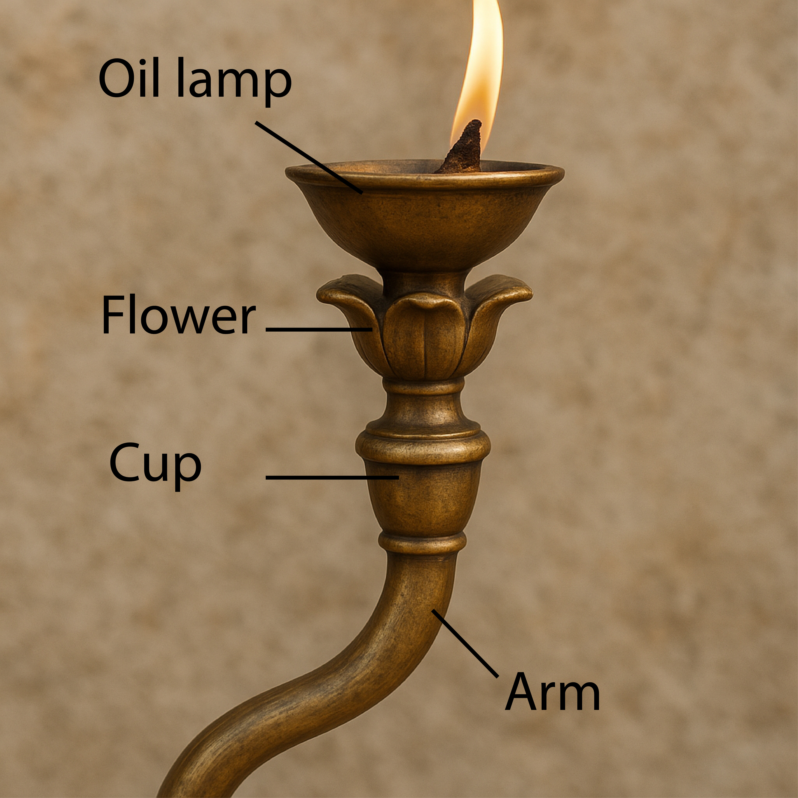

# Human-made Things in the Bible

## License Information

Human-made Things in the Bible © United Bible Societies, 2025. Adapted from: <cite>The Works of Their Hands: Man-made Things in the Bible</cite>, by Ray Pritz © 2009 United Bible Societies. This work is licensed under Creative Commons Attribution-ShareAlike 4.0 International (<a href="https://creativecommons.org/licenses/by-sa/4.0/">https://creativecommons.org/licenses/by-sa/4.0/</a>).

--------------------------------

## Lampstand, menorah (id: REALIA:4.3.4)

4\.3\.4 Lampstand, menorah
==========================

References:
-----------

Hebrew מְנוֹרָה (mnorah)

[EXO 25:31](https://ref.ly/Exod25:31), [EXO 25:31](https://ref.ly/Exod25:31), [EXO 25:32](https://ref.ly/Exod25:32), [EXO 25:32](https://ref.ly/Exod25:32), [EXO 25:33](https://ref.ly/Exod25:33), [EXO 25:34](https://ref.ly/Exod25:34), [EXO 25:35](https://ref.ly/Exod25:35), [EXO 26:35](https://ref.ly/Exod26:35), [EXO 30:27](https://ref.ly/Exod30:27), [EXO 31:8](https://ref.ly/Exod31:8), [EXO 35:14](https://ref.ly/Exod35:14), [EXO 37:17](https://ref.ly/Exod37:17), [EXO 37:17](https://ref.ly/Exod37:17), [EXO 37:18](https://ref.ly/Exod37:18), [EXO 37:18](https://ref.ly/Exod37:18), [EXO 37:19](https://ref.ly/Exod37:19), [EXO 37:20](https://ref.ly/Exod37:20), [EXO 39:37](https://ref.ly/Exod39:37), [EXO 40:4](https://ref.ly/Exod40:4), [EXO 40:24](https://ref.ly/Exod40:24), [LEV 24:4](https://ref.ly/Lev24:4), [NUM 3:31](https://ref.ly/Num3:31), [NUM 4:9](https://ref.ly/Num4:9), [NUM 8:2](https://ref.ly/Num8:2), [NUM 8:3](https://ref.ly/Num8:3), [NUM 8:4](https://ref.ly/Num8:4), [NUM 8:4](https://ref.ly/Num8:4), [1KI 7:49](https://ref.ly/1Kgs7:49), [2KI 4:10](https://ref.ly/2Kgs4:10), [1CH 28:15](https://ref.ly/1Chr28:15), [1CH 28:15](https://ref.ly/1Chr28:15), [1CH 28:15](https://ref.ly/1Chr28:15), [1CH 28:15](https://ref.ly/1Chr28:15), [1CH 28:15](https://ref.ly/1Chr28:15), [1CH 28:15](https://ref.ly/1Chr28:15), [1CH 28:15](https://ref.ly/1Chr28:15), [2CH 4:7](https://ref.ly/2Chr4:7), [2CH 4:20](https://ref.ly/2Chr4:20), [2CH 13:11](https://ref.ly/2Chr13:11), [JER 52:19](https://ref.ly/Jer52:19), [ZEC 4:2](https://ref.ly/Zech4:2), [ZEC 4:11](https://ref.ly/Zech4:11)

Greek λυχνία (luchnia)

[HEB 9:2](https://ref.ly/Heb9:2), [SIR 26:17](https://ref.ly/Sir26:17), [1MA 1:21](https://ref.ly/1Macc1:21), [1MA 4:49](https://ref.ly/1Macc4:49), [1MA 4:50](https://ref.ly/1Macc4:50)

Latin

[2ES 10:22](https://ref.ly/2Esd10:22)

Description:
------------

*Drawing showing the parts of the branch of a lampstand (menorah) (Image generated by ChatGPT using OpenAI technology)*

The construction of the lampstand in the Tabernacle is discussed in [EXO 25:31–EXO 25:40](https://ref.ly/Exod25:31-Exod25:40); [EXO 37:17–EXO 37:24](https://ref.ly/Exod37:17-Exod37:24); [LEV 24:1–LEV 24:4](https://ref.ly/Lev24:1-Lev24:4). It was shaped from a single block of gold and consisted of five distinct parts. These parts were the base, the shafts (or stems), and the flowerlike cups with buds and petals. The lampstand had a central shaft, which stood on a base and out of which projected six arms, making a total of seven branches. A lamp that burned oil stood on the top of each of these branches.

Only one lampstand was prescribed for the Tabernacle. However, when Solomon built and furnished the Temple, he is said ([1KI 7:49](https://ref.ly/1Kgs7:49); [2CH 4:7](https://ref.ly/2Chr4:7)) to have included ten lampstands. No explanation is given in the text for the increase to ten. Solomon also furnished the Temple with ten tables and ten washbasins, where only one of each was called for in the Tabernacle. One Jewish tradition says that the ten lampstands were in addition to the single prescribed lampstand and that their location “to the right” and “to the left” meant to the right and left of the single holy lampstand. We have no indication that the structure of the lampstand changed in Solomon’s time, and the ten lampstands which he made probably looked like the one described for the Tabernacle.

For the basic functioning of oil lamps, see [5\.1 Oil lamp and wick\<REALIA:5\.1\>](#) and [5\.2 Lampstand\<REALIA:5\.2\>](#).

---

Translation:
------------

Since there is no special word for “lampstand” in many cultures, it may have to be translated “lamp holder” or “thing on which lamps are placed.” It should be emphasized that this object did not hold candles but oil lamps (see [5\.1 Oil lamp and wick\<REALIA:5\.1\>](#)).

The lampstand (*mnorah* in Hebrew) is mostly described in terms of flower parts. Knowing this may be helpful when seeking for appropriate terms to translate the individual parts of the lampstand. The flowerlike parts included “stems,” “buds” or “calyxes,” and “cups,” which were like the heads of open flowers. ITCL (Italian Common Language Version) includes the following useful footnote: “The terms used in the Hebrew text are difficult to interpret. It has been suggested that the decorations of the lampstand were taken from the world of plants and flowers.”

*Levite lighting seven\-branched lampstand in the temple (Image generated by ChatGPT using OpenAI technology)*

In [EXO 25:31](https://ref.ly/Exod25:31), where the parts of the lampstand are listed, CEV (Contemporary English Version) has simply “The whole lampstand, including its decorative flowers, must be made of a single piece of hammered gold.” GECL (German Common Language Version (Gute Nachricht Bibel)) is even more condensed with “It must be made with all of its parts from one piece \[of gold].” This solution may be adopted by some translations for this verse, although it will still be necessary to translate individual parts of the lampstand in the verses that follow.

[LEV 24:4](https://ref.ly/Lev24:4): In this verse the Hebrew text literally speaks of “the pure lampstand” (so NJB (New Jerusalem Bible (1985)), NJPSV (New Jewish Publication Society Version)), which possibly refers to the sacred character or ritual cleanness of the lampstand without reference to the gold of which it was made. NEB (New English Bible (1970)), for example, has “the lamp\-stand, ritually clean.” But the majority of versions (for example, NIV (New International Version (1984))) take it to mean “the pure gold lampstand.” If the “pure gold” interpretation is followed, the idea of “purity” in this case may have to be expressed as “containing no other things” or “made of nothing but \[gold].” The word for “gold” may have to be borrowed in some languages (in which case, it should be explained in the glossary).

The parts of the lampstand, from bottom to top, were:

*Yarek* ([EXO 25:31](https://ref.ly/Exod25:31); [EXO 37:17](https://ref.ly/Exod37:17); [NUM 8:4](https://ref.ly/Num8:4)): This Hebrew word refers to the “base” or “foot” on which the entire lampstand stood. In [NUM 8:4](https://ref.ly/Num8:4) the literal phrase “from its base to it’s flowers” (RSV (Revised Standard Version (1952))) may be rendered “from top to bottom” (so GNT (Good News Translation (1992))).

*Qaneh* ([EXO 25:0](https://ref.ly/Exod25:0) \[12 times]; [EXO 37:0](https://ref.ly/Exod37:0) \[12 times]): This Hebrew word literally means “reed.” In [EXO 25:0](https://ref.ly/Exod25:0) and [EXO 37:0](https://ref.ly/Exod37:0) it indicates a long, straight stem of a flower. There were six of these stems on the lampstand, three on each side symmetrically, coming out of a central one, making a total of seven. GECL (German Common Language Version (Gute Nachricht Bibel)) drops the flower image and calls them “arms.” This will be natural where a multi\-branched candlestick is known, but it may sound strange where such an item is unknown.

*Gavi‘a* ([EXO 25:31](https://ref.ly/Exod25:31), [EXO 25:33](https://ref.ly/Exod25:33); [EXO 25:34](https://ref.ly/Exod25:34); [EXO 37:17](https://ref.ly/Exod37:17), [EXO 37:19](https://ref.ly/Exod37:19); [EXO 37:20](https://ref.ly/Exod37:20)): This Hebrew word refers to a kind of cup at the top of each of the seven stems of the lampstand. Olive oil and wicks that burned, giving off light, were placed into the seven cups. The cups were evidently shaped like the head of a flower when it is open. NCV (New Century Version) has “flower\-like cups” (similarly NIV (New International Version (1984))). REB (Revised English Bible (1989)) has simply “cups,” while GNT (Good News Translation (1992)) says “decorative flowers.”

*Kaftor* ([EXO 25:0](https://ref.ly/Exod25:0) \[8 times]; [EXO 37:0](https://ref.ly/Exod37:0) \[8 times]): This Hebrew word is also used to designate the “capital” (so RSV (Revised Standard Version (1952)) in [AMO 9:1](https://ref.ly/Amos9:1)) of a column (see [3\.5 Column, pillar, capital\<REALIA:3\.5\>](#)). Here it seems to indicate a kind of knob or bulb, a swelling like a ball or an egg at the joints between the branches and where the head of the flower joined the stem. Most translations maintain the flower image by rendering this word “buds” (GNT (Good News Translation (1992)), NIV (New International Version (1984))) or “calyxes” (NRSV (New Revised Standard Version (1989)), NJPSV (New Jewish Publication Society Version)).

*Perach* ([EXO 25:0](https://ref.ly/Exod25:0) \[4 times]; [EXO 37:0](https://ref.ly/Exod37:0) \[4 times]; [NUM 8:4](https://ref.ly/Num8:4); [1KI 7:49](https://ref.ly/1Kgs7:49); [2CH 4:21](https://ref.ly/2Chr4:21)): This Hebrew word means “flower,” or more specifically “bloom,” which is the head of a flower made by the open petals. The flowers of the lampstand formed the cups. While most translations keep the flower image for this word, they vary in how they express it. Some have “petals” (GNT (Good News Translation (1992)), NJPSV (New Jewish Publication Society Version)), while others say “flowers” (RSV (Revised Standard Version (1952))).

* **Associated Passages:** Exodus 25:31; Exodus 25:32; Exodus 25:33; Exodus 25:34; Exodus 25:35; Exodus 26:35; Exodus 30:27; Exodus 31:8; Exodus 35:14; Exodus 37:17; Exodus 37:18; Exodus 37:19; Exodus 37:20; Exodus 39:37; Exodus 40:4; Exodus 40:24; Leviticus 24:4; Numbers 3:31; Numbers 4:9; Numbers 8:2; Numbers 8:3; Numbers 8:4; 1 Kings 7:49; 2 Kings 4:10; 1 Chronicles 28:15; 2 Chronicles 4:7; 2 Chronicles 4:20; 2 Chronicles 13:11; Jeremiah 52:19; Zechariah 4:2; Zechariah 4:11; Hebrews 9:2; Sirach 26:17; 1 Maccabees 1:21; 1 Maccabees 4:49; 1 Maccabees 4:50; 2 Esdras (Latin) 10:22; Exodus 25:40; Exodus 37:24; Leviticus 24:1; Exodus 25:0; Exodus 37:0; Amos 9:1; 2 Chronicles 4:21

* **Associated ACAI Concepts:** Lampstand (ID: `realia:Lampstand.2`)

## Snuffer, wick trimmer (id: REALIA:4.3.4.1)

4\.3\.4\.1 Snuffer, wick trimmer
================================

References:
-----------

Hebrew מְזַמֶּרֶת (mzamereth)

[1KI 7:50](https://ref.ly/1Kgs7:50), [2KI 12:14](https://ref.ly/2Kgs12:14), [2KI 25:14](https://ref.ly/2Kgs25:14), [2CH 4:22](https://ref.ly/2Chr4:22), [JER 52:18](https://ref.ly/Jer52:18)

Description and usage:
----------------------

A snuffer is a kind of cap placed over the burning wick of a lamp to extinguish it by cutting off the air supply. The specific ones mentioned for the Temple service would have been made of gold.

A wick trimmer is a kind of scissors for cutting off the burnt part of the wick so that it makes less smoke when it burns.

---

Translation:
------------

Translations are divided concerning the proper identification of the Hebrew word *mzamereth*. The word could indicate some kind of musical instrument, although no translation consulted reflects this meaning. The same Hebrew root can also mean “to cut, to trim” (see [LEV 25:4](https://ref.ly/Lev25:4)), and it is on this basis that some versions (for example, NIV (New International Version (1984)) and NCV (New Century Version)) interpret it to mean a kind of scissors for trimming a burnt wick. Others (for example, RSV (Revised Standard Version (1952)) and CEV (Contemporary English Version)) take it to be a kind of cap placed over the burning wick to put it out. Another interpretation is that it was a small plate set under a lamp to catch the ashes of the wick as it burned down.

In any society where oil lamps or at least extensive candle lighting is unfamiliar, it will be difficult to find a suitable term for this Hebrew word. Even something like “wick trimmers” (NCV (New Century Version)) or “lamp snuffers” (CEV (Contemporary English Version)) is not readily understood by modern English readers. Translators are advised to select a term that will be understood by most people and, where possible, to include a note or glossary entry describing the operation of an oil lamp (see [5\.1 Oil lamp and wick\<REALIA:5\.1\>](#)).

Curtain, veil, drape: See [3\.14\.1\.6 Curtain, veil, drape\<REALIA:3\.14\.1\.6\>](#).

* **Associated Passages:** 1 Kings 7:50; 2 Kings 12:14; 2 Kings 25:14; 2 Chronicles 4:22; Jeremiah 52:18; Leviticus 25:4

* **Associated ACAI Concepts:** Wick Trimmer (ID: `realia:WickTrimmer`)
