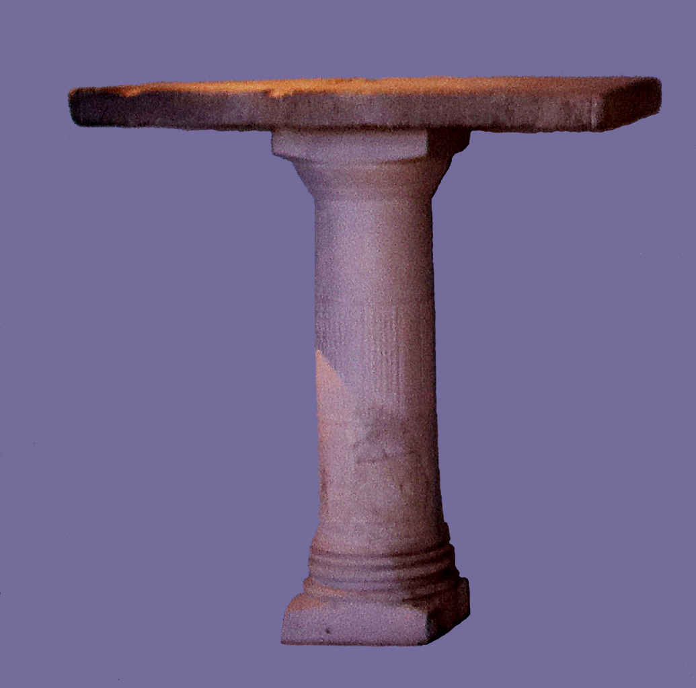

# Human-made Things in the Bible

## License Information

Human-made Things in the Bible © United Bible Societies, 2025. Adapted from: <cite>The Works of Their Hands: Man-made Things in the Bible</cite>, by Ray Pritz © 2009 United Bible Societies. This work is licensed under Creative Commons Attribution-ShareAlike 4.0 International (<a href="https://creativecommons.org/licenses/by-sa/4.0/">https://creativecommons.org/licenses/by-sa/4.0/</a>).

--------------------------------

## Tables for preparing sacrificial victims (id: REALIA:4.3.6)

4\.3\.6 Tables for preparing sacrificial victims
================================================

References:
-----------

Hebrew שֻׁלְחָן (shulchan)

[EXO 25:23](https://ref.ly/Exod25:23), [EXO 25:27](https://ref.ly/Exod25:27), [EXO 25:28](https://ref.ly/Exod25:28), [EXO 25:30](https://ref.ly/Exod25:30), [EXO 26:35](https://ref.ly/Exod26:35), [EXO 26:35](https://ref.ly/Exod26:35), [EXO 26:35](https://ref.ly/Exod26:35), [EXO 30:27](https://ref.ly/Exod30:27), [EXO 31:8](https://ref.ly/Exod31:8), [EXO 35:13](https://ref.ly/Exod35:13), [EXO 37:10](https://ref.ly/Exod37:10), [EXO 37:14](https://ref.ly/Exod37:14), [EXO 37:15](https://ref.ly/Exod37:15), [EXO 37:16](https://ref.ly/Exod37:16), [EXO 39:36](https://ref.ly/Exod39:36), [EXO 40:4](https://ref.ly/Exod40:4), [EXO 40:22](https://ref.ly/Exod40:22), [EXO 40:24](https://ref.ly/Exod40:24), [LEV 24:6](https://ref.ly/Lev24:6), [NUM 3:31](https://ref.ly/Num3:31), [NUM 4:7](https://ref.ly/Num4:7), [1KI 7:48](https://ref.ly/1Kgs7:48), [1CH 28:16](https://ref.ly/1Chr28:16), [1CH 28:16](https://ref.ly/1Chr28:16), [1CH 28:16](https://ref.ly/1Chr28:16), [1CH 28:16](https://ref.ly/1Chr28:16), [2CH 4:8](https://ref.ly/2Chr4:8), [2CH 4:19](https://ref.ly/2Chr4:19), [2CH 13:11](https://ref.ly/2Chr13:11), [2CH 29:18](https://ref.ly/2Chr29:18), [EZK 23:41](https://ref.ly/Ezek23:41), [EZK 40:39](https://ref.ly/Ezek40:39), [EZK 40:39](https://ref.ly/Ezek40:39), [EZK 40:40](https://ref.ly/Ezek40:40), [EZK 40:40](https://ref.ly/Ezek40:40), [EZK 40:41](https://ref.ly/Ezek40:41), [EZK 40:41](https://ref.ly/Ezek40:41), [EZK 40:41](https://ref.ly/Ezek40:41), [EZK 40:42](https://ref.ly/Ezek40:42), [EZK 40:43](https://ref.ly/Ezek40:43), [EZK 41:22](https://ref.ly/Ezek41:22), [EZK 44:16](https://ref.ly/Ezek44:16), [MAL 1:7](https://ref.ly/Mal1:7), [MAL 1:12](https://ref.ly/Mal1:12)

References:
-----------

### **Hooks**:

Hebrew שְׁפַתַּיִם (shfatayim)

[EZK 40:43](https://ref.ly/Ezek40:43)

Description:
------------

*A table possibly for preparing sacrifices for the altar (Gary Todd, Israel Museum, CC0, via Wikimedia Commons)*

Inside and outside the vestibule of the north gate of Ezekiel’s Temple, there were a number of tables made of hewn stone. They served several purposes in the slaughter and preparation of the sacrificial victims. They were to stand at a height of 50 centimeters (20 inches), and their tops were square, 75 by 75 centimeters (30 by 30 inches). We are not told if they had legs or stood on a single pedestal. On some of the tables were kept the implements used in the slaughter, skinning, and gutting of the victims.

---

Translation:
------------

Unlike furniture that was prescribed for the Tabernacle, these tables do not seem to be mobile. One problem in understanding [EZK 40:39](https://ref.ly/Ezek40:39); [EZK 40:40](https://ref.ly/Ezek40:40); [EZK 40:41](https://ref.ly/Ezek40:41); [EZK 40:42](https://ref.ly/Ezek40:42); [EZK 40:43](https://ref.ly/Ezek40:43) has to do with the number of tables. Most translations understand that there were eight tables altogether, four inside the vestibule and four outside (GNT (Good News Translation (1992)) “41 Altogether there were eight tables on which the animals to be sacrificed were killed: four inside the room and four out in the courtyard. 42 The four tables in the annex, used to prepare the offerings to be burned whole, were of cut stone …”). However, some understand that there were twelve tables altogether (NIV (New International Version (1984)) “41 So there were four tables on one side of the gateway and four on the other—eight tables in all—on which the sacrifices were slaughtered. 42 There were also four tables of dressed stone for the burnt offerings …”).

Verse 43 presents the translator with a couple of interrelated problems. The meaning of the Hebrew word *shfatayim* is not certain. With a small change of its first letter, some versions take it to mean a “ledges/shelves” (GNT (Good News Translation (1992)), CEV (Contemporary English Version), REB (Revised English Bible (1989)), NJPSV (New Jewish Publication Society Version)). Others understand it to mean “hooks” (RSV (Revised Standard Version (1952)), NIV (New International Version (1984)), GECL (German Common Language Version (Gute Nachricht Bibel))). In addition to its meaning, its location is also problematic. The Hebrew text (in the middle of describing the tables) says it was “inside all around.” If this means all around the tables, it makes little sense (NJPSV (New Jewish Publication Society Version) “Shelves … were attached all around the inside”). How can we visualize shelves around the inside of the table? GNT (Good News Translation (1992)) simply ignores the word for “inside” and says “Ledges 3 inches wide ran around the edge of the tables.” Some have avoided the problem by assuming that “all around” refers to the walls of the vestibule rather than the tables (CEV (Contemporary English Version) “All around the walls of this room was a three inch shelf”). It is difficult to see the purpose of such a narrow shelf, if indeed it served any purpose at all. Rendering *shfatayim* as “hooks” solves only part of the problems. The length of 75 millimeters (3 inches) would be reasonable for a hook. The problem of “all around inside” the tables is the same for hooks as it is for shelves. However, if “Hooks were anchored in the wall all around” (GECL (German Common Language Version (Gute Nachricht Bibel))), then we can imagine several possible purposes for such hooks. They could have been used for hanging the work implements, or (as suggested by Jewish tradition) they could have been for hanging the freshly\-slaughtered victim while its skin was removed (something that is difficult to do while it lies on a table). The form of the word *shfatayim* suggests something doubled, so NIV (New International Version (1984)) has “double\-pronged hooks.”

* **Associated Passages:** Exodus 25:23; Exodus 25:27; Exodus 25:28; Exodus 25:30; Exodus 26:35; Exodus 30:27; Exodus 31:8; Exodus 35:13; Exodus 37:10; Exodus 37:14; Exodus 37:15; Exodus 37:16; Exodus 39:36; Exodus 40:4; Exodus 40:22; Exodus 40:24; Leviticus 24:6; Numbers 3:31; Numbers 4:7; 1 Kings 7:48; 1 Chronicles 28:16; 2 Chronicles 4:8; 2 Chronicles 4:19; 2 Chronicles 13:11; 2 Chronicles 29:18; Ezekiel 23:41; Ezekiel 40:39; Ezekiel 40:40; Ezekiel 40:41; Ezekiel 40:42; Ezekiel 40:43; Ezekiel 41:22; Ezekiel 44:16; Malachi 1:7; Malachi 1:12

