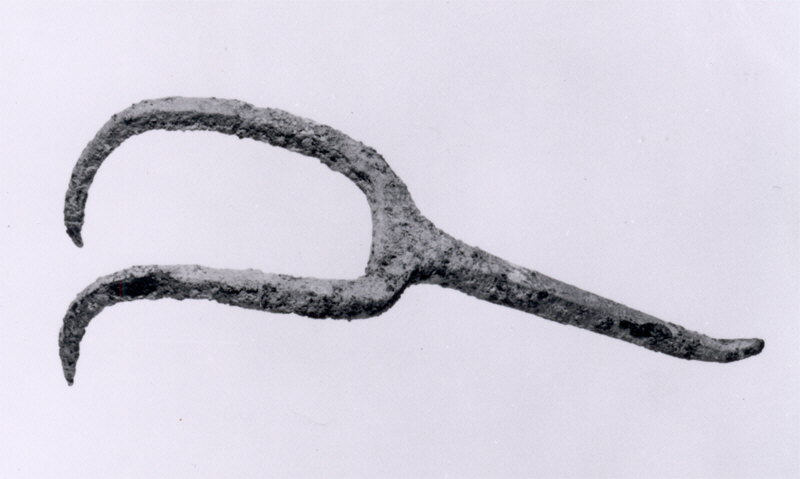

# Human-made Things in the Bible

## License Information

Human-made Things in the Bible © United Bible Societies, 2025. Adapted from: <cite>The Works of Their Hands: Man-made Things in the Bible</cite>, by Ray Pritz © 2009 United Bible Societies. This work is licensed under Creative Commons Attribution-ShareAlike 4.0 International (<a href="https://creativecommons.org/licenses/by-sa/4.0/">https://creativecommons.org/licenses/by-sa/4.0/</a>).

--------------------------------

## Fork (id: REALIA:4.4.2)

4\.4\.2 Fork
============

References:
-----------

Hebrew מַזְלֵג (mazleg)

[1SA 2:13](https://ref.ly/1Sam2:13), [1SA 2:14](https://ref.ly/1Sam2:14)

Hebrew מַזְלֵג (mizlgoth)

[EXO 27:3](https://ref.ly/Exod27:3), [EXO 38:3](https://ref.ly/Exod38:3), [NUM 4:14](https://ref.ly/Num4:14), [1CH 28:17](https://ref.ly/1Chr28:17), [2CH 4:16](https://ref.ly/2Chr4:16)

Description and usage:
----------------------

*Copper alloy fork, late 3rd–early 2nd millennium BCE, central Asia (Metropolitan Museum of Art, CC0, via Wikimedia Commons)*

The fork was used in the Tabernacle and Temple to turn sacrificial victims on the altar or to remove them. Its exact form is unknown, but it may have resembled a hook or a kind of two\-pronged fork.

---

Translation:
------------

For the Hebrew word *mizlgoth*, some translations (RSV (Revised Standard Version (1952)), REB (Revised English Bible (1989))) have “forks,” while GNT (Good News Translation (1992)) says “hooks.” However, a more descriptive expression is recommended, such as “meat forks” (NIV (New International Version (1984)), CEV (Contemporary English Version), FRCL (French Common Language Version (Bible en français courant))).

The Hebrew word *mazleg* for fork used to describe the actions of the sons of Eli in [1SA 2:13](https://ref.ly/1Sam2:13); [1SA 2:14](https://ref.ly/1Sam2:14) differs slightly from the word *mizlgoth*. It is reasonable to assume that they used something ready at hand, probably the same fork used at the altar. Translators are advised to use the same word. In many languages the word used for both of these will be the same as the word for a common fork, used as an item of table cutlery.

* **Associated Passages:** 1 Samuel 2:13; 1 Samuel 2:14; Exodus 27:3; Exodus 38:3; Numbers 4:14; 1 Chronicles 28:17; 2 Chronicles 4:16

