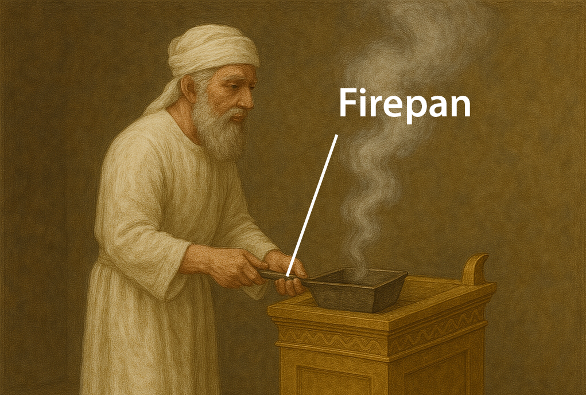
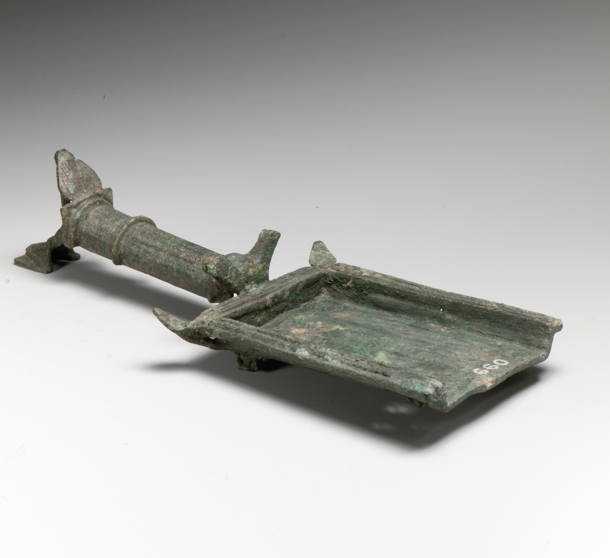

# Human-made Things in the Bible

## License Information

Human-made Things in the Bible © United Bible Societies, 2025. Adapted from: <cite>The Works of Their Hands: Man-made Things in the Bible</cite>, by Ray Pritz © 2009 United Bible Societies. This work is licensed under Creative Commons Attribution-ShareAlike 4.0 International (<a href="https://creativecommons.org/licenses/by-sa/4.0/">https://creativecommons.org/licenses/by-sa/4.0/</a>).

--------------------------------

## Tabernacle and Temple implements (id: REALIA:4.4)

4\.4 Tabernacle and Temple implements
=====================================

The sacrificial cult was a fairly messy business, and the work at the altar required a number of special implements to make things move more efficiently. The victims were killed by cutting the throat, which normally caused a large flow of blood. The blood was caught in a special container. Some of the blood was then sprinkled ceremonially on the altar, and the rest was poured out at the base of the altar. The sacrificial victim was laid on wood on the altar and burned. In order to speed up the process, the victim was occasionally turned. Because it was lying on a large fire, this turning required a long\-handled instrument that could hold the meat and move it around; this instrument was a kind of long, heavy fork. Once the burning was completed, the remains of the meat and bones and greasy ashes had to be removed from the altar, so that it could be prepared for the next sacrifice. This operation was done with the same fork and with a long\-handled instrument resembling a shovel (or perhaps a kind of rake or hoe), with which the ashes could be lifted or raked off the altar. These waste products were placed into a large bronze pot and were carried away from the altar and disposed of in a specially designated place outside. One final altar implement was a smaller type of shovel. Hot coals were removed from the altar with this shovel and carried to the smaller incense altar.
-------------------------------------------------------------------------------------------------------------------------------------------------------------------------------------------------------------------------------------------------------------------------------------------------------------------------------------------------------------------------------------------------------------------------------------------------------------------------------------------------------------------------------------------------------------------------------------------------------------------------------------------------------------------------------------------------------------------------------------------------------------------------------------------------------------------------------------------------------------------------------------------------------------------------------------------------------------------------------------------------------------------------------------------------------------------------------------------------------------------------------------------------------------------------------------------------------------------------------------------------------------------------------------------------------------------------------------------------------------------------------------------------------------------------------------------------

These five items are listed in [EXO 27:3](https://ref.ly/Exod27:3) (referred to as “bowls,” “hooks,” “shovels,” “pans”, and “fire pans” in GNT (Good News Translation (1992))). They were all to be made of bronze. The exact description cannot be determined for all of them. On the other hand, some of them were more or less common items that were used also at home. Unless special words exist in the receptor language for a particular implement, translators may use the same word for both the secular and the religious item. It should be kept in mind that all of these items were made of heavy metal. The instruments themselves, then, would not have been so large as to make them difficult to lift.

* **Associated Passages:** Exodus 27:3

## Pan, pot, pail (id: REALIA:4.4.1)

4\.4\.1 Pan, pot, pail
======================

References:
-----------

Hebrew סִיר (sir)

[EXO 27:3](https://ref.ly/Exod27:3), [EXO 38:3](https://ref.ly/Exod38:3), [1KI 7:45](https://ref.ly/1Kgs7:45), [2KI 25:14](https://ref.ly/2Kgs25:14), [2CH 4:11](https://ref.ly/2Chr4:11), [2CH 4:16](https://ref.ly/2Chr4:16), [JER 52:18](https://ref.ly/Jer52:18), [JER 52:19](https://ref.ly/Jer52:19), [ZEC 14:20](https://ref.ly/Zech14:20), [ZEC 14:21](https://ref.ly/Zech14:21)

Description and usage:
----------------------

*Bronze cauldron with swinging handle (Etruscan, ca. 550 BCE) (Metropolitan Museum of Art, CC0, MMA)*

The pot was a bronze container used to collect the ashes and animal remains that were on the altar after the sacrificial victim had been burned. The same implement could serve, in another context, as a simple, fairly large cooking pot (see [5\.12 Cooking pot, kettle\<REALIA:5\.12\>](#)).

---

Translation:
------------

See the comments at [4\.4 Tabernacle and Temple implements\<REALIA:4\.4\>](#) above.

[JER 52:18](https://ref.ly/Jer52:18); [JER 52:19](https://ref.ly/Jer52:19) mentions *sir* two times as an object carried off to Babylon. It is not clear if two different items are referred to by the same name or if one item has been listed twice. Almost all translations consulted include the same word twice. [ZEC 14:20](https://ref.ly/Zech14:20); [ZEC 14:21](https://ref.ly/Zech14:21) speaks of a time when even common things will be put to holy use. The *sir* in verse 20 is the Temple implement described here, while the *sir* in verse 21 is the everyday pot in every home in Judah, which will one day be put into service like a Temple implement.

* **Associated Passages:** Exodus 27:3; Exodus 38:3; 1 Kings 7:45; 2 Kings 25:14; 2 Chronicles 4:11; 2 Chronicles 4:16; Jeremiah 52:18; Jeremiah 52:19; Zechariah 14:20; Zechariah 14:21

* **Associated ACAI Concepts:** Shovel (ID: `realia:Shovel`); Cooking Pot (ID: `realia:CookingPot`)

## Fork (id: REALIA:4.4.2)

4\.4\.2 Fork
============

References:
-----------

Hebrew מַזְלֵג (mazleg)

[1SA 2:13](https://ref.ly/1Sam2:13), [1SA 2:14](https://ref.ly/1Sam2:14)

Hebrew מַזְלֵג (mizlgoth)

[EXO 27:3](https://ref.ly/Exod27:3), [EXO 38:3](https://ref.ly/Exod38:3), [NUM 4:14](https://ref.ly/Num4:14), [1CH 28:17](https://ref.ly/1Chr28:17), [2CH 4:16](https://ref.ly/2Chr4:16)

Description and usage:
----------------------

*Copper alloy fork, late 3rd–early 2nd millennium BCE, central Asia (Metropolitan Museum of Art, CC0, via Wikimedia Commons)*

The fork was used in the Tabernacle and Temple to turn sacrificial victims on the altar or to remove them. Its exact form is unknown, but it may have resembled a hook or a kind of two\-pronged fork.

---

Translation:
------------

For the Hebrew word *mizlgoth*, some translations (RSV (Revised Standard Version (1952)), REB (Revised English Bible (1989))) have “forks,” while GNT (Good News Translation (1992)) says “hooks.” However, a more descriptive expression is recommended, such as “meat forks” (NIV (New International Version (1984)), CEV (Contemporary English Version), FRCL (French Common Language Version (Bible en français courant))).

The Hebrew word *mazleg* for fork used to describe the actions of the sons of Eli in [1SA 2:13](https://ref.ly/1Sam2:13); [1SA 2:14](https://ref.ly/1Sam2:14) differs slightly from the word *mizlgoth*. It is reasonable to assume that they used something ready at hand, probably the same fork used at the altar. Translators are advised to use the same word. In many languages the word used for both of these will be the same as the word for a common fork, used as an item of table cutlery.

* **Associated Passages:** 1 Samuel 2:13; 1 Samuel 2:14; Exodus 27:3; Exodus 38:3; Numbers 4:14; 1 Chronicles 28:17; 2 Chronicles 4:16

* **Associated ACAI Concepts:** Fork (ID: `realia:Fork`)

## Tongs (id: REALIA:4.4.3)

4\.4\.3 Tongs
=============

References:
-----------

Hebrew מֶלְקָחַיִם (melqachayim)

[EXO 25:38](https://ref.ly/Exod25:38), [EXO 37:23](https://ref.ly/Exod37:23), [NUM 4:9](https://ref.ly/Num4:9), [1KI 7:49](https://ref.ly/1Kgs7:49), [2CH 4:21](https://ref.ly/2Chr4:21), [ISA 6:6](https://ref.ly/Isa6:6)

Hebrew מַעֲצָד (ma‘atsad)

[ISA 44:12](https://ref.ly/Isa44:12)

Description and usage:
----------------------

*Tongs (Gary Todd, Israel Museum, CC0, via Wikimedia Commons)*

A pair of tongs was a metal tool that was U\-shaped. The user held the tool near its closed end; by squeezing its two arms together, it was possible to pick up hot coals or other objects. Tongs may be thought of as a large version of the tweezers often used today for plucking hairs or removing thorns or splinters.

---

Translation:
------------

The Hebrew word *melqachayim* always refers to an implement used by the priests. Except for [ISA 6:6](https://ref.ly/Isa6:6), where no material is specified, they were all made of gold, and they were used in connection with the lamps of the Tabernacle and Temple. Some commentators understand the word *melqachayim* in these passages to refer to a smaller set of tongs used to adjust or remove the wicks in the lamps (see [4\.3\.4\.1 Snuffer, wick trimmer\<REALIA:4\.3\.4\.1\>](#) and [5\.1 Oil lamp and wick\<REALIA:5\.1\>](#)). So in this context it would be a kind of “pincers” or large tweezers.

The Hebrew word *ma’atsad* in [ISA 44:12](https://ref.ly/Isa44:12) refers to tongs similar in construction to those used in the Tabernacle and Temple. The pair of tongs in this verse, however, was used by a blacksmith to hold hot metal while he worked on it.

* **Associated Passages:** Exodus 25:38; Exodus 37:23; Numbers 4:9; 1 Kings 7:49; 2 Chronicles 4:21; Isaiah 6:6; Isaiah 44:12

## Basin, bowl (id: REALIA:4.4.4)

4\.4\.4 Basin, bowl
===================

References:
-----------

Hebrew אַגָּן (’agan)

[EXO 24:6](https://ref.ly/Exod24:6)

Hebrew אֲגַרְטָל (’agartal)

[EZR 1:9](https://ref.ly/Ezra1:9), [EZR 1:9](https://ref.ly/Ezra1:9)

Hebrew כְּפוֹר (kfor)

[1CH 28:17](https://ref.ly/1Chr28:17), [1CH 28:17](https://ref.ly/1Chr28:17), [1CH 28:17](https://ref.ly/1Chr28:17), [1CH 28:17](https://ref.ly/1Chr28:17), [1CH 28:17](https://ref.ly/1Chr28:17), [1CH 28:17](https://ref.ly/1Chr28:17), [EZR 1:10](https://ref.ly/Ezra1:10), [EZR 1:10](https://ref.ly/Ezra1:10), [EZR 8:27](https://ref.ly/Ezra8:27)

Hebrew מִזְרָק (mizraq)

[EXO 27:3](https://ref.ly/Exod27:3), [EXO 38:3](https://ref.ly/Exod38:3), [NUM 4:14](https://ref.ly/Num4:14), [NUM 7:13](https://ref.ly/Num7:13), [NUM 7:19](https://ref.ly/Num7:19), [NUM 7:25](https://ref.ly/Num7:25), [NUM 7:31](https://ref.ly/Num7:31), [NUM 7:37](https://ref.ly/Num7:37), [NUM 7:43](https://ref.ly/Num7:43), [NUM 7:49](https://ref.ly/Num7:49), [NUM 7:55](https://ref.ly/Num7:55), [NUM 7:61](https://ref.ly/Num7:61), [NUM 7:67](https://ref.ly/Num7:67), [NUM 7:73](https://ref.ly/Num7:73), [NUM 7:79](https://ref.ly/Num7:79), [NUM 7:84](https://ref.ly/Num7:84), [NUM 7:85](https://ref.ly/Num7:85), [1KI 7:40](https://ref.ly/1Kgs7:40), [1KI 7:45](https://ref.ly/1Kgs7:45), [1KI 7:50](https://ref.ly/1Kgs7:50), [2KI 12:14](https://ref.ly/2Kgs12:14), [2KI 25:15](https://ref.ly/2Kgs25:15), [1CH 28:17](https://ref.ly/1Chr28:17), [2CH 4:8](https://ref.ly/2Chr4:8), [2CH 4:11](https://ref.ly/2Chr4:11), [2CH 4:22](https://ref.ly/2Chr4:22), [NEH 7:69](https://ref.ly/Neh7:69), [JER 52:18](https://ref.ly/Jer52:18), [JER 52:19](https://ref.ly/Jer52:19), [AMO 6:6](https://ref.ly/Amos6:6), [ZEC 9:15](https://ref.ly/Zech9:15), [ZEC 14:20](https://ref.ly/Zech14:20)

Hebrew מַחֲלָף (machalaf)

[EZR 1:9](https://ref.ly/Ezra1:9)

Hebrew סַף (saf)

[1KI 7:50](https://ref.ly/1Kgs7:50), [2KI 12:14](https://ref.ly/2Kgs12:14), [JER 52:19](https://ref.ly/Jer52:19)

Greek φιάλη (fialē)

[1MA 1:22](https://ref.ly/1Macc1:22), [1ES 2:10](https://ref.ly/1Esd2:10)

Greek χρύσωμα (chrusōma)

[2MA 4:32](https://ref.ly/2Macc4:32), [2MA 4:39](https://ref.ly/2Macc4:39), [1ES 8:56](https://ref.ly/1Esd8:56)

Description and usage:
----------------------

*Bronze bowl (Greece, 2nd\-1st c BCE) (Metropolitan Museum of Art, CC0, via Wikimedia Commons)*

The basin was a concave dish used in Israelite worship for a variety of purposes, such as holding blood to be sprinkled or holding parts of sacrificial animals. It was probably shaped like a large bowl or perhaps like a pan or pitcher with a handle. For the most part, the basins mentioned in the Bible were made of gold or silver, although some in daily use were made of bronze (see [EXO 27:3](https://ref.ly/Exod27:3) and [EXO 38:3](https://ref.ly/Exod38:3)).

---

Translation:
------------

*Priest with blood offering in a bowl (Image generated by ChatGPT using OpenAI technology)*

The function of this basin was to hold liquids. It could be used to catch the blood of sacrificial victims but also to hold water for washing off the blood on the altar. Implements into which liquids can be poured are universally known. The size of the container chosen should not be too large or too small.

The Hebrew word *’agartal* appears only in [EZR 1:9](https://ref.ly/Ezra1:9). The exact shape of the dishes referred to by this word is not in focus but rather that they were large and valuable. CEV (Contemporary English Version) has “large … dishes”; others have “basins” (RSV (Revised Standard Version (1952))) or simply “bowls” (GNT (Good News Translation (1992))). The Hebrew word *machalaf* in the same verse appears only here in Scripture, and its meaning is uncertain. Translations have suggested a variety of implements, including “knives” (NRSV (New Revised Standard Version (1989))), “bowls” (GNT (Good News Translation (1992))), and “pans” (NIV (New International Version (1984))). The Hebrew word has the root meaning “change,” and it is possible that *machalaf* (perhaps with different vowels) means simply “other vessels.” Something like REB (Revised English Bible (1989)) “vessels of various kinds” is recommended.

The Hebrew words *saf* and *mizraq* are listed together in [1KI 7:50](https://ref.ly/1Kgs7:50), and it is not clear how they differ from each other. A sampling of translations will illustrate the uncertainty: “cups … basins” (RSV (Revised Standard Version (1952))), “basins … sprinkling bowls” (NJPSV (New Jewish Publication Society Version), NIV (New International Version (1984))), “cups

* **Associated Passages:** Exodus 24:6; Ezra 1:9; 1 Chronicles 28:17; Ezra 1:10; Ezra 8:27; Exodus 27:3; Exodus 38:3; Numbers 4:14; Numbers 7:13; Numbers 7:19; Numbers 7:25; Numbers 7:31; Numbers 7:37; Numbers 7:43; Numbers 7:49; Numbers 7:55; Numbers 7:61; Numbers 7:67; Numbers 7:73; Numbers 7:79; Numbers 7:84; Numbers 7:85; 1 Kings 7:40; 1 Kings 7:45; 1 Kings 7:50; 2 Kings 12:14; 2 Kings 25:15; 2 Chronicles 4:8; 2 Chronicles 4:11; 2 Chronicles 4:22; Nehemiah 7:69; Jeremiah 52:18; Jeremiah 52:19; Amos 6:6; Zechariah 9:15; Zechariah 14:20; 1 Maccabees 1:22; 1 Esdras (Greek) 2:10; 2 Maccabees 4:32; 2 Maccabees 4:39; 1 Esdras (Greek) 8:56

## Small shovel, firepan (id: REALIA:4.4.5)

4\.4\.5 Small shovel, firepan
=============================

References:
-----------

Hebrew מַחְתָּה (machtah)

[EXO 25:38](https://ref.ly/Exod25:38), [EXO 27:3](https://ref.ly/Exod27:3), [EXO 37:23](https://ref.ly/Exod37:23), [EXO 38:3](https://ref.ly/Exod38:3), [LEV 10:1](https://ref.ly/Lev10:1), [LEV 16:12](https://ref.ly/Lev16:12), [NUM 4:9](https://ref.ly/Num4:9), [NUM 4:14](https://ref.ly/Num4:14), [NUM 16:6](https://ref.ly/Num16:6), [NUM 16:17](https://ref.ly/Num16:17), [NUM 16:17](https://ref.ly/Num16:17), [NUM 16:17](https://ref.ly/Num16:17), [NUM 16:17](https://ref.ly/Num16:17), [NUM 16:18](https://ref.ly/Num16:18), [NUM 17:4](https://ref.ly/Num17:4), [NUM 17:11](https://ref.ly/Num17:11), [1KI 7:50](https://ref.ly/1Kgs7:50), [2KI 25:15](https://ref.ly/2Kgs25:15), [2CH 4:22](https://ref.ly/2Chr4:22), [JER 52:19](https://ref.ly/Jer52:19)

Description and usage:
----------------------

*A priest with a firepan tends the incense altar in the temple (Image generated by ChatGPT using OpenAI technology)*

The firepan was used to move or turn coals on the altar and to carry them to the altar of incense for other purposes (see [4\.2\.4 Incense altar\<REALIA:4\.2\.4\>](#)).

---

Translation:
------------

It has been suggested that the Hebrew word *machtah* also designated a special container for holding the holy fire while the altar was being cleaned or when the Tabernacle was being moved. This would make it a kind of “fire receptacle.” Translators may also express this as “container for carrying away the hot ashes.”

In some of the references listed above, the word *machtah* is associated with the burning of incense ([LEV 10:1](https://ref.ly/Lev10:1); [NUM 16:6](https://ref.ly/Num16:6); [NUM 16:17](https://ref.ly/Num16:17); [NUM 16:18](https://ref.ly/Num16:18)). Where a specific word for “censer” exists, it may be used in these passages, although care should be taken that the word does not suggest a modern censer. A more general word for “firepan” is also acceptable, since it seems that in most of the references listed above the word *machtah* refers to an implement that was used for carrying coals onto which incense was placed sometimes see also [4\.2\.4 Incense altar\<REALIA:4\.2\.4\>](#) and [4\.4\.7 Censer\<REALIA:4\.4\.7\>](#).

*A bronze firepan or incense shovel (Roman, late 1st–early 2nd c. CE) (Metropolitan Museum of Art, CC0, MMA)*

In [EXO 25:38](https://ref.ly/Exod25:38); [EXO 37:23](https://ref.ly/Exod37:23); and [NUM 4:9](https://ref.ly/Num4:9) the *machtah* is associated with the lampstand (see [4\.3\.4 Lampstand, menorah\<REALIA:4\.3\.4\>](#)). Some versions still translate it “firepans” in those places (REB (Revised English Bible (1989)), NJPSV (New Jewish Publication Society Version)), while others say “trays” (RSV (Revised Standard Version (1952)), GNT (Good News Translation (1992)), NIV (New International Version (1984))). In either case, it is not clear what purpose the *mach­tah* served in connection with the lampstand. The object described and illustrated here could have served multiple purposes.

* **Associated Passages:** Exodus 25:38; Exodus 27:3; Exodus 37:23; Exodus 38:3; Leviticus 10:1; Leviticus 16:12; Numbers 4:9; Numbers 4:14; Numbers 16:6; Numbers 16:17; Numbers 16:18; Numbers 17:4; Numbers 17:11; 1 Kings 7:50; 2 Kings 25:15; 2 Chronicles 4:22; Jeremiah 52:19

* **Associated ACAI Concepts:** Shovel (ID: `realia:Shovel`)

## Large shovel, scraper (id: REALIA:4.4.6)

4\.4\.6 Large shovel, scraper
=============================

References:
-----------

Hebrew יָע (ya‘)

[EXO 27:3](https://ref.ly/Exod27:3), [EXO 38:3](https://ref.ly/Exod38:3), [NUM 4:14](https://ref.ly/Num4:14), [1KI 7:40](https://ref.ly/1Kgs7:40), [1KI 7:45](https://ref.ly/1Kgs7:45), [2KI 25:14](https://ref.ly/2Kgs25:14), [2CH 4:11](https://ref.ly/2Chr4:11), [2CH 4:16](https://ref.ly/2Chr4:16), [JER 52:18](https://ref.ly/Jer52:18)

Description and usage:
----------------------

*Large shovels to remove refuse from the altar (Gary Todd, Israel Museum, CC0, via Wikimedia Commons)*

The scraper was used to remove the refuse from the altar after a victim had been burned. It may have resembled a kind of shovel, with which the ashes could be lifted, or a kind of rake or hoe, with which they could be scraped into the bronze pot (see [4\.4\.1 Pan, pot, pail\<REALIA:4\.4\.1\>](#)).

* **Associated Passages:** Exodus 27:3; Exodus 38:3; Numbers 4:14; 1 Kings 7:40; 1 Kings 7:45; 2 Kings 25:14; 2 Chronicles 4:11; 2 Chronicles 4:16; Jeremiah 52:18

* **Associated ACAI Concepts:** Shovel (ID: `realia:Shovel`)

## Censer (id: REALIA:4.4.7)

4\.4\.7 Censer
==============

References:
-----------

Hebrew מִקְטֶרֶת (miqtereth)

[2CH 26:19](https://ref.ly/2Chr26:19), [EZK 8:11](https://ref.ly/Ezek8:11)

Greek θυΐσκη (thuiskē)

[1MA 1:22](https://ref.ly/1Macc1:22), [1ES 2:9](https://ref.ly/1Esd2:9)

Greek θυμιατήριον (thumiatērion)

[4MA 7:11](https://ref.ly/4Macc7:11)

Greek λιβανωτός (libanōtos)

[REV 8:3](https://ref.ly/Rev8:3), [REV 8:5](https://ref.ly/Rev8:5)

Greek πυρεῖον (pureion)

[SIR 50:9](https://ref.ly/Sir50:9)

Description:
------------

*Terracotta censer for burning incense and firepan for moving hot coals (© Ray Pritz by United Bible Societies)*

The censer was a small bowl or pan in which incense was burned. It was usually made of metal. It had a handle so that the priest could hold it and carry it to the altar.

---

Usage:
------

Coals, usually from the altar, were placed into the bowl or flat pan. On top of these coals was sprinkled a small amount of incense, which gave off a pleasant smell when it was burned by the coals.

---

Translation:
------------

Some cultures will be familiar with burning incense in religious ceremonies, and there may be a special word for the instrument in which this is done. However, translators should be careful not to choose a word that is associated only with the rites of cultic or non\-Christian worship. It may be necessary to expand the expression by saying “small pan for burning sweet\-smelling perfume.” See also [4\.2\.4 Incense altar\<REALIA:4\.2\.4\>](#) and [4\.4\.5 Small shovel, firepan\<REALIA:4\.4\.5\>](#).

* **Associated Passages:** 2 Chronicles 26:19; Ezekiel 8:11; 1 Maccabees 1:22; 1 Esdras (Greek) 2:9; 4 Maccabees 7:11; Revelation 8:3; Revelation 8:5; Sirach 50:9

* **Associated ACAI Concepts:** Censer (ID: `realia:Censer`)

## Incense, frankincense (id: REALIA:4.4.7.1)

4\.4\.7\.1 Incense, frankincense
================================

References:
-----------

Hebrew לְבוֹנָה (lvonah)

[EXO 30:34](https://ref.ly/Exod30:34), [LEV 2:1](https://ref.ly/Lev2:1), [LEV 2:2](https://ref.ly/Lev2:2), [LEV 2:15](https://ref.ly/Lev2:15), [LEV 2:16](https://ref.ly/Lev2:16), [LEV 5:11](https://ref.ly/Lev5:11), [LEV 6:8](https://ref.ly/Lev6:8), [LEV 24:7](https://ref.ly/Lev24:7), [NUM 5:15](https://ref.ly/Num5:15), [1CH 9:29](https://ref.ly/1Chr9:29), [NEH 13:5](https://ref.ly/Neh13:5), [NEH 13:9](https://ref.ly/Neh13:9), [SNG 3:6](https://ref.ly/Song3:6), [SNG 4:6](https://ref.ly/Song4:6), [SNG 4:14](https://ref.ly/Song4:14), [ISA 43:23](https://ref.ly/Isa43:23), [ISA 60:6](https://ref.ly/Isa60:6), [ISA 66:3](https://ref.ly/Isa66:3), [JER 6:20](https://ref.ly/Jer6:20), [JER 17:26](https://ref.ly/Jer17:26), [JER 41:5](https://ref.ly/Jer41:5)

Aramaic נִיחוֹחַ (nichoach)

[EZR 6:10](https://ref.ly/Ezra6:10), [DAN 2:46](https://ref.ly/Dan2:46)

Hebrew קטר, קִטֵּר, קְטוֹרָה, קְטֹרֶת (qatar (verb), qiter, qtorah, qtoreth)

[EXO 25:6](https://ref.ly/Exod25:6), [EXO 30:1](https://ref.ly/Exod30:1), [EXO 30:7](https://ref.ly/Exod30:7), [EXO 30:7](https://ref.ly/Exod30:7), [EXO 30:7](https://ref.ly/Exod30:7), [EXO 30:8](https://ref.ly/Exod30:8), [EXO 30:8](https://ref.ly/Exod30:8), [EXO 30:9](https://ref.ly/Exod30:9), [EXO 30:27](https://ref.ly/Exod30:27), [EXO 30:35](https://ref.ly/Exod30:35), [EXO 30:37](https://ref.ly/Exod30:37), [EXO 31:8](https://ref.ly/Exod31:8), [EXO 31:11](https://ref.ly/Exod31:11), [EXO 35:8](https://ref.ly/Exod35:8), [EXO 35:15](https://ref.ly/Exod35:15), [EXO 35:15](https://ref.ly/Exod35:15), [EXO 35:28](https://ref.ly/Exod35:28), [EXO 37:25](https://ref.ly/Exod37:25), [EXO 37:29](https://ref.ly/Exod37:29), [EXO 39:38](https://ref.ly/Exod39:38), [EXO 40:5](https://ref.ly/Exod40:5), [EXO 40:27](https://ref.ly/Exod40:27), [EXO 40:27](https://ref.ly/Exod40:27), [LEV 2:2](https://ref.ly/Lev2:2), [LEV 2:16](https://ref.ly/Lev2:16), [LEV 4:7](https://ref.ly/Lev4:7), [LEV 6:8](https://ref.ly/Lev6:8), [LEV 10:1](https://ref.ly/Lev10:1), [LEV 16:12](https://ref.ly/Lev16:12), [LEV 16:13](https://ref.ly/Lev16:13), [LEV 16:13](https://ref.ly/Lev16:13), [NUM 4:16](https://ref.ly/Num4:16), [NUM 7:14](https://ref.ly/Num7:14), [NUM 7:20](https://ref.ly/Num7:20), [NUM 7:26](https://ref.ly/Num7:26), [NUM 7:32](https://ref.ly/Num7:32), [NUM 7:38](https://ref.ly/Num7:38), [NUM 7:44](https://ref.ly/Num7:44), [NUM 7:50](https://ref.ly/Num7:50), [NUM 7:56](https://ref.ly/Num7:56), [NUM 7:62](https://ref.ly/Num7:62), [NUM 7:68](https://ref.ly/Num7:68), [NUM 7:74](https://ref.ly/Num7:74), [NUM 7:80](https://ref.ly/Num7:80), [NUM 7:86](https://ref.ly/Num7:86), [NUM 16:7](https://ref.ly/Num16:7), [NUM 16:17](https://ref.ly/Num16:17), [NUM 16:18](https://ref.ly/Num16:18), [NUM 16:35](https://ref.ly/Num16:35), [NUM 17:5](https://ref.ly/Num17:5), [NUM 17:5](https://ref.ly/Num17:5), [NUM 17:11](https://ref.ly/Num17:11), [NUM 17:12](https://ref.ly/Num17:12), [DEU 33:10](https://ref.ly/Deut33:10), [1SA 2:28](https://ref.ly/1Sam2:28), [1SA 2:28](https://ref.ly/1Sam2:28), [1KI 3:3](https://ref.ly/1Kgs3:3), [1KI 9:25](https://ref.ly/1Kgs9:25), [1KI 11:8](https://ref.ly/1Kgs11:8), [1KI 12:33](https://ref.ly/1Kgs12:33), [1KI 13:1](https://ref.ly/1Kgs13:1), [1KI 13:2](https://ref.ly/1Kgs13:2), [1KI 22:44](https://ref.ly/1Kgs22:44), [2KI 12:4](https://ref.ly/2Kgs12:4), [2KI 14:4](https://ref.ly/2Kgs14:4), [2KI 15:4](https://ref.ly/2Kgs15:4), [2KI 15:35](https://ref.ly/2Kgs15:35), [2KI 16:4](https://ref.ly/2Kgs16:4), [2KI 17:11](https://ref.ly/2Kgs17:11), [2KI 18:4](https://ref.ly/2Kgs18:4), [2KI 22:17](https://ref.ly/2Kgs22:17), [2KI 23:5](https://ref.ly/2Kgs23:5), [2KI 23:5](https://ref.ly/2Kgs23:5), [2KI 23:8](https://ref.ly/2Kgs23:8), [1CH 6:34](https://ref.ly/1Chr6:34), [1CH 6:34](https://ref.ly/1Chr6:34), [1CH 23:13](https://ref.ly/1Chr23:13), [1CH 28:18](https://ref.ly/1Chr28:18), [2CH 2:3](https://ref.ly/2Chr2:3), [2CH 2:3](https://ref.ly/2Chr2:3), [2CH 2:5](https://ref.ly/2Chr2:5), [2CH 13:11](https://ref.ly/2Chr13:11), [2CH 13:11](https://ref.ly/2Chr13:11), [2CH 25:14](https://ref.ly/2Chr25:14), [2CH 26:16](https://ref.ly/2Chr26:16), [2CH 26:16](https://ref.ly/2Chr26:16), [2CH 26:18](https://ref.ly/2Chr26:18), [2CH 26:18](https://ref.ly/2Chr26:18), [2CH 26:19](https://ref.ly/2Chr26:19), [2CH 26:19](https://ref.ly/2Chr26:19), [2CH 28:3](https://ref.ly/2Chr28:3), [2CH 28:4](https://ref.ly/2Chr28:4), [2CH 28:25](https://ref.ly/2Chr28:25), [2CH 29:7](https://ref.ly/2Chr29:7), [2CH 29:7](https://ref.ly/2Chr29:7), [2CH 29:11](https://ref.ly/2Chr29:11), [2CH 32:12](https://ref.ly/2Chr32:12), [2CH 34:25](https://ref.ly/2Chr34:25), [2CH 34:25](https://ref.ly/2Chr34:25), [PSA 141:2](https://ref.ly/Ps141:2), [PRO 27:9](https://ref.ly/Prov27:9), [SNG 3:6](https://ref.ly/Song3:6), [ISA 1:13](https://ref.ly/Isa1:13), [ISA 65:3](https://ref.ly/Isa65:3), [ISA 65:7](https://ref.ly/Isa65:7), [JER 1:16](https://ref.ly/Jer1:16), [JER 7:9](https://ref.ly/Jer7:9), [JER 11:12](https://ref.ly/Jer11:12), [JER 11:13](https://ref.ly/Jer11:13), [JER 11:17](https://ref.ly/Jer11:17), [JER 18:15](https://ref.ly/Jer18:15), [JER 19:4](https://ref.ly/Jer19:4), [JER 19:13](https://ref.ly/Jer19:13), [JER 32:29](https://ref.ly/Jer32:29), [JER 44:3](https://ref.ly/Jer44:3), [JER 44:5](https://ref.ly/Jer44:5), [JER 44:8](https://ref.ly/Jer44:8), [JER 44:15](https://ref.ly/Jer44:15), [JER 44:17](https://ref.ly/Jer44:17), [JER 44:18](https://ref.ly/Jer44:18), [JER 44:19](https://ref.ly/Jer44:19), [JER 44:21](https://ref.ly/Jer44:21), [JER 44:23](https://ref.ly/Jer44:23), [JER 44:25](https://ref.ly/Jer44:25), [JER 48:35](https://ref.ly/Jer48:35), [EZK 8:11](https://ref.ly/Ezek8:11), [EZK 16:18](https://ref.ly/Ezek16:18), [EZK 23:41](https://ref.ly/Ezek23:41), [HOS 2:15](https://ref.ly/Hos2:15), [HOS 4:13](https://ref.ly/Hos4:13), [HOS 11:2](https://ref.ly/Hos11:2), [HAB 1:16](https://ref.ly/Hab1:16)

Greek λίβανος (libanos)

[MAT 2:11](https://ref.ly/Matt2:11), [REV 18:13](https://ref.ly/Rev18:13), [SIR 24:13](https://ref.ly/Sir24:13), [SIR 24:15](https://ref.ly/Sir24:15), [SIR 39:14](https://ref.ly/Sir39:14), [SIR 50:8](https://ref.ly/Sir50:8), [SIR 50:9](https://ref.ly/Sir50:9), [SIR 50:12](https://ref.ly/Sir50:12), [BAR 1:10](https://ref.ly/Bar1:10), [3MA 5:10](https://ref.ly/3Macc5:10)

Greek θυμίαμα, θυμιάω (thumiama, thumiaō (verb))

[LUK 1:10](https://ref.ly/Luke1:10), [LUK 1:11](https://ref.ly/Luke1:11), [REV 5:8](https://ref.ly/Rev5:8), [REV 8:3](https://ref.ly/Rev8:3), [REV 8:4](https://ref.ly/Rev8:4), [REV 18:13](https://ref.ly/Rev18:13), [TOB 6:17](https://ref.ly/Tob6:17), [TOB 8:2](https://ref.ly/Tob8:2), [JDT 9:1](https://ref.ly/Jdt9:1), [WIS 18:21](https://ref.ly/Wis18:21), [SIR 45:16](https://ref.ly/Sir45:16), [SIR 49:1](https://ref.ly/Sir49:1), [LJE 1:42](https://ref.ly/EpJer1:42), [1MA 1:55](https://ref.ly/1Macc1:55), [1MA 4:49](https://ref.ly/1Macc4:49), [1MA 4:50](https://ref.ly/1Macc4:50), [2MA 2:5](https://ref.ly/2Macc2:5), [2MA 10:3](https://ref.ly/2Macc10:3), [ODA 7:38](https://ref.ly/Odes7:38)

Description and usage:
----------------------

*Incense on a stand (Gary Todd, Israel Museum, CC0, via Wikimedia Commons)*

Incense was any aromatic substance (usually a resin) burned for its pleasing aroma.

---

Translation:
------------

Since some form of incense is very widely known, there is normally no difficulty involved in finding some term to designate “incense.” However, it is always possible to employ a descriptive phrase, for example, “a substance which gives off a sweet\-smelling smoke” or “… a good smelling smoke.”

In the Bible the burning of incense occurs only in the context of religious worship, including both Israelite worship and pagan worship.

The Hebrew word *lvonah* refers to “frankincense”; the Greek word *libanos* is derived from *lvonah*. “Frankincense” would always be a correct translation for these two words. Where no specific word for frankincense exists, a general word for “incense” will usually be acceptable. One exception is [EXO 30:34](https://ref.ly/Exod30:34), where frankincense is just one of several ingredients of the “incense” to be used in the Tabernacle. *A Handbook on Exodus* (pages 734–735\) suggests listing the ingredients by their names and then describing them in a glossary.

In [DAN 2:46](https://ref.ly/Dan2:46) the Aramaic word *nichoach* means “pleasing smell” and could refer to animal sacrifices or to incense or even to a combination of the two. If it is understood to refer to incense (so RSV (Revised Standard Version (1952)), NIV (New International Version (1984))), it will be best to use a general word for incense. Other translations prefer “offerings” (GNT (Good News Translation (1992))), “soothing offerings” (REB (Revised English Bible (1989))), or “pleasing offerings” (NJPSV (New Jewish Publication Society Version)). The same word is used in [EZR 6:10](https://ref.ly/Ezra6:10), where RSV (Revised Standard Version (1952)) renders it “pleasing sacrifices” (similarly NIV (New International Version (1984))).

In [PRO 27:9](https://ref.ly/Prov27:9) the Hebrew word *qtoreth*, which appears together with (and follows) the word for “oil,” is understood by some versions to mean “perfume” in this context (so RSV (Revised Standard Version (1952)), GNT (Good News Translation (1992))), but others render it “incense” (NIV (New International Version (1984)), REB (Revised English Bible (1989)), NJPSV (New Jewish Publication Society Version)).

* **Associated Passages:** Exodus 30:34; Leviticus 2:1; Leviticus 2:2; Leviticus 2:15; Leviticus 2:16; Leviticus 5:11; Leviticus 6:8; Leviticus 24:7; Numbers 5:15; 1 Chronicles 9:29; Nehemiah 13:5; Nehemiah 13:9; Song of Songs 3:6; Song of Songs 4:6; Song of Songs 4:14; Isaiah 43:23; Isaiah 60:6; Isaiah 66:3; Jeremiah 6:20; Jeremiah 17:26; Jeremiah 41:5; Ezra 6:10; Daniel 2:46; Exodus 25:6; Exodus 30:1; Exodus 30:7; Exodus 30:8; Exodus 30:9; Exodus 30:27; Exodus 30:35; Exodus 30:37; Exodus 31:8; Exodus 31:11; Exodus 35:8; Exodus 35:15; Exodus 35:28; Exodus 37:25; Exodus 37:29; Exodus 39:38; Exodus 40:5; Exodus 40:27; Leviticus 4:7; Leviticus 10:1; Leviticus 16:12; Leviticus 16:13; Numbers 4:16; Numbers 7:14; Numbers 7:20; Numbers 7:26; Numbers 7:32; Numbers 7:38; Numbers 7:44; Numbers 7:50; Numbers 7:56; Numbers 7:62; Numbers 7:68; Numbers 7:74; Numbers 7:80; Numbers 7:86; Numbers 16:7; Numbers 16:17; Numbers 16:18; Numbers 16:35; Numbers 17:5; Numbers 17:11; Numbers 17:12; Deuteronomy 33:10; 1 Samuel 2:28; 1 Kings 3:3; 1 Kings 9:25; 1 Kings 11:8; 1 Kings 12:33; 1 Kings 13:1; 1 Kings 13:2; 1 Kings 22:44; 2 Kings 12:4; 2 Kings 14:4; 2 Kings 15:4; 2 Kings 15:35; 2 Kings 16:4; 2 Kings 17:11; 2 Kings 18:4; 2 Kings 22:17; 2 Kings 23:5; 2 Kings 23:8; 1 Chronicles 6:34; 1 Chronicles 23:13; 1 Chronicles 28:18; 2 Chronicles 2:3; 2 Chronicles 2:5; 2 Chronicles 13:11; 2 Chronicles 25:14; 2 Chronicles 26:16; 2 Chronicles 26:18; 2 Chronicles 26:19; 2 Chronicles 28:3; 2 Chronicles 28:4; 2 Chronicles 28:25; 2 Chronicles 29:7; 2 Chronicles 29:11; 2 Chronicles 32:12; 2 Chronicles 34:25; Psalms 141:2; Proverbs 27:9; Isaiah 1:13; Isaiah 65:3; Isaiah 65:7; Jeremiah 1:16; Jeremiah 7:9; Jeremiah 11:12; Jeremiah 11:13; Jeremiah 11:17; Jeremiah 18:15; Jeremiah 19:4; Jeremiah 19:13; Jeremiah 32:29; Jeremiah 44:3; Jeremiah 44:5; Jeremiah 44:8; Jeremiah 44:15; Jeremiah 44:17; Jeremiah 44:18; Jeremiah 44:19; Jeremiah 44:21; Jeremiah 44:23; Jeremiah 44:25; Jeremiah 48:35; Ezekiel 8:11; Ezekiel 16:18; Ezekiel 23:41; Hosea 2:15; Hosea 4:13; Hosea 11:2; Habakkuk 1:16; Matthew 2:11; Revelation 18:13; Sirach 24:13; Sirach 24:15; Sirach 39:14; Sirach 50:8; Sirach 50:9; Sirach 50:12; Baruch 1:10; 3 Maccabees 5:10; Luke 1:10; Luke 1:11; Revelation 5:8; Revelation 8:3; Revelation 8:4; Tobit 6:17; Tobit 8:2; Judith 9:1; Wisdom of Solomon 18:21; Sirach 45:16; Sirach 49:1; Letter of Jeremiah 1:42; 1 Maccabees 1:55; 1 Maccabees 4:49; 1 Maccabees 4:50; 2 Maccabees 2:5; 2 Maccabees 10:3; Odae/Odes 7:38

## Plate (id: REALIA:4.4.8)

4\.4\.8 Plate
=============

References:
-----------

Hebrew קְעָרָה (q‘arah)

[EXO 25:29](https://ref.ly/Exod25:29), [EXO 37:16](https://ref.ly/Exod37:16), [NUM 4:7](https://ref.ly/Num4:7), [NUM 7:13](https://ref.ly/Num7:13), [NUM 7:19](https://ref.ly/Num7:19), [NUM 7:25](https://ref.ly/Num7:25), [NUM 7:31](https://ref.ly/Num7:31), [NUM 7:37](https://ref.ly/Num7:37), [NUM 7:43](https://ref.ly/Num7:43), [NUM 7:49](https://ref.ly/Num7:49), [NUM 7:55](https://ref.ly/Num7:55), [NUM 7:61](https://ref.ly/Num7:61), [NUM 7:67](https://ref.ly/Num7:67), [NUM 7:73](https://ref.ly/Num7:73), [NUM 7:79](https://ref.ly/Num7:79), [NUM 7:84](https://ref.ly/Num7:84), [NUM 7:85](https://ref.ly/Num7:85)

Description:
------------

For a description of an equivalent implement used in the home, see [5\.20\.2 Plate, platter\<REALIA:5\.20\.2\>](#). All of the references listed above are to gold plates in the Tabernacle.

---

Translation:
------------

The Hebrew word *q‘arah* always appears together with *kaf* (see [4\.4\.9 Incense dish\<REALIA:4\.4\.9\>](#)) in lists of Tabernacle implements. While the *q‘arah* was probably somewhat less flat than today’s familiar dinner plate, it was not as deep as the *kaf*, which was more like a bowl.

* **Associated Passages:** Exodus 25:29; Exodus 37:16; Numbers 4:7; Numbers 7:13; Numbers 7:19; Numbers 7:25; Numbers 7:31; Numbers 7:37; Numbers 7:43; Numbers 7:49; Numbers 7:55; Numbers 7:61; Numbers 7:67; Numbers 7:73; Numbers 7:79; Numbers 7:84; Numbers 7:85

* **Associated ACAI Concepts:** Dish (ID: `realia:Dish`)

## Incense dish (id: REALIA:4.4.9)

4\.4\.9 Incense dish
====================

References:
-----------

Hebrew כַּף (kaf)

[EXO 25:29](https://ref.ly/Exod25:29), [EXO 37:16](https://ref.ly/Exod37:16), [NUM 4:7](https://ref.ly/Num4:7), [NUM 7:14](https://ref.ly/Num7:14), [NUM 7:20](https://ref.ly/Num7:20), [NUM 7:26](https://ref.ly/Num7:26), [NUM 7:32](https://ref.ly/Num7:32), [NUM 7:38](https://ref.ly/Num7:38), [NUM 7:44](https://ref.ly/Num7:44), [NUM 7:50](https://ref.ly/Num7:50), [NUM 7:56](https://ref.ly/Num7:56), [NUM 7:62](https://ref.ly/Num7:62), [NUM 7:68](https://ref.ly/Num7:68), [NUM 7:74](https://ref.ly/Num7:74), [NUM 7:80](https://ref.ly/Num7:80), [NUM 7:84](https://ref.ly/Num7:84), [NUM 7:86](https://ref.ly/Num7:86), [NUM 7:86](https://ref.ly/Num7:86), [NUM 7:86](https://ref.ly/Num7:86), [1KI 7:50](https://ref.ly/1Kgs7:50), [2KI 25:14](https://ref.ly/2Kgs25:14), [2CH 4:22](https://ref.ly/2Chr4:22), [2CH 24:14](https://ref.ly/2Chr24:14), [JER 52:18](https://ref.ly/Jer52:18), [JER 52:19](https://ref.ly/Jer52:19)

Description and usage:
----------------------

The incense dish was an implement used to hold incense in the Tabernacle and Temple. It was probably used only to hold incense, not burn it, so it should not be confused with the censer.

---

Translation:
------------

The Hebrew word *kaf* literally means “hand,” specifically the palm of the hand (or sometimes the sole of the foot). Most translations and commentators agree that it is used in the passages listed above to refer to the incense dish. The references in [NUM 7:0](https://ref.ly/Num7:0) specifically connect the *kaf* to incense. Some translations choose to modify the rendering for *kaf* with their word “incense”; for example, in [NUM 4:7](https://ref.ly/Num4:7)RSV (Revised Standard Version (1952)) has “dishes for incense” and GNT (Good News Translation (1992)) says “incense bowls.”

Cooking pot, kettle: see [5\.12 Cooking pot, kettle\<REALIA:5\.12\>](#).

* **Associated Passages:** Exodus 25:29; Exodus 37:16; Numbers 4:7; Numbers 7:14; Numbers 7:20; Numbers 7:26; Numbers 7:32; Numbers 7:38; Numbers 7:44; Numbers 7:50; Numbers 7:56; Numbers 7:62; Numbers 7:68; Numbers 7:74; Numbers 7:80; Numbers 7:84; Numbers 7:86; 1 Kings 7:50; 2 Kings 25:14; 2 Chronicles 4:22; 2 Chronicles 24:14; Jeremiah 52:18; Jeremiah 52:19; Numbers 7:0

## Jar for the wine offering, libation vessel (id: REALIA:4.4.10)

4\.4\.10 Jar for the wine offering, libation vessel
===================================================

References:
-----------

Hebrew מְנַקִּית (mnaqith)

[EXO 25:29](https://ref.ly/Exod25:29), [EXO 37:16](https://ref.ly/Exod37:16), [NUM 4:7](https://ref.ly/Num4:7), [JER 52:19](https://ref.ly/Jer52:19)

Hebrew קַשְׂוָה (qaswah)

[EXO 25:29](https://ref.ly/Exod25:29), [EXO 37:16](https://ref.ly/Exod37:16), [NUM 4:7](https://ref.ly/Num4:7), [1CH 28:17](https://ref.ly/1Chr28:17)

Description and usage:
----------------------

*A ceramic figure with a libation jar (© Mary Harrsch from Springfield, Oregon, USA, CC BY 2\.0, via Wikimedia Commons)*

The libation in the Tabernacle and Temple was the pouring out of wine as an offering to God. Two vessels were involved in this operation. From the first vessel the wine was poured into the second one. Both vessels were placed on the table for consecrated bread (see [4\.3\.5 Table for consecrated bread\<REALIA:4\.3\.5\>](#)) and are only mentioned in connection with that table. The first container was a kind of jar or pitcher (*qaswah* in Hebrew), and the second one was a small bowl (*mnaqith* in Hebrew). Both objects were made of gold.

---

Translation:
------------

[EXO 25:29](https://ref.ly/Exod25:29); [EXO 37:16](https://ref.ly/Exod37:16); [NUM 4:7](https://ref.ly/Num4:7): In these passages the Hebrew words *mnaqith* and *qaswah* occur together with a verb that normally carries the meaning of “pouring out as a drink offering.” According to Jewish tradition, an alternate rendering of this word would define the two objects as part of a frame for covering and protecting the bread of God’s presence. In [EXO 25:29](https://ref.ly/Exod25:29) b such a rendering would be something like “the rods and the side frames with which to cover them,” where RSV (Revised Standard Version (1952)) has “its flagons and bowls with which to pour libations.” However, no translation consulted (not even NJPSV (New Jewish Publication Society Version)) reflects this.

* **Associated Passages:** Exodus 25:29; Exodus 37:16; Numbers 4:7; Jeremiah 52:19; 1 Chronicles 28:17

