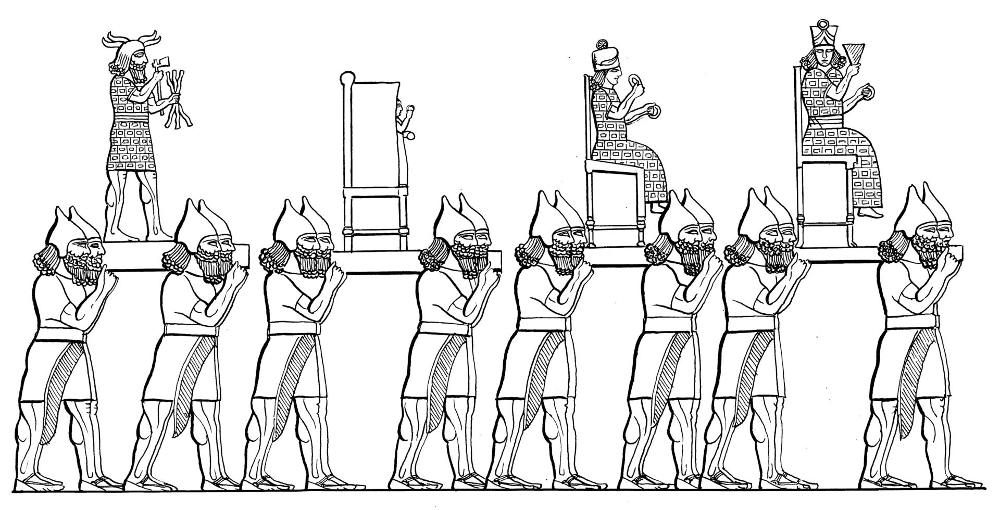

# Human-made Things in the Bible

## License Information

Human-made Things in the Bible © United Bible Societies, 2025. Adapted from: <cite>The Works of Their Hands: Man-made Things in the Bible</cite>, by Ray Pritz © 2009 United Bible Societies. This work is licensed under Creative Commons Attribution-ShareAlike 4.0 International (<a href="https://creativecommons.org/licenses/by-sa/4.0/">https://creativecommons.org/licenses/by-sa/4.0/</a>).

--------------------------------

## Idols (id: REALIA:4.6)

4\.6 Idols
==========

References:
-----------

Hebrew אֱלִיל (’elil)

[LEV 19:4](https://ref.ly/Lev19:4), [LEV 26:1](https://ref.ly/Lev26:1), [1CH 16:26](https://ref.ly/1Chr16:26), [PSA 96:5](https://ref.ly/Ps96:5), [PSA 97:7](https://ref.ly/Ps97:7), [ISA 2:8](https://ref.ly/Isa2:8), [ISA 2:18](https://ref.ly/Isa2:18), [ISA 2:20](https://ref.ly/Isa2:20), [ISA 2:20](https://ref.ly/Isa2:20), [ISA 10:10](https://ref.ly/Isa10:10), [ISA 10:11](https://ref.ly/Isa10:11), [ISA 19:1](https://ref.ly/Isa19:1), [ISA 19:3](https://ref.ly/Isa19:3), [ISA 31:7](https://ref.ly/Isa31:7), [ISA 31:7](https://ref.ly/Isa31:7), [EZK 30:13](https://ref.ly/Ezek30:13), [HAB 2:18](https://ref.ly/Hab2:18)

Hebrew גִּלּוּל (gilul)

[LEV 26:30](https://ref.ly/Lev26:30), [DEU 29:16](https://ref.ly/Deut29:16), [1KI 15:12](https://ref.ly/1Kgs15:12), [1KI 21:26](https://ref.ly/1Kgs21:26), [2KI 17:12](https://ref.ly/2Kgs17:12), [2KI 21:11](https://ref.ly/2Kgs21:11), [2KI 21:21](https://ref.ly/2Kgs21:21), [2KI 23:24](https://ref.ly/2Kgs23:24), [JER 50:2](https://ref.ly/Jer50:2), [EZK 6:4](https://ref.ly/Ezek6:4), [EZK 6:5](https://ref.ly/Ezek6:5), [EZK 6:6](https://ref.ly/Ezek6:6), [EZK 6:9](https://ref.ly/Ezek6:9), [EZK 6:13](https://ref.ly/Ezek6:13), [EZK 6:13](https://ref.ly/Ezek6:13), [EZK 8:10](https://ref.ly/Ezek8:10), [EZK 14:3](https://ref.ly/Ezek14:3), [EZK 14:4](https://ref.ly/Ezek14:4), [EZK 14:4](https://ref.ly/Ezek14:4), [EZK 14:5](https://ref.ly/Ezek14:5), [EZK 14:6](https://ref.ly/Ezek14:6), [EZK 14:7](https://ref.ly/Ezek14:7), [EZK 16:36](https://ref.ly/Ezek16:36), [EZK 18:6](https://ref.ly/Ezek18:6), [EZK 18:12](https://ref.ly/Ezek18:12), [EZK 18:15](https://ref.ly/Ezek18:15), [EZK 20:7](https://ref.ly/Ezek20:7), [EZK 20:8](https://ref.ly/Ezek20:8), [EZK 20:16](https://ref.ly/Ezek20:16), [EZK 20:18](https://ref.ly/Ezek20:18), [EZK 20:24](https://ref.ly/Ezek20:24), [EZK 20:31](https://ref.ly/Ezek20:31), [EZK 20:39](https://ref.ly/Ezek20:39), [EZK 20:39](https://ref.ly/Ezek20:39), [EZK 22:3](https://ref.ly/Ezek22:3), [EZK 22:4](https://ref.ly/Ezek22:4), [EZK 23:7](https://ref.ly/Ezek23:7), [EZK 23:30](https://ref.ly/Ezek23:30), [EZK 23:37](https://ref.ly/Ezek23:37), [EZK 23:39](https://ref.ly/Ezek23:39), [EZK 23:49](https://ref.ly/Ezek23:49), [EZK 30:13](https://ref.ly/Ezek30:13), [EZK 33:25](https://ref.ly/Ezek33:25), [EZK 36:18](https://ref.ly/Ezek36:18), [EZK 36:25](https://ref.ly/Ezek36:25), [EZK 37:23](https://ref.ly/Ezek37:23), [EZK 44:10](https://ref.ly/Ezek44:10), [EZK 44:12](https://ref.ly/Ezek44:12)

Hebrew חַמָּן (chaman)

[LEV 26:30](https://ref.ly/Lev26:30), [2CH 14:4](https://ref.ly/2Chr14:4), [2CH 34:4](https://ref.ly/2Chr34:4), [2CH 34:7](https://ref.ly/2Chr34:7), [ISA 17:8](https://ref.ly/Isa17:8), [ISA 27:9](https://ref.ly/Isa27:9), [EZK 6:4](https://ref.ly/Ezek6:4), [EZK 6:6](https://ref.ly/Ezek6:6)

Hebrew סֶמֶל (semel)

[2CH 33:7](https://ref.ly/2Chr33:7), [2CH 33:15](https://ref.ly/2Chr33:15), [EZK 8:3](https://ref.ly/Ezek8:3), [EZK 8:5](https://ref.ly/Ezek8:5)

Hebrew צִיר (tsir)

[ISA 45:16](https://ref.ly/Isa45:16)

Hebrew צֶלֶם (tselem)

[NUM 33:52](https://ref.ly/Num33:52), [2KI 11:18](https://ref.ly/2Kgs11:18), [2CH 23:17](https://ref.ly/2Chr23:17), [EZK 7:20](https://ref.ly/Ezek7:20), [EZK 16:17](https://ref.ly/Ezek16:17), [EZK 23:14](https://ref.ly/Ezek23:14), [AMO 5:26](https://ref.ly/Amos5:26)

Hebrew תַבְנִית (tavnith)

[PSA 106:20](https://ref.ly/Ps106:20)

Greek ἄγαλμα (agalma)

[2MA 2:2](https://ref.ly/2Macc2:2)

Greek εἴδωλον (eidōlon)

[ACT 7:41](https://ref.ly/Acts7:41), [ACT 15:20](https://ref.ly/Acts15:20), [ROM 2:22](https://ref.ly/Rom2:22), [1CO 8:4](https://ref.ly/1Cor8:4), [1CO 8:7](https://ref.ly/1Cor8:7), [1CO 10:19](https://ref.ly/1Cor10:19), [1CO 12:2](https://ref.ly/1Cor12:2), [2CO 6:16](https://ref.ly/2Cor6:16), [1TH 1:9](https://ref.ly/1Thess1:9), [1JN 5:21](https://ref.ly/1John5:21), [REV 9:20](https://ref.ly/Rev9:20), [TOB 14:6](https://ref.ly/Tob14:6), [ESG 4:17](https://ref.ly/EsthGr4:17), [WIS 14:11](https://ref.ly/Wis14:11), [WIS 14:12](https://ref.ly/Wis14:12), [WIS 14:27](https://ref.ly/Wis14:27), [WIS 14:29](https://ref.ly/Wis14:29), [WIS 14:30](https://ref.ly/Wis14:30), [WIS 15:15](https://ref.ly/Wis15:15), [SIR 30:19](https://ref.ly/Sir30:19), [LJE 1:72](https://ref.ly/EpJer1:72), [BEL 1:3](https://ref.ly/Bel1:3), [BEL 1:5](https://ref.ly/Bel1:5), [1MA 1:43](https://ref.ly/1Macc1:43), [1MA 3:48](https://ref.ly/1Macc3:48), [1MA 13:47](https://ref.ly/1Macc13:47), [2MA 12:40](https://ref.ly/2Macc12:40), [3MA 4:16](https://ref.ly/3Macc4:16), [ODA 2:21](https://ref.ly/Odes2:21)

Greek εἰκών (eikōn)

[ROM 1:23](https://ref.ly/Rom1:23), [REV 13:14](https://ref.ly/Rev13:14), [REV 13:15](https://ref.ly/Rev13:15), [REV 13:15](https://ref.ly/Rev13:15), [REV 13:15](https://ref.ly/Rev13:15), [REV 14:9](https://ref.ly/Rev14:9), [REV 14:11](https://ref.ly/Rev14:11), [REV 15:2](https://ref.ly/Rev15:2), [REV 16:2](https://ref.ly/Rev16:2), [REV 19:20](https://ref.ly/Rev19:20), [REV 20:4](https://ref.ly/Rev20:4), [WIS 13:13](https://ref.ly/Wis13:13), [WIS 13:16](https://ref.ly/Wis13:16), [WIS 14:15](https://ref.ly/Wis14:15), [WIS 14:17](https://ref.ly/Wis14:17), [WIS 15:5](https://ref.ly/Wis15:5)

Greek κατείδωλος (kateidōlos)

[ACT 17:16](https://ref.ly/Acts17:16)

Greek τύπος (tupos)

[ACT 7:43](https://ref.ly/Acts7:43)

Greek χάραγμα (charagma)

[ACT 17:29](https://ref.ly/Acts17:29)

Latin idolum

[2ES 16:69](https://ref.ly/2Esd16:69)

References:
-----------

### **Statue, image**:

Aramaic צְלֵם (tselem)

[DAN 2:31](https://ref.ly/Dan2:31), [DAN 2:31](https://ref.ly/Dan2:31), [DAN 2:32](https://ref.ly/Dan2:32), [DAN 2:34](https://ref.ly/Dan2:34), [DAN 2:35](https://ref.ly/Dan2:35), [DAN 3:1](https://ref.ly/Dan3:1), [DAN 3:2](https://ref.ly/Dan3:2), [DAN 3:3](https://ref.ly/Dan3:3), [DAN 3:3](https://ref.ly/Dan3:3), [DAN 3:5](https://ref.ly/Dan3:5), [DAN 3:7](https://ref.ly/Dan3:7), [DAN 3:10](https://ref.ly/Dan3:10), [DAN 3:12](https://ref.ly/Dan3:12), [DAN 3:14](https://ref.ly/Dan3:14), [DAN 3:15](https://ref.ly/Dan3:15), [DAN 3:18](https://ref.ly/Dan3:18), [DAN 3:19](https://ref.ly/Dan3:19)

Description and usage:
----------------------

*Clay goddess idols (Gary Todd, Israel Museum, CC0, via Wikimedia Commons)*

The idol was an artifact that was made to represent a god as an object of worship. Idols took many forms and were made in many sizes, from smaller than a finger to several meters high. They most frequently were shaped like a human figure, but they often took the form of some animal or bird or even a combination of human and animal.

---

Translation:
------------

Hebrew אָוֶן (’awen (meaning “trouble, wickedness”))

[ISA 66:3](https://ref.ly/Isa66:3)

Hebrew גִּלּוּל (gilul (“lifeless \[rolling] thing, dung”))

[LEV 26:30](https://ref.ly/Lev26:30), [DEU 29:16](https://ref.ly/Deut29:16), [1KI 15:12](https://ref.ly/1Kgs15:12), [1KI 21:26](https://ref.ly/1Kgs21:26), [2KI 17:12](https://ref.ly/2Kgs17:12), [2KI 21:11](https://ref.ly/2Kgs21:11), [2KI 21:21](https://ref.ly/2Kgs21:21), [2KI 23:24](https://ref.ly/2Kgs23:24), [JER 50:2](https://ref.ly/Jer50:2), [EZK 6:4](https://ref.ly/Ezek6:4), [EZK 6:5](https://ref.ly/Ezek6:5), [EZK 6:6](https://ref.ly/Ezek6:6), [EZK 6:9](https://ref.ly/Ezek6:9), [EZK 6:13](https://ref.ly/Ezek6:13), [EZK 6:13](https://ref.ly/Ezek6:13), [EZK 8:10](https://ref.ly/Ezek8:10), [EZK 14:3](https://ref.ly/Ezek14:3), [EZK 14:4](https://ref.ly/Ezek14:4), [EZK 14:4](https://ref.ly/Ezek14:4), [EZK 14:5](https://ref.ly/Ezek14:5), [EZK 14:6](https://ref.ly/Ezek14:6), [EZK 14:7](https://ref.ly/Ezek14:7), [EZK 16:36](https://ref.ly/Ezek16:36), [EZK 18:6](https://ref.ly/Ezek18:6), [EZK 18:12](https://ref.ly/Ezek18:12), [EZK 18:15](https://ref.ly/Ezek18:15), [EZK 20:7](https://ref.ly/Ezek20:7), [EZK 20:8](https://ref.ly/Ezek20:8), [EZK 20:16](https://ref.ly/Ezek20:16), [EZK 20:18](https://ref.ly/Ezek20:18), [EZK 20:24](https://ref.ly/Ezek20:24), [EZK 20:31](https://ref.ly/Ezek20:31), [EZK 20:39](https://ref.ly/Ezek20:39), [EZK 20:39](https://ref.ly/Ezek20:39), [EZK 22:3](https://ref.ly/Ezek22:3), [EZK 22:4](https://ref.ly/Ezek22:4), [EZK 23:7](https://ref.ly/Ezek23:7), [EZK 23:30](https://ref.ly/Ezek23:30), [EZK 23:37](https://ref.ly/Ezek23:37), [EZK 23:39](https://ref.ly/Ezek23:39), [EZK 23:49](https://ref.ly/Ezek23:49), [EZK 30:13](https://ref.ly/Ezek30:13), [EZK 33:25](https://ref.ly/Ezek33:25), [EZK 36:18](https://ref.ly/Ezek36:18), [EZK 36:25](https://ref.ly/Ezek36:25), [EZK 37:23](https://ref.ly/Ezek37:23), [EZK 44:10](https://ref.ly/Ezek44:10), [EZK 44:12](https://ref.ly/Ezek44:12)

Hebrew הֶבֶל (hevel (“vain thing”))

[DEU 32:21](https://ref.ly/Deut32:21), [1KI 16:13](https://ref.ly/1Kgs16:13), [1KI 16:26](https://ref.ly/1Kgs16:26), [2KI 17:15](https://ref.ly/2Kgs17:15), [PSA 31:7](https://ref.ly/Ps31:7), [JER 8:19](https://ref.ly/Jer8:19), [JER 10:8](https://ref.ly/Jer10:8), [JON 2:9](https://ref.ly/Jonah2:9)

Hebrew מִפְלֶצֶת (mifletseth (“horrible thing”))

[1KI 15:13](https://ref.ly/1Kgs15:13), [1KI 15:13](https://ref.ly/1Kgs15:13), [2CH 15:16](https://ref.ly/2Chr15:16), [2CH 15:16](https://ref.ly/2Chr15:16)

Hebrew עָצָב, עצב (‘atsav (“grief, pain”; noun or verb))

[1SA 31:9](https://ref.ly/1Sam31:9), [2SA 5:21](https://ref.ly/2Sam5:21), [1CH 10:9](https://ref.ly/1Chr10:9), [2CH 24:18](https://ref.ly/2Chr24:18), [PSA 106:36](https://ref.ly/Ps106:36), [PSA 106:38](https://ref.ly/Ps106:38), [PSA 115:4](https://ref.ly/Ps115:4), [PSA 135:15](https://ref.ly/Ps135:15), [ISA 10:11](https://ref.ly/Isa10:11), [ISA 46:1](https://ref.ly/Isa46:1), [JER 44:19](https://ref.ly/Jer44:19), [JER 50:2](https://ref.ly/Jer50:2), [HOS 4:17](https://ref.ly/Hos4:17), [HOS 8:4](https://ref.ly/Hos8:4), [HOS 13:2](https://ref.ly/Hos13:2), [HOS 14:9](https://ref.ly/Hos14:9), [MIC 1:7](https://ref.ly/Mic1:7), [ZEC 13:2](https://ref.ly/Zech13:2)

Hebrew עֹצֶב (‘otsev (“grief, pain”))

[ISA 48:5](https://ref.ly/Isa48:5)

Hebrew עֵצָה (‘etsah (“disobedience, rebellion”))

[HOS 10:6](https://ref.ly/Hos10:6)

Hebrew שִׁקּוּץ (shiquts (“detested thing”))

[DEU 29:16](https://ref.ly/Deut29:16), [1KI 11:5](https://ref.ly/1Kgs11:5), [1KI 11:7](https://ref.ly/1Kgs11:7), [1KI 11:7](https://ref.ly/1Kgs11:7), [2KI 23:13](https://ref.ly/2Kgs23:13), [2KI 23:13](https://ref.ly/2Kgs23:13), [2CH 15:8](https://ref.ly/2Chr15:8), [JER 4:1](https://ref.ly/Jer4:1), [JER 7:30](https://ref.ly/Jer7:30), [JER 13:27](https://ref.ly/Jer13:27), [JER 16:18](https://ref.ly/Jer16:18), [JER 32:34](https://ref.ly/Jer32:34), [EZK 5:11](https://ref.ly/Ezek5:11), [EZK 7:20](https://ref.ly/Ezek7:20), [EZK 11:18](https://ref.ly/Ezek11:18), [EZK 11:21](https://ref.ly/Ezek11:21), [EZK 20:8](https://ref.ly/Ezek20:8), [EZK 20:30](https://ref.ly/Ezek20:30)

*Men carrying idols (© Deutsche Bibelgesellschaft, Stuttgart by United Bible Societies)*

Though the existence of idols and corresponding terms for them are widespread, idols are by no means universal. Therefore it may be necessary in some languages to employ some type of descriptive equivalent for “idols,” for example, “objects that are made to look like gods” or “carved statues that represent gods.”

In some languages it may be necessary to specify the material from which an idol is made. The idols mentioned in the Bible were made from a variety of materials, including stone, clay, metal, and wood.

In the Old Testament, idols are often not named as such but rather are called by a wide variety of pejorative terms indicating such things as “iniquity,” “terror,” “grief,” and “horror.” Most translations will render these words as “idol,” even though the word idol is only implied. For example, [JER 50:38](https://ref.ly/Jer50:38) uses the Hebrew word *’eymim*, which means “terrors,” so the last half of this verse is literally “For it is a land of idols, and they go crazy with the terrors.” Here NRSV (New Revised Standard Version (1989)) has “For it is a land of images, and they go mad over idols.” GNT (Good News Translation (1992)) says “Babylonia is a land of terrifying idols that have made fools of the people.” Other Hebrew words used to refer to idols in a negative way are the following:

While it is possible to translate most of these terms simply as “idol,” the negative sense of the Hebrew will be better rendered by adding an appropriate modifier such as “disgusting,” “detestable,” or “filthy.”

The exact meaning of the Hebrew word *chaman* (which always appears in the plural, *chamanim*) is uncertain. The form of the word is similar to a Hebrew word for the sun, and so some have understood it to be an idol or sacred pillar to the sun god (Mft (Moffatt Translation (1926)) “sun\-pillars”; see [4\.6\.6 Sacred pillar, sacred stone, memorial stone\<REALIA:4\.6\.6\>](#)). Most translations prefer “incense altars” (RSV (Revised Standard Version (1952)), GNT (Good News Translation (1992)), NIV (New International Version (1984))) or “incense stands” (NJPSV (New Jewish Publication Society Version)).

The Greek words *eikōn*, *tupos*, and *charagma* primarily refer to a likeness or a resemblance, so in [MAT 22:20](https://ref.ly/Matt22:20)CEV (Contemporary English Version) renders *eikōn* simply as “picture.” When these words refer to the likeness of a god (for example, in [ACT 7:43](https://ref.ly/Acts7:43) and [ROM 1:23](https://ref.ly/Rom1:23)), they may be rendered in the same way as the Greek word *eidōlon*, which means “idol.”

The technical distinction between a statue or an image and an idol is that a statue may merely represent a supernatural being, while an idol not only represents such a being but is also believed to possess certain inherent supernatural powers. Statues often become idols when they are assumed to possess such powers in and of themselves rather than being mere representations of some supernatural entity. If, for example, various images of a particular supernatural being are believed to have different healing powers, then what began merely as images or representations of a supernatural power have become idols since the different images themselves have acquired special power. In other words, an “image” becomes an “idol” when people relate to it as a god.

The following discussion on [LEV 26:1](https://ref.ly/Lev26:1) from *A Handbook on Leviticus* (pages 401–402\) may prove helpful in distinguishing between different kinds of idols:

This verse contains four different words or expressions referring to false gods (or attempts to represent the deity in physical form) that are forbidden to the people of Israel. In some languages it may be difficult to find four different synonymous terms, but an effort should be made to do so if possible:

(1\) **\\\+u Idols\\\+u\***: the root of the word thus translated \[*’elil* in Hebrew] really means “worthless; insufficient; inadequate.” NAB (New American Bible (1970)) translates it “false gods,” while Mft (Moffatt Translation (1926)) has “unreal gods.” In some languages it may be best translated “worthless (or, useless) things \[used for worship].”

(2\) **\\\+u Graven image\\\+u\***: this \[*pesel* in Hebrew; see [4\.6\.2 Graven (stone) image\<REALIA:4\.6\.2\>](#) ] refers to something fashioned into the shape of an object, animal, or a person. It may be made of stone, clay, wood, or metal. According to the context here, the purpose of making such a likeness was to provide an object that could be worshiped. It may be rendered “carved out to look like something,” or “made to resemble something living,” or something similar.

(3\) **\\\+u Pillar\\\+u\***: this \[*matsevah* in Hebrew; see [4\.6\.6 Sacred pillar, sacred stone, memorial stone\<REALIA:4\.6\.6\>](#) ] probably refers to a long stone that was made to stand up by itself and served as an object of worship. It is the same term used in [GEN 28:18](https://ref.ly/Gen28:18) and [EXO 24:4](https://ref.ly/Exod24:4), when such objects were apparently acceptable in Hebrew worship. NEB (New English Bible (1970)) has “sacred pillars,” and JB (Jerusalem Bible (1966)) translates “standing\-stone,” but NJB (New Jerusalem Bible (1985)) changes this to “cultic stones.”

(4\) **\\\+u Figured stone\\\+u\***: compare [NUM 33:52](https://ref.ly/Num33:52). It is uncertain exactly what this \[*’even maskith* in Hebrew] refers to. The root meaning of the word has to do with the verb “to look.” Some commentators therefore take it to refer to some sort of remarkable stone or mosaic at which people look with adoration. However, most English versions take it to refer to a stone that has been carved or shaped by human efforts to look like an object of worship.

[DAN 3:1–DAN 3:18](https://ref.ly/Dan3:1-Dan3:18): According to some commentators, the proportions of the “image” or “statue” mentioned in this passage suggest that it was probably a sort of symbolic column rather than an exact representation of a human or divine figure, and that perhaps some carving on the column pictured the features of a person, whether human or divine. But others feel that it must have had the shape of human features. The church fathers thought it may have been an image of a king who was considered a god, and several modern commentators think it may have been a representation of a Babylonian god; but the information given in verses 12, 14 and 18 does not really make it possible to decide one way or another. If a language has a word for symbolic representation rather than exact likeness, then this word should probably be used in translation here rather than the other one.

[2MA 2:2](https://ref.ly/2Macc2:2): The Greek word *agalma* literally means “image” or “statue,” which is the rendering in some translations (NRSV (New Revised Standard Version (1989)), NJB (New Jerusalem Bible (1985))). Others (GNT (Good News Translation (1992)), NAB (New American Bible (1970)), ITCL (Italian Common Language Version)) prefer “idol,” which seems to be indicated by the context.

* **Associated Passages:** Leviticus 19:4; Leviticus 26:1; 1 Chronicles 16:26; Psalms 96:5; Psalms 97:7; Isaiah 2:8; Isaiah 2:18; Isaiah 2:20; Isaiah 10:10; Isaiah 10:11; Isaiah 19:1; Isaiah 19:3; Isaiah 31:7; Ezekiel 30:13; Habakkuk 2:18; Leviticus 26:30; Deuteronomy 29:16; 1 Kings 15:12; 1 Kings 21:26; 2 Kings 17:12; 2 Kings 21:11; 2 Kings 21:21; 2 Kings 23:24; Jeremiah 50:2; Ezekiel 6:4; Ezekiel 6:5; Ezekiel 6:6; Ezekiel 6:9; Ezekiel 6:13; Ezekiel 8:10; Ezekiel 14:3; Ezekiel 14:4; Ezekiel 14:5; Ezekiel 14:6; Ezekiel 14:7; Ezekiel 16:36; Ezekiel 18:6; Ezekiel 18:12; Ezekiel 18:15; Ezekiel 20:7; Ezekiel 20:8; Ezekiel 20:16; Ezekiel 20:18; Ezekiel 20:24; Ezekiel 20:31; Ezekiel 20:39; Ezekiel 22:3; Ezekiel 22:4; Ezekiel 23:7; Ezekiel 23:30; Ezekiel 23:37; Ezekiel 23:39; Ezekiel 23:49; Ezekiel 33:25; Ezekiel 36:18; Ezekiel 36:25; Ezekiel 37:23; Ezekiel 44:10; Ezekiel 44:12; 2 Chronicles 14:4; 2 Chronicles 34:4; 2 Chronicles 34:7; Isaiah 17:8; Isaiah 27:9; 2 Chronicles 33:7; 2 Chronicles 33:15; Ezekiel 8:3; Ezekiel 8:5; Isaiah 45:16; Numbers 33:52; 2 Kings 11:18; 2 Chronicles 23:17; Ezekiel 7:20; Ezekiel 16:17; Ezekiel 23:14; Amos 5:26; Psalms 106:20; 2 Maccabees 2:2; Acts 7:41; Acts 15:20; Romans 2:22; 1 Corinthians 8:4; 1 Corinthians 8:7; 1 Corinthians 10:19; 1 Corinthians 12:2; 2 Corinthians 6:16; 1 Thessalonians 1:9; 1 John 5:21; Revelation 9:20; Tobit 14:6; Esther Greek 4:17; Wisdom of Solomon 14:11; Wisdom of Solomon 14:12; Wisdom of Solomon 14:27; Wisdom of Solomon 14:29; Wisdom of Solomon 14:30; Wisdom of Solomon 15:15; Sirach 30:19; Letter of Jeremiah 1:72; Bel and the Dragon 1:3; Bel and the Dragon 1:5; 1 Maccabees 1:43; 1 Maccabees 3:48; 1 Maccabees 13:47; 2 Maccabees 12:40; 3 Maccabees 4:16; Odae/Odes 2:21; Romans 1:23; Revelation 13:14; Revelation 13:15; Revelation 14:9; Revelation 14:11; Revelation 15:2; Revelation 16:2; Revelation 19:20; Revelation 20:4; Wisdom of Solomon 13:13; Wisdom of Solomon 13:16; Wisdom of Solomon 14:15; Wisdom of Solomon 14:17; Wisdom of Solomon 15:5; Acts 17:16; Acts 7:43; Acts 17:29; 2 Esdras (Latin) 16:69; Daniel 2:31; Daniel 2:32; Daniel 2:34; Daniel 2:35; Daniel 3:1; Daniel 3:2; Daniel 3:3; Daniel 3:5; Daniel 3:7; Daniel 3:10; Daniel 3:12; Daniel 3:14; Daniel 3:15; Daniel 3:18; Daniel 3:19; Isaiah 66:3; Deuteronomy 32:21; 1 Kings 16:13; 1 Kings 16:26; 2 Kings 17:15; Psalms 31:7; Jeremiah 8:19; Jeremiah 10:8; Jonah 2:9; 1 Kings 15:13; 2 Chronicles 15:16; 1 Samuel 31:9; 2 Samuel 5:21; 1 Chronicles 10:9; 2 Chronicles 24:18; Psalms 106:36; Psalms 106:38; Psalms 115:4; Psalms 135:15; Isaiah 46:1; Jeremiah 44:19; Hosea 4:17; Hosea 8:4; Hosea 13:2; Hosea 14:9; Micah 1:7; Zechariah 13:2; Isaiah 48:5; Hosea 10:6; 1 Kings 11:5; 1 Kings 11:7; 2 Kings 23:13; 2 Chronicles 15:8; Jeremiah 4:1; Jeremiah 7:30; Jeremiah 13:27; Jeremiah 16:18; Jeremiah 32:34; Ezekiel 5:11; Ezekiel 11:18; Ezekiel 11:21; Ezekiel 20:30; Jeremiah 50:38; Matthew 22:20; Genesis 28:18; Exodus 24:4

* **Associated ACAI Concepts:** Image (ID: `realia:Image`); Detested Thing (ID: `keyterm:DetestedThing`); Idol (ID: `keyterm:Idol`)
