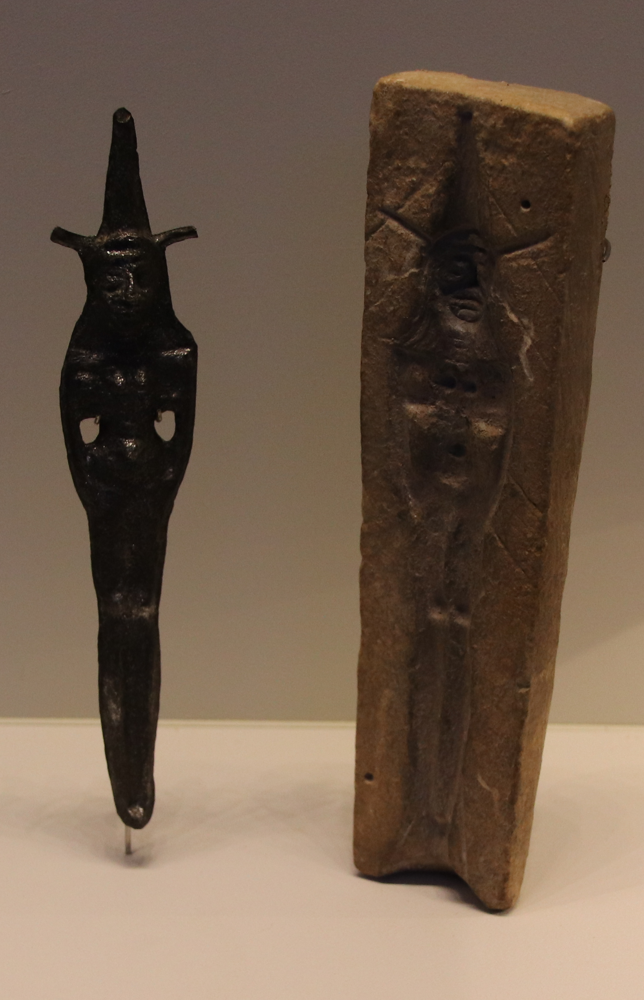

# Human-made Things in the Bible

## License Information

Human-made Things in the Bible © United Bible Societies, 2025. Adapted from: <cite>The Works of Their Hands: Man-made Things in the Bible</cite>, by Ray Pritz © 2009 United Bible Societies. This work is licensed under Creative Commons Attribution-ShareAlike 4.0 International (<a href="https://creativecommons.org/licenses/by-sa/4.0/">https://creativecommons.org/licenses/by-sa/4.0/</a>).

--------------------------------

## Teraphim, household idol (id: REALIA:4.6.1)

4\.6\.1 Teraphim, household idol
================================

References:
-----------

Hebrew תְּרָפִים (trafim)

[GEN 31:19](https://ref.ly/Gen31:19), [GEN 31:34](https://ref.ly/Gen31:34), [GEN 31:35](https://ref.ly/Gen31:35), [JDG 17:5](https://ref.ly/Judg17:5), [JDG 18:14](https://ref.ly/Judg18:14), [JDG 18:18](https://ref.ly/Judg18:18), [JDG 18:20](https://ref.ly/Judg18:20), [1SA 15:23](https://ref.ly/1Sam15:23), [1SA 19:13](https://ref.ly/1Sam19:13), [1SA 19:16](https://ref.ly/1Sam19:16), [2KI 23:24](https://ref.ly/2Kgs23:24), [EZK 21:26](https://ref.ly/Ezek21:26), [HOS 3:4](https://ref.ly/Hos3:4), [ZEC 10:2](https://ref.ly/Zech10:2)

Description:
------------

*A teraphim with its mold (Gary Todd, Israel Museum, CC0, via Wikimedia Commons)*

A teraphim was a sculpted or molten figure representing a god. Its size could vary considerably, from quite small to almost the size of a man.

---

Translation:
------------

Teraphim played a role in acts of divination. The one who possessed them was usually recognized as the head of the household, with all of the rights that went with that position. By showing proper reverence to the household idols, the family expected to be rewarded with prosperity, health, plenty of food, and other necessities of home life.

Some cultures will know a similar kind of idol or representation of a local god, and the word for such an idol or representation may be used.

The Hebrew word *trafim* is evidently a kind of royal plural, used to speak of multiple idols but also of a single idol.

[GEN 31:19](https://ref.ly/Gen31:19): Translations use a variety of terms for the word *trafim* in this verse; for example, “household gods” (RSV (Revised Standard Version (1952)), GNT (Good News Translation (1992)), NIV (New International Version (1984))), “family idols” (SPCL (Spanish Common Language Version (Dios Habla Hoy))), and “small idols” (first edition of GECL (German Common Language Version (Gute Nachricht Bibel))). Some translations choose to use simply the generic term “idols” (NCV (New Century Version), ITCL (Italian Common Language Version), Septuagint), and this is the practice of many translations in most of the references listed above. CEV (Contemporary English Version) adds the following footnote: “*household idols*: These were thought to protect the household from danger. It is also possible that the person who had them would inherit the family property.”

[1SA 15:23](https://ref.ly/1Sam15:23): A few translations simply transliterate the word *trafim* here; for example, for the second line of this verse NJPSV (New Jewish Publication Society Version) has “Defiance, like the iniquity of teraphim.” However, most translations understand *trafim* to refer to idol worship in general. NIV (New International Version (1984)) has “and arrogance like the evil of idolatry,” and NCV (New Century Version) says “Pride is as bad as the sin of worshiping idols.”

[1SA 19:13](https://ref.ly/1Sam19:13): Even though there seems to be only one idol involved in the story here, the Hebrew word *trafim* in this verse is still in the plural, as it always is in the Bible. The idol in this instance was big enough that Michal thought it would fool Saul’s men into thinking that it was a grown man. For this reason CEV (Contemporary English Version) says “statue,” although most translations consulted prefer a word that indicates that it was an object involved in pagan worship. ITCL (Italian Common Language Version) includes both elements with “statue of an idol,” while GECL (German Common Language Version (Gute Nachricht Bibel)) has “carved figure of the household god.”

* **Associated Passages:** Genesis 31:19; Genesis 31:34; Genesis 31:35; Judges 17:5; Judges 18:14; Judges 18:18; Judges 18:20; 1 Samuel 15:23; 1 Samuel 19:13; 1 Samuel 19:16; 2 Kings 23:24; Ezekiel 21:26; Hosea 3:4; Zechariah 10:2

