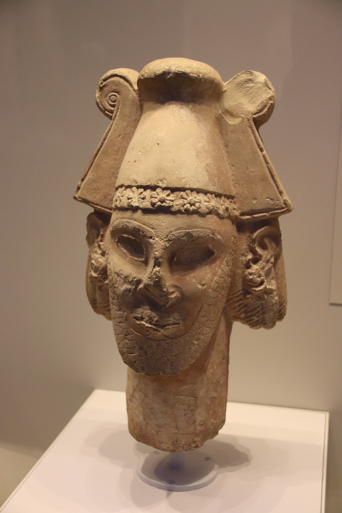

# Human-made Things in the Bible

## License Information

Human-made Things in the Bible © United Bible Societies, 2025. Adapted from: <cite>The Works of Their Hands: Man-made Things in the Bible</cite>, by Ray Pritz © 2009 United Bible Societies. This work is licensed under Creative Commons Attribution-ShareAlike 4.0 International (<a href="https://creativecommons.org/licenses/by-sa/4.0/">https://creativecommons.org/licenses/by-sa/4.0/</a>).

--------------------------------

## Graven (stone) image (id: REALIA:4.6.2)

4\.6\.2 Graven (stone) image
============================

References:
-----------

Hebrew אֶבֶן, מַשְׂכִּית (’even maskith)

[LEV 26:1](https://ref.ly/Lev26:1), [NUM 33:52](https://ref.ly/Num33:52)

Hebrew פָּסִיל (pasil)

[DEU 7:5](https://ref.ly/Deut7:5), [DEU 7:25](https://ref.ly/Deut7:25), [DEU 12:3](https://ref.ly/Deut12:3), [JDG 3:19](https://ref.ly/Judg3:19), [JDG 3:26](https://ref.ly/Judg3:26), [2KI 17:41](https://ref.ly/2Kgs17:41), [2CH 33:19](https://ref.ly/2Chr33:19), [2CH 33:22](https://ref.ly/2Chr33:22), [2CH 34:4](https://ref.ly/2Chr34:4), [2CH 34:7](https://ref.ly/2Chr34:7), [PSA 78:58](https://ref.ly/Ps78:58), [ISA 10:10](https://ref.ly/Isa10:10), [ISA 21:9](https://ref.ly/Isa21:9), [ISA 30:22](https://ref.ly/Isa30:22), [ISA 42:8](https://ref.ly/Isa42:8), [JER 8:19](https://ref.ly/Jer8:19), [JER 50:38](https://ref.ly/Jer50:38), [JER 51:47](https://ref.ly/Jer51:47), [JER 51:52](https://ref.ly/Jer51:52), [HOS 11:2](https://ref.ly/Hos11:2), [MIC 1:7](https://ref.ly/Mic1:7), [MIC 5:12](https://ref.ly/Mic5:12)

Hebrew פֶּסֶל (pesel)

[EXO 20:4](https://ref.ly/Exod20:4), [LEV 26:1](https://ref.ly/Lev26:1), [DEU 4:16](https://ref.ly/Deut4:16), [DEU 4:23](https://ref.ly/Deut4:23), [DEU 4:25](https://ref.ly/Deut4:25), [DEU 5:8](https://ref.ly/Deut5:8), [DEU 27:15](https://ref.ly/Deut27:15), [JDG 17:3](https://ref.ly/Judg17:3), [JDG 17:4](https://ref.ly/Judg17:4), [JDG 18:14](https://ref.ly/Judg18:14), [JDG 18:17](https://ref.ly/Judg18:17), [JDG 18:18](https://ref.ly/Judg18:18), [JDG 18:20](https://ref.ly/Judg18:20), [JDG 18:30](https://ref.ly/Judg18:30), [JDG 18:31](https://ref.ly/Judg18:31), [2KI 21:7](https://ref.ly/2Kgs21:7), [2CH 33:7](https://ref.ly/2Chr33:7), [PSA 97:7](https://ref.ly/Ps97:7), [ISA 40:19](https://ref.ly/Isa40:19), [ISA 40:20](https://ref.ly/Isa40:20), [ISA 42:17](https://ref.ly/Isa42:17), [ISA 44:9](https://ref.ly/Isa44:9), [ISA 44:10](https://ref.ly/Isa44:10), [ISA 44:15](https://ref.ly/Isa44:15), [ISA 44:17](https://ref.ly/Isa44:17), [ISA 45:20](https://ref.ly/Isa45:20), [ISA 48:5](https://ref.ly/Isa48:5), [JER 10:14](https://ref.ly/Jer10:14), [JER 51:17](https://ref.ly/Jer51:17), [NAM 1:14](https://ref.ly/Nah1:14), [HAB 2:18](https://ref.ly/Hab2:18)

Greek γλυπτός (gluptos)

[WIS 14:17](https://ref.ly/Wis14:17), [WIS 15:13](https://ref.ly/Wis15:13), [1MA 5:68](https://ref.ly/1Macc5:68)

Description:
------------

*Head of Ammonite deity (late 8th c. BCE) (Gary Todd, Israel Museum, CC0, via Wikimedia Commons)*

The graven image was an idol carved out of wood or, sometimes, stone. The sizes and shapes of these images could vary greatly.

---

Translation:
------------

These images were formed by carving or sculpting. For other translation considerations, see [4\.6\.3 Molten image\<REALIA:4\.6\.3\>](#).

* **Associated Passages:** Leviticus 26:1; Numbers 33:52; Deuteronomy 7:5; Deuteronomy 7:25; Deuteronomy 12:3; Judges 3:19; Judges 3:26; 2 Kings 17:41; 2 Chronicles 33:19; 2 Chronicles 33:22; 2 Chronicles 34:4; 2 Chronicles 34:7; Psalms 78:58; Isaiah 10:10; Isaiah 21:9; Isaiah 30:22; Isaiah 42:8; Jeremiah 8:19; Jeremiah 50:38; Jeremiah 51:47; Jeremiah 51:52; Hosea 11:2; Micah 1:7; Micah 5:12; Exodus 20:4; Deuteronomy 4:16; Deuteronomy 4:23; Deuteronomy 4:25; Deuteronomy 5:8; Deuteronomy 27:15; Judges 17:3; Judges 17:4; Judges 18:14; Judges 18:17; Judges 18:18; Judges 18:20; Judges 18:30; Judges 18:31; 2 Kings 21:7; 2 Chronicles 33:7; Psalms 97:7; Isaiah 40:19; Isaiah 40:20; Isaiah 42:17; Isaiah 44:9; Isaiah 44:10; Isaiah 44:15; Isaiah 44:17; Isaiah 45:20; Isaiah 48:5; Jeremiah 10:14; Jeremiah 51:17; Nahum 1:14; Habakkuk 2:18; Wisdom of Solomon 14:17; Wisdom of Solomon 15:13; 1 Maccabees 5:68

