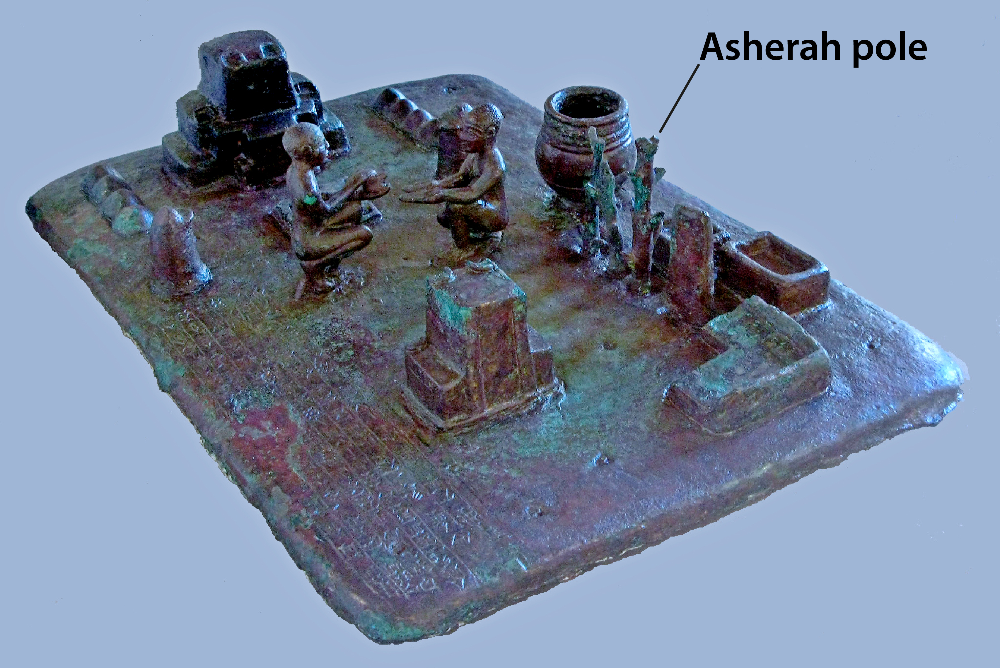

# Human-made Things in the Bible

## License Information

Human-made Things in the Bible © United Bible Societies, 2025. Adapted from: <cite>The Works of Their Hands: Man-made Things in the Bible</cite>, by Ray Pritz © 2009 United Bible Societies. This work is licensed under Creative Commons Attribution-ShareAlike 4.0 International (<a href="https://creativecommons.org/licenses/by-sa/4.0/">https://creativecommons.org/licenses/by-sa/4.0/</a>).

--------------------------------

## Asherah (id: REALIA:4.6.4)

4\.6\.4 Asherah
===============

References:
-----------

Hebrew אֲשֵׁרָה (’asherah)

[EXO 34:13](https://ref.ly/Exod34:13), [DEU 7:5](https://ref.ly/Deut7:5), [DEU 12:3](https://ref.ly/Deut12:3), [DEU 16:21](https://ref.ly/Deut16:21), [JDG 6:25](https://ref.ly/Judg6:25), [JDG 6:26](https://ref.ly/Judg6:26), [JDG 6:28](https://ref.ly/Judg6:28), [JDG 6:30](https://ref.ly/Judg6:30), [1KI 14:15](https://ref.ly/1Kgs14:15), [1KI 14:23](https://ref.ly/1Kgs14:23), [1KI 16:33](https://ref.ly/1Kgs16:33), [2KI 13:6](https://ref.ly/2Kgs13:6), [2KI 17:10](https://ref.ly/2Kgs17:10), [2KI 17:16](https://ref.ly/2Kgs17:16), [2KI 18:4](https://ref.ly/2Kgs18:4), [2KI 21:3](https://ref.ly/2Kgs21:3), [2KI 23:6](https://ref.ly/2Kgs23:6), [2KI 23:14](https://ref.ly/2Kgs23:14), [2KI 23:15](https://ref.ly/2Kgs23:15), [2CH 14:2](https://ref.ly/2Chr14:2), [2CH 17:6](https://ref.ly/2Chr17:6), [2CH 19:3](https://ref.ly/2Chr19:3), [2CH 24:18](https://ref.ly/2Chr24:18), [2CH 31:1](https://ref.ly/2Chr31:1), [2CH 33:3](https://ref.ly/2Chr33:3), [2CH 33:19](https://ref.ly/2Chr33:19), [2CH 34:4](https://ref.ly/2Chr34:4), [2CH 34:7](https://ref.ly/2Chr34:7), [ISA 17:8](https://ref.ly/Isa17:8), [ISA 27:9](https://ref.ly/Isa27:9), [JER 17:2](https://ref.ly/Jer17:2), [MIC 5:13](https://ref.ly/Mic5:13)

Description and usage:
----------------------

*Bronze model from Elam with a pole used as a cultic object for the goddess Asherah (© Louvre Museum, CC BY\-SA 2\.0, via Wikimedia Commons)*

The Asherah was a wooden pole used to worship the goddess Asherah.

---

Translation:
------------

Asherah was worshiped as the consort (wife) of the head of the gods. She was considered the mother of the gods, a symbol of fertility.

In the Old Testament the Hebrew word *’asherah* sometimes refers to the goddess Asherah and sometimes to the wooden cult\-object that was her symbol. In the former category are [JDG 3:7](https://ref.ly/Judg3:7); [1KI 15:13](https://ref.ly/1Kgs15:13); [1KI 18:19](https://ref.ly/1Kgs18:19); [2KI 21:7](https://ref.ly/2Kgs21:7); [2KI 23:4](https://ref.ly/2Kgs23:4); [2KI 23:7](https://ref.ly/2Kgs23:7); [2CH 15:16](https://ref.ly/2Chr15:16). In [1KI 15:13](https://ref.ly/1Kgs15:13)GNT (Good News Translation (1992)) expands “Asherah” to “the fertility goddess Asherah.” When the word *’asherah* refers to the wooden pole used for worshiping Asherah, it may be expanded to “image/idol of the goddess Asherah.” Another good model of expansion is CEV (Contemporary English Version) “sacred poles for worshiping the goddess Asherah” in [1KI 14:15](https://ref.ly/1Kgs14:15). CEV (Contemporary English Version) also adds the following note: “*sacred poles*: Or “trees,” used as symbols of Asherah, the goddess of fertility.” Scholars now believe that the Asherah was not exactly an image or statue of the goddess but rather a special wooden pole that symbolized her. For this reason GNT (Good News Translation (1992)) often says “symbol\[s] of the goddess Asherah” (see [EXO 34:13](https://ref.ly/Exod34:13); [DEU 16:21](https://ref.ly/Deut16:21)).

* **Associated Passages:** Exodus 34:13; Deuteronomy 7:5; Deuteronomy 12:3; Deuteronomy 16:21; Judges 6:25; Judges 6:26; Judges 6:28; Judges 6:30; 1 Kings 14:15; 1 Kings 14:23; 1 Kings 16:33; 2 Kings 13:6; 2 Kings 17:10; 2 Kings 17:16; 2 Kings 18:4; 2 Kings 21:3; 2 Kings 23:6; 2 Kings 23:14; 2 Kings 23:15; 2 Chronicles 14:2; 2 Chronicles 17:6; 2 Chronicles 19:3; 2 Chronicles 24:18; 2 Chronicles 31:1; 2 Chronicles 33:3; 2 Chronicles 33:19; 2 Chronicles 34:4; 2 Chronicles 34:7; Isaiah 17:8; Isaiah 27:9; Jeremiah 17:2; Micah 5:13; Judges 3:7; 1 Kings 15:13; 1 Kings 18:19; 2 Kings 21:7; 2 Kings 23:4; 2 Kings 23:7; 2 Chronicles 15:16

