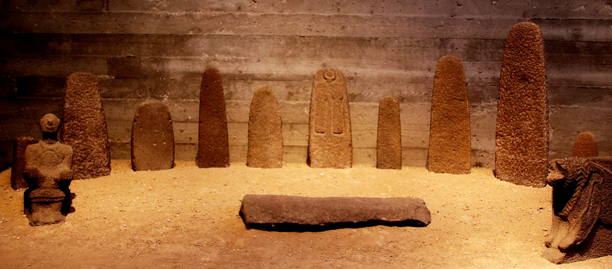

# Human-made Things in the Bible

## License Information

Human-made Things in the Bible © United Bible Societies, 2025. Adapted from: <cite>The Works of Their Hands: Man-made Things in the Bible</cite>, by Ray Pritz © 2009 United Bible Societies. This work is licensed under Creative Commons Attribution-ShareAlike 4.0 International (<a href="https://creativecommons.org/licenses/by-sa/4.0/">https://creativecommons.org/licenses/by-sa/4.0/</a>).

--------------------------------

## Idols (id: REALIA:4.6)

4\.6 Idols
==========

References:
-----------

Hebrew אֱלִיל (’elil)

[LEV 19:4](https://ref.ly/Lev19:4), [LEV 26:1](https://ref.ly/Lev26:1), [1CH 16:26](https://ref.ly/1Chr16:26), [PSA 96:5](https://ref.ly/Ps96:5), [PSA 97:7](https://ref.ly/Ps97:7), [ISA 2:8](https://ref.ly/Isa2:8), [ISA 2:18](https://ref.ly/Isa2:18), [ISA 2:20](https://ref.ly/Isa2:20), [ISA 2:20](https://ref.ly/Isa2:20), [ISA 10:10](https://ref.ly/Isa10:10), [ISA 10:11](https://ref.ly/Isa10:11), [ISA 19:1](https://ref.ly/Isa19:1), [ISA 19:3](https://ref.ly/Isa19:3), [ISA 31:7](https://ref.ly/Isa31:7), [ISA 31:7](https://ref.ly/Isa31:7), [EZK 30:13](https://ref.ly/Ezek30:13), [HAB 2:18](https://ref.ly/Hab2:18)

Hebrew גִּלּוּל (gilul)

[LEV 26:30](https://ref.ly/Lev26:30), [DEU 29:16](https://ref.ly/Deut29:16), [1KI 15:12](https://ref.ly/1Kgs15:12), [1KI 21:26](https://ref.ly/1Kgs21:26), [2KI 17:12](https://ref.ly/2Kgs17:12), [2KI 21:11](https://ref.ly/2Kgs21:11), [2KI 21:21](https://ref.ly/2Kgs21:21), [2KI 23:24](https://ref.ly/2Kgs23:24), [JER 50:2](https://ref.ly/Jer50:2), [EZK 6:4](https://ref.ly/Ezek6:4), [EZK 6:5](https://ref.ly/Ezek6:5), [EZK 6:6](https://ref.ly/Ezek6:6), [EZK 6:9](https://ref.ly/Ezek6:9), [EZK 6:13](https://ref.ly/Ezek6:13), [EZK 6:13](https://ref.ly/Ezek6:13), [EZK 8:10](https://ref.ly/Ezek8:10), [EZK 14:3](https://ref.ly/Ezek14:3), [EZK 14:4](https://ref.ly/Ezek14:4), [EZK 14:4](https://ref.ly/Ezek14:4), [EZK 14:5](https://ref.ly/Ezek14:5), [EZK 14:6](https://ref.ly/Ezek14:6), [EZK 14:7](https://ref.ly/Ezek14:7), [EZK 16:36](https://ref.ly/Ezek16:36), [EZK 18:6](https://ref.ly/Ezek18:6), [EZK 18:12](https://ref.ly/Ezek18:12), [EZK 18:15](https://ref.ly/Ezek18:15), [EZK 20:7](https://ref.ly/Ezek20:7), [EZK 20:8](https://ref.ly/Ezek20:8), [EZK 20:16](https://ref.ly/Ezek20:16), [EZK 20:18](https://ref.ly/Ezek20:18), [EZK 20:24](https://ref.ly/Ezek20:24), [EZK 20:31](https://ref.ly/Ezek20:31), [EZK 20:39](https://ref.ly/Ezek20:39), [EZK 20:39](https://ref.ly/Ezek20:39), [EZK 22:3](https://ref.ly/Ezek22:3), [EZK 22:4](https://ref.ly/Ezek22:4), [EZK 23:7](https://ref.ly/Ezek23:7), [EZK 23:30](https://ref.ly/Ezek23:30), [EZK 23:37](https://ref.ly/Ezek23:37), [EZK 23:39](https://ref.ly/Ezek23:39), [EZK 23:49](https://ref.ly/Ezek23:49), [EZK 30:13](https://ref.ly/Ezek30:13), [EZK 33:25](https://ref.ly/Ezek33:25), [EZK 36:18](https://ref.ly/Ezek36:18), [EZK 36:25](https://ref.ly/Ezek36:25), [EZK 37:23](https://ref.ly/Ezek37:23), [EZK 44:10](https://ref.ly/Ezek44:10), [EZK 44:12](https://ref.ly/Ezek44:12)

Hebrew חַמָּן (chaman)

[LEV 26:30](https://ref.ly/Lev26:30), [2CH 14:4](https://ref.ly/2Chr14:4), [2CH 34:4](https://ref.ly/2Chr34:4), [2CH 34:7](https://ref.ly/2Chr34:7), [ISA 17:8](https://ref.ly/Isa17:8), [ISA 27:9](https://ref.ly/Isa27:9), [EZK 6:4](https://ref.ly/Ezek6:4), [EZK 6:6](https://ref.ly/Ezek6:6)

Hebrew סֶמֶל (semel)

[2CH 33:7](https://ref.ly/2Chr33:7), [2CH 33:15](https://ref.ly/2Chr33:15), [EZK 8:3](https://ref.ly/Ezek8:3), [EZK 8:5](https://ref.ly/Ezek8:5)

Hebrew צִיר (tsir)

[ISA 45:16](https://ref.ly/Isa45:16)

Hebrew צֶלֶם (tselem)

[NUM 33:52](https://ref.ly/Num33:52), [2KI 11:18](https://ref.ly/2Kgs11:18), [2CH 23:17](https://ref.ly/2Chr23:17), [EZK 7:20](https://ref.ly/Ezek7:20), [EZK 16:17](https://ref.ly/Ezek16:17), [EZK 23:14](https://ref.ly/Ezek23:14), [AMO 5:26](https://ref.ly/Amos5:26)

Hebrew תַבְנִית (tavnith)

[PSA 106:20](https://ref.ly/Ps106:20)

Greek ἄγαλμα (agalma)

[2MA 2:2](https://ref.ly/2Macc2:2)

Greek εἴδωλον (eidōlon)

[ACT 7:41](https://ref.ly/Acts7:41), [ACT 15:20](https://ref.ly/Acts15:20), [ROM 2:22](https://ref.ly/Rom2:22), [1CO 8:4](https://ref.ly/1Cor8:4), [1CO 8:7](https://ref.ly/1Cor8:7), [1CO 10:19](https://ref.ly/1Cor10:19), [1CO 12:2](https://ref.ly/1Cor12:2), [2CO 6:16](https://ref.ly/2Cor6:16), [1TH 1:9](https://ref.ly/1Thess1:9), [1JN 5:21](https://ref.ly/1John5:21), [REV 9:20](https://ref.ly/Rev9:20), [TOB 14:6](https://ref.ly/Tob14:6), [ESG 4:17](https://ref.ly/EsthGr4:17), [WIS 14:11](https://ref.ly/Wis14:11), [WIS 14:12](https://ref.ly/Wis14:12), [WIS 14:27](https://ref.ly/Wis14:27), [WIS 14:29](https://ref.ly/Wis14:29), [WIS 14:30](https://ref.ly/Wis14:30), [WIS 15:15](https://ref.ly/Wis15:15), [SIR 30:19](https://ref.ly/Sir30:19), [LJE 1:72](https://ref.ly/EpJer1:72), [BEL 1:3](https://ref.ly/Bel1:3), [BEL 1:5](https://ref.ly/Bel1:5), [1MA 1:43](https://ref.ly/1Macc1:43), [1MA 3:48](https://ref.ly/1Macc3:48), [1MA 13:47](https://ref.ly/1Macc13:47), [2MA 12:40](https://ref.ly/2Macc12:40), [3MA 4:16](https://ref.ly/3Macc4:16), [ODA 2:21](https://ref.ly/Odes2:21)

Greek εἰκών (eikōn)

[ROM 1:23](https://ref.ly/Rom1:23), [REV 13:14](https://ref.ly/Rev13:14), [REV 13:15](https://ref.ly/Rev13:15), [REV 13:15](https://ref.ly/Rev13:15), [REV 13:15](https://ref.ly/Rev13:15), [REV 14:9](https://ref.ly/Rev14:9), [REV 14:11](https://ref.ly/Rev14:11), [REV 15:2](https://ref.ly/Rev15:2), [REV 16:2](https://ref.ly/Rev16:2), [REV 19:20](https://ref.ly/Rev19:20), [REV 20:4](https://ref.ly/Rev20:4), [WIS 13:13](https://ref.ly/Wis13:13), [WIS 13:16](https://ref.ly/Wis13:16), [WIS 14:15](https://ref.ly/Wis14:15), [WIS 14:17](https://ref.ly/Wis14:17), [WIS 15:5](https://ref.ly/Wis15:5)

Greek κατείδωλος (kateidōlos)

[ACT 17:16](https://ref.ly/Acts17:16)

Greek τύπος (tupos)

[ACT 7:43](https://ref.ly/Acts7:43)

Greek χάραγμα (charagma)

[ACT 17:29](https://ref.ly/Acts17:29)

Latin idolum

[2ES 16:69](https://ref.ly/2Esd16:69)

References:
-----------

### **Statue, image**:

Aramaic צְלֵם (tselem)

[DAN 2:31](https://ref.ly/Dan2:31), [DAN 2:31](https://ref.ly/Dan2:31), [DAN 2:32](https://ref.ly/Dan2:32), [DAN 2:34](https://ref.ly/Dan2:34), [DAN 2:35](https://ref.ly/Dan2:35), [DAN 3:1](https://ref.ly/Dan3:1), [DAN 3:2](https://ref.ly/Dan3:2), [DAN 3:3](https://ref.ly/Dan3:3), [DAN 3:3](https://ref.ly/Dan3:3), [DAN 3:5](https://ref.ly/Dan3:5), [DAN 3:7](https://ref.ly/Dan3:7), [DAN 3:10](https://ref.ly/Dan3:10), [DAN 3:12](https://ref.ly/Dan3:12), [DAN 3:14](https://ref.ly/Dan3:14), [DAN 3:15](https://ref.ly/Dan3:15), [DAN 3:18](https://ref.ly/Dan3:18), [DAN 3:19](https://ref.ly/Dan3:19)

Description and usage:
----------------------

*Clay goddess idols (Gary Todd, Israel Museum, CC0, via Wikimedia Commons)*

The idol was an artifact that was made to represent a god as an object of worship. Idols took many forms and were made in many sizes, from smaller than a finger to several meters high. They most frequently were shaped like a human figure, but they often took the form of some animal or bird or even a combination of human and animal.

---

Translation:
------------

Hebrew אָוֶן (’awen (meaning “trouble, wickedness”))

[ISA 66:3](https://ref.ly/Isa66:3)

Hebrew גִּלּוּל (gilul (“lifeless \[rolling] thing, dung”))

[LEV 26:30](https://ref.ly/Lev26:30), [DEU 29:16](https://ref.ly/Deut29:16), [1KI 15:12](https://ref.ly/1Kgs15:12), [1KI 21:26](https://ref.ly/1Kgs21:26), [2KI 17:12](https://ref.ly/2Kgs17:12), [2KI 21:11](https://ref.ly/2Kgs21:11), [2KI 21:21](https://ref.ly/2Kgs21:21), [2KI 23:24](https://ref.ly/2Kgs23:24), [JER 50:2](https://ref.ly/Jer50:2), [EZK 6:4](https://ref.ly/Ezek6:4), [EZK 6:5](https://ref.ly/Ezek6:5), [EZK 6:6](https://ref.ly/Ezek6:6), [EZK 6:9](https://ref.ly/Ezek6:9), [EZK 6:13](https://ref.ly/Ezek6:13), [EZK 6:13](https://ref.ly/Ezek6:13), [EZK 8:10](https://ref.ly/Ezek8:10), [EZK 14:3](https://ref.ly/Ezek14:3), [EZK 14:4](https://ref.ly/Ezek14:4), [EZK 14:4](https://ref.ly/Ezek14:4), [EZK 14:5](https://ref.ly/Ezek14:5), [EZK 14:6](https://ref.ly/Ezek14:6), [EZK 14:7](https://ref.ly/Ezek14:7), [EZK 16:36](https://ref.ly/Ezek16:36), [EZK 18:6](https://ref.ly/Ezek18:6), [EZK 18:12](https://ref.ly/Ezek18:12), [EZK 18:15](https://ref.ly/Ezek18:15), [EZK 20:7](https://ref.ly/Ezek20:7), [EZK 20:8](https://ref.ly/Ezek20:8), [EZK 20:16](https://ref.ly/Ezek20:16), [EZK 20:18](https://ref.ly/Ezek20:18), [EZK 20:24](https://ref.ly/Ezek20:24), [EZK 20:31](https://ref.ly/Ezek20:31), [EZK 20:39](https://ref.ly/Ezek20:39), [EZK 20:39](https://ref.ly/Ezek20:39), [EZK 22:3](https://ref.ly/Ezek22:3), [EZK 22:4](https://ref.ly/Ezek22:4), [EZK 23:7](https://ref.ly/Ezek23:7), [EZK 23:30](https://ref.ly/Ezek23:30), [EZK 23:37](https://ref.ly/Ezek23:37), [EZK 23:39](https://ref.ly/Ezek23:39), [EZK 23:49](https://ref.ly/Ezek23:49), [EZK 30:13](https://ref.ly/Ezek30:13), [EZK 33:25](https://ref.ly/Ezek33:25), [EZK 36:18](https://ref.ly/Ezek36:18), [EZK 36:25](https://ref.ly/Ezek36:25), [EZK 37:23](https://ref.ly/Ezek37:23), [EZK 44:10](https://ref.ly/Ezek44:10), [EZK 44:12](https://ref.ly/Ezek44:12)

Hebrew הֶבֶל (hevel (“vain thing”))

[DEU 32:21](https://ref.ly/Deut32:21), [1KI 16:13](https://ref.ly/1Kgs16:13), [1KI 16:26](https://ref.ly/1Kgs16:26), [2KI 17:15](https://ref.ly/2Kgs17:15), [PSA 31:7](https://ref.ly/Ps31:7), [JER 8:19](https://ref.ly/Jer8:19), [JER 10:8](https://ref.ly/Jer10:8), [JON 2:9](https://ref.ly/Jonah2:9)

Hebrew מִפְלֶצֶת (mifletseth (“horrible thing”))

[1KI 15:13](https://ref.ly/1Kgs15:13), [1KI 15:13](https://ref.ly/1Kgs15:13), [2CH 15:16](https://ref.ly/2Chr15:16), [2CH 15:16](https://ref.ly/2Chr15:16)

Hebrew עָצָב, עצב (‘atsav (“grief, pain”; noun or verb))

[1SA 31:9](https://ref.ly/1Sam31:9), [2SA 5:21](https://ref.ly/2Sam5:21), [1CH 10:9](https://ref.ly/1Chr10:9), [2CH 24:18](https://ref.ly/2Chr24:18), [PSA 106:36](https://ref.ly/Ps106:36), [PSA 106:38](https://ref.ly/Ps106:38), [PSA 115:4](https://ref.ly/Ps115:4), [PSA 135:15](https://ref.ly/Ps135:15), [ISA 10:11](https://ref.ly/Isa10:11), [ISA 46:1](https://ref.ly/Isa46:1), [JER 44:19](https://ref.ly/Jer44:19), [JER 50:2](https://ref.ly/Jer50:2), [HOS 4:17](https://ref.ly/Hos4:17), [HOS 8:4](https://ref.ly/Hos8:4), [HOS 13:2](https://ref.ly/Hos13:2), [HOS 14:9](https://ref.ly/Hos14:9), [MIC 1:7](https://ref.ly/Mic1:7), [ZEC 13:2](https://ref.ly/Zech13:2)

Hebrew עֹצֶב (‘otsev (“grief, pain”))

[ISA 48:5](https://ref.ly/Isa48:5)

Hebrew עֵצָה (‘etsah (“disobedience, rebellion”))

[HOS 10:6](https://ref.ly/Hos10:6)

Hebrew שִׁקּוּץ (shiquts (“detested thing”))

[DEU 29:16](https://ref.ly/Deut29:16), [1KI 11:5](https://ref.ly/1Kgs11:5), [1KI 11:7](https://ref.ly/1Kgs11:7), [1KI 11:7](https://ref.ly/1Kgs11:7), [2KI 23:13](https://ref.ly/2Kgs23:13), [2KI 23:13](https://ref.ly/2Kgs23:13), [2CH 15:8](https://ref.ly/2Chr15:8), [JER 4:1](https://ref.ly/Jer4:1), [JER 7:30](https://ref.ly/Jer7:30), [JER 13:27](https://ref.ly/Jer13:27), [JER 16:18](https://ref.ly/Jer16:18), [JER 32:34](https://ref.ly/Jer32:34), [EZK 5:11](https://ref.ly/Ezek5:11), [EZK 7:20](https://ref.ly/Ezek7:20), [EZK 11:18](https://ref.ly/Ezek11:18), [EZK 11:21](https://ref.ly/Ezek11:21), [EZK 20:8](https://ref.ly/Ezek20:8), [EZK 20:30](https://ref.ly/Ezek20:30)

*Men carrying idols (© Deutsche Bibelgesellschaft, Stuttgart by United Bible Societies)*

Though the existence of idols and corresponding terms for them are widespread, idols are by no means universal. Therefore it may be necessary in some languages to employ some type of descriptive equivalent for “idols,” for example, “objects that are made to look like gods” or “carved statues that represent gods.”

In some languages it may be necessary to specify the material from which an idol is made. The idols mentioned in the Bible were made from a variety of materials, including stone, clay, metal, and wood.

In the Old Testament, idols are often not named as such but rather are called by a wide variety of pejorative terms indicating such things as “iniquity,” “terror,” “grief,” and “horror.” Most translations will render these words as “idol,” even though the word idol is only implied. For example, [JER 50:38](https://ref.ly/Jer50:38) uses the Hebrew word *’eymim*, which means “terrors,” so the last half of this verse is literally “For it is a land of idols, and they go crazy with the terrors.” Here NRSV (New Revised Standard Version (1989)) has “For it is a land of images, and they go mad over idols.” GNT (Good News Translation (1992)) says “Babylonia is a land of terrifying idols that have made fools of the people.” Other Hebrew words used to refer to idols in a negative way are the following:

While it is possible to translate most of these terms simply as “idol,” the negative sense of the Hebrew will be better rendered by adding an appropriate modifier such as “disgusting,” “detestable,” or “filthy.”

The exact meaning of the Hebrew word *chaman* (which always appears in the plural, *chamanim*) is uncertain. The form of the word is similar to a Hebrew word for the sun, and so some have understood it to be an idol or sacred pillar to the sun god (Mft (Moffatt Translation (1926)) “sun\-pillars”; see [4\.6\.6 Sacred pillar, sacred stone, memorial stone\<REALIA:4\.6\.6\>](#)). Most translations prefer “incense altars” (RSV (Revised Standard Version (1952)), GNT (Good News Translation (1992)), NIV (New International Version (1984))) or “incense stands” (NJPSV (New Jewish Publication Society Version)).

The Greek words *eikōn*, *tupos*, and *charagma* primarily refer to a likeness or a resemblance, so in [MAT 22:20](https://ref.ly/Matt22:20)CEV (Contemporary English Version) renders *eikōn* simply as “picture.” When these words refer to the likeness of a god (for example, in [ACT 7:43](https://ref.ly/Acts7:43) and [ROM 1:23](https://ref.ly/Rom1:23)), they may be rendered in the same way as the Greek word *eidōlon*, which means “idol.”

The technical distinction between a statue or an image and an idol is that a statue may merely represent a supernatural being, while an idol not only represents such a being but is also believed to possess certain inherent supernatural powers. Statues often become idols when they are assumed to possess such powers in and of themselves rather than being mere representations of some supernatural entity. If, for example, various images of a particular supernatural being are believed to have different healing powers, then what began merely as images or representations of a supernatural power have become idols since the different images themselves have acquired special power. In other words, an “image” becomes an “idol” when people relate to it as a god.

The following discussion on [LEV 26:1](https://ref.ly/Lev26:1) from *A Handbook on Leviticus* (pages 401–402\) may prove helpful in distinguishing between different kinds of idols:

This verse contains four different words or expressions referring to false gods (or attempts to represent the deity in physical form) that are forbidden to the people of Israel. In some languages it may be difficult to find four different synonymous terms, but an effort should be made to do so if possible:

(1\) **\\\+u Idols\\\+u\***: the root of the word thus translated \[*’elil* in Hebrew] really means “worthless; insufficient; inadequate.” NAB (New American Bible (1970)) translates it “false gods,” while Mft (Moffatt Translation (1926)) has “unreal gods.” In some languages it may be best translated “worthless (or, useless) things \[used for worship].”

(2\) **\\\+u Graven image\\\+u\***: this \[*pesel* in Hebrew; see [4\.6\.2 Graven (stone) image\<REALIA:4\.6\.2\>](#) ] refers to something fashioned into the shape of an object, animal, or a person. It may be made of stone, clay, wood, or metal. According to the context here, the purpose of making such a likeness was to provide an object that could be worshiped. It may be rendered “carved out to look like something,” or “made to resemble something living,” or something similar.

(3\) **\\\+u Pillar\\\+u\***: this \[*matsevah* in Hebrew; see [4\.6\.6 Sacred pillar, sacred stone, memorial stone\<REALIA:4\.6\.6\>](#) ] probably refers to a long stone that was made to stand up by itself and served as an object of worship. It is the same term used in [GEN 28:18](https://ref.ly/Gen28:18) and [EXO 24:4](https://ref.ly/Exod24:4), when such objects were apparently acceptable in Hebrew worship. NEB (New English Bible (1970)) has “sacred pillars,” and JB (Jerusalem Bible (1966)) translates “standing\-stone,” but NJB (New Jerusalem Bible (1985)) changes this to “cultic stones.”

(4\) **\\\+u Figured stone\\\+u\***: compare [NUM 33:52](https://ref.ly/Num33:52). It is uncertain exactly what this \[*’even maskith* in Hebrew] refers to. The root meaning of the word has to do with the verb “to look.” Some commentators therefore take it to refer to some sort of remarkable stone or mosaic at which people look with adoration. However, most English versions take it to refer to a stone that has been carved or shaped by human efforts to look like an object of worship.

[DAN 3:1–DAN 3:18](https://ref.ly/Dan3:1-Dan3:18): According to some commentators, the proportions of the “image” or “statue” mentioned in this passage suggest that it was probably a sort of symbolic column rather than an exact representation of a human or divine figure, and that perhaps some carving on the column pictured the features of a person, whether human or divine. But others feel that it must have had the shape of human features. The church fathers thought it may have been an image of a king who was considered a god, and several modern commentators think it may have been a representation of a Babylonian god; but the information given in verses 12, 14 and 18 does not really make it possible to decide one way or another. If a language has a word for symbolic representation rather than exact likeness, then this word should probably be used in translation here rather than the other one.

[2MA 2:2](https://ref.ly/2Macc2:2): The Greek word *agalma* literally means “image” or “statue,” which is the rendering in some translations (NRSV (New Revised Standard Version (1989)), NJB (New Jerusalem Bible (1985))). Others (GNT (Good News Translation (1992)), NAB (New American Bible (1970)), ITCL (Italian Common Language Version)) prefer “idol,” which seems to be indicated by the context.

* **Associated Passages:** Leviticus 19:4; Leviticus 26:1; 1 Chronicles 16:26; Psalms 96:5; Psalms 97:7; Isaiah 2:8; Isaiah 2:18; Isaiah 2:20; Isaiah 10:10; Isaiah 10:11; Isaiah 19:1; Isaiah 19:3; Isaiah 31:7; Ezekiel 30:13; Habakkuk 2:18; Leviticus 26:30; Deuteronomy 29:16; 1 Kings 15:12; 1 Kings 21:26; 2 Kings 17:12; 2 Kings 21:11; 2 Kings 21:21; 2 Kings 23:24; Jeremiah 50:2; Ezekiel 6:4; Ezekiel 6:5; Ezekiel 6:6; Ezekiel 6:9; Ezekiel 6:13; Ezekiel 8:10; Ezekiel 14:3; Ezekiel 14:4; Ezekiel 14:5; Ezekiel 14:6; Ezekiel 14:7; Ezekiel 16:36; Ezekiel 18:6; Ezekiel 18:12; Ezekiel 18:15; Ezekiel 20:7; Ezekiel 20:8; Ezekiel 20:16; Ezekiel 20:18; Ezekiel 20:24; Ezekiel 20:31; Ezekiel 20:39; Ezekiel 22:3; Ezekiel 22:4; Ezekiel 23:7; Ezekiel 23:30; Ezekiel 23:37; Ezekiel 23:39; Ezekiel 23:49; Ezekiel 33:25; Ezekiel 36:18; Ezekiel 36:25; Ezekiel 37:23; Ezekiel 44:10; Ezekiel 44:12; 2 Chronicles 14:4; 2 Chronicles 34:4; 2 Chronicles 34:7; Isaiah 17:8; Isaiah 27:9; 2 Chronicles 33:7; 2 Chronicles 33:15; Ezekiel 8:3; Ezekiel 8:5; Isaiah 45:16; Numbers 33:52; 2 Kings 11:18; 2 Chronicles 23:17; Ezekiel 7:20; Ezekiel 16:17; Ezekiel 23:14; Amos 5:26; Psalms 106:20; 2 Maccabees 2:2; Acts 7:41; Acts 15:20; Romans 2:22; 1 Corinthians 8:4; 1 Corinthians 8:7; 1 Corinthians 10:19; 1 Corinthians 12:2; 2 Corinthians 6:16; 1 Thessalonians 1:9; 1 John 5:21; Revelation 9:20; Tobit 14:6; Esther Greek 4:17; Wisdom of Solomon 14:11; Wisdom of Solomon 14:12; Wisdom of Solomon 14:27; Wisdom of Solomon 14:29; Wisdom of Solomon 14:30; Wisdom of Solomon 15:15; Sirach 30:19; Letter of Jeremiah 1:72; Bel and the Dragon 1:3; Bel and the Dragon 1:5; 1 Maccabees 1:43; 1 Maccabees 3:48; 1 Maccabees 13:47; 2 Maccabees 12:40; 3 Maccabees 4:16; Odae/Odes 2:21; Romans 1:23; Revelation 13:14; Revelation 13:15; Revelation 14:9; Revelation 14:11; Revelation 15:2; Revelation 16:2; Revelation 19:20; Revelation 20:4; Wisdom of Solomon 13:13; Wisdom of Solomon 13:16; Wisdom of Solomon 14:15; Wisdom of Solomon 14:17; Wisdom of Solomon 15:5; Acts 17:16; Acts 7:43; Acts 17:29; 2 Esdras (Latin) 16:69; Daniel 2:31; Daniel 2:32; Daniel 2:34; Daniel 2:35; Daniel 3:1; Daniel 3:2; Daniel 3:3; Daniel 3:5; Daniel 3:7; Daniel 3:10; Daniel 3:12; Daniel 3:14; Daniel 3:15; Daniel 3:18; Daniel 3:19; Isaiah 66:3; Deuteronomy 32:21; 1 Kings 16:13; 1 Kings 16:26; 2 Kings 17:15; Psalms 31:7; Jeremiah 8:19; Jeremiah 10:8; Jonah 2:9; 1 Kings 15:13; 2 Chronicles 15:16; 1 Samuel 31:9; 2 Samuel 5:21; 1 Chronicles 10:9; 2 Chronicles 24:18; Psalms 106:36; Psalms 106:38; Psalms 115:4; Psalms 135:15; Isaiah 46:1; Jeremiah 44:19; Hosea 4:17; Hosea 8:4; Hosea 13:2; Hosea 14:9; Micah 1:7; Zechariah 13:2; Isaiah 48:5; Hosea 10:6; 1 Kings 11:5; 1 Kings 11:7; 2 Kings 23:13; 2 Chronicles 15:8; Jeremiah 4:1; Jeremiah 7:30; Jeremiah 13:27; Jeremiah 16:18; Jeremiah 32:34; Ezekiel 5:11; Ezekiel 11:18; Ezekiel 11:21; Ezekiel 20:30; Jeremiah 50:38; Matthew 22:20; Genesis 28:18; Exodus 24:4

* **Associated ACAI Concepts:** Image (ID: `realia:Image`); Detested Thing (ID: `keyterm:DetestedThing`); Idol (ID: `keyterm:Idol`)

## Teraphim, household idol (id: REALIA:4.6.1)

4\.6\.1 Teraphim, household idol
================================

References:
-----------

Hebrew תְּרָפִים (trafim)

[GEN 31:19](https://ref.ly/Gen31:19), [GEN 31:34](https://ref.ly/Gen31:34), [GEN 31:35](https://ref.ly/Gen31:35), [JDG 17:5](https://ref.ly/Judg17:5), [JDG 18:14](https://ref.ly/Judg18:14), [JDG 18:18](https://ref.ly/Judg18:18), [JDG 18:20](https://ref.ly/Judg18:20), [1SA 15:23](https://ref.ly/1Sam15:23), [1SA 19:13](https://ref.ly/1Sam19:13), [1SA 19:16](https://ref.ly/1Sam19:16), [2KI 23:24](https://ref.ly/2Kgs23:24), [EZK 21:26](https://ref.ly/Ezek21:26), [HOS 3:4](https://ref.ly/Hos3:4), [ZEC 10:2](https://ref.ly/Zech10:2)

Description:
------------

*A teraphim with its mold (Gary Todd, Israel Museum, CC0, via Wikimedia Commons)*

A teraphim was a sculpted or molten figure representing a god. Its size could vary considerably, from quite small to almost the size of a man.

---

Translation:
------------

Teraphim played a role in acts of divination. The one who possessed them was usually recognized as the head of the household, with all of the rights that went with that position. By showing proper reverence to the household idols, the family expected to be rewarded with prosperity, health, plenty of food, and other necessities of home life.

Some cultures will know a similar kind of idol or representation of a local god, and the word for such an idol or representation may be used.

The Hebrew word *trafim* is evidently a kind of royal plural, used to speak of multiple idols but also of a single idol.

[GEN 31:19](https://ref.ly/Gen31:19): Translations use a variety of terms for the word *trafim* in this verse; for example, “household gods” (RSV (Revised Standard Version (1952)), GNT (Good News Translation (1992)), NIV (New International Version (1984))), “family idols” (SPCL (Spanish Common Language Version (Dios Habla Hoy))), and “small idols” (first edition of GECL (German Common Language Version (Gute Nachricht Bibel))). Some translations choose to use simply the generic term “idols” (NCV (New Century Version), ITCL (Italian Common Language Version), Septuagint), and this is the practice of many translations in most of the references listed above. CEV (Contemporary English Version) adds the following footnote: “*household idols*: These were thought to protect the household from danger. It is also possible that the person who had them would inherit the family property.”

[1SA 15:23](https://ref.ly/1Sam15:23): A few translations simply transliterate the word *trafim* here; for example, for the second line of this verse NJPSV (New Jewish Publication Society Version) has “Defiance, like the iniquity of teraphim.” However, most translations understand *trafim* to refer to idol worship in general. NIV (New International Version (1984)) has “and arrogance like the evil of idolatry,” and NCV (New Century Version) says “Pride is as bad as the sin of worshiping idols.”

[1SA 19:13](https://ref.ly/1Sam19:13): Even though there seems to be only one idol involved in the story here, the Hebrew word *trafim* in this verse is still in the plural, as it always is in the Bible. The idol in this instance was big enough that Michal thought it would fool Saul’s men into thinking that it was a grown man. For this reason CEV (Contemporary English Version) says “statue,” although most translations consulted prefer a word that indicates that it was an object involved in pagan worship. ITCL (Italian Common Language Version) includes both elements with “statue of an idol,” while GECL (German Common Language Version (Gute Nachricht Bibel)) has “carved figure of the household god.”

* **Associated Passages:** Genesis 31:19; Genesis 31:34; Genesis 31:35; Judges 17:5; Judges 18:14; Judges 18:18; Judges 18:20; 1 Samuel 15:23; 1 Samuel 19:13; 1 Samuel 19:16; 2 Kings 23:24; Ezekiel 21:26; Hosea 3:4; Zechariah 10:2

* **Associated ACAI Concepts:** Household Idols (ID: `realia:HouseholdIdols`); Teraphim (ID: `deity:Teraphim`)

## Graven (stone) image (id: REALIA:4.6.2)

4\.6\.2 Graven (stone) image
============================

References:
-----------

Hebrew אֶבֶן, מַשְׂכִּית (’even maskith)

[LEV 26:1](https://ref.ly/Lev26:1), [NUM 33:52](https://ref.ly/Num33:52)

Hebrew פָּסִיל (pasil)

[DEU 7:5](https://ref.ly/Deut7:5), [DEU 7:25](https://ref.ly/Deut7:25), [DEU 12:3](https://ref.ly/Deut12:3), [JDG 3:19](https://ref.ly/Judg3:19), [JDG 3:26](https://ref.ly/Judg3:26), [2KI 17:41](https://ref.ly/2Kgs17:41), [2CH 33:19](https://ref.ly/2Chr33:19), [2CH 33:22](https://ref.ly/2Chr33:22), [2CH 34:4](https://ref.ly/2Chr34:4), [2CH 34:7](https://ref.ly/2Chr34:7), [PSA 78:58](https://ref.ly/Ps78:58), [ISA 10:10](https://ref.ly/Isa10:10), [ISA 21:9](https://ref.ly/Isa21:9), [ISA 30:22](https://ref.ly/Isa30:22), [ISA 42:8](https://ref.ly/Isa42:8), [JER 8:19](https://ref.ly/Jer8:19), [JER 50:38](https://ref.ly/Jer50:38), [JER 51:47](https://ref.ly/Jer51:47), [JER 51:52](https://ref.ly/Jer51:52), [HOS 11:2](https://ref.ly/Hos11:2), [MIC 1:7](https://ref.ly/Mic1:7), [MIC 5:12](https://ref.ly/Mic5:12)

Hebrew פֶּסֶל (pesel)

[EXO 20:4](https://ref.ly/Exod20:4), [LEV 26:1](https://ref.ly/Lev26:1), [DEU 4:16](https://ref.ly/Deut4:16), [DEU 4:23](https://ref.ly/Deut4:23), [DEU 4:25](https://ref.ly/Deut4:25), [DEU 5:8](https://ref.ly/Deut5:8), [DEU 27:15](https://ref.ly/Deut27:15), [JDG 17:3](https://ref.ly/Judg17:3), [JDG 17:4](https://ref.ly/Judg17:4), [JDG 18:14](https://ref.ly/Judg18:14), [JDG 18:17](https://ref.ly/Judg18:17), [JDG 18:18](https://ref.ly/Judg18:18), [JDG 18:20](https://ref.ly/Judg18:20), [JDG 18:30](https://ref.ly/Judg18:30), [JDG 18:31](https://ref.ly/Judg18:31), [2KI 21:7](https://ref.ly/2Kgs21:7), [2CH 33:7](https://ref.ly/2Chr33:7), [PSA 97:7](https://ref.ly/Ps97:7), [ISA 40:19](https://ref.ly/Isa40:19), [ISA 40:20](https://ref.ly/Isa40:20), [ISA 42:17](https://ref.ly/Isa42:17), [ISA 44:9](https://ref.ly/Isa44:9), [ISA 44:10](https://ref.ly/Isa44:10), [ISA 44:15](https://ref.ly/Isa44:15), [ISA 44:17](https://ref.ly/Isa44:17), [ISA 45:20](https://ref.ly/Isa45:20), [ISA 48:5](https://ref.ly/Isa48:5), [JER 10:14](https://ref.ly/Jer10:14), [JER 51:17](https://ref.ly/Jer51:17), [NAM 1:14](https://ref.ly/Nah1:14), [HAB 2:18](https://ref.ly/Hab2:18)

Greek γλυπτός (gluptos)

[WIS 14:17](https://ref.ly/Wis14:17), [WIS 15:13](https://ref.ly/Wis15:13), [1MA 5:68](https://ref.ly/1Macc5:68)

Description:
------------

*Head of Ammonite deity (late 8th c. BCE) (Gary Todd, Israel Museum, CC0, via Wikimedia Commons)*

The graven image was an idol carved out of wood or, sometimes, stone. The sizes and shapes of these images could vary greatly.

---

Translation:
------------

These images were formed by carving or sculpting. For other translation considerations, see [4\.6\.3 Molten image\<REALIA:4\.6\.3\>](#).

* **Associated Passages:** Leviticus 26:1; Numbers 33:52; Deuteronomy 7:5; Deuteronomy 7:25; Deuteronomy 12:3; Judges 3:19; Judges 3:26; 2 Kings 17:41; 2 Chronicles 33:19; 2 Chronicles 33:22; 2 Chronicles 34:4; 2 Chronicles 34:7; Psalms 78:58; Isaiah 10:10; Isaiah 21:9; Isaiah 30:22; Isaiah 42:8; Jeremiah 8:19; Jeremiah 50:38; Jeremiah 51:47; Jeremiah 51:52; Hosea 11:2; Micah 1:7; Micah 5:12; Exodus 20:4; Deuteronomy 4:16; Deuteronomy 4:23; Deuteronomy 4:25; Deuteronomy 5:8; Deuteronomy 27:15; Judges 17:3; Judges 17:4; Judges 18:14; Judges 18:17; Judges 18:18; Judges 18:20; Judges 18:30; Judges 18:31; 2 Kings 21:7; 2 Chronicles 33:7; Psalms 97:7; Isaiah 40:19; Isaiah 40:20; Isaiah 42:17; Isaiah 44:9; Isaiah 44:10; Isaiah 44:15; Isaiah 44:17; Isaiah 45:20; Isaiah 48:5; Jeremiah 10:14; Jeremiah 51:17; Nahum 1:14; Habakkuk 2:18; Wisdom of Solomon 14:17; Wisdom of Solomon 15:13; 1 Maccabees 5:68

* **Associated ACAI Concepts:** Graven Image (ID: `realia:GravenImage`)

## Molten image (id: REALIA:4.6.3)

4\.6\.3 Molten image
====================

References:
-----------

Hebrew מַסֵּכָה (masekah)

[EXO 32:4](https://ref.ly/Exod32:4), [EXO 32:8](https://ref.ly/Exod32:8), [EXO 34:17](https://ref.ly/Exod34:17), [LEV 19:4](https://ref.ly/Lev19:4), [NUM 33:52](https://ref.ly/Num33:52), [DEU 9:12](https://ref.ly/Deut9:12), [DEU 9:16](https://ref.ly/Deut9:16), [DEU 27:15](https://ref.ly/Deut27:15), [JDG 17:3](https://ref.ly/Judg17:3), [JDG 17:4](https://ref.ly/Judg17:4), [JDG 18:14](https://ref.ly/Judg18:14), [JDG 18:17](https://ref.ly/Judg18:17), [JDG 18:18](https://ref.ly/Judg18:18), [1KI 14:9](https://ref.ly/1Kgs14:9), [2KI 17:16](https://ref.ly/2Kgs17:16), [2CH 28:2](https://ref.ly/2Chr28:2), [2CH 34:3](https://ref.ly/2Chr34:3), [2CH 34:4](https://ref.ly/2Chr34:4), [NEH 9:18](https://ref.ly/Neh9:18), [PSA 106:19](https://ref.ly/Ps106:19), [ISA 30:22](https://ref.ly/Isa30:22), [ISA 42:17](https://ref.ly/Isa42:17), [HOS 13:2](https://ref.ly/Hos13:2), [NAM 1:14](https://ref.ly/Nah1:14), [HAB 2:18](https://ref.ly/Hab2:18)

Hebrew נָסִיךְ (nasik)

[DAN 11:8](https://ref.ly/Dan11:8)

Hebrew נֶסֶךְ (nesek)

[ISA 41:29](https://ref.ly/Isa41:29), [ISA 48:5](https://ref.ly/Isa48:5), [JER 10:14](https://ref.ly/Jer10:14), [JER 51:17](https://ref.ly/Jer51:17)

Description:
------------

The molten image was an idol made by pouring molten metal into a mold. The sizes and shapes of these images could vary widely. See the illustration at [4\.6\.1 Teraphim, household idol\<REALIA:4\.6\.1\>](#) above, where an image is shown with its mold.

---

Translation:
------------

The Hebrew words listed above indicate the act of pouring, and in fact the word *nesek* refers far more often to a drink offering or libation that is poured out (see [9\.1 Wine\<REALIA:9\.1\>](#)). Some translations try to reflect this with a qualifier such as “molten” or “cast.” In most passages it will be sufficient to use a general term for “idol.”

[NAM 1:14](https://ref.ly/Nah1:14): This verse and others refer to two kinds of images. Graven images were carved from stone or, more commonly, from wood. Molten images were made by melting metal and pouring it into a mold. Few languages today have separate words for these two different kinds of image. REB (Revised English Bible (1989)) uses two words in English, “image and idol,” but there is no particular need to do this. The use of the two words together in Hebrew is a way of referring to all kinds of images (compare [DEU 27:15](https://ref.ly/Deut27:15); [ISA 48:5](https://ref.ly/Isa48:5); [JER 10:14](https://ref.ly/Jer10:14); [HAB 2:18](https://ref.ly/Hab2:18)), and a general expression for these images is quite adequate (the way they were made had no spiritual significance). GNT (Good News Translation (1992)) uses just one English word, saying “idols.” Some translations succeed in expressing the two separate objects in simple language; for example, NIV (New International Version (1984)) has “carved images and cast idols,” and ITCL (Italian Common Language Version) says “idols \[made] of wood and metal.”

* **Associated Passages:** Exodus 32:4; Exodus 32:8; Exodus 34:17; Leviticus 19:4; Numbers 33:52; Deuteronomy 9:12; Deuteronomy 9:16; Deuteronomy 27:15; Judges 17:3; Judges 17:4; Judges 18:14; Judges 18:17; Judges 18:18; 1 Kings 14:9; 2 Kings 17:16; 2 Chronicles 28:2; 2 Chronicles 34:3; 2 Chronicles 34:4; Nehemiah 9:18; Psalms 106:19; Isaiah 30:22; Isaiah 42:17; Hosea 13:2; Nahum 1:14; Habakkuk 2:18; Daniel 11:8; Isaiah 41:29; Isaiah 48:5; Jeremiah 10:14; Jeremiah 51:17

* **Associated ACAI Concepts:** Molten Image (ID: `realia:MoltenImage`)

## Asherah (id: REALIA:4.6.4)

4\.6\.4 Asherah
===============

References:
-----------

Hebrew אֲשֵׁרָה (’asherah)

[EXO 34:13](https://ref.ly/Exod34:13), [DEU 7:5](https://ref.ly/Deut7:5), [DEU 12:3](https://ref.ly/Deut12:3), [DEU 16:21](https://ref.ly/Deut16:21), [JDG 6:25](https://ref.ly/Judg6:25), [JDG 6:26](https://ref.ly/Judg6:26), [JDG 6:28](https://ref.ly/Judg6:28), [JDG 6:30](https://ref.ly/Judg6:30), [1KI 14:15](https://ref.ly/1Kgs14:15), [1KI 14:23](https://ref.ly/1Kgs14:23), [1KI 16:33](https://ref.ly/1Kgs16:33), [2KI 13:6](https://ref.ly/2Kgs13:6), [2KI 17:10](https://ref.ly/2Kgs17:10), [2KI 17:16](https://ref.ly/2Kgs17:16), [2KI 18:4](https://ref.ly/2Kgs18:4), [2KI 21:3](https://ref.ly/2Kgs21:3), [2KI 23:6](https://ref.ly/2Kgs23:6), [2KI 23:14](https://ref.ly/2Kgs23:14), [2KI 23:15](https://ref.ly/2Kgs23:15), [2CH 14:2](https://ref.ly/2Chr14:2), [2CH 17:6](https://ref.ly/2Chr17:6), [2CH 19:3](https://ref.ly/2Chr19:3), [2CH 24:18](https://ref.ly/2Chr24:18), [2CH 31:1](https://ref.ly/2Chr31:1), [2CH 33:3](https://ref.ly/2Chr33:3), [2CH 33:19](https://ref.ly/2Chr33:19), [2CH 34:4](https://ref.ly/2Chr34:4), [2CH 34:7](https://ref.ly/2Chr34:7), [ISA 17:8](https://ref.ly/Isa17:8), [ISA 27:9](https://ref.ly/Isa27:9), [JER 17:2](https://ref.ly/Jer17:2), [MIC 5:13](https://ref.ly/Mic5:13)

Description and usage:
----------------------

*Bronze model from Elam with a pole used as a cultic object for the goddess Asherah (© Louvre Museum, CC BY\-SA 2\.0, via Wikimedia Commons)*

The Asherah was a wooden pole used to worship the goddess Asherah.

---

Translation:
------------

Asherah was worshiped as the consort (wife) of the head of the gods. She was considered the mother of the gods, a symbol of fertility.

In the Old Testament the Hebrew word *’asherah* sometimes refers to the goddess Asherah and sometimes to the wooden cult\-object that was her symbol. In the former category are [JDG 3:7](https://ref.ly/Judg3:7); [1KI 15:13](https://ref.ly/1Kgs15:13); [1KI 18:19](https://ref.ly/1Kgs18:19); [2KI 21:7](https://ref.ly/2Kgs21:7); [2KI 23:4](https://ref.ly/2Kgs23:4); [2KI 23:7](https://ref.ly/2Kgs23:7); [2CH 15:16](https://ref.ly/2Chr15:16). In [1KI 15:13](https://ref.ly/1Kgs15:13)GNT (Good News Translation (1992)) expands “Asherah” to “the fertility goddess Asherah.” When the word *’asherah* refers to the wooden pole used for worshiping Asherah, it may be expanded to “image/idol of the goddess Asherah.” Another good model of expansion is CEV (Contemporary English Version) “sacred poles for worshiping the goddess Asherah” in [1KI 14:15](https://ref.ly/1Kgs14:15). CEV (Contemporary English Version) also adds the following note: “*sacred poles*: Or “trees,” used as symbols of Asherah, the goddess of fertility.” Scholars now believe that the Asherah was not exactly an image or statue of the goddess but rather a special wooden pole that symbolized her. For this reason GNT (Good News Translation (1992)) often says “symbol\[s] of the goddess Asherah” (see [EXO 34:13](https://ref.ly/Exod34:13); [DEU 16:21](https://ref.ly/Deut16:21)).

* **Associated Passages:** Exodus 34:13; Deuteronomy 7:5; Deuteronomy 12:3; Deuteronomy 16:21; Judges 6:25; Judges 6:26; Judges 6:28; Judges 6:30; 1 Kings 14:15; 1 Kings 14:23; 1 Kings 16:33; 2 Kings 13:6; 2 Kings 17:10; 2 Kings 17:16; 2 Kings 18:4; 2 Kings 21:3; 2 Kings 23:6; 2 Kings 23:14; 2 Kings 23:15; 2 Chronicles 14:2; 2 Chronicles 17:6; 2 Chronicles 19:3; 2 Chronicles 24:18; 2 Chronicles 31:1; 2 Chronicles 33:3; 2 Chronicles 33:19; 2 Chronicles 34:4; 2 Chronicles 34:7; Isaiah 17:8; Isaiah 27:9; Jeremiah 17:2; Micah 5:13; Judges 3:7; 1 Kings 15:13; 1 Kings 18:19; 2 Kings 21:7; 2 Kings 23:4; 2 Kings 23:7; 2 Chronicles 15:16

* **Associated ACAI Concepts:** Asherah (ID: `deity:Asherah`); Sacred Pole (ID: `realia:SacredPole`)

## Sacred cakes (id: REALIA:4.6.5)

4\.6\.5 Sacred cakes
====================

References:
-----------

Hebrew כַּוָּן (kawan)

[JER 7:18](https://ref.ly/Jer7:18), [JER 44:19](https://ref.ly/Jer44:19)

Description and usage:
----------------------

Sacred cakes were special baked items made of bread dough and offered as part of pagan worship to an idol representing a god or goddess.

---

Translation:
------------

The “queen of heaven” for whom the sacred cakes are baked in [JER 7:18](https://ref.ly/Jer7:18) and [JER 44:19](https://ref.ly/Jer44:19) was identified with the planet Venus, and her symbol was an eight\-pointed star. Cakes made for her were probably in the shape of her image or of a star. In [JER 44:19](https://ref.ly/Jer44:19)CEV (Contemporary English Version) uses a good descriptive phrase for “sacred cakes” which can serve as a model: “special loaves of bread shaped like her \[the Queen of Heaven].”

* **Associated Passages:** Jeremiah 7:18; Jeremiah 44:19

* **Associated ACAI Concepts:** Sacred Cakes (ID: `realia:SacredCakes`)

## Sacred pillar, sacred stone, memorial stone (id: REALIA:4.6.6)

4\.6\.6 Sacred pillar, sacred stone, memorial stone
===================================================

References:
-----------

Hebrew מַצֵּבָה, מַצֶּבֶת (matsevah, matseveth)

[GEN 28:18](https://ref.ly/Gen28:18), [GEN 28:22](https://ref.ly/Gen28:22), [GEN 31:13](https://ref.ly/Gen31:13), [GEN 31:45](https://ref.ly/Gen31:45), [GEN 31:51](https://ref.ly/Gen31:51), [GEN 31:52](https://ref.ly/Gen31:52), [GEN 31:52](https://ref.ly/Gen31:52), [GEN 35:14](https://ref.ly/Gen35:14), [GEN 35:14](https://ref.ly/Gen35:14), [GEN 35:20](https://ref.ly/Gen35:20), [GEN 35:20](https://ref.ly/Gen35:20), [EXO 23:24](https://ref.ly/Exod23:24), [EXO 24:4](https://ref.ly/Exod24:4), [EXO 34:13](https://ref.ly/Exod34:13), [LEV 26:1](https://ref.ly/Lev26:1), [DEU 7:5](https://ref.ly/Deut7:5), [DEU 12:3](https://ref.ly/Deut12:3), [DEU 16:22](https://ref.ly/Deut16:22), [2SA 18:18](https://ref.ly/2Sam18:18), [2SA 18:18](https://ref.ly/2Sam18:18), [1KI 14:23](https://ref.ly/1Kgs14:23), [2KI 3:2](https://ref.ly/2Kgs3:2), [2KI 10:26](https://ref.ly/2Kgs10:26), [2KI 10:27](https://ref.ly/2Kgs10:27), [2KI 17:10](https://ref.ly/2Kgs17:10), [2KI 18:4](https://ref.ly/2Kgs18:4), [2KI 23:14](https://ref.ly/2Kgs23:14), [2CH 14:2](https://ref.ly/2Chr14:2), [2CH 31:1](https://ref.ly/2Chr31:1), [ISA 19:19](https://ref.ly/Isa19:19), [JER 43:13](https://ref.ly/Jer43:13), [EZK 26:11](https://ref.ly/Ezek26:11), [HOS 3:4](https://ref.ly/Hos3:4), [HOS 10:1](https://ref.ly/Hos10:1), [HOS 10:2](https://ref.ly/Hos10:2), [MIC 5:12](https://ref.ly/Mic5:12)

Greek στήλη (stēlē)

[1MA 14:26](https://ref.ly/1Macc14:26), [3MA 2:27](https://ref.ly/3Macc2:27), [3MA 7:20](https://ref.ly/3Macc7:20)

Description:
------------

*Sacred pillars (Gary Todd, Israel Museum, CC0, via Wikimedia Commons)*

The sacred pillar was a column that was usually made of a single stone. It could sometimes be inscribed with some memorial of an event that had happened at the place where the stone stood. Such monuments could be made of a single stone or a pile of stones.

---

Translation:
------------

The erection of pillars for special sacred purposes was a common practice in biblical culture. They were set up to commemorate important events, such as a divine manifestation or a military victory, as well as to solemnize a vow or an agreement, or to keep alive the memory of some ancestor or other notable person.

The Hebrew words *matsevah* and *matseveth* are used for two distinct things. On the one hand, they can describe legitimate memorial stones set up, as in the case of [ISA 19:19](https://ref.ly/Isa19:19), even to the LORD himself. On the other hand, the same kind of memorial stone could be set up by idol worshipers to honor their gods. In the latter case, they are strongly condemned by the Scriptures, and the Israelites were even told to destroy them (for example, [EXO 23:24](https://ref.ly/Exod23:24); [DEU 7:5](https://ref.ly/Deut7:5)). Some languages will make a distinction between the two, either with different words or with qualifiers. For example, GNT (Good News Translation (1992)) translates the Hebrew word *matsevah* in [GEN 35:14](https://ref.ly/Gen35:14) as “memorial stone,” while in [EXO 23:24](https://ref.ly/Exod23:24) the same word is rendered “sacred stone pillars.” Some translators will want to expand the translation of “memorial stone” with a descriptive phrase, such as “large rock, so that he would remember what had happened there” (CEV (Contemporary English Version)).

Memorial stones (often referred to as witnesses) are found in [GEN 28:18](https://ref.ly/Gen28:18), [GEN 28:22](https://ref.ly/Gen28:22); [GEN 31:13](https://ref.ly/Gen31:13), [GEN 31:45](https://ref.ly/Gen31:45), [GEN 31:51](https://ref.ly/Gen31:51); [GEN 31:52](https://ref.ly/Gen31:52); [GEN 35:14](https://ref.ly/Gen35:14), [GEN 35:20](https://ref.ly/Gen35:20); [EXO 24:4](https://ref.ly/Exod24:4); [2SA 18:18](https://ref.ly/2Sam18:18); [ISA 19:19](https://ref.ly/Isa19:19).

Sacred stones are found in [EXO 23:24](https://ref.ly/Exod23:24); [EXO 34:13](https://ref.ly/Exod34:13); [LEV 26:1](https://ref.ly/Lev26:1); [DEU 7:5](https://ref.ly/Deut7:5); [DEU 12:3](https://ref.ly/Deut12:3); [DEU 16:22](https://ref.ly/Deut16:22); [1KI 14:23](https://ref.ly/1Kgs14:23); [2KI 3:2](https://ref.ly/2Kgs3:2); [2KI 10:26](https://ref.ly/2Kgs10:26); [2KI 10:27](https://ref.ly/2Kgs10:27); [2KI 17:10](https://ref.ly/2Kgs17:10); [2KI 18:4](https://ref.ly/2Kgs18:4); [2KI 23:14](https://ref.ly/2Kgs23:14); [2CH 14:3](https://ref.ly/2Chr14:3); [2CH 31:1](https://ref.ly/2Chr31:1); [JER 43:13](https://ref.ly/Jer43:13); [EZK 26:11](https://ref.ly/Ezek26:11); [HOS 3:4](https://ref.ly/Hos3:4); [HOS 10:1](https://ref.ly/Hos10:1); [HOS 10:2](https://ref.ly/Hos10:2); [MIC 5:13](https://ref.ly/Mic5:13).

* **Associated Passages:** Genesis 28:18; Genesis 28:22; Genesis 31:13; Genesis 31:45; Genesis 31:51; Genesis 31:52; Genesis 35:14; Genesis 35:20; Exodus 23:24; Exodus 24:4; Exodus 34:13; Leviticus 26:1; Deuteronomy 7:5; Deuteronomy 12:3; Deuteronomy 16:22; 2 Samuel 18:18; 1 Kings 14:23; 2 Kings 3:2; 2 Kings 10:26; 2 Kings 10:27; 2 Kings 17:10; 2 Kings 18:4; 2 Kings 23:14; 2 Chronicles 14:2; 2 Chronicles 31:1; Isaiah 19:19; Jeremiah 43:13; Ezekiel 26:11; Hosea 3:4; Hosea 10:1; Hosea 10:2; Micah 5:12; 1 Maccabees 14:26; 3 Maccabees 2:27; 3 Maccabees 7:20; 2 Chronicles 14:3; Micah 5:13

* **Associated ACAI Concepts:** Sacred Pillar (ID: `realia:SacredPillar`)

## Shrine model (id: REALIA:4.6.7)

4\.6\.7 Shrine model
====================

Reference:
----------

Greek ναός (naos)

[ACT 19:24](https://ref.ly/Acts19:24)

Description:
------------

*Clay shrine model (© Oren Rozen, CC BY\-SA 4\.0, via Wikimedia Commons)*

The shrine model was a small replica or model of a temple or shrine. It is likely that some people treated them with special veneration, but the models mentioned in Acts were primarily souvenirs.

---

Translation:
------------

In [ACT 19:24](https://ref.ly/Acts19:24) the Greek term *naos* is rendered in some languages as “tiny temples” or “souvenir temples.” This will often be a good place to use a descriptive phrase. For the literal phrase “silver temples of Artemis,” GNT (Good News Translation (1992)) and CEV (Contemporary English Version) have “silver models of the temple of the goddess Artemis,” NCV (New Century Version) has “little silver models that looked like the temple of the goddess Artemis,” and SPCL (Spanish Common Language Version (Dios Habla Hoy)) says “small silver figures which represented the temple ….”

* **Associated Passages:** Acts 19:24

* **Associated ACAI Concepts:** Replica Temple (ID: `realia:ReplicaTemple`)
