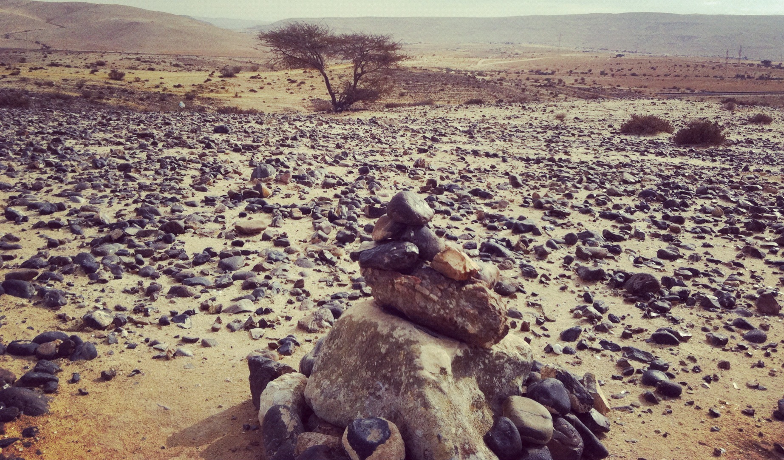

# Human-made Things in the Bible

## License Information

Human-made Things in the Bible © United Bible Societies, 2025. Adapted from: <cite>The Works of Their Hands: Man-made Things in the Bible</cite>, by Ray Pritz © 2009 United Bible Societies. This work is licensed under Creative Commons Attribution-ShareAlike 4.0 International (<a href="https://creativecommons.org/licenses/by-sa/4.0/">https://creativecommons.org/licenses/by-sa/4.0/</a>).

--------------------------------

## Burial mound (id: REALIA:4.8.2)

4\.8\.2 Burial mound
====================

Reference:
----------

Greek χειμών (cheimōn)

[SIR 21:8](https://ref.ly/Sir21:8)

Description and usage:
----------------------

*A pile of stones sometimes marks a burial site (© ניסים טבקה Pikiwiki Israel, CC BY 2\.5, via Wikimedia Commons)*

The burial mound was a pile of stones placed over the place of burial. Its purpose was to mark the burial site and to prevent animals from digging up the body.

---

Translation:
------------

Since the “burial mound” was just another kind of tomb, GNT (Good News Translation (1992)) has simply “tomb” in [SIR 21:8](https://ref.ly/Sir21:8). There is a textual variation in this verse. Some manuscripts have “for the winter” instead of “for his burial mound” (RSV (Revised Standard Version (1952))). Most translations use a word for “tomb” and add a footnote giving the alternate reading (so GNT (Good News Translation (1992))).

* **Associated Passages:** Sirach 21:8

