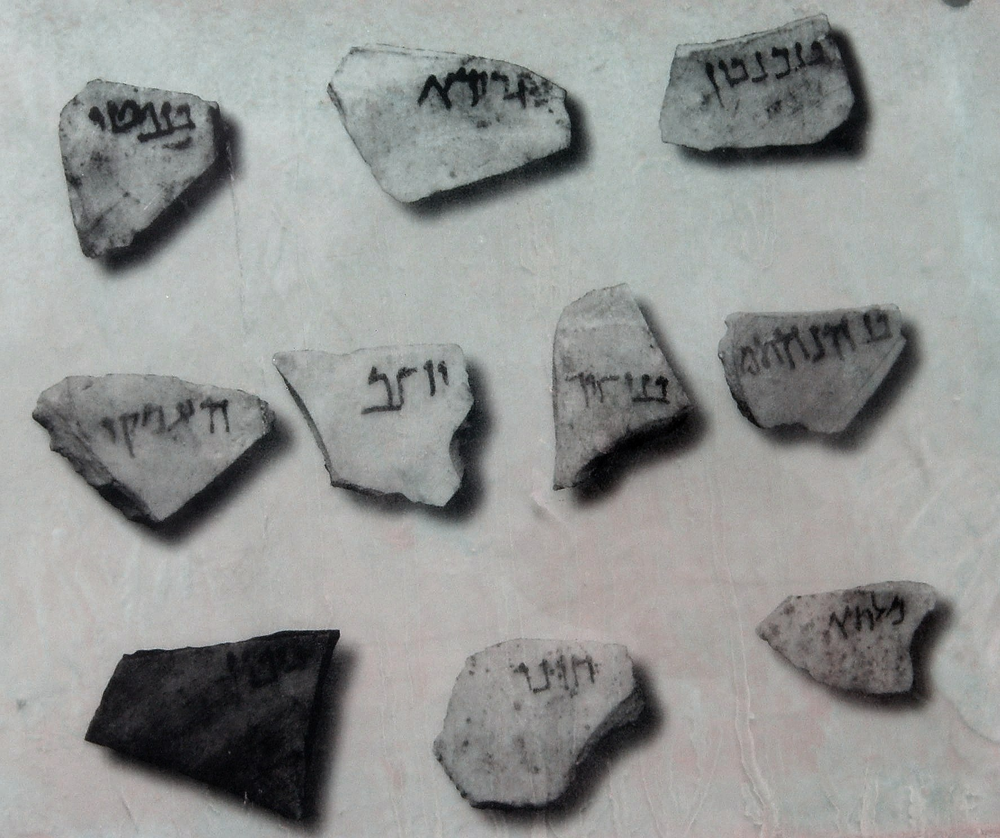

# Human-made Things in the Bible

## License Information

Human-made Things in the Bible © United Bible Societies, 2025. Adapted from: <cite>The Works of Their Hands: Man-made Things in the Bible</cite>, by Ray Pritz © 2009 United Bible Societies. This work is licensed under Creative Commons Attribution-ShareAlike 4.0 International (<a href="https://creativecommons.org/licenses/by-sa/4.0/">https://creativecommons.org/licenses/by-sa/4.0/</a>).

--------------------------------

## Lots (id: REALIA:4.9)

4\.9 Lots
=========

References:
-----------

Hebrew גּוֹרָל (goral)

[LEV 16:8](https://ref.ly/Lev16:8), [LEV 16:8](https://ref.ly/Lev16:8), [LEV 16:8](https://ref.ly/Lev16:8), [LEV 16:9](https://ref.ly/Lev16:9), [LEV 16:10](https://ref.ly/Lev16:10), [NUM 26:55](https://ref.ly/Num26:55), [NUM 26:56](https://ref.ly/Num26:56), [NUM 33:54](https://ref.ly/Num33:54), [NUM 33:54](https://ref.ly/Num33:54), [NUM 34:13](https://ref.ly/Num34:13), [NUM 36:2](https://ref.ly/Num36:2), [NUM 36:3](https://ref.ly/Num36:3), [JOS 14:2](https://ref.ly/Josh14:2), [JOS 15:1](https://ref.ly/Josh15:1), [JOS 16:1](https://ref.ly/Josh16:1), [JOS 17:1](https://ref.ly/Josh17:1), [JOS 17:14](https://ref.ly/Josh17:14), [JOS 17:17](https://ref.ly/Josh17:17), [JOS 18:6](https://ref.ly/Josh18:6), [JOS 18:8](https://ref.ly/Josh18:8), [JOS 18:10](https://ref.ly/Josh18:10), [JOS 18:11](https://ref.ly/Josh18:11), [JOS 18:11](https://ref.ly/Josh18:11), [JOS 19:1](https://ref.ly/Josh19:1), [JOS 19:10](https://ref.ly/Josh19:10), [JOS 19:17](https://ref.ly/Josh19:17), [JOS 19:24](https://ref.ly/Josh19:24), [JOS 19:32](https://ref.ly/Josh19:32), [JOS 19:40](https://ref.ly/Josh19:40), [JOS 19:51](https://ref.ly/Josh19:51), [JOS 21:4](https://ref.ly/Josh21:4), [JOS 21:4](https://ref.ly/Josh21:4), [JOS 21:5](https://ref.ly/Josh21:5), [JOS 21:6](https://ref.ly/Josh21:6), [JOS 21:8](https://ref.ly/Josh21:8), [JOS 21:10](https://ref.ly/Josh21:10), [JOS 21:20](https://ref.ly/Josh21:20), [JOS 21:40](https://ref.ly/Josh21:40), [JDG 1:3](https://ref.ly/Judg1:3), [JDG 1:3](https://ref.ly/Judg1:3), [JDG 20:9](https://ref.ly/Judg20:9), [1CH 6:39](https://ref.ly/1Chr6:39), [1CH 6:46](https://ref.ly/1Chr6:46), [1CH 6:48](https://ref.ly/1Chr6:48), [1CH 6:50](https://ref.ly/1Chr6:50), [1CH 24:5](https://ref.ly/1Chr24:5), [1CH 24:7](https://ref.ly/1Chr24:7), [1CH 24:31](https://ref.ly/1Chr24:31), [1CH 25:8](https://ref.ly/1Chr25:8), [1CH 25:9](https://ref.ly/1Chr25:9), [1CH 26:13](https://ref.ly/1Chr26:13), [1CH 26:14](https://ref.ly/1Chr26:14), [1CH 26:14](https://ref.ly/1Chr26:14), [1CH 26:14](https://ref.ly/1Chr26:14), [NEH 10:35](https://ref.ly/Neh10:35), [NEH 11:1](https://ref.ly/Neh11:1), [EST 3:7](https://ref.ly/Esth3:7), [EST 9:24](https://ref.ly/Esth9:24), [PSA 16:5](https://ref.ly/Ps16:5), [PSA 22:19](https://ref.ly/Ps22:19), [PSA 125:3](https://ref.ly/Ps125:3), [PRO 1:14](https://ref.ly/Prov1:14), [PRO 16:33](https://ref.ly/Prov16:33), [PRO 18:18](https://ref.ly/Prov18:18), [ISA 17:14](https://ref.ly/Isa17:14), [ISA 34:17](https://ref.ly/Isa34:17), [ISA 57:6](https://ref.ly/Isa57:6), [JER 13:25](https://ref.ly/Jer13:25), [EZK 24:6](https://ref.ly/Ezek24:6), [DAN 12:13](https://ref.ly/Dan12:13), [JOL 4:3](https://ref.ly/Joel4:3), [OBA 1:11](https://ref.ly/Obad1:11), [JON 1:7](https://ref.ly/Jonah1:7), [JON 1:7](https://ref.ly/Jonah1:7), [JON 1:7](https://ref.ly/Jonah1:7), [MIC 2:5](https://ref.ly/Mic2:5), [NAM 3:10](https://ref.ly/Nah3:10)

Greek κλῆρος (klēros)

[MAT 27:35](https://ref.ly/Matt27:35), [MRK 15:24](https://ref.ly/Mark15:24), [LUK 23:34](https://ref.ly/Luke23:34), [JHN 19:24](https://ref.ly/John19:24), [ACT 1:26](https://ref.ly/Acts1:26), [ACT 1:26](https://ref.ly/Acts1:26), [ACT 8:21](https://ref.ly/Acts8:21), [ESG 3:7](https://ref.ly/EsthGr3:7), [ESG 3:7](https://ref.ly/EsthGr3:7), [SIR 14:15](https://ref.ly/Sir14:15), [SIR 25:19](https://ref.ly/Sir25:19), [SIR 37:8](https://ref.ly/Sir37:8)

Greek (lagchanō (verb))

[LUK 1:9](https://ref.ly/Luke1:9), [JHN 19:24](https://ref.ly/John19:24)

Description and usage:
----------------------

*Pottery shard lots (© Eliot from The Negev, CC BY 2\.0, via Wikimedia Commons)*

Lots were specially marked pebbles, pieces of pottery or sticks used in making decisions. It is not possible to know the particular method used in “choosing by lot,” for evidently various devices were used. See also [4\.9\.1 Urim and Thummim\<REALIA:4\.9\.1\>](#).

---

Translation:
------------

Drawing lots (literally “throwing lots” in Hebrew) was viewed by the people of Israel as a way of discerning God’s will, since it was believed that God directed the outcome (see [PRO 16:33](https://ref.ly/Prov16:33)). In some cultures the closest natural equivalents of deciding by lot are procedures involving “drawing straws,” “throwing down sticks,” and “dropping pebbles.”

[JHN 19:24](https://ref.ly/John19:24): “Throw dice” (GNT (Good News Translation (1992)), JB (Jerusalem Bible (1966)), NAB (New American Bible (1970))) translates the Greek verb *lagchanō*, which means to get something either by casting or drawing lots (so RSV (Revised Standard Version (1952)), Mft (Moffatt Translation (1926)), AT (American Translation (Goodspeed, 1935)), Phps (J.B. Phillips: The New Testament in Modern English (1958))). However, for contemporary readers the idea of throwing dice or tossing a coin may be the nearest cultural equivalent; for example, for the third clause in this verse NEB (New English Bible (1970)) has “let us toss for it.” In some languages a generic expression may be employed, for example, “let us gamble for it.” However, in some parts of the world where there is no cultural equivalent of gambling, a parallel type of behavior can be described, for example, “let us play a game to see who wins and therefore gets the robe.”

In [ACT 1:26](https://ref.ly/Acts1:26)RSV (Revised Standard Version (1952)) “they cast lots for them” is literally “they gave them lots” in Greek. In this context it is probable that small sticks were handed out.

* **Associated Passages:** Leviticus 16:8; Leviticus 16:9; Leviticus 16:10; Numbers 26:55; Numbers 26:56; Numbers 33:54; Numbers 34:13; Numbers 36:2; Numbers 36:3; Joshua 14:2; Joshua 15:1; Joshua 16:1; Joshua 17:1; Joshua 17:14; Joshua 17:17; Joshua 18:6; Joshua 18:8; Joshua 18:10; Joshua 18:11; Joshua 19:1; Joshua 19:10; Joshua 19:17; Joshua 19:24; Joshua 19:32; Joshua 19:40; Joshua 19:51; Joshua 21:4; Joshua 21:5; Joshua 21:6; Joshua 21:8; Joshua 21:10; Joshua 21:20; Joshua 21:40; Judges 1:3; Judges 20:9; 1 Chronicles 6:39; 1 Chronicles 6:46; 1 Chronicles 6:48; 1 Chronicles 6:50; 1 Chronicles 24:5; 1 Chronicles 24:7; 1 Chronicles 24:31; 1 Chronicles 25:8; 1 Chronicles 25:9; 1 Chronicles 26:13; 1 Chronicles 26:14; Nehemiah 10:35; Nehemiah 11:1; Esther 3:7; Esther 9:24; Psalms 16:5; Psalms 22:19; Psalms 125:3; Proverbs 1:14; Proverbs 16:33; Proverbs 18:18; Isaiah 17:14; Isaiah 34:17; Isaiah 57:6; Jeremiah 13:25; Ezekiel 24:6; Daniel 12:13; Joel 4:3; Obadiah 1:11; Jonah 1:7; Micah 2:5; Nahum 3:10; Matthew 27:35; Mark 15:24; Luke 23:34; John 19:24; Acts 1:26; Acts 8:21; Esther Greek 3:7; Sirach 14:15; Sirach 25:19; Sirach 37:8; Luke 1:9

* **Associated ACAI Concepts:** Lot (ID: `keyterm:Lot`); Lot (ID: `realia:Lot`)

## Urim and Thummim (id: REALIA:4.9.1)

4\.9\.1 Urim and Thummim
========================

References:
-----------

### **Urim**:

Hebrew אוּרִים (’urim)

[EXO 28:30](https://ref.ly/Exod28:30), [LEV 8:8](https://ref.ly/Lev8:8), [NUM 27:21](https://ref.ly/Num27:21), [DEU 33:8](https://ref.ly/Deut33:8), [1SA 28:6](https://ref.ly/1Sam28:6), [EZR 2:63](https://ref.ly/Ezra2:63), [NEH 7:65](https://ref.ly/Neh7:65)

Greek δῆλος, δήλωσις (dēlos, dēlōsis)

[SIR 33:3](https://ref.ly/Sir33:3), [SIR 45:10](https://ref.ly/Sir45:10), [4MA 2:7](https://ref.ly/4Macc2:7), [1ES 5:40](https://ref.ly/1Esd5:40)

References:
-----------

### **Thummim**:

Hebrew תָּמִים (tamim)

[1SA 14:41](https://ref.ly/1Sam14:41)

Hebrew תֻּמִּים (tumim)

[EXO 28:30](https://ref.ly/Exod28:30), [LEV 8:8](https://ref.ly/Lev8:8), [DEU 33:8](https://ref.ly/Deut33:8), [EZR 2:63](https://ref.ly/Ezra2:63), [NEH 7:65](https://ref.ly/Neh7:65)

Greek ἀλήθεια (alētheia)

[SIR 45:10](https://ref.ly/Sir45:10), [1ES 5:40](https://ref.ly/1Esd5:40)

Description:
------------

The actual appearance of the Urim and Thummim is not known. Many suggestions have been made, including small black and white stones, or lots in some other form.

---

Usage:
------

These two objects were somehow used by the High Priest to find out the will of God (see, for example, [NUM 27:21](https://ref.ly/Num27:21); [1SA 14:41](https://ref.ly/1Sam14:41); [1SA 28:6](https://ref.ly/1Sam28:6)). One suggestion is that the breastpiece (see [4\.5\.5 Sacred pocket, breastpiece\<REALIA:4\.5\.5\>](#)) served as a kind of pocket into which the Urim and Thummim were placed. Questions were asked of God requiring a yes or no answer, and whichever of the objects was drawn from the pouch indicated the answer.

---

Translation:
------------

Ancient translations (like the Septuagint) tended to translate the Hebrew words *’urim* and *tumim* according to their literal meaning, saying “lights and perfections,” or they rendered them nonfiguratively, saying “perfect revelation” or “complete illumination.” In most modern versions the two words are simply transliterated, but some (Mft (Moffatt Translation (1926)), GECL (German Common Language Version (Gute Nachricht Bibel))) render the meaning quite adequately with “the sacred lots.” Other languages may have to say “the lots of God.” However these terms are rendered, it is advisable to include a footnote explaining their meaning in greater detail. GNT (Good News Translation (1992)) has the following footnote at [EXO 28:30](https://ref.ly/Exod28:30): “urim and thummim: *Two objects used by the priest to determine God’s will; it is not known precisely how they were used.* ” The CEV (Contemporary English Version) footnote on this verse reads “*two small objects*: The Hebrew text has ‘urim and thummim,’ which may have been made of wood, stone, or metal, and were used in some way to receive answers from God.”

In [1SA 14:41](https://ref.ly/1Sam14:41) the Hebrew text uses the word *tamim*, which has the same letters as *tumim* but with different vowels. It does not have the word *’urim*. The Septuagint has a longer text here, including words corresponding to both *’urim* and *tumim*. For a discussion of the textual problem here and different translation solutions, see *A Handbook on The First and Second Books of Samuel*, pages 300–301\. on of the textual problem here and different translation solutions, see *A Handbook on The First and Second Books of Samuel*, pages 300–301\.

* **Associated Passages:** Exodus 28:30; Leviticus 8:8; Numbers 27:21; Deuteronomy 33:8; 1 Samuel 28:6; Ezra 2:63; Nehemiah 7:65; Sirach 33:3; Sirach 45:10; 4 Maccabees 2:7; 1 Esdras (Greek) 5:40; 1 Samuel 14:41

