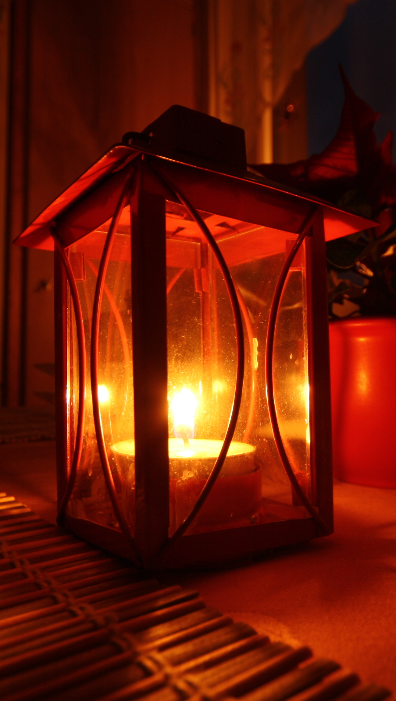

# Human-made Things in the Bible

## License Information

Human-made Things in the Bible © United Bible Societies, 2025. Adapted from: <cite>The Works of Their Hands: Man-made Things in the Bible</cite>, by Ray Pritz © 2009 United Bible Societies. This work is licensed under Creative Commons Attribution-ShareAlike 4.0 International (<a href="https://creativecommons.org/licenses/by-sa/4.0/">https://creativecommons.org/licenses/by-sa/4.0/</a>).

--------------------------------

## Lantern (id: REALIA:5.3)

5\.3 Lantern
============

Reference:
----------

Greek φανός (fanos)

[JHN 18:3](https://ref.ly/John18:3)

Description:
------------

*Lantern (© Jiří Sedláček, CC BY\-SA 3\.0, via Wikimedia Commons)*

The lantern was a small fire that was carried around for the sake of its light and that had some type of protection from the wind and weather. The lantern itself was cylindrical in shape with an opening in one side into which a normal oil lamp could be placed. It could be made of terra cotta, but the Romans are also known to have had lanterns made of metal with translucent sides made of animal horn. The lantern was carried by means of a ring (or cloth or leather strap) attached to the top.

---

Translation:
------------

In earlier Greek the word *fanos* meant a torch, but by New Testament times it appears to have been used primarily to refer to a type of lamp used outdoors. [JHN 18:3](https://ref.ly/John18:3) mentions two instruments for giving light. It is obvious that these two kinds of light are close in meaning since translations are evenly divided in translating “torches and lanterns” (so CEV (Contemporary English Version), NIV (New International Version (1984))) or “lanterns and torches” (RSV (Revised Standard Version (1952)), GNT (Good News Translation (1992))), even though the Greek text has only one reading.

Where it is difficult to find words for two distinct objects that give light by a burning fire, it may be necessary to use one word for the two things. Translators should avoid a word for an object that gives light through the use of electricity or batteries.

See also the discussion in the following entry.

* **Associated Passages:** John 18:3

