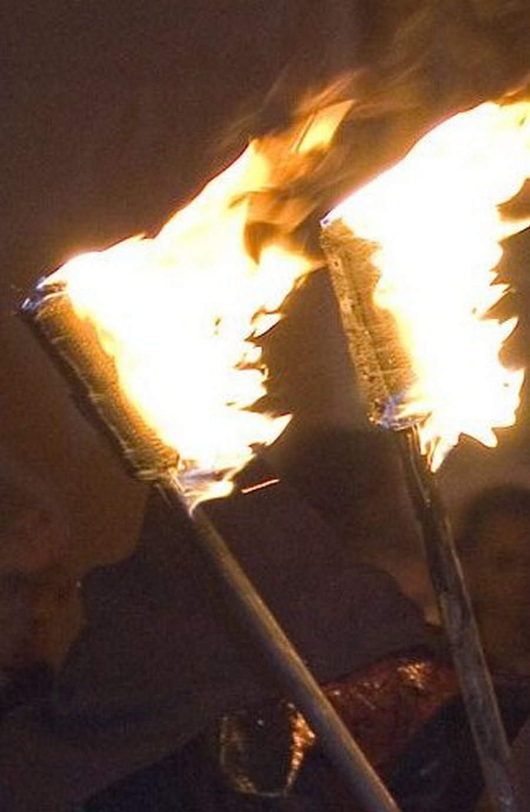

# Human-made Things in the Bible

## License Information

Human-made Things in the Bible © United Bible Societies, 2025. Adapted from: <cite>The Works of Their Hands: Man-made Things in the Bible</cite>, by Ray Pritz © 2009 United Bible Societies. This work is licensed under Creative Commons Attribution-ShareAlike 4.0 International (<a href="https://creativecommons.org/licenses/by-sa/4.0/">https://creativecommons.org/licenses/by-sa/4.0/</a>).

--------------------------------

## Torch (id: REALIA:5.4)

5\.4 Torch
==========

References:
-----------

Hebrew לַפִּיד (lapid)

[GEN 15:17](https://ref.ly/Gen15:17), [JDG 7:16](https://ref.ly/Judg7:16), [JDG 7:20](https://ref.ly/Judg7:20), [JDG 15:4](https://ref.ly/Judg15:4), [JDG 15:4](https://ref.ly/Judg15:4), [JDG 15:5](https://ref.ly/Judg15:5), [JOB 41:11](https://ref.ly/Job41:11), [ISA 62:1](https://ref.ly/Isa62:1), [EZK 1:13](https://ref.ly/Ezek1:13), [DAN 10:6](https://ref.ly/Dan10:6), [NAM 2:5](https://ref.ly/Nah2:5), [ZEC 12:6](https://ref.ly/Zech12:6)

Greek δᾳδουχία (dadouchia)

[2MA 4:22](https://ref.ly/2Macc4:22)

Greek λαμπάς (lampas)

[MAT 25:1](https://ref.ly/Matt25:1), [MAT 25:4](https://ref.ly/Matt25:4), [MAT 25:7](https://ref.ly/Matt25:7), [MAT 25:8](https://ref.ly/Matt25:8), [JHN 18:3](https://ref.ly/John18:3), [ACT 20:8](https://ref.ly/Acts20:8), [REV 4:5](https://ref.ly/Rev4:5), [REV 8:10](https://ref.ly/Rev8:10), [JDT 10:22](https://ref.ly/Jdt10:22), [SIR 48:1](https://ref.ly/Sir48:1), [1MA 6:39](https://ref.ly/1Macc6:39)

Greek (fōs)

[ACT 16:29](https://ref.ly/Acts16:29)

Description and usage:
----------------------

*Flaming torches (© Andrew Dunn, CC BY\-SA 2\.0, via Wikimedia Commons)*

The torch was a burning stick or bundle of sticks carried about as a light. In order to lengthen the time of burning, one end of the stick could be wrapped with cloth, which was soaked in a flammable substance such as pitch.

---

Translation:
------------

In modern British English, a “torch” is a handheld electric light powered by batteries, that is, a “flashlight” in American English. Such a word would be entirely out of place in the translation of the Bible.

[JOB 41:13](https://ref.ly/Job41:13): Here the focus is on the flame, not on the torch that contains the flame, so for the first line of this verse GNT (Good News Translation (1992)) has “Flames blaze from his mouth.”

While the Greek word *lampas* most properly refers to a “torch,” in some places (for example, [ACT 20:8](https://ref.ly/Acts20:8); [REV 4:5](https://ref.ly/Rev4:5)) some translations prefer the English derived term “lamp.”

Some languages may find it difficult to distinguish between “torches” and “lanterns” in [JHN 18:3](https://ref.ly/John18:3). It is possible to say “burning sticks and containers with small fires for light.” See also the discussion [5\.3 Lantern\<REALIA:5\.3\>](#).

[ACT 16:29](https://ref.ly/Acts16:29): The jailer demanded that “lights” be brought, but the text does not indicate the specific instruments. Many languages will be able to follow the pattern of GNT (Good News Translation (1992)) and GECL (German Common Language Version (Gute Nachricht Bibel)) by beginning this verse with “The jailer called for a light.” It is likely that torches from the entrance to the jail would have been most readily available. However, the intention of the jailer will be adequately expressed also with “The jailer called for someone to bring a lamp.”

* **Associated Passages:** Genesis 15:17; Judges 7:16; Judges 7:20; Judges 15:4; Judges 15:5; Job 41:11; Isaiah 62:1; Ezekiel 1:13; Daniel 10:6; Nahum 2:5; Zechariah 12:6; 2 Maccabees 4:22; Matthew 25:1; Matthew 25:4; Matthew 25:7; Matthew 25:8; John 18:3; Acts 20:8; Revelation 4:5; Revelation 8:10; Judith 10:22; Sirach 48:1; 1 Maccabees 6:39; Acts 16:29; Job 41:13

* **Associated ACAI Concepts:** Torch (ID: `realia:Torch`)
