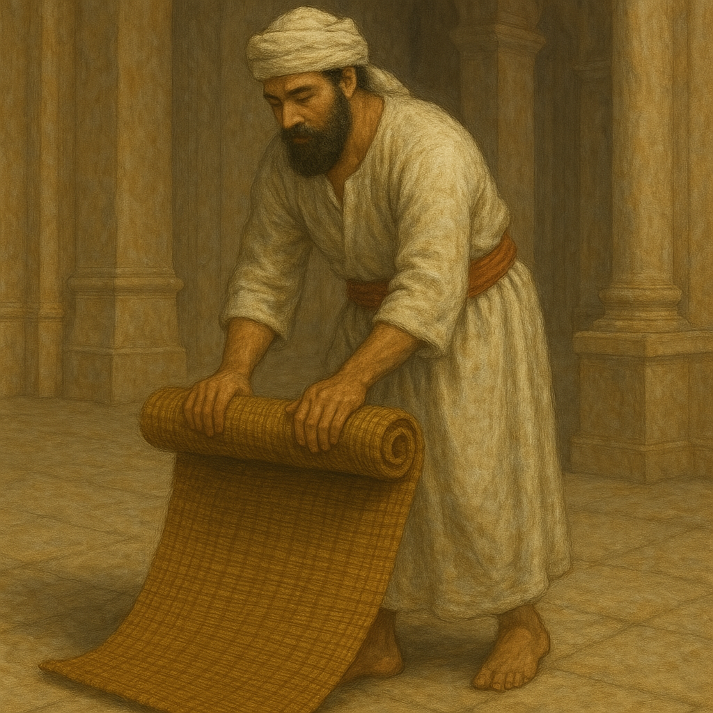

# Human-made Things in the Bible

## License Information

Human-made Things in the Bible © United Bible Societies, 2025. Adapted from: <cite>The Works of Their Hands: Man-made Things in the Bible</cite>, by Ray Pritz © 2009 United Bible Societies. This work is licensed under Creative Commons Attribution-ShareAlike 4.0 International (<a href="https://creativecommons.org/licenses/by-sa/4.0/">https://creativecommons.org/licenses/by-sa/4.0/</a>).

--------------------------------

## Bed, sleeping mat (id: REALIA:5.5)

5\.5 Bed, sleeping mat
======================

References:
-----------

Hebrew יָצוּעַ (yatsu‘a)

[GEN 49:4](https://ref.ly/Gen49:4), [1CH 5:1](https://ref.ly/1Chr5:1), [JOB 17:13](https://ref.ly/Job17:13), [PSA 63:7](https://ref.ly/Ps63:7), [PSA 132:3](https://ref.ly/Ps132:3)

Hebrew מִטָּה (mitah)

[GEN 47:31](https://ref.ly/Gen47:31), [GEN 48:2](https://ref.ly/Gen48:2), [GEN 49:33](https://ref.ly/Gen49:33), [EXO 7:28](https://ref.ly/Exod7:28), [1SA 19:13](https://ref.ly/1Sam19:13), [1SA 19:15](https://ref.ly/1Sam19:15), [1SA 19:16](https://ref.ly/1Sam19:16), [1SA 28:23](https://ref.ly/1Sam28:23), [2SA 4:7](https://ref.ly/2Sam4:7), [1KI 17:19](https://ref.ly/1Kgs17:19), [1KI 21:4](https://ref.ly/1Kgs21:4), [2KI 1:4](https://ref.ly/2Kgs1:4), [2KI 1:6](https://ref.ly/2Kgs1:6), [2KI 1:16](https://ref.ly/2Kgs1:16), [2KI 4:10](https://ref.ly/2Kgs4:10), [2KI 4:21](https://ref.ly/2Kgs4:21), [2KI 4:32](https://ref.ly/2Kgs4:32), [2KI 11:2](https://ref.ly/2Kgs11:2), [2CH 22:11](https://ref.ly/2Chr22:11), [2CH 24:25](https://ref.ly/2Chr24:25), [EST 1:6](https://ref.ly/Esth1:6), [EST 7:8](https://ref.ly/Esth7:8), [PSA 6:7](https://ref.ly/Ps6:7), [PRO 26:14](https://ref.ly/Prov26:14), [SNG 3:7](https://ref.ly/Song3:7), [EZK 23:41](https://ref.ly/Ezek23:41), [AMO 3:12](https://ref.ly/Amos3:12), [AMO 6:4](https://ref.ly/Amos6:4)

Hebrew מֵסַב (mesav)

[SNG 1:12](https://ref.ly/Song1:12)

Hebrew מַצָּע (matsa‘)

[ISA 28:20](https://ref.ly/Isa28:20)

Hebrew מִשְׁכָּב (mishkav)

[GEN 49:4](https://ref.ly/Gen49:4), [EXO 7:28](https://ref.ly/Exod7:28), [EXO 21:18](https://ref.ly/Exod21:18), [LEV 15:4](https://ref.ly/Lev15:4), [LEV 15:5](https://ref.ly/Lev15:5), [LEV 15:21](https://ref.ly/Lev15:21), [LEV 15:23](https://ref.ly/Lev15:23), [LEV 15:24](https://ref.ly/Lev15:24), [LEV 15:26](https://ref.ly/Lev15:26), [LEV 15:26](https://ref.ly/Lev15:26), [LEV 18:22](https://ref.ly/Lev18:22), [LEV 20:13](https://ref.ly/Lev20:13), [NUM 31:17](https://ref.ly/Num31:17), [NUM 31:18](https://ref.ly/Num31:18), [NUM 31:35](https://ref.ly/Num31:35), [JDG 21:11](https://ref.ly/Judg21:11), [JDG 21:12](https://ref.ly/Judg21:12), [2SA 4:5](https://ref.ly/2Sam4:5), [2SA 4:7](https://ref.ly/2Sam4:7), [2SA 4:11](https://ref.ly/2Sam4:11), [2SA 11:2](https://ref.ly/2Sam11:2), [2SA 11:13](https://ref.ly/2Sam11:13), [2SA 13:5](https://ref.ly/2Sam13:5), [2SA 17:28](https://ref.ly/2Sam17:28), [1KI 1:47](https://ref.ly/1Kgs1:47), [2KI 6:12](https://ref.ly/2Kgs6:12), [2CH 16:14](https://ref.ly/2Chr16:14), [JOB 7:13](https://ref.ly/Job7:13), [JOB 33:15](https://ref.ly/Job33:15), [JOB 33:19](https://ref.ly/Job33:19), [PSA 4:5](https://ref.ly/Ps4:5), [PSA 36:5](https://ref.ly/Ps36:5), [PSA 41:4](https://ref.ly/Ps41:4), [PSA 149:5](https://ref.ly/Ps149:5), [PRO 7:17](https://ref.ly/Prov7:17), [PRO 22:27](https://ref.ly/Prov22:27), [ECC 10:20](https://ref.ly/Eccl10:20), [SNG 3:1](https://ref.ly/Song3:1), [ISA 57:2](https://ref.ly/Isa57:2), [ISA 57:7](https://ref.ly/Isa57:7), [ISA 57:8](https://ref.ly/Isa57:8), [ISA 57:8](https://ref.ly/Isa57:8), [EZK 23:17](https://ref.ly/Ezek23:17), [EZK 32:25](https://ref.ly/Ezek32:25), [HOS 7:14](https://ref.ly/Hos7:14), [MIC 2:1](https://ref.ly/Mic2:1)

Hebrew עֶרֶשׂ (‘eres)

[DEU 3:11](https://ref.ly/Deut3:11), [DEU 3:11](https://ref.ly/Deut3:11), [JOB 7:13](https://ref.ly/Job7:13), [PSA 6:7](https://ref.ly/Ps6:7), [PSA 41:4](https://ref.ly/Ps41:4), [PSA 132:3](https://ref.ly/Ps132:3), [PRO 7:16](https://ref.ly/Prov7:16), [SNG 1:16](https://ref.ly/Song1:16), [AMO 3:12](https://ref.ly/Amos3:12), [AMO 6:4](https://ref.ly/Amos6:4)

Greek κλινάριον (klinarion)

[ACT 5:15](https://ref.ly/Acts5:15)

Greek κλίνη (klinē)

[MAT 9:2](https://ref.ly/Matt9:2), [MAT 9:6](https://ref.ly/Matt9:6), [MRK 4:21](https://ref.ly/Mark4:21), [MRK 7:4](https://ref.ly/Mark7:4), [MRK 7:30](https://ref.ly/Mark7:30), [LUK 5:18](https://ref.ly/Luke5:18), [LUK 8:16](https://ref.ly/Luke8:16), [LUK 17:34](https://ref.ly/Luke17:34), [REV 2:22](https://ref.ly/Rev2:22), [TOB 8:4](https://ref.ly/Tob8:4), [TOB 14:11](https://ref.ly/Tob14:11), [JDT 8:3](https://ref.ly/Jdt8:3), [JDT 10:21](https://ref.ly/Jdt10:21), [JDT 13:2](https://ref.ly/Jdt13:2), [JDT 13:4](https://ref.ly/Jdt13:4), [JDT 13:6](https://ref.ly/Jdt13:6), [JDT 13:7](https://ref.ly/Jdt13:7), [JDT 15:11](https://ref.ly/Jdt15:11), [ESG 1:6](https://ref.ly/EsthGr1:6), [ESG 7:8](https://ref.ly/EsthGr7:8), [SIR 23:18](https://ref.ly/Sir23:18), [SIR 48:6](https://ref.ly/Sir48:6)

Greek κλινίδιον (klinidion)

[LUK 5:19](https://ref.ly/Luke5:19), [LUK 5:24](https://ref.ly/Luke5:24)

Greek κοίτη (koitē)

[LUK 11:7](https://ref.ly/Luke11:7), [ROM 9:10](https://ref.ly/Rom9:10), [ROM 13:13](https://ref.ly/Rom13:13), [HEB 13:4](https://ref.ly/Heb13:4), [JDT 13:1](https://ref.ly/Jdt13:1), [ESG 4:17](https://ref.ly/EsthGr4:17), [WIS 3:13](https://ref.ly/Wis3:13), [WIS 3:16](https://ref.ly/Wis3:16), [SIR 31:19](https://ref.ly/Sir31:19), [SIR 40:5](https://ref.ly/Sir40:5), [SIR 41:24](https://ref.ly/Sir41:24), [1MA 1:5](https://ref.ly/1Macc1:5), [1MA 6:8](https://ref.ly/1Macc6:8), [PSS 17:16](https://ref.ly/PssSol17:16)

Greek κράβαττος (krabattos)

[MRK 2:4](https://ref.ly/Mark2:4), [MRK 2:9](https://ref.ly/Mark2:9), [MRK 2:11](https://ref.ly/Mark2:11), [MRK 2:12](https://ref.ly/Mark2:12), [MRK 6:55](https://ref.ly/Mark6:55), [JHN 5:8](https://ref.ly/John5:8), [JHN 5:9](https://ref.ly/John5:9), [JHN 5:10](https://ref.ly/John5:10), [JHN 5:11](https://ref.ly/John5:11), [ACT 5:15](https://ref.ly/Acts5:15), [ACT 9:33](https://ref.ly/Acts9:33)

Greek στρωμνή (strōmnē)

[JDT 9:3](https://ref.ly/Jdt9:3), [JDT 13:9](https://ref.ly/Jdt13:9)

Greek φορεῖον (foreion)

[2MA 3:27](https://ref.ly/2Macc3:27), [2MA 9:8](https://ref.ly/2Macc9:8)

Latin cubile

[2ES 3:1](https://ref.ly/2Esd3:1)

Latin lectus

[2ES 12:26](https://ref.ly/2Esd12:26)

Description and usage:
----------------------

*(Image generated by ChatGPT using OpenAI technology)*

The bed was an object on which a person slept. In some cases it could be a raised piece of furniture. However, the Semites from Canaan did not usually sleep on raised beds, but rather on skins spread on the floor. When the bed was a piece of raised furniture, it took a form similar to beds used in most cultures today: a low platform standing on four legs, a bit longer than the length of a man, and about 70–80 centimeters (27–31 inches) wide.

---

Translation:
------------

*Replica of a wooden bed (© Ray Pritz by United Bible Societies)*

[GEN 47:31](https://ref.ly/Gen47:31): The beds used from ancient times in Egypt, especially by richer people, were similar to beds known in most cultures today. Specimens of them have been found in a number of Egyptian tombs. Sometimes in place of pillows, the Egyptians made use of headrests. These were made of wood, concave in form, with a base or pedestal 20 centimeters (8 inches) or more in height. It is probable that it was this kind of headrest upon which Jacob bowed himself (compare NJB (New Jerusalem Bible (1985)) “pillow”). Another possibility may be considered when translating this verse. The Hebrew word *mitah* translated “bed” by RSV (Revised Standard Version (1952)) can also mean “staff,” and this indeed is how it was understood by the Septuagint (followed by [HEB 11:21](https://ref.ly/Heb11:21) and NIV (New International Version (1984))). However, the great majority of translations say “bed.” Translators should not attempt to harmonize the translations of this verse and [HEB 11:21](https://ref.ly/Heb11:21).

*Drawing of beds made of different materials (© Deutsche Bibelgesellschaft, Stuttgart by United Bible Societies)*

[PSA 6:7](https://ref.ly/Ps6:7): “My couch” (RSV (Revised Standard Version (1952))) in the third line of this verse is synonymous with “my bed” in the second line. GNT (Good News Translation (1992)) (also NJB (New Jerusalem Bible (1985)), REB (Revised English Bible (1989))) uses “bed” and “pillow” as more natural contemporary equivalents.

[SNG 1:12](https://ref.ly/Song1:12): The Hebrew word *mesav* referring to a piece of furniture occurs only here. While most modern translations understand it to be a kind of “couch” (RSV (Revised Standard Version (1952)), GNT (Good News Translation (1992))), some understand it to refer to the low “table” (KJV (King James Version (1611)), NASB (New American Standard Bible), SPCL (Spanish Common Language Version (Dios Habla Hoy))) at which people reclined for meals. Some translations avoid having to make the choice by rendering the first line of this verse as “As long as my king is near me” (GECL (German Common Language Version (Gute Nachricht Bibel))) or “While my king is at his banquet” (FRCL (French Common Language Version (Bible en français courant))). TOB (Traduction Oecuménique de la Bible (French, 1975)) renders *mesav* as “enclosure” and adds a footnote explaining that the word, which may designate the bed that surrounded the dining table or the courtiers surrounding the couple, here speaks of a garden whose perfume attracts the king. ITCL (Italian Common Language Version) has adopted this interpretation by rendering the first line as “Now that my king is here in his garden.”

*Man rolling up his mat (Image generated by ChatGPT using OpenAI technology)*

In a number of New Testament contexts, the Greek terms *klinarion*, *klinidion* and *krabattos* refer to cots or stretchers on which sick or convalescent persons might be resting or on which they could be transported. It could be made of reeds or cloth. It was thin and light and could be rolled or folded and carried easily by one person. There is no New Testament context in which these terms refer to couches on which people reclined while eating.

The Greek word *klinē* refers generally to any piece of furniture employed for reclining or lying on. In [MAT 9:2](https://ref.ly/Matt9:2) a rendering such as “stretcher” or “cot” (in American English) is certainly more advisable than the traditional rendering “bed” (RSV (Revised Standard Version (1952))), which might imply a large piece of furniture. In each passage translators must employ a term for *klinē* that is most likely to identify the type of object which fits the context.

[LUK 11:7](https://ref.ly/Luke11:7): It is not necessary to understand the statement “my children are with me in bed” (RSV (Revised Standard Version (1952))) to mean that the children were in the same bed with the man, but it is, of course, possible that the reference here is to a relatively humble house in which all the members of the family would sleep on the floor in the same corner of the room or on a single raised platform. This passage may be rendered simply as “I have gone to bed and so have my children” or “I am already in bed and so are my children.”

The bed is sometimes used figuratively. In several places it refers to sexual intercourse ([ROM 13:13](https://ref.ly/Rom13:13); [WIS 3:13](https://ref.ly/Wis3:13); [WIS 3:16](https://ref.ly/Wis3:16); [SIR 23:18](https://ref.ly/Sir23:18)), whether in marriage or in an unlawful union. When the Greek word *koitē* is used together with the verb *echō* in [ROM 9:10](https://ref.ly/Rom9:10), it means “to be pregnant.” In [1MA 1:5](https://ref.ly/1Macc1:5) the text says literally that Alexander “fell into bed,” that is, he got sick or “fell sick” (RSV (Revised Standard Version (1952))).

* **Associated Passages:** Genesis 49:4; 1 Chronicles 5:1; Job 17:13; Psalms 63:7; Psalms 132:3; Genesis 47:31; Genesis 48:2; Genesis 49:33; Exodus 7:28; 1 Samuel 19:13; 1 Samuel 19:15; 1 Samuel 19:16; 1 Samuel 28:23; 2 Samuel 4:7; 1 Kings 17:19; 1 Kings 21:4; 2 Kings 1:4; 2 Kings 1:6; 2 Kings 1:16; 2 Kings 4:10; 2 Kings 4:21; 2 Kings 4:32; 2 Kings 11:2; 2 Chronicles 22:11; 2 Chronicles 24:25; Esther 1:6; Esther 7:8; Psalms 6:7; Proverbs 26:14; Song of Songs 3:7; Ezekiel 23:41; Amos 3:12; Amos 6:4; Song of Songs 1:12; Isaiah 28:20; Exodus 21:18; Leviticus 15:4; Leviticus 15:5; Leviticus 15:21; Leviticus 15:23; Leviticus 15:24; Leviticus 15:26; Leviticus 18:22; Leviticus 20:13; Numbers 31:17; Numbers 31:18; Numbers 31:35; Judges 21:11; Judges 21:12; 2 Samuel 4:5; 2 Samuel 4:11; 2 Samuel 11:2; 2 Samuel 11:13; 2 Samuel 13:5; 2 Samuel 17:28; 1 Kings 1:47; 2 Kings 6:12; 2 Chronicles 16:14; Job 7:13; Job 33:15; Job 33:19; Psalms 4:5; Psalms 36:5; Psalms 41:4; Psalms 149:5; Proverbs 7:17; Proverbs 22:27; Ecclesiastes 10:20; Song of Songs 3:1; Isaiah 57:2; Isaiah 57:7; Isaiah 57:8; Ezekiel 23:17; Ezekiel 32:25; Hosea 7:14; Micah 2:1; Deuteronomy 3:11; Proverbs 7:16; Song of Songs 1:16; Acts 5:15; Matthew 9:2; Matthew 9:6; Mark 4:21; Mark 7:4; Mark 7:30; Luke 5:18; Luke 8:16; Luke 17:34; Revelation 2:22; Tobit 8:4; Tobit 14:11; Judith 8:3; Judith 10:21; Judith 13:2; Judith 13:4; Judith 13:6; Judith 13:7; Judith 15:11; Esther Greek 1:6; Esther Greek 7:8; Sirach 23:18; Sirach 48:6; Luke 5:19; Luke 5:24; Luke 11:7; Romans 9:10; Romans 13:13; Hebrews 13:4; Judith 13:1; Esther Greek 4:17; Wisdom of Solomon 3:13; Wisdom of Solomon 3:16; Sirach 31:19; Sirach 40:5; Sirach 41:24; 1 Maccabees 1:5; 1 Maccabees 6:8; Psalms of Solomon 17:16; Mark 2:4; Mark 2:9; Mark 2:11; Mark 2:12; Mark 6:55; John 5:8; John 5:9; John 5:10; John 5:11; Acts 9:33; Judith 9:3; Judith 13:9; 2 Maccabees 3:27; 2 Maccabees 9:8; 2 Esdras (Latin) 3:1; 2 Esdras (Latin) 12:26; Hebrews 11:21

## Bedpost (id: REALIA:5.5.1)

5\.5\.1 Bedpost
===============

References:
-----------

Greek κανών (kanōn)

[JDT 13:6](https://ref.ly/Jdt13:6)

Greek στῦλος (stulos)

[JDT 13:9](https://ref.ly/Jdt13:9)

Description and usage:
----------------------

The flat sleeping surface of the raised bed was supported on its four corners by legs or posts. Sometimes these posts extended above the bed about the height of a person standing. A thin cloth could be spread over the top of the posts and hung down to the ground. This enclosed the bed, preventing insects from disturbing the sleeper (see [5\.5\.2 Canopy, mosquito net\<REALIA:5\.5\.2\>](#)).

---

Translation:
------------

Where beds with posts are not known, it is possible to translate the verses listed above without reference to the structure of the bed. So [JDT 13:6](https://ref.ly/Jdt13:6) may be rendered “She went to the head of the bed and took down Holofernes’ sword from the place where it was hanging.” [JDT 13:9](https://ref.ly/Jdt13:9) b may be translated “she pulled down the mosquito netting from the bed.”

* **Associated Passages:** Judith 13:6; Judith 13:9

## Canopy, mosquito net (id: REALIA:5.5.2)

5\.5\.2 Canopy, mosquito net
============================

References:
-----------

Greek κωνώπιον (kōnōpion)

[JDT 10:21](https://ref.ly/Jdt10:21), [JDT 13:9](https://ref.ly/Jdt13:9), [JDT 13:15](https://ref.ly/Jdt13:15), [JDT 16:19](https://ref.ly/Jdt16:19)

Description and usage:
----------------------

The mosquito net was a fine fabric, thin enough to allow air to pass through, but heavy enough to prevent insects from going through its mesh. It was usually suspended from posts that projected above the bed on its four corners (see [5\.5\.1 Bedpost\<REALIA:5\.5\.1\>](#)).

---

Translation:
------------

For the Greek word *kōnōpion*, some older English translations have “canopy” (RSV (Revised Standard Version (1952)), KJV (King James Version (1611))). This, however, can be misleading. The purpose of this covering was not decoration but rather to keep the insects, especially the mosquitoes, away. Many languages will have a special word for such a net, perhaps even, like the Greek, one based on the word for “mosquito” (though this is not a necessary part of the meaning).

* **Associated Passages:** Judith 10:21; Judith 13:9; Judith 13:15; Judith 16:19

