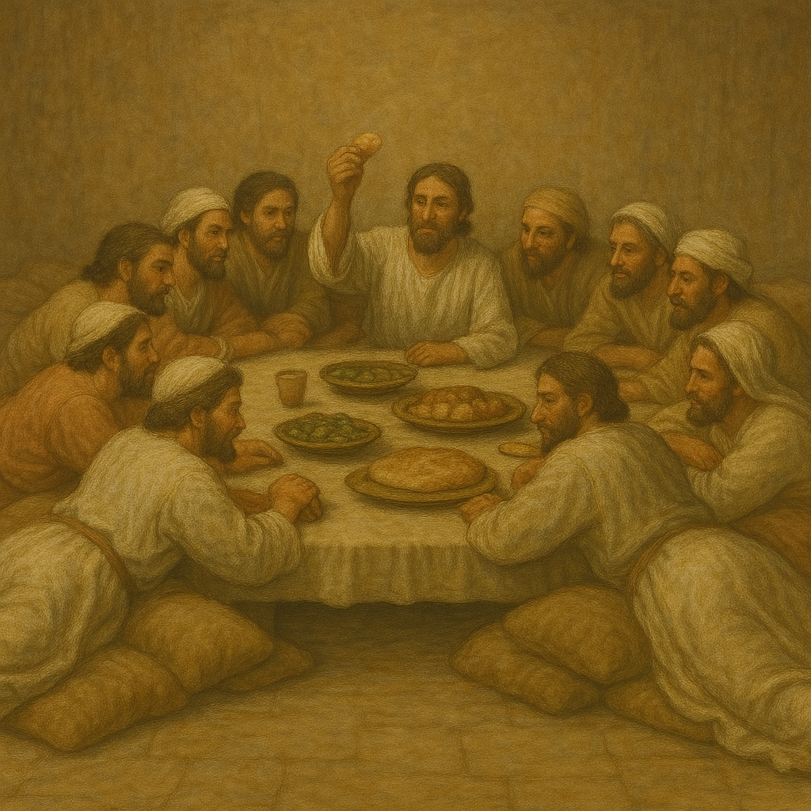

# Human-made Things in the Bible

## License Information

Human-made Things in the Bible © United Bible Societies, 2025. Adapted from: <cite>The Works of Their Hands: Man-made Things in the Bible</cite>, by Ray Pritz © 2009 United Bible Societies. This work is licensed under Creative Commons Attribution-ShareAlike 4.0 International (<a href="https://creativecommons.org/licenses/by-sa/4.0/">https://creativecommons.org/licenses/by-sa/4.0/</a>).

--------------------------------

## Table for eating (id: REALIA:5.7)

5\.7 Table for eating
=====================

References:
-----------

Hebrew מֵסַב (mesav)

[SNG 1:12](https://ref.ly/Song1:12)

Hebrew שֻׁלְחָן (shulchan)

[EXO 25:23](https://ref.ly/Exod25:23), [EXO 25:27](https://ref.ly/Exod25:27), [EXO 25:28](https://ref.ly/Exod25:28), [EXO 25:30](https://ref.ly/Exod25:30), [EXO 26:35](https://ref.ly/Exod26:35), [EXO 26:35](https://ref.ly/Exod26:35), [EXO 26:35](https://ref.ly/Exod26:35), [EXO 30:27](https://ref.ly/Exod30:27), [EXO 31:8](https://ref.ly/Exod31:8), [EXO 35:13](https://ref.ly/Exod35:13), [EXO 37:10](https://ref.ly/Exod37:10), [EXO 37:14](https://ref.ly/Exod37:14), [EXO 37:15](https://ref.ly/Exod37:15), [EXO 37:16](https://ref.ly/Exod37:16), [EXO 39:36](https://ref.ly/Exod39:36), [EXO 40:4](https://ref.ly/Exod40:4), [EXO 40:22](https://ref.ly/Exod40:22), [EXO 40:24](https://ref.ly/Exod40:24), [LEV 24:6](https://ref.ly/Lev24:6), [NUM 3:31](https://ref.ly/Num3:31), [NUM 4:7](https://ref.ly/Num4:7), [JDG 1:7](https://ref.ly/Judg1:7), [1SA 20:29](https://ref.ly/1Sam20:29), [1SA 20:34](https://ref.ly/1Sam20:34), [2SA 9:7](https://ref.ly/2Sam9:7), [2SA 9:10](https://ref.ly/2Sam9:10), [2SA 9:11](https://ref.ly/2Sam9:11), [2SA 9:13](https://ref.ly/2Sam9:13), [2SA 19:29](https://ref.ly/2Sam19:29), [1KI 2:7](https://ref.ly/1Kgs2:7), [1KI 5:7](https://ref.ly/1Kgs5:7), [1KI 7:48](https://ref.ly/1Kgs7:48), [1KI 10:5](https://ref.ly/1Kgs10:5), [1KI 13:20](https://ref.ly/1Kgs13:20), [1KI 18:19](https://ref.ly/1Kgs18:19), [2KI 4:10](https://ref.ly/2Kgs4:10), [1CH 28:16](https://ref.ly/1Chr28:16), [1CH 28:16](https://ref.ly/1Chr28:16), [1CH 28:16](https://ref.ly/1Chr28:16), [1CH 28:16](https://ref.ly/1Chr28:16), [2CH 4:8](https://ref.ly/2Chr4:8), [2CH 4:19](https://ref.ly/2Chr4:19), [2CH 9:4](https://ref.ly/2Chr9:4), [2CH 13:11](https://ref.ly/2Chr13:11), [2CH 29:18](https://ref.ly/2Chr29:18), [NEH 5:17](https://ref.ly/Neh5:17), [JOB 36:16](https://ref.ly/Job36:16), [PSA 23:5](https://ref.ly/Ps23:5), [PSA 69:23](https://ref.ly/Ps69:23), [PSA 78:19](https://ref.ly/Ps78:19), [PSA 128:3](https://ref.ly/Ps128:3), [PRO 9:2](https://ref.ly/Prov9:2), [ISA 21:5](https://ref.ly/Isa21:5), [ISA 28:8](https://ref.ly/Isa28:8), [ISA 65:11](https://ref.ly/Isa65:11), [EZK 23:41](https://ref.ly/Ezek23:41), [EZK 39:20](https://ref.ly/Ezek39:20), [EZK 40:39](https://ref.ly/Ezek40:39), [EZK 40:39](https://ref.ly/Ezek40:39), [EZK 40:40](https://ref.ly/Ezek40:40), [EZK 40:40](https://ref.ly/Ezek40:40), [EZK 40:41](https://ref.ly/Ezek40:41), [EZK 40:41](https://ref.ly/Ezek40:41), [EZK 40:41](https://ref.ly/Ezek40:41), [EZK 40:42](https://ref.ly/Ezek40:42), [EZK 40:43](https://ref.ly/Ezek40:43), [EZK 41:22](https://ref.ly/Ezek41:22), [EZK 44:16](https://ref.ly/Ezek44:16), [DAN 11:27](https://ref.ly/Dan11:27), [MAL 1:7](https://ref.ly/Mal1:7), [MAL 1:12](https://ref.ly/Mal1:12)

Greek κατακλίνω (kataklinō (verb))

[LUK 7:36](https://ref.ly/Luke7:36), [LUK 24:30](https://ref.ly/Luke24:30), [JDT 12:15](https://ref.ly/Jdt12:15)

Greek τράπεζα (trapeza)

[MAT 15:27](https://ref.ly/Matt15:27), [MRK 7:28](https://ref.ly/Mark7:28), [LUK 16:21](https://ref.ly/Luke16:21), [LUK 22:21](https://ref.ly/Luke22:21), [LUK 22:30](https://ref.ly/Luke22:30), [ACT 6:2](https://ref.ly/Acts6:2), [ACT 16:34](https://ref.ly/Acts16:34), [ROM 11:9](https://ref.ly/Rom11:9), [1CO 10:21](https://ref.ly/1Cor10:21), [1CO 10:21](https://ref.ly/1Cor10:21), [ESG 4:17](https://ref.ly/EsthGr4:17), [SIR 6:10](https://ref.ly/Sir6:10), [SIR 14:10](https://ref.ly/Sir14:10), [SIR 29:26](https://ref.ly/Sir29:26), [SIR 31:12](https://ref.ly/Sir31:12), [SIR 40:29](https://ref.ly/Sir40:29), [BEL 1:18](https://ref.ly/Bel1:18), [1MA 1:22](https://ref.ly/1Macc1:22), [1MA 4:49](https://ref.ly/1Macc4:49), [1MA 4:51](https://ref.ly/1Macc4:51)

Latin mensa

[2ES 9:19](https://ref.ly/2Esd9:19)

Description and usage:
----------------------

*Family eating at a low table (Matson Collection, Library of Congress, Public domain)*

Meals were eaten from a mat or low table. The mat could be made of straw or an animal skin. The low table stood only about 30 centimeters (12 inches) high.

---

Translation:
------------

The Hebrew word *shulchan* (literally “a thing thrown”) originally referred to a straw mat or animal skin spread on the ground. People sat on the ground or reclined on one side. By New Testament times, people ate while lying on their side next to a low table. Normally a person reclined on the left side, leaning on the left elbow and eating with the right hand. The knees were bent with the feet behind the back. While Jesus was in this position, the woman in [LUK 7:36](https://ref.ly/Luke7:36); [LUK 7:37](https://ref.ly/Luke7:37); [LUK 7:38](https://ref.ly/Luke7:38) was able to perfume his feet from behind him while he was eating. This would have been an almost impossible action if he had been seated in a chair. In this passage an explanatory note may be appropriate. In most of the other passages listed above, a common word for “table” will be adequate since the exact structure will be unimportant.

A higher table, at which a person could sit in a chair, was also known in ancient times. Such tables often had three legs, two on one side and one opposite, giving the table stability on uneven surfaces. In fact, the Greek word *trapeza* means “three legs.” Such tables, however, were used for purposes other than eating.

For the Hebrew word *shulchan* used with the sense of “altar,” see [4\.2\.3 Temple altar\<REALIA:4\.2\.3\>](#) and [4\.2\.4 Incense altar\<REALIA:4\.2\.4\>](#).

For the Hebrew word *mesav* in [SNG 1:12](https://ref.ly/Song1:12), see the comments at [5\.5 Bed, sleeping mat\<REALIA:5\.5\>](#) above.

In a number of New Testament passages, the word “table” is used in a phrase in which the focus is on what happens at a table rather than on the table itself. Thus, for example, “eat and drink at my table” ([LUK 22:30](https://ref.ly/Luke22:30); RSV (Revised Standard Version (1952))) may be rendered “eat and drink with me” (CEV (Contemporary English Version)); “to serve tables” ([ACT 6:2](https://ref.ly/Acts6:2); RSV (Revised Standard Version (1952))) may be “to assist in the distribution” (REB (Revised English Bible (1989))) or “to handle finances” (GNT (Good News Translation (1992))); and “You cannot partake of the table of the Lord and the table of demons” ([1CO 10:21](https://ref.ly/1Cor10:21); RSV (Revised Standard Version (1952))) may be “You cannot participate at the same time in the Lord’s meal and in the meals of evil spirits” (PV).

In [LUK 7:36](https://ref.ly/Luke7:36) most English translations consulted use the word “table” in some phrase like “sat down at table.” It is possible, however, to avoid introducing the table. CEV (Contemporary English Version) has “got ready to eat.”

* **Associated Passages:** Song of Songs 1:12; Exodus 25:23; Exodus 25:27; Exodus 25:28; Exodus 25:30; Exodus 26:35; Exodus 30:27; Exodus 31:8; Exodus 35:13; Exodus 37:10; Exodus 37:14; Exodus 37:15; Exodus 37:16; Exodus 39:36; Exodus 40:4; Exodus 40:22; Exodus 40:24; Leviticus 24:6; Numbers 3:31; Numbers 4:7; Judges 1:7; 1 Samuel 20:29; 1 Samuel 20:34; 2 Samuel 9:7; 2 Samuel 9:10; 2 Samuel 9:11; 2 Samuel 9:13; 2 Samuel 19:29; 1 Kings 2:7; 1 Kings 5:7; 1 Kings 7:48; 1 Kings 10:5; 1 Kings 13:20; 1 Kings 18:19; 2 Kings 4:10; 1 Chronicles 28:16; 2 Chronicles 4:8; 2 Chronicles 4:19; 2 Chronicles 9:4; 2 Chronicles 13:11; 2 Chronicles 29:18; Nehemiah 5:17; Job 36:16; Psalms 23:5; Psalms 69:23; Psalms 78:19; Psalms 128:3; Proverbs 9:2; Isaiah 21:5; Isaiah 28:8; Isaiah 65:11; Ezekiel 23:41; Ezekiel 39:20; Ezekiel 40:39; Ezekiel 40:40; Ezekiel 40:41; Ezekiel 40:42; Ezekiel 40:43; Ezekiel 41:22; Ezekiel 44:16; Daniel 11:27; Malachi 1:7; Malachi 1:12; Luke 7:36; Luke 24:30; Judith 12:15; Matthew 15:27; Mark 7:28; Luke 16:21; Luke 22:21; Luke 22:30; Acts 6:2; Acts 16:34; Romans 11:9; 1 Corinthians 10:21; Esther Greek 4:17; Sirach 6:10; Sirach 14:10; Sirach 29:26; Sirach 31:12; Sirach 40:29; Bel and the Dragon 1:18; 1 Maccabees 1:22; 1 Maccabees 4:49; 1 Maccabees 4:51; 2 Esdras (Latin) 9:19; Luke 7:37; Luke 7:38

