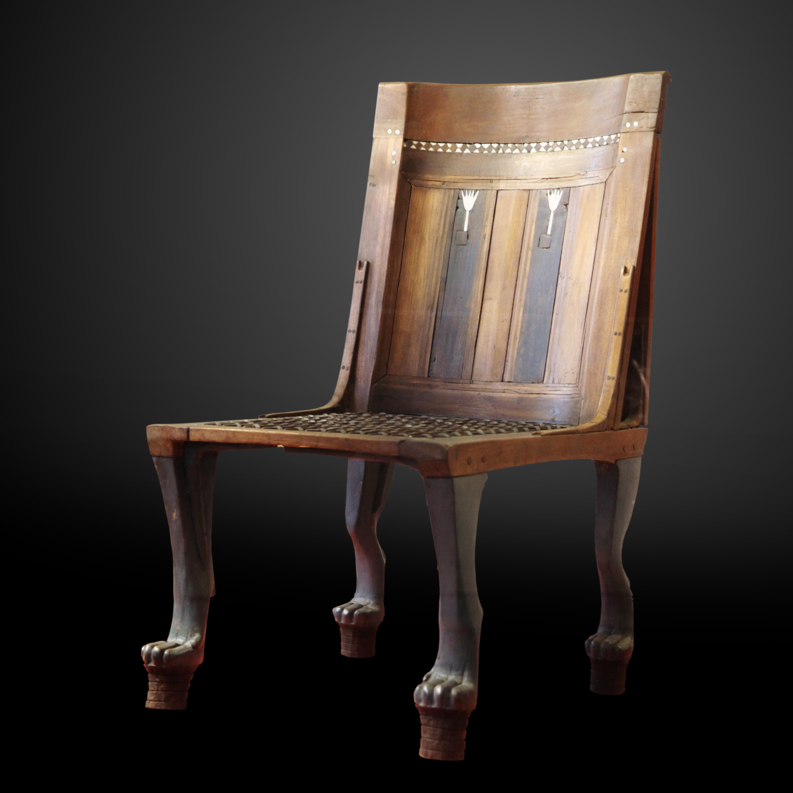

# Human-made Things in the Bible

## License Information

Human-made Things in the Bible © United Bible Societies, 2025. Adapted from: <cite>The Works of Their Hands: Man-made Things in the Bible</cite>, by Ray Pritz © 2009 United Bible Societies. This work is licensed under Creative Commons Attribution-ShareAlike 4.0 International (<a href="https://creativecommons.org/licenses/by-sa/4.0/">https://creativecommons.org/licenses/by-sa/4.0/</a>).

--------------------------------

## Chair, seat (id: REALIA:5.9)

5\.9 Chair, seat
================

References:
-----------

Hebrew כִסֵּא (kise’)

[JDG 3:20](https://ref.ly/Judg3:20), [1SA 1:9](https://ref.ly/1Sam1:9), [1SA 2:8](https://ref.ly/1Sam2:8), [1SA 4:13](https://ref.ly/1Sam4:13), [1SA 4:18](https://ref.ly/1Sam4:18), [1KI 2:19](https://ref.ly/1Kgs2:19), [1KI 2:19](https://ref.ly/1Kgs2:19), [2KI 4:10](https://ref.ly/2Kgs4:10), [EST 3:1](https://ref.ly/Esth3:1), [PRO 9:14](https://ref.ly/Prov9:14)

Hebrew מוֹשָׁב (moshav)

[1SA 20:18](https://ref.ly/1Sam20:18), [1SA 20:25](https://ref.ly/1Sam20:25), [1SA 20:25](https://ref.ly/1Sam20:25), [JOB 29:7](https://ref.ly/Job29:7), [PSA 1:1](https://ref.ly/Ps1:1), [EZK 8:3](https://ref.ly/Ezek8:3), [EZK 28:2](https://ref.ly/Ezek28:2)

Hebrew תְּכוּנָה (tkunah)

[JOB 23:3](https://ref.ly/Job23:3)

Greek καθέδρα (kathedra)

[MAT 21:12](https://ref.ly/Matt21:12), [MAT 23:2](https://ref.ly/Matt23:2), [MRK 11:15](https://ref.ly/Mark11:15), [SIR 7:4](https://ref.ly/Sir7:4), [SIR 12:12](https://ref.ly/Sir12:12)

Greek πρωτοκαθεδρία (prōtokathedria)

[MAT 23:6](https://ref.ly/Matt23:6), [MRK 12:39](https://ref.ly/Mark12:39), [LUK 11:43](https://ref.ly/Luke11:43), [LUK 20:46](https://ref.ly/Luke20:46)

Description and usage:
----------------------

*Chair without a back (Ashurnasirpal II, wall relief from Nimrud, Iraq, 9th c. BCE, British Museum) (Anthony Huan, CC BY\-SA 2\.0, via Wikimedia Commons)*

The chair was an object on which a person sat. Chairs differed widely in shape and materials. Most often they were made of a wooden or cane frame with the seat woven of reeds or made of wood. Sometimes the chair had a back, sometimes not. See also [1\.10\.1 Throne\<REALIA:1\.10\.1\>](#).

---

Translation:
------------

*Chair with a back (Egypt, between 1550 and 1186 BCE, Louvre) (© Rama, CC BY\-SA 3\.0 FR, via Wikimedia Commons)*

All cultures have words for places to sit. In most of the references above, the object on which a person sits is not specifically described, and usually a generic word for “seat” is to be preferred.

[JOB 23:3](https://ref.ly/Job23:3): The Hebrew word *tkunah* means literally “prepared place.” Older translations, such as RSV (Revised Standard Version (1952)) and KJV (King James Version (1611)), have “seat” (and Luther even has “throne”). Most modern translations prefer something like “where \[he] is” (GNT (Good News Translation (1992))) or “dwelling” (NIV (New International Version (1984))).

In [MAT 23:2](https://ref.ly/Matt23:2) the phrase “seat of Moses” carries a double meaning. On the one hand, there was in many synagogues a stylized chair, usually made of stone, which was called by this very name. Examples of this chair have been found by archaeologists. On the other hand, the chair symbolized the authority to make religious rulings. To “sit on the seat of Moses” meant holding a position of authority. It is this latter meaning that is the more important in the words of Jesus. Most English translations prefer a literal rendering of the text, but a dynamic translation is to be preferred. The following renderings are ways in which this has been done:

“have inherited the authority of Moses” (Brc);

“speak with the authority of Moses” (Phps (J.B. Phillips: The New Testament in Modern English (1958)));

“teach with Moses’ authority” (GW (God's Word Translation));

“are the authorized interpreters of Moses’ Law” (GNT (Good News Translation (1992)));

“have the authority to tell you what the law of Moses says” (NCV (New Century Version));

“are experts in the Law of Moses” (CEV (Contemporary English Version)).

The Greek word *prōtokathedria* refers to a position or place of particular importance, implying special status to the person occupying it. Here the important element is not the structure of the seat but rather the honor which having that seat gives to a person. Many cultures have a special word for such a seat of honor. If such a word does not carry with it pagan overtones, it should be used. English translations find several appropriate renderings: “most important seats” (NIV (New International Version (1984)), NCV (New Century Version)), “best seats” (RSV (Revised Standard Version (1952))), “reserved seats” (GNT (Good News Translation (1992))), and even “front seats” (CEV (Contemporary English Version)).

* **Associated Passages:** Judges 3:20; 1 Samuel 1:9; 1 Samuel 2:8; 1 Samuel 4:13; 1 Samuel 4:18; 1 Kings 2:19; 2 Kings 4:10; Esther 3:1; Proverbs 9:14; 1 Samuel 20:18; 1 Samuel 20:25; Job 29:7; Psalms 1:1; Ezekiel 8:3; Ezekiel 28:2; Job 23:3; Matthew 21:12; Matthew 23:2; Mark 11:15; Sirach 7:4; Sirach 12:12; Matthew 23:6; Mark 12:39; Luke 11:43; Luke 20:46

