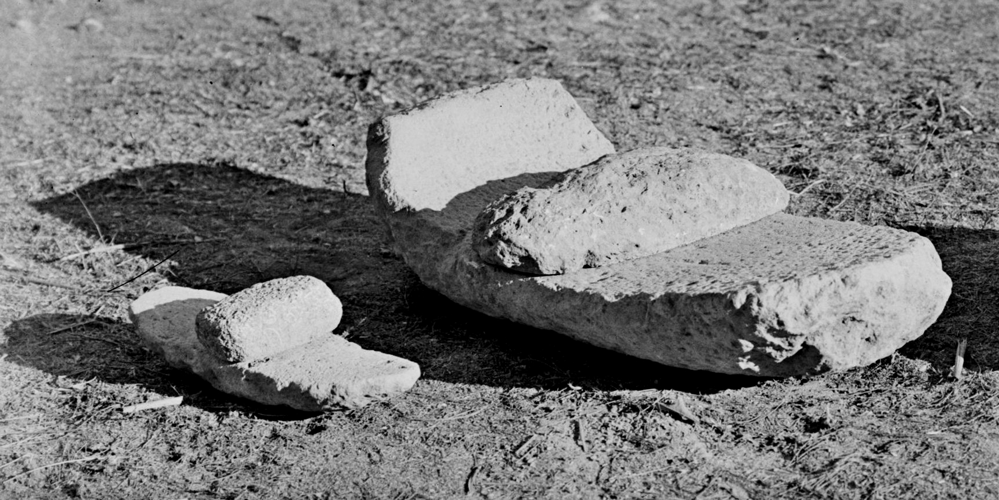
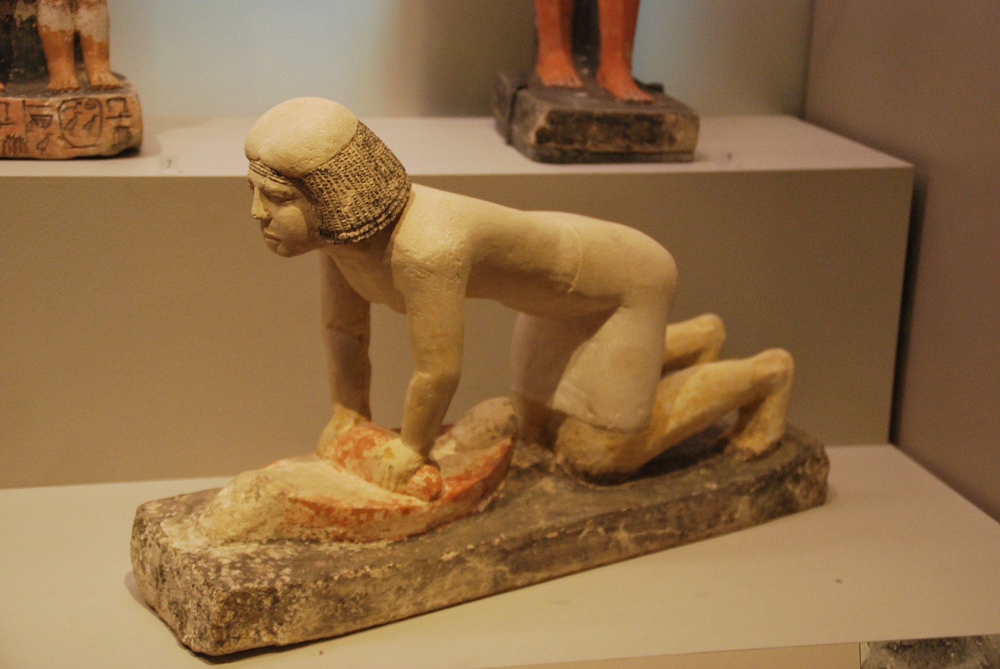

# Human-made Things in the Bible

## License Information

Human-made Things in the Bible © United Bible Societies, 2025. Adapted from: <cite>The Works of Their Hands: Man-made Things in the Bible</cite>, by Ray Pritz © 2009 United Bible Societies. This work is licensed under Creative Commons Attribution-ShareAlike 4.0 International (<a href="https://creativecommons.org/licenses/by-sa/4.0/">https://creativecommons.org/licenses/by-sa/4.0/</a>).

--------------------------------

## Millstones, mill (id: REALIA:5.10)

5\.10 Millstones, mill
======================

References:
-----------

Hebrew פֶּלַח (pelach)

[JDG 9:53](https://ref.ly/Judg9:53), [2SA 11:21](https://ref.ly/2Sam11:21), [JOB 41:16](https://ref.ly/Job41:16)

Hebrew רֵחַיִם (rechayim)

[EXO 11:5](https://ref.ly/Exod11:5), [NUM 11:8](https://ref.ly/Num11:8), [DEU 24:6](https://ref.ly/Deut24:6), [ISA 47:2](https://ref.ly/Isa47:2), [JER 25:10](https://ref.ly/Jer25:10)

Hebrew רֶכֶב (rekev)

[DEU 24:6](https://ref.ly/Deut24:6), [JDG 9:53](https://ref.ly/Judg9:53), [2SA 11:21](https://ref.ly/2Sam11:21)

Greek μυλικός (mulikos)

[LUK 17:2](https://ref.ly/Luke17:2)

Greek μύλινος (mulinos)

[REV 18:21](https://ref.ly/Rev18:21)

Greek μύλος (mulos)

[MAT 18:6](https://ref.ly/Matt18:6), [MAT 24:41](https://ref.ly/Matt24:41), [MRK 9:42](https://ref.ly/Mark9:42), [REV 18:22](https://ref.ly/Rev18:22)

Description and usage:
----------------------

*Handmill (Matson Collection, Library of Congress, Public domain, via Wikimedia Commons)*

*Handmill (Gary Todd, Israel Museum, CC0, via Wikimedia Commons)*

 The mill was two flat stones between which grain was ground into flour by scraping the top stone against the bottom one. In Old Testament times the normal mill was relatively small and operated by hand. The grain was placed on the stationary bottom stone, and the top stone was pressed down on top of the grain and scraped back and forth to grind the grain into flour. The work of grinding was normally done by women in the early hours of the morning before sunrise. It was hard work and took a lot of time. It is estimated that to produce enough flour to make bread for a family of five, a woman would have needed to grind for over three hours each day. The sound of grinding in the early hours by the light of an oil lamp symbolized stability and security. [JER 25:10](https://ref.ly/Jer25:10) describes the tragedy that is to come upon the people of Judah when Jeremiah quotes God as saying “I will remove from them … the sound of the millstone and the light of the lamp.”

*Woman grinding with a handmill (© Marcus Cyron, CC BY 3\.0, via Wikimedia Commons)*

The same type of mill continued in use in New Testament times, but round millstones also came into use. With this type of mill, the upper stone and the lower stone were essentially the same size, and the upper stone was rotated on the lower stone. Grain was poured into this type of mill through a hole in the center of the upper stone, and the flour gradually emerged from around the edges of the two stones. Some of these mills were relatively small and operated by hand. Others, however, were quite large, and animals were used to rotate the upper stone.

In many parts of the world, grain is ground in one way or another. Quite frequently mills are of the same general structure as those used in ancient times, in which two relatively large, flat stones were placed one on top of the other, and the grain was ground between the two stones. In some parts of the world, a mortar and pestle are used for the grinding or pounding of grain.

---

Translation:
------------

Frequently the word “millstones” may be rendered “stones for grinding grain.” In other instances, even a more generic expression may be used, for example, “large stones.” In most contexts what is important is either the large size of the stones or the function of grinding grain, not necessarily the particular form of the mill. However, in the context that speaks about tying a millstone to a man’s neck and his being thrown into the depths of the sea ([MAT 18:6](https://ref.ly/Matt18:6); [MRK 9:42](https://ref.ly/Mark9:42); [LUK 17:2](https://ref.ly/Luke17:2)), it is important to refer to relatively large stones that would cause a person to sink immediately. In such a context the use of a term for “mortar,” especially one of wood, would hardly be appropriate since it would normally float.

*Woman grinding with a handmill (© Marcus Cyron, CC BY 3\.0, via Wikimedia Commons)*

The Hebrew word *pelach* refers to one of the two stones of the Old Testament type of hand mill. In [JDG 9:53](https://ref.ly/Judg9:53) and [2SA 11:21](https://ref.ly/2Sam11:21) it is the upper stone (*pelach rekev* in Hebrew), while in [JOB 41:16](https://ref.ly/Job41:16) it is the lower stone (*pelach tachtith*).

* **Associated Passages:** Judges 9:53; 2 Samuel 11:21; Job 41:16; Exodus 11:5; Numbers 11:8; Deuteronomy 24:6; Isaiah 47:2; Jeremiah 25:10; Luke 17:2; Revelation 18:21; Matthew 18:6; Matthew 24:41; Mark 9:42; Revelation 18:22

