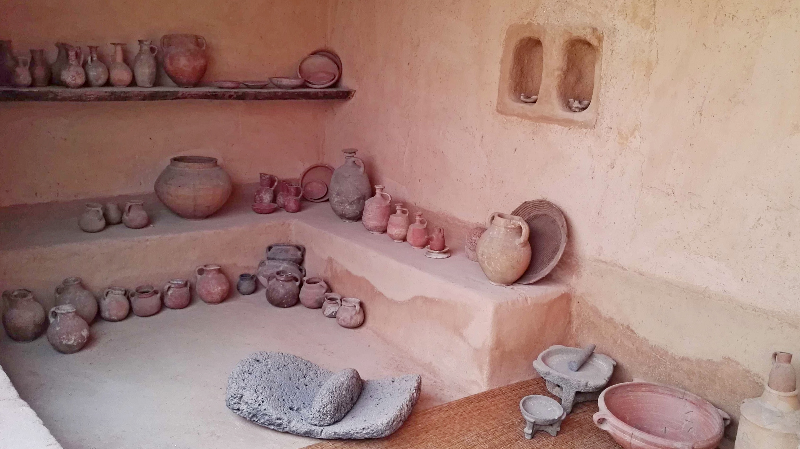
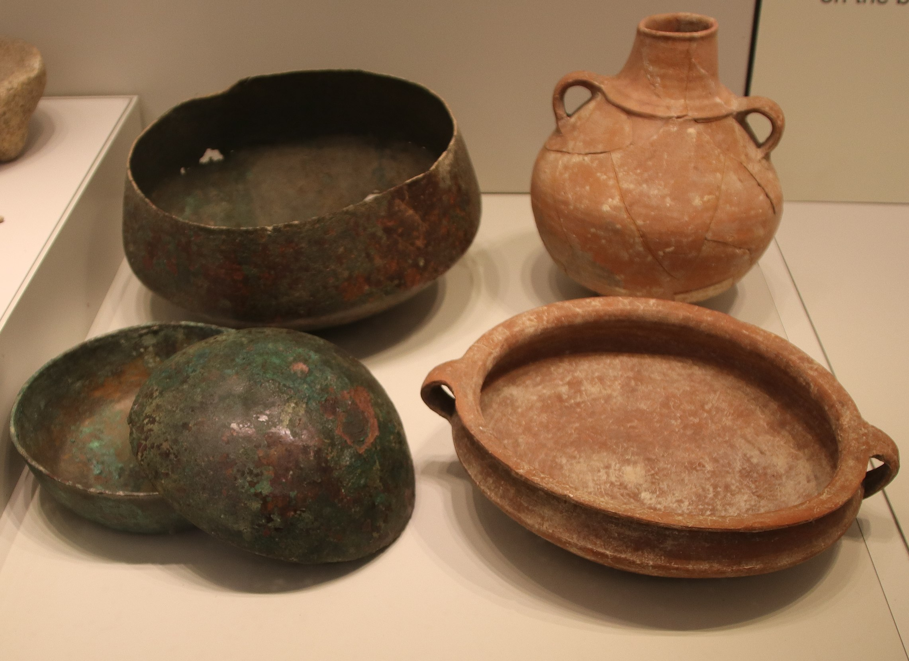

# Human-made Things in the Bible

## License Information

Human-made Things in the Bible © United Bible Societies, 2025. Adapted from: <cite>The Works of Their Hands: Man-made Things in the Bible</cite>, by Ray Pritz © 2009 United Bible Societies. This work is licensed under Creative Commons Attribution-ShareAlike 4.0 International (<a href="https://creativecommons.org/licenses/by-sa/4.0/">https://creativecommons.org/licenses/by-sa/4.0/</a>).

--------------------------------

## Cooking pot, kettle (id: REALIA:5.12)

5\.12 Cooking pot, kettle
=========================

References:
-----------

Hebrew דּוּד (dud)

[1SA 2:14](https://ref.ly/1Sam2:14), [2CH 35:13](https://ref.ly/2Chr35:13), [JOB 41:12](https://ref.ly/Job41:12)

Hebrew כִּיּוֹר (kiyor)

[1SA 2:14](https://ref.ly/1Sam2:14)

Hebrew כְּלִי (kli)

[LEV 6:21](https://ref.ly/Lev6:21)

Hebrew סִיר (sir)

[EXO 16:3](https://ref.ly/Exod16:3), [EXO 27:3](https://ref.ly/Exod27:3), [EXO 38:3](https://ref.ly/Exod38:3), [1KI 7:45](https://ref.ly/1Kgs7:45), [2KI 4:38](https://ref.ly/2Kgs4:38), [2KI 4:39](https://ref.ly/2Kgs4:39), [2KI 4:40](https://ref.ly/2Kgs4:40), [2KI 4:41](https://ref.ly/2Kgs4:41), [2KI 4:41](https://ref.ly/2Kgs4:41), [2KI 25:14](https://ref.ly/2Kgs25:14), [2CH 4:11](https://ref.ly/2Chr4:11), [2CH 4:16](https://ref.ly/2Chr4:16), [2CH 35:13](https://ref.ly/2Chr35:13), [JOB 41:23](https://ref.ly/Job41:23), [PSA 58:10](https://ref.ly/Ps58:10), [PSA 60:10](https://ref.ly/Ps60:10), [PSA 108:10](https://ref.ly/Ps108:10), [ECC 7:6](https://ref.ly/Eccl7:6), [JER 1:13](https://ref.ly/Jer1:13), [JER 52:18](https://ref.ly/Jer52:18), [JER 52:19](https://ref.ly/Jer52:19), [EZK 11:3](https://ref.ly/Ezek11:3), [EZK 11:7](https://ref.ly/Ezek11:7), [EZK 11:11](https://ref.ly/Ezek11:11), [EZK 24:3](https://ref.ly/Ezek24:3), [EZK 24:6](https://ref.ly/Ezek24:6), [MIC 3:3](https://ref.ly/Mic3:3), [ZEC 14:20](https://ref.ly/Zech14:20), [ZEC 14:21](https://ref.ly/Zech14:21)

Hebrew פָּרוּר (parur)

[NUM 11:8](https://ref.ly/Num11:8), [JDG 6:19](https://ref.ly/Judg6:19), [1SA 2:14](https://ref.ly/1Sam2:14)

Hebrew צַלַּחַת (tsalachath)

[2CH 35:13](https://ref.ly/2Chr35:13)

Hebrew קַלַּחַת (qalachath)

[1SA 2:14](https://ref.ly/1Sam2:14), [MIC 3:3](https://ref.ly/Mic3:3)

Greek λέβης (lebēs)

[SIR 13:2](https://ref.ly/Sir13:2), [1ES 1:13](https://ref.ly/1Esd1:13), [2MA 7:3](https://ref.ly/2Macc7:3), [4MA 8:13](https://ref.ly/4Macc8:13), [4MA 12:1](https://ref.ly/4Macc12:1), [4MA 18:20](https://ref.ly/4Macc18:20)

Greek ξέστης (xestēs)

[MRK 7:4](https://ref.ly/Mark7:4)

Greek τήγανον (tēganon)

[2MA 7:3](https://ref.ly/2Macc7:3), [2MA 7:5](https://ref.ly/2Macc7:5), [4MA 8:13](https://ref.ly/4Macc8:13), [4MA 12:10](https://ref.ly/4Macc12:10), [4MA 12:19](https://ref.ly/4Macc12:19)

Greek χαλκεῖον, χαλκίον (chalkeion, chalkion)

[MRK 7:4](https://ref.ly/Mark7:4), [1ES 1:13](https://ref.ly/1Esd1:13)

Greek χύτρα (chutra)

[SIR 13:2](https://ref.ly/Sir13:2)

Description and usage:
----------------------

*Ceramic cooking and storage pots (© Bukvoed, CC BY 4\.0, via Wikimedia Commons)*

The cooking pot was a deep container made of metal or fired earthenware. It was filled with water and placed over a fire. Food was boiled in the water.

---

Translation:
------------

All cultures know some kind of pot for cooking. A distinction will usually need to be made between a flat cooking pan and one that is deeper and is used to boil liquids. The latter is intended here.

In [1SA 2:14](https://ref.ly/1Sam2:14) and [2CH 35:13](https://ref.ly/2Chr35:13) several words for cooking vessels are listed in a series. It is possible to use an inclusive term rather than try to find separate words for each one; for example, for the list of four containers in [1SA 2:14](https://ref.ly/1Sam2:14), GNT (Good News Translation (1992)) and CEV (Contemporary English Version) have simply “cooking pot.”

*Metal and ceramic cooking pots (Gary Todd, Israel Museum, CC0, via Wikimedia Commons)*

[JOB 41:23](https://ref.ly/Job41:23) (following comments adapted from *A Handbook on The Book of Job*): The second line of this verse is literally “like a blown pot and rushes.” RSV (Revised Standard Version (1952)), NIV (New International Version (1984)), and GNT (Good News Translation (1992)) all have somewhat different translations, since, as in [JER 1:13](https://ref.ly/Jer1:13), “a boiling pot” is literally “a blown pot,” suggesting that it means a pot under which the flame is blown so that its contents boil from the increased heat. RSV (Revised Standard Version (1952)) interprets the “rushes” as “burning rushes,” while GNT (Good News Translation (1992)) describes the smoke pouring out of Leviathan’s nose as being “like smoke from weeds burning under a pot.” The word “weeds” is a shift to a more general term. The GNT (Good News Translation (1992)) rendering is not a very close translation of the Hebrew. NIV (New International Version (1984)) apparently likens the smoke from Leviathan’s nostrils to the vapor “from a boiling pot over a fire of reeds.” This represents the Hebrew more closely than either RSV (Revised Standard Version (1952)) or GNT (Good News Translation (1992)), but it is doubtful whether the reeds are really part of the picture in the writer’s mind. A more satisfactory translation for the whole verse is “Smoke pours forth from his snout as from a boiling cooking pot.”

[PSA 58:10](https://ref.ly/Ps58:10): The Hebrew of this verse is particularly difficult. Refer to *A Handbook on Psalms*, page 519\.

In [MRK 7:4](https://ref.ly/Mark7:4) the vessels in question were kitchen tools, used in preparing or serving food. Most modern translations render the Greek word *chalkion* here as “pots” (NCV (New Century Version)) or “bowls” (CEV (Contemporary English Version)). In a number of languages the most natural equivalent for this word is “metal vessel” or “kettle.”

In [2MA 7:3](https://ref.ly/2Macc7:3) the Greek words *lebēs* and *tēganon* occur together. The *lebēs* seems to have involved boiling water, so it may be rendered “caldrons” (RSV (Revised Standard Version (1952))) or “kettles” (GNT (Good News Translation (1992))). The *tēganon* was for cooking without water, that is, frying. In this context both implements would have been very large, so REB (Revised English Bible (1989)) renders *tēganon* as “great pans,” and GNT (Good News Translation (1992)) has “huge pans.”

* **Associated Passages:** 1 Samuel 2:14; 2 Chronicles 35:13; Job 41:12; Leviticus 6:21; Exodus 16:3; Exodus 27:3; Exodus 38:3; 1 Kings 7:45; 2 Kings 4:38; 2 Kings 4:39; 2 Kings 4:40; 2 Kings 4:41; 2 Kings 25:14; 2 Chronicles 4:11; 2 Chronicles 4:16; Job 41:23; Psalms 58:10; Psalms 60:10; Psalms 108:10; Ecclesiastes 7:6; Jeremiah 1:13; Jeremiah 52:18; Jeremiah 52:19; Ezekiel 11:3; Ezekiel 11:7; Ezekiel 11:11; Ezekiel 24:3; Ezekiel 24:6; Micah 3:3; Zechariah 14:20; Zechariah 14:21; Numbers 11:8; Judges 6:19; Sirach 13:2; 1 Esdras (Greek) 1:13; 2 Maccabees 7:3; 4 Maccabees 8:13; 4 Maccabees 12:1; 4 Maccabees 18:20; Mark 7:4; 2 Maccabees 7:5; 4 Maccabees 12:10; 4 Maccabees 12:19

