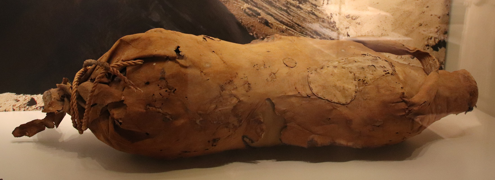

# Human-made Things in the Bible

## License Information

Human-made Things in the Bible © United Bible Societies, 2025. Adapted from: <cite>The Works of Their Hands: Man-made Things in the Bible</cite>, by Ray Pritz © 2009 United Bible Societies. This work is licensed under Creative Commons Attribution-ShareAlike 4.0 International (<a href="https://creativecommons.org/licenses/by-sa/4.0/">https://creativecommons.org/licenses/by-sa/4.0/</a>).

--------------------------------

## Wineskin, water bag (id: REALIA:5.15)

5\.15 Wineskin, water bag
=========================

References:
-----------

Hebrew אוֹב (’ov)

[JOB 32:19](https://ref.ly/Job32:19)

Hebrew חֵמֶת (chemeth)

[GEN 21:15](https://ref.ly/Gen21:15), [GEN 21:19](https://ref.ly/Gen21:19), [HAB 2:15](https://ref.ly/Hab2:15)

Hebrew נֹאד (no’d)

[JOS 9:4](https://ref.ly/Josh9:4), [JOS 9:13](https://ref.ly/Josh9:13), [JDG 4:19](https://ref.ly/Judg4:19), [1SA 16:20](https://ref.ly/1Sam16:20), [PSA 56:9](https://ref.ly/Ps56:9), [PSA 119:83](https://ref.ly/Ps119:83)

Hebrew נֵבֶל (nevel)

[1SA 1:24](https://ref.ly/1Sam1:24), [1SA 10:3](https://ref.ly/1Sam10:3), [1SA 25:18](https://ref.ly/1Sam25:18), [2SA 16:1](https://ref.ly/2Sam16:1), [JOB 38:37](https://ref.ly/Job38:37), [JER 13:12](https://ref.ly/Jer13:12), [JER 13:12](https://ref.ly/Jer13:12), [JER 48:12](https://ref.ly/Jer48:12)

Greek ἀσκοπυτίνη (askoputinē)

[JDT 10:5](https://ref.ly/Jdt10:5)

Greek ἀσκός (askos)

[MAT 9:17](https://ref.ly/Matt9:17), [MAT 9:17](https://ref.ly/Matt9:17), [MAT 9:17](https://ref.ly/Matt9:17), [MAT 9:17](https://ref.ly/Matt9:17), [MRK 2:22](https://ref.ly/Mark2:22), [MRK 2:22](https://ref.ly/Mark2:22), [MRK 2:22](https://ref.ly/Mark2:22), [MRK 2:22](https://ref.ly/Mark2:22), [LUK 5:37](https://ref.ly/Luke5:37), [LUK 5:37](https://ref.ly/Luke5:37), [LUK 5:37](https://ref.ly/Luke5:37), [LUK 5:38](https://ref.ly/Luke5:38)

Description:
------------

*Wineskin (Image generated by ChatGPT using OpenAI technology)*

The wineskin or water bag was a bag made of skin or leather. Normally the skin of a goat or a sheep was used, although the skin of an ox or a camel was also possible. The skin was removed from the animal by separating it at the neck and then pulling it back whole over the body, and the skin was tanned and the hair usually removed. The skin was then turned inside out and four of the five openings (neck and four legs) were tied shut.

---

Usage:
------

*An animal skin was used to hold liquids, typically water or wine (Gary Todd, Israel Museum, CC0, via Wikimedia Commons)*

The bag was used to contain liquids, primarily wine or water. The skin was only a temporary storage vessel since the leather tended to spoil the taste of the liquid.

---

Translation:
------------

The Hebrew word *’ov* occurs only in [JOB 32:19](https://ref.ly/Job32:19) with the meaning “wineskin,” which is made clear in the context. See the discussion on this verse in *A Handbook on The Book of Job*, pages 601–602\.

[PSA 56:9](https://ref.ly/Ps56:9); [HAB 2:15](https://ref.ly/Hab2:15): Some authorities do not see references to wineskins in these passages. See the discussions on these verses in *A Handbook on Psalms* (pages 505–506\) and *A Handbook on The Books of Nahum, Habakkuk, and Zephaniah* (pages 105–106\).

[PSA 119:83](https://ref.ly/Ps119:83): For the first line of this verse, GNT (Good News Translation (1992)) has “I am as useless as a discarded wineskin.” In many languages this rendering will have little or no meaning. Accordingly, the translator has two choices: either to say “I am of no account,” or to use a local object instead of “wineskin,” such as a mildewed bag.

[MAT 9:17](https://ref.ly/Matt9:17); [MRK 2:22](https://ref.ly/Mark2:22); [LUK 5:37](https://ref.ly/Luke5:37); [LUK 5:38](https://ref.ly/Luke5:38): These parallel passages in the New Testament refer to “wineskins.” A number of translators have attempted to substitute “bottles” for “wineskins,” but this has not been satisfactory, since fermenting wine does not normally break glass or earthen bottles, while it would break old wineskins. In circumstances in which the use of wineskins is not known, it may be necessary to employ some kind of descriptive phrase (for example, “container made of skin,” “closed bag of skin,” or “goat skin like a bottle”) and a fuller explanation in a footnote.

* **Associated Passages:** Job 32:19; Genesis 21:15; Genesis 21:19; Habakkuk 2:15; Joshua 9:4; Joshua 9:13; Judges 4:19; 1 Samuel 16:20; Psalms 56:9; Psalms 119:83; 1 Samuel 1:24; 1 Samuel 10:3; 1 Samuel 25:18; 2 Samuel 16:1; Job 38:37; Jeremiah 13:12; Jeremiah 48:12; Judith 10:5; Matthew 9:17; Mark 2:22; Luke 5:37; Luke 5:38

* **Associated ACAI Concepts:** Skin-Bottle (ID: `realia:Skin-bottle`)
