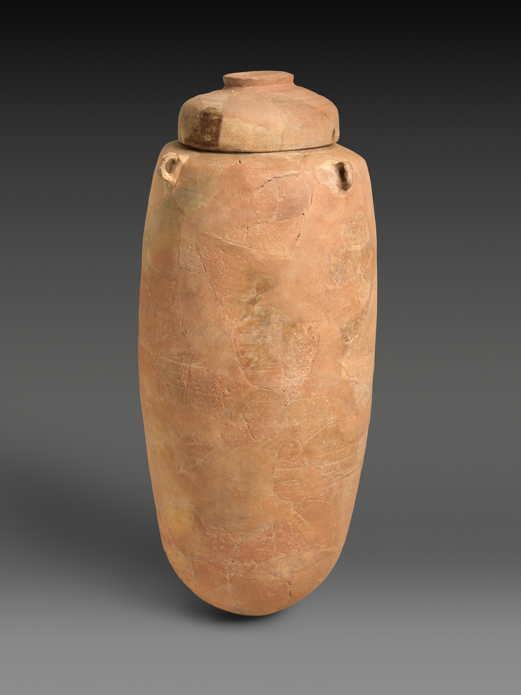

# Human-made Things in the Bible

## License Information

Human-made Things in the Bible © United Bible Societies, 2025. Adapted from: <cite>The Works of Their Hands: Man-made Things in the Bible</cite>, by Ray Pritz © 2009 United Bible Societies. This work is licensed under Creative Commons Attribution-ShareAlike 4.0 International (<a href="https://creativecommons.org/licenses/by-sa/4.0/">https://creativecommons.org/licenses/by-sa/4.0/</a>).

--------------------------------

## Clay jar (id: REALIA:5.18.1.2)

5\.18\.1\.2 Clay jar
====================

References:
-----------

Hebrew כַּד (kad)

[GEN 24:14](https://ref.ly/Gen24:14), [GEN 24:15](https://ref.ly/Gen24:15), [GEN 24:16](https://ref.ly/Gen24:16), [GEN 24:17](https://ref.ly/Gen24:17), [GEN 24:18](https://ref.ly/Gen24:18), [GEN 24:20](https://ref.ly/Gen24:20), [GEN 24:43](https://ref.ly/Gen24:43), [GEN 24:45](https://ref.ly/Gen24:45), [GEN 24:46](https://ref.ly/Gen24:46), [JDG 7:16](https://ref.ly/Judg7:16), [JDG 7:16](https://ref.ly/Judg7:16), [JDG 7:19](https://ref.ly/Judg7:19), [JDG 7:20](https://ref.ly/Judg7:20), [1KI 17:12](https://ref.ly/1Kgs17:12), [1KI 17:14](https://ref.ly/1Kgs17:14), [1KI 17:16](https://ref.ly/1Kgs17:16), [1KI 18:34](https://ref.ly/1Kgs18:34), [ECC 12:6](https://ref.ly/Eccl12:6)

Hebrew נֵבֶל (nevel)

[ISA 30:14](https://ref.ly/Isa30:14), [LAM 4:2](https://ref.ly/Lam4:2)

Hebrew צַפַּחַת (tsapachath)

[1SA 26:12](https://ref.ly/1Sam26:12), [1SA 26:16](https://ref.ly/1Sam26:16), [1KI 17:12](https://ref.ly/1Kgs17:12), [1KI 17:14](https://ref.ly/1Kgs17:14), [1KI 17:16](https://ref.ly/1Kgs17:16), [1KI 19:6](https://ref.ly/1Kgs19:6)

Greek κεράμιον (keramion)

[MRK 14:13](https://ref.ly/Mark14:13), [LUK 22:10](https://ref.ly/Luke22:10)

Greek ὑδρία (hudria)

[JHN 4:28](https://ref.ly/John4:28)

Description and usage:
----------------------

*(Image generated by ChatGPT using OpenAI technology)*

The clay jar was an earthenware vessel that was used as a storage container for liquids like wine and olive oil (see also [5\.18\.1 Containers for storage\<REALIA:5\.18\.1\>](#)). It could also be used to carry water and other liquids.

---

Translation:
------------

Unlike stone water jars (see [5\.18\.1\.1 Stone jar\<REALIA:5\.18\.1\.1\>](#)), which were intended only for the storage of water, clay jars had to be light enough when full to be carried by a woman, who normally did such work in the society of that time. While John uses the same Greek word for “jar” in 2\.6 and in 4\.28, it is clear from the context that two different kinds of vessels are intended. The woman in [JHN 4:28](https://ref.ly/John4:28) would not have been carrying a stone jar, which would have been very heavy. Most translations have “water jar” (RSV (Revised Standard Version (1952)), GNT (Good News Translation (1992))). Where a language makes a distinction between a vessel for drawing or carrying water and a vessel for drinking, a word for the former vessel should be used.

* **Associated Passages:** Genesis 24:14; Genesis 24:15; Genesis 24:16; Genesis 24:17; Genesis 24:18; Genesis 24:20; Genesis 24:43; Genesis 24:45; Genesis 24:46; Judges 7:16; Judges 7:19; Judges 7:20; 1 Kings 17:12; 1 Kings 17:14; 1 Kings 17:16; 1 Kings 18:34; Ecclesiastes 12:6; Isaiah 30:14; Lamentations 4:2; 1 Samuel 26:12; 1 Samuel 26:16; 1 Kings 19:6; Mark 14:13; Luke 22:10; John 4:28

## Lid, cover (id: REALIA:5.18.1.2.1)

5\.18\.1\.2\.1 Lid, cover
=========================

Reference:
----------

Hebrew צָמִיד (tsamid)

[NUM 19:15](https://ref.ly/Num19:15)

Description:
------------

*Storage jar with lid (Metropolitan Museum of Art, CC0, MMA)*

The lid was a cover made to fit tightly over the opening of a pot or jar. In some cases the lid was secured by tying it to the container.

---

Translation:
------------

The Hebrew word *tsamid* normally means a kind of bracelet worn as jewelry (see [10\.5\.2 Bracelet, armlet, anklet\<REALIA:10\.5\.2\>](#)). In [NUM 19:15](https://ref.ly/Num19:15), however, it indicates the way a jar was covered. The translation of this verse should convey the idea that the vessel is not closed or covered and so foreign objects might fall into it. Possible models are GNT (Good News Translation (1992)) “Every jar and pot in the tent that has no lid on it also becomes unclean” and NCV (New Century Version) “And every open jar or pot without a cover becomes unclean.” In this verse the Hebrew word *pathil*, which describes the situation of the lid relative to the vessel, is expressed by some translations as “tied” (NASB (New American Standard Bible), REB (Revised English Bible (1989)), Luther, ITCL (Italian Common Language Version)). Others choose a more general term, such as “fastened” (RSV (Revised Standard Version (1952)), NRSV (New Revised Standard Version (1989)), NIV (New International Version (1984))). Another model for the whole verse is “Any jar or pot that is not closed tightly becomes unclean.”

* **Associated Passages:** Numbers 19:15

## Potsherd (id: REALIA:5.18.1.2.2)

5\.18\.1\.2\.2 Potsherd
=======================

References:
-----------

Hebrew חֶרֶשׂ (cheres)

[JOB 2:8](https://ref.ly/Job2:8), [JOB 41:22](https://ref.ly/Job41:22), [PSA 22:16](https://ref.ly/Ps22:16), [ISA 30:14](https://ref.ly/Isa30:14), [EZK 23:34](https://ref.ly/Ezek23:34)

Greek ὄστρακον (ostrakon)

[SIR 22:9](https://ref.ly/Sir22:9)

Description:
------------

*Pieces of broken pottery (© Davidbena, CC BY\-SA 4\.0, via Wikimedia Commons)*

The potsherd was a piece of pottery that had broken. Since it resulted from breaking, it had no regular shape. Potsherds were usually not very large, smaller than the palm of a hand, and they could have sharp edges.

---

Translation:
------------

Most household vessels for eating, drinking, cooking, and so on were made of clay, either sun\-dried or fired. Such vessels broke easily and were not usually repaired. Pieces of such broken vessels were extremely common. Most translations render “potsherd” as “piece of broken pottery” (GNT (Good News Translation (1992)), NIV (New International Version (1984)), NCV (New Century Version)) or something similar.

* **Associated Passages:** Job 2:8; Job 41:22; Psalms 22:16; Isaiah 30:14; Ezekiel 23:34; Sirach 22:9

