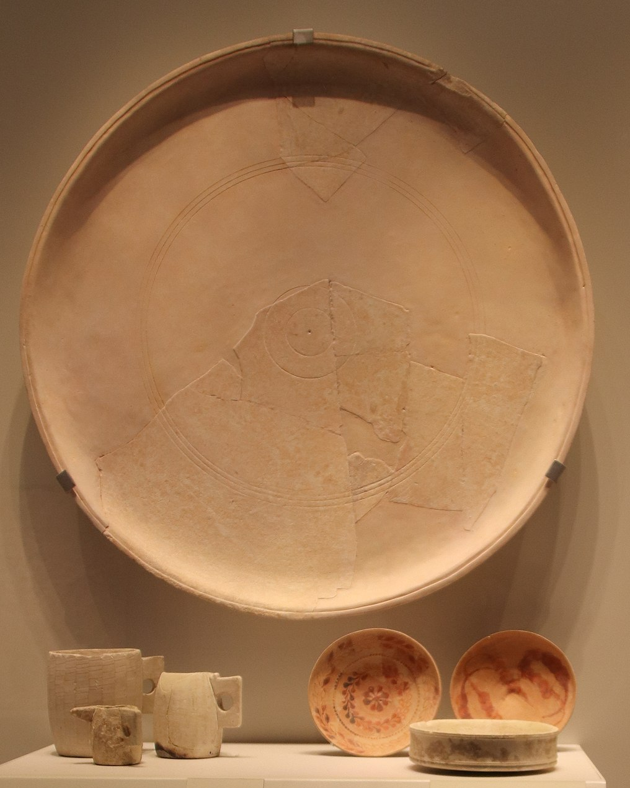

# Human-made Things in the Bible

## License Information

Human-made Things in the Bible © United Bible Societies, 2025. Adapted from: <cite>The Works of Their Hands: Man-made Things in the Bible</cite>, by Ray Pritz © 2009 United Bible Societies. This work is licensed under Creative Commons Attribution-ShareAlike 4.0 International (<a href="https://creativecommons.org/licenses/by-sa/4.0/">https://creativecommons.org/licenses/by-sa/4.0/</a>).

--------------------------------

## Plate, platter (id: REALIA:5.20.2)

5\.20\.2 Plate, platter
=======================

References:
-----------

Hebrew צַלַּחַת (tsalachath)

[2KI 21:13](https://ref.ly/2Kgs21:13), [PRO 19:24](https://ref.ly/Prov19:24), [PRO 26:15](https://ref.ly/Prov26:15)

Greek παροψίς (paropsis)

[MAT 23:25](https://ref.ly/Matt23:25)

Greek πίναξ (pinax)

[MAT 14:8](https://ref.ly/Matt14:8), [MAT 14:11](https://ref.ly/Matt14:11), [MRK 6:25](https://ref.ly/Mark6:25), [MRK 6:28](https://ref.ly/Mark6:28), [LUK 11:39](https://ref.ly/Luke11:39)

Description and usage:
----------------------

*Platter (Gary Todd, Israel Museum, CC0, via Wikimedia Commons)*

The plate was a flat dish on which food was eaten or served. It was normally made of baked clay, but the dishes of royalty and rich people could be made of precious metals.

---

Translation:
------------

[PRO 19:24](https://ref.ly/Prov19:24); [PRO 26:15](https://ref.ly/Prov26:15): In these passages the lazy person is described as someone who puts his hand in the dish and will not lift it to his mouth. In many cultures this could be misunderstood to mean that he is too lazy even to pick up a fork but just puts his hand in his food. This, however, is not the point of the proverb. It was normal to eat food with one’s hand. The person is lazy because he will not even lift his hand to his mouth. A translator should try to focus on the real reason for the person’s laziness. Two good models for [PRO 19:24](https://ref.ly/Prov19:24) are GNT (Good News Translation (1992)) “Some people are too lazy to put food in their own mouths” and CEV (Contemporary English Version) “Some people are too lazy to lift a hand to feed themselves.”

[MAT 14:8](https://ref.ly/Matt14:8): The Greek noun *pinax* may refer to any kind of flat dish; the word originally meant “board” or “plank.” In cultures where plates are not normally used, translators will use “bowl” or whatever is the normal object on which someone would carry food.

* **Associated Passages:** 2 Kings 21:13; Proverbs 19:24; Proverbs 26:15; Matthew 23:25; Matthew 14:8; Matthew 14:11; Mark 6:25; Mark 6:28; Luke 11:39

