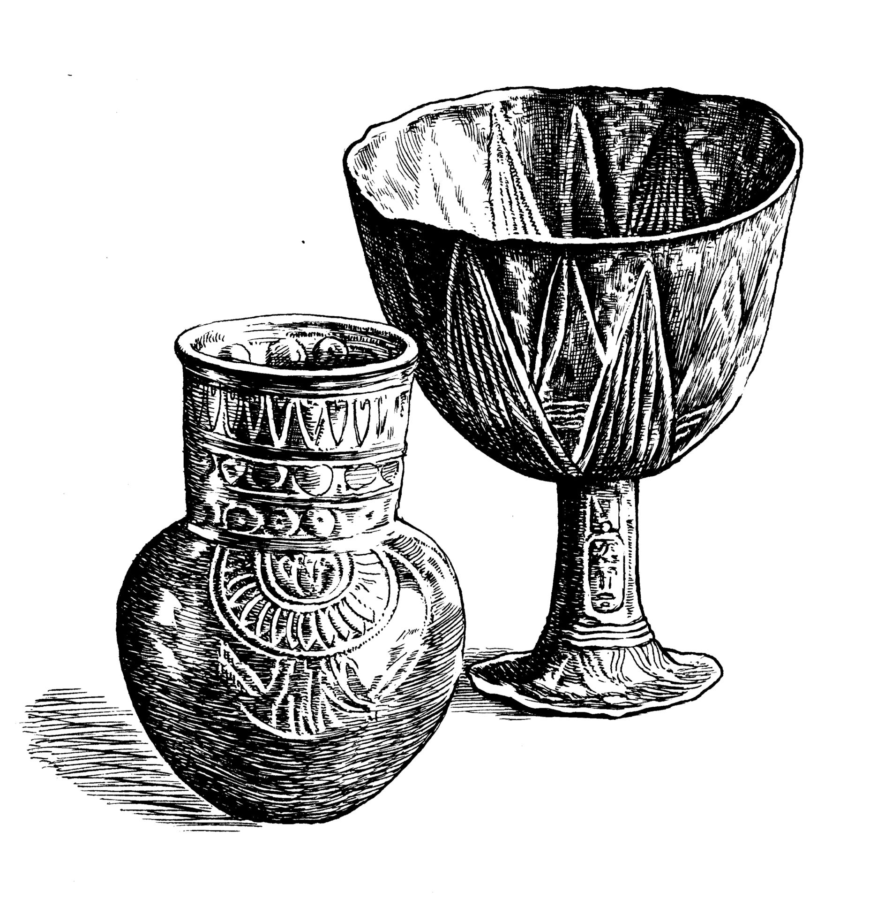

# Human-made Things in the Bible

## License Information

Human-made Things in the Bible © United Bible Societies, 2025. Adapted from: <cite>The Works of Their Hands: Man-made Things in the Bible</cite>, by Ray Pritz © 2009 United Bible Societies. This work is licensed under Creative Commons Attribution-ShareAlike 4.0 International (<a href="https://creativecommons.org/licenses/by-sa/4.0/">https://creativecommons.org/licenses/by-sa/4.0/</a>).

--------------------------------

## Cup (id: REALIA:5.20.3)

5\.20\.3 Cup
============

References:
-----------

Hebrew גָּבִיעַ (gavi‘a)

[GEN 44:2](https://ref.ly/Gen44:2), [GEN 44:2](https://ref.ly/Gen44:2), [GEN 44:12](https://ref.ly/Gen44:12), [GEN 44:16](https://ref.ly/Gen44:16), [GEN 44:17](https://ref.ly/Gen44:17), [EXO 25:31](https://ref.ly/Exod25:31), [EXO 25:33](https://ref.ly/Exod25:33), [EXO 25:33](https://ref.ly/Exod25:33), [EXO 25:34](https://ref.ly/Exod25:34), [EXO 37:17](https://ref.ly/Exod37:17), [EXO 37:19](https://ref.ly/Exod37:19), [EXO 37:19](https://ref.ly/Exod37:19), [EXO 37:20](https://ref.ly/Exod37:20), [JER 35:5](https://ref.ly/Jer35:5)

Hebrew כּוֹס (kos)

[GEN 40:11](https://ref.ly/Gen40:11), [GEN 40:11](https://ref.ly/Gen40:11), [GEN 40:11](https://ref.ly/Gen40:11), [GEN 40:13](https://ref.ly/Gen40:13), [GEN 40:21](https://ref.ly/Gen40:21), [2SA 12:3](https://ref.ly/2Sam12:3), [1KI 7:26](https://ref.ly/1Kgs7:26), [2CH 4:5](https://ref.ly/2Chr4:5), [PSA 11:6](https://ref.ly/Ps11:6), [PSA 16:5](https://ref.ly/Ps16:5), [PSA 23:5](https://ref.ly/Ps23:5), [PSA 75:9](https://ref.ly/Ps75:9), [PSA 116:13](https://ref.ly/Ps116:13), [PRO 23:31](https://ref.ly/Prov23:31), [ISA 51:17](https://ref.ly/Isa51:17), [ISA 51:17](https://ref.ly/Isa51:17), [ISA 51:22](https://ref.ly/Isa51:22), [ISA 51:22](https://ref.ly/Isa51:22), [JER 16:7](https://ref.ly/Jer16:7), [JER 25:15](https://ref.ly/Jer25:15), [JER 25:17](https://ref.ly/Jer25:17), [JER 25:28](https://ref.ly/Jer25:28), [JER 35:5](https://ref.ly/Jer35:5), [JER 49:12](https://ref.ly/Jer49:12), [JER 51:7](https://ref.ly/Jer51:7), [LAM 4:21](https://ref.ly/Lam4:21), [EZK 23:31](https://ref.ly/Ezek23:31), [EZK 23:32](https://ref.ly/Ezek23:32), [EZK 23:33](https://ref.ly/Ezek23:33), [EZK 23:33](https://ref.ly/Ezek23:33), [HAB 2:16](https://ref.ly/Hab2:16)

Hebrew סַף (saf)

[ZEC 12:2](https://ref.ly/Zech12:2)

Hebrew סֵפֶל (sefel)

[JDG 5:25](https://ref.ly/Judg5:25), [JDG 6:38](https://ref.ly/Judg6:38)

Greek ποτήριον (potērion)

[GEN 40:11](https://ref.ly/Gen40:11), [GEN 40:11](https://ref.ly/Gen40:11), [GEN 40:11](https://ref.ly/Gen40:11), [GEN 40:13](https://ref.ly/Gen40:13), [GEN 40:21](https://ref.ly/Gen40:21), [2SA 12:3](https://ref.ly/2Sam12:3), [1KI 7:12](https://ref.ly/1Kgs7:12), [2CH 4:5](https://ref.ly/2Chr4:5), [PSA 10:6](https://ref.ly/Ps10:6), [PSA 15:5](https://ref.ly/Ps15:5), [PSA 22:5](https://ref.ly/Ps22:5), [PSA 74:9](https://ref.ly/Ps74:9), [PSA 115:4](https://ref.ly/Ps115:4), [PRO 23:31](https://ref.ly/Prov23:31), [ISA 51:17](https://ref.ly/Isa51:17), [ISA 51:17](https://ref.ly/Isa51:17), [ISA 51:22](https://ref.ly/Isa51:22), [JER 16:7](https://ref.ly/Jer16:7), [JER 28:7](https://ref.ly/Jer28:7), [JER 30:6](https://ref.ly/Jer30:6), [JER 32:15](https://ref.ly/Jer32:15), [JER 32:17](https://ref.ly/Jer32:17), [JER 32:28](https://ref.ly/Jer32:28), [JER 42:5](https://ref.ly/Jer42:5), [LAM 2:13](https://ref.ly/Lam2:13), [LAM 4:21](https://ref.ly/Lam4:21), [EZK 23:31](https://ref.ly/Ezek23:31), [EZK 23:32](https://ref.ly/Ezek23:32), [EZK 23:33](https://ref.ly/Ezek23:33), [EZK 23:33](https://ref.ly/Ezek23:33), [HAB 2:16](https://ref.ly/Hab2:16), [MAT 10:42](https://ref.ly/Matt10:42), [MAT 20:22](https://ref.ly/Matt20:22), [MAT 20:23](https://ref.ly/Matt20:23), [MAT 23:25](https://ref.ly/Matt23:25), [MAT 23:26](https://ref.ly/Matt23:26), [MAT 26:27](https://ref.ly/Matt26:27), [MAT 26:39](https://ref.ly/Matt26:39), [MRK 7:4](https://ref.ly/Mark7:4), [MRK 9:41](https://ref.ly/Mark9:41), [MRK 10:38](https://ref.ly/Mark10:38), [MRK 10:39](https://ref.ly/Mark10:39), [MRK 14:23](https://ref.ly/Mark14:23), [MRK 14:36](https://ref.ly/Mark14:36), [LUK 11:39](https://ref.ly/Luke11:39), [LUK 22:17](https://ref.ly/Luke22:17), [LUK 22:20](https://ref.ly/Luke22:20), [LUK 22:20](https://ref.ly/Luke22:20), [LUK 22:42](https://ref.ly/Luke22:42), [JHN 18:11](https://ref.ly/John18:11), [1CO 10:16](https://ref.ly/1Cor10:16), [1CO 10:21](https://ref.ly/1Cor10:21), [1CO 10:21](https://ref.ly/1Cor10:21), [1CO 11:25](https://ref.ly/1Cor11:25), [1CO 11:25](https://ref.ly/1Cor11:25), [1CO 11:26](https://ref.ly/1Cor11:26), [1CO 11:27](https://ref.ly/1Cor11:27), [1CO 11:28](https://ref.ly/1Cor11:28), [REV 14:10](https://ref.ly/Rev14:10), [REV 16:19](https://ref.ly/Rev16:19), [REV 17:4](https://ref.ly/Rev17:4), [REV 18:6](https://ref.ly/Rev18:6), [ESG 1:7](https://ref.ly/EsthGr1:7), [PSS 8:14](https://ref.ly/PssSol8:14)

Greek σπονδεῖον (spondeion)

[SIR 50:15](https://ref.ly/Sir50:15), [1MA 1:22](https://ref.ly/1Macc1:22), [1ES 2:9](https://ref.ly/1Esd2:9), [1ES 2:9](https://ref.ly/1Esd2:9)

Greek χρύσωμα (chrusōma)

[1MA 11:58](https://ref.ly/1Macc11:58), [1MA 11:58](https://ref.ly/1Macc11:58), [1ES 3:6](https://ref.ly/1Esd3:6)

Latin calix

[2ES 14:39](https://ref.ly/2Esd14:39)

Description and usage:
----------------------

The cup was an implement used for drinking. Common cups were made of earthenware, sometimes fired and glazed. By New Testament times, cups made of glass were common. Richer people often used cups made of bronze, silver, or gold. A cup could be cylindrical, similar to a modern cup, or it could be more the half\-globe shape of a bowl. In either of these forms, it might have one or two handles or no handles at all.

---

Translation:
------------

*Vessels for drinking (© Deutsche Bibelgesellschaft, Stuttgart by United Bible Societies)*

While many objects resembling a modern drinking cup have been found, people in ancient times often drank from something resembling a small bowl. In terms of historical development, the drinking bowl was probably first. The Hebrew word *sefel* refers to an implement that came after the drinking bowl. It had about equal height and diameter and had handles.

Several of the words listed above could equally well be translated “cup” or “bowl,” and this is reflected in the translations. Some translations say “drinking bowl.” However, a generic word for “cup” will be a close enough equivalent in most languages.

In [GEN 44:0](https://ref.ly/Gen44:0) the Hebrew word *gavi‘a* refers to a special cup, one that is explicitly said to be made of silver. In some cultures it will be necessary to choose a word that does not indicate a drinking vessel made of another substance, such as a gourd, or a cup made of wood or clay.

[MAT 10:42](https://ref.ly/Matt10:42); [MRK 9:41](https://ref.ly/Mark9:41): In place of the literal expression “cup of water” in [MRK 9:41](https://ref.ly/Mark9:41) (in which “cup” not only identifies the container but also indicates the quantity of water), some languages use the expression “water in a cup.” But it is even more likely that the typical equivalent of “cup of water” would be “drink of water” (GNT (Good News Translation (1992))). In some parts of the world, the expression “cup of water” suggests something rather strange and foreign, so some translators might find that an expression like “gourd of water” would not only be more natural, but would also be the semantic equivalent of “drink of water.”

[1MA 11:58](https://ref.ly/1Macc11:58) and [1ES 3:6](https://ref.ly/1Esd3:6) say literally “drink from golden.” The meaning is clearly “drink from golden cups” or “…golden vessels.”

* **Associated Passages:** Genesis 44:2; Genesis 44:12; Genesis 44:16; Genesis 44:17; Exodus 25:31; Exodus 25:33; Exodus 25:34; Exodus 37:17; Exodus 37:19; Exodus 37:20; Jeremiah 35:5; Genesis 40:11; Genesis 40:13; Genesis 40:21; 2 Samuel 12:3; 1 Kings 7:26; 2 Chronicles 4:5; Psalms 11:6; Psalms 16:5; Psalms 23:5; Psalms 75:9; Psalms 116:13; Proverbs 23:31; Isaiah 51:17; Isaiah 51:22; Jeremiah 16:7; Jeremiah 25:15; Jeremiah 25:17; Jeremiah 25:28; Jeremiah 49:12; Jeremiah 51:7; Lamentations 4:21; Ezekiel 23:31; Ezekiel 23:32; Ezekiel 23:33; Habakkuk 2:16; Zechariah 12:2; Judges 5:25; Judges 6:38; 1 Kings 7:12; Psalms 10:6; Psalms 15:5; Psalms 22:5; Psalms 74:9; Psalms 115:4; Jeremiah 28:7; Jeremiah 30:6; Jeremiah 32:15; Jeremiah 32:17; Jeremiah 32:28; Jeremiah 42:5; Lamentations 2:13; Matthew 10:42; Matthew 20:22; Matthew 20:23; Matthew 23:25; Matthew 23:26; Matthew 26:27; Matthew 26:39; Mark 7:4; Mark 9:41; Mark 10:38; Mark 10:39; Mark 14:23; Mark 14:36; Luke 11:39; Luke 22:17; Luke 22:20; Luke 22:42; John 18:11; 1 Corinthians 10:16; 1 Corinthians 10:21; 1 Corinthians 11:25; 1 Corinthians 11:26; 1 Corinthians 11:27; 1 Corinthians 11:28; Revelation 14:10; Revelation 16:19; Revelation 17:4; Revelation 18:6; Esther Greek 1:7; Psalms of Solomon 8:14; Sirach 50:15; 1 Maccabees 1:22; 1 Esdras (Greek) 2:9; 1 Maccabees 11:58; 1 Esdras (Greek) 3:6; 2 Esdras (Latin) 14:39; Genesis 44:0

