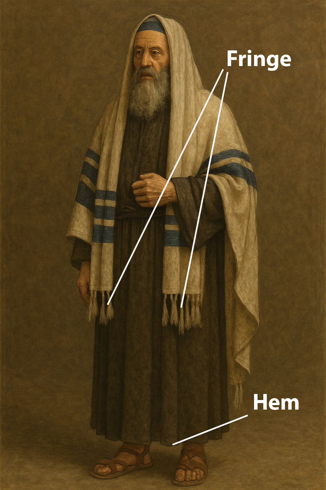

# Human-made Things in the Bible

## License Information

Human-made Things in the Bible © United Bible Societies, 2025. Adapted from: <cite>The Works of Their Hands: Man-made Things in the Bible</cite>, by Ray Pritz © 2009 United Bible Societies. This work is licensed under Creative Commons Attribution-ShareAlike 4.0 International (<a href="https://creativecommons.org/licenses/by-sa/4.0/">https://creativecommons.org/licenses/by-sa/4.0/</a>).

--------------------------------

## Hem, corner of a garment (id: REALIA:6.2.1)

6\.2\.1 Hem, corner of a garment
================================

References:
-----------

Hebrew כָּנָף (kanaf)

[NUM 15:38](https://ref.ly/Num15:38), [NUM 15:38](https://ref.ly/Num15:38), [DEU 22:12](https://ref.ly/Deut22:12), [DEU 23:1](https://ref.ly/Deut23:1), [DEU 27:20](https://ref.ly/Deut27:20), [RUT 3:9](https://ref.ly/Ruth3:9), [1SA 15:27](https://ref.ly/1Sam15:27), [1SA 24:6](https://ref.ly/1Sam24:6), [1SA 24:12](https://ref.ly/1Sam24:12), [1SA 24:12](https://ref.ly/1Sam24:12), [JER 2:34](https://ref.ly/Jer2:34), [EZK 5:3](https://ref.ly/Ezek5:3), [EZK 16:8](https://ref.ly/Ezek16:8), [HAG 2:12](https://ref.ly/Hag2:12), [HAG 2:12](https://ref.ly/Hag2:12), [ZEC 8:23](https://ref.ly/Zech8:23)

Description:
------------

*A Pharisee, wearing phylactery and prayer shawl (Image generated by ChatGPT using OpenAI technology)*

The hem was the lower edge of an outer garment (see [6\.2 Outer garment, cloak, mantle, robe\<REALIA:6\.2\>](#)).

---

Usage:
------

See [6\.2\.1\.1 Fringe, tassel\<REALIA:6\.2\.1\.1\>](#).

---

Translation:
------------

Most translations render the Hebrew word *kanaf* in [NUM 15:38](https://ref.ly/Num15:38) and [DEU 22:12](https://ref.ly/Deut22:12) as “corners” (RSV (Revised Standard Version (1952)), GNT (Good News Translation (1992))). In [NUM 15:38](https://ref.ly/Num15:38)CEV (Contemporary English Version) says “bottom edge,” which may also serve as a model.

[ZEC 8:23](https://ref.ly/Zech8:23): While the word *kanaf* indicates the lower edge of a garment, it is sometimes used for the garment itself (compare [JER 2:34](https://ref.ly/Jer2:34); [EZK 16:8](https://ref.ly/Ezek16:8)). In such passages it may be possible to use a word for the outer garment. Two models for the first part of [ZEC 8:23](https://ref.ly/Zech8:23) are “When this happens, ten people from nations with different languages will grab a Jew by his clothes” (CEV (Contemporary English Version)) and “At that time, ten men from different countries will come and take hold of a Judean by his coat” (NCV (New Century Version)). GNT (Good News Translation (1992)) “In those days ten foreigners will come to one Jew” is also possible, although it loses the element of urgency conveyed by the act of grabbing hold of the robe.

* **Associated Passages:** Numbers 15:38; Deuteronomy 22:12; Deuteronomy 23:1; Deuteronomy 27:20; Ruth 3:9; 1 Samuel 15:27; 1 Samuel 24:6; 1 Samuel 24:12; Jeremiah 2:34; Ezekiel 5:3; Ezekiel 16:8; Haggai 2:12; Zechariah 8:23

## Fringe, tassel (id: REALIA:6.2.1.1)

6\.2\.1\.1 Fringe, tassel
=========================

References:
-----------

Hebrew צִיצִת (tsitsith)

[NUM 15:38](https://ref.ly/Num15:38), [NUM 15:38](https://ref.ly/Num15:38), [NUM 15:39](https://ref.ly/Num15:39)

Hebrew גָּדִל (gadil)

[DEU 22:12](https://ref.ly/Deut22:12)

Greek κράσπεδον (kraspedon)

[MAT 9:20](https://ref.ly/Matt9:20), [MAT 14:36](https://ref.ly/Matt14:36), [MAT 23:5](https://ref.ly/Matt23:5), [MRK 6:56](https://ref.ly/Mark6:56), [LUK 8:44](https://ref.ly/Luke8:44)

Description:
------------

*Fringes on a prayer shawl (DRosenbach, Public domain, via Wikimedia Commons)*

The decorative tassel was attached to the bottom edge of a long, outer robe, specifically to one of the robe’s four corners.

---

Usage:
------

According to [NUM 15:37–NUM 15:41](https://ref.ly/Num15:37-Num15:41) and [DEU 22:12](https://ref.ly/Deut22:12), Israelite men were required to wear tassels on the four corners of their outer garments (see [6\.1 Clothing (generic)\<REALIA:6\.1\>](#)). These tassels reminded them of their obligation to keep the commandments of the Mosaic Law.

---

Translation:
------------

In [MAT 23:5](https://ref.ly/Matt23:5) the Greek word *kraspedon* refers to the tassels worn at the four corners of outer garments. It is also possible that in all instances in which *kraspedon* is used in reference to Jesus’ clothing ([MAT 9:20](https://ref.ly/Matt9:20); [MAT 14:36](https://ref.ly/Matt14:36); [MRK 6:56](https://ref.ly/Mark6:56); [LUK 8:44](https://ref.ly/Luke8:44)), the reference may be specifically to the tassels and not merely to the edge of his garment. The interpretation of such passages depends upon how Jesus may have understood and followed the Mosaic Law and the manner in which the authors may have understood the meaning of *kraspedon*.

In some languages the literal phrase “tassels on the corners” (RSV (Revised Standard Version (1952))) in [NUM 15:38](https://ref.ly/Num15:38) may be rendered “decorated corners” or “ribbons at the corners.” Where a word for tassel does not exist or would be obscure, translators may use a descriptive phrase; for example, NCV (New Century Version) renders the second clause of this verse as follows: “Tie several pieces of thread together and attach them to the corners of your clothes.”

* **Associated Passages:** Numbers 15:38; Numbers 15:39; Deuteronomy 22:12; Matthew 9:20; Matthew 14:36; Matthew 23:5; Mark 6:56; Luke 8:44; Numbers 15:37; Numbers 15:41

* **Associated ACAI Concepts:** Tassel (ID: `realia:Tassel`)
