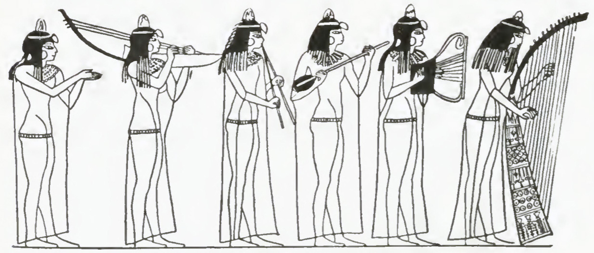
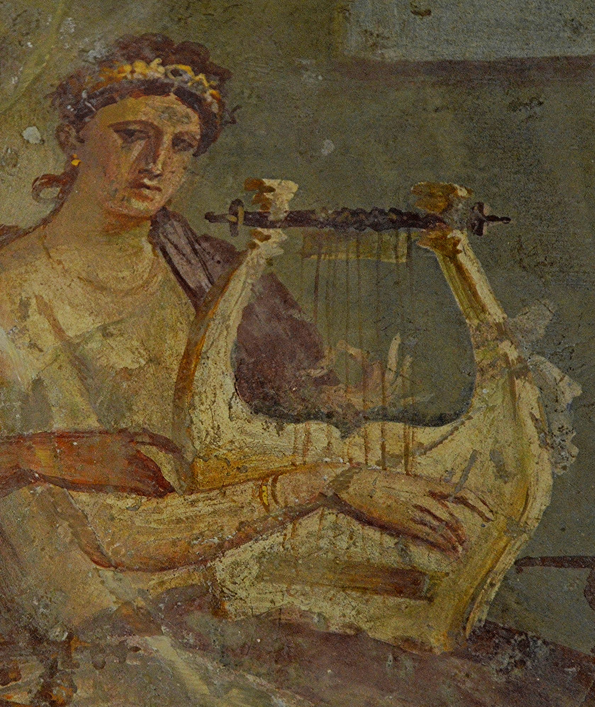

# Human-made Things in the Bible

## License Information

Human-made Things in the Bible © United Bible Societies, 2025. Adapted from: <cite>The Works of Their Hands: Man-made Things in the Bible</cite>, by Ray Pritz © 2009 United Bible Societies. This work is licensed under Creative Commons Attribution-ShareAlike 4.0 International (<a href="https://creativecommons.org/licenses/by-sa/4.0/">https://creativecommons.org/licenses/by-sa/4.0/</a>).

--------------------------------

## Stringed instruments (id: REALIA:7.2)

7\.2 Stringed instruments
=========================

*(Image generated by ChatGPT using OpenAI technology)*

In many musical instruments strings are stretched over a sounding box or connected to the sounding box. Sound is produced by causing the strings to vibrate by plucking them.

*An Egyptian band plays a variety of stringed instruments (Encyclopaedia Biblica, 1903, Public domain, via archive.org)*

There is considerable uncertainty about the identification of the various stringed instruments in the Bible. Confusion is increased by the fact that the Hebrew words *nevel* and *kinor* are frequently used interchangeably or in parallel (see, for example, [1SA 10:5](https://ref.ly/1Sam10:5); [2SA 6:5](https://ref.ly/2Sam6:5); [PSA 33:2](https://ref.ly/Ps33:2); [PSA 57:8](https://ref.ly/Ps57:8); [PSA 71:22](https://ref.ly/Ps71:22); [PSA 81:2](https://ref.ly/Ps81:2); [PSA 92:3](https://ref.ly/Ps92:3); [PSA 108:2](https://ref.ly/Ps108:2); [PSA 150:3](https://ref.ly/Ps150:3)). Both instruments were likely types of lyre, varying only in size. The *kinor* was the smaller of the two. A clear distinction between the *nevel* and the *kinor* is not easy to make, and the main difference may have been the thickness of the sound box, which was thicker for the *nevel*. For further discussion on these stringed instruments, see Braun, Lawergren (page 55\), and O’Connell.

* **Associated Passages:** 1 Samuel 10:5; 2 Samuel 6:5; Psalms 33:2; Psalms 57:8; Psalms 71:22; Psalms 81:2; Psalms 92:3; Psalms 108:2; Psalms 150:3

## 
 (id: REALIA:7.2.1)

7\.2\.1
=======

References:
-----------

Hebrew נֵבֶל (nevel)

[1SA 10:5](https://ref.ly/1Sam10:5), [2SA 6:5](https://ref.ly/2Sam6:5), [1KI 10:12](https://ref.ly/1Kgs10:12), [1CH 13:8](https://ref.ly/1Chr13:8), [1CH 15:16](https://ref.ly/1Chr15:16), [1CH 15:20](https://ref.ly/1Chr15:20), [1CH 15:28](https://ref.ly/1Chr15:28), [1CH 16:5](https://ref.ly/1Chr16:5), [1CH 25:1](https://ref.ly/1Chr25:1), [1CH 25:6](https://ref.ly/1Chr25:6), [2CH 5:12](https://ref.ly/2Chr5:12), [2CH 9:11](https://ref.ly/2Chr9:11), [2CH 20:28](https://ref.ly/2Chr20:28), [2CH 29:25](https://ref.ly/2Chr29:25), [NEH 12:27](https://ref.ly/Neh12:27), [PSA 33:2](https://ref.ly/Ps33:2), [PSA 57:9](https://ref.ly/Ps57:9), [PSA 71:22](https://ref.ly/Ps71:22), [PSA 81:3](https://ref.ly/Ps81:3), [PSA 92:4](https://ref.ly/Ps92:4), [PSA 108:3](https://ref.ly/Ps108:3), [PSA 144:9](https://ref.ly/Ps144:9), [PSA 150:3](https://ref.ly/Ps150:3), [ISA 5:12](https://ref.ly/Isa5:12), [ISA 14:11](https://ref.ly/Isa14:11), [AMO 5:23](https://ref.ly/Amos5:23), [AMO 6:5](https://ref.ly/Amos6:5)

Aramaic קַתְרוֹס (qathros)

[DAN 3:5](https://ref.ly/Dan3:5), [DAN 3:5](https://ref.ly/Dan3:5), [DAN 3:7](https://ref.ly/Dan3:7), [DAN 3:7](https://ref.ly/Dan3:7), [DAN 3:10](https://ref.ly/Dan3:10), [DAN 3:10](https://ref.ly/Dan3:10), [DAN 3:15](https://ref.ly/Dan3:15), [DAN 3:15](https://ref.ly/Dan3:15)

Greek κιθάρα (kithara)

[1CO 14:7](https://ref.ly/1Cor14:7), [REV 5:8](https://ref.ly/Rev5:8), [REV 14:2](https://ref.ly/Rev14:2), [REV 15:2](https://ref.ly/Rev15:2), [1MA 4:54](https://ref.ly/1Macc4:54)

Greek κιθαρίζω (kitharizō)

[1CO 14:7](https://ref.ly/1Cor14:7), [REV 14:2](https://ref.ly/Rev14:2)

Greek κιθαρῳδός (kitharōidos)

[REV 14:2](https://ref.ly/Rev14:2), [REV 18:22](https://ref.ly/Rev18:22)

Greek νάβλα (nabla)

[1MA 13:51](https://ref.ly/1Macc13:51)

Greek ψαλτήριον (psaltērion)

[WIS 19:18](https://ref.ly/Wis19:18), [SIR 40:21](https://ref.ly/Sir40:21)

Aramaic פְּסַנְתֵּרִין (psanterin)

[DAN 3:5](https://ref.ly/Dan3:5), [DAN 3:7](https://ref.ly/Dan3:7), [DAN 3:10](https://ref.ly/Dan3:10), [DAN 3:15](https://ref.ly/Dan3:15)

Latin psalterium

[2ES 10:22](https://ref.ly/2Esd10:22)

Description:
------------

*Drawing of an Egyptian arched harp (© Public domain \- Wikimedia Commons)*

The exact identification of the *nevel* is very problematic. Some take it to be a kind of harp. The harp consisted of a neck projecting out of a soundbox. Strings were stretched from the extremity of the neck down its length and into the sound box. The body of the harp was made of wood and its strings of animal intestines (perhaps from sheep). The number of strings varied.

Others place the *nevel* in the category of lyres, where the strings are stretched over top of and parallel to the soundbox (see [7\.2\.2 Kinor, small lyre, lute\<REALIA:7\.2\.2\>](#)). While this is the interpretation preferred here, we will discuss the harp\-type of instrument, since the identification is problematic and many translations have preferred “harp” for *nevel*.

---

Usage:
------

The strings were plucked either with the fingers or with a thin piece of ivory or metal to give a resonating sound, probably in a lower register than that made by the *kinor*.

---

Translation:
------------

In several Psalms ([PSA 33:2](https://ref.ly/Ps33:2); [PSA 92:4](https://ref.ly/Ps92:4); [PSA 144:9](https://ref.ly/Ps144:9)), the *nevel* is linked to the Hebrew word *‘asor*, which could indicate it was “ten\-stringed.”

Some degree of cultural adaptation must be made in the translation of these stringed instruments since cultures differ from each other in the shape, the number of strings, and the function of their instruments. Translators will have to select an equivalent instrument in the receptor language. In most passages the most accurate translation for *nevel* will be “guitar” or some equivalent medium\-sized stringed instrument on which the strings are stretched over a sound box and are plucked.

In those passages where *nevel* and *kinor* appear together it is recommended that the translator use an instrument that can vary in size and then render the two words as “large and small X,” for example, “large and small guitars.” Alternately, it may be possible to select two stringed instruments that are similar in construction but different in size, for example, “guitar and lute.” It is also possible to say “large and small stringed instruments” or to combine the two, saying “stringed instruments.”

[PSA 33:2](https://ref.ly/Ps33:2): “Praise the LORD with the lyre” (RSV (Revised Standard Version (1952))) contains two major translation problems. The first problem is that in many languages, the phrase “with the lyre” must be changed into a verb phrase or clause; for example, the whole line may be rendered “Praise the LORD by playing music on the lyre” or “Make music with the lyre, and praise the LORD.” The second problem, which applies also to the second line of this verse, is the terms to be used for the musical instruments here. In languages in which there are several stringed instruments, translators may use one of the smaller ones for *kinor* (“lyre”) and a larger one for *nevel* (“harp” in RSV (Revised Standard Version (1952))). In languages where there is little or no choice, they should use the known local stringed instrument for the *kinor*, and a more generic expression for the *nevel*. Where there are no known stringed instruments, it will often be necessary to say “small instruments with strings” for *kinor* and “large instruments with strings” for *nevel*.

* **Associated Passages:** 1 Samuel 10:5; 2 Samuel 6:5; 1 Kings 10:12; 1 Chronicles 13:8; 1 Chronicles 15:16; 1 Chronicles 15:20; 1 Chronicles 15:28; 1 Chronicles 16:5; 1 Chronicles 25:1; 1 Chronicles 25:6; 2 Chronicles 5:12; 2 Chronicles 9:11; 2 Chronicles 20:28; 2 Chronicles 29:25; Nehemiah 12:27; Psalms 33:2; Psalms 57:9; Psalms 71:22; Psalms 81:3; Psalms 92:4; Psalms 108:3; Psalms 144:9; Psalms 150:3; Isaiah 5:12; Isaiah 14:11; Amos 5:23; Amos 6:5; Daniel 3:5; Daniel 3:7; Daniel 3:10; Daniel 3:15; 1 Corinthians 14:7; Revelation 5:8; Revelation 14:2; Revelation 15:2; 1 Maccabees 4:54; Revelation 18:22; 1 Maccabees 13:51; Wisdom of Solomon 19:18; Sirach 40:21; 2 Esdras (Latin) 10:22

## 
 (id: REALIA:7.2.2)

7\.2\.2
=======

References:
-----------

Hebrew כִּנּוֹר (kinor)

[GEN 4:21](https://ref.ly/Gen4:21), [GEN 31:27](https://ref.ly/Gen31:27), [1SA 10:5](https://ref.ly/1Sam10:5), [1SA 16:16](https://ref.ly/1Sam16:16), [1SA 16:23](https://ref.ly/1Sam16:23), [2SA 6:5](https://ref.ly/2Sam6:5), [1KI 10:12](https://ref.ly/1Kgs10:12), [1CH 13:8](https://ref.ly/1Chr13:8), [1CH 15:16](https://ref.ly/1Chr15:16), [1CH 15:21](https://ref.ly/1Chr15:21), [1CH 15:28](https://ref.ly/1Chr15:28), [1CH 16:5](https://ref.ly/1Chr16:5), [1CH 25:1](https://ref.ly/1Chr25:1), [1CH 25:3](https://ref.ly/1Chr25:3), [1CH 25:6](https://ref.ly/1Chr25:6), [2CH 5:12](https://ref.ly/2Chr5:12), [2CH 9:11](https://ref.ly/2Chr9:11), [2CH 20:28](https://ref.ly/2Chr20:28), [2CH 29:25](https://ref.ly/2Chr29:25), [NEH 12:27](https://ref.ly/Neh12:27), [JOB 21:12](https://ref.ly/Job21:12), [JOB 30:31](https://ref.ly/Job30:31), [PSA 33:2](https://ref.ly/Ps33:2), [PSA 43:4](https://ref.ly/Ps43:4), [PSA 49:5](https://ref.ly/Ps49:5), [PSA 57:9](https://ref.ly/Ps57:9), [PSA 71:22](https://ref.ly/Ps71:22), [PSA 81:3](https://ref.ly/Ps81:3), [PSA 92:4](https://ref.ly/Ps92:4), [PSA 98:5](https://ref.ly/Ps98:5), [PSA 98:5](https://ref.ly/Ps98:5), [PSA 108:3](https://ref.ly/Ps108:3), [PSA 137:2](https://ref.ly/Ps137:2), [PSA 147:7](https://ref.ly/Ps147:7), [PSA 149:3](https://ref.ly/Ps149:3), [PSA 150:3](https://ref.ly/Ps150:3), [ISA 5:12](https://ref.ly/Isa5:12), [ISA 16:11](https://ref.ly/Isa16:11), [ISA 23:16](https://ref.ly/Isa23:16), [ISA 24:8](https://ref.ly/Isa24:8), [ISA 30:32](https://ref.ly/Isa30:32), [EZK 26:13](https://ref.ly/Ezek26:13)

Aramaic שַׂבְּכָא (sabka’)

[DAN 3:5](https://ref.ly/Dan3:5), [DAN 3:7](https://ref.ly/Dan3:7), [DAN 3:10](https://ref.ly/Dan3:10), [DAN 3:15](https://ref.ly/Dan3:15)

Greek κινύρα (kinura)

[SIR 39:15](https://ref.ly/Sir39:15), [1MA 3:45](https://ref.ly/1Macc3:45), [1MA 4:54](https://ref.ly/1Macc4:54), [1MA 13:51](https://ref.ly/1Macc13:51)

Description:
------------

*Drawing of a lyre (© Public domain \- Wikimedia Commons)*

The lyre consisted of a sound box out of the ends or sides of which projected two arms. The arms supported a crosspiece. Strings descended from the crosspiece over the sound box. As with the *nevel*, the number of strings could vary. Their varying thickness and tension gave the instrument a range of notes. The lyre was normally made of wood. The strings were made of animal intestines (perhaps from sheep).

---

Usage:
------

The strings were normally plucked with the fingers. The *kinor* in particular is frequently depicted as an instrument that accompanied singing.

---

Translation:
------------

*Fresco of a woman playing the lyre (Pompeii, 50–79 CE, British Museum) (© Carole Raddato from FRANKFURT, Germany, CC BY\-SA 2\.0, via Wikimedia Commons)*

See [7\.2\.1 Nevel, large lyre, guitar, harp\<REALIA:7\.2\.1\>](#).

[JOB 21:12](https://ref.ly/Job21:12): For the stringed instrument (*kinor* in Hebrew) accompanying the tambourine, FRCL (French Common Language Version (Bible en français courant)) has “guitar” and *La Bible de Jérusalem* has “zither,” which seems to be an instrument used in [1SA 10:5](https://ref.ly/1Sam10:5). The first line of this verse may also be rendered “The children sing as people play the tambourine and the lyre.” In some languages these instruments will be a local drum and a stringed instrument; the latter may be a guitar. If no instruments can be found to render any of the instruments in this verse, the translator may have to express the whole verse differently; for example, “The children dance and sing and make joyful sounds/music.”

The identity of the instrument called *sabka’* in Aramaic in [DAN 3:5](https://ref.ly/Dan3:5); [DAN 3:7](https://ref.ly/Dan3:7); [DAN 3:10](https://ref.ly/Dan3:10); [DAN 3:15](https://ref.ly/Dan3:15) is uncertain. RSV (Revised Standard Version (1952)) renders it “trigon,” which is a small triangular lyre\-type instrument with four strings. Probably trigon is technically correct, but it is unknown to the average English reader. GNT (Good News Translation (1992)) has attempted to find a better\-known equivalent with “zither,” but the zither has far too many strings (over thirty). Some translations use “lyre” for *sabka’* and render the Aramaic word *qathros* before it as “zither” (NIV (New International Version (1984)), NJPSV (New Jewish Publication Society Version), NLT (New Living Translation)). REB (Revised English Bible (1989)) has “triangle,” but most readers will wrongly identify that as a percussion instrument. CEV (Contemporary English Version) avoids the problem by rendering only the first three instruments in the list and grouping the last three together, including *sabka’* as follows: “Trumpets, flutes, harps, and all other kinds of musical instruments.”

* **Associated Passages:** Genesis 4:21; Genesis 31:27; 1 Samuel 10:5; 1 Samuel 16:16; 1 Samuel 16:23; 2 Samuel 6:5; 1 Kings 10:12; 1 Chronicles 13:8; 1 Chronicles 15:16; 1 Chronicles 15:21; 1 Chronicles 15:28; 1 Chronicles 16:5; 1 Chronicles 25:1; 1 Chronicles 25:3; 1 Chronicles 25:6; 2 Chronicles 5:12; 2 Chronicles 9:11; 2 Chronicles 20:28; 2 Chronicles 29:25; Nehemiah 12:27; Job 21:12; Job 30:31; Psalms 33:2; Psalms 43:4; Psalms 49:5; Psalms 57:9; Psalms 71:22; Psalms 81:3; Psalms 92:4; Psalms 98:5; Psalms 108:3; Psalms 137:2; Psalms 147:7; Psalms 149:3; Psalms 150:3; Isaiah 5:12; Isaiah 16:11; Isaiah 23:16; Isaiah 24:8; Isaiah 30:32; Ezekiel 26:13; Daniel 3:5; Daniel 3:7; Daniel 3:10; Daniel 3:15; Sirach 39:15; 1 Maccabees 3:45; 1 Maccabees 4:54; 1 Maccabees 13:51

