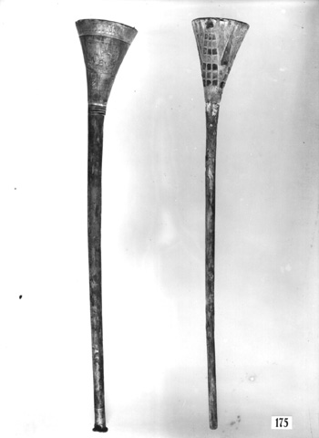

# Human-made Things in the Bible

## License Information

Human-made Things in the Bible © United Bible Societies, 2025. Adapted from: <cite>The Works of Their Hands: Man-made Things in the Bible</cite>, by Ray Pritz © 2009 United Bible Societies. This work is licensed under Creative Commons Attribution-ShareAlike 4.0 International (<a href="https://creativecommons.org/licenses/by-sa/4.0/">https://creativecommons.org/licenses/by-sa/4.0/</a>).

--------------------------------

## Trumpet, horn (id: REALIA:7.3.2)

7\.3\.2 Trumpet, horn
=====================

References:
-----------

Hebrew חצצר, חֲצֹצְרָה (chatsotsrah, chatsar (verb))

[NUM 10:2](https://ref.ly/Num10:2), [NUM 10:8](https://ref.ly/Num10:8), [NUM 10:9](https://ref.ly/Num10:9), [NUM 10:10](https://ref.ly/Num10:10), [NUM 31:6](https://ref.ly/Num31:6), [2KI 11:14](https://ref.ly/2Kgs11:14), [2KI 11:14](https://ref.ly/2Kgs11:14), [2KI 12:14](https://ref.ly/2Kgs12:14), [1CH 13:8](https://ref.ly/1Chr13:8), [1CH 15:24](https://ref.ly/1Chr15:24), [1CH 15:28](https://ref.ly/1Chr15:28), [1CH 16:6](https://ref.ly/1Chr16:6), [1CH 16:42](https://ref.ly/1Chr16:42), [2CH 5:12](https://ref.ly/2Chr5:12), [2CH 5:13](https://ref.ly/2Chr5:13), [2CH 7:6](https://ref.ly/2Chr7:6), [2CH 7:6](https://ref.ly/2Chr7:6), [2CH 13:12](https://ref.ly/2Chr13:12), [2CH 13:14](https://ref.ly/2Chr13:14), [2CH 15:14](https://ref.ly/2Chr15:14), [2CH 20:28](https://ref.ly/2Chr20:28), [2CH 23:13](https://ref.ly/2Chr23:13), [2CH 23:13](https://ref.ly/2Chr23:13), [2CH 29:26](https://ref.ly/2Chr29:26), [2CH 29:27](https://ref.ly/2Chr29:27), [2CH 29:28](https://ref.ly/2Chr29:28), [EZR 3:10](https://ref.ly/Ezra3:10), [NEH 12:35](https://ref.ly/Neh12:35), [NEH 12:41](https://ref.ly/Neh12:41), [PSA 98:6](https://ref.ly/Ps98:6), [HOS 5:8](https://ref.ly/Hos5:8)

Hebrew קֶרֶן (qeren)

[DAN 3:5](https://ref.ly/Dan3:5), [DAN 3:7](https://ref.ly/Dan3:7), [DAN 3:10](https://ref.ly/Dan3:10), [DAN 3:15](https://ref.ly/Dan3:15)

Greek σάλπιγξ, σαλπίζω, σαλπιστής (salpigx, salpizō (verb), salpistēs)

[MAT 6:2](https://ref.ly/Matt6:2), [MAT 24:31](https://ref.ly/Matt24:31), [1CO 14:8](https://ref.ly/1Cor14:8), [1CO 15:52](https://ref.ly/1Cor15:52), [1CO 15:52](https://ref.ly/1Cor15:52), [1TH 4:16](https://ref.ly/1Thess4:16), [HEB 12:19](https://ref.ly/Heb12:19), [REV 1:10](https://ref.ly/Rev1:10), [REV 4:1](https://ref.ly/Rev4:1), [REV 8:2](https://ref.ly/Rev8:2), [REV 8:6](https://ref.ly/Rev8:6), [REV 8:6](https://ref.ly/Rev8:6), [REV 8:7](https://ref.ly/Rev8:7), [REV 8:8](https://ref.ly/Rev8:8), [REV 8:10](https://ref.ly/Rev8:10), [REV 8:12](https://ref.ly/Rev8:12), [REV 8:13](https://ref.ly/Rev8:13), [REV 8:13](https://ref.ly/Rev8:13), [REV 9:1](https://ref.ly/Rev9:1), [REV 9:13](https://ref.ly/Rev9:13), [REV 9:14](https://ref.ly/Rev9:14), [REV 10:7](https://ref.ly/Rev10:7), [REV 11:15](https://ref.ly/Rev11:15), [REV 18:22](https://ref.ly/Rev18:22), [SIR 50:16](https://ref.ly/Sir50:16), [1MA 3:54](https://ref.ly/1Macc3:54), [1MA 3:54](https://ref.ly/1Macc3:54), [1MA 4:13](https://ref.ly/1Macc4:13), [1MA 4:40](https://ref.ly/1Macc4:40), [1MA 4:40](https://ref.ly/1Macc4:40), [1MA 5:31](https://ref.ly/1Macc5:31), [1MA 5:33](https://ref.ly/1Macc5:33), [1MA 5:33](https://ref.ly/1Macc5:33), [1MA 6:33](https://ref.ly/1Macc6:33), [1MA 6:33](https://ref.ly/1Macc6:33), [1MA 7:45](https://ref.ly/1Macc7:45), [1MA 7:45](https://ref.ly/1Macc7:45), [1MA 9:12](https://ref.ly/1Macc9:12), [1MA 9:12](https://ref.ly/1Macc9:12), [1MA 9:12](https://ref.ly/1Macc9:12), [1MA 16:8](https://ref.ly/1Macc16:8), [1MA 16:8](https://ref.ly/1Macc16:8), [2MA 15:25](https://ref.ly/2Macc15:25), [1ES 5:57](https://ref.ly/1Esd5:57), [1ES 5:59](https://ref.ly/1Esd5:59), [1ES 5:61](https://ref.ly/1Esd5:61), [1ES 5:62](https://ref.ly/1Esd5:62), [1ES 5:62](https://ref.ly/1Esd5:62), [1ES 5:63](https://ref.ly/1Esd5:63)

Latin tuba

[2ES 6:23](https://ref.ly/2Esd6:23)

Description:
------------

*Trumpet, musical instrument (© Public Domain Harry Burton \- Wikimedia Commons)*

The trumpet was a wind instrument, frequently used in signaling, especially in connection with war. It was made of metal (the trumpets mentioned in [NUM 10:0](https://ref.ly/Num10:0) were made of silver). It was a straight, narrow tube, about 40–45 centimeters (16–18 inches) in length. One end had a mouthpiece, while the other end was widened into a bell shape.

---

Usage:
------

*(Image generated by ChatGPT using OpenAI technology)*

The sound on the trumpet was made by blowing into the mouthpiece in such a way as to vibrate the lips. The vibrations were magnified as they passed along the widening body of the tube.

The purpose of the trumpet in Israel was primarily to signal. [DAN 3:5](https://ref.ly/Dan3:5); [DAN 3:7](https://ref.ly/Dan3:7); [DAN 3:10](https://ref.ly/Dan3:10); [DAN 3:15](https://ref.ly/Dan3:15); [1CO 15:52](https://ref.ly/1Cor15:52); [1SA 10:5](https://ref.ly/1Sam10:5); [1KI 1:40](https://ref.ly/1Kgs1:40); [ISA 5:12](https://ref.ly/Isa5:12); [ISA 30:29](https://ref.ly/Isa30:29); [JER 48:36](https://ref.ly/Jer48:36) lists a variety of occasions in which the trumpets were to be used, including signaling the people to break camp, calling all of the people together for a meeting, calling only the leaders together, sounding an alarm at the beginning of a battle, and blowing them for liturgical purposes during certain festivals. It is significant that it was the task of the priests to sound the trumpets.

---

Translation:
------------

Generally speaking, translators may distinguish between the Hebrew words *chatsotsrah* and *shofar* (see [7\.3\.1 Horn, ram’s horn\<REALIA:7\.3\.1\>](#)) by rendering *chatsotsrah* as “trumpet” or “bugle” and *shofar* with a more generic word for “horn” or with “ram’s horn.” Note the following comment in *A Handbook on Psalms* (page 846\) on [JER 48:36](https://ref.ly/Jer48:36): “In some languages it will not be possible to make a distinction between the two Hebrew terms translated **\\\+u trumpets\\\+u\*** and **\\\+u horn\\\+u\***. In such cases the local term for a horn will be used. The Greek Old Testament used only one term.”

The exact meaning of the Aramaic word *qeren* in [DAN 3:5](https://ref.ly/Dan3:5); [DAN 3:7](https://ref.ly/Dan3:7); [DAN 3:10](https://ref.ly/Dan3:10); [DAN 3:15](https://ref.ly/Dan3:15) is debated. It probably refers to a brass wind instrument and is best rendered “horn.”

The present\-day equivalent for the Greek word *salpigx* is “bugle.” A bugle is generally smaller than a trumpet and is often associated with the sounding of military signals.

[PSA 5:1](https://ref.ly/Ps5:1): It may be necessary to introduce an agent in the literal phrase “at the last trumpet” (RSV (Revised Standard Version (1952))); for example, “when someone blows the trumpet for the last time.” Also possible is “when someone produces a noise on the trumpet for the last time”; however, any term for “noise” should imply a meaningful sound.

* **Associated Passages:** Numbers 10:2; Numbers 10:8; Numbers 10:9; Numbers 10:10; Numbers 31:6; 2 Kings 11:14; 2 Kings 12:14; 1 Chronicles 13:8; 1 Chronicles 15:24; 1 Chronicles 15:28; 1 Chronicles 16:6; 1 Chronicles 16:42; 2 Chronicles 5:12; 2 Chronicles 5:13; 2 Chronicles 7:6; 2 Chronicles 13:12; 2 Chronicles 13:14; 2 Chronicles 15:14; 2 Chronicles 20:28; 2 Chronicles 23:13; 2 Chronicles 29:26; 2 Chronicles 29:27; 2 Chronicles 29:28; Ezra 3:10; Nehemiah 12:35; Nehemiah 12:41; Psalms 98:6; Hosea 5:8; Daniel 3:5; Daniel 3:7; Daniel 3:10; Daniel 3:15; Matthew 6:2; Matthew 24:31; 1 Corinthians 14:8; 1 Corinthians 15:52; 1 Thessalonians 4:16; Hebrews 12:19; Revelation 1:10; Revelation 4:1; Revelation 8:2; Revelation 8:6; Revelation 8:7; Revelation 8:8; Revelation 8:10; Revelation 8:12; Revelation 8:13; Revelation 9:1; Revelation 9:13; Revelation 9:14; Revelation 10:7; Revelation 11:15; Revelation 18:22; Sirach 50:16; 1 Maccabees 3:54; 1 Maccabees 4:13; 1 Maccabees 4:40; 1 Maccabees 5:31; 1 Maccabees 5:33; 1 Maccabees 6:33; 1 Maccabees 7:45; 1 Maccabees 9:12; 1 Maccabees 16:8; 2 Maccabees 15:25; 1 Esdras (Greek) 5:57; 1 Esdras (Greek) 5:59; 1 Esdras (Greek) 5:61; 1 Esdras (Greek) 5:62; 1 Esdras (Greek) 5:63; 2 Esdras (Latin) 6:23; Numbers 10:0; 1 Samuel 10:5; 1 Kings 1:40; Isaiah 5:12; Isaiah 30:29; Jeremiah 48:36; Psalms 5:1

