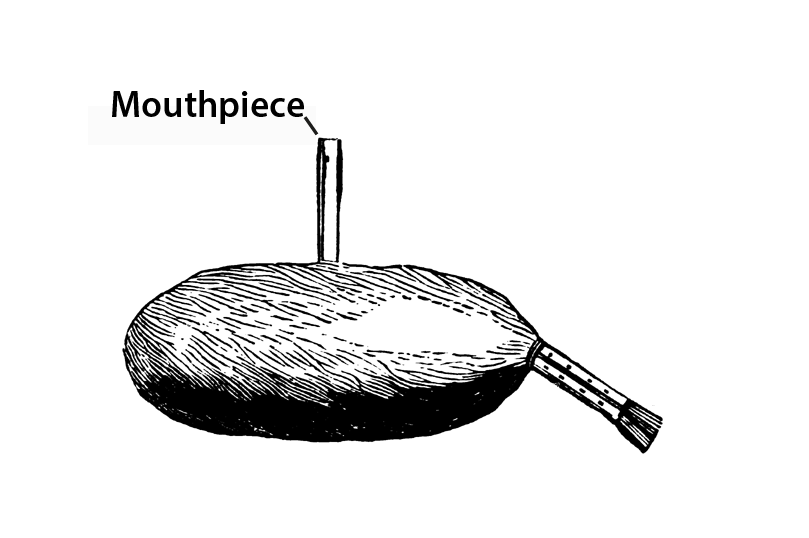

# Human-made Things in the Bible

## License Information

Human-made Things in the Bible © United Bible Societies, 2025. Adapted from: <cite>The Works of Their Hands: Man-made Things in the Bible</cite>, by Ray Pritz © 2009 United Bible Societies. This work is licensed under Creative Commons Attribution-ShareAlike 4.0 International (<a href="https://creativecommons.org/licenses/by-sa/4.0/">https://creativecommons.org/licenses/by-sa/4.0/</a>).

--------------------------------

## Bagpipe (kettledrum, large drum) (id: REALIA:7.3.4)

7\.3\.4 Bagpipe (kettledrum, large drum)
========================================

References:
-----------

Aramaic סוּמְפֹּנְיָה (sumponyah)

[DAN 3:5](https://ref.ly/Dan3:5), [DAN 3:10](https://ref.ly/Dan3:10), [DAN 3:10](https://ref.ly/Dan3:10), [DAN 3:15](https://ref.ly/Dan3:15)

Description:
------------

*Bagpipe (Cyclopaedia of Biblical, Theological and Ecclesiastical Literature, Harper 1888, Public domain)*

The bagpipe consisted of two pipes connected to an air bag. The bag was inflated by blowing into a third tube or pipe. The air in the bag escaped through the double pipes. These had finger holes that could be opened or closed producing a range of notes.

The kettledrum was a larger drum, in construction similar to the drum discussed under [7\.4\.6 Drum, hand drum, frame drum\<REALIA:7\.4\.6\>](#). However, it was not held but stood on the ground.

---

Translation:
------------

Several instruments have been suggested for the Aramaic word *sumponyah* in [DAN 3:0](https://ref.ly/Dan3:0), including a double pipe, a drum, and a bagpipe (depicted in the illustration above). Translations include “pipes” (NIV (New International Version (1984)), NCV (New Century Version)), “bagpipe” (RSV (Revised Standard Version (1952)), NJB (New Jerusalem Bible (1985))), “drum” (NRSV (New Revised Standard Version (1989))), and “dulcimer” (KJV (King James Version (1611)), REB (Revised English Bible (1989))). The identification of *sumponyah* as a large drum is based on the assumption that this Aramaic word is a transliteration of a dialect form of the Greek word *tumpanon*.

Many scholars are convinced that the word *sumponyah* is not actually the name of a particular instrument, but rather that it referred to the playing together of all the individual instruments mentioned before (so GNT (Good News Translation (1992)) “and then all the other instruments will join in”). This interpretation is probably derived from a reading of *sumponyah* as meaning “accompanying sound.” NEB (New English Bible (1970)) follows this interpretation, using the general term “music” here.

* **Associated Passages:** Daniel 3:5; Daniel 3:10; Daniel 3:15; Daniel 3:0

* **Associated ACAI Concepts:** Bagpipe (ID: `realia:Bagpipe`)
