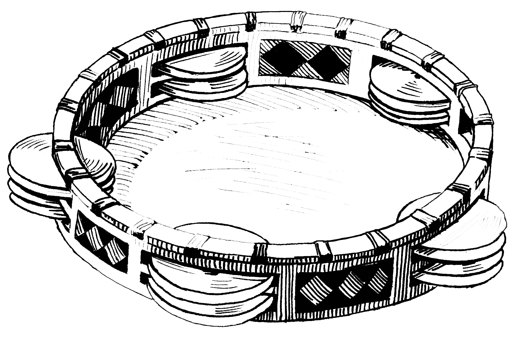

# Human-made Things in the Bible

## License Information

Human-made Things in the Bible © United Bible Societies, 2025. Adapted from: <cite>The Works of Their Hands: Man-made Things in the Bible</cite>, by Ray Pritz © 2009 United Bible Societies. This work is licensed under Creative Commons Attribution-ShareAlike 4.0 International (<a href="https://creativecommons.org/licenses/by-sa/4.0/">https://creativecommons.org/licenses/by-sa/4.0/</a>).

--------------------------------

## Percussion instruments (id: REALIA:7.4)

7\.4 Percussion instruments
===========================

Percussion instruments are made of resonant material and make sounds when they are struck or shaken. This category includes entries [7\.4\.1 Sistrum\<REALIA:7\.4\.1\>](#) through [7\.4\.5 Wooden clappers\<REALIA:7\.4\.5\>](#). For convenience, we may also include the drums, entry [7\.4\.6 Drum, hand drum, frame drum\<REALIA:7\.4\.6\>](#) (see also [7\.3\.4 Bagpipe (kettledrum, large drum)\<REALIA:7\.3\.4\>](#)). In the case of drums, the sound is made by striking a stretched membrane, often of animal skin.
-------------------------------------------------------------------------------------------------------------------------------------------------------------------------------------------------------------------------------------------------------------------------------------------------------------------------------------------------------------------------------------------------------------------------------------------------------------------------------------------------------------------------------

## Sistrum (id: REALIA:7.4.1)

7\.4\.1 Sistrum
===============

Reference:
----------

Hebrew שָׁלִישׁ (shalish)

[1SA 18:6](https://ref.ly/1Sam18:6)

Description:
------------

*Drawing of a sistrum, a type of musical rattle (© Lalupa \- Wikimedia Commons)*

The sistrum consisted of a frame carrying short wires on which small metal rings were threaded.

---

Usage:
------

The sistrum was shaken, making a rattling or tinkling sound. Its use accompanied singing and dancing.

---

Translation:
------------

The Hebrew word *shalish* meaning “sistrum” appears only in [1SA 18:6](https://ref.ly/1Sam18:6). Its exact meaning is uncertain. Other possible meanings are “triangle,” “three\-stringed lute,” “triangular harp,” and “triangular hand drum.”

* **Associated Passages:** 1 Samuel 18:6

## Cymbals (id: REALIA:7.4.2)

7\.4\.2 Cymbals
===============

References:
-----------

Hebrew מְצִלְתַּיִם (mtsiltayim)

[1CH 13:8](https://ref.ly/1Chr13:8), [1CH 15:16](https://ref.ly/1Chr15:16), [1CH 15:19](https://ref.ly/1Chr15:19), [1CH 15:28](https://ref.ly/1Chr15:28), [1CH 16:5](https://ref.ly/1Chr16:5), [1CH 16:42](https://ref.ly/1Chr16:42), [1CH 25:1](https://ref.ly/1Chr25:1), [1CH 25:6](https://ref.ly/1Chr25:6), [2CH 5:12](https://ref.ly/2Chr5:12), [2CH 5:13](https://ref.ly/2Chr5:13), [2CH 29:25](https://ref.ly/2Chr29:25), [EZR 3:10](https://ref.ly/Ezra3:10), [NEH 12:27](https://ref.ly/Neh12:27)

Hebrew צֶלְצְלִים (tseltselim)

[2SA 6:5](https://ref.ly/2Sam6:5), [PSA 150:5](https://ref.ly/Ps150:5), [PSA 150:5](https://ref.ly/Ps150:5)

Greek κύμβαλον (kumbalon)

[1CO 13:1](https://ref.ly/1Cor13:1), [JDT 16:1](https://ref.ly/Jdt16:1), [1MA 4:54](https://ref.ly/1Macc4:54), [1MA 13:51](https://ref.ly/1Macc13:51), [1ES 5:57](https://ref.ly/1Esd5:57)

Description:
------------

*Cymbals (© Finoskov, CC BY\-SA 4\.0, via Wikimedia Commons)*

Cymbals were a percussion instrument consisting of two metal discs that were struck together in order to make a shrill, clashing sound. There were two types of cymbals: (1\) flat metal plates that were struck together, and (2\) metal cones, one of which was brought down on top of the other, on the open end.

---

Translation:
------------

The equivalent of “cymbal” in many languages is a phrase such as “loud metal.”

In [PSA 150:5](https://ref.ly/Ps150:5) two kinds of cymbals are mentioned, literally “cymbals of hearing” and “cymbals of shouting.” This may mean “small cymbals … large cymbals, or it may be just a poetic variation with the meaning “clanging cymbals … clashing cymbals.”

In [1CO 13:1](https://ref.ly/1Cor13:1)GNT (Good News Translation (1992)) renders the Greek word *kumbalon* as “bell” instead of “cymbal” since it is more widely understood.

* **Associated Passages:** 1 Chronicles 13:8; 1 Chronicles 15:16; 1 Chronicles 15:19; 1 Chronicles 15:28; 1 Chronicles 16:5; 1 Chronicles 16:42; 1 Chronicles 25:1; 1 Chronicles 25:6; 2 Chronicles 5:12; 2 Chronicles 5:13; 2 Chronicles 29:25; Ezra 3:10; Nehemiah 12:27; 2 Samuel 6:5; Psalms 150:5; 1 Corinthians 13:1; Judith 16:1; 1 Maccabees 4:54; 1 Maccabees 13:51; 1 Esdras (Greek) 5:57

* **Associated ACAI Concepts:** Cymbals (ID: `realia:Cymbals`)

## Gong (id: REALIA:7.4.3)

7\.4\.3 Gong
============

Reference:
----------

Greek χαλκός (chalkos)

[1CO 13:1](https://ref.ly/1Cor13:1)

Description:
------------

The gong was a concave, platelike piece of metal that reverberated loudly when struck.

---

Translation:
------------

In a number of languages the equivalent of “gong” is “noisy metal,” “reverberating metal,” or “echoing metal,” but frequently translators have simply used an expression meaning “loud bell.”

The Greek word *chalkos* can refer to a metal such as copper or bronze, something made out of metal such as coins (see [1\.6\.3 Money, coins\<REALIA:1\.6\.3\>](#)), or armor. The mention of a “cymbal” immediately after this word in [1CO 13:1](https://ref.ly/1Cor13:1) suggests that a musical instrument such as a gong is intended here. As noted in [7\.4\.2 Cymbals\<REALIA:7\.4\.2\>](#), the cymbal in ancient times was a metal basin used like modern cymbals, in pairs, to produce a musical sound. Other translators will have to decide what musical instruments in their cultures carry the same meaning if there are no gongs or cymbals. Gongs and cymbals were sometimes part of pagan ritual in the time of the New Testament, and it is possible that Paul has this in mind in this verse. Recent scholarship has determined that the Greek phrase *chalkos ēchōn* (literally “booming brass”) in this verse may refer to a practice known from Greek amphitheaters. A type of resonating brass vase was placed at several locations at the back of the amphitheater to amplify the voices of the singers or actors on the stage. It served as a kind of amplification (Braun, page 44\).

* **Associated Passages:** 1 Corinthians 13:1

## Shaker, rattle (id: REALIA:7.4.4)

7\.4\.4 Shaker, rattle
======================

Reference:
----------

Hebrew מְנַעַנְעִים (mna‘an‘im)

[2SA 6:5](https://ref.ly/2Sam6:5)

Description and usage:
----------------------

*A shaker (rattle) (Metropolitan Museum of Art, CC0, via Wikimedia Commons)*

The shakers were small closed pottery containers holding small rattling pellets. When shaken, they provided the rhythm to accompany dancing.

---

Translation:
------------

The precise meaning of the Hebrew word *mna‘an‘im* is uncertain, and translations differ, including “castanets” (RSV (Revised Standard Version (1952)), JB (Jerusalem Bible (1966)), REB (Revised English Bible (1989))), “sistrums” (NIV (New International Version (1984)), TOB (Traduction Oecuménique de la Bible (French, 1975))), and “rattles” (GNT (Good News Translation (1992)), NCV (New Century Version)). The translation “castanets” would associate the word with instruments that produced sound by banging together two flat pieces of wood. This would also imply different hand and finger movements from the translation “shakers,” as well as a different sound. The GNT (Good News Translation (1992)) translation “rattles” has the danger of being associated with baby toys, as well as the disadvantage that it lacks the association with dance and the assonance of the Hebrew word in its context. It is probably best to translate *mna‘an‘im* with something that indicates a kind of shaker or rattle.

* **Associated Passages:** 2 Samuel 6:5

* **Associated ACAI Concepts:** Shaker (ID: `realia:Shaker`); LORD (ID: `deity:Lord`); Lute (ID: `realia:Lute`); Israel (ID: `person:Israel`)

## Wooden clappers (id: REALIA:7.4.5)

7\.4\.5 Wooden clappers
=======================

Reference:
----------

Hebrew עֵץ, בְּרוֹשׁ (‘atsey broshim)

[2SA 6:5](https://ref.ly/2Sam6:5)

Description and usage:
----------------------

Clappers were flat, oblong, rectangular, or curved. They could be made of wood, ivory, or bone. They were tied together at one end, enabling them to be struck together. This produced a kind of slapping sound.

---

Translation:
------------

For “wooden clappers,” many cultures will know comparable percussion instruments, similar in use and appearance to castanets.

The Hebrew phrase *‘atsey broshim* in [2SA 6:5](https://ref.ly/2Sam6:5) has been given several interpretations. The phrase means literally “cypress trees” or “pieces of cypress wood.” This has led some scholars to suggest that this is not a reference to musical instruments, but that the people were waving cypress branches as a sign of joy. Others interpret this to mean “instruments made of cypress wood” (ITCL (Italian Common Language Version)), indicating a separate entry in the series of instruments named. It is also possible to understand the phrase to indicate the material from which the instruments that follow in the list were made; compare, for example, NCV (New Century Version) ’s rendering of the last half of this verse: “They were playing wooden instruments: lyres, harps, tambourines, rattles, and cymbals.”

* **Associated Passages:** 2 Samuel 6:5

* **Associated ACAI Concepts:** LORD (ID: `deity:Lord`); Phoenician Juniper (ID: `flora:JuniperTree`)

## Drum, hand drum, frame drum (id: REALIA:7.4.6)

7\.4\.6 Drum, hand drum, frame drum
===================================

References:
-----------

Hebrew תֹּף, תפף (tof, tafaf (verb))

[GEN 31:27](https://ref.ly/Gen31:27), [EXO 15:20](https://ref.ly/Exod15:20), [EXO 15:20](https://ref.ly/Exod15:20), [JDG 11:34](https://ref.ly/Judg11:34), [1SA 10:5](https://ref.ly/1Sam10:5), [1SA 18:6](https://ref.ly/1Sam18:6), [2SA 6:5](https://ref.ly/2Sam6:5), [1CH 13:8](https://ref.ly/1Chr13:8), [JOB 21:12](https://ref.ly/Job21:12), [PSA 68:26](https://ref.ly/Ps68:26), [PSA 81:3](https://ref.ly/Ps81:3), [PSA 149:3](https://ref.ly/Ps149:3), [PSA 150:4](https://ref.ly/Ps150:4), [ISA 5:12](https://ref.ly/Isa5:12), [ISA 24:8](https://ref.ly/Isa24:8), [ISA 30:32](https://ref.ly/Isa30:32), [JER 31:4](https://ref.ly/Jer31:4)

Greek τύμπανον (tumpanon)

[JDT 3:7](https://ref.ly/Jdt3:7), [JDT 16:1](https://ref.ly/Jdt16:1), [1MA 9:39](https://ref.ly/1Macc9:39), [1ES 5:2](https://ref.ly/1Esd5:2)

Description:
------------

*Timbrel or tambourine or hand drum (musical instrument) (© Public Domain \- Wikimedia Commons)*

The drum consisted of a membrane, usually of animal skin, which was stretched over a shallow circular, triangular, or square frame.

---

Usage:
------

The drum was struck sharply with one or two hands, depending on where it was situated. It could be held in the left hand, under the left arm, or against the chest and struck with the right hand, or it could be held on the knees or the ground and struck with one or two hands. The fingers of the left hand could be used to tighten or loosen the tension on the membrane as it was struck with the palm of the right hand.

---

Translation:
------------

*Women beating hand drums (Gary Todd, Israel Museum, CC0, via Wikimedia Commons)*

The use of the Hebrew word *tof* is usually associated with singing, processions, and festivals. Archaeological evidence indicates that drums with metal circlets on the frame (“tambourines” or “timbrels”) were not known in biblical times. As a general rule, the best translation for this word will be “hand drum” or simply “drum.” tion for this word will be “hand drum” or simply “drum.”

* **Associated Passages:** Genesis 31:27; Exodus 15:20; Judges 11:34; 1 Samuel 10:5; 1 Samuel 18:6; 2 Samuel 6:5; 1 Chronicles 13:8; Job 21:12; Psalms 68:26; Psalms 81:3; Psalms 149:3; Psalms 150:4; Isaiah 5:12; Isaiah 24:8; Isaiah 30:32; Jeremiah 31:4; Judith 3:7; Judith 16:1; 1 Maccabees 9:39; 1 Esdras (Greek) 5:2

* **Associated ACAI Concepts:** Drum (ID: `realia:Drum`)
