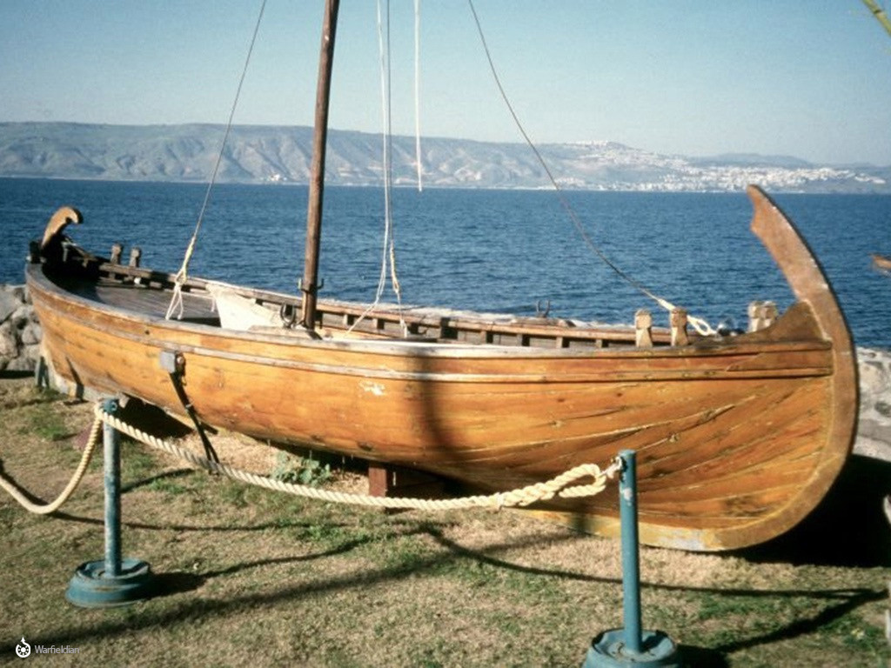
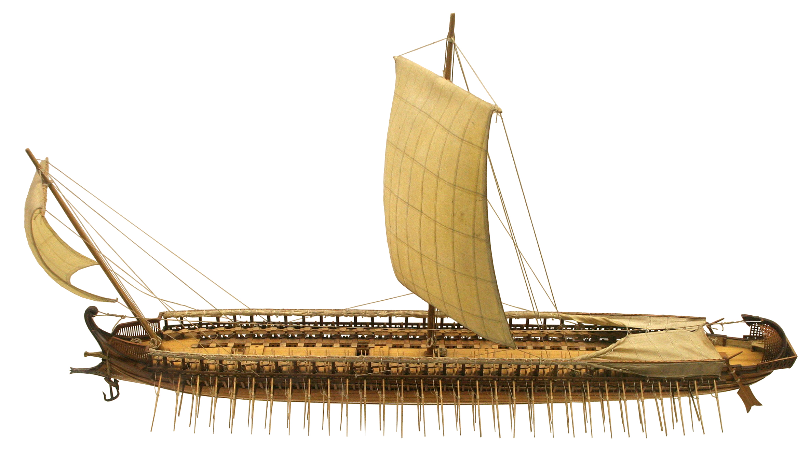

# Human-made Things in the Bible

## License Information

Human-made Things in the Bible © United Bible Societies, 2025. Adapted from: <cite>The Works of Their Hands: Man-made Things in the Bible</cite>, by Ray Pritz © 2009 United Bible Societies. This work is licensed under Creative Commons Attribution-ShareAlike 4.0 International (<a href="https://creativecommons.org/licenses/by-sa/4.0/">https://creativecommons.org/licenses/by-sa/4.0/</a>).

--------------------------------

## Boat, ship (id: REALIA:8.1)

8\.1 Boat, ship
===============

References:
-----------

Hebrew אֳנִי (’oni)

[1KI 9:26](https://ref.ly/1Kgs9:26), [1KI 9:27](https://ref.ly/1Kgs9:27), [1KI 10:11](https://ref.ly/1Kgs10:11), [1KI 10:22](https://ref.ly/1Kgs10:22), [1KI 10:22](https://ref.ly/1Kgs10:22), [1KI 10:22](https://ref.ly/1Kgs10:22), [ISA 33:21](https://ref.ly/Isa33:21)

Hebrew אֳנִיָּה (’oniyah)

[GEN 49:13](https://ref.ly/Gen49:13), [DEU 28:68](https://ref.ly/Deut28:68), [JDG 5:17](https://ref.ly/Judg5:17), [1KI 9:27](https://ref.ly/1Kgs9:27), [1KI 22:49](https://ref.ly/1Kgs22:49), [1KI 22:49](https://ref.ly/1Kgs22:49), [1KI 22:50](https://ref.ly/1Kgs22:50), [2CH 8:18](https://ref.ly/2Chr8:18), [2CH 8:18](https://ref.ly/2Chr8:18), [2CH 9:21](https://ref.ly/2Chr9:21), [2CH 9:21](https://ref.ly/2Chr9:21), [2CH 20:36](https://ref.ly/2Chr20:36), [2CH 20:36](https://ref.ly/2Chr20:36), [2CH 20:37](https://ref.ly/2Chr20:37), [JOB 9:26](https://ref.ly/Job9:26), [PSA 48:8](https://ref.ly/Ps48:8), [PSA 104:26](https://ref.ly/Ps104:26), [PSA 107:23](https://ref.ly/Ps107:23), [PRO 30:19](https://ref.ly/Prov30:19), [PRO 31:14](https://ref.ly/Prov31:14), [ISA 2:16](https://ref.ly/Isa2:16), [ISA 23:1](https://ref.ly/Isa23:1), [ISA 23:14](https://ref.ly/Isa23:14), [ISA 60:9](https://ref.ly/Isa60:9), [EZK 27:9](https://ref.ly/Ezek27:9), [EZK 27:25](https://ref.ly/Ezek27:25), [EZK 27:29](https://ref.ly/Ezek27:29), [DAN 11:40](https://ref.ly/Dan11:40), [JON 1:3](https://ref.ly/Jonah1:3), [JON 1:4](https://ref.ly/Jonah1:4), [JON 1:5](https://ref.ly/Jonah1:5)

Hebrew כְּלִי, גֹּמֶא (kle gome’)

[ISA 18:2](https://ref.ly/Isa18:2)

Hebrew סְפִינָה (sfinah)

[JON 1:5](https://ref.ly/Jonah1:5)

Hebrew צִי (tsi)

[NUM 24:24](https://ref.ly/Num24:24), [ISA 33:21](https://ref.ly/Isa33:21), [EZK 30:9](https://ref.ly/Ezek30:9), [DAN 11:30](https://ref.ly/Dan11:30)

Greek ναυαγέω (nauageō (verb))

[2CO 11:25](https://ref.ly/2Cor11:25), [1TI 1:19](https://ref.ly/1Tim1:19)

Greek ναύκληρος (nauklēros)

[ACT 27:11](https://ref.ly/Acts27:11)

Greek ναῦς (naus)

[ACT 27:41](https://ref.ly/Acts27:41), [WIS 5:10](https://ref.ly/Wis5:10), [4MA 7:1](https://ref.ly/4Macc7:1)

Greek πλοιάριον (ploiarion)

[MRK 3:9](https://ref.ly/Mark3:9), [JHN 6:22](https://ref.ly/John6:22), [JHN 6:23](https://ref.ly/John6:23), [JHN 6:24](https://ref.ly/John6:24), [JHN 21:8](https://ref.ly/John21:8)

Greek πλοῖον (ploion)

[MAT 4:21](https://ref.ly/Matt4:21), [MAT 4:22](https://ref.ly/Matt4:22), [MAT 8:23](https://ref.ly/Matt8:23), [MAT 8:24](https://ref.ly/Matt8:24), [MAT 9:1](https://ref.ly/Matt9:1), [MAT 13:2](https://ref.ly/Matt13:2), [MAT 14:13](https://ref.ly/Matt14:13), [MAT 14:22](https://ref.ly/Matt14:22), [MAT 14:24](https://ref.ly/Matt14:24), [MAT 14:29](https://ref.ly/Matt14:29), [MAT 14:32](https://ref.ly/Matt14:32), [MAT 14:33](https://ref.ly/Matt14:33), [MAT 15:39](https://ref.ly/Matt15:39), [MRK 1:19](https://ref.ly/Mark1:19), [MRK 1:20](https://ref.ly/Mark1:20), [MRK 4:1](https://ref.ly/Mark4:1), [MRK 4:36](https://ref.ly/Mark4:36), [MRK 4:36](https://ref.ly/Mark4:36), [MRK 4:37](https://ref.ly/Mark4:37), [MRK 4:37](https://ref.ly/Mark4:37), [MRK 5:2](https://ref.ly/Mark5:2), [MRK 5:18](https://ref.ly/Mark5:18), [MRK 5:21](https://ref.ly/Mark5:21), [MRK 6:32](https://ref.ly/Mark6:32), [MRK 6:45](https://ref.ly/Mark6:45), [MRK 6:47](https://ref.ly/Mark6:47), [MRK 6:51](https://ref.ly/Mark6:51), [MRK 6:54](https://ref.ly/Mark6:54), [MRK 8:10](https://ref.ly/Mark8:10), [MRK 8:14](https://ref.ly/Mark8:14), [LUK 5:2](https://ref.ly/Luke5:2), [LUK 5:3](https://ref.ly/Luke5:3), [LUK 5:3](https://ref.ly/Luke5:3), [LUK 5:7](https://ref.ly/Luke5:7), [LUK 5:7](https://ref.ly/Luke5:7), [LUK 5:11](https://ref.ly/Luke5:11), [LUK 8:22](https://ref.ly/Luke8:22), [LUK 8:37](https://ref.ly/Luke8:37), [JHN 6:17](https://ref.ly/John6:17), [JHN 6:19](https://ref.ly/John6:19), [JHN 6:21](https://ref.ly/John6:21), [JHN 6:21](https://ref.ly/John6:21), [JHN 6:22](https://ref.ly/John6:22), [JHN 6:23](https://ref.ly/John6:23), [JHN 21:3](https://ref.ly/John21:3), [JHN 21:6](https://ref.ly/John21:6), [ACT 20:13](https://ref.ly/Acts20:13), [ACT 20:38](https://ref.ly/Acts20:38), [ACT 21:2](https://ref.ly/Acts21:2), [ACT 21:3](https://ref.ly/Acts21:3), [ACT 21:6](https://ref.ly/Acts21:6), [ACT 27:2](https://ref.ly/Acts27:2), [ACT 27:6](https://ref.ly/Acts27:6), [ACT 27:10](https://ref.ly/Acts27:10), [ACT 27:15](https://ref.ly/Acts27:15), [ACT 27:17](https://ref.ly/Acts27:17), [ACT 27:19](https://ref.ly/Acts27:19), [ACT 27:22](https://ref.ly/Acts27:22), [ACT 27:30](https://ref.ly/Acts27:30), [ACT 27:31](https://ref.ly/Acts27:31), [ACT 27:37](https://ref.ly/Acts27:37), [ACT 27:38](https://ref.ly/Acts27:38), [ACT 27:39](https://ref.ly/Acts27:39), [ACT 27:44](https://ref.ly/Acts27:44), [ACT 28:11](https://ref.ly/Acts28:11), [JAS 3:4](https://ref.ly/Jas3:4), [REV 8:9](https://ref.ly/Rev8:9), [REV 18:19](https://ref.ly/Rev18:19), [WIS 14:1](https://ref.ly/Wis14:1), [SIR 33:2](https://ref.ly/Sir33:2), [1MA 8:26](https://ref.ly/1Macc8:26), [1MA 8:28](https://ref.ly/1Macc8:28), [1MA 11:1](https://ref.ly/1Macc11:1), [1MA 13:29](https://ref.ly/1Macc13:29), [1MA 15:3](https://ref.ly/1Macc15:3), [1MA 15:14](https://ref.ly/1Macc15:14), [1MA 15:37](https://ref.ly/1Macc15:37), [3MA 4:7](https://ref.ly/3Macc4:7), [3MA 4:9](https://ref.ly/3Macc4:9)

Greek σκάφη, σκάφος (skafē)

[ACT 27:16](https://ref.ly/Acts27:16), [ACT 27:30](https://ref.ly/Acts27:30), [ACT 27:32](https://ref.ly/Acts27:32), [BEL 1:33](https://ref.ly/Bel1:33), [2MA 12:3](https://ref.ly/2Macc12:3), [2MA 12:6](https://ref.ly/2Macc12:6)

Greek (stolos)

[1MA 1:17](https://ref.ly/1Macc1:17), [2MA 12:9](https://ref.ly/2Macc12:9), [2MA 14:1](https://ref.ly/2Macc14:1), [3MA 7:17](https://ref.ly/3Macc7:17)

Greek τριήρης (triērēs)

[2MA 4:20](https://ref.ly/2Macc4:20)

Latin navis

[2ES 9:34](https://ref.ly/2Esd9:34), [2ES 12:42](https://ref.ly/2Esd12:42)

Description and usage:
----------------------

*Sailing ship (© Free Bible Images © David Padfield)*

Boats and ships were vessels used for transport on water. They varied in size from very small boats, large enough for only three or four people, to ocean\-going ships capable of transporting many people and large amounts of cargo. Boats and ships were generally made of wood, although in Egypt, reeds were also used to construct at least parts of boats. These vessels were propelled in several ways: sails attached to a mast caught the wind and so moved the vessel; in smaller vessels (but also in some larger ones), oars were used to row; in places where the water was shallow, they could be moved by means of a pole pushing along the bed or bank of a river or stream.

---

Translation:
------------

*Fishermen in a boat with furled sail (© Free Bible Images © David Padfield)*

It may be very important to distinguish clearly between small fishing boats and larger ships or vessels. In a number of languages the distinction is based on whether or not such vessels have decks (see [8\.1\.11 Deck\<REALIA:8\.1\.11\>](#)). For the fishing boats on Lake Galilee there was probably no deck structure, while vessels going for long distances on the Mediterranean Sea would certainly have had decks.

Translators must avoid a word for “ship” that indicates modern ocean\-going steam\-powered ships; all larger vessels mentioned in the Bible (with the exception of the ark, which had no means of propulsion) were powered either by sails or by rowers. In land\-bound cultures where only small fishing boats are known, it is important to render “ships” as, for example, “big boats that sail on the ocean” or “big boats with sails to make them move on the ocean.”

[JOB 9:26](https://ref.ly/Job9:26): “Skiffs of reed” (RSV (Revised Standard Version (1952))) or papyrus were Nile River boats whose sides were made of papyrus reeds and which were known for their swift travel on the river. The first line of this verse may be rendered “My days go quickly like fast sailing boats.” In areas where sailing boats are unknown, the comparison may be shifted to any swift watercraft; for example, “My days flow swiftly like a fast dugout/canoe.” Where boats are completely unknown, it may be necessary to drop the image and say “My life is over very soon” or “The days of my life come quickly to an end.”

*A Greek warship with many oars (© Deutsches Museum, Munich, Germany, via Wikimedia Commons)*

[ISA 18:2](https://ref.ly/Isa18:2): Here the unique Hebrew phrase *kle gome’* means “vessels of papyrus” (RSV (Revised Standard Version (1952))) or “boats made of papyrus reed” and is equivalent to the Hebrew phrase *’oniyoth ’eveh* in [JOB 9:26](https://ref.ly/Job9:26). CEV (Contemporary English Version) provides a footnote, which reads “Ancient Egypt was famous for the papyrus reeds that grew in the Nile Delta,” but its rendering “ships made of reeds” gives the impression of too large a vessel. GNT (Good News Translation (1992)) and NCV (New Century Version) are better with “boats made of reeds”; compare NJB (New Jerusalem Bible (1985)) “little reed\-boats.”

In [JON 1:5](https://ref.ly/Jonah1:5) the Hebrew word *sfinah* indicates a ship that had a covered deck. It is equivalent to the word *’oniyah* in this verse. Where did Jonah go to sleep? To speak of the “ship’s hold” (GNT (Good News Translation (1992))) may suggest a more elaborate vessel than this one would be; the Hebrew word here is used for any recess or corner, as in a cave ([1SA 24:3](https://ref.ly/1Sam24:3)) or a house ([AMO 6:10](https://ref.ly/Amos6:10)). Jonah was simply finding the most remote and comfortable place for going quietly to sleep, where he would not be disturbed. CEV (Contemporary English Version) “down below deck” may serve as a model. Also good is FRCL (French Common Language Version (Bible en français courant)) “bottom of the boat.”

In the Gospels there is no real difference between the Greek words *ploion* and *ploiarion*, even though the latter word is the Greek diminutive of the former word. Both words refer to a fishing boat measuring about 8\.5 meters (28 feet) long and 2\.5 meters (8 feet) wide and able to hold 12–15 people. In the book of Acts and [JAS 3:4](https://ref.ly/Jas3:4), the word *ploion* refers to a larger vessel, capable of sailing on the open sea. This is true also in [REV 18:17](https://ref.ly/Rev18:17); [REV 18:19](https://ref.ly/Rev18:19). The reference in [REV 8:9](https://ref.ly/Rev8:9) may be to boats and ships of many sizes.

[ACT 27:16](https://ref.ly/Acts27:16); [ACT 27:30](https://ref.ly/Acts27:30); [ACT 27:32](https://ref.ly/Acts27:32): In these verses the Greek word *skafē* refers to a small boat that was normally kept aboard a larger ship and used by sailors in placing anchors, repairing the ship, or saving lives in the case of storms. In some languages *skafē* is equivalent to “rowboat” or “lifeboat.”

A few of the passages listed above (for example, [2MA 4:20](https://ref.ly/2Macc4:20)) refer to “warships.” The context will usually make this clear. Where special words exist for ships built for war, they can be used. However, translators should be careful not to introduce anachronistic terms for modern specialized warships such as cruisers, battleships, or aircraft carriers.

The Hebrew words *’oni* and *tsi* and the Greek word *stolos* refer to a large group of ships, that is, a “fleet.”

* **Associated Passages:** 1 Kings 9:26; 1 Kings 9:27; 1 Kings 10:11; 1 Kings 10:22; Isaiah 33:21; Genesis 49:13; Deuteronomy 28:68; Judges 5:17; 1 Kings 22:49; 1 Kings 22:50; 2 Chronicles 8:18; 2 Chronicles 9:21; 2 Chronicles 20:36; 2 Chronicles 20:37; Job 9:26; Psalms 48:8; Psalms 104:26; Psalms 107:23; Proverbs 30:19; Proverbs 31:14; Isaiah 2:16; Isaiah 23:1; Isaiah 23:14; Isaiah 60:9; Ezekiel 27:9; Ezekiel 27:25; Ezekiel 27:29; Daniel 11:40; Jonah 1:3; Jonah 1:4; Jonah 1:5; Isaiah 18:2; Numbers 24:24; Ezekiel 30:9; Daniel 11:30; 2 Corinthians 11:25; 1 Timothy 1:19; Acts 27:11; Acts 27:41; Wisdom of Solomon 5:10; 4 Maccabees 7:1; Mark 3:9; John 6:22; John 6:23; John 6:24; John 21:8; Matthew 4:21; Matthew 4:22; Matthew 8:23; Matthew 8:24; Matthew 9:1; Matthew 13:2; Matthew 14:13; Matthew 14:22; Matthew 14:24; Matthew 14:29; Matthew 14:32; Matthew 14:33; Matthew 15:39; Mark 1:19; Mark 1:20; Mark 4:1; Mark 4:36; Mark 4:37; Mark 5:2; Mark 5:18; Mark 5:21; Mark 6:32; Mark 6:45; Mark 6:47; Mark 6:51; Mark 6:54; Mark 8:10; Mark 8:14; Luke 5:2; Luke 5:3; Luke 5:7; Luke 5:11; Luke 8:22; Luke 8:37; John 6:17; John 6:19; John 6:21; John 21:3; John 21:6; Acts 20:13; Acts 20:38; Acts 21:2; Acts 21:3; Acts 21:6; Acts 27:2; Acts 27:6; Acts 27:10; Acts 27:15; Acts 27:17; Acts 27:19; Acts 27:22; Acts 27:30; Acts 27:31; Acts 27:37; Acts 27:38; Acts 27:39; Acts 27:44; Acts 28:11; James 3:4; Revelation 8:9; Revelation 18:19; Wisdom of Solomon 14:1; Sirach 33:2; 1 Maccabees 8:26; 1 Maccabees 8:28; 1 Maccabees 11:1; 1 Maccabees 13:29; 1 Maccabees 15:3; 1 Maccabees 15:14; 1 Maccabees 15:37; 3 Maccabees 4:7; 3 Maccabees 4:9; Acts 27:16; Acts 27:32; Bel and the Dragon 1:33; 2 Maccabees 12:3; 2 Maccabees 12:6; 1 Maccabees 1:17; 2 Maccabees 12:9; 2 Maccabees 14:1; 3 Maccabees 7:17; 2 Maccabees 4:20; 2 Esdras (Latin) 9:34; 2 Esdras (Latin) 12:42; 1 Samuel 24:3; Amos 6:10; Revelation 18:17

