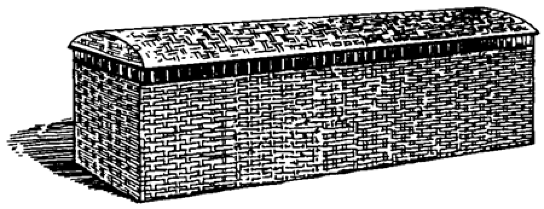

# Human-made Things in the Bible

## License Information

Human-made Things in the Bible © United Bible Societies, 2025. Adapted from: <cite>The Works of Their Hands: Man-made Things in the Bible</cite>, by Ray Pritz © 2009 United Bible Societies. This work is licensed under Creative Commons Attribution-ShareAlike 4.0 International (<a href="https://creativecommons.org/licenses/by-sa/4.0/">https://creativecommons.org/licenses/by-sa/4.0/</a>).

--------------------------------

## Basket, small boat (id: REALIA:8.1.1)

8\.1\.1 Basket, small boat
==========================

References:
-----------

Hebrew תֵּבָה (tevah)

[EXO 2:3](https://ref.ly/Exod2:3), [EXO 2:5](https://ref.ly/Exod2:5)

Description:
------------

*Reed basket (Don Ellens, The Tabernacle of Israel, Harris, Jones 1888, Public domain)*

The basket in [EXO 2:3](https://ref.ly/Exod2:3) was a small boat made of papyrus reeds. Its exact size is not given, but it would have been large enough to hold a newborn baby. The basket was made watertight by a coating of tar (bitumen) and pitch, presumably on the outside.

---

Translation:
------------

Older English versions translated the Hebrew word *tevah* as “ark” (KJV (King James Version (1611))) in [EXO 2:3](https://ref.ly/Exod2:3); [EXO 2:5](https://ref.ly/Exod2:5). This is confusing. Even though the same Hebrew word (literally “box”) is used for both this small boat and for Noah’s large ship (see [8\.1\.3 Ark, ship\<REALIA:8\.1\.3\>](#)), the translator should not try to find a single word for both.

* **Associated Passages:** Exodus 2:3; Exodus 2:5

* **Associated ACAI Concepts:** Ship (ID: `realia:Ship`); Cattails (ID: `flora:Cattails`)
