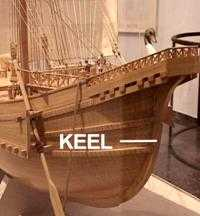

# Human-made Things in the Bible

## License Information

Human-made Things in the Bible © United Bible Societies, 2025. Adapted from: <cite>The Works of Their Hands: Man-made Things in the Bible</cite>, by Ray Pritz © 2009 United Bible Societies. This work is licensed under Creative Commons Attribution-ShareAlike 4.0 International (<a href="https://creativecommons.org/licenses/by-sa/4.0/">https://creativecommons.org/licenses/by-sa/4.0/</a>).

--------------------------------

## Keel (id: REALIA:8.1.9)

8\.1\.9 Keel
============

Reference:
----------

Greek τρόπις (tropis)

[WIS 5:10](https://ref.ly/Wis5:10)

Description and usage:
----------------------

*The hydrodynamic keel of a boat (© United Bible Societies, 2001\)*

The keel was the bottom, center structural part of a boat or ship. It usually extended somewhat below the bottom of the vessel in order to add to its stability.

---

Translation:
------------

Even where ships and boats are known, the average reader may not be familiar with specific parts of such a vessel. Therefore it may be best to avoid the technical term in [WIS 5:10](https://ref.ly/Wis5:10). For the more literal “when it has passed no trace can be found, nor track of its keel in the waves” (RSV (Revised Standard Version (1952))), GNT (Good News Translation (1992)) has “when it is gone, it leaves no trace. You cannot tell it was ever there.”

* **Associated Passages:** Wisdom of Solomon 5:10

