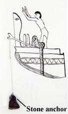

# Human-made Things in the Bible

## License Information

Human-made Things in the Bible © United Bible Societies, 2025. Adapted from: <cite>The Works of Their Hands: Man-made Things in the Bible</cite>, by Ray Pritz © 2009 United Bible Societies. This work is licensed under Creative Commons Attribution-ShareAlike 4.0 International (<a href="https://creativecommons.org/licenses/by-sa/4.0/">https://creativecommons.org/licenses/by-sa/4.0/</a>).

--------------------------------

## Boat, ship (id: REALIA:8.1)

8\.1 Boat, ship
===============

References:
-----------

Hebrew אֳנִי (’oni)

[1KI 9:26](https://ref.ly/1Kgs9:26), [1KI 9:27](https://ref.ly/1Kgs9:27), [1KI 10:11](https://ref.ly/1Kgs10:11), [1KI 10:22](https://ref.ly/1Kgs10:22), [1KI 10:22](https://ref.ly/1Kgs10:22), [1KI 10:22](https://ref.ly/1Kgs10:22), [ISA 33:21](https://ref.ly/Isa33:21)

Hebrew אֳנִיָּה (’oniyah)

[GEN 49:13](https://ref.ly/Gen49:13), [DEU 28:68](https://ref.ly/Deut28:68), [JDG 5:17](https://ref.ly/Judg5:17), [1KI 9:27](https://ref.ly/1Kgs9:27), [1KI 22:49](https://ref.ly/1Kgs22:49), [1KI 22:49](https://ref.ly/1Kgs22:49), [1KI 22:50](https://ref.ly/1Kgs22:50), [2CH 8:18](https://ref.ly/2Chr8:18), [2CH 8:18](https://ref.ly/2Chr8:18), [2CH 9:21](https://ref.ly/2Chr9:21), [2CH 9:21](https://ref.ly/2Chr9:21), [2CH 20:36](https://ref.ly/2Chr20:36), [2CH 20:36](https://ref.ly/2Chr20:36), [2CH 20:37](https://ref.ly/2Chr20:37), [JOB 9:26](https://ref.ly/Job9:26), [PSA 48:8](https://ref.ly/Ps48:8), [PSA 104:26](https://ref.ly/Ps104:26), [PSA 107:23](https://ref.ly/Ps107:23), [PRO 30:19](https://ref.ly/Prov30:19), [PRO 31:14](https://ref.ly/Prov31:14), [ISA 2:16](https://ref.ly/Isa2:16), [ISA 23:1](https://ref.ly/Isa23:1), [ISA 23:14](https://ref.ly/Isa23:14), [ISA 60:9](https://ref.ly/Isa60:9), [EZK 27:9](https://ref.ly/Ezek27:9), [EZK 27:25](https://ref.ly/Ezek27:25), [EZK 27:29](https://ref.ly/Ezek27:29), [DAN 11:40](https://ref.ly/Dan11:40), [JON 1:3](https://ref.ly/Jonah1:3), [JON 1:4](https://ref.ly/Jonah1:4), [JON 1:5](https://ref.ly/Jonah1:5)

Hebrew כְּלִי, גֹּמֶא (kle gome’)

[ISA 18:2](https://ref.ly/Isa18:2)

Hebrew סְפִינָה (sfinah)

[JON 1:5](https://ref.ly/Jonah1:5)

Hebrew צִי (tsi)

[NUM 24:24](https://ref.ly/Num24:24), [ISA 33:21](https://ref.ly/Isa33:21), [EZK 30:9](https://ref.ly/Ezek30:9), [DAN 11:30](https://ref.ly/Dan11:30)

Greek ναυαγέω (nauageō (verb))

[2CO 11:25](https://ref.ly/2Cor11:25), [1TI 1:19](https://ref.ly/1Tim1:19)

Greek ναύκληρος (nauklēros)

[ACT 27:11](https://ref.ly/Acts27:11)

Greek ναῦς (naus)

[ACT 27:41](https://ref.ly/Acts27:41), [WIS 5:10](https://ref.ly/Wis5:10), [4MA 7:1](https://ref.ly/4Macc7:1)

Greek πλοιάριον (ploiarion)

[MRK 3:9](https://ref.ly/Mark3:9), [JHN 6:22](https://ref.ly/John6:22), [JHN 6:23](https://ref.ly/John6:23), [JHN 6:24](https://ref.ly/John6:24), [JHN 21:8](https://ref.ly/John21:8)

Greek πλοῖον (ploion)

[MAT 4:21](https://ref.ly/Matt4:21), [MAT 4:22](https://ref.ly/Matt4:22), [MAT 8:23](https://ref.ly/Matt8:23), [MAT 8:24](https://ref.ly/Matt8:24), [MAT 9:1](https://ref.ly/Matt9:1), [MAT 13:2](https://ref.ly/Matt13:2), [MAT 14:13](https://ref.ly/Matt14:13), [MAT 14:22](https://ref.ly/Matt14:22), [MAT 14:24](https://ref.ly/Matt14:24), [MAT 14:29](https://ref.ly/Matt14:29), [MAT 14:32](https://ref.ly/Matt14:32), [MAT 14:33](https://ref.ly/Matt14:33), [MAT 15:39](https://ref.ly/Matt15:39), [MRK 1:19](https://ref.ly/Mark1:19), [MRK 1:20](https://ref.ly/Mark1:20), [MRK 4:1](https://ref.ly/Mark4:1), [MRK 4:36](https://ref.ly/Mark4:36), [MRK 4:36](https://ref.ly/Mark4:36), [MRK 4:37](https://ref.ly/Mark4:37), [MRK 4:37](https://ref.ly/Mark4:37), [MRK 5:2](https://ref.ly/Mark5:2), [MRK 5:18](https://ref.ly/Mark5:18), [MRK 5:21](https://ref.ly/Mark5:21), [MRK 6:32](https://ref.ly/Mark6:32), [MRK 6:45](https://ref.ly/Mark6:45), [MRK 6:47](https://ref.ly/Mark6:47), [MRK 6:51](https://ref.ly/Mark6:51), [MRK 6:54](https://ref.ly/Mark6:54), [MRK 8:10](https://ref.ly/Mark8:10), [MRK 8:14](https://ref.ly/Mark8:14), [LUK 5:2](https://ref.ly/Luke5:2), [LUK 5:3](https://ref.ly/Luke5:3), [LUK 5:3](https://ref.ly/Luke5:3), [LUK 5:7](https://ref.ly/Luke5:7), [LUK 5:7](https://ref.ly/Luke5:7), [LUK 5:11](https://ref.ly/Luke5:11), [LUK 8:22](https://ref.ly/Luke8:22), [LUK 8:37](https://ref.ly/Luke8:37), [JHN 6:17](https://ref.ly/John6:17), [JHN 6:19](https://ref.ly/John6:19), [JHN 6:21](https://ref.ly/John6:21), [JHN 6:21](https://ref.ly/John6:21), [JHN 6:22](https://ref.ly/John6:22), [JHN 6:23](https://ref.ly/John6:23), [JHN 21:3](https://ref.ly/John21:3), [JHN 21:6](https://ref.ly/John21:6), [ACT 20:13](https://ref.ly/Acts20:13), [ACT 20:38](https://ref.ly/Acts20:38), [ACT 21:2](https://ref.ly/Acts21:2), [ACT 21:3](https://ref.ly/Acts21:3), [ACT 21:6](https://ref.ly/Acts21:6), [ACT 27:2](https://ref.ly/Acts27:2), [ACT 27:6](https://ref.ly/Acts27:6), [ACT 27:10](https://ref.ly/Acts27:10), [ACT 27:15](https://ref.ly/Acts27:15), [ACT 27:17](https://ref.ly/Acts27:17), [ACT 27:19](https://ref.ly/Acts27:19), [ACT 27:22](https://ref.ly/Acts27:22), [ACT 27:30](https://ref.ly/Acts27:30), [ACT 27:31](https://ref.ly/Acts27:31), [ACT 27:37](https://ref.ly/Acts27:37), [ACT 27:38](https://ref.ly/Acts27:38), [ACT 27:39](https://ref.ly/Acts27:39), [ACT 27:44](https://ref.ly/Acts27:44), [ACT 28:11](https://ref.ly/Acts28:11), [JAS 3:4](https://ref.ly/Jas3:4), [REV 8:9](https://ref.ly/Rev8:9), [REV 18:19](https://ref.ly/Rev18:19), [WIS 14:1](https://ref.ly/Wis14:1), [SIR 33:2](https://ref.ly/Sir33:2), [1MA 8:26](https://ref.ly/1Macc8:26), [1MA 8:28](https://ref.ly/1Macc8:28), [1MA 11:1](https://ref.ly/1Macc11:1), [1MA 13:29](https://ref.ly/1Macc13:29), [1MA 15:3](https://ref.ly/1Macc15:3), [1MA 15:14](https://ref.ly/1Macc15:14), [1MA 15:37](https://ref.ly/1Macc15:37), [3MA 4:7](https://ref.ly/3Macc4:7), [3MA 4:9](https://ref.ly/3Macc4:9)

Greek σκάφη, σκάφος (skafē)

[ACT 27:16](https://ref.ly/Acts27:16), [ACT 27:30](https://ref.ly/Acts27:30), [ACT 27:32](https://ref.ly/Acts27:32), [BEL 1:33](https://ref.ly/Bel1:33), [2MA 12:3](https://ref.ly/2Macc12:3), [2MA 12:6](https://ref.ly/2Macc12:6)

Greek (stolos)

[1MA 1:17](https://ref.ly/1Macc1:17), [2MA 12:9](https://ref.ly/2Macc12:9), [2MA 14:1](https://ref.ly/2Macc14:1), [3MA 7:17](https://ref.ly/3Macc7:17)

Greek τριήρης (triērēs)

[2MA 4:20](https://ref.ly/2Macc4:20)

Latin navis

[2ES 9:34](https://ref.ly/2Esd9:34), [2ES 12:42](https://ref.ly/2Esd12:42)

Description and usage:
----------------------

*Sailing ship (© Free Bible Images © David Padfield)*

Boats and ships were vessels used for transport on water. They varied in size from very small boats, large enough for only three or four people, to ocean\-going ships capable of transporting many people and large amounts of cargo. Boats and ships were generally made of wood, although in Egypt, reeds were also used to construct at least parts of boats. These vessels were propelled in several ways: sails attached to a mast caught the wind and so moved the vessel; in smaller vessels (but also in some larger ones), oars were used to row; in places where the water was shallow, they could be moved by means of a pole pushing along the bed or bank of a river or stream.

---

Translation:
------------

*Fishermen in a boat with furled sail (© Free Bible Images © David Padfield)*

It may be very important to distinguish clearly between small fishing boats and larger ships or vessels. In a number of languages the distinction is based on whether or not such vessels have decks (see [8\.1\.11 Deck\<REALIA:8\.1\.11\>](#)). For the fishing boats on Lake Galilee there was probably no deck structure, while vessels going for long distances on the Mediterranean Sea would certainly have had decks.

Translators must avoid a word for “ship” that indicates modern ocean\-going steam\-powered ships; all larger vessels mentioned in the Bible (with the exception of the ark, which had no means of propulsion) were powered either by sails or by rowers. In land\-bound cultures where only small fishing boats are known, it is important to render “ships” as, for example, “big boats that sail on the ocean” or “big boats with sails to make them move on the ocean.”

[JOB 9:26](https://ref.ly/Job9:26): “Skiffs of reed” (RSV (Revised Standard Version (1952))) or papyrus were Nile River boats whose sides were made of papyrus reeds and which were known for their swift travel on the river. The first line of this verse may be rendered “My days go quickly like fast sailing boats.” In areas where sailing boats are unknown, the comparison may be shifted to any swift watercraft; for example, “My days flow swiftly like a fast dugout/canoe.” Where boats are completely unknown, it may be necessary to drop the image and say “My life is over very soon” or “The days of my life come quickly to an end.”

*A Greek warship with many oars (© Deutsches Museum, Munich, Germany, via Wikimedia Commons)*

[ISA 18:2](https://ref.ly/Isa18:2): Here the unique Hebrew phrase *kle gome’* means “vessels of papyrus” (RSV (Revised Standard Version (1952))) or “boats made of papyrus reed” and is equivalent to the Hebrew phrase *’oniyoth ’eveh* in [JOB 9:26](https://ref.ly/Job9:26). CEV (Contemporary English Version) provides a footnote, which reads “Ancient Egypt was famous for the papyrus reeds that grew in the Nile Delta,” but its rendering “ships made of reeds” gives the impression of too large a vessel. GNT (Good News Translation (1992)) and NCV (New Century Version) are better with “boats made of reeds”; compare NJB (New Jerusalem Bible (1985)) “little reed\-boats.”

In [JON 1:5](https://ref.ly/Jonah1:5) the Hebrew word *sfinah* indicates a ship that had a covered deck. It is equivalent to the word *’oniyah* in this verse. Where did Jonah go to sleep? To speak of the “ship’s hold” (GNT (Good News Translation (1992))) may suggest a more elaborate vessel than this one would be; the Hebrew word here is used for any recess or corner, as in a cave ([1SA 24:3](https://ref.ly/1Sam24:3)) or a house ([AMO 6:10](https://ref.ly/Amos6:10)). Jonah was simply finding the most remote and comfortable place for going quietly to sleep, where he would not be disturbed. CEV (Contemporary English Version) “down below deck” may serve as a model. Also good is FRCL (French Common Language Version (Bible en français courant)) “bottom of the boat.”

In the Gospels there is no real difference between the Greek words *ploion* and *ploiarion*, even though the latter word is the Greek diminutive of the former word. Both words refer to a fishing boat measuring about 8\.5 meters (28 feet) long and 2\.5 meters (8 feet) wide and able to hold 12–15 people. In the book of Acts and [JAS 3:4](https://ref.ly/Jas3:4), the word *ploion* refers to a larger vessel, capable of sailing on the open sea. This is true also in [REV 18:17](https://ref.ly/Rev18:17); [REV 18:19](https://ref.ly/Rev18:19). The reference in [REV 8:9](https://ref.ly/Rev8:9) may be to boats and ships of many sizes.

[ACT 27:16](https://ref.ly/Acts27:16); [ACT 27:30](https://ref.ly/Acts27:30); [ACT 27:32](https://ref.ly/Acts27:32): In these verses the Greek word *skafē* refers to a small boat that was normally kept aboard a larger ship and used by sailors in placing anchors, repairing the ship, or saving lives in the case of storms. In some languages *skafē* is equivalent to “rowboat” or “lifeboat.”

A few of the passages listed above (for example, [2MA 4:20](https://ref.ly/2Macc4:20)) refer to “warships.” The context will usually make this clear. Where special words exist for ships built for war, they can be used. However, translators should be careful not to introduce anachronistic terms for modern specialized warships such as cruisers, battleships, or aircraft carriers.

The Hebrew words *’oni* and *tsi* and the Greek word *stolos* refer to a large group of ships, that is, a “fleet.”

* **Associated Passages:** 1 Kings 9:26; 1 Kings 9:27; 1 Kings 10:11; 1 Kings 10:22; Isaiah 33:21; Genesis 49:13; Deuteronomy 28:68; Judges 5:17; 1 Kings 22:49; 1 Kings 22:50; 2 Chronicles 8:18; 2 Chronicles 9:21; 2 Chronicles 20:36; 2 Chronicles 20:37; Job 9:26; Psalms 48:8; Psalms 104:26; Psalms 107:23; Proverbs 30:19; Proverbs 31:14; Isaiah 2:16; Isaiah 23:1; Isaiah 23:14; Isaiah 60:9; Ezekiel 27:9; Ezekiel 27:25; Ezekiel 27:29; Daniel 11:40; Jonah 1:3; Jonah 1:4; Jonah 1:5; Isaiah 18:2; Numbers 24:24; Ezekiel 30:9; Daniel 11:30; 2 Corinthians 11:25; 1 Timothy 1:19; Acts 27:11; Acts 27:41; Wisdom of Solomon 5:10; 4 Maccabees 7:1; Mark 3:9; John 6:22; John 6:23; John 6:24; John 21:8; Matthew 4:21; Matthew 4:22; Matthew 8:23; Matthew 8:24; Matthew 9:1; Matthew 13:2; Matthew 14:13; Matthew 14:22; Matthew 14:24; Matthew 14:29; Matthew 14:32; Matthew 14:33; Matthew 15:39; Mark 1:19; Mark 1:20; Mark 4:1; Mark 4:36; Mark 4:37; Mark 5:2; Mark 5:18; Mark 5:21; Mark 6:32; Mark 6:45; Mark 6:47; Mark 6:51; Mark 6:54; Mark 8:10; Mark 8:14; Luke 5:2; Luke 5:3; Luke 5:7; Luke 5:11; Luke 8:22; Luke 8:37; John 6:17; John 6:19; John 6:21; John 21:3; John 21:6; Acts 20:13; Acts 20:38; Acts 21:2; Acts 21:3; Acts 21:6; Acts 27:2; Acts 27:6; Acts 27:10; Acts 27:15; Acts 27:17; Acts 27:19; Acts 27:22; Acts 27:30; Acts 27:31; Acts 27:37; Acts 27:38; Acts 27:39; Acts 27:44; Acts 28:11; James 3:4; Revelation 8:9; Revelation 18:19; Wisdom of Solomon 14:1; Sirach 33:2; 1 Maccabees 8:26; 1 Maccabees 8:28; 1 Maccabees 11:1; 1 Maccabees 13:29; 1 Maccabees 15:3; 1 Maccabees 15:14; 1 Maccabees 15:37; 3 Maccabees 4:7; 3 Maccabees 4:9; Acts 27:16; Acts 27:32; Bel and the Dragon 1:33; 2 Maccabees 12:3; 2 Maccabees 12:6; 1 Maccabees 1:17; 2 Maccabees 12:9; 2 Maccabees 14:1; 3 Maccabees 7:17; 2 Maccabees 4:20; 2 Esdras (Latin) 9:34; 2 Esdras (Latin) 12:42; 1 Samuel 24:3; Amos 6:10; Revelation 18:17

* **Associated ACAI Concepts:** Ship (ID: `realia:Ship`)

## Basket, small boat (id: REALIA:8.1.1)

8\.1\.1 Basket, small boat
==========================

References:
-----------

Hebrew תֵּבָה (tevah)

[EXO 2:3](https://ref.ly/Exod2:3), [EXO 2:5](https://ref.ly/Exod2:5)

Description:
------------

*Reed basket (Don Ellens, The Tabernacle of Israel, Harris, Jones 1888, Public domain)*

The basket in [EXO 2:3](https://ref.ly/Exod2:3) was a small boat made of papyrus reeds. Its exact size is not given, but it would have been large enough to hold a newborn baby. The basket was made watertight by a coating of tar (bitumen) and pitch, presumably on the outside.

---

Translation:
------------

Older English versions translated the Hebrew word *tevah* as “ark” (KJV (King James Version (1611))) in [EXO 2:3](https://ref.ly/Exod2:3); [EXO 2:5](https://ref.ly/Exod2:5). This is confusing. Even though the same Hebrew word (literally “box”) is used for both this small boat and for Noah’s large ship (see [8\.1\.3 Ark, ship\<REALIA:8\.1\.3\>](#)), the translator should not try to find a single word for both.

* **Associated Passages:** Exodus 2:3; Exodus 2:5

* **Associated ACAI Concepts:** Ship (ID: `realia:Ship`); Cattails (ID: `flora:Cattails`)

## Raft, float (id: REALIA:8.1.2)

8\.1\.2 Raft, float
===================

References:
-----------

Hebrew דֹּבְרוֹת (dovroth)

[1KI 5:23](https://ref.ly/1Kgs5:23)

Greek σχεδία (schedia)

[WIS 14:5](https://ref.ly/Wis14:5), [WIS 14:6](https://ref.ly/Wis14:6), [1ES 5:53](https://ref.ly/1Esd5:53)

Description and usage:
----------------------

*A man fishes from a raft made of inflated animal skins (Austen Henry Layard, Nineveh and Babylon: a narrative of a second expedition to Assyria during the years 1849, 1850, and 1851, Public domain, via archive.org)*

The raft was a floating surface made by binding logs or planks together. A raft could also be made of inflated animal skins, as in the illustration below. It could be used for transporting people or goods.

---

Translation:
------------

While many languages have a special word for logs tied together to make a raft, it is possible to avoid using a precise term. In the middle of [1KI 5:9](https://ref.ly/1Kgs5:9), CEV (Contemporary English Version) has “They will tie the logs together and float them along the coast.” Here and in [1ES 5:53](https://ref.ly/1Esd5:53), the rafts are not for transport but only a means of moving the logs from one place to another.

In [WIS 14:5](https://ref.ly/Wis14:5); [WIS 14:6](https://ref.ly/Wis14:6) there is a double usage of the Greek word *schedia*. Verse 5 speaks of the way people can travel on the big ocean on nothing more than a small amount of floating wood. Verse 6 is a recollection of the ark in which Noah and his family (and through them all of humanity) were saved. RSV (Revised Standard Version (1952)), NAB (New American Bible (1970)), and NJB (New Jerusalem Bible (1985)) use “raft” in both verses, so the reference to the ark is somewhat obscured. NJB (New Jerusalem Bible (1985)) adds a footnote to verse 6 indicating that the reference is to Noah’s ark. GNT (Good News Translation (1992)) is better with the word “boat” in both verses. GNT (Good News Translation (1992)) ’s section heading for [WIS 14:1–WIS 14:11](https://ref.ly/Wis14:1-Wis14:11) is “Wooden Idols Compared with Noah’s Wooden Boat.” This explains that the whole passage is about Noah’s ark.

* **Associated Passages:** 1 Kings 5:23; Wisdom of Solomon 14:5; Wisdom of Solomon 14:6; 1 Esdras (Greek) 5:53; 1 Kings 5:9; Wisdom of Solomon 14:1; Wisdom of Solomon 14:11

## Ark, ship (id: REALIA:8.1.3)

8\.1\.3 Ark, ship
=================

References:
-----------

Hebrew תֵּבָה (tevah)

[GEN 6:14](https://ref.ly/Gen6:14), [GEN 6:14](https://ref.ly/Gen6:14), [GEN 6:15](https://ref.ly/Gen6:15), [GEN 6:16](https://ref.ly/Gen6:16), [GEN 6:16](https://ref.ly/Gen6:16), [GEN 6:18](https://ref.ly/Gen6:18), [GEN 6:19](https://ref.ly/Gen6:19), [GEN 7:1](https://ref.ly/Gen7:1), [GEN 7:7](https://ref.ly/Gen7:7), [GEN 7:9](https://ref.ly/Gen7:9), [GEN 7:13](https://ref.ly/Gen7:13), [GEN 7:15](https://ref.ly/Gen7:15), [GEN 7:17](https://ref.ly/Gen7:17), [GEN 7:18](https://ref.ly/Gen7:18), [GEN 7:23](https://ref.ly/Gen7:23), [GEN 8:1](https://ref.ly/Gen8:1), [GEN 8:4](https://ref.ly/Gen8:4), [GEN 8:6](https://ref.ly/Gen8:6), [GEN 8:9](https://ref.ly/Gen8:9), [GEN 8:9](https://ref.ly/Gen8:9), [GEN 8:10](https://ref.ly/Gen8:10), [GEN 8:13](https://ref.ly/Gen8:13), [GEN 8:16](https://ref.ly/Gen8:16), [GEN 8:19](https://ref.ly/Gen8:19), [GEN 9:10](https://ref.ly/Gen9:10), [GEN 9:18](https://ref.ly/Gen9:18)

Greek κιβωτός (kibōtos)

[MAT 24:38](https://ref.ly/Matt24:38), [LUK 17:27](https://ref.ly/Luke17:27), [HEB 11:7](https://ref.ly/Heb11:7), [1PE 3:20](https://ref.ly/1Pet3:20), [2MA 2:4](https://ref.ly/2Macc2:4), [4MA 15:31](https://ref.ly/4Macc15:31), [1ES 1:3](https://ref.ly/1Esd1:3), [1ES 1:51](https://ref.ly/1Esd1:51)

Description:
------------

*Noah's Ark \- Artist's conception (Don Ellens, The Tabernacle of Israel, Harris, Jones 1888, Public domain)*

The ark was the vessel built by Noah. Its dimensions and materials are described in [GEN 6:14](https://ref.ly/Gen6:14); [GEN 6:15](https://ref.ly/Gen6:15); [GEN 6:16](https://ref.ly/Gen6:16), which gives it a length of 135–150 meters (443–492 feet), a width of 22\.5–25 meters (74–82 feet), and a height of 13\.5–15 meters (44–49 feet). The ark was made of wood and had three decks or levels and a roof. Each deck was divided into rooms or compartments. Except for an entrance door in its side and one window (both of unspecified size), the ark was closed in all around and would have resembled a large wooden box.

---

Translation:
------------

The central meaning of both the Hebrew word *tevah* and the Greek word *kibōtos* is “box” or “chest.” These words were apparently applied to Noah’s vessel in view of the type of construction and the fact that it resembled more a barge than a seagoing vessel. However, in view of the size of Noah’s ark, it is probably best in most languages to speak of it as a “ship.”

When translating the dimensions of Noah’s ark given in [GEN 6:15](https://ref.ly/Gen6:15); [GEN 6:16](https://ref.ly/Gen6:16), it is best to use modern units of measurement understood by the reader. Thus the American edition of GNT (Good News Translation (1992)) uses feet and inches, while other modern languages give the measurements in metric units (for example, SPCL (Spanish Common Language Version (Dios Habla Hoy)) and FRCL (French Common Language Version (Bible en français courant))). While the exact length of the Hebrew unit used in [GEN 6:0](https://ref.ly/Gen6:0) is uncertain, it is clear that the dimensions of the ark would have made it the largest ship ever built until the early twentieth century. Where possible, translations should reflect that this was an extremely large vessel. Thus, for example, in English “ship” is preferable to “boat.”

* **Associated Passages:** Genesis 6:14; Genesis 6:15; Genesis 6:16; Genesis 6:18; Genesis 6:19; Genesis 7:1; Genesis 7:7; Genesis 7:9; Genesis 7:13; Genesis 7:15; Genesis 7:17; Genesis 7:18; Genesis 7:23; Genesis 8:1; Genesis 8:4; Genesis 8:6; Genesis 8:9; Genesis 8:10; Genesis 8:13; Genesis 8:16; Genesis 8:19; Genesis 9:10; Genesis 9:18; Matthew 24:38; Luke 17:27; Hebrews 11:7; 1 Peter 3:20; 2 Maccabees 2:4; 4 Maccabees 15:31; 1 Esdras (Greek) 1:3; 1 Esdras (Greek) 1:51; Genesis 6:0

* **Associated ACAI Concepts:** Ship (ID: `realia:Ship`)

## Mast (id: REALIA:8.1.4)

8\.1\.4 Mast
============

References:
-----------

Hebrew חִבֵּל (chibel)

[PRO 23:34](https://ref.ly/Prov23:34)

Hebrew תֹּרֶן (toren)

[ISA 33:23](https://ref.ly/Isa33:23), [EZK 27:5](https://ref.ly/Ezek27:5)

Description:
------------

The mast was a strong wooden pole to which a sail ([8\.1\.5 Sail\<REALIA:8\.1\.5\>](#)) was attached. The pole was mounted vertically on the boat or ship and attached to its bottom. Its height and diameter varied with the size of the vessel.

---

Translation:
------------

In [PRO 23:34](https://ref.ly/Prov23:34) some translations render the Hebrew word *chibel* as “rigging” (REB (Revised English Bible (1989)), HOTTP (Hebrew Old Testament Text Project (UBS))). However, languages that cannot express “mast” will probably also have difficulty with “rigging.” Where it is difficult to express the idea of the mast or rigging of a ship, translators may follow CEV (Contemporary English Version), which renders the whole verse as “You will feel tossed about like someone trying to sleep on a ship in a storm.”

* **Associated Passages:** Proverbs 23:34; Isaiah 33:23; Ezekiel 27:5

* **Associated ACAI Concepts:** Mast (ID: `realia:Mast`)

## Sail (id: REALIA:8.1.5)

8\.1\.5 Sail
============

References:
-----------

Hebrew נֵס (nes)

[ISA 33:23](https://ref.ly/Isa33:23)

Hebrew מִפְרָשׂ (mifras)

[EZK 27:7](https://ref.ly/Ezek27:7)

Greek ἀρτέμων (artemōn)

[ACT 27:40](https://ref.ly/Acts27:40)

Description and usage:
----------------------

The sail was a cloth attached above a boat in such a way as to catch the wind and thus propel the boat through the water.

---

Translation:
------------

A sail may be rendered in some languages as “piece of cloth to make the ship move” or “cloth on the ship to catch the wind.” In [ACT 27:40](https://ref.ly/Acts27:40) the Greek word *artemōn* may refer to the foresail, that is, a relatively small sail toward the prow or front of the ship.

* **Associated Passages:** Isaiah 33:23; Ezekiel 27:7; Acts 27:40

* **Associated ACAI Concepts:** Sail (ID: `realia:Sail`)

## Anchor (id: REALIA:8.1.6)

8\.1\.6 Anchor
==============

References:
-----------

Greek ἄγκυρα (agkura)

[ACT 27:29](https://ref.ly/Acts27:29), [ACT 27:30](https://ref.ly/Acts27:30), [ACT 27:40](https://ref.ly/Acts27:40), [HEB 6:19](https://ref.ly/Heb6:19)

Description and usage:
----------------------

*Iron anchor (© Bukvoed, CC BY 3\.0, via Wikimedia Commons)*

The anchor was a heavy object attached to a boat by a rope or chain and dropped to the bottom of the water in order to prevent or restrict the movement of the boat. Ancient anchors were often made of stone, sometimes of metal.

---

Translation:
------------

For languages spoken by people far removed from a coast, an expression for “anchor” may be extremely difficult to find or even to develop. In some languages “anchor” is rendered as “heavy weights on ropes to keep a boat from moving” or even “heavy object that holds the boat in one place.” However, if the people in question have no experience with anchors, it may be important to have a marginal note to indicate specifically what an anchor is, and then to employ some abbreviated form of that description to render the object in the text.

*Stone anchor, with a hole for the rope (© Deror avi, CC BY\-SA 3\.0, via Wikimedia Commons)*

For the metaphorical use of “anchor” in [HEB 6:19](https://ref.ly/Heb6:19), see the extensive comments in *A Handbook on The Letter to the Hebrews* (pages 130–131\).

* **Associated Passages:** Acts 27:29; Acts 27:30; Acts 27:40; Hebrews 6:19

* **Associated ACAI Concepts:** Anchor (ID: `realia:Anchor`)

## Oar (id: REALIA:8.1.7)

8\.1\.7 Oar
===========

References:
-----------

Hebrew מָשׁוֹט (mashot)

[EZK 27:6](https://ref.ly/Ezek27:6), [EZK 27:29](https://ref.ly/Ezek27:29)

Hebrew שַׁיִט (shot)

[ISA 33:21](https://ref.ly/Isa33:21)

Description and usage:
----------------------

*(Image generated by ChatGPT using OpenAI technology)*

The oar was a means of propelling a boat or ship either when there was not enough wind for sailing or when the vessel had to be maneuvered in a confined space. The oar was a long pole with a broad flat surface attached to one end. Pushing the flat surface through the water created resistance and moved the vessel forward or backward. Oars were usually attached to the boat or ship somewhere near the middle of the pole. This was often done in larger vessels by passing the pole through an opening in the hull of the ship. See the illustrations at [8\.1\.8 Steering oar, rudder\<REALIA:8\.1\.8\>](#).

* **Associated Passages:** Ezekiel 27:6; Ezekiel 27:29; Isaiah 33:21

* **Associated ACAI Concepts:** Oar (ID: `realia:Oar`)

## Steering oar, rudder (id: REALIA:8.1.8)

8\.1\.8 Steering oar, rudder
============================

References:
-----------

Greek οἴαξ (oiax)

[4MA 7:3](https://ref.ly/4Macc7:3)

Greek πηδάλιον (pēdalion)

[ACT 27:40](https://ref.ly/Acts27:40), [JAS 3:4](https://ref.ly/Jas3:4)

Description and usage:
----------------------

*Boat propelled and steered by oars (Egyptian, ca. 1981–1975 BCE) (Metropolitan Museum of Art, Public domain, MMA)*

The rudder was a large plank at the stern of a ship used to direct its course. This could also take the form of two long oars, one extending from each side either behind the ship or in front of it. By moving the rudder or steering oars from side to side, it was possible to control the direction of the ship.

---

Translation:
------------

Ancient ships had “steering oars,” one on each side sticking out toward the back or toward the front. In some languages “steering oars” may be rendered “rudders” or “oars that served like rudders.” In other languages translators must use a descriptive phrase, such as “large oars that the boat used for steering.” For languages in which there is no regular term for “oar” or “rudder,” you may even use an expression such as “large pieces of wood at the back of the boat used to steer it.” Also possible is “instrument for steering the ship” or “instrument for making the ship go the way one wants it to go.”

Even though the rudder could be a large wooden plank, it was small in relation to the size of the whole ship. This is the point in [JAS 3:4](https://ref.ly/Jas3:4): a relatively small plank can change the direction of a large ship.

* **Associated Passages:** 4 Maccabees 7:3; Acts 27:40; James 3:4

* **Associated ACAI Concepts:** Rudder (ID: `realia:Rudder`)

## Keel (id: REALIA:8.1.9)

8\.1\.9 Keel
============

Reference:
----------

Greek τρόπις (tropis)

[WIS 5:10](https://ref.ly/Wis5:10)

Description and usage:
----------------------

*The hydrodynamic keel of a boat (© United Bible Societies, 2001\)*

The keel was the bottom, center structural part of a boat or ship. It usually extended somewhat below the bottom of the vessel in order to add to its stability.

---

Translation:
------------

Even where ships and boats are known, the average reader may not be familiar with specific parts of such a vessel. Therefore it may be best to avoid the technical term in [WIS 5:10](https://ref.ly/Wis5:10). For the more literal “when it has passed no trace can be found, nor track of its keel in the waves” (RSV (Revised Standard Version (1952))), GNT (Good News Translation (1992)) has “when it is gone, it leaves no trace. You cannot tell it was ever there.”

* **Associated Passages:** Wisdom of Solomon 5:10

## Figurehead (id: REALIA:8.1.10)

8\.1\.10 Figurehead
===================

Reference:
----------

Greek παράσημος (parasēmos)

[ACT 28:11](https://ref.ly/Acts28:11)

Description and usage:
----------------------

The figurehead was an identifying emblem, often a carved figure, mounted on the prow of a ship. It was made of wood.

---

Translation:
------------

When translating the literal expression “figurehead of the Twin Gods” in [ACT 28:11](https://ref.ly/Acts28:11), it may be possible to use a phrase such as “carving of the heads of the Twin Gods” or “statue of the Twin Gods.”

* **Associated Passages:** Acts 28:11

* **Associated ACAI Concepts:** Emblem (ID: `realia:Emblem`)

## Deck (id: REALIA:8.1.11)

8\.1\.11 Deck
=============

References:
-----------

Hebrew תַּחְתִּי (tachti)

[GEN 6:16](https://ref.ly/Gen6:16)

Hebrew קֶרֶשׁ (qeresh)

[EZK 27:6](https://ref.ly/Ezek27:6)

Greek σανίδωμα (sanidōma)

[3MA 4:10](https://ref.ly/3Macc4:10)

Description:
------------

*(Image generated by ChatGPT using OpenAI technology)*

The deck was a platform extending from one side of a ship to the other side. Larger ships could have more than one deck at different levels. The ark described in [GEN 6:0](https://ref.ly/Gen6:0) had three decks.

---

Translation:
------------

A “deck” in a ship is equivalent to a “floor” in a building, and some translations of [GEN 6:16](https://ref.ly/Gen6:16) use “stories” (CEV (Contemporary English Version)). GECL (German Common Language Version (Gute Nachricht Bibel)) expands the last clause of this verse, saying “put in two middle decks, so that it is three floors high.” The three decks of the large ship built by Noah were evidently all inside the ship, because the whole structure was roofed, unlike a normal ancient ship.

Chariot: See [2\.15 Chariot\<REALIA:2\.15\>](#).

* **Associated Passages:** Genesis 6:16; Ezekiel 27:6; 3 Maccabees 4:10; Genesis 6:0

* **Associated ACAI Concepts:** Deck (ID: `realia:Deck`)
