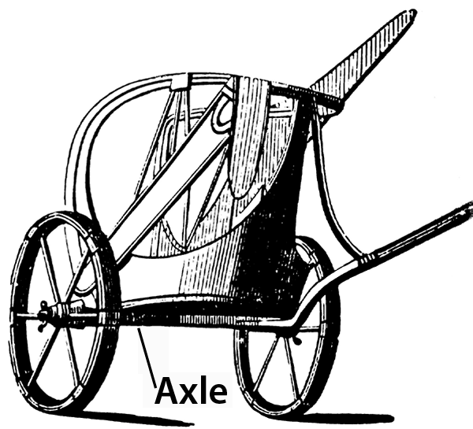

# Human-made Things in the Bible

## License Information

Human-made Things in the Bible © United Bible Societies, 2025. Adapted from: <cite>The Works of Their Hands: Man-made Things in the Bible</cite>, by Ray Pritz © 2009 United Bible Societies. This work is licensed under Creative Commons Attribution-ShareAlike 4.0 International (<a href="https://creativecommons.org/licenses/by-sa/4.0/">https://creativecommons.org/licenses/by-sa/4.0/</a>).

--------------------------------

## Wheel (id: REALIA:8.3)

8\.3 Wheel
==========

References:
-----------

Hebrew אוֹפַן (’ofan)

[EXO 14:25](https://ref.ly/Exod14:25), [1KI 7:30](https://ref.ly/1Kgs7:30), [1KI 7:32](https://ref.ly/1Kgs7:32), [1KI 7:32](https://ref.ly/1Kgs7:32), [1KI 7:32](https://ref.ly/1Kgs7:32), [1KI 7:33](https://ref.ly/1Kgs7:33), [1KI 7:33](https://ref.ly/1Kgs7:33), [PRO 20:26](https://ref.ly/Prov20:26), [ISA 28:27](https://ref.ly/Isa28:27), [EZK 1:15](https://ref.ly/Ezek1:15), [EZK 1:16](https://ref.ly/Ezek1:16), [EZK 1:16](https://ref.ly/Ezek1:16), [EZK 1:16](https://ref.ly/Ezek1:16), [EZK 1:19](https://ref.ly/Ezek1:19), [EZK 1:19](https://ref.ly/Ezek1:19), [EZK 1:20](https://ref.ly/Ezek1:20), [EZK 1:20](https://ref.ly/Ezek1:20), [EZK 1:21](https://ref.ly/Ezek1:21), [EZK 1:21](https://ref.ly/Ezek1:21), [EZK 3:13](https://ref.ly/Ezek3:13), [EZK 10:6](https://ref.ly/Ezek10:6), [EZK 10:9](https://ref.ly/Ezek10:9), [EZK 10:9](https://ref.ly/Ezek10:9), [EZK 10:9](https://ref.ly/Ezek10:9), [EZK 10:9](https://ref.ly/Ezek10:9), [EZK 10:10](https://ref.ly/Ezek10:10), [EZK 10:10](https://ref.ly/Ezek10:10), [EZK 10:12](https://ref.ly/Ezek10:12), [EZK 10:12](https://ref.ly/Ezek10:12), [EZK 10:13](https://ref.ly/Ezek10:13), [EZK 10:16](https://ref.ly/Ezek10:16), [EZK 10:16](https://ref.ly/Ezek10:16), [EZK 10:19](https://ref.ly/Ezek10:19), [EZK 11:22](https://ref.ly/Ezek11:22), [NAM 3:2](https://ref.ly/Nah3:2)

Hebrew גַּלְגַּל (galgal)

[ISA 5:28](https://ref.ly/Isa5:28), [JER 47:3](https://ref.ly/Jer47:3), [EZK 10:2](https://ref.ly/Ezek10:2), [EZK 10:6](https://ref.ly/Ezek10:6), [EZK 10:13](https://ref.ly/Ezek10:13), [DAN 7:9](https://ref.ly/Dan7:9)

Hebrew גִּלְגָּל (gilgal)

[ISA 28:28](https://ref.ly/Isa28:28)

Greek τροχός (trochos)

[SIR 33:5](https://ref.ly/Sir33:5)

References:
-----------

### **Axle**:

Hebrew יָד (yad)

[1KI 7:32](https://ref.ly/1Kgs7:32), [1KI 7:33](https://ref.ly/1Kgs7:33)

Hebrew סֶרֶן (seren)

[1KI 7:30](https://ref.ly/1Kgs7:30)

Greek ἄξων (axōn)

[SIR 33:5](https://ref.ly/Sir33:5)

References:
-----------

### **Wheel hub**:

Hebrew חִשּׁוּר (chishur)

[1KI 7:33](https://ref.ly/1Kgs7:33)

References:
-----------

### **Wheel spoke**:

Hebrew חִשּׁוּק (chishuq)

[1KI 7:33](https://ref.ly/1Kgs7:33)

References:
-----------

### **Wheel rim**:

Hebrew גַּב (gav)

[1KI 7:33](https://ref.ly/1Kgs7:33), [EZK 1:18](https://ref.ly/Ezek1:18), [EZK 1:18](https://ref.ly/Ezek1:18)

Description:
------------

*Hub, spoke, and rim of a wheel (Gary Todd, Public domain, Flickr)*

The wheel was a ring or round disk with a rod (the axle) running through its center or hub. Wheels were made of wood and sometimes partly of metal. They could be a solid piece of wood (see the illustrations at [8\.2 Cart, wagon\<REALIA:8\.2\>](#)) or a central hub connected by several spokes to an outer rim. The axle normally extended from one side of the vehicle to the other side, with a wheel attached to each end of the axle.

---

Translation:
------------

*The axle holds the wheels in place so that they can turn freely (Cyclopaedia of Biblical, Theological and Ecclesiastical Literature, Harper 1888, Public domain)*

The “wheels” mentioned in [EZK 1:15](https://ref.ly/Ezek1:15); [EZK 1:16](https://ref.ly/Ezek1:16); [EZK 1:17](https://ref.ly/Ezek1:17); [EZK 1:18](https://ref.ly/Ezek1:18); [EZK 1:19](https://ref.ly/Ezek1:19); [EZK 1:20](https://ref.ly/Ezek1:20); [EZK 1:21](https://ref.ly/Ezek1:21) and [EZK 10:6](https://ref.ly/Ezek10:6); [EZK 10:7](https://ref.ly/Ezek10:7); [EZK 10:8](https://ref.ly/Ezek10:8); [EZK 10:9](https://ref.ly/Ezek10:9); [EZK 10:10](https://ref.ly/Ezek10:10); [EZK 10:11](https://ref.ly/Ezek10:11); [EZK 10:12](https://ref.ly/Ezek10:12); [EZK 10:13](https://ref.ly/Ezek10:13); [EZK 10:14](https://ref.ly/Ezek10:14); [EZK 10:15](https://ref.ly/Ezek10:15); [EZK 10:16](https://ref.ly/Ezek10:16); [EZK 10:17](https://ref.ly/Ezek10:17); [EZK 10:18](https://ref.ly/Ezek10:18); [EZK 10:19](https://ref.ly/Ezek10:19) may not refer to devices on which a vehicle rolls. These “wheels” may be understood as some sort of spinning disks, for which a language may have a separate word. Jewish tradition interprets this image as a vehicle on which the LORD is seated, and these are the wheels of the vehicle.

While most languages will have a word for “axle,” NAB (New American Bible (1970)) renders [SIR 33:5](https://ref.ly/Sir33:5) accurately without reference to this piece on which the wheel turns: “Like the wheel of a cart is the mind of a fool; his thoughts revolve in circles.”

* **Associated Passages:** Exodus 14:25; 1 Kings 7:30; 1 Kings 7:32; 1 Kings 7:33; Proverbs 20:26; Isaiah 28:27; Ezekiel 1:15; Ezekiel 1:16; Ezekiel 1:19; Ezekiel 1:20; Ezekiel 1:21; Ezekiel 3:13; Ezekiel 10:6; Ezekiel 10:9; Ezekiel 10:10; Ezekiel 10:12; Ezekiel 10:13; Ezekiel 10:16; Ezekiel 10:19; Ezekiel 11:22; Nahum 3:2; Isaiah 5:28; Jeremiah 47:3; Ezekiel 10:2; Daniel 7:9; Isaiah 28:28; Sirach 33:5; Ezekiel 1:18; Ezekiel 1:17; Ezekiel 10:7; Ezekiel 10:8; Ezekiel 10:11; Ezekiel 10:14; Ezekiel 10:15; Ezekiel 10:17; Ezekiel 10:18

* **Associated ACAI Concepts:** Wagon (ID: `realia:Wagon`); Wheel (ID: `realia:Wheel`)
