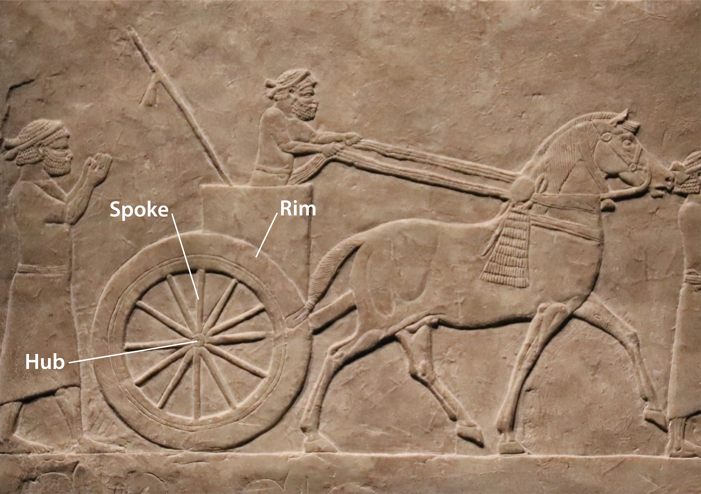
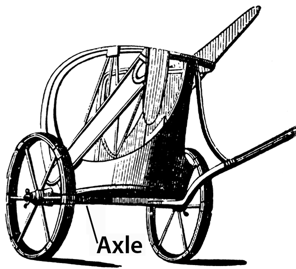

# Human-made Things in the Bible

## License Information

Human-made Things in the Bible © United Bible Societies, 2025. Adapted from: <cite>The Works of Their Hands: Man-made Things in the Bible</cite>, by Ray Pritz © 2009 United Bible Societies. This work is licensed under Creative Commons Attribution-ShareAlike 4.0 International (<a href="https://creativecommons.org/licenses/by-sa/4.0/">https://creativecommons.org/licenses/by-sa/4.0/</a>).

--------------------------------

## Wheel (id: REALIA:8.3)

8\.3 Wheel
==========

References:
-----------

Hebrew אוֹפַן (’ofan)

EXO 14:25, 1KI 7:30, 1KI 7:32, 1KI 7:32, 1KI 7:32, 1KI 7:33, 1KI 7:33, PRO 20:26, ISA 28:27, EZK 1:15, EZK 1:16, EZK 1:16, EZK 1:16, EZK 1:19, EZK 1:19, EZK 1:20, EZK 1:20, EZK 1:21, EZK 1:21, EZK 3:13, EZK 10:6, EZK 10:9, EZK 10:9, EZK 10:9, EZK 10:9, EZK 10:10, EZK 10:10, EZK 10:12, EZK 10:12, EZK 10:13, EZK 10:16, EZK 10:16, EZK 10:19, EZK 11:22, NAM 3:2

Hebrew גַּלְגַּל (galgal)

ISA 5:28, JER 47:3, EZK 10:2, EZK 10:6, EZK 10:13, DAN 7:9

Hebrew גִּלְגָּל (gilgal)

ISA 28:28

Greek τροχός (trochos)

SIR 33:5

References:
-----------

### **Axle**:

Hebrew יָד (yad)

1KI 7:32, 1KI 7:33

Hebrew סֶרֶן (seren)

1KI 7:30

Greek ἄξων (axōn)

SIR 33:5

References:
-----------

### **Wheel hub**:

Hebrew חִשּׁוּר (chishur)

1KI 7:33

References:
-----------

### **Wheel spoke**:

Hebrew חִשּׁוּק (chishuq)

1KI 7:33

References:
-----------

### **Wheel rim**:

Hebrew גַּב (gav)

1KI 7:33, EZK 1:18, EZK 1:18

Description:
------------

*Hub, spoke, and rim of a wheel (Gary Todd, Public domain, Flickr)*

The wheel was a ring or round disk with a rod (the axle) running through its center or hub. Wheels were made of wood and sometimes partly of metal. They could be a solid piece of wood (see the illustrations at [8\.2 Cart, wagon\<REALIA:8\.2\>](#)) or a central hub connected by several spokes to an outer rim. The axle normally extended from one side of the vehicle to the other side, with a wheel attached to each end of the axle.

---

Translation:
------------

*The axle holds the wheels in place so that they can turn freely (Cyclopaedia of Biblical, Theological and Ecclesiastical Literature, Harper 1888, Public domain)*

The “wheels” mentioned in EZK 1:15; EZK 1:16; EZK 1:17; EZK 1:18; EZK 1:19; EZK 1:20; EZK 1:21 and EZK 10:6; EZK 10:7; EZK 10:8; EZK 10:9; EZK 10:10; EZK 10:11; EZK 10:12; EZK 10:13; EZK 10:14; EZK 10:15; EZK 10:16; EZK 10:17; EZK 10:18; EZK 10:19 may not refer to devices on which a vehicle rolls. These “wheels” may be understood as some sort of spinning disks, for which a language may have a separate word. Jewish tradition interprets this image as a vehicle on which the LORD is seated, and these are the wheels of the vehicle.

While most languages will have a word for “axle,” NAB (New American Bible (1970)) renders SIR 33:5 accurately without reference to this piece on which the wheel turns: “Like the wheel of a cart is the mind of a fool; his thoughts revolve in circles.”

* **Associated Passages:** Exodus 14:25; 1 Kings 7:30; 1 Kings 7:32; 1 Kings 7:33; Proverbs 20:26; Isaiah 28:27; Ezekiel 1:15; Ezekiel 1:16; Ezekiel 1:19; Ezekiel 1:20; Ezekiel 1:21; Ezekiel 3:13; Ezekiel 10:6; Ezekiel 10:9; Ezekiel 10:10; Ezekiel 10:12; Ezekiel 10:13; Ezekiel 10:16; Ezekiel 10:19; Ezekiel 11:22; Nahum 3:2; Isaiah 5:28; Jeremiah 47:3; Ezekiel 10:2; Daniel 7:9; Isaiah 28:28; Sirach 33:5; Ezekiel 1:18; Ezekiel 1:17; Ezekiel 10:7; Ezekiel 10:8; Ezekiel 10:11; Ezekiel 10:14; Ezekiel 10:15; Ezekiel 10:17; Ezekiel 10:18

* **Associated ACAI Concepts:** Wagon (ID: `realia:Wagon`); Wheel (ID: `realia:Wheel`)
