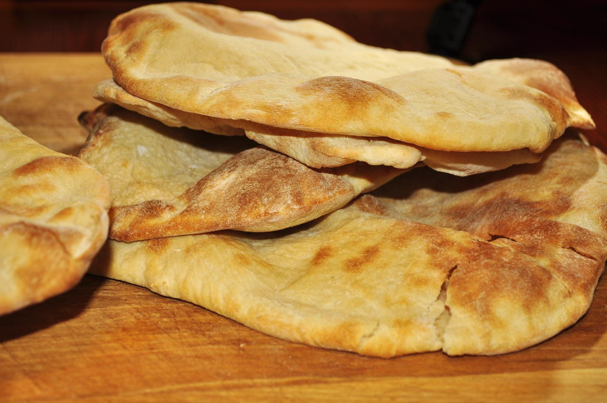
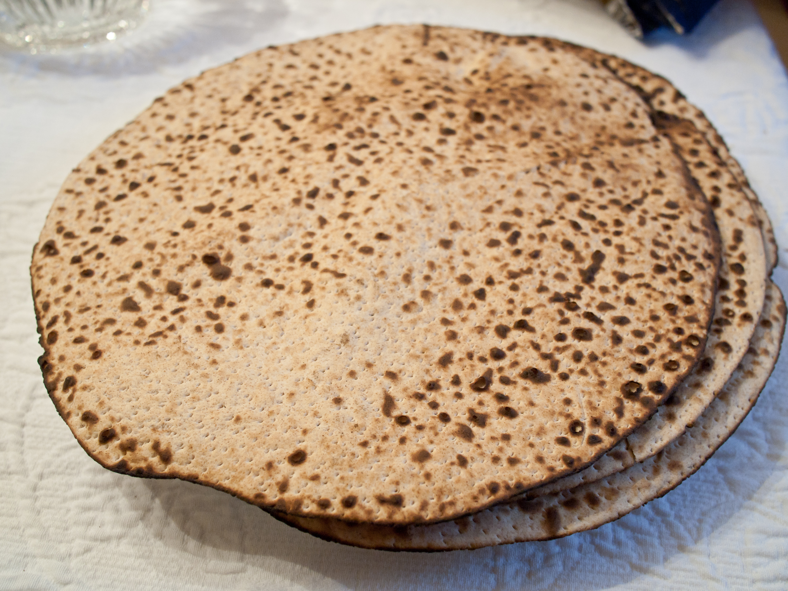

# Human-made Things in the Bible

## License Information

Human-made Things in the Bible © United Bible Societies, 2025. Adapted from: <cite>The Works of Their Hands: Man-made Things in the Bible</cite>, by Ray Pritz © 2009 United Bible Societies. This work is licensed under Creative Commons Attribution-ShareAlike 4.0 International (<a href="https://creativecommons.org/licenses/by-sa/4.0/">https://creativecommons.org/licenses/by-sa/4.0/</a>).

--------------------------------

## Bread (id: REALIA:9.4)

9\.4 Bread
==========

References:
-----------

Hebrew חֲבִתִּים (chavitim)

1CH 9:31

Hebrew חַלָּה (chalah)

EXO 29:2, EXO 29:23, LEV 2:4, LEV 7:12, LEV 7:12, LEV 7:13, LEV 8:26, LEV 8:26, LEV 24:5, LEV 24:5, NUM 6:15, NUM 6:19, NUM 15:20, 2SA 6:19

Hebrew כַּוָּן (kawan)

JER 7:18, JER 44:19

Hebrew לְבִיבָה (lvivah)

2SA 13:6, 2SA 13:8, 2SA 13:10

Hebrew לֶחֶם (lechem)

GEN 3:19, GEN 14:18, GEN 18:5, GEN 21:14, GEN 25:34, GEN 27:17, GEN 28:20, GEN 31:54, GEN 31:54, GEN 37:25, GEN 39:6, GEN 41:54, GEN 41:55, GEN 43:25, GEN 43:31, GEN 43:32, GEN 45:23, GEN 47:12, GEN 47:13, GEN 47:15, GEN 47:17, GEN 47:17, GEN 47:19, GEN 49:20, EXO 2:20, EXO 16:3, EXO 16:4, EXO 16:8, EXO 16:12, EXO 16:15, EXO 16:22, EXO 16:29, EXO 16:32, EXO 18:12, EXO 23:25, EXO 25:30, EXO 29:2, EXO 29:23, EXO 29:23, EXO 29:32, EXO 29:34, EXO 34:28, EXO 35:13, EXO 39:36, EXO 40:23, LEV 3:11, LEV 3:16, LEV 7:13, LEV 8:26, LEV 8:31, LEV 8:32, LEV 21:6, LEV 21:8, LEV 21:17, LEV 21:21, LEV 21:22, LEV 22:7, LEV 22:11, LEV 22:13, LEV 22:25, LEV 23:14, LEV 23:17, LEV 23:18, LEV 23:20, LEV 24:7, LEV 26:5, LEV 26:26, LEV 26:26, LEV 26:26, NUM 4:7, NUM 14:9, NUM 15:19, NUM 21:5, NUM 21:5, NUM 28:2, NUM 28:24, DEU 8:3, DEU 8:9, DEU 9:9, DEU 9:18, DEU 10:18, DEU 16:3, DEU 23:5, DEU 29:5, JOS 9:5, JOS 9:12, JDG 5:8, JDG 7:13, JDG 8:5, JDG 8:6, JDG 8:15, JDG 13:16, JDG 19:5, JDG 19:19, RUT 1:6, RUT 2:14, 1SA 2:5, 1SA 2:36, 1SA 2:36, 1SA 9:7, 1SA 10:3, 1SA 10:4, 1SA 14:24, 1SA 14:24, 1SA 14:28, 1SA 16:20, 1SA 17:17, 1SA 20:24, 1SA 20:27, 1SA 20:34, 1SA 21:4, 1SA 21:5, 1SA 21:5, 1SA 21:7, 1SA 21:7, 1SA 21:7, 1SA 22:13, 1SA 25:11, 1SA 25:18, 1SA 28:20, 1SA 28:22, 1SA 30:11, 1SA 30:12, 2SA 3:29, 2SA 3:35, 2SA 3:35, 2SA 6:19, 2SA 9:7, 2SA 9:10, 2SA 9:10, 2SA 12:17, 2SA 12:20, 2SA 12:21, 2SA 13:5, 2SA 16:1, 2SA 16:2, 2SA 16:2, 1KI 5:2, 1KI 5:23, 1KI 7:48, 1KI 11:18, 1KI 13:8, 1KI 13:9, 1KI 13:15, 1KI 13:16, 1KI 13:17, 1KI 13:18, 1KI 13:19, 1KI 13:22, 1KI 13:22, 1KI 13:23, 1KI 14:3, 1KI 17:6, 1KI 17:6, 1KI 17:11, 1KI 18:4, 1KI 18:13, 1KI 21:4, 1KI 21:5, 1KI 21:7, 1KI 22:27, 2KI 4:8, 2KI 4:8, 2KI 4:42, 2KI 4:42, 2KI 6:22, 2KI 18:32, 2KI 25:3, 2KI 25:29, 1CH 9:32, 1CH 12:41, 1CH 16:3, 1CH 23:29, 2CH 4:19, 2CH 13:11, 2CH 18:26, EZR 10:6, NEH 5:14, NEH 5:15, NEH 5:18, NEH 9:15, NEH 10:34, NEH 13:2, JOB 3:24, JOB 6:7, JOB 15:23, JOB 20:14, JOB 22:7, JOB 24:5, JOB 27:14, JOB 28:5, JOB 33:20, JOB 42:11, PSA 14:4, PSA 37:25, PSA 41:10, PSA 42:4, PSA 53:5, PSA 78:20, PSA 78:25, PSA 80:6, PSA 102:5, PSA 102:10, PSA 104:14, PSA 104:15, PSA 105:16, PSA 105:40, PSA 127:2, PSA 132:15, PSA 136:25, PSA 146:7, PSA 147:9, PRO 4:17, PRO 6:8, PRO 6:26, PRO 9:5, PRO 9:17, PRO 12:9, PRO 12:11, PRO 20:13, PRO 20:17, PRO 22:9, PRO 23:3, PRO 23:6, PRO 25:21, PRO 27:27, PRO 27:27, PRO 28:3, PRO 28:19, PRO 28:21, PRO 30:8, PRO 30:22, PRO 30:25, PRO 31:14, PRO 31:27, ECC 9:7, ECC 9:11, ECC 10:19, ECC 11:1, ISA 3:1, ISA 3:7, ISA 4:1, ISA 21:14, ISA 28:28, ISA 30:20, ISA 30:23, ISA 33:16, ISA 36:17, ISA 44:15, ISA 44:19, ISA 51:14, ISA 55:2, ISA 55:10, ISA 58:7, ISA 65:25, JER 5:17, JER 11:19, JER 37:21, JER 37:21, JER 38:9, JER 41:1, JER 42:14, JER 44:17, JER 52:6, JER 52:33, LAM 1:11, LAM 4:4, LAM 5:6, LAM 5:9, EZK 4:9, EZK 4:13, EZK 4:15, EZK 4:16, EZK 4:16, EZK 4:17, EZK 5:16, EZK 12:18, EZK 12:19, EZK 13:19, EZK 14:13, EZK 16:19, EZK 16:49, EZK 18:7, EZK 18:16, EZK 24:17, EZK 24:22, EZK 44:3, EZK 44:7, EZK 48:18, DAN 10:3, HOS 2:7, HOS 9:4, HOS 9:4, AMO 4:6, AMO 7:12, AMO 8:11, OBA 1:7, HAG 2:12, MAL 1:7

Hebrew מַעוֹג, עֻגָה (ma‘og, ‘ugah)

GEN 18:6, EXO 12:39, NUM 11:8, 1KI 17:12, 1KI 17:13, 1KI 19:6, EZK 4:12, HOS 7:8

Hebrew נִקּוּדִים (niqudim)

1KI 14:3

Hebrew פַּת (path)

GEN 18:5, LEV 2:6, LEV 6:14, JDG 19:5, RUT 2:14, 1SA 2:36, 1SA 28:22, 2SA 12:3, 1KI 17:11, JOB 31:17, PSA 147:17, PRO 17:1, PRO 23:8, PRO 28:21

Hebrew צַפִּיחִת (tsapichith)

EXO 16:31

Hebrew רָקִיק (raqiq)

EXO 29:2, EXO 29:23, LEV 2:4, LEV 7:12, LEV 8:26, NUM 6:15, NUM 6:19, 1CH 23:29

Hebrew תֻּפִינִים (tufin)

LEV 6:14

Greek ἄρτος (artos)

MAT 4:3, MAT 4:4, MAT 6:11, MAT 7:9, MAT 14:17, MAT 14:19, MAT 14:19, MAT 15:33, MAT 15:34, MAT 15:36, MAT 16:5, MAT 16:7, MAT 16:8, MAT 16:9, MAT 16:10, MAT 16:11, MAT 16:12, MAT 26:26, MRK 6:37, MRK 6:38, MRK 6:41, MRK 6:41, MRK 6:44, MRK 6:52, MRK 8:4, MRK 8:5, MRK 8:6, MRK 8:14, MRK 8:14, MRK 8:16, MRK 8:17, MRK 8:19, MRK 14:22, LUK 4:3, LUK 7:33, LUK 9:13, LUK 9:16, LUK 11:5, LUK 15:17, LUK 22:19, LUK 24:30, LUK 24:35, JHN 6:5, JHN 6:7, JHN 6:9, JHN 6:11, JHN 6:13, JHN 6:23, JHN 6:26, JHN 21:9, JHN 21:13, ACT 2:42, ACT 2:46, ACT 20:7, ACT 20:11, ACT 27:35, 1CO 10:16, 1CO 10:17, 1CO 10:17, 1CO 11:23, 1CO 11:26, 1CO 11:27, 1CO 11:28, 2CO 9:10, 2TH 3:8, TOB 1:17, JDT 10:5, WIS 16:20, SIR 10:27, SIR 12:5, SIR 14:10, SIR 15:3, SIR 33:25, BEL 1:33, 1ES 9:2

Latin panis

2ES 1:19, 2ES 5:18, 2ES 14:43, 2ES 15:19, 2ES 15:58

Description:
------------

Bread was dough made from the flour of various grains, mixed with oil or water, and baked for eating.

---

Translation:
------------

“Bread,” as the basic, staple food of ancient times, often appears in Scripture with the more general meaning of “food.” So the expression “to eat bread” means “to eat a meal” (see GEN 37:25; GEN 43:32; EXO 2:20;). Since the bread was not usually cut with a knife but rather broken or torn with the hands, the expression “to break bread” means “to eat” or “to eat a meal” (see JER 16:7; ACT 2:42; ACT 2:46; ACT 20:7).

In many passages the word that indicates one unit of bread is simply “bread,” as, for example, in MAT 14:17, where the disciples say “All we have here are five loaves \[literally ‘five breads’]” (GNT (Good News Translation (1992))). In many languages it will be more natural to substitute the word “loaf” for “bread.”

The Hebrew word *chalah* refers to bread of higher quality since it was made with more expensive flour, called *soleth* in Hebrew (see [9\.4\.1 Plain flour\<REALIA:9\.4\.1\>](#) and [9\.4\.2 Fine flour\<REALIA:9\.4\.2\>](#)). In some languages it will be possible to make a distinction between this bread and the bread of lower quality.

The Hebrew word *kawan* in JER 7:18 and JER 44:19 refers to bread that was intended not as food but as an offering to a pagan goddess. It may have been shaped like the goddess or marked with her image; translations reflect both possibilities. Similarly, in 2SA 13:6; 2SA 13:7; 2SA 13:8; 2SA 13:9; 2SA 13:10 the Hebrew word *lvivah* may indicate a special shape (heart\-shaped?). In 2SA 13:6CEV (Contemporary English Version) renders it “special bread” and adds this footnote: “Or ‘heart\-shaped bread’ or ‘dumplings.’ ” Translators are advised to follow this example. The point of the story here is that the “special bread” or “special cake” was something better than average, which could help to revive a sick person or at least cheer him up.

The Hebrew word *raqiq* refers to very thin bread, perhaps even crisp. It appears most often connected to the Hebrew word *matsah*, which means “unleavened bread” (see [9\.4\.4 Unleavened bread\<REALIA:9\.4\.4\>](#)). In these passages (EXO 29:2; LEV 2:4; LEV 7:12; NUM 6:15; NUM 6:19; 1CH 23:29), it will be best to translate it as a unit together with the word for “unleavened bread” (see the suggestions at [9\.4\.4 Unleavened bread\<REALIA:9\.4\.4\>](#)). In EXO 16:31 the Hebrew word *tsapichith* probably has about the same meaning.

EXO 29:2; LEV 7:12; LEV 8:26 (following comments adapted from *A Handbook on Leviticus* at LEV 7:12, page 95\): These verses mention three types of unleavened bread (RSV (Revised Standard Version (1952)) “unleavened cakes mixed with oil, unleavened wafers spread with oil, and cakes of fine flour well mixed with oil” in LEV 7:12) to accompany animal sacrifices: (1\) The first type was a perforated loaf made with flour mixed with oil but without yeast. (2\) The second type was a kind of thin, round bread also made without yeast, but on which olive oil was spread. It was similar to biscuits or possibly pancakes. It is mistakenly called “wafers” in RSV (Revised Standard Version (1952)) and KJV (King James Version (1611)). Neither should it be translated “cakes,” which will be misleading in most languages. General terms should be used for these first two types of bread, as long as both terms indicate that they are made without yeast. (3\) There is some question about exactly what is meant by the third kind of bread. It was apparently to be similar to the first type, perhaps pierced or perforated, but there is no mention of its being made without yeast and no indication that it was actually baked. This has led some commentators to assume that it was merely a kind of dough made of choice flour and oil. However, GNT (Good News Translation (1992)) seems to understand the text to imply both that it was unleavened and that it was baked. Since David shared such loaves with people (2SA 6:19), it seems best to assume they were baked. And although “unleavened” is not explicitly mentioned for the third type, the contrast with LEV 7:13 probably indicates that they were made without yeast. Translators will need to find three different words or descriptive phrases for these three types of unleavened bread.

LEV 6:14: The Hebrew word *tufin*, which is translated “baked” in RSV (Revised Standard Version (1952)) and some other English versions, is difficult and uncertain. A number of other translations and commentaries have understood the word to mean “broken” (NIV (New International Version (1984)), NAB (New American Bible (1970))) or “crumbled” (GNT (Good News Translation (1992)), REB (Revised English Bible (1989))). Still others, following the Septuagint, see it as referring to a kind of pastry (NJB (New Jerusalem Bible (1985)), TOB (Traduction Oecuménique de la Bible (French, 1975))). Translators should probably look for an equivalent to the idea of breaking or crumbling into small pieces. But it may be advisable to add a footnote explaining the uncertainty concerning this term and the different possible translations of it.

The Greek word *artos* refers to a relatively small and generally round loaf of bread. It was considerably smaller than typical present\-day loaves of bread and thus more like “rolls” or “buns.”

* **Associated Passages:** 1 Chronicles 9:31; Exodus 29:2; Exodus 29:23; Leviticus 2:4; Leviticus 7:12; Leviticus 7:13; Leviticus 8:26; Leviticus 24:5; Numbers 6:15; Numbers 6:19; Numbers 15:20; 2 Samuel 6:19; Jeremiah 7:18; Jeremiah 44:19; 2 Samuel 13:6; 2 Samuel 13:8; 2 Samuel 13:10; Genesis 3:19; Genesis 14:18; Genesis 18:5; Genesis 21:14; Genesis 25:34; Genesis 27:17; Genesis 28:20; Genesis 31:54; Genesis 37:25; Genesis 39:6; Genesis 41:54; Genesis 41:55; Genesis 43:25; Genesis 43:31; Genesis 43:32; Genesis 45:23; Genesis 47:12; Genesis 47:13; Genesis 47:15; Genesis 47:17; Genesis 47:19; Genesis 49:20; Exodus 2:20; Exodus 16:3; Exodus 16:4; Exodus 16:8; Exodus 16:12; Exodus 16:15; Exodus 16:22; Exodus 16:29; Exodus 16:32; Exodus 18:12; Exodus 23:25; Exodus 25:30; Exodus 29:32; Exodus 29:34; Exodus 34:28; Exodus 35:13; Exodus 39:36; Exodus 40:23; Leviticus 3:11; Leviticus 3:16; Leviticus 8:31; Leviticus 8:32; Leviticus 21:6; Leviticus 21:8; Leviticus 21:17; Leviticus 21:21; Leviticus 21:22; Leviticus 22:7; Leviticus 22:11; Leviticus 22:13; Leviticus 22:25; Leviticus 23:14; Leviticus 23:17; Leviticus 23:18; Leviticus 23:20; Leviticus 24:7; Leviticus 26:5; Leviticus 26:26; Numbers 4:7; Numbers 14:9; Numbers 15:19; Numbers 21:5; Numbers 28:2; Numbers 28:24; Deuteronomy 8:3; Deuteronomy 8:9; Deuteronomy 9:9; Deuteronomy 9:18; Deuteronomy 10:18; Deuteronomy 16:3; Deuteronomy 23:5; Deuteronomy 29:5; Joshua 9:5; Joshua 9:12; Judges 5:8; Judges 7:13; Judges 8:5; Judges 8:6; Judges 8:15; Judges 13:16; Judges 19:5; Judges 19:19; Ruth 1:6; Ruth 2:14; 1 Samuel 2:5; 1 Samuel 2:36; 1 Samuel 9:7; 1 Samuel 10:3; 1 Samuel 10:4; 1 Samuel 14:24; 1 Samuel 14:28; 1 Samuel 16:20; 1 Samuel 17:17; 1 Samuel 20:24; 1 Samuel 20:27; 1 Samuel 20:34; 1 Samuel 21:4; 1 Samuel 21:5; 1 Samuel 21:7; 1 Samuel 22:13; 1 Samuel 25:11; 1 Samuel 25:18; 1 Samuel 28:20; 1 Samuel 28:22; 1 Samuel 30:11; 1 Samuel 30:12; 2 Samuel 3:29; 2 Samuel 3:35; 2 Samuel 9:7; 2 Samuel 9:10; 2 Samuel 12:17; 2 Samuel 12:20; 2 Samuel 12:21; 2 Samuel 13:5; 2 Samuel 16:1; 2 Samuel 16:2; 1 Kings 5:2; 1 Kings 5:23; 1 Kings 7:48; 1 Kings 11:18; 1 Kings 13:8; 1 Kings 13:9; 1 Kings 13:15; 1 Kings 13:16; 1 Kings 13:17; 1 Kings 13:18; 1 Kings 13:19; 1 Kings 13:22; 1 Kings 13:23; 1 Kings 14:3; 1 Kings 17:6; 1 Kings 17:11; 1 Kings 18:4; 1 Kings 18:13; 1 Kings 21:4; 1 Kings 21:5; 1 Kings 21:7; 1 Kings 22:27; 2 Kings 4:8; 2 Kings 4:42; 2 Kings 6:22; 2 Kings 18:32; 2 Kings 25:3; 2 Kings 25:29; 1 Chronicles 9:32; 1 Chronicles 12:41; 1 Chronicles 16:3; 1 Chronicles 23:29; 2 Chronicles 4:19; 2 Chronicles 13:11; 2 Chronicles 18:26; Ezra 10:6; Nehemiah 5:14; Nehemiah 5:15; Nehemiah 5:18; Nehemiah 9:15; Nehemiah 10:34; Nehemiah 13:2; Job 3:24; Job 6:7; Job 15:23; Job 20:14; Job 22:7; Job 24:5; Job 27:14; Job 28:5; Job 33:20; Job 42:11; Psalms 14:4; Psalms 37:25; Psalms 41:10; Psalms 42:4; Psalms 53:5; Psalms 78:20; Psalms 78:25; Psalms 80:6; Psalms 102:5; Psalms 102:10; Psalms 104:14; Psalms 104:15; Psalms 105:16; Psalms 105:40; Psalms 127:2; Psalms 132:15; Psalms 136:25; Psalms 146:7; Psalms 147:9; Proverbs 4:17; Proverbs 6:8; Proverbs 6:26; Proverbs 9:5; Proverbs 9:17; Proverbs 12:9; Proverbs 12:11; Proverbs 20:13; Proverbs 20:17; Proverbs 22:9; Proverbs 23:3; Proverbs 23:6; Proverbs 25:21; Proverbs 27:27; Proverbs 28:3; Proverbs 28:19; Proverbs 28:21; Proverbs 30:8; Proverbs 30:22; Proverbs 30:25; Proverbs 31:14; Proverbs 31:27; Ecclesiastes 9:7; Ecclesiastes 9:11; Ecclesiastes 10:19; Ecclesiastes 11:1; Isaiah 3:1; Isaiah 3:7; Isaiah 4:1; Isaiah 21:14; Isaiah 28:28; Isaiah 30:20; Isaiah 30:23; Isaiah 33:16; Isaiah 36:17; Isaiah 44:15; Isaiah 44:19; Isaiah 51:14; Isaiah 55:2; Isaiah 55:10; Isaiah 58:7; Isaiah 65:25; Jeremiah 5:17; Jeremiah 11:19; Jeremiah 37:21; Jeremiah 38:9; Jeremiah 41:1; Jeremiah 42:14; Jeremiah 44:17; Jeremiah 52:6; Jeremiah 52:33; Lamentations 1:11; Lamentations 4:4; Lamentations 5:6; Lamentations 5:9; Ezekiel 4:9; Ezekiel 4:13; Ezekiel 4:15; Ezekiel 4:16; Ezekiel 4:17; Ezekiel 5:16; Ezekiel 12:18; Ezekiel 12:19; Ezekiel 13:19; Ezekiel 14:13; Ezekiel 16:19; Ezekiel 16:49; Ezekiel 18:7; Ezekiel 18:16; Ezekiel 24:17; Ezekiel 24:22; Ezekiel 44:3; Ezekiel 44:7; Ezekiel 48:18; Daniel 10:3; Hosea 2:7; Hosea 9:4; Amos 4:6; Amos 7:12; Amos 8:11; Obadiah 1:7; Haggai 2:12; Malachi 1:7; Genesis 18:6; Exodus 12:39; Numbers 11:8; 1 Kings 17:12; 1 Kings 17:13; 1 Kings 19:6; Ezekiel 4:12; Hosea 7:8; Leviticus 2:6; Leviticus 6:14; 2 Samuel 12:3; Job 31:17; Psalms 147:17; Proverbs 17:1; Proverbs 23:8; Exodus 16:31; Matthew 4:3; Matthew 4:4; Matthew 6:11; Matthew 7:9; Matthew 14:17; Matthew 14:19; Matthew 15:33; Matthew 15:34; Matthew 15:36; Matthew 16:5; Matthew 16:7; Matthew 16:8; Matthew 16:9; Matthew 16:10; Matthew 16:11; Matthew 16:12; Matthew 26:26; Mark 6:37; Mark 6:38; Mark 6:41; Mark 6:44; Mark 6:52; Mark 8:4; Mark 8:5; Mark 8:6; Mark 8:14; Mark 8:16; Mark 8:17; Mark 8:19; Mark 14:22; Luke 4:3; Luke 7:33; Luke 9:13; Luke 9:16; Luke 11:5; Luke 15:17; Luke 22:19; Luke 24:30; Luke 24:35; John 6:5; John 6:7; John 6:9; John 6:11; John 6:13; John 6:23; John 6:26; John 21:9; John 21:13; Acts 2:42; Acts 2:46; Acts 20:7; Acts 20:11; Acts 27:35; 1 Corinthians 10:16; 1 Corinthians 10:17; 1 Corinthians 11:23; 1 Corinthians 11:26; 1 Corinthians 11:27; 1 Corinthians 11:28; 2 Corinthians 9:10; 2 Thessalonians 3:8; Tobit 1:17; Judith 10:5; Wisdom of Solomon 16:20; Sirach 10:27; Sirach 12:5; Sirach 14:10; Sirach 15:3; Sirach 33:25; Bel and the Dragon 1:33; 1 Esdras (Greek) 9:2; 2 Esdras (Latin) 1:19; 2 Esdras (Latin) 5:18; 2 Esdras (Latin) 14:43; 2 Esdras (Latin) 15:19; 2 Esdras (Latin) 15:58; Jeremiah 16:7; 2 Samuel 13:7; 2 Samuel 13:9

* **Associated ACAI Concepts:** Cake (ID: `realia:Cake`)

## Plain flour (id: REALIA:9.4.1)

9\.4\.1 Plain flour
===================

References:
-----------

Hebrew קֶמַח (qemach)

NUM 5:15, JDG 6:19, 1SA 1:24, 1SA 28:24, 2SA 17:28, 1KI 5:2, 1KI 17:12, 1KI 17:14, 1KI 17:16, 2KI 4:41, 1CH 12:41, ISA 47:2, HOS 8:7

Greek ἄλευρον (aleuron)

MAT 13:33, LUK 13:21

Description:
------------

Flour was the product of grinding kernels of grain. The grains most commonly used were wheat or barley. Flour was the main ingredient of bread, which was the staple food in ancient times (see [9\.4 Bread\<REALIA:9\.4\>](#)).

---

Translation:
------------

In Hebrew there are two words that refer to ground grain. The first word *soleth* refers to a kind of semolina or coarser wheat flour. It is a product that is less finely ground than the flour referred to by the second word *qemach*. However, the first type was considered a more sumptuous kind of flour, used primarily in ritual offerings. The second type, on the other hand, was just ordinary flour (made from barley or wheat) and was rarely used in offerings to God. In translation the primary focus should not be on the fineness of the grinding, but on the high quality of the one type of flour as opposed to the commonness of the other type. If the translator has trouble finding corresponding terminology, it is possible to use an ordinary word for the common flour or meal and the same word qualified by “best” or “finest” for the more luxurious product (compare NJPSV (New Jewish Publication Society Version) “choice flour”). In some languages “wheat flour” is rendered “ground wheat” or “powdered wheat.”

* **Associated Passages:** Numbers 5:15; Judges 6:19; 1 Samuel 1:24; 1 Samuel 28:24; 2 Samuel 17:28; 1 Kings 5:2; 1 Kings 17:12; 1 Kings 17:14; 1 Kings 17:16; 2 Kings 4:41; 1 Chronicles 12:41; Isaiah 47:2; Hosea 8:7; Matthew 13:33; Luke 13:21

## Fine flour (id: REALIA:9.4.2)

9\.4\.2 Fine flour
==================

References:
-----------

Hebrew סֹלֶת, קֶמַח (soleth, qemach soleth)

GEN 18:6, GEN 18:6, EXO 29:2, EXO 29:40, LEV 2:1, LEV 2:2, LEV 2:4, LEV 2:5, LEV 2:7, LEV 5:11, LEV 6:8, LEV 6:13, LEV 7:12, LEV 14:10, LEV 14:21, LEV 23:13, LEV 23:17, LEV 24:5, NUM 5:15, NUM 6:15, NUM 7:13, NUM 7:19, NUM 7:25, NUM 7:31, NUM 7:37, NUM 7:43, NUM 7:49, NUM 7:55, NUM 7:61, NUM 7:67, NUM 7:73, NUM 7:79, NUM 8:8, NUM 15:4, NUM 15:6, NUM 15:9, NUM 28:5, NUM 28:9, NUM 28:12, NUM 28:12, NUM 28:13, NUM 28:20, NUM 28:28, NUM 29:3, NUM 29:9, NUM 29:14, JDG 6:19, 1SA 1:24, 1SA 28:24, 2SA 17:28, 1KI 5:2, 1KI 5:2, 1KI 17:12, 1KI 17:14, 1KI 17:16, 2KI 4:41, 2KI 7:1, 2KI 7:16, 2KI 7:18, 1CH 9:29, 1CH 12:41, 1CH 23:29, ISA 47:2, EZK 16:13, EZK 16:19, EZK 46:14, HOS 8:7

Greek σεμίδαλις (semidalis)

REV 18:13, SIR 35:2, SIR 38:11, SIR 39:26, BEL 1:3, 2MA 1:8

Description:
------------

Fine flour was a fine grade of wheat flour.

---

Translation:
------------

See [9\.4\.1 Plain flour\<REALIA:9\.4\.1\>](#). In some languages “fine flour” is best rendered “expensive flour.”

* **Associated Passages:** Genesis 18:6; Exodus 29:2; Exodus 29:40; Leviticus 2:1; Leviticus 2:2; Leviticus 2:4; Leviticus 2:5; Leviticus 2:7; Leviticus 5:11; Leviticus 6:8; Leviticus 6:13; Leviticus 7:12; Leviticus 14:10; Leviticus 14:21; Leviticus 23:13; Leviticus 23:17; Leviticus 24:5; Numbers 5:15; Numbers 6:15; Numbers 7:13; Numbers 7:19; Numbers 7:25; Numbers 7:31; Numbers 7:37; Numbers 7:43; Numbers 7:49; Numbers 7:55; Numbers 7:61; Numbers 7:67; Numbers 7:73; Numbers 7:79; Numbers 8:8; Numbers 15:4; Numbers 15:6; Numbers 15:9; Numbers 28:5; Numbers 28:9; Numbers 28:12; Numbers 28:13; Numbers 28:20; Numbers 28:28; Numbers 29:3; Numbers 29:9; Numbers 29:14; Judges 6:19; 1 Samuel 1:24; 1 Samuel 28:24; 2 Samuel 17:28; 1 Kings 5:2; 1 Kings 17:12; 1 Kings 17:14; 1 Kings 17:16; 2 Kings 4:41; 2 Kings 7:1; 2 Kings 7:16; 2 Kings 7:18; 1 Chronicles 9:29; 1 Chronicles 12:41; 1 Chronicles 23:29; Isaiah 47:2; Ezekiel 16:13; Ezekiel 16:19; Ezekiel 46:14; Hosea 8:7; Revelation 18:13; Sirach 35:2; Sirach 38:11; Sirach 39:26; Bel and the Dragon 1:3; 2 Maccabees 1:8

## Loaf (id: REALIA:9.4.3)

9\.4\.3 Loaf
============

References:
-----------

Hebrew כִּכָּר (kikar)

EXO 29:23, JDG 8:5, 1SA 2:36, 1SA 10:3, 1CH 16:3, PRO 6:26, JER 37:21

Hebrew צְלִיל (tslil)

JDG 7:13

Description:
------------

*(Image generated by ChatGPT using OpenAI technology)*

The loaf was a unit of bread. The normal loaf was round and flat, about the size of a man’s hand with fingers spread. However, sizes and shapes could vary widely. It has been suggested that there were three kinds of loaves: a small loaf like a modern roll or biscuit; a big, round loaf; and a flat, thin bread that was used to scoop up food. Generally, bread made of wheat was eaten by richer people, while bread made of barley was the food of the poor (JDG 7:13; JHN 6:7).

---

Translation:
------------

*A stack of flat bread (pita) (© jeffreyw, CC BY 2\.0, via Wikimedia Commons)*

Most languages that have a word for bread will also have a word for “loaf,” that is, an individual unit of bread. In many places in Scripture, the word that indicates one unit of bread is simply “bread,” so it may be rendered “loaf” in these places (see the discussion under [9\.4 Bread\<REALIA:9\.4\>](#)).

JDG 7:13: The important characteristic of the barley loaf in this verse is that it rolls down the hill. Where a language distinguishes between types of loaves according to shape, a word for a round loaf would be appropriate here.

Consecrated bread, bread of the presence, showbread: See [4\.3\.5\.1 Consecrated bread, bread of the presence, showbread\<REALIA:4\.3\.5\.1\>](#).

* **Associated Passages:** Exodus 29:23; Judges 8:5; 1 Samuel 2:36; 1 Samuel 10:3; 1 Chronicles 16:3; Proverbs 6:26; Jeremiah 37:21; Judges 7:13; John 6:7

## Unleavened bread (id: REALIA:9.4.4)

9\.4\.4 Unleavened bread
========================

References:
-----------

Hebrew מַצָּה (matsah)

GEN 19:3, EXO 12:8, EXO 12:15, EXO 12:17, EXO 12:18, EXO 12:20, EXO 12:39, EXO 13:6, EXO 13:7, EXO 23:15, EXO 23:15, EXO 29:2, EXO 29:2, EXO 29:2, EXO 29:23, EXO 34:18, EXO 34:18, LEV 2:4, LEV 2:4, LEV 2:5, LEV 6:9, LEV 7:12, LEV 7:12, LEV 8:2, LEV 8:26, LEV 8:26, LEV 10:12, LEV 23:6, LEV 23:6, NUM 6:15, NUM 6:15, NUM 6:17, NUM 6:19, NUM 6:19, NUM 9:11, NUM 28:17, DEU 16:3, DEU 16:8, DEU 16:16, JOS 5:11, JDG 6:19, JDG 6:20, JDG 6:21, JDG 6:21, 1SA 28:24, 2KI 23:9, 1CH 23:29, 2CH 8:13, 2CH 30:13, 2CH 30:21, 2CH 35:17, EZR 6:22, PRO 13:10, PRO 17:19, ISA 58:4, EZK 45:21

Greek ἄζυμος (azumos)

MAT 26:17, MRK 14:1, MRK 14:12, LUK 22:1, LUK 22:7, ACT 12:3, ACT 20:6, 1CO 5:7, 1CO 5:8, 1ES 1:11, 1ES 1:17, 1ES 7:14

Description:
------------

*Unleavened bread (© Edsel Little, CC BY\-SA 2\.0, via Wikimedia Commons)*

Unleavened bread was a thin cracker\-like bread resulting from baking the dough quickly before fermentation could cause it to rise.

---

Usage:
------

When the people of Israel left Egypt in a hurry, they baked their bread quickly before it had time to rise. Such bread became a symbol of their redemption from Egypt and was included as a special feature of the Feast of Passover, which celebrated that redemption. It was also included in some of the sacrificial offerings.

---

Translation:
------------

The phrase “unleavened bread” may be rendered “bread made without yeast” or “bread that does not rise.” Some languages will have to say “bread lacking that which causes it to rise.”

Except for 1CO 5:7; 1CO 5:8, in which the Greek word *azumos* occurs in a highly figurative passage referring to pure and true life, this term is used exclusively in the New Testament in reference to the Feast of Unleavened Bread.

* **Associated Passages:** Genesis 19:3; Exodus 12:8; Exodus 12:15; Exodus 12:17; Exodus 12:18; Exodus 12:20; Exodus 12:39; Exodus 13:6; Exodus 13:7; Exodus 23:15; Exodus 29:2; Exodus 29:23; Exodus 34:18; Leviticus 2:4; Leviticus 2:5; Leviticus 6:9; Leviticus 7:12; Leviticus 8:2; Leviticus 8:26; Leviticus 10:12; Leviticus 23:6; Numbers 6:15; Numbers 6:17; Numbers 6:19; Numbers 9:11; Numbers 28:17; Deuteronomy 16:3; Deuteronomy 16:8; Deuteronomy 16:16; Joshua 5:11; Judges 6:19; Judges 6:20; Judges 6:21; 1 Samuel 28:24; 2 Kings 23:9; 1 Chronicles 23:29; 2 Chronicles 8:13; 2 Chronicles 30:13; 2 Chronicles 30:21; 2 Chronicles 35:17; Ezra 6:22; Proverbs 13:10; Proverbs 17:19; Isaiah 58:4; Ezekiel 45:21; Matthew 26:17; Mark 14:1; Mark 14:12; Luke 22:1; Luke 22:7; Acts 12:3; Acts 20:6; 1 Corinthians 5:7; 1 Corinthians 5:8; 1 Esdras (Greek) 1:11; 1 Esdras (Greek) 1:17; 1 Esdras (Greek) 7:14

* **Associated ACAI Concepts:** Unleavened Bread (ID: `realia:UnleavenedBread`)
