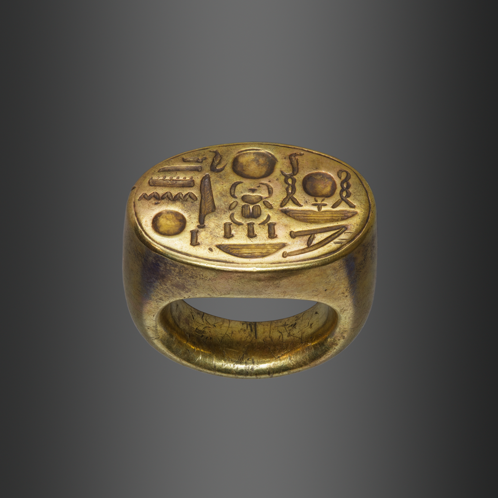

# Human-made Things in the Bible

## License Information

Human-made Things in the Bible © United Bible Societies, 2025. Adapted from: <cite>The Works of Their Hands: Man-made Things in the Bible</cite>, by Ray Pritz © 2009 United Bible Societies. This work is licensed under Creative Commons Attribution-ShareAlike 4.0 International (<a href="https://creativecommons.org/licenses/by-sa/4.0/">https://creativecommons.org/licenses/by-sa/4.0/</a>).

--------------------------------

## Seal, signet ring, ring (id: REALIA:10.2)

10\.2 Seal, signet ring, ring
=============================

References:
-----------

Hebrew חתם, חוֹתָם, חוֹתֶמֶת (chatham, chotham, chothemeth)

[GEN 38:18](https://ref.ly/Gen38:18), [GEN 38:25](https://ref.ly/Gen38:25), [EXO 28:11](https://ref.ly/Exod28:11), [EXO 28:21](https://ref.ly/Exod28:21), [EXO 28:36](https://ref.ly/Exod28:36), [EXO 39:6](https://ref.ly/Exod39:6), [EXO 39:14](https://ref.ly/Exod39:14), [EXO 39:30](https://ref.ly/Exod39:30), [DEU 32:34](https://ref.ly/Deut32:34), [1KI 21:8](https://ref.ly/1Kgs21:8), [1KI 21:8](https://ref.ly/1Kgs21:8), [NEH 10:1](https://ref.ly/Neh10:1), [NEH 10:2](https://ref.ly/Neh10:2), [EST 3:12](https://ref.ly/Esth3:12), [EST 8:8](https://ref.ly/Esth8:8), [EST 8:8](https://ref.ly/Esth8:8), [EST 8:10](https://ref.ly/Esth8:10), [JOB 38:14](https://ref.ly/Job38:14), [JOB 41:7](https://ref.ly/Job41:7), [SNG 8:6](https://ref.ly/Song8:6), [SNG 8:6](https://ref.ly/Song8:6), [ISA 8:16](https://ref.ly/Isa8:16), [ISA 29:11](https://ref.ly/Isa29:11), [ISA 29:11](https://ref.ly/Isa29:11), [JER 22:24](https://ref.ly/Jer22:24), [JER 32:10](https://ref.ly/Jer32:10), [JER 32:11](https://ref.ly/Jer32:11), [JER 32:14](https://ref.ly/Jer32:14), [JER 32:44](https://ref.ly/Jer32:44), [EZK 28:12](https://ref.ly/Ezek28:12), [DAN 12:4](https://ref.ly/Dan12:4), [DAN 12:9](https://ref.ly/Dan12:9), [HAG 2:23](https://ref.ly/Hag2:23)

Aramaic עִזְקָה (‘izqah)

[DAN 6:18](https://ref.ly/Dan6:18)

Hebrew טַבַּעַת (taba‘ath)

[GEN 41:42](https://ref.ly/Gen41:42), [EXO 35:22](https://ref.ly/Exod35:22), [NUM 31:50](https://ref.ly/Num31:50), [EST 3:10](https://ref.ly/Esth3:10), [EST 3:12](https://ref.ly/Esth3:12), [EST 8:2](https://ref.ly/Esth8:2), [EST 8:8](https://ref.ly/Esth8:8), [EST 8:8](https://ref.ly/Esth8:8), [EST 8:10](https://ref.ly/Esth8:10), [ISA 3:21](https://ref.ly/Isa3:21)

Greek δακτύλιος (daktulios)

[LUK 15:22](https://ref.ly/Luke15:22), [TOB 1:22](https://ref.ly/Tob1:22), [JDT 10:4](https://ref.ly/Jdt10:4), [BEL 1:14](https://ref.ly/Bel1:14), [BEL 1:14](https://ref.ly/Bel1:14), [1MA 6:15](https://ref.ly/1Macc6:15)

Greek σφραγίς, σφραγίζω, κατασφραγίζω (sfragis, sfragizō (verb), katasfragizō (verb))

[MAT 27:66](https://ref.ly/Matt27:66), [JHN 3:33](https://ref.ly/John3:33), [JHN 6:27](https://ref.ly/John6:27), [ROM 4:11](https://ref.ly/Rom4:11), [1CO 9:2](https://ref.ly/1Cor9:2), [2CO 1:22](https://ref.ly/2Cor1:22), [EPH 1:13](https://ref.ly/Eph1:13), [EPH 4:30](https://ref.ly/Eph4:30), [2TI 2:19](https://ref.ly/2Tim2:19), [REV 5:1](https://ref.ly/Rev5:1), [REV 5:1](https://ref.ly/Rev5:1), [REV 5:2](https://ref.ly/Rev5:2), [REV 5:5](https://ref.ly/Rev5:5), [REV 5:9](https://ref.ly/Rev5:9), [REV 6:1](https://ref.ly/Rev6:1), [REV 6:3](https://ref.ly/Rev6:3), [REV 6:5](https://ref.ly/Rev6:5), [REV 6:7](https://ref.ly/Rev6:7), [REV 6:9](https://ref.ly/Rev6:9), [REV 6:12](https://ref.ly/Rev6:12), [REV 7:2](https://ref.ly/Rev7:2), [REV 7:3](https://ref.ly/Rev7:3), [REV 7:4](https://ref.ly/Rev7:4), [REV 7:4](https://ref.ly/Rev7:4), [REV 7:5](https://ref.ly/Rev7:5), [REV 7:8](https://ref.ly/Rev7:8), [REV 8:1](https://ref.ly/Rev8:1), [REV 9:4](https://ref.ly/Rev9:4), [REV 10:4](https://ref.ly/Rev10:4), [REV 20:3](https://ref.ly/Rev20:3), [REV 22:10](https://ref.ly/Rev22:10)

Greek χρυσοδακτύλιος (chrusodaktulios)

[JAS 2:2](https://ref.ly/Jas2:2)

Latin consigno (verb)

[2ES 6:5](https://ref.ly/2Esd6:5)

Latin signaculum

[2ES 7:104](https://ref.ly/2Esd7:104), [2ES 10:23](https://ref.ly/2Esd10:23)

Latin signo (verb)

[2ES 2:38](https://ref.ly/2Esd2:38), [2ES 8:53](https://ref.ly/2Esd8:53)

Latin supersignabitur

[2ES 6:20](https://ref.ly/2Esd6:20)

Description and usage:
----------------------

*(Image generated by ChatGPT using OpenAI technology)*

The seal, or signet, was an engraved object used to make a mark denoting ownership, approval, or closure of something. It was an important object in common use among persons of rank. It was a symbol of ownership and was used to seal contracts and other secret or confidential documents, and even as a mark of personal identification (see [GEN 38:18](https://ref.ly/Gen38:18)). It was either round or (more frequently) oval and was pressed onto fresh clay before it was fired, or onto hot wax, which was left to cool showing its imprint. It could be applied to a document or letter or the object to be closed. The seal itself was engraved with a reverse image, so that the impression would come out correctly. It sometimes carried some figure or symbol, in addition to the owner’s occupation, office, or status. The seal was made from some precious stone and was normally inseparable from its owner, who wore it either mounted in a ring or attached to a cord around the neck.

*Signet ring (Metropolitan Museum of Art, Public domain, MMA)*

Important or confidential letters or legal documents that had to be kept private were sealed. Those written on papyrus (and later on vellum and parchment) were rolled and tied, and a seal was affixed to the knot. The seal had to be broken before the scroll could be unrolled. When the writing was on a clay tablet or potsherd, it was encased in a sort of clay envelope. If the writing was a contract or other legal document, a summary of its contents was sometimes inscribed on the envelope. A separate copy of a document might be kept in another place (see [JER 32:14](https://ref.ly/Jer32:14)).

---

Translation:
------------

*Seal on a cord (© Deutsche Bibelgesellschaft, Stuttgart by United Bible Societies)*

In some languages the closest equivalent to “seal” or “signet” is the mark made by the seal, for example, “symbol of his name” or “mark of his ownership,” or a translator may use a term for “rubber stamp,” as long as it does not explicitly refer to rubber or to ink. In some passages translators may employ a phrase such as “instrument by which a mark is made.”

The Hebrew word *taba‘ath* comes from a root meaning “to stamp an impression.” This indicates that its original purpose was to serve as a signet as described above. However, rings were also worn as decorative jewelry, and such rings are probably referred to in [EXO 35:22](https://ref.ly/Exod35:22) and [NUM 31:50](https://ref.ly/Num31:50). While finger rings are widely known, signet rings are less well known. Thus, it may be necessary to expand the expression for it; for example, NCV (New Century Version) expands the literal phrase “his ring” in [GEN 41:42](https://ref.ly/Gen41:42) to “his ring with the royal seal on it.” GNT (Good News Translation (1992)) says “the ring engraved with the royal seal,” and SPCL (Spanish Common Language Version (Dios Habla Hoy)) has “the ring which held his official seal.” In [EST 3:10](https://ref.ly/Esth3:10)GNT (Good News Translation (1992)) is even more expansive with “his ring, which was used to stamp proclamations and make them official.” However, some translators may prefer to place such a long explanation in a footnote.

[MAT 27:66](https://ref.ly/Matt27:66): No one is quite certain what is meant by the act of “sealing the tomb” in this verse. One scholar has suggested that a rope was drawn over the stone and then a seal attached to it. Others believe that the sealing was done by means of filling the space between the face of the rock and the stone used for a door with soft clay, and then stamping on the seal of the Jewish authorities. Since sealing is not known in all societies, a possible translation for the end of this verse is “they put a mark on the stone to know if it was moved” or “they put their mark on the stone so no one would move it.”

* **Associated Passages:** Genesis 38:18; Genesis 38:25; Exodus 28:11; Exodus 28:21; Exodus 28:36; Exodus 39:6; Exodus 39:14; Exodus 39:30; Deuteronomy 32:34; 1 Kings 21:8; Nehemiah 10:1; Nehemiah 10:2; Esther 3:12; Esther 8:8; Esther 8:10; Job 38:14; Job 41:7; Song of Songs 8:6; Isaiah 8:16; Isaiah 29:11; Jeremiah 22:24; Jeremiah 32:10; Jeremiah 32:11; Jeremiah 32:14; Jeremiah 32:44; Ezekiel 28:12; Daniel 12:4; Daniel 12:9; Haggai 2:23; Daniel 6:18; Genesis 41:42; Exodus 35:22; Numbers 31:50; Esther 3:10; Esther 8:2; Isaiah 3:21; Luke 15:22; Tobit 1:22; Judith 10:4; Bel and the Dragon 1:14; 1 Maccabees 6:15; Matthew 27:66; John 3:33; John 6:27; Romans 4:11; 1 Corinthians 9:2; 2 Corinthians 1:22; Ephesians 1:13; Ephesians 4:30; 2 Timothy 2:19; Revelation 5:1; Revelation 5:2; Revelation 5:5; Revelation 5:9; Revelation 6:1; Revelation 6:3; Revelation 6:5; Revelation 6:7; Revelation 6:9; Revelation 6:12; Revelation 7:2; Revelation 7:3; Revelation 7:4; Revelation 7:5; Revelation 7:8; Revelation 8:1; Revelation 9:4; Revelation 10:4; Revelation 20:3; Revelation 22:10; James 2:2; 2 Esdras (Latin) 6:5; 2 Esdras (Latin) 7:104; 2 Esdras (Latin) 10:23; 2 Esdras (Latin) 2:38; 2 Esdras (Latin) 8:53; 2 Esdras (Latin) 6:20

