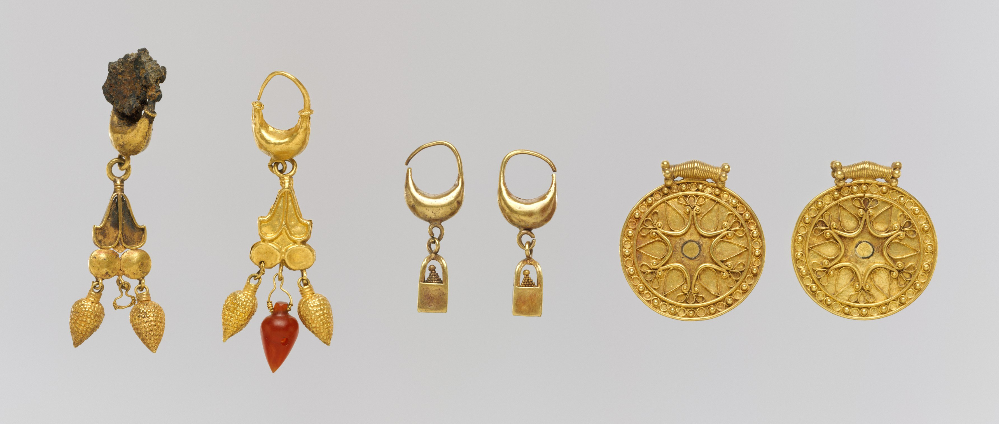
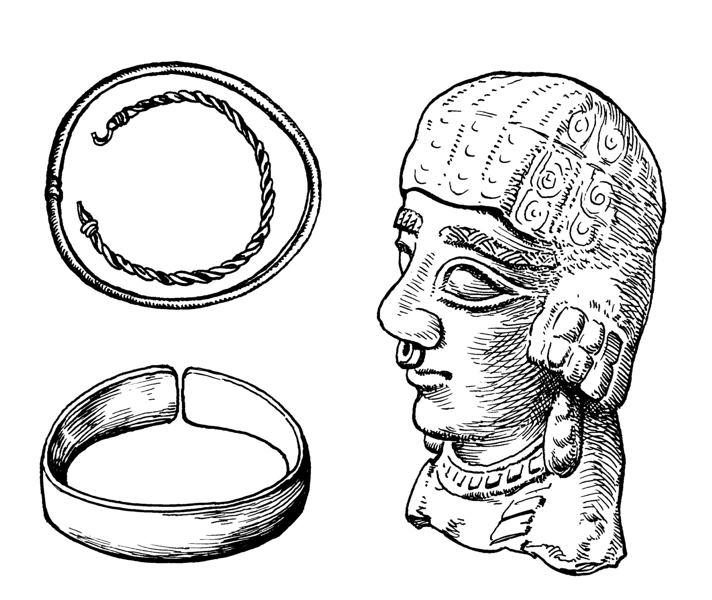

# Human-made Things in the Bible

## License Information

Human-made Things in the Bible © United Bible Societies, 2025. Adapted from: <cite>The Works of Their Hands: Man-made Things in the Bible</cite>, by Ray Pritz © 2009 United Bible Societies. This work is licensed under Creative Commons Attribution-ShareAlike 4.0 International (<a href="https://creativecommons.org/licenses/by-sa/4.0/">https://creativecommons.org/licenses/by-sa/4.0/</a>).

--------------------------------

## Earring, nose ring (id: REALIA:10.5.1)

10\.5\.1 Earring, nose ring
===========================

References:
-----------

Hebrew נֶזֶם (nezem)

[GEN 24:22](https://ref.ly/Gen24:22), [GEN 24:30](https://ref.ly/Gen24:30), [GEN 24:47](https://ref.ly/Gen24:47), [GEN 35:4](https://ref.ly/Gen35:4), [EXO 32:2](https://ref.ly/Exod32:2), [EXO 32:3](https://ref.ly/Exod32:3), [EXO 35:22](https://ref.ly/Exod35:22), [JDG 8:24](https://ref.ly/Judg8:24), [JDG 8:24](https://ref.ly/Judg8:24), [JDG 8:25](https://ref.ly/Judg8:25), [JDG 8:26](https://ref.ly/Judg8:26), [JOB 42:11](https://ref.ly/Job42:11), [PRO 11:22](https://ref.ly/Prov11:22), [PRO 25:12](https://ref.ly/Prov25:12), [ISA 3:21](https://ref.ly/Isa3:21), [EZK 16:12](https://ref.ly/Ezek16:12), [HOS 2:15](https://ref.ly/Hos2:15)

Hebrew עָגִיל (‘agil)

[NUM 31:50](https://ref.ly/Num31:50), [EZK 16:12](https://ref.ly/Ezek16:12)

Greek ἐνώτιον (enōtion)

[JDT 10:4](https://ref.ly/Jdt10:4)

Description and usage:
----------------------

*Gold earrings (Metropolitan Museum of Art, Public domain, MMA)*

The earring was worn on the ear and the nose ring in the nose for decoration. They were small rings, usually made of silver or gold. They could have more or less elaborate decorative work attached to them.

---

Translation:
------------

The Hebrew word *nezem* refers to a ring that could be worn in the ear or in the nose. In either case, it was worn as decorative jewelry.

*Nose rings (© Deutsche Bibelgesellschaft, Stuttgart by United Bible Societies)*

The Hebrew word *‘agil* in [EZK 16:12](https://ref.ly/Ezek16:12) clearly refers to an earring, and this is probably the case in [NUM 31:50](https://ref.ly/Num31:50) also.

*(Image generated by ChatGPT using OpenAI technology)*

The Greek word *enōtion* in [JDT 10:4](https://ref.ly/Jdt10:4) specifically indicates a ring worn in the ear, not in the nose.

* **Associated Passages:** Genesis 24:22; Genesis 24:30; Genesis 24:47; Genesis 35:4; Exodus 32:2; Exodus 32:3; Exodus 35:22; Judges 8:24; Judges 8:25; Judges 8:26; Job 42:11; Proverbs 11:22; Proverbs 25:12; Isaiah 3:21; Ezekiel 16:12; Hosea 2:15; Numbers 31:50; Judith 10:4

