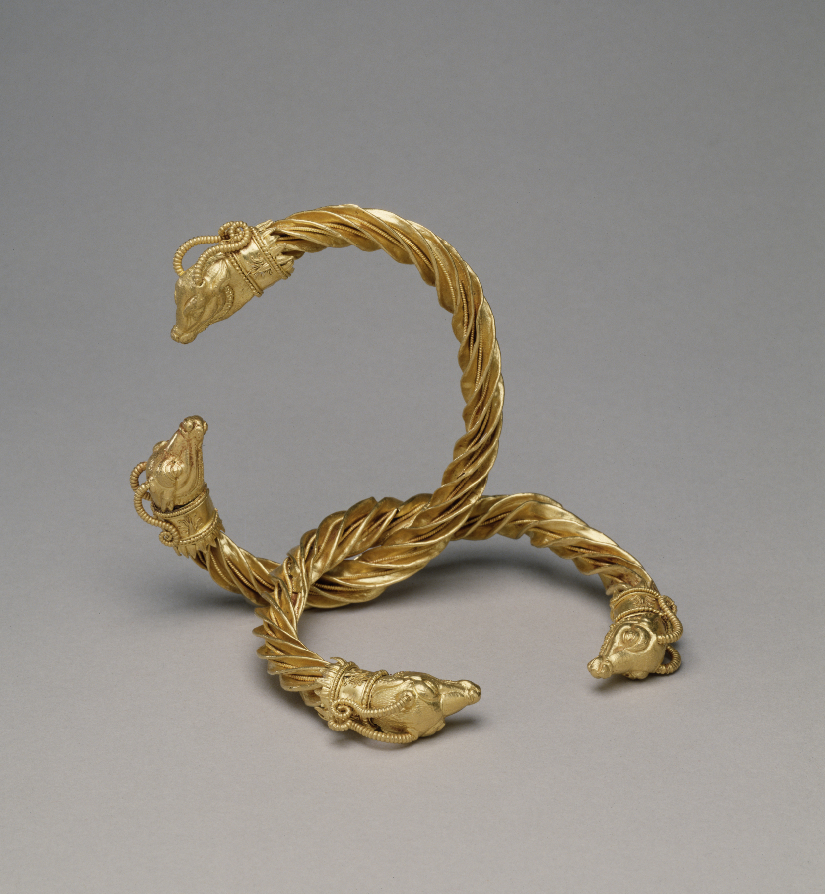

# Human-made Things in the Bible

## License Information

Human-made Things in the Bible © United Bible Societies, 2025. Adapted from: <cite>The Works of Their Hands: Man-made Things in the Bible</cite>, by Ray Pritz © 2009 United Bible Societies. This work is licensed under Creative Commons Attribution-ShareAlike 4.0 International (<a href="https://creativecommons.org/licenses/by-sa/4.0/">https://creativecommons.org/licenses/by-sa/4.0/</a>).

--------------------------------

## Bracelet, armlet, anklet (id: REALIA:10.5.2)

10\.5\.2 Bracelet, armlet, anklet
=================================

References:
-----------

Hebrew אֶצְעָדָה (’ets‘adah)

[NUM 31:50](https://ref.ly/Num31:50), [2SA 1:10](https://ref.ly/2Sam1:10)

Hebrew עֶכֶס (‘ekes)

[ISA 3:18](https://ref.ly/Isa3:18)

Hebrew צָמִיד (tsamid)

[GEN 24:22](https://ref.ly/Gen24:22), [GEN 24:30](https://ref.ly/Gen24:30), [GEN 24:47](https://ref.ly/Gen24:47), [NUM 31:50](https://ref.ly/Num31:50), [EZK 16:11](https://ref.ly/Ezek16:11), [EZK 23:42](https://ref.ly/Ezek23:42)

Hebrew צְעָדָה (ts‘adah)

[ISA 3:20](https://ref.ly/Isa3:20)

Greek χλιδών (chlidōn)

[JDT 10:4](https://ref.ly/Jdt10:4), [SIR 21:21](https://ref.ly/Sir21:21)

Greek ψέλιον (pselion)

[JDT 10:4](https://ref.ly/Jdt10:4)

Description:
------------

*Bracelets with antelope\-head ends (Walters Art Museum, Public domain, CC BY\-SA 3\.0, via Wikimedia Commons)*

The bracelet/armlet was a piece of jewelry worn on the wrist/arm. It was round and made of metal.

---

Translation:
------------

The bracelet was worn on the wrist while the armlet was pushed up the arm, usually above the elbow. Where a distinction must be made between one part of the arm and another, the Hebrew word *tsamid* in [EZK 16:11](https://ref.ly/Ezek16:11) may be translated “bracelets on your wrists.”

[NUM 31:50](https://ref.ly/Num31:50): Where different words do not exist for a ring worn on the wrist and a ring worn on the upper arm, it is possible to use an inclusive term in this verse; for example, CEV (Contemporary English Version) has “jewelry” (CEV (Contemporary English Version)).

Translators must be careful not to use a word that indicates an object worn on the arm but that is made of something other than metal. For example, CEV (Contemporary English Version) has “arm\-band” in [2SA 1:10](https://ref.ly/2Sam1:10), but this could be misunderstood in modern English to mean an insignia made of cloth or plastic.

For the Hebrew words *‘ekes* and *ts‘adah*, see the discussion on [ISA 3:18–ISA 3:23](https://ref.ly/Isa3:18-Isa3:23) at [10\.5 Jewelry, ornaments\<REALIA:10\.5\>](#).

In [JDT 10:4](https://ref.ly/Jdt10:4) the two Greek words *chlidōn* and *pselion* can both mean “bracelet“ (for the arm) and “anklet” (for the leg). Where two distinct words exist, they can both be used. It is also possible to say something like “decorative metal bands for the wrist and the ankle.”

* **Associated Passages:** Numbers 31:50; 2 Samuel 1:10; Isaiah 3:18; Genesis 24:22; Genesis 24:30; Genesis 24:47; Ezekiel 16:11; Ezekiel 23:42; Isaiah 3:20; Judith 10:4; Sirach 21:21; Isaiah 3:23

